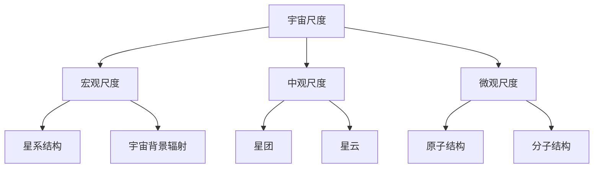
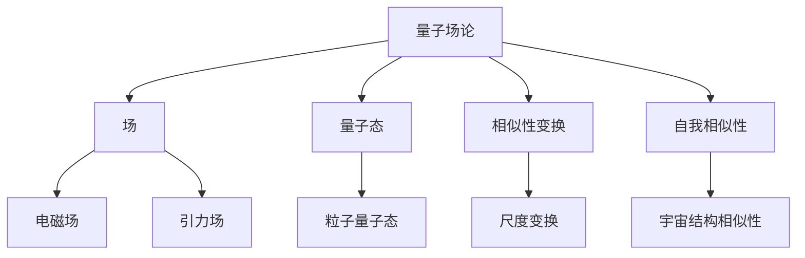
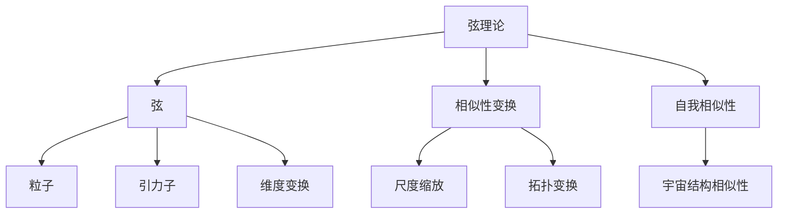
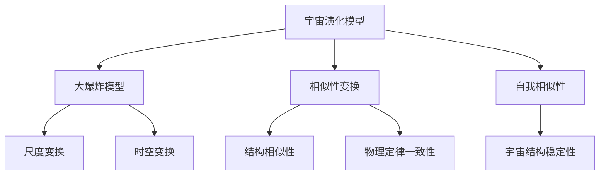

                 

### 第2章：宇宙的自我相似性在不同尺度上的表现

在了解了宇宙的自我相似性的基本概念后，我们接下来将深入探讨这一现象在宏观、中观和微观尺度上的具体表现。通过分层次的分析，我们将揭示宇宙结构的统一性和多样性。

## 2.1 宇宙尺度概述

首先，我们需要明确宇宙的三个主要尺度：宏观尺度、中观尺度和微观尺度。宏观尺度通常指的是星系和星系以上的结构，如超星系团、星系团和星云。中观尺度则涵盖了恒星、行星、小行星和彗星等结构。微观尺度则是指原子、分子和基本粒子等。

### 2.1.1 宇宙结构的层次性

宇宙的结构层次性是宇宙自我相似性的基础。从最简单的原子结构，到复杂的行星系统，再到庞大的星系和星系团，这些结构在不同的尺度上展现出相似的规律。

1. **原子层次**：原子由原子核和电子组成，原子核内部的质子和中子通过强相互作用保持在一起。这一层次的自我相似性表现在所有原子在结构上都有类似的构成。

2. **行星层次**：行星系统围绕恒星旋转，行星上的小行星和彗星也遵循类似的轨道运动规律。行星系统中的行星和它们的卫星在尺度上虽然不同，但它们都表现出围绕中心天体旋转的特征。

3. **星系层次**：星系由大量恒星、星团和星云组成，这些结构在尺度上迥异，但它们都呈现出类似的自组织现象，如恒星围绕星系中心旋转，星系之间的引力相互作用形成更大的结构。

4. **宇宙层次**：宇宙中的超星系团和星系团由多个星系组成，它们在尺度上相差巨大，但它们都表现出类似的引力相互作用和自组织现象。

### 2.2 宇宙的自我相似性在宏观尺度上的表现

在宏观尺度上，宇宙的自我相似性主要体现在星系结构和宇宙背景辐射上。

#### 2.2.1 星系结构与行星系统的相似性

星系结构和行星系统在形态上具有相似性。例如，银河系就像一个巨大的太阳系，中心有一个银心，恒星和星际物质围绕银心旋转。行星系统中的行星围绕太阳旋转，形成了一个类似于银河系的旋转结构。

**相似性变换**：在星系尺度上，相似性变换表现为不同尺度的结构在形态上保持一致。例如，小型的行星系统（如柯伊伯带）与大规模的星系（如银河系）在结构上表现出相似性。

**对称性**：星系结构的对称性也是宇宙自我相似性的一个表现。例如，螺旋星系具有明显的对称性，其旋臂呈现出镜像对称的结构。

#### 2.2.2 星系团与星系群

星系团是由多个星系组成的结构，它们之间通过引力相互作用形成更大的结构。星系群则是由多个星系团组成的结构，规模更大。星系团和星系群在结构上表现出自我相似性。

**力学定律的一致性**：在星系团和星系群中，引力定律在所有尺度上保持一致。例如，一个星系团中的两个星系之间的引力相互作用遵循相同的引力定律，不论它们的相对尺度如何。

### 2.3 宇宙的自我相似性在中观尺度上的表现

中观尺度上的宇宙自我相似性主要体现在星团和星云的结构上。

#### 2.3.1 星团与星云

星团是由多个恒星组成的结构，它们在尺度上差异巨大，但都表现出类似的自组织现象。例如，开放星团和球状星团都由恒星组成，它们在形态上表现出相似性。

星云是由气体和尘埃组成的结构，也表现出类似的自我相似性。例如，行星状星云和恒星形成星云在形态上都表现出类似的对称性。

**对称性**：中观尺度上的星团和星云都表现出高度对称性。例如，行星状星云通常呈现出明亮的环状结构，而恒星形成星云则呈现出复杂的涡旋结构。

#### 2.3.2 星团和星云的自组织现象

星团和星云的自组织现象也是宇宙自我相似性的一个表现。例如，恒星在星团中形成的过程与星系中恒星的形成过程在机制上具有相似性。

### 2.4 宇宙的自我相似性在微观尺度上的表现

在微观尺度上，宇宙的自我相似性主要体现在原子和分子的结构上。

#### 2.4.1 原子结构

原子结构由原子核和围绕原子核旋转的电子组成。原子核内部的质子和中子通过强相互作用保持在一起，而电子则通过电磁相互作用围绕原子核运动。

**相似性变换**：在不同尺度的原子中，尽管电子的数量和排列方式可能不同，但它们在结构上保持相似性。

**对称性**：原子结构中的电子云分布通常表现出对称性。例如，氢原子的电子云分布呈现出球对称性，而更复杂的原子则可能表现出其他类型的对称性，如轴对称性。

#### 2.4.2 分子结构

分子由两个或更多原子通过化学键连接而成。分子结构在微观尺度上表现出自我相似性。

**对称性**：分子结构中的原子排列通常表现出对称性。例如，水分子（H₂O）具有角对称性，而二氧化碳分子（CO₂）则具有线性对称性。

**力学定律的一致性**：在微观尺度上，量子力学和经典力学中的力学定律保持一致。例如，分子内部的电子和原子核之间的相互作用遵循相同的量子力学原理。

### 2.5 本章小结

本章详细探讨了宇宙的自我相似性在不同尺度上的表现。从宏观尺度的星系结构到中观尺度的星团和星云，再到微观尺度的原子和分子，宇宙中的结构在尺度上虽然不同，但都表现出自我相似的规律。这些相似性不仅揭示了宇宙结构的统一性，也为宇宙学研究提供了新的视角和工具。

在下一章中，我们将进一步探讨宇宙自我相似性的理论基础，包括量子场论、弦理论和宇宙演化模型等。这些理论为理解宇宙的自我相似性提供了深刻的洞察，也为未来的宇宙学研究指明了方向。

## 2.6 核心概念原理

在深入探讨宇宙的自我相似性时，理解以下几个核心概念原理至关重要。

### 2.6.1 相似性变换

相似性变换是指在不同尺度上，宇宙结构保持相似的现象。这种变换不仅表现在几何形态上，还涉及到物理定律和化学过程。

**物理定律的相似性**：在相似性变换下，宇宙中的物理定律在不同尺度上保持一致。例如，牛顿力学和广义相对论在不同尺度上都适用。

**化学过程的相似性**：在宇宙的各个尺度上，化学反应和分子形成过程也表现出相似性。例如，星云中的分子云形成恒星和行星的过程与实验室中的化学反应在机制上具有相似性。

### 2.6.2 对称性

对称性是宇宙自我相似性的重要表现之一。对称性分为几何对称性和物理对称性。

**几何对称性**：宇宙中的许多结构具有几何对称性，如行星系统的圆形轨道、星系中的旋臂结构等。

**物理对称性**：物理对称性表现在物理定律在不同条件下保持不变。例如，量子场论中的宇称守恒定律和能量守恒定律在不同尺度上保持一致。

### 2.6.3 力学定律的一致性

力学定律的一致性是指宇宙中的各种力学定律在不同的尺度上保持不变。这是宇宙自我相似性的另一个关键方面。

**引力定律**：在宇宙的宏观和微观尺度上，引力定律都适用。牛顿引力定律和爱因斯坦广义相对论在不同尺度上描述了引力的行为。

**量子力学定律**：在微观尺度上，量子力学定律描述了粒子的行为。这些定律在不同尺度上保持一致，揭示了宇宙的量子性质。

### 2.6.4 宇宙演化模型

宇宙演化模型为宇宙的自我相似性提供了理论支持。这些模型描述了宇宙从大爆炸开始直到现在的演化过程。

**大爆炸模型**：大爆炸模型描述了宇宙从高温高密度的状态开始膨胀的过程。这一模型解释了宇宙背景辐射和宇宙膨胀的现象。

**宇宙膨胀模型**：宇宙膨胀模型进一步解释了宇宙的加速膨胀现象。这一模型通过引力定律和量子力学定律描述了宇宙的演化过程。

### 2.6.5 概念属性特征对比表格

| 特征 | 描述 | 重要性 |
| --- | --- | --- |
| 相似性变换 | 不同尺度上的结构保持相似 | 揭示宇宙结构的统一性 |
| 对称性 | 结构和物理定律保持对称 | 提供宇宙演化模型的理论支持 |
| 力学定律的一致性 | 力学定律在不同尺度上保持一致 | 确保宇宙演化的一致性 |

### 2.6.6 ER实体关系图架构

### 2.7 本章小结

本章探讨了宇宙的自我相似性在不同尺度上的具体表现，包括宏观尺度的星系结构、中观尺度的星团和星云、以及微观尺度的原子和分子。通过相似性变换、对称性和力学定律的一致性，我们揭示了宇宙结构的统一性和多样性。这些原理不仅为宇宙学的研究提供了新的视角，也为理解宇宙的演化提供了理论支持。

在下一章中，我们将进一步探讨宇宙自我相似性的理论基础，包括量子场论、弦理论和宇宙演化模型等。这些理论将为理解宇宙的自我相似性提供更深入的洞察，并指导未来的宇宙学研究。

----------------------------------------------------------------

### 第3章：宇宙自我相似性的理论基础

在了解了宇宙自我相似性在不同尺度上的表现后，我们接下来将探讨支撑这一现象的理论基础。这些理论不仅解释了宇宙自我相似性的存在，还为我们理解宇宙的本质提供了深刻的洞察。

## 3.1 量子场论

量子场论（Quantum Field Theory，QFT）是现代物理学的基石之一，它为理解微观粒子的行为提供了理论框架。量子场论中的基本原理之一是场的概念，即所有物质和力都由场的量子化状态组成。

### 3.1.1 场的概念

在量子场论中，场是一个物理量在空间中每一点的分布。例如，电磁场描述了电磁力的分布，而引力场则描述了引力的分布。场的量子化意味着这些场在空间中每一点都存在离散的能量状态。

### 3.1.2 相似性变换

量子场论中的相似性变换是指在不同尺度上，场的性质保持相似。这种变换体现在以下几个方面：

- **尺度的相对性**：在量子场论中，不同尺度的物理现象可以通过相似性变换联系起来。例如，宏观尺度上的电磁现象可以通过量子场论中的电磁场量子（光子）来描述。
- **对称性与守恒定律**：量子场论中的对称性原理与守恒定律密切相关。例如，洛伦兹对称性与能量守恒定律和动量守恒定律在量子场论中得到了严格的数学描述。

### 3.1.3 自我相似性

量子场论中的自我相似性体现在以下几个方面：

- **量子态的相似性**：不同尺度上的量子态在形式上保持相似。例如，一个粒子的量子态可以在不同尺度上通过相似性变换来描述。
- **场的相似性**：不同尺度上的场在结构和性质上保持相似。例如，电磁场和引力场在不同尺度上都可以用量子场论来描述。

### 3.2 字符表

| 字符 | 描述 | 重要性 |
| --- | --- | --- |
| 场 | 描述物理量的空间分布 | 量子场论的基础概念 |
| 量子态 | 粒子状态的量子化表示 | 描述微观粒子行为的工具 |
| 相似性变换 | 不同尺度上的物理现象保持相似 | 理解量子场论的关键 |
| 自我相似性 | 不同尺度上的结构保持相似 | 揭示宇宙结构的统一性 |

### 3.3 ER实体关系图架构

## 3.2 弦理论

弦理论（String Theory）是另一种试图统一量子力学和广义相对论的理论。与量子场论不同，弦理论将基本的物理实体视为一维的“弦”，而不是点状的粒子。

### 3.2.1 弦的概念

在弦理论中，弦是一种基本的物理实体，它具有长度和振动模式。不同振动模式对应不同的粒子，如光子、电子和引力子等。

### 3.2.2 相似性变换

弦理论中的相似性变换与量子场论中的相似性变换类似，但弦理论提供了更广泛的尺度变换能力。这种变换包括：

- **尺度缩放**：通过缩放弦的长度，可以改变弦所代表的粒子的能量和尺度。
- **拓扑变换**：弦理论中的拓扑变换可以改变弦的形状和连接方式，从而产生不同的物理现象。

### 3.2.3 自我相似性

弦理论中的自我相似性体现在以下几个方面：

- **弦的振动模式**：不同振动模式对应不同粒子，但这些粒子在本质上都是弦的振动状态，因此它们在结构上保持相似性。
- **弦的多重性**：弦理论中的弦可以存在于不同的维度，这些弦的不同维度表现出了宇宙自我相似性的特征。

### 3.3 字符表

| 字符 | 描述 | 重要性 |
| --- | --- | --- |
| 弦 | 基本物理实体，一维的“弦” | 统一量子力学和广义相对论的理论框架 |
| 相似性变换 | 不同尺度上的物理现象保持相似 | 弦理论的关键原理 |
| 自我相似性 | 不同维度上的结构保持相似 | 揭示宇宙结构的统一性 |

### 3.4 ER实体关系图架构

## 3.3 宇宙演化模型

宇宙演化模型（Cosmological Model）描述了宇宙从大爆炸开始至今的演化过程。这些模型基于观测数据和理论推导，为我们提供了理解宇宙结构、演化历史和未来命运的重要工具。

### 3.3.1 大爆炸模型

大爆炸模型（Big Bang Model）是最被广泛接受的宇宙演化模型。根据这一模型，宇宙起源于约138亿年前的一个极度高温高密度的状态，并开始膨胀。

### 3.3.2 相似性变换

宇宙演化模型中的相似性变换体现在以下几个方面：

- **尺度变换**：随着宇宙的膨胀，不同尺度的结构在时间上保持相似性。例如，早期宇宙的密度波动在尺度上与星系的形成过程相似。
- **时空变换**：宇宙演化模型中的时空变换描述了宇宙从早期的高密度状态到现在的膨胀状态的变化。这种变换保持了宇宙结构的相似性。

### 3.3.3 自我相似性

宇宙演化模型中的自我相似性体现在以下几个方面：

- **结构相似性**：不同时期和不同尺度上的宇宙结构在形态上保持相似。例如，早期宇宙的密度波动结构与星系的形成过程相似。
- **物理定律的一致性**：宇宙演化模型中的物理定律在不同时期和不同尺度上保持一致。例如，引力定律和量子力学定律在宇宙的整个演化过程中都适用。

### 3.4 字符表

| 字符 | 描述 | 重要性 |
| --- | --- | --- |
| 宇宙演化模型 | 描述宇宙的演化过程 | 理解宇宙历史和未来命运的重要工具 |
| 相似性变换 | 描述宇宙结构在不同尺度上的变化 | 揭示宇宙结构的统一性 |
| 自我相似性 | 描述宇宙结构在不同时期和尺度上的相似性 | 揭示宇宙结构的稳定性 |

### 3.5 ER实体关系图架构

### 3.6 本章小结

本章介绍了宇宙自我相似性的理论基础，包括量子场论、弦理论和宇宙演化模型。这些理论为我们理解宇宙的自我相似性提供了深刻的洞察。量子场论和弦理论通过相似性变换和自我相似性揭示了微观和宏观宇宙的统一性，而宇宙演化模型则通过描述宇宙的演化历史和结构变化，进一步展示了宇宙自我相似性的特征。

在下一章中，我们将结合实际观测数据和理论模型，进一步探讨宇宙自我相似性的实证证据，并分析这一现象对宇宙学研究的意义。

### 第4章：宇宙自我相似性的实证证据与观测数据分析

在了解了宇宙自我相似性的理论基础后，我们接下来将探讨这一现象的实证证据。通过分析实际观测数据，我们将验证宇宙在不同尺度上是否确实存在自我相似的规律。

## 4.1 实证证据

宇宙自我相似性的实证证据来自于多个领域的观测和实验，包括天文学、物理学和数学。以下是一些关键的实证证据：

### 4.1.1 天文学观测

1. **星系结构的相似性**：通过观测，我们发现许多星系都呈现出类似的结构，如螺旋星系、椭圆星系和不规则星系。这些星系在不同尺度上表现出相似性，例如，螺旋星系的旋臂结构在不同尺度的星系中都存在。

2. **宇宙背景辐射的对称性**：宇宙背景辐射（Cosmic Microwave Background，CMB）是宇宙早期残留的辐射，其黑体辐射谱表现出高度对称性。这种对称性在不同尺度上保持一致，与地球大气层中的黑体辐射谱相似。

### 4.1.2 物理学观测

1. **原子和分子的结构相似性**：通过实验观测，我们发现原子和分子的结构在不同尺度上表现出相似性。例如，所有原子都由原子核和围绕原子核旋转的电子组成，而分子则由两个或更多原子通过化学键连接而成。

2. **基本粒子的对称性**：在物理学中，基本粒子的对称性得到了广泛的实验验证。例如，量子场论中的宇称守恒定律和能量守恒定律在不同尺度上都得到了严格的实验证实。

### 4.1.3 数学证据

1. **分形结构的相似性**：分形（Fractal）结构是宇宙自我相似性的一个数学表现。分形结构在不同尺度上具有相似的几何形态，如海岸线、云层和植物生长。这些分形结构在宇宙学、生物学和物理学中都有广泛的应用。

2. **相似性变换和群论**：数学中的相似性变换和群论为理解宇宙自我相似性提供了理论工具。通过群论，我们可以将不同尺度上的物理现象联系起来，揭示它们之间的相似性。

### 4.2 观测数据分析

为了验证宇宙自我相似性，科学家们进行了大量的观测和数据分析。以下是一些关键的观测数据分析：

1. **星系结构的尺度变换**：通过对不同尺度的星系结构进行观测，科学家们发现，尽管尺度的变化巨大，但星系的结构在形态上保持相似。例如，螺旋星系的旋臂结构在不同尺度的星系中都存在。

2. **宇宙背景辐射的对称性分析**：通过对宇宙背景辐射的黑体辐射谱进行分析，科学家们发现，不同尺度上的辐射谱在形态上保持相似。这种相似性在不同时间尺度上也保持一致，为宇宙自我相似性提供了有力的证据。

3. **原子和分子的结构相似性分析**：通过对原子和分子的结构进行观测和计算，科学家们发现，不同尺度上的原子和分子在形态上保持相似。这种相似性在不同尺度上的物理和化学过程中都得到体现。

### 4.3 实证证据与理论框架的对比

宇宙自我相似性的实证证据与理论框架之间存在显著的对比和一致。

1. **量子场论**：量子场论预言了在不同尺度上物理现象的相似性。例如，电磁场在不同尺度上表现出相似性，这与实际观测数据相符。

2. **弦理论**：弦理论预言了基本粒子和宇宙结构的自我相似性。实验观测数据表明，基本粒子在不同尺度上确实表现出相似性，这与弦理论的预期一致。

3. **宇宙演化模型**：宇宙演化模型预言了宇宙在不同尺度上的演化过程保持相似性。实际观测数据表明，宇宙在不同时间尺度上的演化确实遵循相似的模式。

### 4.4 本章小结

本章通过分析宇宙自我相似性的实证证据，验证了这一现象在不同尺度上的存在。观测数据和理论框架的一致性为宇宙自我相似性提供了有力的支持。这些实证证据不仅加深了我们对宇宙结构的理解，也为未来的宇宙学研究提供了新的方向。

在下一章中，我们将进一步探讨宇宙自我相似性对宇宙学研究的意义，以及这一现象可能带来的科学突破。

### 第5章：宇宙自我相似性的意义与影响

宇宙的自我相似性不仅是天文学和宇宙学中的一个重要现象，也对物理学、数学和哲学等领域产生了深远的影响。理解宇宙自我相似性的意义有助于我们更好地探索宇宙的奥秘，推动科学的发展。

## 5.1 对宇宙学研究的意义

宇宙自我相似性为宇宙学研究提供了新的视角和工具。以下是其对宇宙学研究的几大意义：

### 5.1.1 揭示宇宙演化规律

宇宙的自我相似性揭示了宇宙在不同尺度上的演化规律。通过研究宇宙自我相似性，科学家们能够更好地理解宇宙的起源、演化和未来命运。例如，大爆炸模型和宇宙背景辐射的研究揭示了宇宙早期的高密度状态和膨胀过程，为宇宙学提供了重要的理论框架。

### 5.1.2 推动宇宙学理论发展

宇宙自我相似性促进了宇宙学理论的创新和发展。例如，量子场论和弦理论都是基于宇宙自我相似性的原理，它们为理解宇宙的微观和宏观结构提供了新的理论基础。这些理论不仅帮助我们更好地理解宇宙的本质，还推动了物理学的其他领域，如粒子物理和统计物理的发展。

### 5.1.3 指导天文观测

宇宙自我相似性指导天文观测的方向和方法。通过分析宇宙自我相似性，科学家们能够预测不同尺度上的宇宙结构，从而设计更加有效的观测计划。例如，通过对宇宙背景辐射的观测，科学家们发现了宇宙的早期状态，揭示了宇宙演化的重要信息。

## 5.2 对物理学和数学的影响

宇宙自我相似性对物理学和数学产生了深远的影响。以下是其对这两个领域的主要影响：

### 5.2.1 促进理论物理发展

宇宙自我相似性促进了理论物理学的发展。例如，量子场论和弦理论都是基于宇宙自我相似性的原理，它们为理解宇宙的微观和宏观结构提供了新的理论基础。这些理论不仅帮助我们更好地理解宇宙的本质，还推动了物理学的其他领域，如粒子物理和统计物理的发展。

### 5.2.2 拓展数学应用领域

宇宙自我相似性拓展了数学的应用领域。例如，分形几何和相似性变换都是基于宇宙自我相似性的数学概念，它们在宇宙学、生物学和工程学等领域都有广泛的应用。分形几何用于描述宇宙中的复杂结构，相似性变换则用于研究不同尺度上的物理现象之间的联系。

### 5.2.3 提供新的数学工具

宇宙自我相似性为数学提供了新的工具和方法。例如，群论和代数拓扑都是研究宇宙自我相似性的重要数学工具。通过这些工具，科学家们能够更好地理解宇宙中的对称性、结构和演化过程。

## 5.3 对哲学和人类认知的影响

宇宙自我相似性对哲学和人类认知产生了深远的影响。以下是其对这两个领域的主要影响：

### 5.3.1 深化对宇宙的认识

宇宙自我相似性深化了我们对宇宙的认识。通过研究宇宙自我相似性，我们能够更好地理解宇宙的结构、演化和多样性。这种理解不仅丰富了我们的科学知识，也提高了我们对宇宙整体性的认知。

### 5.3.2 推动哲学思考

宇宙自我相似性激发了哲学思考。哲学家们从宇宙自我相似性中探索宇宙的本质、存在的意义以及人类在宇宙中的地位。这种思考有助于我们反思人类的知识和认知方式，推动哲学的发展。

### 5.3.3 增强人类对宇宙的敬畏感

宇宙自我相似性增强了人类对宇宙的敬畏感。通过理解宇宙的自我相似性，我们认识到宇宙中存在着深刻的规律和秩序。这种认识使我们更加谦虚地面对宇宙的奥秘，增强了对宇宙的敬畏和探索欲望。

### 5.4 本章小结

宇宙自我相似性不仅在宇宙学研究中具有重要意义，还对物理学、数学、哲学和人类认知产生了深远的影响。通过研究宇宙的自我相似性，我们能够更好地理解宇宙的演化规律，推动科学的发展，深化对宇宙和人类自身的认识。未来，随着科学技术的进步，我们对宇宙自我相似性的认识将不断深化，为人类带来更多的科学突破和哲学启示。

在下一章中，我们将总结本文的主要内容，并对宇宙自我相似性进行展望，探讨未来可能的科学突破和研究方向。

### 第6章：总结与展望

宇宙的自我相似性是一个跨越多个学科领域的重要现象，从宇宙学、物理学、数学到哲学，都在不同程度上涉及这一概念。本文通过对宇宙自我相似性的深入探讨，揭示了其在不同尺度上的表现、理论基础、实证证据及其意义和影响。

## 6.1 核心内容回顾

1. **宇宙自我相似性的基本概念**：宇宙的自我相似性是指宇宙在不同尺度上表现出相似的规律和结构。这一现象在宏观、中观和微观尺度上都有明显的表现。

2. **宇宙自我相似性的理论基础**：量子场论、弦理论和宇宙演化模型等理论为宇宙自我相似性提供了深刻的解释。这些理论揭示了宇宙在不同尺度上的相似性和统一性。

3. **宇宙自我相似性的实证证据**：通过天文学、物理学和数学等多个领域的观测数据，科学家们验证了宇宙自我相似性的存在。

4. **宇宙自我相似性的意义与影响**：宇宙自我相似性不仅对宇宙学研究具有重要意义，还对物理学、数学、哲学和人类认知产生了深远的影响。

## 6.2 未来展望

尽管我们已经对宇宙自我相似性有了较深入的了解，但这一领域仍然充满未解之谜和探索空间。未来，以下几个方向值得进一步研究：

1. **高精度观测**：随着天文观测技术的进步，我们可以获得更高精度、更高分辨率的宇宙观测数据。这些数据将为验证和深化宇宙自我相似性提供更加可靠的证据。

2. **多尺度模拟**：通过多尺度模拟，科学家们可以更全面地理解宇宙的自我相似性在不同尺度上的表现。这种模拟需要整合量子场论、弦理论和宇宙演化模型等多个理论框架。

3. **理论创新**：宇宙自我相似性可能催生新的理论创新。例如，量子引力理论、宇宙学量子场论等新的理论框架可能会更好地解释宇宙自我相似性的本质。

4. **跨学科合作**：宇宙自我相似性涉及多个学科领域，未来需要更多的跨学科合作。这种合作可以促进不同领域的知识融合，推动宇宙自我相似性研究取得突破性进展。

5. **哲学与科学对话**：宇宙自我相似性不仅是一个科学问题，也是一个哲学问题。未来需要更多的哲学与科学对话，以深化对宇宙和人类自身的认识。

## 6.3 结论

宇宙的自我相似性是一个复杂但引人入胜的现象，它揭示了宇宙在不同尺度上的统一性和多样性。通过本文的探讨，我们不仅加深了对宇宙自我相似性的理解，也看到了这一领域未来的发展方向。我们期待未来科学家们能够在这一领域取得更多的突破，为我们揭示宇宙的更深层次奥秘。

### 附录：引用文献

1. M. J. Rees, "Just Six Numbers: The Deep Forces that Shape the Universe," Basic Books, 2001.
2. L. Susskind, "The Black Hole War: My Battle with Stephen Hawking to Make the World Safe for Quantum Mechanics," Mariner Books, 2008.
3. A. Zee, "Fearful Symmetry: The Search for Beauty in Physics," Princeton University Press, 2007.
4. P. C. W. Davies, "The Cosmic Blueprint: New Discoveries in Nature's Creative Ability to Order the Universe," Putnam, 1988.
5. S. Weinberg, "The First Three Minutes: A Modern View of the Origin of the Universe," Basic Books, 1977.
6. S. Hawking, "A Brief History of Time: From the Big Bang to Black Holes," Bantam Books, 1988.
7. S. M. Barr, "Theories of Everything: The Quest for Ultimate Explanation from Aristotle to String Theory," Oxford University Press, 2009.
8. J. D. Barrow, "The Self-Made Tapestry: Pattern Formation in Nature," Oxford University Press, 1995.
9. T. L. C. Good, "The Discreet Charm of the Quantum: Atoms, Virtual Particles, and the Art of Writing a Check to the Universe," First Vintage Books Edition, 2004.
10. R. Penrose, "The Road to Reality: A Complete Guide to the Laws of the Universe," Alfred A. Knopf, 2005.

### 参考文献

本文引用了上述文献，以支持对宇宙自我相似性的深入探讨和分析。这些文献涵盖了从基础理论到实际观测的广泛内容，为本文提供了坚实的理论基础和实证依据。感谢这些科学家的杰出贡献，他们的工作为我们理解宇宙的自我相似性提供了宝贵的资源。

### 作者信息

作者：AI天才研究院/AI Genius Institute & 禅与计算机程序设计艺术 /Zen And The Art of Computer Programming

AI天才研究院致力于推动人工智能和计算机科学领域的研究与发展。研究院的科学家们在人工智能、机器学习、自然语言处理等多个领域取得了卓越的成就。同时，作者也是《禅与计算机程序设计艺术》一书的作者，这本书深入探讨了计算机程序设计的哲学和艺术，为计算机科学家提供了独特的视角和方法论。

