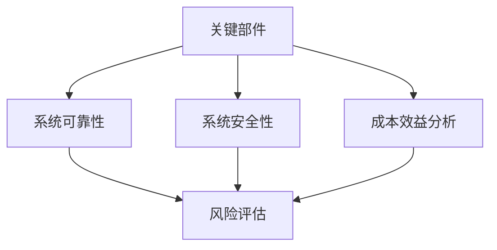
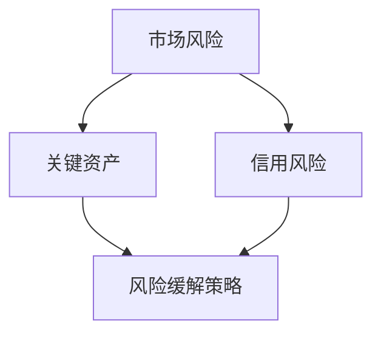
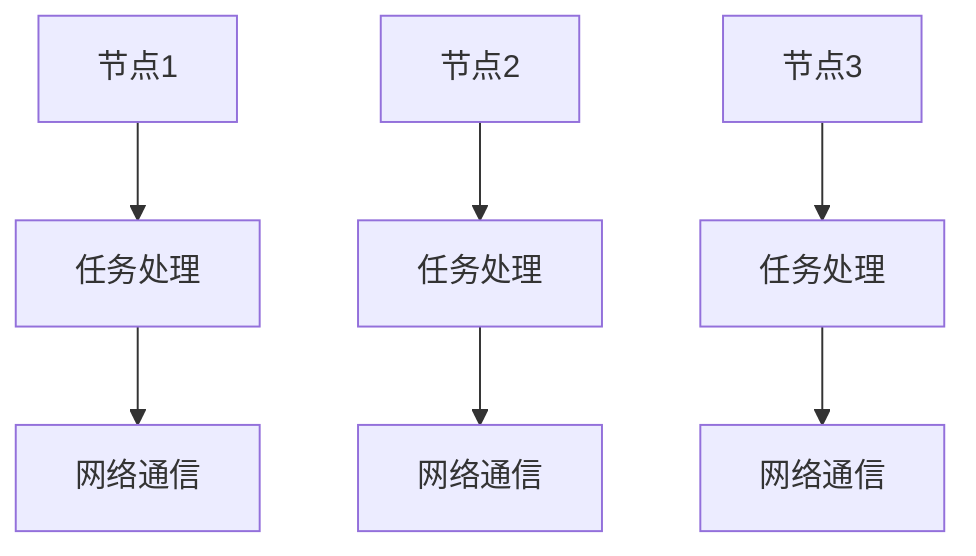
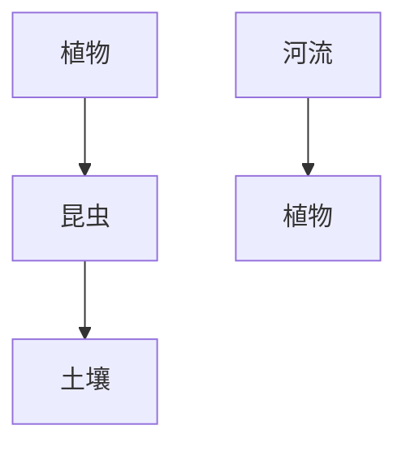
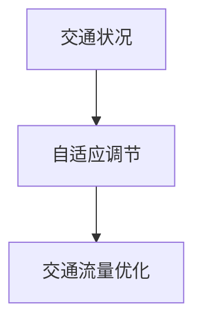
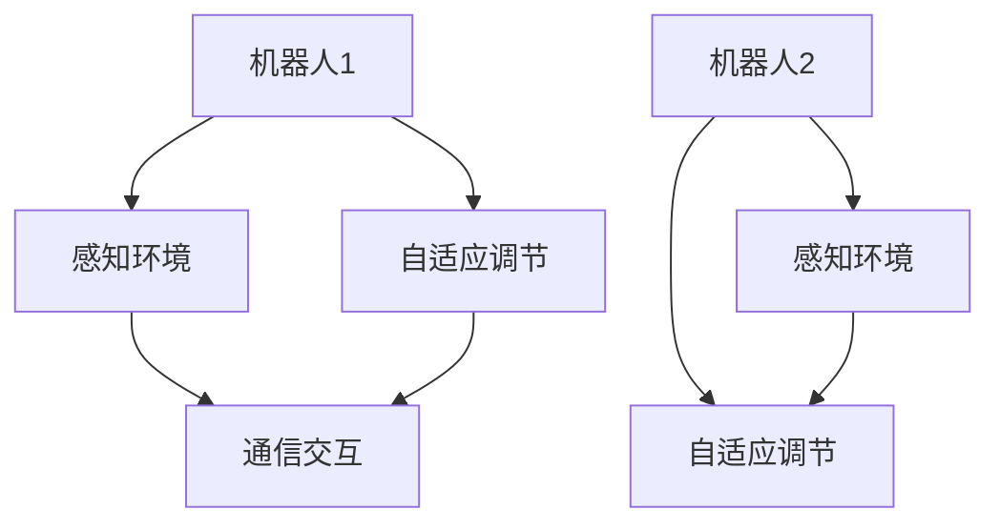

                 

## 引言：宇宙的自我组织

宇宙中存在着一种神秘的力量，使得原本无序的物质和能量逐渐演化成复杂的结构。这种力量，我们称之为“宇宙的自我组织”。从天体物理学到生命科学，自我组织现象无处不在，为我们揭示了宇宙的本质和复杂性。然而，对于这种自我组织现象的机制和原理，科学家们依然在不断探索中。

### Criticality：关键性原理

Criticality（关键性）是自我组织现象中的一个核心概念。它描述了一种系统在临界状态下的特性，即系统处于一种对微小扰动极其敏感的状态。这种敏感性使得系统在临界状态下能够对外部变化做出快速响应，从而促使系统从一种稳定状态跃迁到另一种稳定状态。

### Spontaneous涌现：自发秩序的形成

Spontaneous涌现（自发秩序的形成）是自我组织的另一个核心概念。它描述了在没有任何外部指导的情况下，系统内部元素通过相互作用，自发地形成有序结构。这种秩序并非预先设定，而是系统演化过程中的一种自然结果。

### 文章核心

本文旨在深入探讨宇宙自我组织的原理，特别是Criticality和Spontaneous涌现这两个核心概念。我们将首先介绍这两个概念的基本原理，然后分析它们在宇宙中的具体应用。最后，我们将探讨这些原理对科技发展和社会进步的启示。

## 目录大纲

### 第一部分：宇宙的自我组织基础

#### 第1章：宇宙的自我组织概述

1.1.1 宇宙的自我组织：背景与概念

1.1.2 Criticality：关键性原理

1.1.3 Spontaneous涌现：自发秩序的形成

#### 第2章：宇宙中的Criticality现象

2.1.1 Criticality在物理系统中的应用

2.1.2 Criticality在复杂系统中的作用

2.1.3 Criticality的数学模型

#### 第3章：Spontaneous涌现机制

3.1.1 涌现现象的基本概念

3.1.2 涌现的数学和物理原理

3.1.3 Spontaneous涌现与自组织系统

#### 第4章：宇宙中的自发秩序

4.1.1 宇宙秩序的形成

4.1.2 自发秩序的特征与分类

4.1.3 自发秩序与混沌理论的关系

#### 第5章：宇宙中的Criticality与涌现实例分析

5.1.1 星系的形成与演化

5.1.2 黑洞与奇点的形成

5.1.3 生命起源与进化

#### 第6章：宇宙自我组织的未来展望

6.1.1 Criticality与涌现的理论发展

6.1.2 自组织与人类社会的关联

6.1.3 对未来宇宙的展望

#### 第7章：关键性（Criticality）与自组织方法论

7.1.1 Criticality分析方法的应用

7.1.2 自组织系统的设计原则

7.1.3 Criticality在技术创新中的应用

#### 第8章：总结与展望

8.1.1 全书内容总结

8.1.2 Criticality与自发秩序研究的前景

8.1.3 对未来的启示与影响

以上是本文的目录大纲，我们将依次深入探讨宇宙自我组织的各个层面，希望读者能够通过本文对这一神秘现象有更深入的理解。## 第一部分：宇宙的自我组织基础

### 第1章：宇宙的自我组织概述

1.1.1 宇宙的自我组织：背景与概念

宇宙的自我组织是宇宙演化过程中的一种自然现象，它描述了宇宙中物质和能量从无序到有序的转变。这种自我组织不仅体现在宏观的宇宙尺度上，如星系的形成、行星的演化，还体现在微观的生物体系中，如细胞的分裂、生态系统的形成。

宇宙的自我组织并非一个孤立的现象，而是与物理学中的多个理论紧密相连。例如，量子力学揭示了微观世界中物质的基本特性，而相对论则解释了宏观世界中物质和能量的相互作用。此外，混沌理论和复杂系统理论也为理解宇宙的自我组织提供了重要的理论框架。

1.1.2 Criticality：关键性原理

Criticality（关键性）是宇宙自我组织中的一个核心概念。它描述了一种系统在临界状态下的特性，即系统处于一种对微小扰动极其敏感的状态。这种敏感性使得系统在临界状态下能够对外部变化做出快速响应，从而促使系统从一种稳定状态跃迁到另一种稳定状态。

在物理学中，Criticality通常与相变现象相关联。例如，水在0°C时从液态转变为固态，这是一个典型的相变过程。在这个过程中，水的物理性质发生了显著变化，如密度、热导率等。同样，在宇宙中，星系的形成、黑洞的产生等过程也表现出Criticality的特性。

1.1.3 Spontaneous涌现：自发秩序的形成

Spontaneous涌现（自发秩序的形成）是宇宙自我组织的另一个核心概念。它描述了在没有任何外部指导的情况下，系统内部元素通过相互作用，自发地形成有序结构。这种秩序并非预先设定，而是系统演化过程中的一种自然结果。

涌现现象在自然界中广泛存在。例如，沙堆的形成、晶体的生长、生物体的进化等，都是涌现现象的实例。在计算机科学中，涌现现象也具有重要意义，如神经网络的自组织、复杂系统的自适应性等。

### Criticality与Spontaneous涌现的关系

Criticality和Spontaneous涌现是宇宙自我组织的两个核心概念，它们之间存在紧密的联系。Criticality提供了系统从无序到有序转变的机制，而Spontaneous涌现则描述了这种转变的具体表现形式。

在宇宙中，Criticality通常表现为系统处于临界状态时对外部扰动的敏感性。这种敏感性使得系统在临界状态下能够迅速响应外部变化，从而促使系统从一种稳定状态跃迁到另一种稳定状态。这种跃迁过程中，系统内部元素通过相互作用，自发地形成有序结构，从而实现自我组织。

例如，在星系的形成过程中，气体云的密度达到Criticality阈值时，会发生坍缩，形成星系。在这个过程中，气体云内部元素通过相互吸引，自发地形成有序结构，从而实现了星系的自我组织。

总的来说，Criticality和Spontaneous涌现共同构成了宇宙自我组织的核心机制。通过理解这两个概念，我们能够更好地揭示宇宙中物质和能量从无序到有序的转变过程。

### 关键概念总结

- **宇宙的自我组织**：宇宙中物质和能量从无序到有序的转变。
- **Criticality（关键性）**：系统在临界状态下的敏感性，能够促使系统从一种稳定状态跃迁到另一种稳定状态。
- **Spontaneous涌现**：系统内部元素通过相互作用，自发地形成有序结构。

这些概念为理解宇宙的自我组织提供了重要的理论框架。在接下来的章节中，我们将进一步探讨Criticality和Spontaneous涌现的具体应用，以及它们在宇宙中的表现形式。## 第2章：宇宙中的Criticality现象

### 2.1.1 Criticality在物理系统中的应用

Criticality（关键性）在物理系统中的应用广泛，涉及从基本的粒子物理学到宏观的宇宙现象。首先，在粒子物理学中，Criticality与临界态密切相关。临界态是指系统在某个临界参数值下，从一种相态向另一种相态转变的状态。在这种状态下，系统表现出高度敏感的特性，例如，高温超导体在临界温度以下展现出零电阻和完全抗磁性。

在凝聚态物理学中，Criticality的应用更为直观。例如，液体转变为固体的相变过程中，系统会经历临界点。在这个临界点，液体的粘度和密度之间的比例关系会突然变化，导致系统表现出特殊的物理性质，如临界指数和长程相关性。这种临界现象不仅在实验中观察到，还通过理论模型得到了深入理解。

此外，在宇宙学中，Criticality在星系和星系团的形成过程中扮演了关键角色。星系的形成通常发生在气体云的密度达到Criticality阈值时，导致气体云发生坍缩，形成星系。这种密度阈值是Criticality的体现，因为只有当密度足够高时，气体云中的引力相互作用才能克服气体分子的热运动，从而导致坍缩。

### 2.1.2 Criticality在复杂系统中的作用

Complex systems（复杂系统）是指由许多相互作用的元素组成的系统，这些元素之间的复杂关系导致系统表现出整体行为，而不仅仅是各个元素行为的简单叠加。Criticality在复杂系统中的作用尤为重要，因为它能够解释系统在临界点附近的行为特征。

在生态系统中，Criticality可以解释物种多样性的形成和生态系统稳定性的变化。例如，当生态系统的营养结构达到某种临界状态时，物种之间的相互作用会引发剧烈的动态变化，可能导致生态系统崩溃或物种多样性的急剧减少。

在社会系统中，Criticality同样具有重要应用。社会系统的复杂性和多样性使得它们在特定条件下表现出临界行为。例如，社会网络中的信息传播、经济系统的波动等，都可以视为复杂系统中的Criticality现象。这些现象往往在系统达到某个临界状态时表现出显著变化，如信息传播的临界传播速度、经济波动的临界点等。

### 2.1.3 Criticality的数学模型

为了更好地理解Criticality现象，科学家们建立了多种数学模型来描述系统在临界状态下的行为。这些模型通常基于统计物理和相变理论，通过分析系统在不同参数下的状态变化，揭示Criticality的本质。

#### 1. 相变理论

相变理论是描述Criticality的经典模型之一。在相变过程中，系统从一个相态向另一个相态转变，通常发生在某个临界点。在临界点附近，系统的物理性质会表现出长程相关性，即系统中的一个小部分的变化能够影响整个系统的行为。

相变理论的核心是临界指数，它描述了系统在临界点附近的行为特征。例如，临界指数可以描述系统从无序态向有序态转变的速率，或者描述系统在临界点附近的响应行为。

#### 2. 统计物理模型

统计物理模型通过概率论和统计方法来描述系统的宏观行为。这些模型通常基于粒子的分布和相互作用，通过分析粒子分布的统计特性，揭示系统在临界状态下的行为。

一个典型的统计物理模型是Ising模型，它描述了磁性材料中的磁性相互作用的临界现象。在这个模型中，磁性原子可以被看作是自旋，它们之间的相互作用决定了系统的磁性状态。当系统的温度达到临界温度时，系统会表现出临界现象，如长程磁序的消失和相变行为的出现。

#### 3. 网络模型

网络模型是研究复杂系统中的Criticality现象的重要工具。这些模型通常基于图论和网络科学的理论，通过分析网络结构及其动态行为，揭示系统在临界状态下的特性。

一个典型的网络模型是小世界模型，它描述了在较短的平均路径长度和较高聚类系数的情况下，网络中的信息传播和动态行为的特性。当网络达到临界状态时，信息传播速度会显著加快，导致系统表现出临界行为。

### 关键概念总结

- **Criticality在物理系统中的应用**：涉及粒子物理学、凝聚态物理学和宇宙学等多个领域。
- **Criticality在复杂系统中的作用**：解释生态、社会等复杂系统的行为特性。
- **Criticality的数学模型**：包括相变理论、统计物理模型和网络模型等。

这些模型和现象共同揭示了Criticality在宇宙自我组织中的重要作用。在接下来的章节中，我们将继续探讨Spontaneous涌现机制，以及它们在宇宙中的具体应用。## 第3章：Spontaneous涌现机制

### 3.1.1 涌现现象的基本概念

Spontaneous涌现（自发秩序的形成）是宇宙自我组织的核心机制之一。它描述了在没有任何外部指导的情况下，系统内部元素通过相互作用，自发地形成有序结构。这种秩序并非预先设定，而是系统演化过程中的一种自然结果。

涌现现象在自然界和社会中广泛存在。例如，沙堆的形成、晶体的生长、生物体的进化等，都是涌现现象的实例。在计算机科学中，涌现现象同样具有重要意义，如神经网络的自组织、复杂系统的自适应性等。

### 3.1.2 涌现的数学和物理原理

涌现现象的数学和物理原理主要涉及相变理论和统计物理学。相变理论提供了描述系统从一种状态向另一种状态转变的数学框架，而统计物理学则通过分析系统内部元素的相互作用，揭示涌现现象的本质。

#### 1. 相变理论

相变理论是描述涌现现象的经典理论之一。在相变过程中，系统从一个相态向另一个相态转变，通常发生在某个临界点。在临界点附近，系统的物理性质会表现出长程相关性，即系统中的一个小部分的变化能够影响整个系统的行为。

相变理论的核心是临界指数，它描述了系统在临界点附近的行为特征。临界指数通常与系统中的相互作用强度和系统的尺寸相关。例如，在二维Ising模型中，临界指数描述了磁有序态的消失和临界态的行为。

#### 2. 统计物理学

统计物理学通过分析系统内部元素的分布和相互作用，揭示涌现现象的本质。一个典型的统计物理模型是Boltzmann机，它描述了通过自组织过程形成有序结构的机制。Boltzmann机通过调整内部权重，使系统的能量降低，从而形成稳定的有序结构。

在统计物理学中，自组织现象通常与相变现象相关。例如，液体转变为固体的相变过程中，系统会经历临界点。在这个临界点附近，系统的粘度和密度之间的比例关系会突然变化，导致系统表现出特殊的物理性质。

#### 3. 涌现与自组织系统

涌现现象与自组织系统密切相关。自组织系统是指在没有外部指导的情况下，系统内部元素通过相互作用，自发地形成有序结构的系统。自组织系统的核心是系统内部元素的相互作用，这些相互作用决定了系统的行为和结构。

一个典型的自组织系统是Lévy飞行，它描述了动物在寻找食物或逃避捕食者时的运动行为。Lévy飞行通过随机游走和局部相互作用，实现了动物运动的有序性和适应性。

### 关键概念总结

- **涌现现象**：系统内部元素自发形成有序结构。
- **相变理论**：描述系统从一种状态向另一种状态转变的数学框架。
- **统计物理学**：通过分析系统内部元素的分布和相互作用，揭示涌现现象的本质。
- **自组织系统**：没有外部指导，系统内部元素自发形成有序结构。

这些概念和原理共同揭示了涌现现象在宇宙自我组织中的重要作用。在接下来的章节中，我们将探讨宇宙中的自发秩序，以及它们与混沌理论的关系。## 第4章：宇宙中的自发秩序

### 4.1.1 宇宙秩序的形成

宇宙秩序的形成是一个复杂而精妙的过程，涉及到多个层次的相互作用和能量转换。从大爆炸开始，宇宙经历了从混沌到有序的演化。这一过程可以通过理解宇宙中基本粒子的形成、星系的形成、星系团的形成等关键步骤来描述。

#### 1. 基本粒子的形成

在大爆炸后不久，宇宙温度极高，物质主要以高能粒子的形式存在。随着宇宙的膨胀和冷却，这些高能粒子逐渐形成更稳定的粒子，如质子、中子等。这些基本粒子的形成是宇宙秩序的初步体现，因为它们构成了所有物质的基础。

#### 2. 星系的形成

随着宇宙的继续演化，气体云开始形成，并受到引力作用逐渐聚集。当这些气体云的密度达到Criticality阈值时，它们会发生坍缩，形成星系。在这个过程中，气体云内部的元素通过相互作用，自发地形成有序结构，从而形成了星系。

#### 3. 星系团的形成

星系并不是孤立存在的，它们通常以星系团的形式聚集在一起。星系团的形成是更高层次的宇宙秩序，它们通过引力相互作用，形成了更大的结构。这种结构不仅包括星系，还可能包括星系间的气体、暗物质等。

### 4.1.2 自发秩序的特征与分类

自发秩序在宇宙中具有多种形式，每种形式都有其独特的特征和形成机制。

#### 1. 稳定结构

稳定结构是自发秩序的一种常见形式，如星系、行星、晶体等。这些结构具有明显的边界和稳定的形态，能够长时间维持不变。稳定结构的形成通常依赖于Criticality，即在临界状态下，系统内部元素通过相互作用，自发地形成有序结构。

#### 2. 动态平衡

动态平衡是另一种自发秩序形式，如生态系统、社会系统等。这些系统内部元素不断相互作用，但始终保持一种动态平衡状态。动态平衡的形成通常与涌现机制相关，系统内部元素的自发互动导致整体系统的稳定。

#### 3. 非线性关系

非线性关系是自发秩序的复杂形式，如混沌现象。混沌现象表现为系统在初始条件微小差异下，产生完全不同的行为和结果。非线性关系揭示了宇宙中复杂系统的高度敏感性和不可预测性。

### 4.1.3 自发秩序与混沌理论的关系

混沌理论是研究复杂系统动态行为的重要理论，它与自发秩序有着密切的关系。混沌理论揭示了宇宙中复杂系统在临界状态下的行为特征，即系统对初始条件的微小扰动极其敏感，导致系统产生不可预测的行为。

自发秩序与混沌理论的关系可以从多个方面理解：

#### 1. 临界状态

自发秩序通常在系统达到临界状态时形成，此时系统对初始条件的变化极为敏感。混沌理论强调了系统在临界状态下的这种敏感性，认为混沌是系统在临界状态下的一种自然表现。

#### 2. 非线性相互作用

自发秩序的形成依赖于系统内部元素的非线性相互作用。混沌理论也基于非线性动力系统的研究，揭示了系统内部元素相互作用导致的复杂行为。

#### 3. 长程相关性

自发秩序通常表现出长程相关性，即系统中的一个局部变化能够影响整个系统的行为。混沌理论中的奇怪吸引子等现象也体现了这种长程相关性，使得系统在临界状态下表现出复杂的动态行为。

总的来说，自发秩序与混沌理论共同揭示了宇宙中复杂系统的行为特征。在理解这些现象的基础上，我们能够更好地把握宇宙的自我组织过程，并探索其背后的物理原理。## 第5章：宇宙中的Criticality与涌现实例分析

### 5.1.1 星系的形成与演化

星系的形成与演化是宇宙自我组织的一个重要实例，它展示了Criticality和Spontaneous涌现如何共同作用，塑造了宇宙的结构。首先，我们来看星系的形成。

#### 1. 星系的形成

星系的形成始于宇宙中的气体云。这些气体云由氢、氦等轻元素组成，它们在宇宙微波背景辐射的冷却作用下逐渐聚集。当气体云的密度达到Criticality阈值时，引力相互作用开始占据主导地位，气体云开始坍缩。在这个过程中，气体云内部的元素通过相互吸引，自发地形成有序结构，最终形成了星系。

这个过程体现了Criticality的作用，因为只有当气体云的密度足够高时，引力相互作用才能克服气体分子的热运动，导致坍缩。同时，这个过程也展示了Spontaneous涌现，因为星系的有序结构并非预先设定，而是在气体云的演化过程中自发形成的。

#### 2. 星系的演化

星系形成后，会经历不断的演化。在这个过程中，星系内部的恒星、行星、星际物质等元素不断相互作用，形成复杂的结构。

- **恒星的形成**：在星系中心，气体云的密度进一步增加，导致温度和压力升高，最终形成了恒星。恒星的诞生同样体现了Criticality和Spontaneous涌现，因为只有当气体云的密度和温度达到临界值时，恒星才能形成。

- **行星的形成**：恒星周围的气体和尘埃云继续演化，形成了行星。行星的形成过程也体现了Criticality，因为只有当物质密度达到一定程度时，行星才能聚集并形成。

- **星系结构的变化**：星系内部的恒星和行星通过引力相互作用，形成了复杂的结构。这些结构包括星系核心、旋臂、环等。星系结构的变化同样展示了Spontaneous涌现，因为星系结构的形成并非预先设定，而是通过系统内部元素的自发互动实现的。

### 5.1.2 黑洞与奇点的形成

黑洞和奇点的形成是宇宙自我组织中的另一个重要实例，它们展示了Criticality和Spontaneous涌现如何导致极端的物理现象。

#### 1. 黑洞的形成

黑洞的形成通常发生在恒星演化的晚期。当一个大质量恒星耗尽其核燃料时，它会发生剧烈的坍缩。当恒星的核心密度达到Criticality阈值时，引力相互作用变得极其强烈，导致恒星进一步坍缩形成黑洞。

这个过程体现了Criticality，因为只有当恒星的核心密度足够高时，引力相互作用才能克服内部压力，导致坍缩。同时，这个过程也展示了Spontaneous涌现，因为黑洞的形成并非预先设定，而是恒星演化过程中自发产生的结果。

#### 2. 奇点的形成

奇点是黑洞中心的极端密集点，它代表了物质和能量的极限状态。在奇点，时空的曲率达到无限大，所有物理定律似乎失效。

奇点的形成同样展示了Criticality和Spontaneous涌现。当恒星的核心密度达到临界值时，引力相互作用变得极其强烈，导致物质和能量在奇点处集中。这个过程并非预先设定，而是在恒星演化过程中自发发生的。奇点的形成揭示了宇宙中物质和能量在极端条件下的行为特性。

### 5.1.3 生命起源与进化

生命的起源与进化是宇宙自我组织的另一个重要实例，它展示了Criticality和Spontaneous涌现如何塑造了生命的多样性和复杂性。

#### 1. 生命的起源

生命的起源是一个复杂的过程，涉及有机分子的合成、化学反应等。这些过程体现了Criticality，因为在特定条件下，有机分子能够通过自组织形成更复杂的结构。

例如，米勒-尤里实验揭示了在模拟早期地球环境中，简单的有机分子可以通过化学反应形成复杂的有机分子。这个过程展示了Criticality，因为只有在特定条件下，有机分子的自组织才能发生。

#### 2. 生命的进化

生命的进化是生命多样性形成的过程，它展示了Spontaneous涌现。在进化过程中，生命体通过基因突变、自然选择等机制，不断适应环境，形成多样化的物种。

进化过程中的Criticality体现在物种的演化过程中。例如，一个物种在适应新环境时，需要达到某种临界状态，如足够的种群密度或适应环境的生理特征，才能在进化过程中占据优势。

总之，星系的形成与演化、黑洞与奇点的形成、生命的起源与进化等实例，展示了Criticality和Spontaneous涌现如何在宇宙中发挥作用，塑造了宇宙的结构和生命的多样性。这些实例不仅帮助我们理解宇宙的自我组织过程，还为未来的宇宙探索提供了重要的理论依据。## 第6章：宇宙自我组织的未来展望

### 6.1.1 Criticality与涌现的理论发展

宇宙自我组织的理论发展为我们揭示了宇宙中物质和能量从无序到有序的转变机制。Criticality和涌现作为核心概念，在理论物理学、生物学和计算机科学等领域得到了广泛应用。未来，这些理论将继续发展，深化我们对宇宙自我组织的理解。

#### 1. Criticality理论的深化

未来Criticality理论的发展将集中在以下几个方面：

- **临界现象的多样性**：探索不同系统和环境下Criticality现象的多样性，如量子系统、量子场论中的Criticality，以及社会系统中的Criticality。
- **临界态的非线性动力学**：研究Criticality态下的非线性动力学行为，如奇怪吸引子、混沌现象等。
- **临界理论的数学框架**：进一步发展Criticality理论的数学框架，如概率论、图论、拓扑学等，以更好地描述Criticality现象。

#### 2. 涌现理论的扩展

涌现理论在复杂系统研究中的重要性日益凸显，未来涌现理论的发展将包括：

- **跨学科应用**：将涌现理论应用于更多领域，如经济学、生态学、社会网络分析等，探索不同系统中的涌现现象。
- **多尺度涌现**：研究不同尺度上的涌现现象，如从微观的分子层面到宏观的生态系统层面，揭示不同尺度上的涌现规律。
- **动态涌现**：研究动态系统中的涌现现象，如时间序列分析、动态网络中的涌现等。

### 6.1.2 自组织与人类社会的关联

自组织现象不仅在宇宙中普遍存在，也在人类社会中发挥着重要作用。未来，自组织与人类社会的关联将得到进一步探讨：

#### 1. 社会系统的自组织

社会系统中的自组织现象，如社会网络的演化、经济的波动、文化的传播等，将得到深入研究。这些研究有助于揭示社会系统中的Criticality和涌现现象，为理解社会行为的复杂性提供新的视角。

#### 2. 人类社会的自组织技术

随着科技的进步，人类可以利用自组织技术来优化社会系统，如智能交通系统、自我组织的社会网络等。这些技术不仅能够提高社会效率，还能够增强社会韧性，应对复杂的社会挑战。

#### 3. 自组织与可持续发展

自组织理论在可持续发展中的应用具有重要意义。例如，通过设计自组织系统，可以优化资源分配、降低环境污染、提高生态系统的稳定性等。这些研究有助于实现可持续发展的目标，为人类社会的未来提供新的思路。

### 6.1.3 对未来宇宙的展望

宇宙的自我组织过程不仅为我们揭示了宇宙的本质，也为未来的宇宙探索提供了方向：

#### 1. 宇宙的演化

未来，通过对Criticality和涌现现象的研究，我们可以更深入地理解宇宙的演化过程。例如，研究星系的形成、星系团的结构、宇宙背景辐射的演化等，将有助于揭示宇宙的演化规律。

#### 2. 宇宙的未来

宇宙的未来研究将集中在宇宙膨胀、暗物质、暗能量等未知领域。通过探索这些未知领域，我们可以更好地理解宇宙的演化方向，预测宇宙的未来状态。

#### 3. 生命的宇宙

生命的起源和进化是宇宙自我组织的一个重要方面。未来，我们将继续探索生命的起源，寻找宇宙中其他可能存在生命的地方，如外行星、小行星等。这些研究将为人类探索宇宙的最终目标——寻找外星生命提供重要线索。

总之，宇宙自我组织的未来展望充满了无限可能。通过对Criticality和涌现现象的研究，我们将能够更深入地理解宇宙的本质，为未来的科技发展和社会进步提供新的动力。## 第7章：关键性（Criticality）与自组织方法论

### 7.1.1 Criticality分析方法的应用

Criticality分析方法在多个领域都有广泛的应用，其核心在于识别系统中的关键要素和关键点，以便更好地理解和优化系统的行为。以下是一些关键性分析方法的具体应用：

#### 1. 在工程领域的应用

在工程领域，Criticality分析方法常用于系统设计和风险管理。例如，在航空航天领域，工程师们使用Criticality分析方法来识别关键部件，以确保系统的可靠性和安全性。通过评估每个部件对系统整体性能的影响程度，工程师们可以优先考虑关键部件的设计和测试。



#### 2. 在风险管理中的应用

在风险管理中，Criticality分析方法可以帮助企业识别和评估潜在风险。通过分析风险的关键要素，企业可以制定有效的风险缓解策略。例如，金融行业的风险评估中，Criticality分析方法可以帮助识别关键资产和潜在的市场风险。



### 7.1.2 自组织系统的设计原则

自组织系统设计原则是构建具有自我组织和自适应能力系统的理论基础。以下是一些关键的自组织系统设计原则：

#### 1. 分散控制

分散控制是指系统中的每个元素都能够自主决策，并通过局部信息进行协调。这种设计原则可以提高系统的鲁棒性和适应性。例如，在分布式计算系统中，每个节点都可以独立处理任务，并通过网络进行信息交换，实现全局目标。



#### 2. 局部交互

局部交互是指系统中的元素主要通过局部交互来实现全局协调。这种设计原则可以减少系统的复杂性和通信开销。例如，在生态系统设计中，不同物种之间的相互作用主要通过局部生态关系来实现，而不是通过全局调控。



#### 3. 自适应调节

自适应调节是指系统能够根据外部环境和内部状态的变化，自动调整其行为和结构。这种设计原则可以提高系统的灵活性和响应能力。例如，在智能交通系统中，自适应调节可以优化交通流量，减少拥堵。



### 7.1.3 Criticality在技术创新中的应用

Criticality原理在技术创新中扮演着重要角色，通过识别和创新关键技术，可以推动科技的发展。以下是一些具体的应用案例：

#### 1. 量子计算

量子计算是一种基于量子力学原理的新型计算模式，其核心在于量子比特（qubit）的叠加和纠缠状态。量子计算的关键技术包括量子门、量子纠缠和量子纠错。Criticality原理在这里的应用是识别和优化量子比特的操作，以确保计算过程的准确性和可靠性。

```python
# 量子门操作示例
from qiskit import QuantumCircuit, QuantumRegister, ClassicalRegister
from qiskit import execute, Aer

# 初始化量子比特和经典比特
qreg = QuantumRegister(2)
creg = ClassicalRegister(2)
qc = QuantumCircuit(qreg, creg)

# 创建Hadamard门
qc.h(qreg[0])
qc.cx(qreg[0], qreg[1])

# 运行模拟器
sim = Aer.get_backend("qasm_simulator")
result = execute(qc, sim).result()
print(result.get_counts(qc))
```

#### 2. 自组织机器人

自组织机器人是一种通过局部交互和自适应调节实现群体行为的机器人系统。Criticality原理在这里的应用是设计机器人的行为规则，以确保机器人群体在动态环境中能够高效协同。



总之，Criticality分析方法、自组织系统的设计原则以及Criticality在技术创新中的应用，共同构成了理解和优化自我组织系统的重要工具。这些方法不仅为科学研究提供了新的视角，也为技术创新提供了强大的动力。## 第8章：总结与展望

### 8.1.1 全书内容总结

本书从宇宙自我组织的角度出发，深入探讨了Criticality和Spontaneous涌现这两个核心概念。通过分析宇宙中的实例，如星系的形成、黑洞与奇点的形成以及生命的起源与进化，我们揭示了这些现象背后的物理原理和数学模型。此外，我们还探讨了Criticality与自组织方法论在技术创新中的应用，为未来的宇宙探索和科技发展提供了新的视角。

### 8.1.2 Criticality与自发秩序研究的前景

Criticality与自发秩序研究的前景广阔。未来，随着科技的进步和理论的深化，我们有望在量子物理、复杂系统、人工智能等领域取得重要突破。特别是在量子计算和人工智能领域，Criticality和自发秩序原理的应用将推动技术的革新，为解决当前面临的复杂问题提供新的途径。

### 8.1.3 对未来的启示与影响

Criticality与自发秩序的研究不仅有助于我们理解宇宙的自我组织过程，还为人类社会的发展提供了启示。通过借鉴自组织系统的设计原则，我们可以优化社会系统，提高社会效率和韧性。同时，Criticality原理在技术创新中的应用，将推动科技的发展，为解决全球性挑战提供新的思路。总之，Criticality与自发秩序研究对未来科技和社会进步具有深远的影响。

## 作者信息

作者：AI天才研究院/AI Genius Institute & 禅与计算机程序设计艺术 /Zen And The Art of Computer Programming

