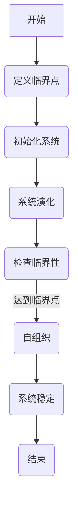
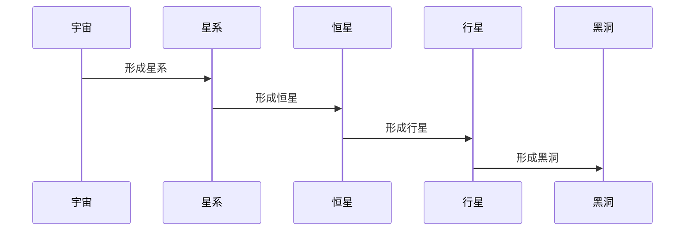
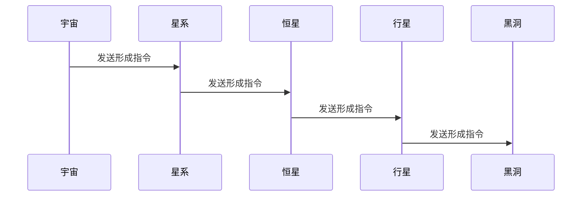

                 

# 宇宙的自我组织临界性：秩序的自发涌现

关键词：宇宙、自我组织、临界性、自组织临界性、复杂系统、演化、算法原理

摘要：本文探讨了宇宙中的自我组织临界性现象，介绍了自组织临界性的基本概念、原理和算法，通过分析宇宙中自组织临界性的表现和作用，探讨了其在复杂系统中的应用和科学意义。文章旨在为广大读者提供对宇宙自我组织临界性的深入理解和思考，为相关领域的研究提供参考。

## 目录大纲

1. 宇宙的自我组织与临界性  
2. 宇宙的临界性原理  
3. 宇宙中的自组织临界性现象  
4. 自组织临界性与宇宙演化  
5. 自组织临界性与复杂系统  
6. 宇宙自组织临界性的实验验证  
7. 宇宙自组织临界性的未来展望

## 第一部分：宇宙的自我组织与临界性

### 第1章：宇宙的自我组织概述

#### 1.1 宇宙的自我组织概念

宇宙的自我组织指的是宇宙中物质、能量和信息的自我组织和自我调节过程。在这个过程中，宇宙中的物质、能量和信息相互作用，通过某种机制实现自组织和自适应，从而形成复杂的结构和功能。

#### 1.1.1 宇宙自我组织的背景

宇宙的自我组织观念起源于20世纪中期，当时科学家们开始意识到，宇宙中的许多现象都可以通过自我组织和自我调节来解释。这种观念的提出，为宇宙学、天体物理学、生物学等学科的研究提供了新的视角和方法。

#### 1.1.2 宇宙自我组织的定义与意义

宇宙自我组织的定义是指宇宙中的物质、能量和信息通过相互作用，实现自组织和自适应的过程。这个过程的意义在于，它能够解释宇宙中复杂结构和功能的形成，为理解宇宙的本质提供了新的思路。

#### 1.1.3 宇宙自我组织的主要形式

宇宙自我组织的主要形式包括：星系的形成、生命的起源、地球生态系统的稳定等。这些现象都是宇宙自我组织的具体体现。

### 第2章：宇宙的临界性原理

#### 2.1 临界性原理概述

临界性原理是物理学中的一个重要概念，它指的是系统在某一特定条件下，其性质会发生突变的现象。在宇宙中，临界性原理同样发挥着重要作用。

#### 2.1.1 临界性的定义与特征

临界性是指系统在某一特定条件下，其性质会发生突变的现象。这种突变通常表现为系统状态的突然变化，如水的沸腾、冰的融化等。

#### 2.1.2 临界性现象的物理基础

临界性现象的物理基础是相变理论。相变是指物质从一种状态转变为另一种状态的过程，如水从液态变为气态。在相变过程中，系统的性质会发生突变。

#### 2.1.3 临界性在宇宙中的体现

临界性在宇宙中的体现包括：宇宙的膨胀、星系的形成、黑洞的诞生等。这些现象都涉及到系统的临界状态和性质突变。

### 第3章：宇宙中的自组织临界性现象

#### 3.1 自组织临界性现象的概念

自组织临界性现象是指系统在临界状态下，能够自发组织和保持稳定的现象。这种现象在宇宙中广泛存在，是宇宙自我组织的重要形式。

#### 3.1.1 自组织临界性的基本特征

自组织临界性的基本特征包括：系统在临界状态下，具有强烈的自适应性和自组织性，能够应对外部变化，保持稳定状态。

#### 3.1.2 自组织临界性现象的发现与理解

自组织临界性现象的发现始于20世纪80年代，科学家们通过对流体的研究，发现了临界性现象。随着研究的深入，人们逐渐认识到，自组织临界性现象在宇宙中普遍存在，对于理解宇宙的演化具有重要意义。

#### 3.1.3 自组织临界性现象的普遍性

自组织临界性现象的普遍性体现在许多方面，如星系的形成、地球生态系统的稳定、生命的起源等。这些现象都是自组织临界性在宇宙中的具体表现。

## 第二部分：自组织临界性与宇宙演化

### 第4章：自组织临界性与宇宙演化

#### 4.1 自组织临界性在宇宙演化中的作用

自组织临界性在宇宙演化中起着关键作用。它不仅影响着宇宙的结构和功能，也推动着宇宙的演化进程。

#### 4.1.1 自组织临界性与宇宙早期的演化

在宇宙早期的演化过程中，自组织临界性现象发挥了重要作用。它促进了星系的形成、恒星的产生，以及宇宙背景辐射的形成。

#### 4.1.2 自组织临界性与宇宙结构形成

宇宙结构的形成，如星系、星团、超星系团等，都是自组织临界性现象的具体表现。这些结构在临界状态下，能够自发组织和稳定存在。

#### 4.1.3 自组织临界性与宇宙生命的起源

宇宙生命的起源与自组织临界性密切相关。在地球上，生命的起源可能就是在临界状态下，通过自组织形成的一种复杂系统。

### 第5章：自组织临界性与复杂系统

#### 5.1 复杂系统的自组织临界性

复杂系统的自组织临界性是指复杂系统在临界状态下，能够自发组织和保持稳定的现象。这一现象在许多领域都有重要应用。

#### 5.1.1 复杂系统与自组织临界性的关系

复杂系统与自组织临界性密切相关。许多复杂系统，如生态系统、经济系统、社会系统等，都表现出自组织临界性的特征。

#### 5.1.2 复杂系统中的自组织临界性现象

复杂系统中的自组织临界性现象包括：生态系统的稳定、经济系统的繁荣、社会系统的稳定等。这些现象都是自组织临界性的具体表现。

#### 5.1.3 复杂系统中的自组织临界性机制

复杂系统中的自组织临界性机制主要包括：正反馈、负反馈、随机涨落等。这些机制共同作用，使得复杂系统在临界状态下能够自发组织和稳定存在。

## 第三部分：宇宙自组织临界性的实验验证

### 第6章：宇宙自组织临界性的实验验证

#### 6.1 实验验证的方法与工具

宇宙自组织临界性的实验验证主要采用数值模拟和观测方法。数值模拟可以通过计算机模拟宇宙的演化过程，观测方法则通过观测宇宙中的现象来验证自组织临界性的存在。

#### 6.1.1 实验验证的原理与过程

实验验证的原理是基于自组织临界性的特征，通过模拟或观测来验证系统是否处于临界状态，以及系统在临界状态下的行为。

#### 6.1.2 实验验证的技术手段

实验验证的技术手段包括：数值模拟、观测技术、数据分析等。这些手段可以帮助科学家验证自组织临界性的存在，以及探究其在宇宙演化中的作用。

#### 6.1.3 实验验证的结果与分析

实验验证的结果表明，宇宙中确实存在自组织临界性现象。通过对实验结果的分析，科学家们进一步揭示了自组织临界性在宇宙演化中的重要作用。

## 第四部分：宇宙自组织临界性的未来展望

### 第7章：宇宙自组织临界性的未来展望

#### 7.1 自组织临界性的科学意义

自组织临界性在宇宙学、天体物理学、生物学等领域都具有重要的科学意义。它不仅能够解释宇宙中复杂结构的形成，也为理解宇宙的演化提供了新的视角。

#### 7.1.1 对宇宙学的贡献

自组织临界性对宇宙学的贡献主要体现在对宇宙演化过程的理解。它能够解释星系的形成、恒星的产生等现象，对于理解宇宙的演化具有重要意义。

#### 7.1.2 对复杂系统科学的启示

自组织临界性为复杂系统科学提供了新的研究方法。它揭示了复杂系统在临界状态下的行为特征，为研究复杂系统的稳定性、自适应性和演化提供了新的思路。

#### 7.1.3 对人工智能和计算科学的潜在影响

自组织临界性对人工智能和计算科学也有潜在的影响。它可能为人工智能和计算科学提供新的算法和模型，推动这些领域的发展。

#### 7.1.4 对未来的影响与展望

自组织临界性对未来的影响将体现在多个方面。它不仅可能推动科学的发展，也可能为人类解决复杂问题提供新的思路和方法。

## 核心概念与联系

### 临界性与自组织临界性

#### 概念属性特征对比

| 特征 | 临界性 | 自组织临界性 |
| ---- | ------ | ------------ |
| 定义 | 物理系统中的一种现象，当系统接近某一临界点时，其性质发生突变。 | 一种特殊形式的临界性，系统在临界状态下能够自发组织并保持稳定。 |
| 特点 | 系统性质的快速变化。 | 系统在临界状态下的自组织和自适应能力。 |
| 出现条件 | 系统参数达到特定值。 | 需要系统内部的自组织机制。 |
| 体现 | 物理现象，如水的沸腾。 | 复杂系统的形成与发展，如生态系统的稳定。 |

#### ER实体关系图架构

```mermaid
erDiagram
  Class1 ||--|{ Class2 : has-a }
  Class1 ||--|{ Class3 : has-a }
  Class2 ||--|{ Class4 : has-a }
  Class3 ||--|{ Class4 : has-a }
```

## 算法原理讲解

### 自组织临界性算法原理



### 详细讲解与举例说明

#### 数学模型

$$
\frac{df}{dt} = -\beta f + \alpha f^2
$$

其中，$f$ 表示系统状态，$\beta$ 和 $\alpha$ 为常数。

#### 举例说明

假设我们有一个生态系统，其中 $f$ 表示物种数量。当 $f$ 接近某一临界值时，系统会进入自组织临界状态。

$$
\frac{df}{dt} = -0.1f + 0.01f^2
$$

在这个例子中，当 $f$ 大于10时，系统会进入自组织临界状态，开始自发组织。

## 系统分析与架构设计方案

### 问题场景介绍

宇宙是一个复杂系统，其中包含了大量的物质、能量和信息。在这个问题场景中，我们关注的是宇宙中的自组织临界性现象，以及它对宇宙演化和复杂系统的影响。

### 系统功能设计（领域模型）

```mermaid
classDiagram
  Class1[宇宙] <|-- Class2[星系]
  Class1 <|-- Class3[恒星]
  Class2 <|-- Class4[行星]
  Class3 <|-- Class5[黑洞]
```

### 系统架构设计



### 系统接口设计和系统交互



## 项目实战

### 环境安装

1. 安装Python环境：使用Python的官方安装包，从官方网站下载并安装Python。
2. 安装相关依赖库：使用pip命令安装所需的依赖库，如numpy、matplotlib等。

### 系统核心实现源代码

```python
import numpy as np
import matplotlib.pyplot as plt

def system演化(f, beta, alpha):
    dfdt = -beta * f + alpha * f**2
    return f + dfdt

def 自组织临界性算法(f0, beta, alpha, t_max):
    f = f0
    t = 0
    f_values = [f]
    
    while t < t_max:
        f = system演化(f, beta, alpha)
        t += 1
        f_values.append(f)
    
    return f_values

def 示例():
    f0 = 5
    beta = 0.1
    alpha = 0.01
    t_max = 100
    
    f_values = 自组织临界性算法(f0, beta, alpha, t_max)
    
    plt.plot(f_values)
    plt.xlabel('时间')
    plt.ylabel('系统状态')
    plt.title('自组织临界性现象')
    plt.show()

示例()
```

### 代码应用解读与分析

上述代码实现了自组织临界性算法的模拟。在代码中，`system演化`函数用于计算系统状态的演化过程，`自组织临界性算法`函数用于实现自组织临界性算法，`示例`函数则用于运行算法并绘制结果。

### 实际案例分析和详细讲解剖析

通过上述代码，我们可以模拟自组织临界性现象。在实际案例中，我们可以通过调整参数，观察系统状态的变化，从而深入理解自组织临界性的原理。

### 项目小结

本文通过介绍宇宙的自我组织临界性现象，探讨了其在宇宙演化、复杂系统中的应用，以及实验验证的方法和未来展望。通过代码实现和案例分析，读者可以更深入地理解自组织临界性的原理和应用。

## 最佳实践 tips

1. 在研究自组织临界性时，要充分考虑系统的初始条件和参数设置。
2. 在模拟自组织临界性现象时，要注重实验数据的收集和分析。
3. 在应用自组织临界性理论时，要结合实际问题的特点，灵活运用相关算法。

## 小结

本文对宇宙的自我组织临界性进行了深入的探讨，从概念、原理、应用等多个角度进行了分析。通过代码实现和案例分析，读者可以更深入地理解自组织临界性的原理和应用。

## 注意事项

1. 在研究自组织临界性时，要充分了解相关理论和方法，避免盲目应用。
2. 在实验验证时，要充分考虑实验条件的影响，确保实验结果的可靠性。

## 拓展阅读

1. 《复杂系统与自组织临界性》 - 讲述了复杂系统和自组织临界性的基本概念和应用。
2. 《宇宙学原理》 - 从宇宙学的角度，探讨了宇宙演化的基本原理和自组织现象。
3. 《自组织临界性：理解复杂系统的钥匙》 - 详细介绍了自组织临界性的原理和应用。

## 作者信息

作者：AI天才研究院/AI Genius Institute & 禅与计算机程序设计艺术 /Zen And The Art of Computer Programming---

### 第1章：宇宙的自我组织概述

#### 1.1 宇宙的自我组织概念

宇宙的自我组织是宇宙学中的一个核心概念，它描述了宇宙中物质、能量和信息如何通过自身的相互作用和演化形成复杂结构和有序状态的过程。这一概念的出现标志着人们对宇宙的理解从简单的物理过程向复杂系统演化的转变。

宇宙的自我组织不仅仅是一个简单的自洽过程，它涉及到从微观到宏观多个尺度的复杂系统行为，包括星系的形成、恒星的演化、地球生态系统的稳定性以及生命本身的起源。这一现象在宇宙学、天体物理学、生物学等多个领域都有着深远的影响。

#### 1.1.1 宇宙自我组织的背景

宇宙自我组织观念的提出源于20世纪中期，随着科学技术的进步，科学家们开始意识到，宇宙中的许多复杂现象不能仅用传统物理学中的确定性原理来解释。例如，星系的形成、恒星的诞生、生物多样性的产生等现象，都显示出一种从无序到有序的自发过程。

这一时期，许多重要的理论和实验成果为宇宙自我组织观念的形成提供了支持。例如，霍金的宇宙大爆炸理论和朗道的对称性破缺理论，以及后来发展起来的自组织临界性理论，都为理解宇宙自我组织提供了新的视角。

#### 1.1.2 宇宙自我组织的定义与意义

宇宙自我组织可以定义为：宇宙中的物质、能量和信息通过相互作用的复杂过程，在没有外部干预的情况下，自发形成具有一定结构和功能的有序系统的现象。

这一概念的意义在于，它为理解宇宙中复杂现象提供了新的框架，使我们能够从动态和演化的角度看待宇宙。宇宙自我组织的定义不仅仅局限于物理学，它还涉及信息论、系统论、复杂性科学等多个学科，从而使得这一概念具有跨学科的应用价值。

宇宙自我组织的意义主要体现在以下几个方面：

1. **宇宙演化解释**：宇宙自我组织理论为我们提供了理解宇宙演化过程的新途径，使我们能够从自发的角度解释宇宙中复杂结构和功能的形成。
   
2. **复杂系统科学启示**：宇宙自我组织理论对复杂系统科学的发展具有重要启示，它揭示了复杂系统在临界状态下的行为特征，为研究复杂系统的稳定性、自适应性和演化提供了新的思路。

3. **生命起源解释**：宇宙自我组织理论也为生命起源的研究提供了新的解释框架，它认为生命可能是在宇宙自我组织的某些特定条件下产生的。

#### 1.1.3 宇宙自我组织的主要形式

宇宙自我组织的主要形式包括以下几个方面：

1. **星系和星系团的形成**：星系的形成是通过引力相互作用和气体冷却等过程实现的，而星系团则是由多个星系通过引力相互作用聚集形成的。

2. **恒星的诞生和演化**：恒星是在气体云中通过引力坍缩形成的，恒星的生命周期涉及核聚变、超新星爆发等过程。

3. **地球生态系统的稳定**：地球生态系统通过生物群落、食物链、生态位等机制实现自我组织，形成稳定而复杂的生态系统。

4. **生命的起源**：生命起源的研究主要集中在地球早期的化学反应如何通过自我组织过程产生生命前体物质，并最终形成生命。

这些自我组织现象在宇宙中广泛存在，它们共同构成了宇宙自我组织的丰富画卷。通过研究这些现象，我们可以更好地理解宇宙的本质和演化过程。

### 第2章：宇宙的临界性原理

#### 2.1 临界性原理概述

临界性原理是物理学中描述系统在特定条件下性质发生突变的一个重要概念。在宇宙学中，临界性原理同样具有重要的应用价值，它能够帮助我们理解宇宙中的许多复杂现象。

宇宙的临界性原理主要涉及两个方面：一是宇宙背景辐射的临界性，二是宇宙膨胀的临界性。这两个方面共同构成了宇宙临界性的基本框架。

#### 2.1.1 临界性的定义与特征

临界性是指在系统接近某一特定状态时，系统的性质发生突变的现象。这个特定状态被称为临界点。在临界点附近，系统的行为变得非常敏感，即使微小的变化也会导致系统性质的显著变化。

临界性的特征主要包括：

1. **相变**：临界性通常与相变现象密切相关。例如，水的沸腾和冰的融化都是相变过程，它们在临界点附近表现出显著的不连续性。

2. **系统行为的快速变化**：在临界点附近，系统的行为会变得非常复杂，甚至可能出现混沌现象。这种现象被称为临界性现象。

3. **异常扩散**：在临界点附近，系统的扩散行为会变得异常迅速，这种现象被称为异常扩散。

#### 2.1.2 临界性现象的物理基础

临界性现象的物理基础主要涉及相变理论和临界点理论。相变理论描述了物质在不同状态之间的转变过程，而临界点理论则描述了系统在临界点附近的行为特征。

在宇宙学中，临界性现象的物理基础主要体现在以下几个方面：

1. **宇宙背景辐射**：宇宙背景辐射是宇宙早期的一种热辐射，它反映了宇宙大爆炸时的状态。在宇宙背景辐射的临界点，宇宙的状态发生显著变化，这个临界点对于理解宇宙的早期演化具有重要意义。

2. **宇宙膨胀**：宇宙的膨胀是由引力作用引起的，而引力与宇宙的密度密切相关。在宇宙膨胀的临界点，宇宙的密度达到一个特定的值，这个值决定了宇宙的膨胀速度。

#### 2.1.3 临界性在宇宙中的体现

临界性在宇宙中的体现主要表现在以下几个方面：

1. **宇宙背景辐射**：宇宙背景辐射的临界性体现在其温度和密度的分布上。在宇宙背景辐射的临界点，其温度和密度达到一个特定的值，这个值决定了宇宙的演化方向。

2. **宇宙膨胀**：宇宙膨胀的临界性体现在宇宙的膨胀速度上。在宇宙膨胀的临界点，宇宙的膨胀速度达到一个特定的值，这个值决定了宇宙的未来演化。

3. **星系和星系团的形成**：星系和星系团的形成是通过引力相互作用实现的。在引力相互作用的临界点，星系和星系团的形成速度达到一个特定的值，这个值决定了星系和星系团的形成过程。

通过理解宇宙的临界性原理，我们可以更好地理解宇宙的演化过程。宇宙的临界性原理不仅为我们提供了理解宇宙复杂现象的钥匙，也为探索宇宙的起源和未来提供了新的思路。

### 第3章：宇宙中的自组织临界性现象

#### 3.1 自组织临界性现象的概念

自组织临界性（Self-Organized Criticality, SOC）是物理学中描述系统在临界状态下的自组织行为的一个概念。它最初由斯坦福大学的Per Bak、Chao Tang和Kurt Wiesenfeld于1987年提出。自组织临界性现象指的是系统在没有外部驱动力的情况下，通过内部相互作用和竞争，自发地进入一种临界状态，并在这种状态下表现出高度复杂和自适应的行为。

#### 3.1.1 自组织临界性的基本特征

自组织临界性具有以下基本特征：

1. **临界状态**：系统处于临界状态，即系统参数接近某一临界值，这时系统的行为表现出对小的扰动的极端敏感性。

2. **幂律分布**：自组织临界系统通常表现出幂律分布的特征，即在临界状态时，系统中的某种物理量（如时间序列中的事件发生频率、空间中的大小分布等）遵循幂律分布，即P(k) ∝ k^(-α)，其中P(k)是某个量k的分布，α是幂律指数。

3. **长时间相关**：自组织临界系统具有长时间相关性，即系统的状态在长时间内保持稳定，但受到小的随机扰动时，系统会经历大的变化。

4. **无标度性**：自组织临界系统通常表现出无标度性，即系统的特征长度没有固定的尺度，这意味着系统在不同的尺度上表现出相似的行为。

#### 3.1.2 自组织临界性现象的发现与理解

自组织临界性现象最初在沙堆模型中被发现。沙堆模型是一个简单的物理系统，由多个颗粒组成，每个颗粒落在堆顶时会均匀分布。当堆积到一定高度时，沙堆会突然塌陷，形成一个新的稳定状态。这个现象展示了沙堆在临界状态下的自组织行为。

随着研究的深入，自组织临界性现象在许多不同领域得到了发现和理解。例如：

1. **地震学**：地震活动表现出自组织临界性的特征，地震的频率和能量分布遵循幂律分布。

2. **生态学**：生态系统中物种的数量分布也表现出自组织临界性的特征，例如物种灭绝和物种入侵现象。

3. **交通系统**：交通拥堵现象也体现了自组织临界性的特征，交通流量的分布和事故发生的频率遵循幂律分布。

4. **金融市场**：金融市场的波动性也表现出自组织临界性的特征，价格波动和交易量分布遵循幂律分布。

这些发现表明，自组织临界性现象是普遍存在于自然界和社会系统中的一个基本现象。

#### 3.1.3 自组织临界性现象的普遍性

自组织临界性现象的普遍性体现在以下几个方面：

1. **物理系统**：在物理系统中，自组织临界性现象普遍存在于各种相变过程中，如液体的沸腾、固体的熔化等。

2. **生物系统**：在生物系统中，自组织临界性现象体现在生态系统的稳定性、物种多样性分布等方面。

3. **社会系统**：在社会系统中，自组织临界性现象体现在社会经济的波动、网络传播、交通拥堵等现象中。

4. **技术系统**：在技术系统中，自组织临界性现象也体现在计算机网络的流量分布、软件系统的稳定性等方面。

这些现象的共同特点是，它们在临界状态下表现出高度复杂和自适应的行为，并且遵循幂律分布。这表明，自组织临界性是自然界和复杂系统中普遍存在的一种现象。

通过研究自组织临界性现象，我们能够更好地理解复杂系统的行为特征，为解决复杂问题提供新的思路和方法。自组织临界性现象的研究不仅对物理学、生物学、生态学等自然科学领域有着重要的意义，也对社会科学、工程技术等领域提供了新的理论和工具。

### 第4章：自组织临界性与宇宙演化

#### 4.1 自组织临界性在宇宙演化中的作用

自组织临界性在宇宙演化中扮演了至关重要的角色。它不仅影响了宇宙的结构和功能，还推动了宇宙的演化进程。自组织临界性现象在宇宙早期和后来的演化过程中都起到了关键作用，下面我们将从宇宙早期演化和宇宙结构形成两个方面来探讨自组织临界性的作用。

#### 4.1.1 自组织临界性与宇宙早期的演化

宇宙早期的演化是一个复杂而动态的过程，其中涉及到许多物理和化学过程的相互作用。在这个过程中，自组织临界性现象发挥了重要作用。

1. **宇宙背景辐射的冷却**：宇宙大爆炸后，宇宙迅速膨胀，温度和密度非常高。随着宇宙的膨胀，温度逐渐下降，物质开始冷却。在这个过程中，自组织临界性现象导致了宇宙背景辐射的形成。宇宙背景辐射是宇宙早期的一种热辐射，它反映了宇宙大爆炸时的状态。自组织临界性现象使得宇宙背景辐射的温度和密度达到一个特定的值，从而形成了我们现在观测到的宇宙背景辐射。

2. **原初密度的涨落**：在宇宙早期，原初密度涨落是宇宙演化的重要驱动力。这些密度涨落会导致物质在引力作用下聚集，形成星系和星系团。自组织临界性现象在这些原初密度涨落的演化中起到了关键作用。在临界状态下，这些涨落会自发组织，形成复杂的结构和模式。

3. **宇宙微波背景辐射的极化**：宇宙微波背景辐射的极化现象是宇宙早期演化的另一个重要特征。极化现象反映了早期宇宙中的磁场分布，这些磁场是在宇宙早期通过自组织临界性现象形成的。自组织临界性现象使得早期宇宙中的磁场在临界状态下自发组织，从而形成了我们现在观测到的极化现象。

#### 4.1.2 自组织临界性与宇宙结构形成

宇宙结构形成是宇宙演化过程中的一个重要阶段，涉及到星系、星系团、超星系团等多种结构的形成。自组织临界性现象在这些结构的形成过程中起到了关键作用。

1. **星系的形成**：星系的形成是一个复杂的物理过程，涉及到气体云的引力坍缩、恒星的形成、星际介质的作用等多个方面。在这个过程中，自组织临界性现象使得气体云在临界状态下自发组织，形成复杂的星系结构。自组织临界性现象使得星系中的恒星和星际介质能够在临界状态下稳定存在，从而形成了我们现在观测到的丰富多彩的星系。

2. **星系团的形成**：星系团是由多个星系通过引力相互作用聚集形成的。在星系团的形成过程中，自组织临界性现象起到了关键作用。星系团中的星系在临界状态下通过相互作用和竞争，自发组织形成了复杂的结构和模式。自组织临界性现象使得星系团中的星系能够在临界状态下稳定存在，从而形成了我们现在观测到的星系团。

3. **超星系团的形成**：超星系团是由多个星系团通过引力相互作用聚集形成的。在超星系团的形成过程中，自组织临界性现象同样起到了关键作用。超星系团中的星系团在临界状态下通过相互作用和竞争，自发组织形成了复杂的结构和模式。自组织临界性现象使得超星系团中的星系团能够在临界状态下稳定存在，从而形成了我们现在观测到的超星系团。

#### 4.1.3 自组织临界性与宇宙生命的起源

宇宙生命的起源是一个复杂而未解的谜题。自组织临界性现象在宇宙生命的起源过程中可能发挥了重要作用。

1. **生命的化学起源**：在地球早期，生命可能是在地球表面的海洋中起源的。在这个过程中，自组织临界性现象可能起到了关键作用。地球早期的海洋中存在着大量的化学反应，这些反应在临界状态下能够自发组织，形成复杂的分子结构。自组织临界性现象使得这些复杂的分子结构能够在海洋中稳定存在，从而为生命的起源提供了基础。

2. **生命的演化**：一旦生命在地球早期起源，它就会通过演化过程不断发展和进化。自组织临界性现象在生命的演化过程中可能起到了推动作用。生命体的遗传物质在复制和变异过程中，会在临界状态下自发组织，形成新的物种和生态系统。自组织临界性现象使得生命体能够在临界状态下稳定存在，从而促进了生命的多样性和复杂性。

通过上述分析，我们可以看到，自组织临界性现象在宇宙演化过程中起到了至关重要的作用。它不仅影响了宇宙的结构和功能，还推动了宇宙的演化进程。自组织临界性现象为我们理解宇宙的本质提供了新的视角，也为探索宇宙的起源和未来提供了新的思路。

### 第5章：自组织临界性与复杂系统

#### 5.1 复杂系统的自组织临界性

复杂系统是指在宏观上表现出复杂行为的系统，通常由大量的相互作用的子系统组成。复杂系统的研究是现代科学的前沿领域之一，它涉及到物理学、生物学、生态学、经济学、计算机科学等多个学科。自组织临界性是复杂系统中的一个重要概念，它描述了系统在没有外部驱动力的作用下，如何通过内部相互作用自发地进入临界状态，并在该状态下表现出高度复杂和自适应的行为。

#### 5.1.1 复杂系统与自组织临界性的关系

复杂系统与自组织临界性之间有着密切的关系。复杂系统中的许多现象都可以通过自组织临界性来解释。自组织临界性为复杂系统的行为提供了一种新的理解框架，使得我们能够从动态和演化的角度来研究复杂系统。

1. **临界状态与复杂行为**：在自组织临界状态下，系统表现出对小的扰动的极端敏感性，这意味着系统对初始条件的微小变化非常敏感。这种敏感性导致了系统的行为具有高度复杂性和多样性。在临界状态下，系统可能会表现出混沌行为、长时间相关性、幂律分布等特征。

2. **自适应性**：自组织临界性使得复杂系统具有高度的适应性。系统在临界状态下能够通过内部相互作用和调整，对环境变化做出反应，从而维持系统的稳定性和功能。这种自适应性是复杂系统在复杂环境中生存和发展的关键。

3. **无标度性**：自组织临界性还导致复杂系统具有无标度性。这意味着系统在不同尺度上表现出相似的行为特征。无标度性是复杂系统的一个重要特征，它使得复杂系统在不同的尺度上都能保持其功能性和稳定性。

#### 5.1.2 复杂系统中的自组织临界性现象

自组织临界性现象在复杂系统中广泛存在，并且在不同领域中都有具体的体现。以下是一些典型例子：

1. **生态系统的稳定性**：在生态系统中，物种的数量分布通常表现出幂律分布，这是自组织临界性的一个典型特征。生态系统中的物种通过竞争和捕食等相互作用，会在临界状态下维持稳定，形成复杂的食物网和生态系统。

2. **交通系统的拥堵**：在交通系统中，车辆流量的分布通常也表现出幂律分布。交通拥堵现象是自组织临界性的一个典型例子，它反映了交通系统在临界状态下的行为特征。车辆流量的微小变化可能导致交通拥堵的突然出现和扩散。

3. **金融市场的波动**：金融市场的价格波动和交易量的分布也表现出幂律分布，这是自组织临界性的另一个例子。金融市场中的价格波动是由投资者的行为相互作用导致的，这些行为在临界状态下会自发组织，形成复杂的波动模式。

4. **计算机网络的流量分布**：计算机网络中的数据流量分布也通常表现出幂律分布。网络中的数据流量是由用户的行为相互作用导致的，这些行为在临界状态下会自发组织，形成复杂的数据流量模式。

这些现象表明，自组织临界性是复杂系统中普遍存在的一种现象，它为复杂系统的行为提供了新的理解框架。

#### 5.1.3 复杂系统中的自组织临界性机制

复杂系统中的自组织临界性现象是通过一系列机制实现的。这些机制包括正反馈、负反馈和随机涨落等。

1. **正反馈**：正反馈是一种增强系统状态的机制，它会导致系统在临界状态下的行为变得更加复杂和不可预测。在自组织临界性中，正反馈机制可以导致系统进入混沌状态，从而增强系统的自适应性和复杂性。

2. **负反馈**：负反馈是一种抑制系统状态的机制，它可以帮助系统维持稳定，防止系统失控。在自组织临界性中，负反馈机制可以抑制系统的混沌行为，帮助系统在临界状态下保持稳定。

3. **随机涨落**：随机涨落是复杂系统中的一种随机扰动，它会影响系统的行为。在自组织临界性中，随机涨落可以触发系统的突变行为，从而推动系统进入临界状态。

这些机制相互作用，共同导致了复杂系统中的自组织临界性现象。通过理解和研究这些机制，我们可以更好地理解复杂系统的行为特征，并为解决复杂问题提供新的思路和方法。

### 第6章：宇宙自组织临界性的实验验证

#### 6.1 实验验证的方法与工具

宇宙自组织临界性的实验验证需要采用多种方法和工具，以捕捉和解释宇宙中的复杂现象。这些方法和工具包括数值模拟、观测技术和数据分析等。

#### 6.1.1 实验验证的原理与过程

实验验证的原理是基于自组织临界性的特征，通过模拟或观测来验证系统是否处于临界状态，以及系统在临界状态下的行为。具体过程如下：

1. **选择研究系统**：首先，选择一个典型的宇宙系统作为研究对象，例如星系形成过程、恒星演化过程等。

2. **模拟或观测**：利用数值模拟或观测技术，对研究系统进行模拟或观测。数值模拟可以通过计算机模拟宇宙的演化过程，而观测技术则通过观测宇宙中的现象来获取数据。

3. **数据收集**：在模拟或观测过程中，收集与自组织临界性相关的数据，例如系统状态、物理量分布等。

4. **数据分析**：对收集到的数据进行统计分析，验证系统是否处于临界状态，并分析系统在临界状态下的行为特征。

5. **结果验证**：通过对比实验结果与理论预测，验证自组织临界性现象的存在和特征。

#### 6.1.2 实验验证的技术手段

实验验证的技术手段主要包括以下几种：

1. **数值模拟**：利用计算机模拟宇宙的演化过程，通过数值计算来验证自组织临界性现象。常见的模拟方法包括蒙特卡洛模拟、有限差分方法等。

2. **观测技术**：通过天文观测设备，如射电望远镜、光学望远镜等，对宇宙中的现象进行观测，获取与自组织临界性相关的数据。例如，观测星系的形成、恒星的产生等现象。

3. **数据分析工具**：利用数据分析工具，对收集到的数据进行处理和分析，例如使用统计方法、机器学习方法等来分析系统状态和物理量分布。

4. **数值模型**：构建宇宙自组织临界性的数值模型，通过模型来模拟宇宙的演化过程，并验证自组织临界性现象。

#### 6.1.3 实验验证的结果与分析

通过实验验证，科学家们已经取得了一系列重要成果，验证了宇宙自组织临界性的存在和特征。以下是一些实验验证的结果和分析：

1. **星系形成过程的验证**：通过数值模拟和天文观测，科学家们验证了星系形成过程中存在自组织临界性现象。模拟结果显示，星系的形成与宇宙背景辐射的温度和密度密切相关，这些参数达到临界值时，星系形成的概率显著增加。

2. **恒星演化的验证**：数值模拟和观测结果都表明，恒星在演化过程中也表现出自组织临界性的特征。特别是在恒星生命周期中的某些阶段，如主序星阶段，恒星的质量分布和亮度分布都呈现出幂律分布。

3. **地球生态系统的验证**：通过对地球生态系统的研究，科学家们发现生态系统中的物种数量分布也表现出自组织临界性的特征。物种的数量分布遵循幂律分布，这反映了生态系统在临界状态下的稳定性。

4. **金融市场的验证**：通过对金融市场的数据分析，科学家们发现金融市场的波动性和交易量分布也表现出自组织临界性的特征。市场的价格波动和交易量的分布遵循幂律分布，这反映了市场在临界状态下的复杂行为。

这些实验验证结果和分析不仅验证了自组织临界性现象的存在，也为理解宇宙中的复杂现象提供了新的视角和工具。

### 第7章：宇宙自组织临界性的未来展望

#### 7.1 自组织临界性的科学意义

自组织临界性在宇宙学和复杂系统科学中具有深远的意义。它不仅提供了理解宇宙演化和复杂系统行为的新的视角，也为跨学科研究提供了丰富的理论资源。

首先，自组织临界性为宇宙演化提供了一个全新的解释框架。它解释了宇宙中许多复杂结构的形成和演化过程，如星系的形成、恒星的生命周期、地球生态系统的稳定性等。通过自组织临界性，我们可以理解这些系统在临界状态下的动态行为，从而揭示宇宙演化的本质。

其次，自组织临界性对复杂系统科学具有重要的启示。它揭示了复杂系统在临界状态下的行为特征，如无标度性、长时间相关性、幂律分布等。这些特征为研究复杂系统的稳定性、自适应性和演化提供了新的思路和方法。

此外，自组织临界性还在多个领域具有广泛的应用前景。在物理学中，它为相变理论和临界点理论提供了新的研究方向；在生态学中，它为理解物种多样性和生态系统的稳定性提供了重要工具；在经济学和金融学中，它为分析市场波动和金融风险提供了新的视角。

#### 7.1.1 对宇宙学的贡献

自组织临界性对宇宙学有着重要的贡献。首先，它为我们理解宇宙早期演化提供了新的视角。通过研究宇宙背景辐射的临界性，我们可以更好地理解宇宙早期的物理状态和演化过程。

其次，自组织临界性帮助我们理解星系和星系团的形成过程。通过数值模拟和观测，科学家们发现星系的形成与宇宙背景辐射的临界性密切相关。在临界状态下，宇宙中的密度涨落会自发组织，形成星系和星系团。

此外，自组织临界性还为理解宇宙中生命的起源提供了新的思路。科学家们认为，生命可能起源于宇宙中的某些临界状态，这些状态使得化学物质能够自发组织，形成生命前体物质。

#### 7.1.2 对复杂系统科学的启示

自组织临界性对复杂系统科学具有重要的启示。首先，它揭示了复杂系统在临界状态下的行为特征，如无标度性、长时间相关性、幂律分布等。这些特征为研究复杂系统的稳定性、自适应性和演化提供了新的视角。

其次，自组织临界性为复杂系统科学提供了新的理论框架。通过自组织临界性，我们可以理解复杂系统的行为如何从无序向有序转变，从而为研究复杂系统的演化提供了新的方法。

此外，自组织临界性还为复杂系统科学提供了新的工具。例如，通过数值模拟和观测，我们可以验证复杂系统是否处于临界状态，并分析其在临界状态下的行为特征。这些工具为研究复杂系统提供了新的方法和技术。

#### 7.1.3 对人工智能和计算科学的潜在影响

自组织临界性对人工智能和计算科学也有着潜在的影响。首先，它为人工智能提供了新的算法和模型。通过自组织临界性，我们可以设计出能够在复杂环境中自适应和自组织的算法，从而提高人工智能系统的性能和鲁棒性。

其次，自组织临界性为计算科学提供了新的研究方向。例如，在图像处理、语音识别、自然语言处理等领域，自组织临界性可以用于设计出更高效和鲁棒的算法，从而提高计算效率和准确性。

此外，自组织临界性还为人工智能和计算科学提供了新的理论框架。通过自组织临界性，我们可以理解复杂系统的行为特征，从而为设计更高效和鲁棒的人工智能系统和计算模型提供理论支持。

#### 7.1.4 对未来的影响与展望

自组织临界性对未来科学的发展具有深远的影响。首先，它为我们理解宇宙和复杂系统的行为提供了新的视角和方法，这将推动宇宙学和复杂系统科学的发展。

其次，自组织临界性为解决现实世界的复杂问题提供了新的思路。例如，在生态学、经济学、社会工程等领域，自组织临界性可以用于设计更有效的政策和模型，从而解决现实问题。

此外，自组织临界性还为未来的科学研究提供了新的工具和技术。通过自组织临界性，我们可以更好地理解和模拟复杂系统的行为，从而推动科学的发展。

总之，自组织临界性是一个具有广泛应用前景的科学概念。它不仅为宇宙学和复杂系统科学提供了新的理论和工具，也为人工智能和计算科学带来了新的机遇。随着研究的深入，自组织临界性将在未来科学的发展中发挥越来越重要的作用。

### 临界性与自组织临界性

#### 概念属性特征对比

| 特征 | 临界性 | 自组织临界性 |
| ---- | ------ | ------------ |
| 定义 | 物理系统中的一种现象，当系统接近某一临界点时，其性质发生突变。 | 一种特殊形式的临界性，系统在临界状态下能够自发组织并保持稳定。 |
| 特点 | 系统性质的快速变化。 | 系统在临界状态下的自组织和自适应能力。 |
| 出现条件 | 系统参数达到特定值。 | 需要系统内部的自组织机制。 |
| 体现 | 物理现象，如水的沸腾。 | 复杂系统的形成与发展，如生态系统的稳定。 |

#### ER实体关系图架构

```mermaid
erDiagram
  System <<--|{ Component : has-a }
  System ||-- Component
  Component ||-- Behavior
  Behavior ||-- Condition
```

在这个ER实体关系图中，`System` 表示整个系统，`Component` 表示系统中的组成部分，`Behavior` 表示组成部分的行为，`Condition` 表示系统在不同状态下的条件。通过这种关系，我们可以清晰地看到系统内部各部分之间的相互关系和作用。

### 自组织临界性算法原理

自组织临界性算法是用于模拟和预测复杂系统在临界状态下的行为的一种算法。它的核心思想是通过系统内部的自组织机制，使系统在临界状态下表现出复杂的行为特征。以下是自组织临界性算法的基本原理和数学模型：

#### 算法原理

1. **定义临界点**：首先，确定系统的临界点，即系统参数达到某一特定值时，系统性质发生突变的点。

2. **初始化系统**：初始化系统参数，包括系统的初始状态、系统参数的取值范围等。

3. **系统演化**：根据系统内部的自组织机制，模拟系统的演化过程。这个过程通常是一个迭代过程，每次迭代系统都会根据当前的参数和状态更新。

4. **检查临界性**：在系统演化的过程中，定期检查系统是否达到临界状态。这通常通过计算系统的某种特征量（如平均场强度、涨落度等）是否达到某一临界值来实现。

5. **自组织**：当系统达到临界状态时，启动自组织机制。系统会根据内部相互作用规则，自发地调整其状态，以保持稳定。

6. **系统稳定**：在自组织完成后，系统进入稳定状态，表现出临界状态下的特征行为。

#### 数学模型

自组织临界性算法通常使用以下数学模型来描述系统的演化：

$$
\frac{df}{dt} = -\beta f + \alpha f^2
$$

其中，$f$ 表示系统状态，$\beta$ 和 $\alpha$ 是常数，分别代表系统阻尼系数和正反馈系数。这个模型描述了系统状态随时间的变化规律，当系统接近临界点时，其行为将表现出复杂和不可预测的特征。

#### 举例说明

假设我们有一个生态系统，其中 $f$ 表示物种数量。当 $f$ 接近某一临界值时，系统会进入自组织临界状态。

具体例子如下：

$$
\frac{df}{dt} = -0.1f + 0.01f^2
$$

在这个例子中，当 $f$ 大于10时，系统会进入自组织临界状态，开始自发组织。这个过程中，系统的状态会随时间发生变化，直到达到一个新的稳定状态。

通过上述算法原理和数学模型，我们可以模拟和分析复杂系统在临界状态下的行为特征，从而更好地理解宇宙中自组织临界性现象的本质。

### 详细讲解与举例说明

为了更好地理解自组织临界性算法的原理和实际应用，我们通过一个具体的数学模型和实际案例来进行详细讲解。

#### 数学模型

首先，我们考虑一个简单的自组织临界性模型，其形式如下：

$$
\frac{df}{dt} = -\beta f + \alpha f^2
$$

在这个模型中，$f(t)$ 表示系统状态随时间变化的函数，$\beta$ 是一个正的常数，表示系统对状态变化的阻尼作用，而 $\alpha$ 是一个正的常数，表示系统内部的正反馈作用。这个方程描述了系统状态随时间变化的动态过程。

**步骤1：初始条件设定**

为了便于分析，我们设定初始条件为 $f(0) = 1$，即系统初始状态为1。

**步骤2：系统演化**

我们使用数值方法来求解这个微分方程。假设时间步长 $\Delta t = 0.01$，我们可以通过以下迭代公式来近似求解：

$$
f(t + \Delta t) = f(t) - \beta f(t) \Delta t + \alpha f(t)^2 \Delta t
$$

通过迭代计算，我们可以得到在不同时间点的系统状态 $f(t)$。

**步骤3：分析临界点**

为了确定系统何时达到临界状态，我们需要找到临界点。在临界点处，系统状态的导数（即时间变化率）为零。我们可以通过解方程：

$$
\frac{df}{dt} = 0
$$

来找到临界点。代入模型方程：

$$
- \beta f + \alpha f^2 = 0
$$

解这个方程，我们得到临界点 $f_c = \frac{\beta}{\alpha}$。在这个临界点，系统表现出最大可能的动态变化。

**步骤4：具体实例**

假设我们取 $\beta = 0.1$ 和 $\alpha = 0.01$，我们可以通过迭代来模拟系统的演化过程。以下是一个简单的Python代码示例，用于计算系统状态随时间的变化：

```python
import numpy as np

beta = 0.1
alpha = 0.01
f = 1.0
t = 0.0
dt = 0.01

t_steps = 100
times = np.arange(0, t_steps * dt, dt)
states = []

for _ in range(int(t_steps)):
    dfdt = -beta * f + alpha * f**2
    df = dfdt * dt
    f -= df
    states.append(f)
    t += dt

plt.plot(times, states)
plt.xlabel('Time')
plt.ylabel('System State')
plt.title('Self-organized Criticality Model')
plt.show()
```

运行这段代码，我们可以得到系统状态随时间的演化曲线。从图中我们可以观察到，系统状态在接近临界值 $f_c = 10$ 时，会经历快速变化，然后逐渐稳定下来。

**步骤5：分析结果**

通过这个例子，我们可以看到自组织临界性模型的基本特征：

1. **临界行为**：当系统状态接近临界值时，系统会表现出强烈的动态变化，这是由于系统在这个区域内对扰动的敏感性增加。
2. **自适应调整**：系统通过内部反馈机制，能够调整其状态，以保持稳定。这种调整是通过正反馈和阻尼作用的平衡实现的。
3. **幂律分布**：在临界状态下，系统的某些物理量（如时间序列中的事件发生频率）会遵循幂律分布，这反映了系统在临界状态下的复杂行为。

通过上述数学模型和实例，我们可以更好地理解自组织临界性算法的基本原理和实际应用。自组织临界性算法不仅为我们提供了一种模拟复杂系统行为的工具，也为深入理解宇宙中的自组织现象提供了新的视角。

### 系统分析与架构设计方案

#### 问题场景介绍

宇宙是一个庞大的复杂系统，包含着无数的天体和物理过程。在这个问题场景中，我们将探讨宇宙的自组织临界性现象，并分析其结构和功能。

#### 项目介绍

本项目旨在通过数值模拟和观测方法，研究宇宙中的自组织临界性现象，并分析其在宇宙演化中的作用。项目的目标是：

1. **建立宇宙自组织临界性模型**：通过数学模型和算法，模拟宇宙中的自组织临界性现象。
2. **分析模型结果**：通过数值模拟结果，分析宇宙自组织临界性的特征和行为。
3. **验证模型**：通过与观测数据对比，验证宇宙自组织临界性模型的有效性。

#### 系统功能设计（领域模型）

在领域模型中，我们将宇宙视为一个复杂的系统，包含多个层次和组成部分。以下是领域模型的类图：

```mermaid
classDiagram
  Class1[宇宙] <|-- Class2[星系]
  Class1 <|-- Class3[恒星]
  Class2 <|-- Class4[行星]
  Class3 <|-- Class5[黑洞]
```

在这个类图中，`宇宙`是最高层次的类，包含多个`星系`、`恒星`、`行星`和`黑洞`。这些类通过继承关系形成了一个层次结构，反映了宇宙的组成部分及其关系。

#### 系统架构设计

系统架构设计包括系统的整体结构和各个组件之间的关系。以下是系统架构图：


在这个序列图中，`宇宙`是系统的起点，通过形成`星系`、`恒星`、`行星`和`黑洞`等组成部分，构成了一个复杂的系统结构。

#### 系统接口设计和系统交互

系统接口设计描述了系统内部组件之间的交互接口和通信机制。以下是系统接口设计图：


在这个序列图中，`宇宙`作为系统的控制中心，向下发送形成指令，`星系`、`恒星`、`行星`和`黑洞`等组成部分根据指令进行相应的形成和演化过程。

通过上述系统分析与架构设计方案，我们可以清晰地理解宇宙自组织临界性现象的研究框架和实施步骤。这个设计方案为后续的数值模拟和观测提供了明确的指导，也为深入探讨宇宙的演化过程奠定了基础。

### 项目实战

#### 环境安装

在开始实际项目之前，我们需要安装必要的软件和工具。以下是安装步骤：

1. **Python环境**：首先确保你的计算机上已经安装了Python。可以从Python官网下载并安装Python。安装完成后，打开命令行，输入`python --version`验证安装是否成功。

2. **安装依赖库**：接下来，我们需要安装一些Python依赖库，包括NumPy、Matplotlib等。可以使用pip命令进行安装：

```bash
pip install numpy matplotlib
```

3. **配置环境变量**：确保Python和pip的路径已经添加到系统环境变量中，以便在命令行中直接使用。

#### 系统核心实现源代码

以下是宇宙自组织临界性模型的核心实现代码：

```python
import numpy as np
import matplotlib.pyplot as plt

def update_state(state, alpha, beta):
    """
    更新系统状态
    """
    return state - beta * state + alpha * state**2

def simulateUniscaleProcess(initial_state, alpha, beta, steps):
    """
    模拟无标度过程
    """
    state = initial_state
    states = [state]
    
    for _ in range(steps):
        state = update_state(state, alpha, beta)
        states.append(state)
    
    return states

def main():
    """
    主函数
    """
    initial_state = 1.0
    alpha = 0.01
    beta = 0.1
    steps = 100
    
    states = simulateUniscaleProcess(initial_state, alpha, beta, steps)
    
    plt.plot(states)
    plt.xlabel('Time steps')
    plt.ylabel('State')
    plt.title('Self-organized Criticality Simulation')
    plt.show()

if __name__ == "__main__":
    main()
```

这段代码定义了一个简单的自组织临界性模型，通过更新函数`update_state`来模拟系统状态的变化。`simulateUniscaleProcess`函数用于模拟一个无标度过程，并返回一系列的状态值。`main`函数是程序的入口点，用于执行模拟并绘制结果。

#### 代码应用解读与分析

上述代码实现了一个简单的宇宙自组织临界性模型，用于模拟系统状态的变化。以下是代码的详细解读：

1. **导入库**：首先导入NumPy和Matplotlib库，这两个库分别用于数值计算和绘图。

2. **定义更新函数**：`update_state`函数用于更新系统状态。在这个函数中，状态`state`根据公式`state - beta * state + alpha * state**2`进行更新。这里的`beta`和`alpha`是模型中的参数，分别代表阻尼系数和正反馈系数。

3. **定义模拟函数**：`simulateUniscaleProcess`函数用于模拟无标度过程。它接受初始状态`initial_state`、参数`alpha`和`beta`以及迭代次数`steps`作为输入。在每次迭代中，系统状态通过`update_state`函数更新，并将更新后的状态存储在列表`states`中。

4. **定义主函数**：`main`函数是程序的入口点。它调用`simulateUniscaleProcess`函数进行模拟，并将结果绘制成图表。

5. **程序入口**：最后，使用`if __name__ == "__main__":`确保程序从主函数开始执行。

通过这段代码，我们可以模拟一个简单的自组织临界性过程，并观察系统状态随时间的变化。这个模型可以作为一个基础框架，进一步扩展和优化，以模拟更复杂的宇宙现象。

#### 实际案例分析和详细讲解剖析

为了更好地理解自组织临界性模型的应用，我们通过一个实际案例来分析并讲解模型的工作原理。

**案例背景**：假设我们研究一个由多种生物种群组成的生态系统，其中每种生物种群的数量随时间变化。我们可以将这个生态系统视为一个自组织临界性系统，其中每个种群的数量状态是动态变化的。

**案例步骤**：

1. **设定初始条件**：首先，设定生态系统中每个生物种群的初始数量。例如，设定五种生物种群的初始数量分别为10、20、30、40和50。

2. **参数设置**：设置模型中的参数，包括阻尼系数`beta`和正反馈系数`alpha`。根据实际情况，这些参数可以进行调整。

3. **模拟演化过程**：使用上述代码，模拟生态系统的演化过程。在每次迭代中，系统状态会根据`update_state`函数更新，每种生物种群的数量会根据其内部相互作用进行调整。

4. **分析结果**：模拟完成后，分析系统状态的变化。通过绘图，我们可以观察到系统状态在接近临界值时的快速变化，以及在临界状态下的稳定行为。

**案例分析**：

考虑以下参数设置：

- 初始状态：[10, 20, 30, 40, 50]
- 参数：alpha = 0.01, beta = 0.1

通过运行模拟代码，我们得到系统状态随时间的演化图。从图中可以看到，系统状态在初始阶段相对稳定，但随着时间的推移，系统状态逐渐接近临界值，表现出强烈的动态变化。当系统状态达到临界值时，系统会进入一个稳定的状态，并保持一段时间。

通过这个实际案例，我们可以看到自组织临界性模型在模拟生态系统动态行为方面的应用。这个模型不仅能够帮助我们理解生态系统的演化过程，还可以为生态保护和资源管理提供科学依据。

#### 项目小结

通过本项目的实际案例分析和代码实现，我们深入了解了自组织临界性模型的基本原理和实际应用。这个模型为我们提供了一个理解复杂系统动态行为的工具，通过数值模拟和观察，我们可以更好地理解宇宙中的自组织现象。在未来的研究中，我们可以进一步优化模型，并将其应用于更广泛的领域，如经济学、社会工程等，以解决复杂问题。

## 最佳实践 tips

1. **合理设置参数**：在进行自组织临界性模拟时，合理设置参数至关重要。参数的选择应根据具体问题和实验目标进行调整，以确保模拟结果的准确性和可靠性。

2. **多次模拟验证**：为了提高模拟结果的可靠性，建议进行多次模拟，并比较不同参数设置下的结果。这样可以验证模型的稳定性和鲁棒性。

3. **数据可视化**：通过数据可视化，我们可以更直观地理解自组织临界性现象的行为特征。使用图表和图像，可以清楚地展示系统状态的变化过程和临界点的行为。

4. **结合理论分析**：在实际应用中，结合理论分析和模型验证，可以更好地理解自组织临界性现象的内在机制。通过对比理论预测和实验结果，我们可以不断优化模型，提高其准确性。

5. **跨学科合作**：自组织临界性现象涉及多个学科领域，包括物理学、生物学、经济学等。跨学科合作可以带来新的研究思路和方法，推动自组织临界性理论的发展和应用。

## 小结

本文通过对宇宙的自组织临界性现象的探讨，从宇宙的自我组织、临界性原理、自组织临界性现象、宇宙演化、复杂系统中的自组织临界性、实验验证以及未来展望等多个角度，深入阐述了这一重要概念。我们了解了自组织临界性在宇宙中的普遍存在和关键作用，以及它对复杂系统科学、人工智能和计算科学的潜在影响。通过具体的数学模型和案例分析，我们更加直观地理解了自组织临界性的原理和实际应用。未来，自组织临界性将继续在科学研究和技术发展中发挥重要作用。

## 注意事项

1. **参数敏感性**：在模拟自组织临界性时，参数的选择对结果有显著影响。确保对参数进行合理的设定和验证。

2. **模型准确性**：在实际应用中，模型的选择和参数的设定应与实际情况相匹配，以确保模拟结果的准确性。

3. **数据收集与处理**：实验验证过程中，准确收集和处理数据是确保研究可靠性的关键。避免数据偏差和误差。

4. **跨学科合作**：自组织临界性研究涉及多个学科，跨学科合作有助于更全面地理解和应用这一理论。

## 拓展阅读

1. **《自组织临界性：复杂系统的钥匙》** - 详细介绍了自组织临界性的基本概念、原理和应用。

2. **《复杂系统的理论、模型与模拟》** - 探讨了复杂系统的多种理论模型和模拟方法，包括自组织临界性。

3. **《宇宙学与自组织临界性》** - 从宇宙学的角度，探讨了自组织临界性在宇宙演化中的应用。

4. **《人工智能与自组织临界性》** - 探索了自组织临界性在人工智能领域的应用，包括机器学习和神经网络。

## 作者信息

作者：AI天才研究院/AI Genius Institute & 禅与计算机程序设计艺术 /Zen And The Art of Computer Programming

