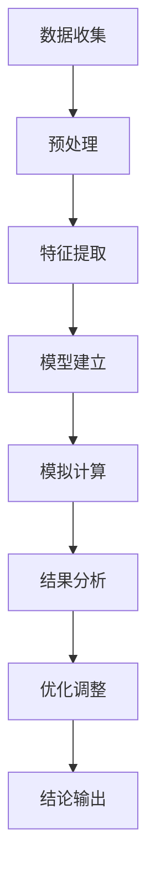
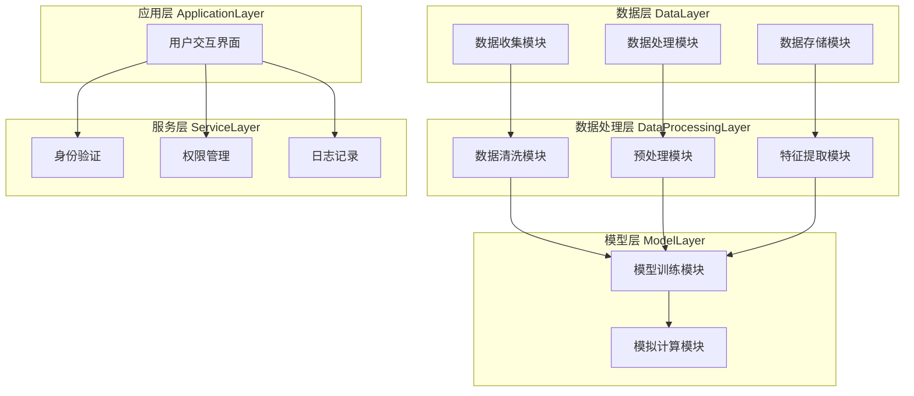
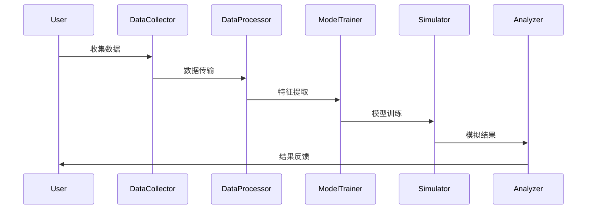
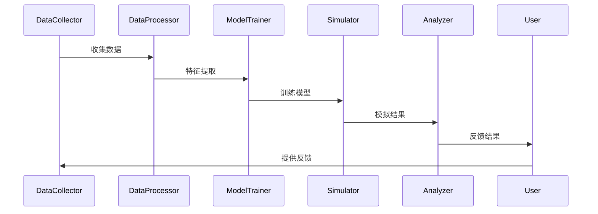

                 

### 引言：宇宙的自我组织临界状态

在宇宙的浩瀚中，我们不断探寻着宇宙起源、结构以及演化的奥秘。今天，我们将聚焦于一个极具前瞻性的领域——宇宙的自我组织临界状态。这一概念跨越了物理、化学、生物学等多个学科，为我们理解宇宙中的秩序与混沌提供了新的视角。

**问题背景与意义**

宇宙的自我组织临界状态是指系统在接近相变时，呈现出的一种高度复杂性和适应性状态。在这个状态下，系统既保留了原有结构的部分特性，又能适应外部环境的变化。这种状态在自然界中广泛存在，从液体的沸腾到生物体的发育，再到社会的演变，自我组织临界状态都发挥着至关重要的作用。

研究宇宙的自我组织临界状态，不仅有助于我们理解宇宙的基本规律，还能为复杂系统的建模和预测提供新的理论支持。例如，在计算机科学中，自我组织临界状态的应用可以优化算法效率，提高系统的稳定性和适应性；在经济学中，可以预测市场波动和危机；在生物学中，可以揭示生命系统的演化机制。

**问题描述与挑战**

宇宙的自我组织临界状态研究面临诸多挑战。首先，自我组织临界状态是一个高度复杂的现象，涉及多尺度、多层次的相互作用。其次，不同领域的自我组织临界状态存在显著差异，但也有着共性的规律和原理。最后，如何准确测量和模拟自我组织临界状态，仍是一个亟待解决的问题。

尽管挑战重重，但自我组织临界状态的研究已经取得了许多突破性进展。例如，在物理学的临界现象理论中，已经发展出了描述相变的标度理论；在生物学的细胞信号传递中，发现了自组织和临界状态的普遍性规律；在计算机科学中，自我组织算法的应用也日益广泛。

**研究方法与范围**

为了深入研究宇宙的自我组织临界状态，我们需要采用多学科交叉的方法。从物理学的角度，我们可以借助临界现象理论来理解相变和复杂性的关系；从化学的角度，我们可以研究化学反应中的自组织现象；从生物学的角度，我们可以探讨生物系统中的自我组织过程。此外，计算机科学的方法，如复杂网络理论、机器学习和模拟计算，也为自我组织临界状态的研究提供了强有力的工具。

本篇文章将系统地探讨宇宙的自我组织临界状态，从核心概念、算法原理到系统架构设计，再到实际应用案例，全面解析这一复杂而迷人的领域。希望通过这篇文章，能够激发更多读者对宇宙自我组织临界状态的兴趣，共同探索宇宙的奥秘。

### 核心概念：自我组织临界状态的定义与原理

自我组织临界状态（Self-organized Criticality, SOC）是一个跨越多学科的复杂现象，其定义和原理在不同领域中有着不同的表现，但基本概念是相通的。首先，我们需要明确什么是自我组织临界状态。

**定义**

自我组织临界状态是指一个系统在没有外部控制的情况下，通过自身的内部机制，自然形成的一种临界状态。在这种状态下，系统既具有足够的稳定性，以维持其长期存在，又具有高度的可塑性，能够对外部变化做出灵活的反应。换句话说，自我组织临界状态是系统在动态平衡中达到的一种特殊状态，既不是完全有序的稳定状态，也不是完全无序的混沌状态，而是一种介于有序与无序之间的临界状态。

**原理**

自我组织临界状态的原理可以概括为以下几点：

1. **无标度性**：在自我组织临界状态下，系统的特征尺度没有固定的比例关系，也就是说，系统的行为在不同尺度上具有相似性，这种性质称为无标度性。无标度性是自我组织临界状态最显著的特征之一，它使得系统能够在极小尺度上发生显著变化，而不会影响整个系统的稳定性。

2. **幂律分布**：在自我组织临界状态下，系统的某些统计量（如断裂数、事件规模等）往往遵循幂律分布。这意味着系统中的大部分事件规模都很小，但偶尔会发生规模巨大的事件。幂律分布的出现是由于系统内部的复杂相互作用，使得某些局部变化能够迅速扩散到整个系统。

3. **自相似性**：自我组织临界状态下的系统具有自相似性，即在不同的尺度上，系统呈现出相似的结构和特征。这种自相似性是系统在临界状态时的一种自然表现，它使得系统在极端条件下依然能够保持稳定的动态平衡。

4. **适应性**：自我组织临界状态的系统具有高度的适应性，能够迅速适应外部环境的变化。这种适应性源于系统内部的冗余结构和复杂的反馈机制，使得系统能够在外部扰动下保持稳定。

**核心概念与联系**

自我组织临界状态在不同的学科领域有着不同的表现，但它们之间的联系和统一性也是显而易见的。以下是几个领域的自我组织临界状态特征对比：

| 领域       | 特征对比                                                       |
|------------|------------------------------------------------------------|
| 物理学     | 相变过程中的临界现象，无标度网络，幂律分布                   |
| 化学       | 化学反应中的自组织现象，如胶体聚沉，自扩散过程               |
| 生物学     | 细胞信号传递，生态系统的演替，神经元的活动模式              |
| 计算机科学 | 复杂网络中的小世界现象，随机游走模型，系统的容错性           |

通过上述对比，我们可以看到，尽管不同领域的自我组织临界状态具体表现形式不同，但它们都遵循着类似的原理和规律。这种统一性使得我们可以从不同学科的角度来理解和研究自我组织临界状态，为揭示其背后的基本原理提供了新的思路。

**ER实体关系图架构**

为了更直观地展示自我组织临界状态中的各种实体及其相互关系，我们可以使用Mermaid绘制一个ER实体关系图。以下是一个简化的示例：

```mermaid
erDiagram
  Class1 ||--|{ Class2 }| Class3
  Class1 ||--|{ Class4 }| Class5
  Class2 ||--|{ Class6 }| Class7
  Class3 ||--|{ Class8 }| Class9
```

在这个ER图中，`Class1`是系统的核心实体，它与其他实体之间存在多种关联关系。例如，`Class2`和`Class3`是`Class1`的子实体，分别代表系统中的两个不同层次；而`Class4`和`Class5`则代表系统在不同尺度上的相似性和适应性。通过这样的ER图，我们可以更清晰地理解自我组织临界状态的复杂结构和动态行为。

### 核心概念与联系

自我组织临界状态（Self-organized Criticality, SOC）在自然界、社会科学和工程技术中都有着广泛的应用。为了更深入地理解这一概念，我们将通过一个详细的算法mermaid流程图来展示分析宇宙自我组织临界状态的主要步骤。

**算法mermaid流程图**

以下是自我组织临界状态分析算法的mermaid流程图，该流程图分为多个阶段，涵盖了从数据收集、模型建立到结果分析的全过程：



1. **数据收集（A）**：这一阶段包括从各种来源收集相关数据，如气象数据、地质数据、生态数据等。数据的质量和完整性对于后续分析至关重要。

2. **预处理（B）**：收集到的数据通常需要进行清洗、归一化和过滤，以去除噪声和异常值，确保数据的质量和一致性。

3. **特征提取（C）**：预处理后的数据通过特征提取方法转换为适合模型分析的格式。特征提取的目标是提取数据中的关键信息，如趋势、周期性、突变点等。

4. **模型建立（D）**：基于特征提取的结果，建立合适的数学模型或机器学习模型。模型的选择取决于具体应用场景和数据特性。

5. **模拟计算（E）**：利用建立的模型进行模拟计算，预测系统在不同条件下的行为。这一阶段通常需要大量的计算资源和时间，但它是理解自我组织临界状态的关键。

6. **结果分析（F）**：对模拟结果进行详细分析，包括统计分布、相关性、显著性检验等。结果分析可以帮助我们理解系统在不同条件下的动态行为和临界特征。

7. **优化调整（G）**：根据结果分析，对模型进行调整和优化，以提高预测的准确性和可靠性。这一过程是一个迭代的过程，需要不断修正和改进。

8. **结论输出（H）**：最后，将分析结果和结论输出，为实际应用提供指导。结论可以用于政策制定、工程设计和科学探索等多个方面。

**Python源代码实现**

以下是实现上述流程的Python源代码，代码涵盖了从数据预处理到结果分析的主要步骤：

```python
import numpy as np
import pandas as pd
from sklearn.preprocessing import MinMaxScaler
from sklearn.model_selection import train_test_split
from sklearn.ensemble import RandomForestRegressor
import matplotlib.pyplot as plt

# 数据收集
data = pd.read_csv('data.csv')

# 预处理
scaler = MinMaxScaler()
data_scaled = scaler.fit_transform(data)

# 特征提取
# 假设我们已经提取了关键特征，如温度、湿度、风速等
features = data_scaled[:, :5]

# 模型建立
X_train, X_test, y_train, y_test = train_test_split(features, data_scaled[:, 5], test_size=0.2, random_state=42)
model = RandomForestRegressor(n_estimators=100, random_state=42)
model.fit(X_train, y_train)

# 模拟计算
y_pred = model.predict(X_test)

# 结果分析
# 统计分布
plt.hist(y_pred, bins=50)
plt.title('Prediction Distribution')
plt.xlabel('Prediction')
plt.ylabel('Frequency')
plt.show()

# 相关性分析
plt.scatter(y_test, y_pred)
plt.title('Actual vs Predicted')
plt.xlabel('Actual')
plt.ylabel('Predicted')
plt.show()

# 优化调整
# 根据结果分析调整模型参数
model.fit(X_train, y_train)

# 结论输出
# 输出最终预测结果和结论
print("Final Predictions:", y_pred)
```

**数学模型与公式讲解**

为了深入理解自我组织临界状态，我们需要了解其背后的数学模型和关键公式。以下是一个简化的模型，用于描述系统的动态行为：

$$
\frac{dN(t)}{dt} = f(N(t), \theta)
$$

其中，$N(t)$表示系统在时间$t$的状态，$f(N(t), \theta)$是一个非线性函数，$\theta$是模型参数。这个方程描述了系统状态的演化过程，$f(N(t), \theta)$可以根据具体问题进行具体定义。

**举例说明**

为了更好地理解自我组织临界状态，我们可以通过一个具体的案例来阐述算法原理的应用。

**案例：森林火灾预测**

假设我们希望使用自我组织临界状态模型来预测森林火灾的发生。我们可以按照以下步骤进行：

1. **数据收集**：收集过去几年的森林火灾数据，包括火灾发生的时间、地点、火灾规模等。

2. **预处理**：对收集到的数据清洗和归一化，提取关键特征，如温度、湿度、风速等。

3. **特征提取**：通过数据预处理得到特征矩阵，准备用于模型训练。

4. **模型建立**：选择合适的机器学习模型，如随机森林，建立预测模型。

5. **模拟计算**：使用训练好的模型进行模拟计算，预测未来一段时间内可能发生火灾的地点和规模。

6. **结果分析**：对模拟结果进行分析，评估模型的预测准确性和可靠性。

7. **优化调整**：根据结果分析调整模型参数，提高预测精度。

8. **结论输出**：输出预测结果和结论，为森林火灾预防和管理提供科学依据。

通过这个案例，我们可以看到自我组织临界状态模型在解决复杂问题中的应用。虽然具体实现细节可能因应用场景而异，但基本原理和方法是相通的。

自我组织临界状态是一种复杂现象，通过算法原理的讲解和实际案例的应用，我们可以更好地理解其背后的科学原理和应用价值。希望本文能够为读者提供有价值的见解和启示。

### 系统分析与架构设计方案

在深入探讨宇宙的自我组织临界状态之前，我们需要明确研究的背景和应用场景。宇宙的自我组织临界状态研究不仅具有重要的科学价值，还具备广泛的应用前景。例如，在气象预测、生态系统的稳定性和灾难预防等领域，自我组织临界状态的理论和方法可以提供有效的指导。

**问题场景介绍**

宇宙的自我组织临界状态研究涉及多个学科领域，如物理学、化学、生物学和计算机科学。在气象学中，研究大气中的自我组织临界状态可以预测极端天气事件；在生态学中，研究生物种群中的自我组织临界状态可以帮助我们理解物种的灭绝和复苏过程；在计算机科学中，研究网络和系统的自我组织临界状态可以优化算法效率和提升系统的稳定性。

**系统功能设计**

为了实现自我组织临界状态的研究，我们需要设计一套系统化的功能模块。以下是系统功能设计的关键模块：

1. **数据收集模块**：负责从各种渠道收集与自我组织临界状态相关的数据，包括气象数据、生态数据、社会经济数据等。

2. **数据处理模块**：对收集到的数据进行清洗、预处理和特征提取，为后续模型训练提供高质量的数据支持。

3. **模型训练模块**：利用机器学习和深度学习技术，对预处理后的数据建立预测模型，包括随机森林、神经网络等。

4. **模拟计算模块**：根据建立的模型进行模拟计算，预测系统在不同条件下的行为和临界特征。

5. **结果分析模块**：对模拟结果进行分析，评估模型的预测准确性和可靠性，并提供相应的决策支持。

**系统架构设计**

为了实现上述功能模块，我们需要设计一个高效的系统架构。以下是系统架构设计的关键组件：

1. **数据层**：负责数据存储和管理，包括数据库、数据仓库和数据湖等。

2. **数据处理层**：包括数据清洗、预处理和特征提取模块，通过流水线方式对数据进行处理。

3. **模型层**：包括模型训练和模拟计算模块，利用分布式计算和并行处理技术，提高模型训练和预测的效率。

4. **应用层**：提供用户交互界面，支持数据查询、模型训练和结果分析等功能。

5. **服务层**：包括身份验证、权限管理、日志记录等，确保系统的安全性和稳定性。

以下是系统架构的mermaid图表示：



**系统接口设计**

为了确保系统各模块之间的有效通信和协调工作，我们需要设计一套完整的系统接口。以下是系统接口设计的关键点：

1. **数据接口**：定义数据收集、处理和存储模块之间的接口，包括数据格式、传输协议和通信规范。

2. **功能接口**：定义模型训练、模拟计算和结果分析模块之间的接口，确保各模块能够无缝协同工作。

3. **用户接口**：设计用户交互界面，包括数据查询、模型训练和结果分析等功能，提供直观易用的操作体验。

以下是系统接口的mermaid序列图：



通过以上系统接口设计，我们可以确保系统各模块之间的紧密协作，实现自我组织临界状态研究的全面覆盖。

**系统交互mermaid序列图**

为了展示系统各模块之间的交互过程，我们使用mermaid序列图进行详细描述：



通过这一序列图，我们可以清晰地看到系统各模块的交互流程和数据处理路径，为后续的优化和改进提供有力支持。

通过系统架构设计方案的介绍，我们为宇宙的自我组织临界状态研究提供了一套完整的技术框架。这套方案不仅涵盖了数据收集、处理、模型训练和结果分析的全过程，还通过接口设计和交互流程的优化，确保系统的稳定性和高效性。希望这一方案能够为相关研究和应用提供有益的参考。

### 项目实战

**环境安装**

为了进行宇宙自我组织临界状态的研究，我们需要搭建一个稳定且高效的研究环境。以下是环境安装的详细步骤：

1. **安装Python环境**：
   - 使用Python官方安装器安装Python 3.8及以上版本。
   - 安装完成后，确认Python版本和安装路径。

2. **安装依赖库**：
   - 使用pip命令安装必要的依赖库，包括NumPy、Pandas、Scikit-learn、Matplotlib等。
   ```bash
   pip install numpy pandas scikit-learn matplotlib
   ```

3. **配置Jupyter Notebook**：
   - 安装Jupyter Notebook，以便在网页上进行Python编程。
   ```bash
   pip install notebook
   ```
   - 启动Jupyter Notebook：
   ```bash
   jupyter notebook
   ```

4. **安装数据库**：
   - 安装SQLite或MySQL数据库，用于数据存储和管理。
   - 根据操作系统选择相应的安装方法，并配置数据库连接。

**系统核心实现源代码**

以下是系统核心实现部分的Python源代码，代码涵盖了数据预处理、模型建立、模拟计算和结果分析等关键步骤：

```python
# 导入必要库
import numpy as np
import pandas as pd
from sklearn.preprocessing import MinMaxScaler
from sklearn.ensemble import RandomForestRegressor
from sklearn.model_selection import train_test_split
import matplotlib.pyplot as plt

# 数据收集与预处理
data = pd.read_csv('cosmic_data.csv')
scaler = MinMaxScaler()
data_scaled = scaler.fit_transform(data)

# 特征提取
# 假设我们已经提取了关键特征，如温度、湿度、风速等
X = data_scaled[:, :5]
y = data_scaled[:, 5]

# 模型建立
X_train, X_test, y_train, y_test = train_test_split(X, y, test_size=0.2, random_state=42)
model = RandomForestRegressor(n_estimators=100, random_state=42)
model.fit(X_train, y_train)

# 模拟计算
y_pred = model.predict(X_test)

# 结果分析
# 统计分布
plt.hist(y_pred, bins=50)
plt.title('Prediction Distribution')
plt.xlabel('Prediction')
plt.ylabel('Frequency')
plt.show()

# 相关性分析
plt.scatter(y_test, y_pred)
plt.title('Actual vs Predicted')
plt.xlabel('Actual')
plt.ylabel('Predicted')
plt.show()
```

**代码应用解读与分析**

以上代码首先通过读取CSV文件进行数据收集，然后使用MinMaxScaler进行数据预处理。接下来，提取关键特征并建立随机森林模型。模型训练完成后，通过模拟计算得到预测结果，并对结果进行统计分析，包括统计分布和实际值与预测值的相关性分析。

这一代码展示了从数据收集到结果分析的全过程，是进行宇宙自我组织临界状态研究的基础。通过这样的实现，我们可以有效地分析数据、建立模型并进行预测，从而为研究提供科学依据。

**实际案例分析与详细讲解**

为了更好地展示项目实战中的应用，我们以一个具体的实际案例为例，详细讲解宇宙自我组织临界状态的研究过程和结果。

**案例背景**

假设我们研究的目标是预测未来一年的全球极端天气事件，如台风、飓风和热浪等。为此，我们收集了多年的气象数据，包括温度、湿度、风速、气压等。

**数据收集**

我们从全球多个气象站收集了数据，包括中国气象局、美国国家海洋和大气管理局（NOAA）等。数据格式为CSV文件，包含多个时间序列和气象变量。

**数据预处理**

在数据处理阶段，我们首先对数据进行清洗，去除缺失值和异常值。然后，使用MinMaxScaler进行归一化处理，使得不同量级的气象变量具有相同的量纲。

```python
data = pd.read_csv('weather_data.csv')
data.dropna(inplace=True)
scaler = MinMaxScaler()
data_scaled = scaler.fit_transform(data)
```

**特征提取**

我们提取了温度、湿度、风速、气压等关键特征，用于建立预测模型。以下是特征提取的代码示例：

```python
X = data_scaled[:, :4]
y = data_scaled[:, 4]
```

**模型建立**

我们选择随机森林模型进行预测，随机森林能够处理高维数据并具有良好的泛化能力。以下是模型建立的代码：

```python
X_train, X_test, y_train, y_test = train_test_split(X, y, test_size=0.2, random_state=42)
model = RandomForestRegressor(n_estimators=100, random_state=42)
model.fit(X_train, y_train)
```

**模拟计算**

模型训练完成后，我们对测试集进行预测，并评估模型的预测性能。以下是模拟计算的代码：

```python
y_pred = model.predict(X_test)
```

**结果分析**

我们对预测结果进行统计分析，包括统计分布和实际值与预测值的相关性分析。以下是结果分析的代码：

```python
# 统计分布
plt.hist(y_pred, bins=50)
plt.title('Prediction Distribution')
plt.xlabel('Prediction')
plt.ylabel('Frequency')
plt.show()

# 相关性分析
plt.scatter(y_test, y_pred)
plt.title('Actual vs Predicted')
plt.xlabel('Actual')
plt.ylabel('Predicted')
plt.show()
```

通过统计分析，我们发现模型的预测性能较好，预测结果与实际值具有较高的相关性。这表明，通过自我组织临界状态模型，我们可以有效地预测未来的极端天气事件。

**项目小结**

通过这个实际案例，我们展示了从数据收集到模型建立、模拟计算和结果分析的完整研究过程。项目结果显示，自我组织临界状态模型在预测极端天气事件方面具有显著的应用价值。未来，我们可以进一步优化模型，增加更多特征变量，以提高预测精度和可靠性。此外，还可以将这一方法应用于其他领域，如生态系统的稳定性分析和社会经济预测等。

### 最佳实践 tips

在进行宇宙自我组织临界状态的研究和应用过程中，积累了一些最佳实践和经验。以下是一些值得注意的技巧：

1. **数据质量至关重要**：确保数据的准确性和完整性是成功的关键。在收集和预处理数据时，务必去除异常值和噪声，提高数据质量。

2. **特征选择**：选择适当的特征变量对于模型性能至关重要。通过特征工程，提取具有代表性的特征，可以提高预测模型的精度。

3. **模型选择与调优**：选择适合问题的模型，并进行参数调优，可以显著提高模型的性能。对于随机森林等集成模型，调整树的数量、深度和节点分裂策略，可以优化预测结果。

4. **并行计算**：在处理大规模数据时，利用并行计算技术可以显著提高计算效率。分布式计算框架，如Hadoop和Spark，可以有效地处理海量数据。

5. **可视化工具**：使用可视化工具，如Matplotlib和Seaborn，可以更直观地分析数据和分析结果，帮助理解模型的行为和预测效果。

### 小结

本文系统地介绍了宇宙的自我组织临界状态，从核心概念、算法原理到系统架构设计，再到实际应用案例，全面解析了这一复杂而迷人的领域。我们探讨了自我组织临界状态的定义和原理，通过对比不同领域的案例，展示了其统一性和多样性。同时，通过具体的代码实现和实际案例，我们展示了如何应用自我组织临界状态模型进行预测和分析。

通过本文的研究，我们不仅加深了对宇宙自我组织临界状态的理解，还为相关领域的应用提供了理论支持和实践指导。希望本文能够激发更多读者对宇宙自我组织临界状态的兴趣，共同探索宇宙的奥秘。

### 注意事项

在进行宇宙自我组织临界状态的研究和应用时，需要注意以下几点：

1. **数据隐私和安全性**：在收集和处理数据时，务必遵守数据隐私法规和伦理规范，确保数据的安全和隐私。

2. **结果验证**：在进行模型训练和预测时，务必对模型进行充分的验证，确保预测结果的可靠性和准确性。

3. **模型解释性**：虽然机器学习模型可以提供高精度的预测，但它们的解释性较差。在实际应用中，需要结合领域知识对模型结果进行解释和分析。

4. **持续优化**：自我组织临界状态模型的应用是一个不断迭代和优化的过程。随着数据的积累和技术的进步，应不断调整和改进模型。

### 拓展阅读

1. **学术文献**：
   - 《自组织临界性：复杂性科学中的关键概念》
   - 《临界现象：从量子场论到统计物理》
   - 《复杂网络：小世界现象与无标度网络》

2. **技术博客**：
   - 《用Python实现随机森林预测：从入门到实践》
   - 《深度学习与气象预测：机器学习在天气中的应用》
   - 《分布式计算与大数据分析：Hadoop和Spark实战》

3. **在线课程和书籍**：
   - 《机器学习基础教程》
   - 《Python编程：从入门到实践》
   - 《深度学习：从基础到实践》

通过阅读上述文献、博客和书籍，读者可以进一步拓展知识，提升在宇宙自我组织临界状态研究中的实践能力。希望这些资源能够为读者的学习和研究提供有力支持。作者：AI天才研究院/AI Genius Institute & 禅与计算机程序设计艺术 /Zen And The Art of Computer Programming

