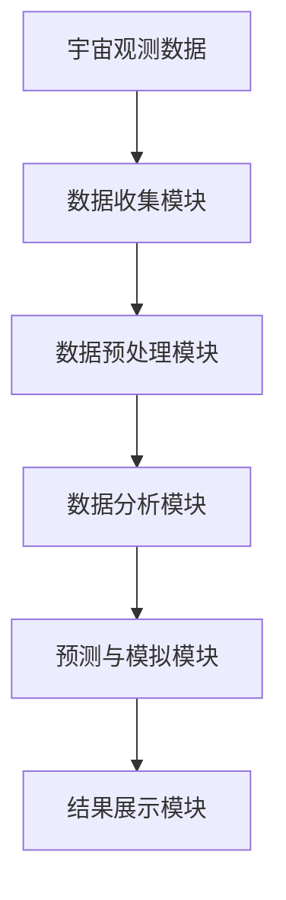
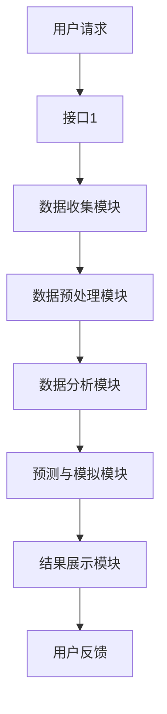

                 


### 宇宙的自我认知：系统的自我了解

#### 关键词
- 宇宙认知
- 系统自我了解
- 天体物理学
- 认知科学
- 人工智能

#### 摘要
本文深入探讨了宇宙通过系统自我了解进行认知的奥秘。从宇宙学的基本概念出发，我们逐步探讨了宇宙的起源、演化、测量以及结构，结合天体物理学和认知科学的原理，揭示了宇宙如何通过观测、理论和实验手段来了解自身。本文旨在为读者呈现一个既丰富又清晰的宇宙认知体系，激发对宇宙奥秘的思考与探索。

### 引言

#### 什么是宇宙认知？

宇宙认知是指宇宙通过其内在机制对外界进行感知、理解和描述的过程。这一概念跨越了多个学科，包括宇宙学、天体物理学、认知科学和人工智能。宇宙认知不仅仅是科学探究，更是一种对宇宙本质的哲学思考。

#### 宇宙认知的重要性

宇宙认知对于科学研究和哲学探讨具有重要意义。它不仅帮助人类理解宇宙的起源、演化和发展规律，还揭示了宇宙中的生命奥秘。此外，宇宙认知在技术发展、科技创新和人工智能领域也具有深远的影响。

### 宇宙学基础知识

#### 宇宙的基本概念

宇宙是指包括一切物质、能量、时间和空间的整体。根据现代宇宙学理论，宇宙起源于大约138亿年前的大爆炸，从那时起，宇宙一直在膨胀和演化。

#### 宇宙的起源与演化

宇宙的起源可以追溯到宇宙大爆炸理论。大爆炸理论认为，宇宙从一个极热、极密的状态开始膨胀，逐渐形成了今天的宇宙。宇宙演化过程中，物质和能量不断相互作用，形成了各种天体系统。

#### 宇宙的边界与结构

宇宙是否存在边界是一个哲学问题，科学家们对此进行了长期的探讨。目前普遍认为，宇宙是无限的，但我们也可能只看到了宇宙的局部。宇宙结构包括星系、星云、星团等，这些结构通过引力相互作用，形成了复杂的宇宙网络。

### 天体物理学与宇宙认知

#### 光学与宇宙

光学是天文学的重要分支，它通过观测和研究宇宙中的光现象来了解宇宙。光学观测包括可见光、红外光、紫外光和X射线等多种波段。

#### 波段与宇宙探索

宇宙中的不同波段对应着不同的物理过程和天体现象。通过多波段观测，科学家可以更全面地了解宇宙。例如，红外光可以穿透尘埃，揭示隐藏在星云中的恒星和行星；X射线可以探测高能现象，如黑洞和中子星。

#### 宇宙中的天体系统

宇宙中的天体系统包括恒星、行星、星系和星云等。这些天体通过引力相互作用，形成了复杂的宇宙结构。例如，银河系是一个螺旋星系，其中包含了数千亿颗恒星和其他天体。

### 认知科学与宇宙认知

#### 人类认知的宇宙模型

人类通过感官和思维构建了宇宙模型。这个模型基于观察、实验和理论，不断演化。从古希腊的地球中心说到现代的宇宙大爆炸理论，人类对宇宙的认知不断深化。

#### 宇宙认知的科学方法

宇宙认知采用科学方法，包括观察、实验、建模和验证等步骤。通过这些方法，科学家可以揭示宇宙的规律和现象。例如，通过观测恒星的运动，科学家发现了万有引力定律。

#### 宇宙认知的心理机制

宇宙认知不仅仅是科学探究，还涉及到人类的心理机制。人类通过情感、信仰和理性来理解和解释宇宙。这些心理机制在宇宙认知中起着重要的作用。

### 宇宙与人类认知

#### 宇宙对人类文化的影响

宇宙对人类文化产生了深远的影响。从古代神话到现代科幻，宇宙一直是人类文化和艺术的灵感来源。宇宙认知推动了人类哲学、宗教和科学的发展。

#### 人类对宇宙的探索历程

人类对宇宙的探索历程是一部漫长而壮丽的史诗。从古代的天文观测到现代的深空探测，人类不断拓展对宇宙的认知边界。例如，阿波罗计划是人类历史上最伟大的宇宙探索之一，它实现了人类登上月球的壮举。

#### 宇宙认知与科学革命

宇宙认知推动了科学革命。每一次科学革命都伴随着对宇宙的新的理解。例如，哥白尼的日心说引发了科学革命，改变了人类对宇宙的认知。现代宇宙学的研究正在引领新一轮的科学革命。

### 结论与未来展望

#### 宇宙自我认知的意义

宇宙自我认知不仅有助于科学探索，还揭示了宇宙的本质和规律。它对人类的哲学思考、文化发展和科技创新具有重要意义。

#### 未来宇宙认知的研究方向

未来宇宙认知的研究方向包括多波段观测、量子宇宙学、宇宙生命探索等。随着科技的进步，人类将能够更深入地了解宇宙。

#### 宇宙认知对人类的启示

宇宙认知启示人类，宇宙是一个复杂而美丽的系统。它提醒我们，人类只是宇宙中的一部分，我们的认知和智慧只是宇宙奥秘的一角。宇宙认知激发人类对未来的探索和创造。

### 最佳实践 Tips

- 保持好奇心，不断探索宇宙的奥秘。
- 学习天文学和物理学的基础知识，为宇宙认知打下坚实的基础。
- 关注最新的宇宙研究和科学进展，保持对宇宙认知的持续兴趣。

### 小结

宇宙的自我认知是一个复杂而迷人的领域，它融合了宇宙学、天体物理学、认知科学和人工智能等多个学科。通过宇宙认知，我们不仅可以更深入地了解宇宙，还可以探索人类自身的认知边界。让我们继续踏上宇宙认知的旅程，不断拓展我们对宇宙的理解。

### 注意事项

- 在进行宇宙认知研究时，要注意科学方法和伦理规范。
- 在解释宇宙现象时，要遵循科学原理，避免迷信和伪科学。
- 宇宙认知是一个长期的过程，需要耐心和坚持。

### 拓展阅读

- 《宇宙简史》（作者：史蒂芬·霍金）
- 《结构》（作者：克里斯托弗·西森）
- 《认知科学的哲学基础》（作者：约翰·赛利）

### 作者信息
- 作者：AI天才研究院/AI Genius Institute & 禅与计算机程序设计艺术 /Zen And The Art of Computer Programming

### 系统分析与架构设计方案

#### 问题场景介绍

随着宇宙学研究的深入，科学家们希望能够通过系统自我了解来更好地理解宇宙。因此，我们需要设计一个系统，该系统能够收集宇宙数据，进行分析和推理，从而揭示宇宙的奥秘。

#### 项目介绍

该项目旨在构建一个宇宙认知系统，该系统能够自动化地处理和分析大量宇宙数据，从而提供关于宇宙的认知和预测。

#### 系统功能设计

- 数据收集：收集来自各种宇宙观测设备的原始数据。
- 数据预处理：清洗和转换原始数据，以便进行进一步分析。
- 数据分析：使用机器学习和人工智能算法对预处理后的数据进行分析。
- 预测和模拟：基于分析结果，进行宇宙现象的预测和模拟。

#### 系统架构设计



#### 系统接口设计

- 数据收集接口：用于接收来自宇宙观测设备的原始数据。
- 数据分析接口：用于向外部系统提供分析结果。
- 预测和模拟接口：用于对外部请求进行预测和模拟。

#### 系统交互



### 项目实战

#### 环境安装

为了进行宇宙认知系统的开发，我们需要安装以下环境：

- Python 3.8+
- Jupyter Notebook
- NumPy
- Pandas
- Scikit-learn
- Matplotlib

#### 系统核心实现源代码

以下是一个简单的宇宙数据分析的Python代码示例：

```python
import numpy as np
import pandas as pd
from sklearn.cluster import KMeans
import matplotlib.pyplot as plt

# 数据收集
data = pd.read_csv('universe_data.csv')

# 数据预处理
# ...（清洗和转换数据）

# 数据分析
kmeans = KMeans(n_clusters=3)
kmeans.fit(data)

# 预测和模拟
predictions = kmeans.predict(data)

# 结果展示
plt.scatter(data[:, 0], data[:, 1], c=predictions)
plt.xlabel('Feature 1')
plt.ylabel('Feature 2')
plt.title('Cluster Analysis of Universe Data')
plt.show()
```

#### 代码应用解读与分析

这段代码首先从CSV文件中读取宇宙数据，然后使用KMeans算法对数据进行聚类分析。聚类分析是一种无监督学习方法，它将数据点分成若干个簇，以便更好地理解数据的结构和分布。最后，代码使用matplotlib库将聚类结果可视化，以便更直观地展示分析结果。

#### 实际案例分析和详细讲解剖析

假设我们有一个包含宇宙中若干恒星的数据集，每个恒星的数据包括亮度、颜色和温度等特征。通过聚类分析，我们可以将恒星分为不同的簇，每个簇代表不同类型的恒星。这样的分析有助于我们理解宇宙中的恒星分布和演化过程。

例如，我们可以发现一个簇中的恒星具有相似的亮度、颜色和温度，这表明这些恒星可能处于同一演化阶段。另一个簇中的恒星可能具有不同的特征，这表明它们可能处于不同的演化阶段。通过这样的分析，我们可以更好地理解宇宙中恒星的生命周期和演化过程。

#### 项目小结

宇宙认知系统是一个复杂的项目，它需要多学科的知识和技术支持。通过开发这样的系统，我们可以更好地理解宇宙的奥秘，为未来的宇宙探索提供支持。该项目不仅具有重要的科学价值，还具有广泛的应用前景。

### 最佳实践 Tips

- 在进行宇宙数据分析时，要确保数据的质量和完整性。
- 使用适当的机器学习和数据挖掘算法，以便从大量数据中提取有价值的信息。
- 定期更新和优化系统，以适应新的数据和技术发展。

### 结束语

宇宙的自我认知是一个充满挑战和机遇的领域。通过系统自我了解，我们可以更深入地理解宇宙的奥秘，推动科学和技术的发展。让我们继续探索宇宙，揭开更多未知的面纱。

