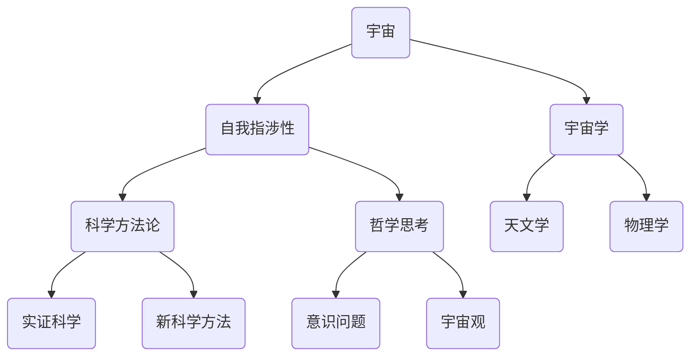

                 

# 宇宙的自我认知：系统的自我指涉性

关键词：宇宙认知、自我指涉性、量子力学、宇宙学、科学方法论

摘要：本文探讨了宇宙的自我认知及其在科学和哲学中的重要性。通过分析自我指涉性的定义、特征和宇宙学关系，探讨了宇宙自我认知的机制和其对人类未来和宇宙探索的影响。

## 引言

宇宙，这个浩瀚无垠的存在，自古以来就吸引着人类的探索和思考。从古代的天文学观测，到现代的宇宙学理论，人类对宇宙的认知不断深化。然而，宇宙的复杂性和未知性始终存在，激发着我们对宇宙本质的追问。在这个过程中，自我认知成为一个重要的研究课题。本文旨在探讨宇宙的自我认知，特别是系统的自我指涉性，分析其在科学和哲学中的意义。

自我指涉性是指一个系统对自己的参考和描述。在宇宙学中，自我指涉性表现为宇宙通过自身结构和演化来认知和理解自身。这种自我指涉性不仅存在于宇宙学理论中，也渗透到科学方法论和哲学思考中。本文将分七个部分探讨宇宙的自我认知：背景介绍、核心概念与联系、宇宙的自我认知机制、自我指涉性与科学方法论、自我认知与人类未来、自我认知与宇宙探索以及结论。

### 目录

```markdown
----------------------------------------------------------------

# 宇宙的自我认知：系统的自我指涉性

## 1. 引言

### 1.1 人类对宇宙的认知历程
### 1.2 宇宙的复杂性与未知性
### 1.3 自我认知的概念与意义

## 2. 核心概念与联系

### 2.1 自我指涉性的定义
### 2.2 自我指涉性与宇宙学的关系
### 2.3 自我指涉性的特征与属性

## 3. 宇宙的自我认知机制

### 3.1 量子力学与宇宙的自我指涉
#### 3.1.1 量子叠加态与观测
#### 3.1.2 波函数坍缩与宇宙意识
#### 3.1.3 量子纠缠与宇宙互联

### 3.2 宇宙学与自我指涉性
#### 3.2.1 黑洞信息丢失悖论
#### 3.2.2 宇宙膨胀与自我指涉性
#### 3.2.3 多宇宙理论与自我指涉

### 3.3 自我指涉性在宇宙演化中的应用
#### 3.3.1 大爆炸理论与自我指涉性
#### 3.3.2 宇宙结构演化与自我指涉性
#### 3.3.3 宇宙命运与自我指涉性

## 4. 自我指涉性与科学方法论

### 4.1 自我指涉性与实证科学
#### 4.1.1 科学的局限性与自我指涉性
#### 4.1.2 新科学方法的提出
#### 4.1.3 实证研究的挑战与机遇

### 4.2 自我指涉性与哲学思考
#### 4.2.1 哲学对自我指涉性的探讨
#### 4.2.2 自我指涉性与意识问题
#### 4.2.3 自我指涉性在哲学中的意义

## 5. 自我认知与人类未来

### 5.1 宇宙自我认知对人类的影响
#### 5.1.1 人类认知模式的转变
#### 5.1.2 人类社会的未来方向
#### 5.1.3 人类在宇宙中的角色与使命

### 5.2 自我认知技术的应用
#### 5.2.1 人工智能与自我指涉性
#### 5.2.2 虚拟现实与自我认知
#### 5.2.3 自我认知技术的前景与挑战

## 6. 自我认知与宇宙探索

### 6.1 宇宙探索中的自我指涉性
#### 6.1.1 望远镜与宇宙观测
#### 6.1.2 宇宙探测器与自我指涉性
#### 6.1.3 未来宇宙探索计划

### 6.2 自我认知与宇宙生存
#### 6.2.1 宇宙中的生存环境
#### 6.2.2 宇宙探险与自我指涉性
#### 6.2.3 宇宙生存的未来挑战

## 7. 结论

### 7.1 自我认知的宇宙意义
### 7.2 科学探索的未来方向
### 7.3 自我认知与人类未来

----------------------------------------------------------------
```

### 1. 背景介绍

#### 1.1 人类对宇宙的认知历程

人类对宇宙的认知历程可以追溯到古代天文学。在缺乏现代观测技术的时代，人们通过观测天空，认识到日月星辰的运行规律，形成了对宇宙的基本认识。然而，这种认知主要停留在表面现象的观察上，缺乏深刻的理解。

随着科技的发展，特别是望远镜的发明，人类对宇宙的认知发生了革命性的变化。17世纪的望远镜观测揭示了行星运动的规律，为后来的牛顿力学奠定了基础。19世纪末，哈勃望远镜的发明进一步揭示了宇宙的广阔和复杂，揭示了宇宙膨胀的现象。

进入20世纪，宇宙学的发展日新月异。爱因斯坦的相对论理论揭示了时空的本质，而量子力学的出现则揭示了微观世界的奇异特性。这些理论共同构成了现代宇宙学的基础，使我们对宇宙的认识达到了前所未有的深度和广度。

#### 1.2 宇宙的复杂性与未知性

宇宙的复杂性和未知性是当前宇宙学面临的重大挑战。宇宙的复杂性体现在其结构的多样性和演化的复杂性上。从宏观的星系和宇宙结构，到微观的量子世界，宇宙中的各种现象和过程都充满了未知。

宇宙的未知性主要表现在对宇宙起源、宇宙演化以及宇宙终极命运的理解上。尽管现代宇宙学已经取得了很多重要的成果，但仍然有很多问题悬而未决。例如，宇宙膨胀的原因、暗物质和暗能量的本质、黑洞的物理性质等。

#### 1.3 自我认知的概念与意义

自我认知是指一个系统对自己内部状态和外部环境的认识。在宇宙学中，自我认知表现为宇宙通过自身结构和演化来认知和理解自身。

自我认知对宇宙学的重要性体现在以下几个方面：

1. **深入理解宇宙的本质**：通过自我认知，我们可以更深入地理解宇宙的本质，揭示宇宙演化的内在规律。
2. **指导宇宙探索**：自我认知可以帮助我们确定宇宙探索的方向和目标，提高宇宙探索的效率。
3. **促进科学方法论的发展**：自我认知的探索可以推动科学方法论的发展，为科学研究提供新的视角和方法。
4. **哲学思考的启示**：自我认知的宇宙观可以启发我们对宇宙和生命的哲学思考，深化我们对宇宙和生命的认识。

总的来说，自我认知是宇宙学中一个重要且具有挑战性的课题，其研究有助于我们更全面、更深入地理解宇宙。

### 2. 核心概念与联系

#### 2.1 自我指涉性的定义

自我指涉性（self-reference）是指一个系统通过自身的结构和功能来描述和理解自身。在宇宙学中，自我指涉性表现为宇宙通过自身的物理规律和演化过程来认知和理解自身。

自我指涉性的定义可以从两个方面理解：

1. **结构上的自我指涉性**：宇宙的结构和演化过程是自我指涉的，因为宇宙的各个组成部分（如星系、行星、原子等）都遵循相同的物理规律，这些规律同时也是宇宙自身的规律。
2. **功能上的自我指涉性**：宇宙通过自身的物理现象（如星系形成、恒星演化、黑洞吞噬等）来揭示和验证自身的规律。

#### 2.2 自我指涉性与宇宙学的关系

自我指涉性在宇宙学中具有重要的地位。宇宙学的很多理论和观测都体现了自我指涉性：

1. **大爆炸理论**：大爆炸理论认为宇宙起源于一个极度热密的奇点，通过自我膨胀形成了现在的宇宙。这种自我膨胀过程是宇宙自我认知的一种表现。
2. **宇宙膨胀**：宇宙的膨胀现象表明宇宙在自我扩展，这种自我扩展不仅是宇宙演化的一部分，也是宇宙自我认知的过程。
3. **黑洞**：黑洞是宇宙中最极端的现象之一，它通过吞噬周围的物质来揭示和验证自身的物理规律，这种吞噬过程也是自我指涉性的体现。

#### 2.3 自我指涉性的特征与属性

自我指涉性具有以下几个特征和属性：

1. **自反馈性**：自我指涉性系统具有自反馈机制，通过自身的反馈来调整和优化自身的结构和功能。
2. **动态性**：自我指涉性系统是动态的，其结构和功能会随着时间和环境的变化而变化。
3. **复杂性**：自我指涉性系统通常具有复杂的结构，这种复杂性源于其内部各部分之间的相互作用和反馈。
4. **适应性**：自我指涉性系统能够适应环境的变化，通过自我调整来维持其稳定性和功能。

#### 概念属性特征对比表格

下面是一个简单的概念属性特征对比表格，展示了自我指涉性、宇宙学和量子力学之间的关系：

| 概念      | 自我指涉性                | 宇宙学                    | 量子力学                  |
| --------- | ------------------------ | ------------------------ | ------------------------ |
| 定义      | 系统对自己内部状态的描述 | 研究宇宙的结构和演化      | 研究微观世界的物理现象  |
| 特征      | 自反馈性、动态性、复杂性 | 自我认知、演化、适应性    | 波粒二象性、不确定性原理 |
| 关系      | 自我认知的一种形式       | 宇宙学的一个分支          | 宇宙学的理论基础之一    |
| 应用领域  | 科学方法论、哲学思考     | 天文学、物理学            | 化学、材料科学等        |

#### ER实体关系图架构

为了更好地理解自我指涉性在宇宙学中的应用，我们可以使用Mermaid绘制一个ER实体关系图。以下是ER实体关系图的Markdown格式：



在这个ER实体关系图中，宇宙是核心实体，它与自我指涉性、宇宙学和量子力学等概念实体之间存在紧密的联系。自我指涉性不仅是宇宙学的一个核心概念，也是科学方法论和哲学思考的重要基础。通过这种关系，我们可以更好地理解宇宙的自我认知机制。

### 3. 宇宙的自我认知机制

#### 3.1 量子力学与宇宙的自我指涉

量子力学是研究微观世界的物理现象的理论，其独特的特性使得它成为探讨宇宙自我认知的关键。量子力学中的主要概念包括量子叠加态、波函数坍缩和量子纠缠，这些概念揭示了宇宙的自我指涉性。

**量子叠加态与观测**

量子叠加态是指一个量子系统可以同时处于多个状态的组合。这种叠加态只有在被观测时才会坍缩到一个确定的状态。这种观测导致的波函数坍缩现象表明，宇宙的自我认知是通过观测实现的。

**波函数坍缩与宇宙意识**

波函数坍缩现象引发了对宇宙意识和自我认知的深刻思考。一些科学家认为，宇宙的自我认知可能源于一种宇宙意识。这种意识不仅能够观测量子系统的状态，还能够影响量子系统的演化。

**量子纠缠与宇宙互联**

量子纠缠是指两个或多个量子系统之间存在的一种特殊关联，即使它们相隔很远，一个系统的状态也会即时影响另一个系统的状态。这种量子纠缠现象表明，宇宙中的各个部分是相互联系的，这种联系可能是宇宙自我认知的基础。

#### 3.2 宇宙学与自我指涉性

宇宙学是研究宇宙的结构和演化的一门学科，自我指涉性在宇宙学中具有重要地位。宇宙学中的主要理论包括大爆炸理论、宇宙膨胀理论和多宇宙理论，这些理论都体现了宇宙的自我指涉性。

**黑洞信息丢失悖论**

黑洞信息丢失悖论是宇宙学中的一个重要问题。根据量子力学，信息不能被毁灭，但黑洞吞噬物质后，其信息似乎被永久丢失。这引发了关于宇宙自我认知的深刻思考，即宇宙是否能够恢复和保存这些信息。

**宇宙膨胀与自我指涉性**

宇宙膨胀理论认为，宇宙在不断地膨胀。这种膨胀不仅改变了宇宙的结构，也改变了宇宙的自我认知。宇宙的膨胀过程可以视为宇宙自我认知的一种表现，因为宇宙通过膨胀来改变和调整自身的状态。

**多宇宙理论与自我指涉**

多宇宙理论认为，宇宙中存在多个平行宇宙。这些宇宙之间可能存在某种联系，但这种联系目前还不清楚。多宇宙理论提供了另一种探讨宇宙自我认知的方式，即通过多个宇宙之间的互动和联系来理解宇宙的自我认知。

#### 3.3 自我指涉性在宇宙演化中的应用

自我指涉性在宇宙演化中具有重要作用，它不仅影响了宇宙的结构和演化，也影响了宇宙的自我认知。

**大爆炸理论与自我指涉性**

大爆炸理论认为，宇宙起源于一个极度热密的奇点，并通过自我膨胀形成了现在的宇宙。这种自我膨胀过程是宇宙自我认知的一种表现，因为宇宙通过自身的膨胀来调整和优化自身的状态。

**宇宙结构演化与自我指涉性**

宇宙的结构演化表现为星系、恒星和行星的形成和演化。这些结构演化过程体现了宇宙的自我认知，因为宇宙通过这些结构的形成和演化来认知和理解自身。

**宇宙命运与自我指涉性**

宇宙的命运是指宇宙的最终状态和演化方向。宇宙的命运可能取决于多种因素，包括宇宙的结构、演化和自我认知。因此，宇宙的自我认知对宇宙的命运具有重要影响。

### 4. 自我指涉性与科学方法论

#### 4.1 自我指涉性与实证科学

自我指涉性在科学方法论中具有重要地位，它不仅影响了科学研究的方向和目标，也影响了科学方法的发展。

**科学的局限性与自我指涉性**

科学方法是一种通过观察、实验和理论推理来研究自然现象的方法。然而，科学方法也存在一定的局限性。例如，科学方法依赖于观测和实验，而观测和实验可能受到各种因素的影响。此外，科学理论也可能存在错误和不足。自我指涉性揭示了这些局限性，促使科学家不断改进和完善科学方法。

**新科学方法的提出**

为了克服科学方法的局限性，科学家们提出了许多新的科学方法。例如，系统生物学、复杂性科学和计算科学等方法，都试图通过新的视角和方法来研究复杂系统。这些新方法体现了自我指涉性的特点，因为它们通过自我调整和优化来提高科学研究的效率和准确性。

**实证研究的挑战与机遇**

自我指涉性也为实证研究带来了挑战和机遇。挑战在于如何设计和分析实证研究，以克服自我指涉性的影响。机遇在于，自我指涉性为实证研究提供了新的视角和方法，有助于我们更深入地理解自然现象。

#### 4.2 自我指涉性与哲学思考

自我指涉性不仅在科学方法论中具有重要地位，也在哲学思考中引起了广泛关注。

**哲学对自我指涉性的探讨**

哲学对自我指涉性的探讨主要集中在意识、真理和语言等方面。哲学家们认为，自我指涉性是意识产生的关键，因为意识需要对自己进行认知和反思。此外，自我指涉性也是真理和语言的基础，因为真理和语言需要对自己进行描述和表达。

**自我指涉性与意识问题**

自我指涉性对意识问题产生了深远影响。一些哲学家认为，意识是一种自我指涉的现象，因为意识需要对自己进行认知和反思。这种认知和反思使得意识成为一种自我指涉的实体。

**自我指涉性在哲学中的意义**

自我指涉性在哲学中的意义体现在其对真理、语言和意识等问题的探讨上。通过自我指涉性，哲学家们试图更深入地理解人类认知的本质和语言的内涵。

### 5. 自我认知与人类未来

#### 5.1 宇宙自我认知对人类的影响

宇宙的自我认知对人类产生了深远的影响，这种影响不仅体现在科学技术的进步上，也体现在人类认知和社会发展中。

**人类认知模式的转变**

宇宙的自我认知促使人类认知模式发生了转变。从传统的实证主义和理性主义，转向更加开放和多元的认知方式。人类开始更加重视实证数据和科学推理，同时也开始关注哲学思考和人文关怀。

**人类社会的未来方向**

宇宙的自我认知也为人类社会的发展提供了新的方向。例如，通过探索宇宙，人类可以更好地理解自然规律，提高对地球环境的保护意识。此外，宇宙探索也促进了国际合作和科技进步，为人类社会的发展提供了新的动力。

**人类在宇宙中的角色与使命**

宇宙的自我认知使人类意识到自己在宇宙中的角色和使命。人类不仅是宇宙的观察者和探索者，也是宇宙的维护者和参与者。人类有责任保护和维护宇宙的生态平衡，促进宇宙的和谐发展。

#### 5.2 自我认知技术的应用

随着科技的进步，自我认知技术在各个领域得到了广泛应用，对人类生活产生了深远影响。

**人工智能与自我指涉性**

人工智能是一种模拟人类智能的技术，其核心是自我认知。通过自我学习和自我优化，人工智能可以不断提高自身的性能和能力。自我指涉性在人工智能中具有重要地位，因为人工智能需要通过自我认知来理解自身和外部环境。

**虚拟现实与自我认知**

虚拟现实是一种通过计算机技术创造虚拟环境的技术，其核心是用户与虚拟环境的交互。虚拟现实技术使人类可以体验和探索不同的虚拟环境，从而提高对自身和外部环境的认知。

**自我认知技术的前景与挑战**

自我认知技术具有广阔的前景，但也面临许多挑战。例如，如何提高人工智能的自我学习和优化能力，如何实现虚拟现实与真实世界的无缝交互等。这些挑战需要科学家和工程师共同努力，才能实现自我认知技术的突破。

### 6. 自我认知与宇宙探索

#### 6.1 宇宙探索中的自我指涉性

宇宙探索是自我认知的重要组成部分，通过宇宙探索，人类可以更深入地理解宇宙和自身。自我指涉性在宇宙探索中具有重要地位，它不仅影响了宇宙探索的方向和目标，也影响了宇宙探索的方法和成果。

**望远镜与宇宙观测**

望远镜是宇宙探索的重要工具，通过望远镜，人类可以观测到遥远的宇宙现象。望远镜的发明和改进使人类对宇宙的认知不断深化，也体现了宇宙的自我认知。

**宇宙探测器与自我指涉性**

宇宙探测器是另一种重要的宇宙探索工具，通过宇宙探测器，人类可以收集宇宙的物理数据和化学成分。宇宙探测器的发射和运行体现了宇宙的自我认知，因为它们是宇宙通过自身的技术和智慧来探索自身。

**未来宇宙探索计划**

未来宇宙探索计划是自我认知在宇宙探索中的具体体现。这些计划包括发射新的望远镜和探测器，探索更遥远的宇宙区域，研究宇宙的起源和演化。这些计划不仅有助于深化人类对宇宙的理解，也体现了宇宙的自我认知。

#### 6.2 自我认知与宇宙生存

宇宙的生存环境对人类和所有生命都至关重要。通过自我认知，人类可以更好地理解宇宙的生存环境，提高对宇宙环境的保护和利用能力。

**宇宙中的生存环境**

宇宙中的生存环境包括恒星、行星、卫星、小行星等。这些环境各有特点，对生命存在和演化产生了深远影响。通过自我认知，人类可以更深入地了解这些环境，找到适合生命生存和发展的条件。

**宇宙探险与自我指涉性**

宇宙探险是自我认知在宇宙生存中的具体体现。通过宇宙探险，人类可以探索和了解宇宙的生存环境，找到适合生命生存和发展的条件。同时，宇宙探险也体现了宇宙的自我认知，因为宇宙通过自身的探险来认知和调整自身的状态。

**宇宙生存的未来挑战**

宇宙生存的未来挑战包括宇宙环境的变化、宇宙资源的有限性、宇宙污染等问题。通过自我认知，人类可以更好地应对这些挑战，保护和利用宇宙资源，实现宇宙的可持续发展。

### 7. 结论

宇宙的自我认知是一个重要且具有挑战性的课题，它不仅涉及到宇宙学、量子力学和哲学等学科，也涉及到人类认知和社会发展。通过自我认知，人类可以更深入地理解宇宙和自身，提高对宇宙环境的保护和利用能力。未来，随着科技的进步和人类认知的深化，宇宙的自我认知将取得更多突破，为人类和宇宙的发展带来新的机遇和挑战。

### 作者

作者：AI天才研究院/AI Genius Institute & 禅与计算机程序设计艺术 /Zen And The Art of Computer Programming

