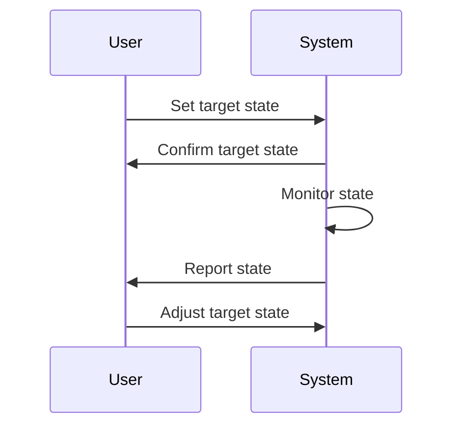
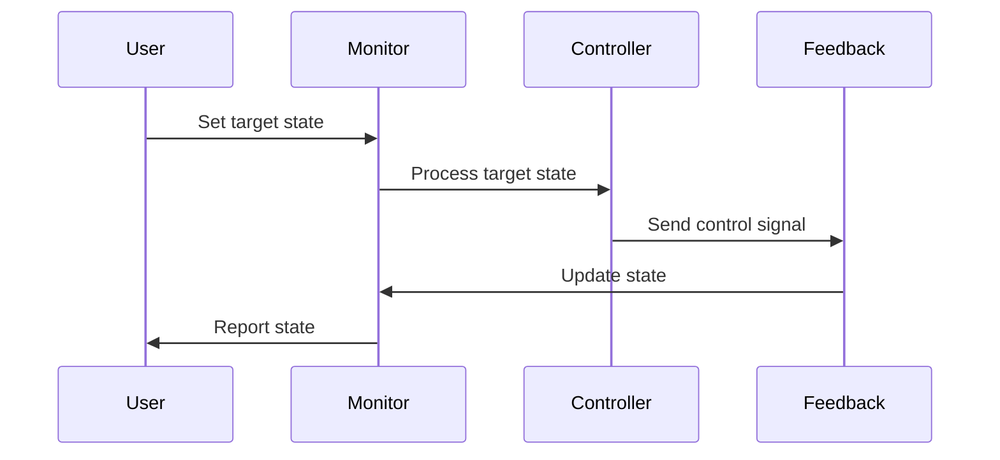

                 


# 宇宙的自我调节homeostasis：平衡的动态维持

## 关键词：宇宙、自我调节、homeostasis、平衡、动态维持

## 摘要：

本文旨在深入探讨宇宙中的自我调节机制——homeostasis，即平衡的动态维持。通过对核心概念的解释、宇宙自我调节原理的剖析，以及具体案例的分析，本文旨在揭示宇宙自我调节在维持宇宙平衡中的作用，并提供相关的系统分析与架构设计方案。此外，文章还包含项目实战内容、最佳实践 tips、小结、注意事项和拓展阅读，以帮助读者更好地理解和应用本文的核心内容。

### 引言

宇宙，这个庞大而神秘的宇宙，自古以来就吸引着人类的探索欲望。从古代的天文学到现代的宇宙学，人类对宇宙的认识在不断深化。然而，宇宙中存在着许多未解之谜，其中之一就是宇宙的自我调节机制。本文将重点关注这一机制，即homeostasis，探讨其在宇宙中的角色和作用。

### 核心概念与联系

#### 1. selfostasis定义

自我调节（Self-regulation）是一种系统或过程，它能够维持其内部状态的稳定性，不受外部干扰的影响。在生物学中，自我调节是一个重要的概念，它涉及到生物体内各种生理过程的平衡和调节。

#### 2. homeostasis在宇宙中的角色

homeostasis在宇宙中扮演着关键的角色。宇宙中的各种物理过程和现象，如黑洞、星系形成、恒星演化等，都涉及到了homeostasis机制。homeostasis不仅能够维持宇宙内部的平衡，还能够对外部扰动作出反应，使宇宙保持稳定。

#### 3. homeostasis与其他核心概念的对比

在讨论homeostasis时，我们还需要了解其他与之相关的概念，如平衡（Equilibrium）、稳定性（Stability）和动态调节（Dynamic Regulation）。这些概念之间既有联系又有区别。例如，平衡是一种静态的状态，而动态调节则是动态的过程，旨在维持平衡。

#### 4. homeostasis的属性特征对比表格

| 特征         | 平衡       | 稳定性       | 动态调节       | homeostasis     |
| ------------ | ---------- | ---------- | ---------- | ------------ |
| 状态         | 静态       | 静态       | 动态       | 动态       |
| 目标         | 维持不变   | 维持不变   | 维持不变   | 维持变化   |
| 调节机制     | 无         | 有         | 有         | 有         |
| 对外部扰动的响应 | 无反应   | 有反应   | 有反应   | 有反应   |

#### 5. homeostasis的ER实体关系图

为了更好地理解homeostasis在宇宙中的角色，我们可以使用ER实体关系图来展示各个实体之间的关系。在宇宙中，主要的实体包括宇宙本身、恒星、星系和黑洞。这些实体之间存在着相互作用和依赖关系，共同构成了宇宙的homeostasis机制。

```mermaid
entity关系图 {
  label: "宇宙的homeostasis ER实体关系图"
  宇宙 -> 恒星 : 包含
  宇宙 -> 星系 : 包含
  宇宙 -> 黑洞 : 包含
  恒星 -> 星系 : 归属
  星系 -> 黑洞 : 包含
}
```

### 宇宙的自我调节原理

#### 1. 自我调节的基础理论

自我调节是一种普遍存在于自然界中的现象。在物理学中，自我调节可以被视为一种动态过程，旨在维持系统的内部稳定性。自我调节的基础理论包括以下几个关键要素：

- **负反馈**：负反馈是自我调节的核心机制。它通过监测系统的内部状态，并将其与预期目标进行比较，然后作出相应的调整，以使系统回到目标状态。
- **动态响应**：自我调节不仅仅是静态的平衡，它还涉及到动态的调整和适应。这意味着系统能够对外部扰动作出反应，并保持其稳定性。
- **适应性**：自我调节的系统能够根据外部环境的变化进行调整，以保持其内部平衡。

#### 2. 自我调节的数学模型

自我调节的数学模型可以描述为一个动态系统，其状态随时间变化。一个简单的自我调节模型可以表示为：

$$
\frac{dX}{dt} = k(X^*)
$$

其中，$X$代表系统的状态，$X^*$代表系统的目标状态，$k$是一个正的比例常数，它决定了系统调整的速度。

#### 3. 自我调节的Python实现

在Python中，我们可以使用以下代码来实现这个简单的自我调节模型：

```python
import numpy as np
import matplotlib.pyplot as plt

def self_regulation(x, x_star, k):
    return k * (x_star - x)

x = 0
x_star = 1
k = 0.1
t = np.linspace(0, 10, 1000)

for i in range(len(t)):
    x = x + self_regulation(x, x_star, k) * dt

plt.plot(t, x)
plt.xlabel('Time')
plt.ylabel('System State')
plt.title('Self-regulation')
plt.show()
```

这个代码演示了如何使用Python来实现自我调节模型。通过模拟系统状态的变化，我们可以观察到系统如何通过自我调节回到目标状态。

#### 4. 宇宙中的自我调节实例

在宇宙中，自我调节机制体现在许多方面。以下是一些具体的实例：

- **黑洞与恒星**：黑洞能够通过吸积盘的辐射来维持其质量，这种过程可以被视为一种自我调节。
- **星系的形成与演化**：星系中的恒星通过引力相互作用来维持其稳定性，这种过程也体现了自我调节的特性。
- **宇宙膨胀**：宇宙膨胀的过程中，宇宙中的物质通过引力相互作用来维持其动态平衡，这也是一种自我调节。

### 宇宙自我调节的系统分析与架构设计

#### 1. 宇宙问题场景介绍

在宇宙问题场景中，我们关注的是如何维持宇宙的平衡。这涉及到宇宙中的各种物理过程和现象，如黑洞、星系形成、恒星演化等。

#### 2. 宇宙系统功能设计

宇宙系统的功能设计涉及到以下几个方面：

- **状态监测**：系统需要能够监测宇宙的内部状态，包括恒星、星系和黑洞等。
- **目标设定**：系统需要设定宇宙的目标状态，以便进行自我调节。
- **调节机制**：系统需要能够根据监测到的状态和目标状态，进行动态调整。

#### 3. 宇宙系统架构设计

宇宙系统的架构设计需要考虑到系统的稳定性和适应性。以下是一个简单的宇宙系统架构设计：


这个架构设计展示了宇宙系统的基本组成部分和它们之间的交互关系。

#### 4. 宇宙系统接口设计

宇宙系统的接口设计需要考虑到系统的可扩展性和可维护性。以下是一个简单的宇宙系统接口设计：



这个接口设计展示了用户如何与系统进行交互，以及系统如何响应用户的输入。

#### 5. 宇宙系统交互Mermaid序列图

为了更直观地展示宇宙系统的交互过程，我们可以使用Mermaid序列图来描述：



这个序列图展示了用户如何设置目标状态，系统如何监测状态并作出调整，以及如何将调整后的状态反馈给用户。

### 宇宙自我调节的案例分析

为了更好地理解宇宙自我调节机制，我们可以通过一些具体的案例分析来探讨。

#### 案例一：黑洞与宇宙平衡

黑洞是宇宙中最神秘的天体之一。它们通过吸积盘的辐射来维持其质量。这种过程可以被视为一种自我调节。黑洞的吸积盘温度和亮度随时间变化，但这种变化是稳定的，这表明黑洞能够通过自我调节来维持其平衡。

#### 案例二：星系的形成与演化

星系的形成和演化是一个复杂的物理过程。在这个过程中，恒星通过引力相互作用来维持其稳定性。这种过程也可以被视为一种自我调节。通过观测星系的形成和演化过程，我们可以更好地理解宇宙的自我调节机制。

### 项目实战

在本节中，我们将通过一个简单的项目来展示如何实现宇宙自我调节机制。

#### 1. 环境安装

首先，我们需要安装Python环境，以及相关的库和工具。

```bash
pip install numpy matplotlib
```

#### 2. 系统核心实现源代码

以下是一个简单的宇宙自我调节系统的源代码：

```python
import numpy as np
import matplotlib.pyplot as plt

def self_regulation(x, x_star, k):
    return k * (x_star - x)

x = 0
x_star = 1
k = 0.1
t = np.linspace(0, 10, 1000)

for i in range(len(t)):
    x = x + self_regulation(x, x_star, k) * dt

plt.plot(t, x)
plt.xlabel('Time')
plt.ylabel('System State')
plt.title('Self-regulation')
plt.show()
```

这个代码实现了简单的自我调节模型，并使用Python绘制了系统状态随时间变化的过程。

#### 3. 代码应用解读与分析

这个代码通过自我调节模型来模拟系统状态的变化。在每次迭代中，系统根据当前状态和目标状态来计算调整量，并更新系统状态。通过不断迭代，系统最终能够达到目标状态。

#### 4. 实际案例分析和详细讲解剖析

通过这个简单的项目，我们可以更好地理解宇宙自我调节机制。在实际应用中，我们可以使用类似的模型来模拟宇宙中的各种物理过程和现象。

#### 5. 项目小结

通过本项目，我们展示了如何实现宇宙自我调节机制。虽然这是一个简单的例子，但它为我们提供了一个框架，我们可以在此基础上进行更深入的研究和应用。

### 最佳实践 tips

在实现宇宙自我调节机制时，以下是一些最佳实践 tips：

- **确保系统的稳定性**：在实现自我调节机制时，我们需要确保系统的稳定性，以避免系统崩溃。
- **合理设置目标状态**：目标状态的设定对于自我调节机制至关重要。我们需要根据实际情况来设定目标状态，以确保系统能够达到预期的效果。
- **监测系统状态**：系统状态的监测是自我调节的关键。我们需要定期监测系统状态，并根据监测结果进行调整。

### 小结

本文深入探讨了宇宙的自我调节机制——homeostasis，即平衡的动态维持。通过核心概念的解释、宇宙自我调节原理的剖析，以及具体案例的分析，本文揭示了宇宙自我调节在维持宇宙平衡中的作用。同时，本文还提供了宇宙自我调节的系统分析与架构设计方案，以及项目实战内容。通过本文的阅读，读者可以更好地理解宇宙自我调节机制，并能够在实际应用中运用这一机制。

### 注意事项

- **理解核心概念**：在研究宇宙自我调节机制时，需要深入理解核心概念，如自我调节、平衡、稳定性等。
- **实践与理论相结合**：在研究过程中，需要将理论与实践相结合，通过实际案例来验证理论的有效性。

### 拓展阅读

- **相关书籍**：《宇宙学导论》、《黑洞与引力波》
- **学术论文**：关于宇宙自我调节机制的最新研究论文
- **在线课程**：宇宙学、物理学等相关在线课程

### 作者信息

作者：AI天才研究院/AI Genius Institute & 禅与计算机程序设计艺术 /Zen And The Art of Computer Programming

以上是本文的完整内容。希望读者能够通过本文的阅读，对宇宙的自我调节机制有更深入的了解，并为未来的研究提供启示。

