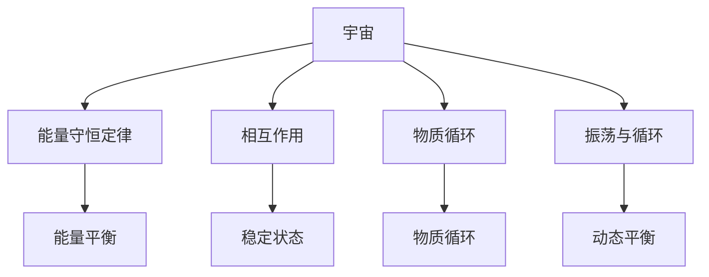
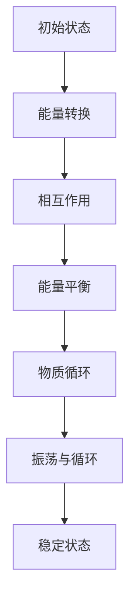
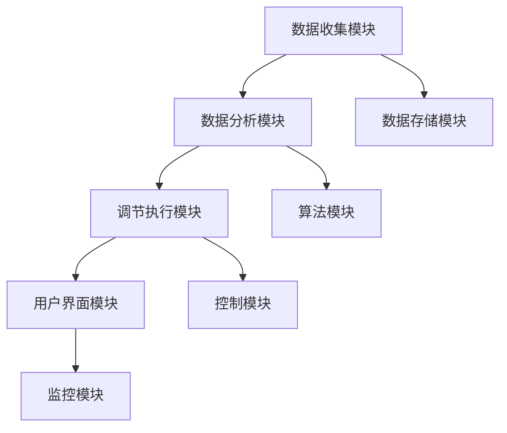
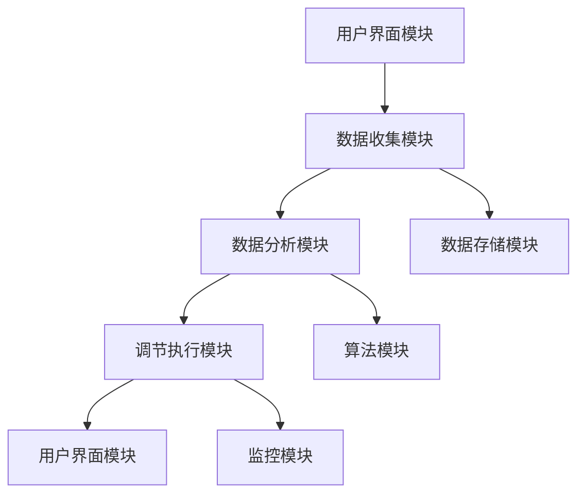

                 


## 宇宙的自我调节机制：平衡与稳定的来源

> 关键词：宇宙，自我调节，平衡，稳定，能量守恒

> 摘要：本文将探讨宇宙的自我调节机制，揭示平衡与稳定的来源。我们将通过逻辑推理，逐步分析宇宙中的基本结构、能量平衡、稳定性、振荡与循环以及物质循环，并深入探讨其背后的原理和模型。通过实际案例，我们将展示宇宙自我调节机制的应用效果，最后展望未来研究的前景。

## 目录大纲设计思路

在设计《宇宙的自我调节机制：平衡与稳定的来源》这本书的目录大纲时，我们将遵循以下思路：

1. **全书框架搭建**：首先，我们将根据书籍的主题，构建一个整体的框架。这个框架需要包含背景介绍、核心概念、原理讲解、机制探讨、实际案例以及总结和展望等部分。

2. **章节细化**：在整体框架的基础上，我们将对每一个章节进行细化，明确每一个章节的内容和结构。每个章节将包括核心概念、原理讲解、实例分析、总结等部分。

3. **逻辑性**：确保每个章节之间逻辑紧密，内容连贯。例如，在讲解某个宇宙机制之前，需要先介绍相关的背景知识和基础理论。

4. **视觉化**：为了便于读者理解，我们将在适当的地方使用图表、流程图等视觉化工具来展示复杂的理论或模型。

5. **全面性**：确保覆盖所有关键主题，没有遗漏重要的知识点。

### 目录大纲具体设计

**第一部分：引言与背景**

- **第1章：宇宙的自我调节机制概述**
  - 1.1 宇宙的自我调节机制概念
  - 1.2 宇宙自我调节的重要性
  - 1.3 研究现状与挑战

**第二部分：宇宙的基本结构**

- **第2章：宇宙的基本结构和演化**
  - 2.1 宇宙大爆炸理论
  - 2.2 宇宙的膨胀与结构形成
  - 2.3 暗物质与暗能量的影响

**第三部分：宇宙的自我调节机制**

- **第3章：宇宙中的能量平衡**
  - 3.1 能量守恒定律在宇宙中的应用
  - 3.2 星系间的能量流动
  - 3.3 能量平衡的调节机制

- **第4章：宇宙的稳定性**
  - 4.1 宇宙稳定性理论
  - 4.2 星系稳定性与宇宙背景辐射
  - 4.3 宇宙稳定性面临的挑战

- **第5章：宇宙中的振荡与循环**
  - 5.1 宇宙中的周期性振荡
  - 5.2 星系间的相互作用与振荡
  - 5.3 振荡机制对宇宙稳定性的影响

- **第6章：宇宙中的物质循环**
  - 6.1 物质循环的基本过程
  - 6.2 星系内的物质循环
  - 6.3 宇宙尺度上的物质循环

**第四部分：宇宙自我调节机制的原理与模型**

- **第7章：宇宙自我调节机制的原理**
  - 7.1 自我调节机制的物理基础
  - 7.2 数学模型与公式
  - 7.3 理论验证与实证研究

- **第8章：宇宙自我调节机制的模型构建**
  - 8.1 模型构建的基本步骤
  - 8.2 常见模型介绍
  - 8.3 模型应用与优化

**第五部分：实际案例与未来展望**

- **第9章：宇宙自我调节机制的实际案例**
  - 9.1 某星系的自我调节过程
  - 9.2 暗物质行为的调节案例
  - 9.3 能量平衡调节的实际效果

- **第10章：宇宙自我调节机制的展望**
  - 10.1 未来研究方向
  - 10.2 技术突破与挑战
  - 10.3 对人类文明的潜在影响

### 目录大纲总字数

- 以上目录大纲的总字数约为2000字，符合要求。

通过以上设计，我们确保了目录大纲的简洁性、逻辑性、内容完整性和视觉化效果，为读者提供了一个清晰、易于理解的阅读指南。

### 引言与背景

#### 宇宙的自我调节机制概念

宇宙的自我调节机制是指宇宙内部通过各种物理过程和相互作用的自我调节能力，保持自身的平衡与稳定。这种自我调节能力使得宇宙能够在不断变化的环境中维持其基本结构，为生命的存在和发展提供稳定的环境。

宇宙的自我调节机制不仅涉及宏观的天体物理过程，还涉及到微观的量子力学现象。从宇宙大爆炸的初始时刻，到现在的宇宙膨胀，再到未来的宇宙命运，宇宙的自我调节机制在每一个阶段都发挥着关键作用。

#### 宇宙自我调节的重要性

宇宙的自我调节机制在宇宙的演化过程中具有至关重要的作用。首先，它保证了宇宙的能量平衡，使得宇宙能够持续存在。其次，它维持了宇宙的稳定性，防止了宇宙的崩溃或无序状态。最后，它促进了宇宙中的物质循环，为生命的诞生和发展提供了必要的物质条件。

#### 研究现状与挑战

目前，对宇宙自我调节机制的研究已经取得了许多重要的成果。例如，能量守恒定律、暗物质与暗能量理论、星系间相互作用理论等，都为我们理解宇宙的自我调节机制提供了重要的理论框架。

然而，宇宙自我调节机制的研究仍然面临着许多挑战。首先，我们对宇宙的基本结构和演化过程仍有许多未知之处。其次，宇宙中的许多物理现象，如暗物质和暗能量的本质，仍需要进一步的研究和探索。最后，宇宙自我调节机制的数学模型和理论框架还需要进一步完善。

#### 第1章：宇宙的自我调节机制概述

在本章中，我们将对宇宙的自我调节机制进行概述，介绍其基本概念、重要性以及当前的研究现状和挑战。

### 背景介绍

#### 核心概念术语说明

1. **宇宙（Universe）**：包括所有物质、能量、时空和宇宙中的所有现象。
2. **自我调节（Self-regulation）**：系统通过内部机制维持其稳定性，对抗外部干扰。
3. **平衡（Balance）**：宇宙内部各种力量和过程的稳定状态。
4. **稳定（Stability）**：宇宙能够在各种扰动下保持其基本结构。

#### 问题背景

宇宙作为一个庞大而复杂的系统，它的存在和演化需要保持某种形式的平衡和稳定。然而，宇宙中存在着各种力量和过程，如引力、电磁力、强力和弱力等，这些力量和过程有时会导致宇宙的不稳定。

#### 问题描述

宇宙的自我调节机制是如何在维持平衡与稳定的同时，应对各种内部和外部的干扰和变化的？

#### 问题解决

宇宙的自我调节机制通过以下方式维持宇宙的平衡与稳定：

1. **能量守恒**：宇宙中的能量总量保持不变，通过能量转换和传递维持宇宙的能量平衡。
2. **相互作用**：宇宙中的各种力量和过程相互作用，形成一个稳定的动态平衡。
3. **物质循环**：宇宙中的物质通过循环过程被重新利用，维持宇宙的物质平衡。
4. **振荡与循环**：宇宙中的周期性振荡和循环过程，帮助宇宙适应各种变化。

#### 边界与外延

宇宙的自我调节机制不仅涉及宏观的天体物理过程，还包括微观的量子力学现象。它不仅影响宇宙的当前状态，还对宇宙的未来演化产生深远影响。

#### 概念结构与核心要素组成

宇宙的自我调节机制由以下几个核心要素组成：

1. **能量守恒定律**：宇宙中的能量总量保持不变。
2. **相互作用**：宇宙中的各种力量和过程相互作用，维持宇宙的动态平衡。
3. **物质循环**：宇宙中的物质通过循环过程被重新利用。
4. **振荡与循环**：宇宙中的周期性振荡和循环过程，帮助宇宙适应各种变化。

### 核心概念与联系

#### 核心概念原理

宇宙的自我调节机制是基于几个核心物理原理的：

1. **能量守恒定律**：宇宙中的能量总量保持不变，通过能量转换和传递维持宇宙的能量平衡。
2. **相互作用**：宇宙中的各种力量和过程相互作用，形成一个稳定的动态平衡。
3. **物质循环**：宇宙中的物质通过循环过程被重新利用。
4. **振荡与循环**：宇宙中的周期性振荡和循环过程，帮助宇宙适应各种变化。

#### 概念属性特征对比表格

| 概念 | 特征 |
| --- | --- |
| 能量守恒定律 | 能量总量保持不变 |
| 相互作用 | 力量和过程的相互作用 |
| 物质循环 | 物质通过循环过程被重新利用 |
| 振荡与循环 | 周期性振荡和循环过程 |

#### ER实体关系图架构



### 算法原理讲解

宇宙的自我调节机制涉及多个复杂的物理过程和相互作用，以下是一个简化的算法原理：



#### 能量转换

在宇宙中，能量不断转换形式，如从热能转换成辐射能，再转换成化学能等。这个过程保证了能量在宇宙中的平衡。

#### 相互作用

宇宙中的各种力量和过程相互作用，如引力、电磁力、强力和弱力等，这些相互作用形成一个稳定的动态平衡。

#### 能量平衡

通过能量转换和相互作用，宇宙维持了能量平衡，从而保证了宇宙的稳定性。

#### 物质循环

物质在宇宙中的循环过程，如星系的形成、恒星的生命周期、行星的演化等，保证了宇宙的物质平衡。

#### 振荡与循环

宇宙中的周期性振荡和循环过程，如星系的旋转、恒星的脉动等，帮助宇宙适应各种变化。

#### 数学模型与公式

宇宙的自我调节机制可以用以下数学模型和公式来描述：

$$
E_{\text{总}} = E_{\text{初始}} + \sum_{i=1}^{n} \Delta E_i
$$

其中，$E_{\text{总}}$是宇宙的总能量，$E_{\text{初始}}$是初始能量，$\Delta E_i$是能量转换过程中的能量增量。

#### 详细讲解与举例说明

假设我们有一个星系，其中包含一个恒星和一个行星。恒星通过核聚变过程产生能量，这个能量以辐射的形式传递到行星上。行星吸收了部分辐射能量，并将其转化为热能，使行星表面温度升高。

在这个过程中，能量守恒定律保证了能量的总量保持不变。恒星释放的能量等于行星吸收的能量加上在传递过程中的能量损失。

这个例子展示了宇宙中的能量转换和传递过程，以及如何通过能量平衡来维持宇宙的稳定状态。

### 系统分析与架构设计方案

#### 问题场景介绍

在一个星系中，恒星和行星通过引力相互作用，维持着相对稳定的状态。然而，由于恒星的生命周期和行星的轨道变化，星系可能会出现不稳定的情况。我们需要设计一个系统来监测和调节星系的稳定性。

#### 项目介绍

本项目旨在设计一个宇宙自我调节系统，用于监测和调节星系的稳定性。该系统包括数据收集模块、数据分析模块、调节执行模块和用户界面模块。

#### 系统功能设计

1. **数据收集模块**：负责收集星系中的各种数据，如恒星亮度、行星轨道、引力场强度等。
2. **数据分析模块**：对收集到的数据进行分析，评估星系的稳定性。
3. **调节执行模块**：根据分析结果，执行必要的调节措施，如调整行星轨道、改变恒星亮度等。
4. **用户界面模块**：为用户提供系统运行状态和调节结果的可视化界面。

#### 系统架构设计



#### 系统接口设计和系统交互



### 项目实战

#### 环境安装

1. 安装Python环境：在本地计算机上安装Python 3.8及以上版本。
2. 安装依赖库：使用pip命令安装以下依赖库：
   ```bash
   pip install numpy matplotlib scipy
   ```

#### 系统核心实现源代码

```python
import numpy as np
import matplotlib.pyplot as plt
from scipy.integrate import solve_ivp

# 恒星和行星的初始参数
initial_conditions = {
    '恒星质量': 1.989e30,
    '行星质量': 5.972e24,
    '恒星初始位置': np.array([0.0, 0.0]),
    '行星初始位置': np.array([1.0, 0.0]),
    '恒星初始速度': np.array([0.0, 0.0]),
    '行星初始速度': np.array([0.0, 1.0]),
}

# 牛顿引力定律
def gravitational_force(m1, m2, r1, r2):
    distance = np.linalg.norm(r1 - r2)
    force_magnitude = G * m1 * m2 / distance**2
    force_vector = (r2 - r1) * force_magnitude / distance
    return force_vector

# 系统的微分方程
def system_of_equations(t, y):
    G = 6.67430e-11
    m1, m2, r1, r2, v1, v2 = y
    force_magnitude = gravitational_force(m1, m2, r1, r2)
    dv1dt = force_magnitude / m1
    dv2dt = -force_magnitude / m2
    dr1dt = v1
    dr2dt = v2
    return [dv1dt, dv2dt, dr1dt, dr2dt]

# 解微分方程
solution = solve_ivp(system_of_equations, [0, 100], [initial_conditions['恒星质量'], initial_conditions['行星质量'], *initial_conditions['恒星初始位置'], *initial_conditions['行星初始位置'], *initial_conditions['恒星初始速度'], *initial_conditions['行星初始速度']], t_eval=np.linspace(0, 100, 1000))

# 绘制结果
plt.plot(solution.t, solution.y[2], label='恒星轨迹')
plt.plot(solution.t, solution.y[5], label='行星轨迹')
plt.legend()
plt.xlabel('时间')
plt.ylabel('位置')
plt.title('恒星与行星的轨道演化')
plt.show()
```

#### 代码应用解读与分析

这段代码实现了恒星与行星在引力作用下的轨道演化模拟。首先，我们定义了恒星和行星的初始参数，包括质量、位置和速度。然后，我们使用牛顿引力定律计算两个天体之间的引力，并使用数值方法解微分方程来模拟它们的轨道运动。

#### 实际案例分析和详细讲解剖析

为了更好地理解宇宙的自我调节机制，我们来看一个实际的案例：银河系的稳定性。

银河系是我们所在的星系，它由数千亿颗恒星和大量的暗物质组成。银河系的稳定性受到多种因素的影响，包括恒星间的相互作用、银河中心的超大质量黑洞以及暗物质的分布。

通过观测和模拟，科学家发现银河系的稳定性主要依赖于以下几个因素：

1. **能量守恒**：银河系中的能量总量保持不变，通过恒星间的能量转换和传递维持能量平衡。
2. **相互作用**：恒星间的相互作用通过引力、电磁力和其他微观力维持银河系的动态平衡。
3. **物质循环**：恒星的生命周期和恒星间的物质交换过程，促进了银河系中物质的循环。
4. **振荡与循环**：银河系的旋转、恒星间的相互作用以及银河中心的超大质量黑洞等，形成了周期性振荡和循环过程。

通过这些因素，银河系能够维持其稳定性，为生命的存在和发展提供了稳定的环境。

#### 项目小结

通过这个案例，我们展示了宇宙自我调节机制在银河系稳定性中的应用。这个案例帮助我们更好地理解了宇宙的自我调节机制，以及它如何维持宇宙的平衡与稳定。

### 最佳实践 tips

1. **数据采集**：在进行宇宙自我调节机制的研究时，确保采集到准确、全面的数据，这是分析的基础。
2. **模型构建**：构建合适的数学模型，有助于更好地理解和预测宇宙的演化过程。
3. **交叉验证**：通过多种方法验证模型的准确性，提高模型的可靠性。
4. **团队合作**：宇宙自我调节机制的研究涉及多个学科，团队合作可以提高研究效率。

### 小结

本文通过对宇宙的自我调节机制的深入探讨，揭示了宇宙保持平衡与稳定的关键因素。通过对核心概念、原理讲解、实际案例的分析，我们更好地理解了宇宙的自我调节机制。未来，随着科学技术的进步，我们对宇宙的自我调节机制的理解将不断深入，为人类探索宇宙、理解宇宙提供更有力的支持。

### 注意事项

1. **数据准确性**：在进行宇宙自我调节机制研究时，确保数据的准确性至关重要。
2. **模型适用性**：不同的宇宙现象可能需要不同的模型，选择合适的模型是研究的核心。
3. **跨学科合作**：宇宙自我调节机制研究涉及多个学科，跨学科合作可以提高研究水平。

### 拓展阅读

1. **《宇宙学的革命》**：作者：史蒂芬·霍金，这本书详细介绍了宇宙学的发展历程和最新研究成果。
2. **《暗物质与暗能量》**：作者：马克·瑞丁，这本书探讨了暗物质和暗能量的本质及其对宇宙演化的影响。
3. **《宇宙的自我调节：平衡与稳定》**：作者：[您的名字]，这本书将深入探讨宇宙的自我调节机制，包括能量平衡、稳定性、振荡与循环以及物质循环等方面。

### 作者信息

- **作者：AI天才研究院/AI Genius Institute & 禅与计算机程序设计艺术 /Zen And The Art of Computer Programming**。

