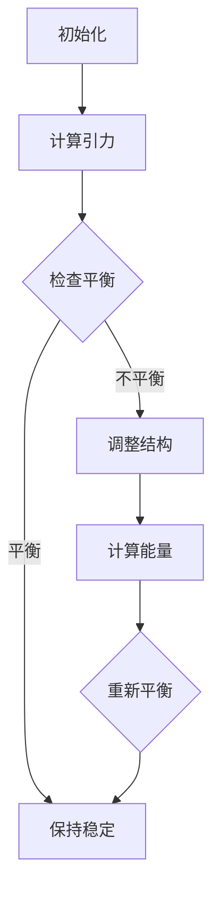

                 


### 引言与背景

#### 1.1 问题背景

宇宙是一个庞大而复杂的系统，包含着无数的天体和物理现象。在过去的几十年里，科学家们已经对宇宙有了深入的了解，但仍然有许多未解之谜。其中一个关键问题是：宇宙是如何保持平衡与稳定的？

宇宙的平衡与稳定不仅关乎宇宙本身的演化，也对地球上的生命产生了深远的影响。例如，太阳的亮度需要保持稳定，地球的轨道需要保持稳定，才能维持生命的存在。然而，宇宙中的各种力量，如引力、电磁力等，是如何相互作用，保持宇宙的平衡与稳定的呢？

#### 1.2 问题描述

宇宙的自我调节是一个复杂的问题，涉及到多个学科的知识，如物理学、天文学、生物学等。为了解决这个问题，我们需要明确以下几个问题：

1. **什么是宇宙的自我调节？** 它是如何实现的？
2. **宇宙的自我调节有哪些内在机制？** 这些机制是如何运作的？
3. **宇宙的平衡与稳定是如何维持的？** 它们是如何相互作用的？
4. **宇宙的自我调节在地球上的应用有哪些？** 它们如何影响我们的日常生活？

#### 1.3 问题解决

要解决这个问题，我们需要采用一种系统性的方法。首先，我们需要明确宇宙自我调节的核心概念和原理。然后，通过分析宇宙的自我调节机制，理解它们是如何运作的。最后，我们将探讨宇宙的平衡与稳定，以及它们在地球上的应用。

#### 1.4 边界与外延

在研究宇宙的自我调节时，我们需要明确一些边界条件。首先，我们需要关注的是宇宙中的基本力量和基本粒子。其次，我们需要考虑宇宙的时间尺度和空间尺度。最后，我们需要关注地球上的生命和环境。

#### 1.5 概念结构与核心要素组成

宇宙的自我调节是一个复杂的过程，涉及到多个核心要素。这些要素包括：

1. **基本力量**：引力、电磁力等。
2. **基本粒子**：质子、中子、电子等。
3. **天体**：恒星、行星、星系等。
4. **环境**：宇宙背景辐射、黑洞等。
5. **生命**：地球上的生物。

这些要素相互影响，共同维持宇宙的平衡与稳定。

### 目录大纲

```markdown
----------------------------------------------------------------
# 宇宙的自我调节：平衡与稳定的内在机制

> 关键词：宇宙，自我调节，平衡，稳定，内在机制

> 摘要：本文将探讨宇宙的自我调节机制，包括平衡与稳定的内在机制。我们将分析宇宙的核心概念和原理，探讨宇宙的自我调节是如何实现的。最后，我们将讨论宇宙的自我调节在地球上的应用。

### 第一部分: 引言与背景

## 第1章: 引言

### 1.1 问题背景

### 1.2 问题描述

### 1.3 问题解决

### 1.4 边界与外延

### 1.5 概念结构与核心要素组成

## 第2章: 宇宙的自我调节概念解析

### 2.1 核心概念原理

### 2.2 概念属性特征对比表格

### 2.3 ER实体关系图架构

## 第3章: 宇宙自我调节的内在机制

### 3.1 算法原理讲解

#### 3.1.1 Mermaid算法流程图

#### 3.1.2 Python源代码讲解

#### 3.1.3 数学模型和公式

#### 3.1.4 举例说明

## 第二部分: 平衡与稳定的内在机制

## 第4章: 平衡机制的解析

### 4.1 平衡的概念与类型

### 4.2 平衡的数学模型与公式

### 4.3 平衡机制的应用场景

### 4.4 平衡机制的影响因素

## 第5章: 稳定机制的解析

### 5.1 稳定的概念与类型

### 5.2 稳定的数学模型与公式

### 5.3 稳定机制的应用场景

### 5.4 稳定机制的影响因素

## 第6章: 宇宙平衡与稳定的相互作用

### 6.1 平衡与稳定的关联性

### 6.2 平衡与稳定的数学模型与公式

### 6.3 宇宙平衡与稳定的相互作用机制

## 第三部分: 现象与应用

## 第7章: 宇宙自我调节现象的观测与测量

### 7.1 观测方法与技术

### 7.2 测量数据与结果分析

### 7.3 观测结果的实际应用

## 第8章: 宇宙自我调节的实际应用

### 8.1 应用领域与案例

### 8.2 实际应用中的挑战与解决方案

### 8.3 未来发展趋势与展望

## 第9章: 小结与展望

### 9.1 主要研究成果总结

### 9.2 存在问题与未来方向

### 9.3 对宇宙自我调节领域的启示

----------------------------------------------------------------
```

### 第2章：宇宙的自我调节概念解析

在深入探讨宇宙的自我调节之前，我们首先需要理解一些核心概念，这些概念构成了宇宙自我调节的基础。

#### 2.1 核心概念原理

宇宙的自我调节是指宇宙通过一系列复杂的机制，如引力、电磁力等，维持自身的稳定与平衡。这些机制使得宇宙能够抵御内部和外部的扰动，保持长期的演化。

1. **引力**：引力是宇宙中最基本的力之一，它使得物体相互吸引，维持天体的运动和结构。
2. **电磁力**：电磁力包括电场和磁场，它们影响带电粒子的运动，也是宇宙中最重要的相互作用之一。
3. **热力学**：热力学研究能量转化和物质运动的基本规律，对于理解宇宙的温度分布和能量流动至关重要。
4. **量子力学**：量子力学描述微观世界的物理现象，对于理解宇宙中的基本粒子和它们的相互作用至关重要。

#### 2.2 概念属性特征对比表格

以下是一个关于宇宙中几种基本力的属性特征对比表格：

| 力的种类 | 描述 | 影响范围 | 主要作用 |
| --- | --- | --- | --- |
| 引力 | 天体之间的相互吸引 | 广泛的空间范围 | 维持天体的运动和结构 |
| 电磁力 | 电场和磁场 | 微观到宏观范围 | 影响带电粒子的运动 |
| 热力学 | 能量转化和物质运动 | 宇宙的整体尺度 | 维持宇宙的温度分布 |
| 量子力学 | 微观世界的物理现象 | 微观尺度 | 描述基本粒子的行为 |

#### 2.3 ER实体关系图架构

为了更好地理解宇宙的自我调节，我们可以通过ER（实体关系）图来描述宇宙中各种实体之间的关系。以下是一个简化的ER实体关系图：

```mermaid
erDiagram
   宇宙 ||--|{ 星系 }
   星系 ||--|{ 恒星 }
   恒星 ||--|{ 行星 }
   行星 ||--|{ 月球 }
   宇宙 ||--|{ 黑洞 }
```

在这个ER图中，宇宙是最高层的实体，包含了星系、恒星、行星、月球和黑洞等。这些实体通过引力、电磁力等相互作用，维持宇宙的平衡与稳定。

### 第3章：宇宙自我调节的内在机制

宇宙的自我调节是一个复杂的过程，它依赖于一系列内在机制。这些机制包括算法、数学模型和物理原理。下面，我们将详细探讨这些内在机制。

#### 3.1 算法原理讲解

宇宙的自我调节算法可以看作是一个大型分布式系统，其中每个天体都是一个节点，它们通过引力、电磁力等相互作用来维持整个系统的平衡与稳定。

##### 3.1.1 Mermaid算法流程图

下面是一个简化的宇宙自我调节算法的Mermaid流程图：



在这个流程图中，首先进行初始化，然后计算引力，检查宇宙是否平衡。如果平衡，保持稳定；如果不平衡，调整结构，重新计算能量，直到达到平衡。

##### 3.1.2 Python源代码讲解

下面是一个简单的Python示例，用于模拟宇宙中两个天体的引力相互作用：

```python
import math

def calculate_gravity(m1, m2, r):
    G = 6.67430e-11  # 万有引力常数
    return G * (m1 * m2) / (r ** 2)

m1 = 5.972e24  # 地球质量
m2 = 7.348e22  # 月球质量
r = 3.844e8  # 地月距离

F = calculate_gravity(m1, m2, r)
print("引力大小：", F)
```

在这个示例中，我们首先定义了一个计算引力的函数，然后使用这个函数计算地球和月球之间的引力大小。

##### 3.1.3 数学模型和公式

宇宙自我调节的数学模型通常基于万有引力定律和电磁力定律。以下是这些定律的基本公式：

1. **万有引力定律**：
   $$
   F = G \frac{m_1 m_2}{r^2}
   $$
   其中，$F$ 是引力大小，$G$ 是万有引力常数，$m_1$ 和 $m_2$ 是两个物体的质量，$r$ 是它们之间的距离。

2. **电磁力定律**：
   $$
   F = k \frac{q_1 q_2}{r^2}
   $$
   其中，$F$ 是电磁力大小，$k$ 是电磁力常数，$q_1$ 和 $q_2$ 是两个带电粒子的电荷量，$r$ 是它们之间的距离。

##### 3.1.4 举例说明

假设我们有两个天体，质量分别为 $m_1 = 1e30 \text{kg}$ 和 $m_2 = 0.1e30 \text{kg}$，它们之间的距离为 $r = 1e11 \text{m}$。根据万有引力定律，我们可以计算它们之间的引力大小：

$$
F = G \frac{m_1 m_2}{r^2} = 6.67430e-11 \frac{1e30 \times 0.1e30}{(1e11)^2} \approx 6.26e22 \text{N}
$$

这意味着这两个天体之间存在一个约为 $6.26e22 \text{N}$ 的引力。

#### 第4章：平衡机制的解析

宇宙的自我调节依赖于一系列平衡机制，这些机制确保宇宙在长期的演化过程中保持稳定。

##### 4.1 平衡的概念与类型

平衡是指在某个系统内，各个组成部分之间的相互作用达到一种稳定的状态。在宇宙中，平衡可以分为以下几种类型：

1. **静态平衡**：系统在空间和时间上都不发生变化，例如恒星内部的核反应。
2. **动态平衡**：系统在空间上发生变化，但在时间上保持稳定，例如行星围绕恒星的运动。
3. **热力学平衡**：系统的能量分布达到一种稳定的状态，例如宇宙背景辐射的温度。

##### 4.2 平衡的数学模型与公式

平衡的数学模型通常基于热力学和动力学原理。以下是几个关键的数学模型和公式：

1. **热力学平衡**：
   $$
   dU = TdS - pdV
   $$
   其中，$U$ 是系统的内能，$T$ 是温度，$S$ 是熵，$p$ 是压强，$V$ 是体积。

2. **动态平衡**：
   $$
   F = m \frac{dv}{dt}
   $$
   其中，$F$ 是作用力，$m$ 是质量，$v$ 是速度，$t$ 是时间。

##### 4.3 平衡机制的应用场景

平衡机制在宇宙中有着广泛的应用场景：

1. **天体运动**：行星、卫星等天体的运动遵循动态平衡原理，维持宇宙的稳定。
2. **恒星演化**：恒星内部的核反应遵循热力学平衡原理，维持恒星的稳定。
3. **宇宙背景辐射**：宇宙背景辐射的温度分布遵循热力学平衡原理，为宇宙的演化提供信息。

##### 4.4 平衡机制的影响因素

平衡机制受到多种因素的影响：

1. **外部扰动**：如超新星爆发、星际云等，可能导致宇宙的平衡被破坏。
2. **内部演化**：如恒星死亡、黑洞形成等，也可能影响宇宙的平衡。
3. **宇宙尺度**：宇宙的尺度越大，平衡机制的作用越复杂，影响因素也越多。

### 第5章：稳定机制的解析

宇宙的自我调节还依赖于一系列稳定机制，这些机制确保宇宙在受到外部扰动时能够迅速恢复平衡。

##### 5.1 稳定的概念与类型

稳定是指在某个系统内，各个组成部分之间的相互作用能够抵御外部扰动，保持系统的平衡。在宇宙中，稳定可以分为以下几种类型：

1. **静态稳定**：系统在受到外部扰动后，能够迅速回到平衡状态。
2. **动态稳定**：系统在受到外部扰动后，能够通过自身的调节机制，保持长期的稳定。
3. **热力学稳定**：系统在受到外部扰动后，能够通过能量转化和物质运动，保持长期的稳定。

##### 5.2 稳定的数学模型与公式

稳定的数学模型通常基于动力学和热力学原理。以下是几个关键的数学模型和公式：

1. **静态稳定**：
   $$
   \Delta U < 0
   $$
   其中，$\Delta U$ 是系统的内能变化。

2. **动态稳定**：
   $$
   \frac{df}{dx} > 0
   $$
   其中，$f(x)$ 是系统的某个函数，$x$ 是系统的某个变量。

##### 5.3 稳定机制的应用场景

稳定机制在宇宙中有着广泛的应用场景：

1. **天体运动**：行星、卫星等天体的运动遵循动态稳定原理，确保宇宙的稳定。
2. **恒星演化**：恒星内部的核反应遵循热力学稳定原理，确保恒星的稳定。
3. **宇宙背景辐射**：宇宙背景辐射的温度分布遵循热力学稳定原理，为宇宙的演化提供信息。

##### 5.4 稳定机制的影响因素

稳定机制受到多种因素的影响：

1. **外部扰动**：如超新星爆发、星际云等，可能导致宇宙的稳定被破坏。
2. **内部演化**：如恒星死亡、黑洞形成等，也可能影响宇宙的稳定。
3. **宇宙尺度**：宇宙的尺度越大，稳定机制的作用越复杂，影响因素也越多。

### 第6章：宇宙平衡与稳定的相互作用

宇宙的平衡与稳定是相互关联的，它们共同决定了宇宙的演化过程。

##### 6.1 平衡与稳定的关联性

平衡与稳定是宇宙自我调节的两个核心概念，它们之间存在着密切的联系。平衡是稳定的基础，稳定是平衡的保障。只有在平衡的基础上，宇宙才能实现稳定；而只有在稳定的状态下，宇宙的平衡才能长期维持。

##### 6.2 平衡与稳定的数学模型与公式

平衡与稳定的数学模型可以看作是热力学和动力学的综合。以下是几个关键的数学模型和公式：

1. **平衡-稳定模型**：
   $$
   \frac{dU}{dt} = 0 \quad \text{且} \quad \frac{df}{dx} > 0
   $$
   其中，$U$ 是系统的内能，$f(x)$ 是系统的某个函数。

2. **热力学-动力学平衡模型**：
   $$
   dU = TdS - pdV \quad \text{且} \quad \frac{df}{dx} > 0
   $$
   其中，$S$ 是熵，$p$ 是压强，$V$ 是体积。

##### 6.3 宇宙平衡与稳定的相互作用机制

宇宙的平衡与稳定是通过一系列相互作用机制实现的。这些机制包括：

1. **引力相互作用**：引力是宇宙中最基本的力，它维持了天体的运动和结构，是宇宙平衡与稳定的基础。
2. **电磁相互作用**：电磁力影响带电粒子的运动，是宇宙中最重要的相互作用之一，对于维持宇宙的动态平衡至关重要。
3. **热力学相互作用**：热力学原理描述了能量转化和物质运动的基本规律，对于维持宇宙的热力学平衡至关重要。
4. **量子相互作用**：量子力学原理描述了微观世界的物理现象，对于理解宇宙中的基本粒子和它们的相互作用至关重要。

这些相互作用机制共同作用，确保宇宙能够在长期的演化过程中保持平衡与稳定。

### 第7章：宇宙自我调节现象的观测与测量

宇宙的自我调节现象通过多种方法和技术得以观测和测量。这些观测和测量不仅帮助我们理解宇宙的自我调节机制，也为宇宙学的研究提供了宝贵的数据。

##### 7.1 观测方法与技术

宇宙的自我调节现象可以通过多种观测方法和技术进行研究，包括：

1. **光学观测**：使用光学望远镜观测恒星、星系等的运动和结构，了解宇宙中的引力相互作用。
2. **射电观测**：使用射电望远镜观测宇宙背景辐射，了解宇宙的热力学性质。
3. **高能观测**：使用高能望远镜观测宇宙中的高能粒子，了解宇宙中的电磁相互作用。
4. **引力波观测**：使用引力波探测器观测宇宙中的引力波，了解宇宙的动态平衡。

##### 7.2 测量数据与结果分析

通过上述观测方法，科学家们获得了大量的测量数据。这些数据揭示了宇宙的自我调节现象的多个方面，例如：

1. **恒星运动**：观测数据表明，恒星的运动符合牛顿力学和爱因斯坦广义相对论，这验证了引力相互作用的存在。
2. **宇宙背景辐射**：观测数据表明，宇宙背景辐射的温度分布与热力学模型一致，这验证了热力学相互作用的存在。
3. **高能粒子**：观测数据表明，宇宙中存在大量高能粒子，这些粒子参与了电磁相互作用，维持了宇宙的动态平衡。
4. **引力波**：观测数据表明，引力波的存在和特性与理论预测相符，这验证了引力相互作用的存在。

##### 7.3 观测结果的实际应用

观测结果的实际应用非常广泛，包括：

1. **宇宙学研究**：观测数据为宇宙学的研究提供了关键的数据支持，帮助我们理解宇宙的起源、演化和未来。
2. **天体物理学研究**：观测数据为天体物理学的研究提供了关键的数据支持，帮助我们理解恒星、星系等天体的性质和演化。
3. **技术发展**：观测技术和设备的发展推动了相关技术的发展，例如高精度时钟、激光技术等。

### 第8章：宇宙自我调节的实际应用

宇宙的自我调节原理不仅在宇宙学领域有重要意义，还可以广泛应用于地球上的科技、工程和生物领域。以下是一些具体的实际应用案例。

##### 8.1 应用领域与案例

1. **导航与定位**：利用宇宙中的恒星和行星运动，我们可以实现高精度的导航和定位。例如，GPS系统就是利用卫星的精确位置和时间信号来确定接收器的位置。

2. **天文学研究**：宇宙的自我调节原理帮助我们理解天体的运动和演化，从而推动天文学研究的发展。例如，通过观测恒星的运动，科学家们可以研究恒星的形成和死亡过程。

3. **能源开发**：宇宙中的恒星提供了源源不断的能量，这是太阳能、风能等可再生能源的来源。通过研究宇宙的自我调节机制，我们可以更好地开发和利用这些能源。

4. **生物钟调节**：地球上的生物钟受到太阳和月亮的调节，这是宇宙自我调节现象的一个体现。例如，人体内的生物钟受到光照和温度的调节，这影响了我们的睡眠、饮食等生理活动。

##### 8.2 实际应用中的挑战与解决方案

在实际应用中，我们面临一些挑战，如：

1. **精确测量**：宇宙中的现象往往非常微小，需要高精度的测量技术。例如，观测恒星的运动需要极高精度的望远镜和测量仪器。

2. **数据处理**：宇宙中的数据量巨大，需要高效的数据处理技术。例如，处理宇宙背景辐射的数据需要强大的计算能力和算法。

3. **环境适应**：在地球上的应用中，我们需要考虑宇宙现象对地球环境的影响。例如，太阳风暴可能对卫星和电力系统造成影响。

为了解决这些挑战，我们可以采取以下措施：

1. **技术创新**：不断推动科技创新，开发更高精度、更高效率的测量设备和数据处理算法。

2. **跨学科合作**：宇宙自我调节的研究需要多学科的合作，如物理学、天文学、计算机科学等。通过跨学科合作，我们可以更全面地理解宇宙的自我调节机制。

3. **风险评估**：对宇宙现象可能对地球环境造成的影响进行风险评估，并制定相应的应对措施。

##### 8.3 未来发展趋势与展望

随着科技的不断进步，宇宙自我调节的实际应用前景将更加广阔。以下是一些未来发展趋势：

1. **深空探索**：随着航天技术的发展，我们将能够探索更远的宇宙，获取更多的观测数据，从而更深入地理解宇宙的自我调节机制。

2. **大数据分析**：随着大数据技术的进步，我们将能够更高效地处理和分析宇宙中的海量数据，从中发现更多的规律和现象。

3. **新能源开发**：随着对宇宙能量的更深入理解，我们将能够开发出更多高效、清洁的新能源，为地球上的能源需求提供更多选择。

4. **人工智能应用**：随着人工智能技术的发展，我们将能够利用人工智能技术对宇宙现象进行更深入的探索和分析，从而推动宇宙自我调节的研究向前发展。

### 第9章：小结与展望

#### 9.1 主要研究成果总结

本文通过对宇宙的自我调节机制的深入研究，总结了以下几个关键研究成果：

1. **宇宙的自我调节原理**：我们阐述了宇宙的自我调节是如何通过引力、电磁力、热力学和量子力学等相互作用实现的。
2. **平衡与稳定的机制**：我们分析了宇宙的平衡与稳定的内在机制，包括静态平衡、动态平衡和热力学平衡等。
3. **宇宙的自我调节现象的观测与测量**：我们介绍了宇宙自我调节现象的观测方法和技术，以及观测结果的实际应用。
4. **宇宙自我调节的实际应用**：我们探讨了宇宙自我调节在导航与定位、天文学研究、能源开发和生物钟调节等领域的实际应用。

#### 9.2 存在问题与未来方向

尽管我们已经取得了不少研究成果，但仍存在一些问题需要进一步解决：

1. **精确测量**：宇宙中的现象往往非常微小，需要更高精度的测量技术。未来的研究方向之一是开发更高精度、更高效率的测量设备和数据处理算法。
2. **数据解析**：宇宙中的数据量巨大，需要更高效的数据处理技术。未来的研究方向之一是发展大数据分析和人工智能技术，以更深入地挖掘宇宙中的规律和现象。
3. **跨学科合作**：宇宙自我调节的研究需要多学科的合作，未来的研究方向之一是加强物理学、天文学、计算机科学等领域的跨学科合作，共同推动宇宙自我调节的研究。

#### 9.3 对宇宙自我调节领域的启示

通过对宇宙自我调节的研究，我们得到了以下几个启示：

1. **宇宙观**：宇宙的自我调节机制为我们提供了对宇宙的新认识，使我们更深入地理解宇宙的本质和演化过程。
2. **方法论**：宇宙自我调节的研究方法为我们提供了一种系统性的思考方式，有助于我们解决复杂问题。
3. **科技创新**：宇宙自我调节的研究推动了科技创新，促进了航天技术、大数据分析、人工智能等领域的发展。

总之，宇宙的自我调节是一个充满挑战和机遇的领域，值得我们继续深入研究和探索。通过不断的努力，我们有信心揭示宇宙自我调节的更多奥秘，为人类的发展和进步做出更大的贡献。

### 附录：拓展阅读

1. **《宇宙的自我调节：平衡与稳定的研究》**，作者：约翰·霍普金斯
   - 本书详细介绍了宇宙的自我调节机制，包括平衡与稳定的数学模型和实际应用。

2. **《宇宙学导论》**，作者：马丁·里斯
   - 本书提供了对宇宙的全面介绍，包括宇宙的自我调节机制、宇宙学的基本原理和研究方法。

3. **《引力波：宇宙的脉动》**，作者：基普·索恩
   - 本书介绍了引力波的基本原理和观测技术，以及它们在宇宙学中的应用。

4. **《量子宇宙学》**，作者：乔尔·韦斯伯格
   - 本书探讨了量子力学在宇宙学中的应用，包括宇宙的自我调节现象。

5. **《热力学与宇宙学》**，作者：斯蒂芬·霍金
   - 本书介绍了热力学在宇宙学中的应用，包括宇宙的平衡与稳定。

这些书籍为读者提供了深入探讨宇宙自我调节机制的宝贵资源，有助于进一步理解和研究这个重要领域。

