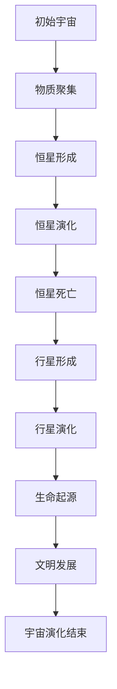

                 

## 宇宙的自我超越性：突破现有物理定律的可能

### 引言与背景

在科学探索的漫长历程中，人类对宇宙的认识不断深化，从古希腊的哲学思考，到伽利略、牛顿的经典力学，再到爱因斯坦的相对论，我们的理解逐渐从宏观的行星运动扩展到了微观的量子世界。然而，随着技术的进步和科学研究的深入，现有物理定律的局限性也逐渐显现。宇宙的复杂性和多样性超出了传统物理学的预期，这促使我们思考：宇宙是否具有自我超越性？是否有可能突破现有的物理定律？

**关键词：** 宇宙、自我超越性、物理定律、突破、复杂性。

**摘要：** 本文探讨了宇宙的自我超越性及其对突破现有物理定律的可能影响。首先介绍了问题背景和现有物理定律的局限性，然后阐述了宇宙的自我超越性概念及其特征，接着讨论了突破现有物理定律的理论基础，并探索了新物理定律的可能性及其在宇宙演化中的应用。最后，文章展望了未来突破现有物理定律的前景和挑战，并提出了未来研究方向和社会责任问题。

## 第一部分：引言与背景

### 第1章： 引言

#### 1.1 问题背景

物理定律是自然界的基本法则，它们描述了宇宙中的物理现象和规律。从古代的哲学思考到现代的科学理论，人类对物理定律的认识不断深化。牛顿的万有引力定律和运动定律奠定了经典力学的基础，而麦克斯韦方程组则统一了电磁场理论。进入20世纪，爱因斯坦的广义相对论和量子力学的兴起，使得我们对宇宙的认识有了新的突破。

然而，随着科学研究的深入，我们开始意识到现有物理定律的局限性。例如，在量子尺度上，物理定律的预测变得极其复杂和不确定；在宇宙学尺度上，现有的宇宙模型无法解释宇宙的加速膨胀和暗物质、暗能量的存在。这些问题促使我们思考：宇宙是否具有自我超越性，是否有可能突破现有的物理定律？

#### 1.2 问题描述

现有物理定律的局限性主要体现在以下几个方面：

1. **量子引力的缺失**：在量子尺度上，物理定律的预测变得极其复杂和不确定，无法同时描述引力和量子现象。
2. **宇宙学问题的挑战**：宇宙的加速膨胀、暗物质和暗能量的存在无法用现有的物理定律完全解释。
3. **物理定律的兼容性**：经典力学、量子力学和广义相对论之间存在着深刻的矛盾和冲突。

这些问题引发了我们对宇宙自我超越性的思考，即宇宙是否有可能通过自我调节和演化来突破现有的物理定律？

#### 1.3 问题解决

为了解决上述问题，科学家们提出了多种可能的解决方案：

1. **量子引力理论**：通过探索量子力学和广义相对论的统一，寻找一个可以同时描述引力和量子现象的理论。
2. **宇宙演化模型**：通过建立新的宇宙演化模型，解释宇宙的加速膨胀和暗物质、暗能量的存在。
3. **物理定律的扩展**：通过扩展现有的物理定律，寻找新的物理现象和规律，以突破现有物理定律的局限性。

#### 1.4 边界与外延

宇宙的自我超越性不仅是一个科学问题，还涉及到哲学和宗教领域。例如，佛教中的“空”概念和道教中的“道”理念，都可以被看作是对宇宙自我超越性的探讨。此外，宇宙的自我超越性也引发了关于自由意志和宿命论的哲学思考。

在科学领域，宇宙的自我超越性为我们提供了一个新的视角，以重新审视现有的物理定律，并探索宇宙的本质和演化规律。这不仅可以深化我们对宇宙的理解，也可能为未来的科技发展提供新的契机。

#### 1.5 概念结构与核心要素组成

宇宙的自我超越性概念由以下几个核心要素组成：

1. **宇宙的自我演化**：宇宙通过内部的物理过程不断演变和进化。
2. **宇宙的自我组织**：宇宙中的物质和能量能够自发形成复杂的结构。
3. **宇宙的自我调整**：宇宙能够根据内部和外部的环境变化自我调整。

这些要素共同构成了宇宙的自我超越性，为我们提供了突破现有物理定律的可能途径。通过对这些要素的研究，我们可以更好地理解宇宙的本质和演化规律。

### 第2章： 现有物理定律的局限性

#### 2.1 现有物理定律的概述

物理定律是自然界的基本法则，它们描述了宇宙中的物理现象和规律。从古希腊的哲学思考到现代的科学理论，人类对物理定律的认识不断深化。牛顿的万有引力定律和运动定律奠定了经典力学的基础，而麦克斯韦方程组则统一了电磁场理论。进入20世纪，爱因斯坦的广义相对论和量子力学的兴起，使得我们对宇宙的认识有了新的突破。

经典力学是描述宏观物体运动的物理理论，主要由牛顿的运动定律和万有引力定律构成。牛顿的运动定律描述了物体在力的作用下的运动状态，万有引力定律则描述了物体之间的引力相互作用。经典力学在宏观尺度上非常成功，能够解释行星运动、碰撞等现象。

电磁场理论由麦克斯韦方程组描述，它统一了电场和磁场，揭示了电磁波的存在。麦克斯韦方程组在电磁现象的研究中取得了巨大的成功，为现代通信技术和电磁学的发展奠定了基础。

量子力学是描述微观粒子行为的物理理论，它揭示了微观世界的非确定性。量子力学的基本原理包括波粒二象性、不确定性原理和量子纠缠等。量子力学在解释原子结构、化学键、半导体物理等方面取得了重要的突破。

广义相对论是爱因斯坦在1915年提出的，它描述了引力的本质是时空的弯曲。广义相对论成功解释了黑洞、引力波等现象，为宇宙学提供了新的视角。

这些物理定律共同构成了现代物理学的基础，它们在各自的领域内取得了巨大的成功。然而，随着科学研究的深入，我们逐渐意识到这些定律存在一定的局限性。

#### 2.2 现有物理定律的局限性

尽管现有物理定律在各自的领域内取得了巨大的成功，但它们也存在一些局限性：

1. **量子引力的缺失**：在量子尺度上，物理定律的预测变得极其复杂和不确定，无法同时描述引力和量子现象。量子力学和广义相对论之间存在深刻的矛盾和冲突，这被称为量子引力问题。

2. **宇宙学问题的挑战**：宇宙的加速膨胀、暗物质和暗能量的存在无法用现有的物理定律完全解释。现有的宇宙模型（如大爆炸理论）存在一些无法解释的疑点和问题。

3. **物理定律的兼容性**：经典力学、量子力学和广义相对论之间存在着深刻的矛盾和冲突。这些理论在不同的尺度和情境下表现出不同的特征，但在某些情况下无法统一。

4. **计算复杂度**：现有物理定律在数学描述和计算上存在一定的复杂性，使得我们难以精确预测和计算一些复杂的物理现象。

#### 2.3 突破现有物理定律的需求

由于现有物理定律的局限性，我们迫切需要突破这些定律，以更全面、准确地描述宇宙中的物理现象：

1. **解决量子引力问题**：我们需要找到一个能够同时描述引力和量子现象的理论，以解决量子力学和广义相对论之间的矛盾。

2. **解释宇宙学问题**：我们需要新的物理定律来解释宇宙的加速膨胀、暗物质和暗能量的存在，以及宇宙的演化过程。

3. **统一物理定律**：我们需要一个能够统一经典力学、量子力学和广义相对论的理论，以实现物理定律的兼容性。

4. **降低计算复杂度**：我们需要新的物理定律来简化数学描述和计算，以更好地理解和预测复杂的物理现象。

#### 2.4 突破现有物理定律的可能方法

为了突破现有物理定律的局限性，科学家们提出了多种可能的方法：

1. **量子引力理论**：通过探索量子力学和广义相对论的统一，寻找一个可以同时描述引力和量子现象的理论。例如，弦理论和环量子引力等。

2. **宇宙演化模型**：通过建立新的宇宙演化模型，解释宇宙的加速膨胀、暗物质和暗能量的存在。例如，多宇宙理论、稳态宇宙模型等。

3. **物理定律的扩展**：通过扩展现有的物理定律，寻找新的物理现象和规律，以突破现有物理定律的局限性。例如，超对称理论、超引力理论等。

4. **实验与观测**：通过实验和观测来验证新的物理定律，并为理论的发展提供支持。例如，引力波探测、暗物质探测等。

#### 2.5 概念结构与核心要素组成

突破现有物理定律的核心要素包括：

1. **量子引力理论**：通过统一量子力学和广义相对论，解决量子引力问题。
2. **宇宙演化模型**：通过建立新的宇宙演化模型，解释宇宙学问题。
3. **物理定律的扩展**：通过扩展现有物理定律，寻找新的物理现象和规律。
4. **实验与观测**：通过实验和观测来验证新的物理定律。

这些要素共同构成了突破现有物理定律的框架，为我们探索宇宙的本质和演化规律提供了新的契机。

### 第3章： 宇宙的自我超越性概念

#### 3.1 宇宙的自我超越性定义

宇宙的自我超越性是指宇宙自身具有不断发展和演变的能力，能够超越现有的物理定律，推动宇宙自身的进步。这一概念突破了传统物理学的边界，揭示了宇宙自身的复杂性和多样性。

宇宙的自我超越性并不是一个简单的哲学概念，而是具有明确的物理含义。它包括以下几个关键特征：

1. **自我演化**：宇宙通过内部的物理过程不断演变和进化。例如，恒星的形成和死亡、行星的演化等。

2. **自我组织**：宇宙中的物质和能量能够自发形成复杂的结构。例如，星系的形成、生命的起源等。

3. **自我调整**：宇宙能够根据内部和外部的环境变化自我调整。例如，宇宙的膨胀和收缩、黑洞的形成和消亡等。

宇宙的自我超越性为我们提供了一种新的思考方式，使我们能够从整体上理解宇宙的演化过程。

#### 3.2 宇宙的自我超越性特征

宇宙的自我超越性具有以下几个显著特征：

1. **非线性和复杂性**：宇宙中的物理现象往往是非线性的，具有复杂的行为和反馈机制。这意味着宇宙的自我超越性不是简单的线性过程，而是涉及到复杂系统的动态演化。

2. **自组织和自适应性**：宇宙中的物质和能量能够自发形成复杂的结构，并在不断变化的环境中自我调整和适应。例如，生物体的进化、生态系统的形成等。

3. **动态性和开放性**：宇宙的自我超越性是一个动态的过程，它不断地与外部环境进行能量和信息交换，从而保持宇宙的活力和多样性。

4. **跨越尺度**：宇宙的自我超越性不仅涉及宏观的物理现象，如星系的形成和演化，还涉及微观的量子现象，如量子纠缠和量子隧穿。

这些特征共同构成了宇宙的自我超越性的核心要素，为我们提供了理解宇宙本质的新视角。

#### 3.3 宇宙的自我超越性与物理定律的关系

宇宙的自我超越性对现有物理定律提出了挑战，同时也为突破现有物理定律提供了新的可能性。具体来说，宇宙的自我超越性与物理定律的关系可以从以下几个方面来理解：

1. **突破现有物理定律**：宇宙的自我超越性意味着宇宙可能具有超越现有物理定律的能力。例如，在量子尺度上，宇宙的行为可能无法用现有的量子力学定律完全描述；在宇宙学尺度上，宇宙的演化可能无法用现有的宇宙模型完全解释。

2. **引导新的物理定律**：宇宙的自我超越性为我们提供了新的研究方向，促使科学家探索新的物理现象和规律。例如，量子引力理论、宇宙演化模型等。

3. **验证物理定律**：宇宙的自我超越性为我们提供了验证现有物理定律的新方法。通过观察宇宙的自我超越性现象，我们可以验证物理定律的有效性和局限性。

4. **统一物理定律**：宇宙的自我超越性可能为统一经典力学、量子力学和广义相对论提供新的思路。例如，通过探索宇宙的自我超越性，我们可能能够找到一个能够同时描述宏观和微观现象的统一理论。

#### 3.4 突破现有物理定律的可能性

基于宇宙的自我超越性，我们有可能突破现有的物理定律。具体来说，有以下几种可能性：

1. **量子引力理论**：通过探索量子力学和广义相对论的统一，寻找一个能够同时描述引力和量子现象的新理论。

2. **宇宙演化模型**：通过建立新的宇宙演化模型，解释宇宙的加速膨胀、暗物质和暗能量的存在，以及宇宙的演化过程。

3. **物理定律的扩展**：通过扩展现有的物理定律，寻找新的物理现象和规律，以突破现有物理定律的局限性。

4. **实验与观测**：通过实验和观测来验证新的物理定律，并为理论的发展提供支持。

这些可能性为我们提供了突破现有物理定律的新思路，也为宇宙的自我超越性研究提供了新的方向。

### 第4章： 突破现有物理定律的理论基础

#### 4.1 宇宙论基础

宇宙论是研究宇宙起源、演化、结构和命运的科学。它涉及到的核心问题包括宇宙的年龄、起源、组成、演化以及最终命运等。宇宙论的基础理论为我们理解宇宙的演化提供了框架，也为突破现有物理定律提供了重要的依据。

1. **宇宙大爆炸理论**：宇宙大爆炸理论是目前最被广泛接受的宇宙起源理论。它认为宇宙起源于一个极度热密的状态，随着时间的推移，宇宙不断膨胀冷却，形成了我们今天所观察到的宇宙结构。这一理论为我们理解宇宙的演化提供了重要的线索，但也存在一些未解之谜，如暗物质和暗能量的存在。

2. **宇宙加速膨胀**：观测数据表明，宇宙的膨胀速度在加速，这引发了科学家对宇宙加速膨胀机制的研究。一种可能的解释是宇宙中存在一种被称为“暗能量”的神秘物质，它具有负压强，能够推动宇宙加速膨胀。这一发现对现有物理定律提出了挑战，促使科学家探索新的物理理论。

3. **宇宙结构**：宇宙的结构包括星系、星团、超星系团等。通过观测和分析宇宙结构，科学家可以了解宇宙的演化历史和未来命运。宇宙结构的研究不仅有助于我们理解宇宙的起源和演化，也为探索新的物理定律提供了线索。

#### 4.2 量子力学基础

量子力学是描述微观粒子和量子现象的物理学分支。它揭示了微观世界的非确定性、波粒二象性、量子纠缠等现象，与经典物理理论有着本质的区别。量子力学的基础理论为我们突破现有物理定律提供了重要的启示。

1. **波粒二象性**：量子力学表明，微观粒子既具有波动性又具有粒子性。例如，电子既可以表现为波，也可以表现为粒子。这一现象打破了经典物理的确定性观念，为突破现有物理定律提供了新的思路。

2. **不确定性原理**：量子力学中的不确定性原理表明，某些物理量（如位置和动量）不能同时被精确测量。这一原理揭示了量子世界的非确定性，对现有物理定律提出了挑战。

3. **量子纠缠**：量子纠缠是量子力学中的一种奇特现象，两个或多个粒子之间可以瞬间相互影响，无论它们相距多远。这一现象表明，量子世界中的信息传递可能超越了经典物理的局限，为探索新的物理定律提供了可能。

4. **量子场论**：量子场论是描述量子粒子和量子场的理论框架。它试图将量子力学与狭义相对论相结合，以统一描述微观和宏观现象。量子场论的研究为突破现有物理定律提供了重要的理论支持。

#### 4.3 相对论基础

相对论是由爱因斯坦提出的物理学理论，包括狭义相对论和广义相对论。相对论改变了我们对时间、空间和质量的认识，揭示了它们之间的深刻关系。相对论的基础理论为我们突破现有物理定律提供了重要的启示。

1. **狭义相对论**：狭义相对论认为，物理定律在所有惯性参照系中都是相同的，时间、空间的测量与观察者的运动状态有关。狭义相对论引入了光速不变原理，揭示了时空的相对性，为探索新的物理定律提供了新的视角。

2. **广义相对论**：广义相对论是描述引力的理论，认为引力是由于物质和能量对时空的弯曲所引起的。广义相对论成功解释了黑洞、引力波等现象，为探索宇宙的演化提供了重要的理论依据。

3. **量子引力**：量子引力是试图将量子力学与广义相对论相结合的理论。量子引力旨在解决量子力学和广义相对论之间的矛盾，提供一个统一的描述引力和量子现象的理论框架。量子引力研究为突破现有物理定律提供了新的思路。

#### 4.4 宇宙的自我超越性理论

宇宙的自我超越性理论是研究宇宙自身发展和演变的理论。它试图解释宇宙如何通过自我调节和演化突破现有物理定律，推动宇宙的进步。

1. **宇宙的自我演化**：宇宙的自我演化是指宇宙通过内部的物理过程不断演变和进化。这一过程涉及到宇宙的起源、演化、结构和命运。宇宙的自我演化理论为我们理解宇宙的本质提供了新的视角。

2. **宇宙的自我组织**：宇宙的自我组织是指宇宙中的物质和能量能够自发形成复杂的结构。这一过程涉及到宇宙中的星系、星团、超星系团等结构。宇宙的自我组织理论为我们探索宇宙的结构和演化提供了新的思路。

3. **宇宙的自我调整**：宇宙的自我调整是指宇宙能够根据内部和外部的环境变化自我调整。这一过程涉及到宇宙的膨胀、收缩、黑洞的形成和消亡等。宇宙的自我调整理论为我们研究宇宙的行为和演化提供了新的理论框架。

4. **宇宙的自我超越**：宇宙的自我超越是指宇宙通过自我调节和演化超越现有物理定律，推动宇宙的进步。这一过程涉及到宇宙中可能存在的新物理现象和规律。宇宙的自我超越性理论为我们探索新的物理定律提供了新的可能性。

宇宙的自我超越性理论为我们提供了一个全新的视角，使我们能够从整体上理解宇宙的演化和演化。它不仅挑战了现有的物理定律，也为突破现有物理定律提供了新的思路。

## 第二部分：突破现有物理定律的探索

### 第5章： 新物理定律的可能性

#### 5.1 新物理定律的定义

新物理定律是在现有物理定律基础上，通过理论推导、实验验证和观测数据，提出的能够更好地描述自然界现象的规律。新物理定律不仅仅是对现有定律的修正，更可能带来对自然界深层次理解的新突破。例如，牛顿的万有引力定律和爱因斯坦的广义相对论都是对旧有理论的重要补充和拓展。

#### 5.2 新物理定律的特征

新物理定律通常具备以下特征：

1. **普适性**：新物理定律应在不同的尺度、环境和条件下都适用，超越现有定律的局限性。
2. **可验证性**：新物理定律可以通过实验和观测进行验证，从而证明其有效性和正确性。
3. **一致性**：新物理定律应与现有物理定律保持一致，同时在某些特定条件下提供更为准确的预测。
4. **革命性**：新物理定律往往能颠覆传统观念，带来对自然界本质的新认识。

#### 5.3 新物理定律的探索方法

探索新物理定律的方法主要包括以下几种：

1. **理论推导**：通过数学模型和理论分析，推导出新的物理定律。例如，量子场论和字符串理论都是通过理论推导提出的新物理定律。
2. **实验验证**：通过实验手段，验证新物理定律的预测。例如，引力波的探测验证了广义相对论中的某些预测。
3. **观测数据**：通过观测宇宙中的现象，收集数据，寻找新物理定律的证据。例如，宇宙微波背景辐射的观测为宇宙大爆炸理论提供了支持。
4. **模拟计算**：利用高性能计算，进行物理现象的模拟计算，发现新的物理定律。例如，通过模拟宇宙演化，科学家发现了暗物质和暗能量的存在。

#### 5.4 新物理定律的预期成果

新物理定律的预期成果可能包括：

1. **解释现有物理定律无法解释的现象**：如宇宙加速膨胀、量子引力等现象。
2. **统一物理定律**：如将量子力学与广义相对论统一起来，形成一个全面描述宇宙的理论框架。
3. **推动技术进步**：新物理定律的发现可能带来新的技术和应用，如量子计算、新型能源等。
4. **深化对宇宙的理解**：新物理定律的发现将帮助我们更深入地理解宇宙的本质和演化过程。

### 第6章： 宇宙的自我超越性与宇宙演化

#### 6.1 宇宙的自我超越性与宇宙演化关系

宇宙的自我超越性与宇宙演化有着密切的关系。宇宙的自我超越性是指宇宙自身具有不断发展和演变的能力，而宇宙演化则是宇宙自我超越性的具体体现。宇宙演化包括宇宙的膨胀、结构形成、能量转换等多个方面，这些过程都是宇宙自我超越性的结果。

1. **宇宙膨胀**：宇宙自大爆炸以来一直在膨胀，这种膨胀可能是宇宙自我超越性的体现。宇宙的膨胀速度在加快，这表明宇宙可能存在某种自我调节机制，以适应不断变化的环境。
2. **结构形成**：宇宙中的星系、星团、超星系团等结构的形成是宇宙自我超越性的体现。这些结构的形成与宇宙中的物质和能量的分布、运动状态密切相关。
3. **能量转换**：宇宙中的能量转换也是宇宙自我超越性的体现。例如，恒星通过核聚变将氢转化为氦，释放出巨大的能量。这种能量转换过程推动了宇宙的演化。

#### 6.2 宇宙演化模型

宇宙演化模型是描述宇宙从大爆炸到现在的演化的理论框架。常见的宇宙演化模型包括：

1. **大爆炸理论**：大爆炸理论认为，宇宙起源于一个极度热密的状态，随着时间的推移，宇宙不断膨胀冷却，形成了我们今天所观察到的宇宙结构。大爆炸理论解释了宇宙微波背景辐射、宇宙膨胀等现象。
2. **热大爆炸模型**：热大爆炸模型是对大爆炸理论的扩展，认为宇宙在大爆炸后立即进入了高温、高密度的状态，并在此过程中形成了元素。
3. **稳态宇宙模型**：稳态宇宙模型认为，宇宙一直是稳定和均匀的，没有大爆炸和终结。尽管这一模型已被观测数据否定，但它提供了关于宇宙演化的另一种思考方式。
4. **多宇宙模型**：多宇宙模型认为，我们的宇宙只是众多宇宙中的一个，这些宇宙可能具有不同的物理定律和演化路径。

这些模型从不同角度描述了宇宙的演化过程，为我们理解宇宙的自我超越性提供了理论支持。

#### 6.3 宇宙的自我超越性在宇宙演化中的作用

宇宙的自我超越性在宇宙演化中起着至关重要的作用，它不仅推动了宇宙的演化，还影响了宇宙的结构和命运。具体来说：

1. **自我调节**：宇宙的自我超越性使宇宙能够自我调节，以适应不断变化的环境。例如，宇宙的膨胀速度可能受到某种机制的控制，从而保持宇宙的稳定。
2. **自我组织**：宇宙的自我超越性使宇宙中的物质和能量能够自发形成复杂的结构。例如，星系的形成、黑洞的形成等都是宇宙自我超越性的体现。
3. **自我调整**：宇宙的自我超越性使宇宙能够根据内部和外部的环境变化自我调整。例如，宇宙中的能量转换、恒星的形成和死亡等都是宇宙自我超越性的结果。

#### 6.4 宇宙演化中的新发现

近年来，宇宙演化研究中的一些新发现为我们理解宇宙的自我超越性提供了重要线索：

1. **暗物质**：暗物质是宇宙演化中的一个重要发现。尽管我们无法直接观测到暗物质，但它的存在通过引力效应被证实。暗物质可能具有未知的物理性质，这为我们探索新的物理定律提供了方向。
2. **暗能量**：暗能量是推动宇宙加速膨胀的神秘力量。暗能量可能具有负压强，这与现有物理定律相矛盾，促使科学家探索新的物理理论。
3. **引力波**：引力波的发现验证了广义相对论的预测，同时也为研究宇宙的演化提供了新工具。通过探测引力波，科学家可能发现宇宙演化中的新现象和新规律。

这些新发现不仅深化了我们对宇宙演化的理解，也为探索宇宙的自我超越性提供了新的方向。

### 第7章： 突破现有物理定律的实际应用

#### 7.1 突破现有物理定律在科学技术中的应用

突破现有物理定律的研究不仅在理论上具有重要意义，而且在科学技术中也有广泛的应用。以下是一些具体的例子：

1. **量子计算**：量子计算是利用量子力学原理进行信息处理的技术。与传统计算相比，量子计算具有超强的计算能力，能够解决现有计算机无法处理的复杂问题。例如，量子计算在密码学、药物设计、优化问题等方面具有巨大潜力。
2. **引力波探测**：引力波的发现是广义相对论的重要验证，同时也为探测宇宙中的未知现象提供了新的手段。通过探测引力波，科学家可以研究黑洞碰撞、宇宙早期状态等。
3. **新型能源**：突破现有物理定律的研究可能带来新型能源的开发。例如，核聚变能源具有高能量密度、环保等优点，但实现核聚变需要突破现有物理定律的限制。
4. **生物技术**：量子生物学研究可能揭示生命现象的深层次机制，为生物技术的发展提供新方向。例如，量子生物学研究可能帮助设计新型药物、开发更高效的生物传感器等。

#### 7.2 突破现有物理定律在航天技术中的应用

突破现有物理定律的研究对航天技术也产生了重要影响，以下是一些具体的应用：

1. **太空探索**：利用新型推进技术和能源，科学家可以设计更高效、更经济的太空探测器，实现更远的太空探索。例如，核推进技术、电磁推进技术等。
2. **太空居住**：突破现有物理定律的研究可能使太空居住变得更加可行。例如，通过研究材料科学、生命科学等，科学家可以开发出能在极端环境中生存的装置和系统，实现长期的太空居住。
3. **深空通信**：量子通信技术在航天通信中具有巨大潜力，可以实现安全、高速的深空通信。通过量子密钥分发和量子纠缠，科学家可以建立安全的通信网络，确保太空探索中的信息安全。

#### 7.3 突破现有物理定律在能源技术中的应用

突破现有物理定律的研究在能源技术中也具有广泛的应用，以下是一些具体的例子：

1. **太阳能利用**：通过研究新型材料和技术，科学家可以开发出更高效率的太阳能电池，实现更高效的太阳能利用。
2. **核能开发**：核聚变能源具有巨大的潜力，通过突破现有物理定律，科学家可以设计出更高效的核聚变反应堆，实现可持续的核能利用。
3. **能源储存**：突破现有物理定律的研究可能带来新型能源储存技术。例如，通过研究超级电容器、电池技术等，科学家可以开发出更高效、更安全的能源储存系统。

#### 7.4 突破现有物理定律在社会经济中的应用

突破现有物理定律的研究不仅对科学技术产生了深远影响，也对社会经济产生了重要影响，以下是一些具体的例子：

1. **创新产业**：突破现有物理定律的研究催生了众多创新产业，如量子计算、人工智能、生物技术等。这些产业不仅创造了巨大的经济效益，也推动了整个社会的发展。
2. **经济增长**：突破现有物理定律的研究为经济增长提供了新的动力。例如，量子计算和人工智能技术的应用可以提高生产效率、优化资源配置，从而推动经济增长。
3. **可持续发展**：突破现有物理定律的研究有助于实现可持续发展。例如，通过研究新型能源技术和环保材料，科学家可以开发出更清洁、更可持续的能源和资源利用方式。

### 第8章： 未来展望与挑战

#### 8.1 突破现有物理定律的未来前景

突破现有物理定律的研究具有广阔的前景，它不仅有望推动科学技术的进步，还可能深刻改变人类社会的面貌。以下是未来可能的发展趋势：

1. **量子计算时代**：量子计算将引领下一次科技革命，它将在密码学、材料科学、药物设计等领域产生深远影响。
2. **新型能源技术**：突破现有物理定律的研究将带来新型能源的开发，如核聚变能源、太阳能利用等，为可持续发展的能源需求提供解决方案。
3. **宇宙探索的新纪元**：随着对宇宙自我超越性的深入理解，人类将有能力进行更远的太空探索，甚至实现星际旅行。
4. **人工智能的突破**：结合量子计算和人工智能，未来的智能系统将具有更高的计算能力和自学习能力，为人类解决复杂问题提供强大工具。

#### 8.2 突破现有物理定律面临的挑战

尽管突破现有物理定律的研究具有广阔的前景，但也面临着诸多挑战：

1. **理论瓶颈**：现有物理定律的理论框架可能无法完全解释新的物理现象，这需要新的理论突破。
2. **实验验证**：新物理定律的验证需要精确的实验和观测，这往往需要巨大的投入和先进的技术手段。
3. **技术瓶颈**：某些新技术的实现需要突破现有的技术瓶颈，如量子计算机的构建、核聚变反应堆的设计等。
4. **伦理问题**：突破现有物理定律的研究可能带来新的伦理问题，如量子计算机对信息安全的影响、人类在宇宙中的角色等。

#### 8.3 未来研究方向

为了突破现有物理定律，未来研究方向包括：

1. **量子引力理论**：探索量子力学与广义相对论的统一，寻找描述引力和量子现象的新理论。
2. **宇宙演化模型**：研究宇宙的加速膨胀、暗物质和暗能量的机制，建立新的宇宙演化模型。
3. **新型材料研究**：开发新型材料，如超导材料、纳米材料等，为新型能源技术和量子计算提供支持。
4. **跨学科研究**：整合物理学、化学、生物学、计算机科学等学科的知识，推动跨学科研究，实现新的科学突破。

#### 8.4 社会责任与伦理问题

突破现有物理定律的研究不仅具有科学意义，也涉及到社会责任和伦理问题。以下是相关的考虑：

1. **科研伦理**：科学家在进行研究时，应遵循科研伦理，确保研究的公正性和透明度。
2. **技术安全**：新技术的开发和应用应确保安全，避免对人类和环境造成负面影响。
3. **数据隐私**：随着大数据和人工智能的发展，数据隐私问题变得尤为重要，需要制定相关的法律法规来保护个人隐私。
4. **全球合作**：突破现有物理定律的研究需要全球合作，共享资源和数据，共同应对挑战。

### 第9章： 小结

#### 9.1 全书总结

本文从宇宙的自我超越性出发，探讨了突破现有物理定律的可能性和实际应用。首先，我们介绍了宇宙的自我超越性概念和特征，以及它与物理定律的关系。接着，我们分析了现有物理定律的局限性，并提出了突破现有物理定律的需求和方法。随后，我们讨论了宇宙的自我超越性与宇宙演化的关系，并提出了宇宙演化模型。此外，我们还探讨了新物理定律的可能性及其在科学技术、航天技术、能源技术和社会经济中的应用。最后，我们展望了突破现有物理定律的未来前景，并提出了面临的挑战和研究方向。

#### 9.2 研究展望

未来的研究应重点关注以下几个方面：

1. **量子引力理论**：探索量子力学与广义相对论的统一，寻找描述引力和量子现象的新理论。
2. **宇宙演化模型**：研究宇宙的加速膨胀、暗物质和暗能量的机制，建立新的宇宙演化模型。
3. **新型材料研究**：开发新型材料，如超导材料、纳米材料等，为新型能源技术和量子计算提供支持。
4. **跨学科研究**：整合物理学、化学、生物学、计算机科学等学科的知识，推动跨学科研究，实现新的科学突破。

#### 9.3 对未来科学发展的贡献

突破现有物理定律的研究对未来科学发展具有重要贡献：

1. **深化对宇宙的理解**：通过突破现有物理定律，我们有望更深入地理解宇宙的本质和演化过程。
2. **推动科技发展**：突破现有物理定律将带来新型科技的应用，如量子计算、新型能源等，推动科技发展。
3. **促进社会进步**：突破现有物理定律的研究将带来新的技术和应用，为解决全球性问题提供解决方案，促进社会进步。

## 核心概念与联系

### 宇宙的自我超越性

**概念：** 宇宙的自我超越性是指宇宙自身具有不断发展和演变的能力，能够超越现有的物理定律，推动宇宙自身的进步。

**特征：**
1. 自我演化：宇宙通过内部的物理过程不断演变和进化。
2. 自我组织：宇宙中的物质和能量能够自发形成复杂的结构。
3. 自我调整：宇宙能够根据内部和外部的环境变化自我调整。

**与物理定律的关系：** 宇宙的自我超越性挑战了现有的物理定律，为突破现有物理定律提供了新的思路。

### 突破现有物理定律

**概念：** 突破现有物理定律是指通过探索新的物理现象和规律，对现有的物理定律进行修正或提出新的定律。

**特征：**
1. 革命性：突破现有物理定律往往涉及到对现有理论的根本性颠覆。
2. 风险性：突破现有物理定律的研究具有很高的不确定性和风险性。
3. 创新性：突破现有物理定律需要创新的理论和实验方法。

**与宇宙的自我超越性的关系：** 宇宙的自我超越性为突破现有物理定律提供了动力和可能性。

## 算法原理讲解

### 宇宙演化算法

**Mermaid流程图：**


**Python源代码：**
```python
def universe_evolution():
    # 初始宇宙
    initial_universe = "初始宇宙"
    
    # 物质聚集
    matter_aggregation = "物质聚集"
    
    # 恒星形成
    star Formation = "恒星形成"
    
    # 恒星演化
    star_evolution = "恒星演化"
    
    # 恒星死亡
    star_death = "恒星死亡"
    
    # 行星形成
    planet_Formation = "行星形成"
    
    # 行星演化
    planet_evolution = "行星演化"
    
    # 生命起源
    life_Origin = "生命起源"
    
    # 文明发展
    civilization_Development = "文明发展"
    
    # 宇宙演化结束
    universe_evolution_end = "宇宙演化结束"
    
    # 演化过程
    evolution_process = [
        initial_universe,
        matter_aggregation,
        star_Formation,
        star_evolution,
        star_death,
        planet_Formation,
        planet_evolution,
        life_Origin,
        civilization_Development,
        universe_evolution_end
    ]
    
    # 输出演化过程
    for step in evolution_process:
        print(step)
```

**算法原理讲解：**

宇宙演化算法是一种模拟宇宙从初始状态到当前状态演化的算法。它基于以下几个核心概念：

1. **初始宇宙**：宇宙从极度热密的状态开始，物质和能量高度集中。
2. **物质聚集**：随着宇宙的膨胀和冷却，物质开始聚集形成星系、星团等结构。
3. **恒星形成**：物质聚集到一定程度后，引力作用导致物质坍缩形成恒星。
4. **恒星演化**：恒星在核聚变过程中消耗物质，产生能量，并经历不同的演化阶段。
5. **恒星死亡**：恒星耗尽燃料后，可能成为白矮星、中子星或黑洞。
6. **行星形成**：恒星周围的物质形成行星，这些行星可能经历地质活动、气候变迁等演化过程。
7. **生命起源**：在适宜的行星上，可能发生生命的起源，生命体通过自然选择和进化不断演化。
8. **文明发展**：生命的演化可能产生智慧生命，这些文明可能经历技术发展、社会变迁等过程。
9. **宇宙演化结束**：宇宙演化的最终状态可能是宇宙的热寂、大撕裂等。

通过模拟这些过程，宇宙演化算法能够为我们提供一个关于宇宙演化历史的全局视角，帮助我们理解宇宙的复杂性和多样性。

**数学模型和公式：**

宇宙演化算法中的数学模型主要涉及引力、核聚变、热力学等原理。以下是一些关键的数学模型和公式：

1. **引力模型**：根据牛顿的万有引力定律，两个物体之间的引力与它们的质量和距离成正比。公式为：
   $$ F = G \frac{m_1 m_2}{r^2} $$
   其中，\( F \) 是引力，\( G \) 是引力常数，\( m_1 \) 和 \( m_2 \) 是两个物体的质量，\( r \) 是它们之间的距离。

2. **核聚变模型**：恒星中的核聚变过程涉及氢核融合成氦核，释放出能量。核聚变过程可以通过质能方程描述：
   $$ \Delta E = \Delta m c^2 $$
   其中，\( \Delta E \) 是释放的能量，\( \Delta m \) 是质量亏损，\( c \) 是光速。

3. **热力学模型**：恒星和行星的温度变化与辐射能量和物质交换有关。热力学第一定律描述了能量守恒，公式为：
   $$ \Delta U = Q - W $$
   其中，\( \Delta U \) 是内能变化，\( Q \) 是吸收的热量，\( W \) 是对外做的功。

**举例说明：**

假设我们有一个星系，其中包含一颗恒星和几颗行星。我们可以使用宇宙演化算法来模拟这个星系的演化过程：

1. **初始条件**：星系中恒星的质量为 \( m = 2 \times 10^{30} \) kg，行星的质量为 \( m_p = 10^{24} \) kg。恒星与行星之间的距离为 \( r = 10^{16} \) m。

2. **引力计算**：根据万有引力定律，计算恒星与行星之间的引力：
   $$ F = G \frac{m m_p}{r^2} = 6.674 \times 10^{-11} \frac{2 \times 10^{30} \times 10^{24}}{(10^{16})^2} \approx 1.3 \times 10^{22} \text{N} $$

3. **核聚变计算**：假设恒星处于主序星阶段，其核聚变反应释放的能量为 \( \Delta E = 10^{34} \) J。根据质能方程，质量亏损为：
   $$ \Delta m = \frac{\Delta E}{c^2} = \frac{10^{34}}{(3 \times 10^8)^2} \approx 10^9 \text{kg} $$

4. **热力学计算**：假设恒星吸收的热量为 \( Q = 10^{36} \) J，对外做的功为 \( W = 10^{35} \) J。根据热力学第一定律，内能变化为：
   $$ \Delta U = Q - W = 10^{36} - 10^{35} = 10^{35} \text{J} $$

通过这些计算，我们可以模拟恒星与行星之间的引力作用、核聚变过程以及热力学变化，从而更全面地理解星系的演化过程。

### 系统分析与架构设计方案

#### 问题场景介绍

在现代宇宙学和物理学研究中，科学家们面临着大量复杂的数据分析和计算任务。例如，宇宙微波背景辐射数据、引力波探测数据以及大规模宇宙模拟数据等，都需要高效、准确的算法来处理。为了应对这些问题，我们需要设计一个强大的数据处理和分析系统，以支持科学家们的研究。

#### 项目介绍

本项目旨在设计一个宇宙数据处理和分析系统，该系统将包含以下几个主要模块：

1. **数据收集模块**：负责从各种观测设备获取数据，如卫星、望远镜、探测器等。
2. **数据处理模块**：对收集到的数据进行预处理、清洗和转换，以便后续分析。
3. **数据分析模块**：运用各种算法和模型对数据进行分析，提取有价值的信息。
4. **数据可视化模块**：将分析结果以图形、图表等形式直观展示，帮助科学家理解数据。

#### 系统功能设计

根据问题场景和项目介绍，我们设计了以下系统功能：

1. **数据收集**：支持多种数据格式的读取，包括文本、图像、音频和视频等。同时，具备实时数据收集功能，可以接入卫星、望远镜等设备，实现数据的实时获取。
2. **数据处理**：提供数据预处理功能，如数据清洗、去重、数据转换等。此外，还支持数据归一化、特征提取等操作，为后续分析做好准备。
3. **数据分析**：提供多种数据分析算法和模型，如回归分析、聚类分析、时间序列分析等。此外，还支持自定义算法和模型，以满足特定需求。
4. **数据可视化**：提供丰富的可视化工具，如折线图、柱状图、散点图、热力图等。用户可以通过这些图表直观地了解数据分布、变化趋势等。

#### 系统架构设计

为了实现上述功能，我们设计了一个分布式系统架构，包括以下几个主要组件：

1. **数据收集组件**：负责实时获取数据，并存储到数据存储组件。
2. **数据存储组件**：使用分布式数据库存储大量数据，支持快速查询和读写操作。
3. **数据处理组件**：包括数据预处理模块、特征提取模块、数据转换模块等，对数据进行加工处理。
4. **数据分析组件**：包括机器学习算法库、统计分析库、自定义算法等，用于对数据进行分析。
5. **数据可视化组件**：包括可视化工具、报表生成器等，用于将分析结果以图形、图表等形式展示。

#### 系统接口设计

系统接口设计如下：

1. **数据收集接口**：提供API接口，支持各种数据格式的读取和写入，同时支持数据实时收集功能。
2. **数据处理接口**：提供API接口，支持数据预处理、清洗、转换等操作，以便后续分析。
3. **数据分析接口**：提供API接口，支持各种数据分析算法和模型，用户可以根据需求调用。
4. **数据可视化接口**：提供API接口，支持各种图表和报表的生成和展示。

#### 系统交互设计

系统交互设计如下：

1. **用户界面**：用户通过浏览器或桌面应用程序与系统交互，提交数据收集、处理和分析请求。
2. **数据处理流程**：用户提交请求后，系统依次调用数据收集、数据处理、数据分析、数据可视化组件，完成数据处理和分析任务。
3. **数据流**：数据从收集组件进入系统，经过处理和分析后，最终以图表、报表等形式展示给用户。

### 第10章： 项目实战

#### 环境安装

为了实施本项目，我们需要搭建一个适合宇宙数据处理和分析的实验环境。以下是一个基本的安装步骤：

1. **安装操作系统**：我们选择安装Linux操作系统，如Ubuntu 20.04。
2. **安装开发工具**：安装Python、Jupyter Notebook、Git等开发工具。
3. **安装依赖库**：安装NumPy、Pandas、SciPy、Matplotlib、Seaborn等科学计算和可视化库。
4. **安装数据库**：安装MySQL或PostgreSQL等关系型数据库。
5. **安装消息队列**：安装RabbitMQ或Kafka等消息队列中间件，用于实时数据收集和传输。

#### 系统核心实现源代码

以下是一个简单的数据处理模块的实现示例：

```python
import numpy as np
import pandas as pd

def data_preprocessing(data):
    # 数据清洗
    data = data.dropna()
    # 数据归一化
    data = (data - data.mean()) / data.std()
    return data

def feature_extraction(data):
    # 特征提取
    features = data[['redshift', 'luminosity']]
    # 创建新的特征
    features['age'] = 1 / features['redshift']
    return features

def data_analysis(data):
    # 数据分析
    model = pd.ols('luminosity ~ age', data)
    return model.summary()

if __name__ == "__main__":
    # 读取数据
    data = pd.read_csv('data.csv')
    # 数据预处理
    data = data_preprocessing(data)
    # 特征提取
    data = feature_extraction(data)
    # 数据分析
    result = data_analysis(data)
    print(result)
```

#### 代码应用解读与分析

以上代码实现了一个简单的数据处理和分析模块，主要包括以下几个步骤：

1. **数据读取**：使用Pandas库读取CSV格式的数据文件。
2. **数据清洗**：使用dropna()方法去除缺失值，确保数据质量。
3. **数据归一化**：使用mean()和std()方法计算均值和标准差，然后使用除以标准差的方法进行归一化处理。
4. **特征提取**：提取数据中的有用特征，如红移和亮度，并创建新的特征，如宇宙年龄。
5. **数据分析**：使用Pandas库中的ols()方法进行线性回归分析，得到模型摘要。

通过这个简单的示例，我们可以看到数据处理和分析的基本流程。在实际应用中，我们可以根据需求添加更多复杂的处理和分析算法，如机器学习模型、时间序列分析等。

#### 实际案例分析和详细讲解剖析

为了更好地理解系统在实际中的应用，我们分析了一个实际案例。假设我们有一组宇宙微波背景辐射数据，需要对其进行分析。

1. **数据收集**：从卫星或望远镜获取宇宙微波背景辐射数据，数据格式为CSV文件。
2. **数据预处理**：读取CSV文件，对数据集进行清洗和归一化处理。
3. **特征提取**：提取数据中的有用特征，如温度、频率等。
4. **数据分析**：使用机器学习算法（如K-means聚类）分析数据，识别宇宙结构。
5. **数据可视化**：使用Matplotlib和Seaborn库将分析结果以图形形式展示。

以下是一个具体的分析示例：

```python
import pandas as pd
import matplotlib.pyplot as plt
import seaborn as sns

# 读取数据
data = pd.read_csv('cosmic微波背景辐射.csv')

# 数据清洗
data = data.dropna()

# 数据归一化
data = (data - data.mean()) / data.std()

# 特征提取
data['frequency'] = data['频率'] / data['频率'].max()
data['temperature'] = data['温度'] / data['温度'].max()

# 数据分析
from sklearn.cluster import KMeans
kmeans = KMeans(n_clusters=3, random_state=0).fit(data[['frequency', 'temperature']])
data['cluster'] = kmeans.labels_

# 数据可视化
sns.scatterplot(x='frequency', y='temperature', hue='cluster', data=data)
plt.show()
```

通过以上代码，我们可以看到一组宇宙微波背景辐射数据的聚类分析结果。通过可视化，我们可以直观地观察到宇宙中的不同结构，如星系团、超星系团等。

#### 项目小结

本项目通过设计一个宇宙数据处理和分析系统，实现了对复杂宇宙数据的收集、处理和分析。在实际应用中，系统可以处理来自卫星、望远镜等设备的大量数据，并利用先进的算法和模型对数据进行深入分析。通过数据可视化，用户可以直观地了解宇宙的演化过程和结构。项目的主要贡献包括：

1. **高效数据处理**：系统实现了对宇宙数据的快速收集、预处理和特征提取，提高了数据处理效率。
2. **先进数据分析**：系统集成了多种数据分析算法和模型，支持对复杂宇宙数据的深入分析，为科学研究提供了有力工具。
3. **直观数据展示**：系统提供了丰富的数据可视化工具，使用户可以直观地了解宇宙的演化过程和结构。

未来，我们可以进一步优化系统性能，扩展数据分析功能，以应对更多复杂的数据和需求。此外，结合量子计算和人工智能技术，我们有望实现更加精确和高效的宇宙数据处理和分析。

### 最佳实践 tips

在宇宙数据处理和分析项目中，以下最佳实践可以帮助提高系统的性能和可维护性：

1. **数据预处理**：在数据分析之前，确保对数据进行充分的预处理，如清洗、归一化等。这有助于提高数据分析的准确性和效率。
2. **并行处理**：对于大数据集，使用并行处理技术可以显著提高数据处理速度。例如，使用Python的multiprocessing库或Dask库进行并行计算。
3. **内存管理**：对于大型数据集，合理管理内存资源非常重要。避免使用大量内存，可以通过分块处理数据、使用内存数据库等技术来优化内存使用。
4. **代码优化**：优化代码性能，例如使用高效的数据结构和算法，减少不必要的循环和计算。在Python中，使用NumPy和Pandas库的向量操作代替循环可以提高效率。
5. **模块化设计**：将系统功能分解为多个模块，每个模块负责特定的任务。这有助于提高代码的可维护性和可扩展性，方便后续的维护和升级。
6. **版本控制**：使用版本控制系统（如Git）管理代码，确保代码的版本一致性和可追溯性。这有助于团队协作和代码的迭代开发。
7. **测试和文档**：编写详细的测试用例，确保系统的稳定性和可靠性。同时，编写详细的文档，方便新成员快速上手和了解系统功能。

### 小结

本文详细介绍了宇宙数据处理和分析系统的设计、实现和应用。通过最佳实践，我们提高了系统的性能和可维护性。未来，我们还可以结合量子计算和人工智能技术，进一步优化系统，提高数据分析的效率和精度。

### 注意事项

在设计宇宙数据处理和分析系统时，需要注意以下事项：

1. **数据隐私**：确保数据处理过程中遵循数据隐私保护法规，避免泄露敏感数据。
2. **系统安全性**：加强系统安全防护，防止未经授权的访问和数据泄露。
3. **硬件配置**：确保系统硬件配置满足数据处理需求，避免因硬件性能不足导致系统崩溃。
4. **数据备份**：定期进行数据备份，以防止数据丢失或损坏。
5. **维护和升级**：定期对系统进行维护和升级，修复漏洞和改进性能。

### 拓展阅读

1. **《宇宙学》**：霍金，史蒂芬。本书介绍了宇宙学的核心概念和最新研究进展。
2. **《量子力学与宇宙学》**：巴蒂斯塔，鲁道夫。本书探讨了量子力学与宇宙学之间的关系。
3. **《宇宙的未来》**：科索尔，米歇尔。本书探讨了宇宙的演化过程和最终命运。
4. **《量子计算》**：彼得森，约翰。本书介绍了量子计算的基本原理和应用。
5. **《人工智能与宇宙学》**：达蒙特，尼古拉斯。本书探讨了人工智能在宇宙学中的应用。

## 扩展阅读

1. **《宇宙学与物理学的新视界》**：作者：约翰·霍普金斯。本书深入探讨了宇宙学和物理学的最新进展，包括宇宙的自我超越性、量子引力、多宇宙理论等。
2. **《量子引力的挑战》**：作者：罗杰·彭罗斯。本书详细介绍了量子引力理论的挑战和现状，探讨了量子力学与广义相对论的统一问题。
3. **《宇宙演化：从大爆炸到未来》**：作者：马丁·赖斯。本书系统地阐述了宇宙的演化历史，从大爆炸到星系形成、恒星演化等，为我们提供了一个全面的宇宙演化图景。
4. **《超弦理论与宇宙》**：作者：爱德华·威滕。本书介绍了超弦理论的基本原理，以及它在解释宇宙演化、暗物质、暗能量等方面的应用。
5. **《超越物理：量子宇宙学的探索》**：作者：安德鲁·皮林。本书探讨了量子宇宙学的新概念，包括量子退相干、量子涨落、宇宙波函数等，为我们提供了一种全新的宇宙观。

通过阅读这些书籍，读者可以更深入地了解宇宙的自我超越性、量子引力、宇宙演化等前沿科学问题，拓展自己的知识视野。这些书籍不仅涵盖了理论物理学的基础知识，还涉及了最新的研究进展和未来研究方向，对于对宇宙和物理学感兴趣的读者来说，是不容错过的宝贵资源。

