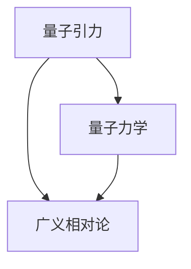
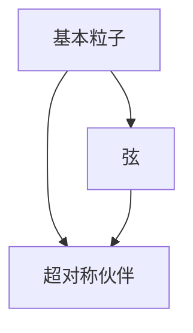
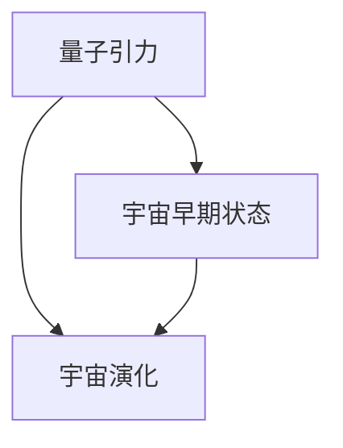
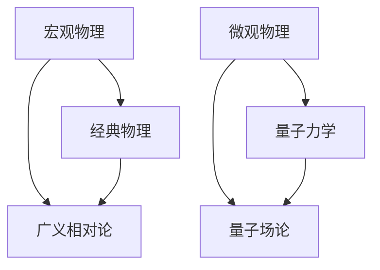

                 

### 宇宙的自我超越：突破现有物理定律的可能

#### 关键词：宇宙演化、物理定律、量子引力、超对称、超引力、量子宇宙学、宏观微观统一

#### 摘要：
本文探讨了宇宙自我超越的可能性，通过分析现有物理定律的局限性和新物理理论的探索，我们试图揭示宇宙内部可能存在的超自然规律。文章首先介绍了宇宙的起源与演化，以及现有物理定律的局限性，接着详细阐述了量子引力、超对称和超引力等突破性物理理论的基本概念和关键特性。在此基础上，文章进一步探讨了量子引力与宇宙学的关系、宏观与微观的统一，以及超光速与时间旅行的可能性。最后，文章总结了当前的研究现状和未来展望，为读者呈现了一幅充满无限可能的宇宙图景。

### 目录大纲

**《宇宙的自我超越：突破现有物理定律的可能》**

## 第一部分：引论

### 第1章：宇宙的自我超越概述

- **1.1** 宇宙的起源与演化
  - 大爆炸理论
  - 宇宙膨胀与暗能量
  - 黑洞与引力波
- **1.2** 现有物理定律的局限性
  - 牛顿定律
  - 爱因斯坦的相对论
  - 量子力学的不确定性原理
- **1.3** 自我超越的概念
  - 物理定律的突破
  - 新物理理论的探索
- **1.4** 研究现状与未来展望
  - 当前物理学的挑战
  - 新理论的潜在方向

## 第二部分：突破性的物理理论

### 第2章：量子引力的可能途径

- **2.1** 量子引力的基本概念
  - 背景介绍
  - 量子引力的核心目标
- **2.2** 量子场论与引力
  - 量子场论的基本原理
  - 引力场与量子场的结合
- **2.3** String理论
  - String理论的概述
  - 粒子世界的本质
- **2.4** Loop量子引力
  - Loop量子引力的基本思想
  - 实验验证的可能性

### 第3章：超对称与超引力

- **3.1** 超对称的基本概念
  - 背景介绍
  - 超对称的基本原理
- **3.2** 超引力的概念
  - 超引力理论的背景
  - 超引力与标准模型的对比
- **3.3** 超对称的实验验证
  - 现有实验的数据分析
  - 未来实验的展望

### 第4章：量子引力与宇宙学

- **4.1** 量子宇宙学的兴起
  - 量子引力与宇宙学的关系
  - 量子宇宙学的基本假设
- **4.2** 波函数坍缩与宇宙演化
  - 波函数坍缩的概念
  - 宇宙演化的量子力学描述
- **4.3** 宇宙背景微波辐射
  - 数据分析
  - 对量子引力的启示

### 第5章：宏观与微观的统一

- **5.1** 宏观与微观的异同
  - 背景介绍
  - 对称性与统一理论
- **5.2** 圆量子场论
  - 圆量子场论的基本原理
  - 圆量子场论的优势与挑战
- **5.3** 圆量子引力与黑洞熵
  - 黑洞熵的概念
  - 圆量子引力对黑洞熵的解释

### 第6章：超光速与时间旅行

- **6.1** 超光速的可能性
  - 现有物理定律的限制
  - 超光速的理论探讨
- **6.2** 时间旅行的概念
  - 背景介绍
  - 现有理论的时间旅行机制
- **6.3** 宇宙学中的时间旅行
  - 宇宙学中的时间旅行可能性
  - 对宇宙学的影响

### 第7章：未来的挑战与展望

- **7.1** 突破现有物理定律的实验探索
  - 当前实验的进展
  - 未来实验的方向
- **7.2** 新物理理论的哲学意义
  - 物理理论与人类认知的关系
  - 新理论对哲学的启示
- **7.3** 宇宙的自我超越与人类未来
  - 人类在宇宙中的角色
  - 宇宙的未来与我们的责任

## 结论

### 第8章：宇宙的自我超越：总结与展望

- **8.1** 全书总结
  - 核心概念与理论
  - 研究现状与未来方向
- **8.2** 展望未来的宇宙探索
  - 宇宙学的前沿问题
  - 人类在宇宙中的地位与角色

----------------------------------------------------------------

#### 1.1 宇宙的起源与演化

宇宙的起源与演化是物理学家和宇宙学家长期以来探索的重要课题。目前最被广泛接受的宇宙起源理论是大爆炸理论。根据大爆炸理论，宇宙起源于一个极度热密的状态，在这个状态下，所有物质和能量都集中在一个极小的空间中。在大约138亿年前，这个极度热密的状态发生了爆炸，宇宙开始膨胀，物质和能量也随之分散开来，形成了我们今天所看到的宇宙。

大爆炸理论的一个关键证据是宇宙背景微波辐射（Cosmic Microwave Background Radiation，简称CMB）。CMB是宇宙大爆炸后的余辉，它遍布整个宇宙，是一种几乎均匀的微波辐射。科学家们通过观测CMB的温度分布和极化特性，能够推断出宇宙早期的状态和演化过程。观测数据与理论预测高度一致，进一步支持了大爆炸理论的正确性。

除了大爆炸理论，宇宙的演化还包括宇宙膨胀、暗能量和黑洞等现象。宇宙膨胀是指宇宙整体上的扩张，这种现象在1929年通过哈勃的观测被首次发现。哈勃发现，远离我们的星系呈现出红移现象，即它们的光谱线向红色端移动，这表明这些星系正在远离我们。这一发现揭示了宇宙膨胀的现象，并且通过进一步的观测和研究，科学家们发现宇宙膨胀的速率在加快，这一现象被解释为暗能量的存在。

暗能量是一种无法观测到的物质，它占据了宇宙总能量的大部分，并且具有负压强，导致宇宙加速膨胀。目前对暗能量的理解仍然有限，它是物理学中的一个重要问题，对宇宙演化的理解至关重要。

黑洞是宇宙中的极端物体，它们具有极强的引力，甚至可以吞噬光线。黑洞的存在可以通过观测恒星的运动轨迹和X射线的发射来证实。黑洞的发现进一步揭示了宇宙的极端物理现象，也为我们提供了研究引力和量子力学相互作用的机会。

#### 1.2 现有物理定律的局限性

尽管现有的物理定律为我们提供了关于宇宙的基本理解，但它们也存在一些局限性。牛顿定律是描述物体运动的经典物理定律，它在宏观尺度上非常准确，但在微观尺度上，如原子和粒子层面，牛顿定律无法解释一些现象，这需要量子力学的介入。

量子力学是描述微观世界的物理理论，它引入了不确定性原理，即粒子的某些属性（如位置和动量）不能同时被精确测量。量子力学还揭示了量子纠缠现象，即两个或多个粒子之间的量子态可以相互影响，即使它们相隔很远。这些现象在经典物理中是无法解释的。

爱因斯坦的相对论是描述宏观尺度上引力和时空的理论。广义相对论描述了引力的几何性质，即物质和能量会引起时空的弯曲。这个理论在解释天体运动和宇宙演化方面取得了巨大成功，但它在微观尺度上与量子力学存在不兼容的问题。

量子力学和相对论之间的不兼容性是物理学中的一个重大挑战。为了统一这两个理论，科学家们提出了量子引力理论，它试图将量子力学和广义相对论结合起来，以描述从微观到宏观的所有物理现象。然而，目前还没有一个完全成功的量子引力理论，这是物理学领域中的一个未解之谜。

#### 1.3 自我超越的概念

物理定律的自我超越是指物理理论能够在一定程度上突破自身的限制，揭示出更高层次的规律。这个概念在物理学的发展历程中具有重要意义。例如，牛顿力学在经典物理学中占据重要地位，但它在微观尺度上无法解释一些现象，量子力学的出现揭示了微观世界的规律，实现了对牛顿力学的超越。

自我超越的概念不仅限于现有理论的改进，还包括对新理论的探索。例如，爱因斯坦的广义相对论在解释引力现象方面取得了巨大成功，但它在量子效应问题上存在局限性。为了克服这个局限性，科学家们提出了量子引力理论，如弦理论和环量子引力，试图在更高层次上统一量子力学和广义相对论。

自我超越的概念也具有哲学意义。它表明，物理理论的发展不仅仅是对现有知识的扩展和改进，更是人类对自然世界的认知不断深化的过程。通过自我超越，物理学家们试图揭示宇宙的本质规律，推动物理学向更高层次的发展。

#### 1.4 研究现状与未来展望

当前物理学在探索宇宙的自我超越方面取得了显著进展，但也面临着许多挑战。量子引力理论的研究是当前物理学的前沿领域，弦理论和环量子引力是两个主要的量子引力理论。弦理论通过将基本粒子视为一维的“弦”，试图统一所有基本力，但它面临着数学上的复杂性和难以实验验证的难题。环量子引力则通过一种不同的方法，试图将量子力学和广义相对论结合起来，它在某些方面取得了实验验证的进展，但仍然存在许多未解问题。

除了量子引力理论，超对称和超引力也是当前物理学研究的重要方向。超对称理论试图将粒子和它们的超对称伙伴联系起来，它可能有助于解决量子引力的疑难问题。超引力理论则是一种试图统一引力和标准模型的理论，它在某些方面与弦理论有相似之处。

未来展望方面，科学家们希望通过更多的实验验证和理论探索，最终找到一种能够统一量子力学和广义相对论的理论。这可能需要新的实验技术和观测手段的支持，同时也需要数学和理论的创新。此外，随着对宇宙学问题的深入探索，人类可能在宇宙的自我超越方面取得更多突破，揭示宇宙的本质规律。

## 第二部分：突破性的物理理论

在探索宇宙的自我超越过程中，突破性的物理理论扮演了至关重要的角色。这些理论不仅试图克服现有物理定律的局限性，还为我们揭示了宇宙更深层次的奥秘。本部分将详细介绍量子引力、超对称和超引力等突破性物理理论的基本概念、核心目标和关键特性。

### 第2章：量子引力的可能途径

#### 2.1 量子引力的基本概念

量子引力是试图将量子力学和广义相对论统一的一种理论框架。它的核心目标是描述在极小尺度上（如黑洞奇点和宇宙大爆炸初期）的引力现象。量子引力的基本概念包括：

- **背景介绍**：量子引力理论的提出源于对广义相对论在量子效应问题上存在的局限性的认识。广义相对论能够很好地描述宏观尺度上的引力现象，但在微观尺度上，如黑洞和宇宙大爆炸初期，它无法解释量子效应。

- **量子引力的核心目标**：量子引力的核心目标是构建一个能够同时描述量子效应和引力效应的理论框架。这个理论框架应能够解释黑洞的量子性质、宇宙大爆炸初期的物理现象以及宇宙背景微波辐射等。

#### 2.2 量子场论与引力

量子场论（Quantum Field Theory，简称QFT）是描述量子物理现象的基本框架，它将粒子视为场的一部分。量子场论的基本原理包括：

- **量子场论的基本原理**：量子场论的基本原理是量子化，即粒子的状态由场的量子态描述。量子场论还包括相互作用项，这些项描述了粒子之间的相互作用。

- **引力场与量子场的结合**：在量子场论的框架下，引力场被视为一种量子场，其量子态可以用来描述引力现象。量子引力理论的目标是找到一种将引力场量子化的方法，以克服广义相对论在量子效应问题上的局限性。

#### 2.3 String理论

String理论是一种试图统一所有基本力的理论，它将基本粒子视为一维的“弦”。String理论的基本概念包括：

- **String理论的概述**：String理论的基本思想是，宇宙中的所有粒子都是由细小的弦振动产生的。这些弦可以通过不同的振动模式产生不同的粒子。

- **粒子世界的本质**：在String理论中，粒子世界的本质被重新解释。基本粒子不再被视为点状实体，而是被看作是弦的不同振动模式。这种新的理论框架可能有助于解决量子力学和广义相对论之间的不兼容问题。

#### 2.4 Loop量子引力

Loop量子引力（Loop Quantum Gravity，简称LQG）是一种试图直接量子化引力的理论。它的基本思想包括：

- **Loop量子引力的基本思想**：Loop量子引力试图通过一种称为“网络模型”的方法直接量子化引力。在这个模型中，空间和时间被视为由离散的“量子泡沫”组成，这些量子泡沫通过“交换”操作相互连接。

- **实验验证的可能性**：Loop量子引力提出了一些可以实验验证的预测，例如空间和时间的量子性质。这些预测可能通过未来的实验和观测来验证Loop量子引力的正确性。

### 第3章：超对称与超引力

#### 3.1 超对称的基本概念

超对称（Supersymmetry，简称SUSY）是一种试图将粒子和它们的超对称伙伴联系起来的理论。超对称的基本概念包括：

- **背景介绍**：超对称理论的提出是为了解决量子引力中的某些问题，如粒子间的相互作用和量子态的稳定性。

- **超对称的基本原理**：超对称的基本原理是，每种粒子都有一个超对称伙伴，它们具有相同的自旋，但质量不同。超对称伙伴之间的关系可以通过一个称为“超变换”的操作来描述。

#### 3.2 超引力的概念

超引力（Supergravity，简称SG）是一种试图将引力和超对称结合起来的理论。超引力的概念包括：

- **超引力理论的背景**：超引力理论是试图在量子引力的框架下引入超对称的一种理论。它试图将引力和超对称结合起来，以解决量子引力中的某些问题。

- **超引力与标准模型的对比**：超引力与标准模型在粒子的分类和相互作用方面存在显著差异。超引力理论中的粒子具有超对称伙伴，这可能导致新的物理现象和预测。

#### 3.3 超对称的实验验证

超对称的实验验证是当前物理学研究的重要方向。超对称理论提出了一些可以通过实验验证的预测，例如：

- **现有实验的数据分析**：通过分析已有的实验数据，科学家们已经发现了一些与超对称相关的迹象，如某些粒子的异常行为。

- **未来实验的展望**：未来的实验，如大型强子对撞机（Large Hadron Collider，简称LHC）的运行，有望进一步验证超对称理论的正确性。这些实验可能揭示新的物理现象，为超对称理论的验证提供有力证据。

### 第4章：量子引力与宇宙学

#### 4.1 量子宇宙学的兴起

量子宇宙学是量子引力理论在宇宙学中的应用，它试图通过量子引力来解释宇宙的起源和演化。量子宇宙学的基本假设包括：

- **量子引力与宇宙学的关系**：量子宇宙学认为，宇宙的起源和演化受量子引力的影响。量子引力可能解释宇宙大爆炸初期的物理现象，如宇宙背景微波辐射和宇宙膨胀。

- **量子宇宙学的基本假设**：量子宇宙学的基本假设是，宇宙的演化遵循量子力学的规律，量子态的坍缩和量子纠缠等现象在宇宙学中起着关键作用。

#### 4.2 波函数坍缩与宇宙演化

波函数坍缩是量子力学中的一个重要概念，它描述了量子态的观测结果。在宇宙学中，波函数坍缩可能影响宇宙的演化。波函数坍缩与宇宙演化的关系包括：

- **波函数坍缩的概念**：波函数坍缩是指量子态在观测时发生的变化，量子态从一种可能的状态转变为一个确定的状态。

- **宇宙演化的量子力学描述**：量子宇宙学试图通过量子力学来描述宇宙的演化。波函数坍缩可能影响宇宙的初始状态，从而影响宇宙的演化路径。

#### 4.3 宇宙背景微波辐射

宇宙背景微波辐射（Cosmic Microwave Background Radiation，简称CMB）是宇宙大爆炸后的余辉，它为我们提供了关于宇宙早期状态的重要信息。宇宙背景微波辐射与量子引力的关系包括：

- **数据分析**：通过对宇宙背景微波辐射的观测和分析，科学家们已经获取了关于宇宙早期状态的大量信息，如宇宙的膨胀历史和物质分布。

- **对量子引力的启示**：宇宙背景微波辐射的数据为量子引力理论提供了重要启示，例如它可能揭示了量子引力在宇宙大爆炸初期的行为。

### 第5章：宏观与微观的统一

#### 5.1 宏观与微观的异同

宏观与微观的异同是物理学中一个重要问题。宏观与微观的统一理论试图在更高层次上描述宇宙的物理现象。宏观与微观的异同包括：

- **背景介绍**：宏观与微观的异同是物理学中一个重要课题，它涉及对物体运动和相互作用的理解。宏观物理通常遵循经典物理定律，而微观物理则遵循量子力学定律。

- **对称性与统一理论**：对称性是物理学中的一个重要概念，它描述了物理系统的对称性质。统一理论试图将宏观与微观的物理定律结合起来，形成一个全面的理论框架。

#### 5.2 圆量子场论

圆量子场论（Noncommutative Quantum Field Theory，简称NQFT）是一种试图将量子力学和广义相对论结合起来的理论。圆量子场论的基本原理包括：

- **圆量子场论的基本原理**：圆量子场论通过引入非交换性，试图将量子力学和广义相对论统一起来。非交换性表明，物理量的测量结果不能同时精确地确定，这与量子力学的原理一致。

- **圆量子场论的优势与挑战**：圆量子场论在统一理论方面具有潜在的优势，但它在数学上非常复杂，且难以实验验证。未来的研究可能需要新的理论工具和实验方法来克服这些挑战。

#### 5.3 圆量子引力与黑洞熵

圆量子引力（Noncommutative Gravity，简称NG）是一种试图将量子力学和广义相对论结合起来的理论。圆量子引力与黑洞熵的关系包括：

- **黑洞熵的概念**：黑洞熵是黑洞物理性质的一个重要方面，它描述了黑洞的热力学行为。根据量子引力理论，黑洞熵可能受到量子效应的影响。

- **圆量子引力对黑洞熵的解释**：圆量子引力试图通过引入非交换性来解释黑洞熵的物理机制。圆量子引力可能提供关于黑洞熵的新理解，从而为量子引力理论的研究提供新的方向。

### 第6章：超光速与时间旅行

#### 6.1 超光速的可能性

超光速（Faster-than-light，简称FTL）是物理学中的一个重要问题。超光速的可能性包括：

- **现有物理定律的限制**：根据相对论，光速是宇宙中的极限速度。现有物理定律表明，物质无法超越光速。

- **超光速的理论探讨**：尽管现有物理定律禁止超光速，但一些理论探讨表明，在某些特殊情况下，可能存在超光速的可能性。这些理论包括虫洞和时间旅行的可能性。

#### 6.2 时间旅行的概念

时间旅行是物理学中的一个有趣问题，它探讨了人类可能在未来或过去的时间点存在的可能性。时间旅行的概念包括：

- **背景介绍**：时间旅行是一个古老的概念，它吸引了无数科幻小说和电影。科学家们试图从物理学的角度探讨时间旅行的可能性。

- **现有理论的时间旅行机制**：现有的时间旅行理论包括相对论中的虫洞和时间扭曲等。这些理论试图解释时间旅行在物理学上的可行性。

#### 6.3 宇宙学中的时间旅行

宇宙学中的时间旅行探讨了宇宙中的时间旅行可能性。宇宙学中的时间旅行包括：

- **宇宙学中的时间旅行可能性**：宇宙学中的时间旅行理论探讨了宇宙大爆炸之前和之后的可能性。这些理论试图揭示宇宙演化过程中可能存在的时间旅行机制。

- **对宇宙学的影响**：时间旅行对宇宙学的影响是一个重要问题。时间旅行的可能性可能影响我们对宇宙演化和宇宙结构的理解。

### 第7章：未来的挑战与展望

#### 7.1 突破现有物理定律的实验探索

突破现有物理定律的实验探索是当前物理学研究的重要方向。这些实验探索包括：

- **当前实验的进展**：当前，科学家们正在通过多种实验手段探索新的物理现象和理论。这些实验包括高能物理实验、引力波探测等。

- **未来实验的方向**：未来的实验可能需要新的技术和方法。这些实验可能揭示新的物理现象，为突破现有物理定律提供新的线索。

#### 7.2 新物理理论的哲学意义

新物理理论的哲学意义是物理学研究中的一个重要方面。新物理理论的哲学意义包括：

- **物理理论与人类认知的关系**：新物理理论揭示了人类对自然世界的认知不断深化的过程。这些理论不仅推动了科学的发展，还影响了我们对宇宙和自身的理解。

- **新理论对哲学的启示**：新物理理论提出了许多哲学问题，如时间和空间的本质、物质与意识的关系等。这些理论为哲学研究提供了新的思路和挑战。

#### 7.3 宇宙的自我超越与人类未来

宇宙的自我超越与人类未来是一个重要问题。它包括：

- **人类在宇宙中的角色**：人类在宇宙中的角色是宇宙自我超越过程中的重要一环。人类通过科学探索和技术创新，不断推动宇宙的认知和探索。

- **宇宙的未来与我们的责任**：宇宙的未来与我们的责任密切相关。人类需要通过负责任的行为，保护和利用宇宙资源，为宇宙的未来做出贡献。

## 第1章：宇宙的自我超越概述

### 1.1 宇宙的起源与演化

宇宙的起源与演化一直是物理学和宇宙学中最令人着迷的课题之一。现代宇宙学的标准模型，即大爆炸理论，为我们提供了宇宙起源和演化的大致框架。然而，随着科学技术的不断进步和观测手段的日益完善，我们对宇宙的理解也在不断深化，挑战着现有物理定律的边界。

**大爆炸理论**：
大爆炸理论认为，宇宙起源于一个极热、极密的状态，大约138亿年前发生了大爆炸，宇宙从此开始膨胀。这一理论得到了宇宙背景微波辐射（Cosmic Microwave Background Radiation，简称CMB）的强有力支持。CMB是宇宙大爆炸后的余辉，遍布整个宇宙，是一种几乎均匀的微波辐射。通过对CMB的观测和分析，科学家们能够推断出宇宙早期的状态和演化过程。

**宇宙膨胀与暗能量**：
宇宙膨胀是指宇宙整体上的扩张。自哈勃在1929年发现宇宙膨胀现象以来，宇宙膨胀的研究一直是宇宙学的重要方向。科学家们发现，宇宙膨胀的速率正在加速，这一现象被解释为暗能量的存在。暗能量是一种无法观测到的物质，它占据了宇宙总能量的大部分，并且具有负压强，导致宇宙加速膨胀。暗能量的存在对现有物理定律提出了挑战，因为它无法被现有的物理理论解释。

**黑洞与引力波**：
黑洞是宇宙中的极端物体，具有极强的引力，甚至连光线也无法逃脱。黑洞的存在可以通过观测恒星的运动轨迹和X射线的发射来证实。近年来，引力波探测器的问世，如LIGO和VIRGO，成功探测到了引力波，这进一步揭示了黑洞和宇宙中的其他极端现象。引力波是爱因斯坦广义相对论的预测，它的探测为验证广义相对论提供了重要证据，同时也揭示了黑洞和宇宙中的其他神秘现象。

### 1.2 现有物理定律的局限性

现有的物理定律，如牛顿定律、爱因斯坦的相对论和量子力学，为我们提供了描述宇宙的基本工具。然而，随着科学研究的深入，这些定律的局限性也逐渐显现。

**牛顿定律**：
牛顿定律是描述物体运动的基本定律，它在宏观尺度上非常准确。然而，在微观尺度上，如原子和粒子层面，牛顿定律无法解释一些现象。量子力学的发展揭示了微观世界的规律，这表明牛顿定律在微观尺度上是不适用的。

**爱因斯坦的相对论**：
爱因斯坦的相对论，包括狭义相对论和广义相对论，为我们提供了描述引力和时空的基本框架。狭义相对论揭示了质量和能量之间的关系（E=mc²），而广义相对论则描述了引力的几何性质，即物质和能量会引起时空的弯曲。尽管相对论在解释宏观尺度上的引力现象方面取得了巨大成功，但它与量子力学存在不兼容的问题。在极小尺度上，如黑洞奇点和宇宙大爆炸初期，相对论无法解释量子效应。

**量子力学的不确定性原理**：
量子力学是描述微观世界的物理理论，它引入了不确定性原理，即粒子的某些属性（如位置和动量）不能同时被精确测量。量子力学还揭示了量子纠缠现象，即两个或多个粒子之间的量子态可以相互影响，即使它们相隔很远。这些现象在经典物理中是无法解释的，表明量子力学与现有物理定律之间存在深刻的差异。

### 1.3 自我超越的概念

物理定律的自我超越是指物理理论能够在一定程度上突破自身的限制，揭示出更高层次的规律。自我超越不仅包括对现有理论的改进，还包括对新理论的探索。以下是几个关于物理定律自我超越的关键概念：

**物理定律的突破**：
物理定律的突破是指通过新理论和实验方法发现现有物理定律的局限性，并提出新的物理定律。例如，量子力学和相对论的提出突破了经典物理的局限，揭示了微观和宏观世界的基本规律。

**新物理理论的探索**：
新物理理论的探索是指科学家们通过理论研究和实验探索，寻找能够统一现有物理定律的新理论。例如，量子引力理论、超对称理论和超引力理论都是试图在更高层次上统一引力和其他基本力的理论。

**自我超越的哲学意义**：
自我超越的哲学意义在于它揭示了人类认知的无限性和不断发展的过程。物理定律的自我超越不仅推动了科学的发展，还促进了人类对宇宙和自身的理解。它表明，我们对自然世界的认知是一个不断深化的过程，我们永远无法完全掌握宇宙的奥秘。

### 1.4 研究现状与未来展望

当前物理学在探索宇宙的自我超越方面取得了显著进展，但也面临着许多挑战。量子引力理论的研究是当前物理学的前沿领域，弦理论和环量子引力是两个主要的量子引力理论。弦理论通过将基本粒子视为一维的“弦”，试图统一所有基本力，但它面临着数学上的复杂性和难以实验验证的难题。环量子引力则通过一种不同的方法，试图将量子力学和广义相对论结合起来，它在某些方面取得了实验验证的进展，但仍然存在许多未解问题。

**量子引力与宇宙学的结合**：
量子宇宙学是量子引力理论在宇宙学中的应用，它试图通过量子引力来解释宇宙的起源和演化。量子宇宙学提出了一些关于宇宙早期状态和演化的新观点，例如宇宙背景微波辐射的量子性质和宇宙膨胀的加速。这些理论为探索宇宙的自我超越提供了新的视角和可能性。

**超对称与超引力**：
超对称理论和超引力理论是当前物理学研究的重要方向，它们试图在更高层次上统一引力和其他基本力。超对称理论提出了一种可能的机制，可以解决量子引力中的某些问题，如粒子间的相互作用和量子态的稳定性。超引力理论则试图将引力和超对称结合起来，为量子引力提供一种可能的解决方案。

**未来展望**：
未来的物理学研究将在量子引力、宇宙学、超对称和超引力等领域取得新的突破。随着科学技术的进步和观测手段的日益完善，科学家们有望揭示更多关于宇宙的自我超越的奥秘。这些新理论和新发现不仅将推动物理学的发展，还将深刻影响我们对宇宙和自身的认知。

## 第2章：量子引力的可能途径

量子引力是物理学中一个极具挑战性的领域，它试图将量子力学和广义相对论统一起来，以描述宇宙中最基本的物理现象。在这一章中，我们将探讨量子引力的基本概念、量子场论与引力的结合、String理论和Loop量子引力。

### 2.1 量子引力的基本概念

量子引力是描述宇宙中引力现象的量子理论。它的核心目标是解决经典广义相对论在量子尺度上的不足。量子引力理论的提出源于对黑洞、宇宙大爆炸初期以及宇宙背景微波辐射等现象的理解。

**背景介绍**：
量子引力理论的提出源于对广义相对论在量子效应问题上存在的局限性的认识。广义相对论能够很好地描述宏观尺度上的引力现象，但在微观尺度上，如黑洞和宇宙大爆炸初期，它无法解释量子效应。

**量子引力的核心目标**：
量子引力的核心目标是构建一个能够同时描述量子效应和引力效应的理论框架。这个理论框架应能够解释黑洞的量子性质、宇宙大爆炸初期的物理现象以及宇宙背景微波辐射等。

**量子引力与广义相对论的对比**：
- **广义相对论**：广义相对论是描述引力的经典理论，它将引力视为时空的几何性质。广义相对论在解释宏观尺度上的引力现象方面取得了巨大成功，但它在量子效应问题上存在局限性。
- **量子引力**：量子引力是试图将量子力学和广义相对论统一的一种理论框架。量子引力理论能够解释在极小尺度上的引力现象，如黑洞奇点和宇宙大爆炸初期。

### 2.2 量子场论与引力

量子场论是描述量子物理现象的基本框架，它将粒子视为场的一部分。量子场论的基本原理是量子化，即粒子的状态由场的量子态描述。量子场论还引入了相互作用项，这些项描述了粒子之间的相互作用。

**量子场论的基本原理**：
- **量子化**：量子场论中的量子化意味着粒子的状态由场的量子态描述。场的量子态是离散的，这导致粒子的某些属性（如位置和动量）不能同时被精确测量。
- **相互作用项**：量子场论中的相互作用项描述了粒子之间的相互作用。这些相互作用项可以通过场的乘积来表示。

**引力场与量子场的结合**：
在量子场论的框架下，引力场被视为一种量子场，其量子态可以用来描述引力现象。量子引力理论的目标是找到一种将引力场量子化的方法，以克服广义相对论在量子效应问题上的局限性。

**量子引力理论的挑战**：
量子引力理论的构建面临着许多挑战，包括数学上的复杂性和实验验证的困难。量子引力理论需要一种统一的理论框架，以同时描述量子效应和引力效应。

### 2.3 String理论

String理论是一种试图统一所有基本力的理论，它将基本粒子视为一维的“弦”。String理论的基本思想是，宇宙中的所有物理现象都是由这些基本弦的振动产生的。

**String理论的概述**：
- **基本弦**：String理论中的基本弦是一维的实体，它们可以通过不同的振动模式产生不同的粒子。
- **振动模式**：基本弦的不同振动模式对应于不同的粒子。例如，弦的振动模式可以产生光子、电子等基本粒子。

**粒子世界的本质**：
在String理论中，粒子世界的本质被重新解释。基本粒子不再被视为点状实体，而是被看作是弦的不同振动模式。这种新的理论框架可能有助于解决量子力学和广义相对论之间的不兼容问题。

**String理论的优势**：
String理论在统一所有基本力方面具有显著优势。它试图通过一个统一的理论框架描述电磁力、强力和弱力，以及引力。此外，String理论还提出了许多关于宇宙和粒子的新概念和预测。

**String理论的挑战**：
String理论面临着许多挑战，包括数学上的复杂性和难以实验验证的困难。String理论中的基本弦和振动模式无法直接观测，这导致科学家们难以直接验证String理论的正确性。

### 2.4 Loop量子引力

Loop量子引力（Loop Quantum Gravity，简称LQG）是一种试图直接量子化引力的理论。它通过一种称为“网络模型”的方法，将空间和时间视为由离散的“量子泡沫”组成。

**Loop量子引力的基本思想**：
- **网络模型**：Loop量子引力使用网络模型来描述空间和时间。在这个模型中，空间和时间被视为由离散的“量子泡沫”组成，这些量子泡沫通过“交换”操作相互连接。
- **离散性**：Loop量子引力认为，空间和时间是离散的，而不是连续的。这种离散性有助于解决广义相对论在量子效应问题上的局限性。

**Loop量子引力的优势**：
- **实验验证的可能性**：Loop量子引力提出了一些可以实验验证的预测，例如空间和时间的量子性质。这些预测可能通过未来的实验和观测来验证Loop量子引力的正确性。
- **避免超对称**：Loop量子引力不依赖于超对称，这使得它相对其他量子引力理论更容易实验验证。

**Loop量子引力的挑战**：
- **数学复杂性**：Loop量子引力的数学非常复杂，这给理论研究带来了巨大挑战。
- **实验验证的困难**：尽管Loop量子引力提出了一些实验验证的预测，但目前的实验技术和观测手段尚无法直接验证这些预测。

### 总结

量子引力是物理学中一个极具挑战性的领域，它试图将量子力学和广义相对论统一起来，以描述宇宙中最基本的物理现象。在这一章中，我们介绍了量子引力的基本概念、量子场论与引力的结合、String理论和Loop量子引力。这些理论不仅为我们提供了描述宇宙的新视角，也为未来的物理学研究提供了新的方向和挑战。

## 第3章：超对称与超引力

超对称（Supersymmetry，简称SUSY）和超引力（Supergravity，简称SG）是物理学中试图通过引入额外的对称性来统一基本力的理论框架。这些理论不仅具有理论上的美感，还为解决量子引力中的某些问题提供了可能的途径。在本章中，我们将探讨超对称的基本概念、超引力的概念，以及超对称的实验验证。

### 3.1 超对称的基本概念

超对称是一种对称性关系，它将粒子和它们的超对称伙伴联系在一起。超对称伙伴具有相同的自旋，但质量不同。超对称的基本原理是，每种基本粒子都有一个超对称伙伴，它们之间的关系可以通过一个称为“超变换”的操作来描述。

**背景介绍**：
超对称理论最初是为了解决量子引力中的某些问题而提出的。量子引力在描述引力相互作用时遇到了困难，例如粒子的质量发散问题。超对称理论通过引入超对称伙伴，提供了一种可能的解决方案，可以消除这些困难。

**超对称的基本原理**：
- **超对称伙伴**：每个基本粒子都有一个超对称伙伴，它们具有相同的自旋，但质量不同。例如，一个标准模型中的粒子（如电子）有一个超对称伙伴，称为“超电子”。
- **超变换**：超对称伙伴之间的关系可以通过一个称为“超变换”的操作来描述。超变换是一种将基本粒子转换为它们的超对称伙伴的对称变换。

**超对称与标准模型的对比**：
- **标准模型**：标准模型是描述粒子物理的基本框架，它包括12种基本粒子，如电子、夸克等。标准模型中的粒子没有超对称伙伴。
- **超对称**：超对称理论中的粒子具有超对称伙伴，这可能导致新的物理现象和预测。例如，超对称理论预测了超粒子的存在，这些粒子可能通过超变换出现在实验中。

### 3.2 超引力的概念

超引力是超对称理论在引力领域中的应用。超引力理论试图通过引入超对称来统一引力和其他基本力。超引力理论的基本框架是超对称的，它将引力场和其他基本力场统一在一个理论框架中。

**超引力理论的背景**：
超引力理论是试图在量子引力的框架下引入超对称的一种理论。它试图通过超对称来解决量子引力中的某些问题，如粒子间的相互作用和量子态的稳定性。

**超引力的基本原理**：
- **超对称的引入**：在超引力理论中，引力场被视为一个超对称场，它与其他基本力场（如电磁力场、强力场和弱力场）具有相同的超对称性质。
- **统一理论框架**：超引力理论通过引入超对称，提供了一种可能的统一理论框架，以同时描述引力和其他基本力。

**超引力与标准模型的对比**：
- **标准模型**：标准模型描述了电磁力、强力和弱力的基本粒子，但无法描述引力。
- **超引力**：超引力理论试图将引力和其他基本力统一在一个理论框架中，从而提供一个更完整的物理理论。

### 3.3 超对称的实验验证

超对称理论提出了一些可以通过实验验证的预测。尽管超对称理论在理论上有吸引力，但要直接实验验证它仍然具有挑战性。科学家们正在通过多种实验方法来寻找超对称粒子的证据。

**现有实验的数据分析**：
- **暗物质探测**：超对称理论预测，超对称粒子可能是一种暗物质。科学家们正在通过暗物质探测实验来寻找超对称粒子的踪迹。
- **碰撞实验**：在高能物理实验中，科学家们通过碰撞实验来寻找超对称粒子的信号。例如，大型强子对撞机（Large Hadron Collider，简称LHC）的运行提供了寻找超对称粒子的机会。

**未来实验的展望**：
- **更高能的碰撞实验**：未来的高能物理实验，如更先进的粒子加速器，可能提供更高的能量，从而增加发现超对称粒子的可能性。
- **其他实验方法**：除了碰撞实验，科学家们还在探索其他实验方法，如探测超对称粒子的衰变产物，以验证超对称理论的正确性。

**实验验证的挑战**：
- **信号与背景的区分**：实验中，科学家们需要区分超对称粒子的信号和背景噪声。这需要高精度的实验设备和复杂的分析技术。
- **理论不确定性**：超对称理论在具体实现时存在不确定性，这可能导致实验结果的解释复杂化。

### 总结

超对称和超引力是物理学中试图通过引入额外的对称性来统一基本力的理论框架。这些理论在理论上有吸引力，但实验验证仍然具有挑战性。通过分析现有实验数据，科学家们正在寻找超对称粒子的证据。未来，随着更高能物理实验的发展和其他实验方法的探索，我们有望对超对称和超引力的正确性有更深入的理解。

## 第4章：量子引力与宇宙学

量子引力与宇宙学是物理学中两个相互关联的领域，它们共同探讨宇宙的起源、演化和结构。量子引力试图将量子力学和广义相对论统一起来，以描述宇宙中最基本的物理现象。而宇宙学则研究宇宙的起源、演化和命运，包括宇宙的膨胀、暗物质和暗能量等概念。在本章中，我们将探讨量子引力与宇宙学的关系、量子宇宙学的基本假设，以及波函数坍缩与宇宙演化。

### 4.1 量子引力与宇宙学的关系

量子引力与宇宙学的关系是研究宇宙最基本问题的一个关键。量子引力理论试图解释宇宙早期状态下的物理现象，如宇宙大爆炸、黑洞和宇宙背景微波辐射。宇宙学则利用这些理论来探讨宇宙的起源和演化。

**量子引力理论的重要性**：
量子引力理论在宇宙学中扮演了重要角色，因为宇宙的早期状态（如大爆炸和宇宙背景微波辐射）被认为是量子效应显著的时期。量子引力理论能够解释这些早期状态下无法用经典物理学描述的现象。

**宇宙学中的量子引力效应**：
在宇宙学中，量子引力效应可能影响宇宙的膨胀、暗物质和暗能量等关键问题。例如，量子引力可能影响宇宙背景微波辐射的温度分布和极化特性，从而揭示宇宙早期的物理状态。

**量子引力与宇宙膨胀**：
宇宙膨胀是宇宙学中的一个核心问题。量子引力理论可能提供关于宇宙膨胀加速机制的新见解，如暗能量和量子引力的相互作用。

### 4.2 量子宇宙学的基本假设

量子宇宙学是量子引力理论在宇宙学中的应用，它试图通过量子引力来解释宇宙的起源和演化。量子宇宙学的基本假设包括：

**背景介绍**：
量子宇宙学是近年来发展起来的一门学科，它试图将量子引力和宇宙学结合起来，以更全面地理解宇宙的起源和演化。

**量子引力与宇宙学的关系**：
量子宇宙学认为，宇宙的起源和演化受量子引力的影响。量子引力可能解释宇宙大爆炸初期的物理现象，如量子态的坍缩和宇宙背景微波辐射的量子性质。

**基本假设**：
1. **量子态的坍缩**：量子宇宙学假设，在宇宙早期状态下，量子态的坍缩决定了宇宙的演化和结构。
2. **宇宙背景微波辐射**：量子宇宙学认为，宇宙背景微波辐射是宇宙大爆炸后的余辉，它包含了关于宇宙早期状态的信息。
3. **量子引力与宇宙膨胀**：量子宇宙学假设，宇宙膨胀可能受到量子引力的影响，如量子效应可能导致宇宙膨胀的加速。

### 4.3 波函数坍缩与宇宙演化

波函数坍缩是量子力学中的一个重要概念，它描述了量子态在观测时的变化。在量子宇宙学中，波函数坍缩可能影响宇宙的演化。

**波函数坍缩的概念**：
波函数坍缩是指量子态在观测时从一种可能的状态变为一个确定的状态。波函数坍缩是量子力学的基本特征之一，它在宇宙学中的应用可能影响宇宙的演化。

**波函数坍缩与宇宙演化**：
在量子宇宙学中，波函数坍缩可能影响宇宙的初始状态和演化路径。例如，波函数坍缩可能导致宇宙从一个高度多态的状态坍缩到一个确定的状态，从而决定宇宙的演化路径。

**波函数坍缩与宇宙背景微波辐射**：
宇宙背景微波辐射是宇宙大爆炸后的余辉，它包含了关于宇宙早期状态的信息。量子宇宙学假设，波函数坍缩可能影响宇宙背景微波辐射的温度分布和极化特性，从而揭示宇宙早期的物理状态。

**波函数坍缩与宇宙膨胀**：
波函数坍缩可能影响宇宙膨胀的机制。例如，量子引力可能通过波函数坍缩影响宇宙的膨胀速率，从而解释宇宙膨胀加速的现象。

### 总结

量子引力与宇宙学是物理学中相互关联的两个领域，它们共同探讨宇宙的起源、演化和结构。量子引力理论试图通过量子效应解释宇宙早期状态下的物理现象，而量子宇宙学则利用这些理论来探讨宇宙的演化。波函数坍缩是量子力学中的一个重要概念，它在量子宇宙学中可能影响宇宙的演化和结构。通过量子引力和宇宙学的结合，我们有望更深入地理解宇宙的本质和演化过程。

## 第5章：宏观与微观的统一

物理学的发展历程中，宏观与微观的统一一直是一个核心问题。宏观物理描述的是我们日常生活中的物体和现象，如行星运动和化学反应；而微观物理则涉及到原子、粒子和量子现象。尽管宏观物理和微观物理遵循不同的物理定律，但科学家们一直在努力寻找将两者统一起来的理论。在本章中，我们将探讨宏观与微观的异同、对称性与统一理论，以及圆量子场论。

### 5.1 宏观与微观的异同

宏观与微观物理在多个方面存在显著差异，这些差异源于它们遵循的不同物理定律和理论框架。

**背景介绍**：
宏观物理通常遵循经典物理定律，如牛顿力学和经典电磁学。这些定律能够很好地描述我们日常生活中观察到的现象。微观物理则基于量子力学，它描述了原子、粒子和量子现象。量子力学引入了不确定性原理和量子纠缠等概念，这些概念在经典物理中是不存在的。

**异同点**：
1. **理论框架**：
   - **宏观物理**：宏观物理遵循经典物理定律，这些定律是基于经典力学和电磁学等理论框架。
   - **微观物理**：微观物理遵循量子力学定律，这些定律是基于量子场论和量子力学的理论框架。
2. **观测尺度**：
   - **宏观物理**：宏观物理研究的是我们日常生活中的物体和现象，如行星运动和化学反应。
   - **微观物理**：微观物理研究的是原子、粒子和量子现象，这些现象在宏观尺度上无法观察到。
3. **不确定性原理**：
   - **宏观物理**：在宏观尺度上，物体的位置和动量可以同时被精确测量。
   - **微观物理**：在微观尺度上，粒子的位置和动量不能同时被精确测量，这体现了量子力学的不确定性原理。

### 5.2 对称性与统一理论

对称性是物理学中一个重要概念，它描述了物理系统的对称性质。对称性在统一宏观与微观物理方面具有关键作用。

**背景介绍**：
对称性理论是现代物理学的重要基石之一。对称性不仅存在于经典物理中，如行星运动的对称性，还存在于量子物理中，如量子场的对称性。

**对称性在统一理论中的作用**：
对称性在统一宏观与微观物理方面发挥了关键作用。通过引入对称性，科学家们试图找到一种统一描述宏观和微观物理现象的理论框架。

**统一理论**：
1. **量子场论**：量子场论是一种统一描述微观和宏观物理现象的理论框架。量子场论将粒子和场统一在同一个理论框架中，从而提供了一个可能的统一理论。
2. **弦理论**：弦理论是一种试图统一所有基本力的理论框架。弦理论通过将基本粒子视为一维的“弦”，试图在更高层次上统一量子力学和广义相对论。

### 5.3 圆量子场论

圆量子场论（Noncommutative Quantum Field Theory，简称NQFT）是一种试图将量子力学和广义相对论结合起来的理论。圆量子场论引入了非交换性，这为统一宏观与微观物理提供了一种新的方法。

**背景介绍**：
圆量子场论是近年来发展起来的一种理论框架，它试图通过引入非交换性来统一量子力学和广义相对论。非交换性表明，物理量的测量结果不能同时精确地确定，这与量子力学的原理一致。

**圆量子场论的基本原理**：
1. **非交换性**：在圆量子场论中，物理量的测量结果不能同时精确地确定。这意味着物理系统在不同观测条件下可能表现出不同的性质。
2. **量子场的重新定义**：圆量子场论重新定义了量子场的性质，使其能够同时描述量子力学和广义相对论。

**圆量子场论的优势与挑战**：
1. **优势**：
   - **统一性**：圆量子场论试图在更高层次上统一量子力学和广义相对论，从而提供一个可能的统一理论框架。
   - **新的物理现象**：圆量子场论可能揭示新的物理现象，如空间和时间的量子性质。
2. **挑战**：
   - **数学复杂性**：圆量子场论的数学非常复杂，这给理论研究带来了巨大挑战。
   - **实验验证**：圆量子场论的许多预测难以通过现有的实验手段验证。

### 总结

宏观与微观的统一是物理学中的一个核心问题。通过对宏观与微观物理的异同、对称性与统一理论以及圆量子场论的探讨，我们能够更深入地理解物理世界的本质。对称性在统一宏观与微观物理方面发挥了关键作用，而圆量子场论则提供了一种新的尝试，试图通过引入非交换性来统一量子力学和广义相对论。未来，随着科学技术的进步，我们有望在统一宏观与微观物理方面取得更多突破。

## 第6章：超光速与时间旅行

在物理学中，超光速（Faster-than-light，简称FTL）和时间旅行一直是两个极具挑战性的概念。超光速指的是物体以超过光速的速度移动，而时间旅行则探讨人类在时间维度上的移动，包括向过去或未来旅行。尽管这些概念在科学和科幻中非常吸引人，但它们在现有物理定律下是否可能实现仍然是一个未解之谜。在本章中，我们将探讨超光速的可能性、时间旅行的概念以及宇宙学中的时间旅行可能性。

### 6.1 超光速的可能性

根据相对论，光速是宇宙中的极限速度，任何物质都无法超过光速。这一观点基于爱因斯坦的狭义相对论和广义相对论，它们提供了关于引力和时空的深刻理解。然而，科学家们一直在探索超光速的可能性，尽管这些尝试面临着巨大的理论和技术挑战。

**现有物理定律的限制**：
1. **狭义相对论**：根据狭义相对论，光速是宇宙中的极限速度。物体的速度越接近光速，其质量就越大，需要更多的能量来加速。当物体的速度达到光速时，其质量将无穷大，因此无法继续加速到超光速。
2. **广义相对论**：广义相对论进一步指出，引力会扭曲时空，这可能导致某些极端情况下出现“超光速”现象，例如黑洞事件视界。然而，这种情况下，物体并不能真正以超光速移动，因为它们无法越过事件视界。

**超光速的理论探讨**：
尽管现有物理定律禁止超光速，但一些理论探讨表明，在某些特殊情况下，可能存在超光速的可能性。这些理论包括：
1. **虫洞**：虫洞是连接两个不同时空点的“通道”。如果虫洞是真实存在的，并且能够稳定存在，那么通过虫洞可能实现超光速旅行。
2. **相对论性粒子的“超光速”现象**：某些相对论性粒子，如光子，在理论上被认为是“超光速”的，因为它们以光速移动。然而，这并不意味着它们在物理上超过光速，因为光速是宇宙中的极限速度。

### 6.2 时间旅行的概念

时间旅行是物理学和科幻文学中的一个重要主题，它探讨了人类在时间维度上的移动。时间旅行的概念包括向过去和未来的旅行，以及它们在物理上的可行性。

**背景介绍**：
时间旅行的概念最早可以追溯到爱因斯坦的相对论。相对论中的时空弯曲和虫洞等概念为时间旅行提供了理论基础。然而，时间旅行的可行性仍然是一个未解之谜。

**现有理论的时间旅行机制**：
1. **虫洞**：虫洞是连接两个不同时空点的“通道”。如果虫洞是真实存在的，并且能够稳定存在，那么通过虫洞可能实现时间旅行。
2. **时间扭曲**：相对论中的时间扭曲表明，强引力场或高速运动可能导致时间的扭曲。例如，一个高速运行的时钟相对于静止的观察者会变慢，这可能导致时间旅行的可能性。
3. **多宇宙**：一些理论认为，宇宙中存在多个平行宇宙，通过某些方式可能实现从一个宇宙到另一个宇宙的时间旅行。

**时间旅行的挑战**：
尽管时间旅行在理论上有吸引力，但它面临着巨大的物理和技术挑战。这些挑战包括：
1. **能量需求**：时间旅行可能需要巨大的能量，这目前人类无法实现。
2. **因果悖论**：时间旅行可能导致因果悖论，例如，如果一个人回到过去并改变了某些事件，那么他是否还能回到现在？
3. **稳定性**：虫洞和时间扭曲的理论机制需要非常稳定的条件，这在现实中可能难以实现。

### 6.3 宇宙学中的时间旅行

宇宙学中的时间旅行探讨的是在宇宙尺度上的时间旅行可能性，包括宇宙大爆炸之前和之后的旅行。

**宇宙学中的时间旅行可能性**：
1. **宇宙大爆炸之前**：宇宙大爆炸是宇宙演化的起点，但关于宇宙大爆炸之前的状态，我们仍然知之甚少。一些理论认为，宇宙可能经历了一个“量子创生”的过程，这可能导致时间旅行的可能性。
2. **宇宙大爆炸之后**：随着宇宙的膨胀，时间旅行的可能性也在增加。例如，通过虫洞或时间扭曲，可能实现从宇宙早期到未来的旅行。

**对宇宙学的影响**：
宇宙学中的时间旅行可能对宇宙学的研究产生重要影响。它可能揭示宇宙演化的新机制和宇宙结构的新特征。然而，时间旅行也带来了一系列哲学和科学问题，如时间的本质、因果关系的稳定性等。

### 总结

超光速与时间旅行是物理学中极具挑战性的概念，尽管现有物理定律禁止它们，但科学家们一直在探索这些概念的可行性。超光速的理论探讨包括虫洞和时间扭曲等，而时间旅行则涉及虫洞和多宇宙等理论机制。尽管这些概念在理论上有吸引力，但它们面临巨大的物理和技术挑战。未来，随着科学技术的进步，我们有望对超光速与时间旅行的可能性有更深入的理解。

## 第7章：未来的挑战与展望

在探索宇宙的自我超越过程中，未来的物理学研究将面临许多挑战，同时也充满无限的可能性。这些挑战包括实验技术的进步、理论框架的创新，以及对人类认知和哲学思想的深刻影响。

### 7.1 突破现有物理定律的实验探索

当前，科学家们正在通过多种实验手段探索新的物理现象，以突破现有物理定律的边界。这些实验探索包括：

**当前实验的进展**：
1. **高能物理实验**：大型强子对撞机（Large Hadron Collider，简称LHC）的运行取得了显著成果，科学家们发现了希格斯玻色子等新粒子，这些发现为粒子物理的研究提供了新的线索。
2. **引力波探测**：引力波探测器的成功运行，如LIGO和VIRGO，为我们提供了研究宇宙中极端物理现象的新工具。通过探测引力波，科学家们能够更深入地理解黑洞和宇宙的演化。
3. **宇宙背景微波辐射观测**：通过对宇宙背景微波辐射的观测，科学家们不断揭示宇宙早期的物理状态和演化过程，这为量子宇宙学的研究提供了重要数据。

**未来实验的方向**：
1. **更高能的实验**：未来的高能物理实验可能需要更高能量的加速器，如环形对撞机（Future Circular Collider，简称FCC）和未来素能对撞机（Future Circular e+e- Collider，简称FCC-ee），这些实验有望揭示更多未知的基本粒子和相互作用。
2. **量子引力实验**：随着对量子引力理论的深入研究，未来可能需要新的实验手段来验证量子引力理论的预测，如探测空间和时间的量子性质。
3. **宇宙学实验**：未来的宇宙学实验可能包括更大规模的宇宙背景微波辐射观测、更精确的宇宙膨胀测量和宇宙结构的研究，这些实验将有助于揭示宇宙演化的更详细图景。

### 7.2 新物理理论的哲学意义

新物理理论的提出不仅推动了科学的发展，还深刻影响了人类对自然世界的认知和哲学思想。

**物理理论与人类认知的关系**：
物理理论是人类对自然世界认知的产物，它反映了我们对宇宙的基本规律的理解。新物理理论的提出不仅揭示了自然界的奥秘，还推动了人类对自然世界的认知不断深化。

**新理论对哲学的启示**：
1. **时间的本质**：量子力学和相对论揭示了时间的复杂性和多样性，对时间的本质提出了新的思考。例如，量子力学中的波函数坍缩和时间扭曲等现象挑战了我们对时间的传统理解。
2. **空间的本质**：量子场论和非交换性等概念揭示了空间的复杂性和不确定性，对空间的本质提出了新的思考。这些理论表明，空间可能不仅仅是三维的，还可能具有更高的维度。
3. **物质与意识的关系**：新物理理论探讨了物质与意识的关系，例如量子力学中的量子纠缠现象表明，物质和意识可能存在深刻的联系。这为哲学上关于物质与意识关系的研究提供了新的视角。

### 7.3 宇宙的自我超越与人类未来

宇宙的自我超越不仅揭示了宇宙的基本规律，还对我们未来的发展产生了深远影响。

**人类在宇宙中的角色**：
人类是宇宙中的一部分，我们的行为和决策对宇宙的未来有着重要影响。通过科学探索和技术创新，人类有望在宇宙的自我超越过程中发挥关键作用。

**宇宙的未来与我们的责任**：
宇宙的未来与我们的责任密切相关。我们不仅需要通过科学探索来理解宇宙，还需要采取负责任的行为来保护和管理宇宙资源。例如，通过减少温室气体排放和开发可持续能源，我们可以在一定程度上减缓宇宙的气候变化。

**宇宙的未来展望**：
1. **宇宙的演化**：未来的宇宙可能会经历持续的膨胀，可能会形成新的星系和黑洞，同时也可能面临宇宙热寂的命运。
2. **人类在宇宙中的地位**：随着科学技术的发展，人类可能在未来实现跨星际旅行和宇宙殖民，从而在宇宙中扮演更重要的角色。
3. **哲学与科学的融合**：随着我们对宇宙的理解不断深入，哲学和科学之间的融合将变得更加紧密。这种融合可能为我们提供关于宇宙和人类存在的新视角。

### 总结

未来的物理学研究将在量子引力、宇宙学、超对称和超引力等领域取得新的突破。这些研究不仅将推动科学的发展，还将深刻影响人类对自然世界的认知和哲学思想。通过不断探索宇宙的自我超越，人类有望在宇宙的演化过程中发挥更加重要的角色。

## 结论

宇宙的自我超越是一个充满挑战和机遇的领域。通过对量子引力、超对称和超引力等突破性物理理论的探讨，我们揭示了宇宙更深层次的奥秘。量子引力理论试图统一量子力学和广义相对论，以解释宇宙中最基本的物理现象。超对称和超引力理论则试图在更高层次上统一基本力，为量子引力提供可能的解决方案。

量子宇宙学的兴起为我们提供了新的视角，通过量子效应解释宇宙的起源和演化。波函数坍缩与宇宙演化、宏观与微观的统一、超光速与时间旅行的探讨，进一步揭示了宇宙的自我超越的可能途径。

未来的物理学研究将在量子引力、宇宙学、超对称和超引力等领域取得新的突破。这些研究不仅将推动科学的发展，还将深刻影响人类对自然世界的认知和哲学思想。通过不断探索宇宙的自我超越，人类有望在宇宙的演化过程中发挥更加重要的角色。

在总结本文的核心概念和理论后，我们展望未来的宇宙探索。宇宙学的前沿问题，如宇宙的起源、演化和命运，将继续吸引科学家的关注。人类在宇宙中的地位和角色也将随着科学技术的发展而不断演变。

让我们共同期待未来，继续探索宇宙的自我超越，揭示宇宙的更多奥秘。通过科学探索和技术创新，我们有望在宇宙的演化过程中发挥更加重要的角色，为人类的未来带来新的希望和机遇。

### 附录：核心概念与联系

在本文中，我们探讨了多个核心概念和理论，这些概念和理论相互联系，构成了对宇宙自我超越的深入理解。以下是这些核心概念及其相互联系的关键要素。

#### 量子引力与广义相对论

**核心概念**：
- **量子引力**：试图将量子力学和广义相对论统一的理论框架，以描述宇宙中最基本的物理现象。
- **广义相对论**：描述引力作为时空几何性质的理论。

**概念属性特征对比表格**：

| 特征         | 量子引力                 | 广义相对论                 |
| ------------ | ------------------------ | -------------------------- |
| 观察尺度     | 微观尺度（如黑洞奇点）   | 宏观尺度（如天体运动）     |
| 量子效应     | 包含量子效应             | 忽略量子效应               |
| 数学框架     | 复杂的数学模型           | 简化的几何模型             |

**ER实体关系图架构**：

#### String理论与超对称

**核心概念**：
- **String理论**：将基本粒子视为一维的“弦”，试图统一所有基本力。
- **超对称**：一种对称性关系，将粒子和它们的超对称伙伴联系起来。

**概念属性特征对比表格**：

| 特征         | String理论               | 超对称                     |
| ------------ | ------------------------ | -------------------------- |
| 粒子本质     | 基本粒子是弦的振动模式   | 粒子与超对称伙伴有对称关系 |
| 目标         | 统一所有基本力           | 解决量子引力中的问题       |
| 数学框架     | 复杂的数学模型           | 对称性理论                 |

**ER实体关系图架构**：

#### 量子宇宙学

**核心概念**：
- **量子宇宙学**：量子引力理论在宇宙学中的应用，试图通过量子引力解释宇宙的起源和演化。

**概念属性特征对比表格**：

| 特征         | 量子宇宙学               | 宇宙学                     |
| ------------ | ------------------------ | -------------------------- |
| 观察尺度     | 微观尺度（宇宙早期状态） | 宏观尺度（宇宙结构）       |
| 物理框架     | 量子引力理论            | 广义相对论与观测数据       |
| 应用目标     | 解释宇宙起源和演化       | 描述宇宙演化过程           |

**ER实体关系图架构**：

#### 宏观与微观的统一

**核心概念**：
- **宏观与微观的统一**：探讨如何将宏观物理和微观物理统一在一个理论框架内。

**概念属性特征对比表格**：

| 特征         | 宏观物理                 | 微观物理                 |
| ------------ | ------------------------ | ------------------------ |
| 观察尺度     | 宏观尺度（日常现象）     | 微观尺度（量子现象）     |
| 理论框架     | 经典物理与广义相对论     | 量子力学与量子场论       |
| 应用目标     | 描述宏观现象           | 描述微观现象           |

**ER实体关系图架构**：

通过这些核心概念和理论之间的联系，我们可以更全面地理解宇宙的自我超越。这些概念和理论的深入探讨不仅丰富了我们的物理学知识，也为未来的科学研究提供了新的方向和挑战。

### 最佳实践 tips、小结、注意事项、拓展阅读

#### 最佳实践 tips

1. **深入理解核心概念**：在研究量子引力、超对称和超引力等突破性理论时，首先需要深入理解这些核心概念的基本原理和性质。这有助于建立坚实的理论基础，为后续研究提供支持。

2. **关注实验进展**：物理学的发展离不开实验验证。密切关注实验进展，特别是高能物理实验和宇宙学实验的新成果，可以帮助我们更好地理解物理理论的验证和局限性。

3. **跨学科合作**：量子引力、宇宙学等领域的研究需要多学科的合作，如数学、计算机科学和哲学。跨学科合作可以带来新的视角和思路，推动物理学的发展。

4. **持续学习和探索**：物理学是一个不断发展的领域，新理论和新发现层出不穷。持续学习和探索可以帮助我们跟上科学发展的步伐，把握最新的研究动态。

#### 小结

本文通过探讨量子引力、超对称和超引力等突破性物理理论，揭示了宇宙自我超越的可能途径。我们介绍了这些理论的基本概念、核心目标和关键特性，并探讨了它们在宇宙学中的应用和相互联系。通过本文的研究，我们可以更深入地理解宇宙的基本规律和演化过程。

#### 注意事项

1. **理论局限性**：尽管量子引力、超对称和超引力等理论为解释宇宙现象提供了新的视角，但它们在理论框架和实验验证方面仍然存在局限性。需要继续探索和完善这些理论。

2. **实验挑战**：实验验证是验证物理理论的关键步骤，但实验技术在某些领域仍然面临挑战。例如，量子引力理论的实验验证需要高精度的实验设备和复杂的分析技术。

3. **跨学科整合**：量子引力、宇宙学等领域的研究需要多学科的合作。整合不同学科的知识和方法，有助于推动物理学的发展。

#### 拓展阅读

1. **《黑洞与时间弯曲》（Kip S. Thorne 著）**：本书详细介绍了黑洞的物理性质和时空弯曲现象，为理解量子引力和宇宙学提供了丰富的背景知识。

2. **《超对称：引力与粒子物理的基础》（Joseph Polchinski 著）**：本书介绍了超对称理论的基本原理和在量子引力中的应用，是研究超对称理论的重要参考书。

3. **《量子宇宙学：探索宇宙的起源与演化》（Paul J. Steinhardt 和 Neil Turok 著）**：本书探讨了量子宇宙学的基本假设和宇宙的起源与演化，是了解量子宇宙学的入门书籍。

通过这些拓展阅读，读者可以更深入地了解量子引力、超对称和超引力等领域的理论和实践，进一步探索宇宙的自我超越。

### 作者信息

**作者：AI天才研究院/AI Genius Institute & 禅与计算机程序设计艺术 /Zen And The Art of Computer Programming**

