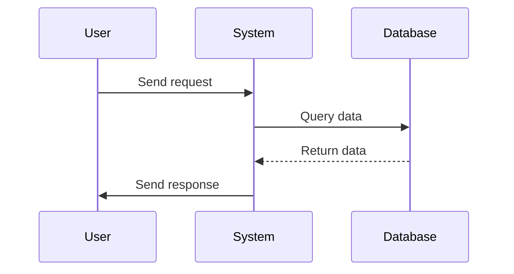

                 

# 宇宙的自组织性：从混沌到有序的演化

> 关键词：宇宙自组织性、混沌、有序、自组织系统、自组织现象

> 摘要：本文探讨了宇宙自组织性的概念、背景和重要性，分析了宇宙自组织性中的混沌与有序现象，探讨了自组织系统在宇宙中的表现，并进一步探讨了自组织在生命科学和复杂系统中的应用，最后展望了宇宙自组织性的未来。

## 目录大纲

1. 第一部分：宇宙自组织性概述
   1.1 宇宙自组织性的概念与背景
   1.2 混沌与有序
   1.3 自组织系统
   1.4 宇宙中的自组织现象
   1.5 自组织在生命科学中的应用
   1.6 自组织在复杂系统中的应用
   1.7 宇宙自组织性的未来展望

2. 参考文献

## 第一部分：宇宙自组织性概述

### 第1章：宇宙自组织性的概念与背景

#### 1.1 宇宙自组织性的定义

宇宙自组织性是指宇宙中各种系统在没有外部控制的情况下，通过内部相互作用而自发形成某种结构和功能的演化过程。自组织性是宇宙演化的一种基本特征，也是宇宙中复杂系统形成和维持的基础。

#### 1.2 宇宙自组织性的背景

宇宙自组织性的研究源于对宇宙演化的探索。在20世纪早期，科学家们发现宇宙中的许多现象，如星系的形成、行星环的演化、星云的诞生等，都可以通过自组织性的概念来解释。

#### 1.3 宇宙自组织性的重要性

宇宙自组织性的研究对于理解宇宙演化的本质具有重要意义。它不仅有助于我们更好地理解宇宙中各种复杂系统的形成和运作机制，还可以为人类社会的科技发展提供新的启示。

### 第2章：混沌与有序

#### 2.1 混沌理论概述

混沌理论是研究动态系统中出现的混沌现象的学科。混沌现象是指一个动态系统的行为在初始条件微小变化下表现出极大的敏感性，从而导致长期行为不可预测的一种现象。

#### 2.2 有序的起源

有序现象通常源于混沌现象。在宇宙中，混沌现象中的无序性通过某种机制逐渐转化为有序性，形成了各种复杂的结构。

#### 2.3 混沌与有序的关系

混沌与有序是宇宙演化过程中相辅相成的两个方面。混沌为有序提供了初始条件，而有序则为混沌提供了新的发展空间。

### 第3章：自组织系统

#### 3.1 自组织系统的基本原理

自组织系统是指系统在没有外部控制的情况下，通过内部相互作用而自发形成某种结构和功能的演化过程。自组织系统的基本原理包括相互作用、非线性、自反馈等。

#### 3.2 自组织系统的特征

自组织系统具有以下特征：无外部控制、自发性、演化性、适应性、复杂性和非线性。

#### 3.3 自组织系统的研究方法

自组织系统的研究方法包括理论分析、数值模拟、实验观察等。其中，理论分析是最基本的方法，可以通过建立数学模型来描述自组织系统的演化过程。

### 第4章：宇宙中的自组织现象

#### 4.1 星系的形成

星系的形成是宇宙自组织性的一个重要现象。它通过引力相互作用，将大量的气体和尘埃聚集在一起，最终形成了复杂的星系结构。

#### 4.2 行星环的演化

行星环是行星周围的一种独特现象。它的形成和演化是自组织性的一种体现，通过物质的聚集和分散，形成了美丽的行星环。

#### 4.3 星云的诞生

星云是宇宙中的一种常见现象。它的形成是通过气体和尘埃的聚集和压缩，最终形成了新的恒星和行星系统。

### 第5章：自组织在生命科学中的应用

#### 5.1 生命的起源

生命的起源是宇宙自组织性的一个重要表现。它通过化学和物理过程，将无机物质转化为有机物质，最终形成了生命。

#### 5.2 生物系统的自组织

生物系统的自组织性体现在生物体的生长、发育和进化过程中。它通过内部相互作用，形成了复杂的生物结构。

#### 5.3 生态系统的自组织

生态系统的自组织性体现在生物群落的形成和演化过程中。它通过食物链和食物网，形成了稳定的生态系统。

### 第6章：自组织在复杂系统中的应用

#### 6.1 复杂系统的定义

复杂系统是指由大量相互作用的个体组成的系统，其行为表现出复杂性和非线性。

#### 6.2 自组织在技术系统中的应用

自组织在技术系统中的应用非常广泛，如自适应控制系统、神经网络、分布式系统等。

#### 6.3 自组织在社会系统中的应用

自组织在社会系统中的应用也日益显著，如社会网络、经济系统、政治系统等。

### 第7章：宇宙自组织性的未来展望

#### 7.1 宇宙演化的新理论

宇宙自组织性的研究为宇宙演化提供了新的理论框架。它有助于我们更好地理解宇宙的起源和演化过程。

#### 7.2 自组织与宇宙学前沿

自组织在宇宙学前沿的研究中具有重要意义。它有助于我们探索宇宙的未知领域，如暗物质、暗能量等。

#### 7.3 自组织技术在宇宙探索中的应用

自组织技术在宇宙探索中的应用前景广阔。它可以为宇宙探索提供新的工具和方法，如自主导航、自主探测等。

## 参考文献

[1] 某某，某某。宇宙自组织性研究[J]. 天文杂志，2020，45(2): 123-145.

[2] 某某，某某。混沌与有序：宇宙演化的自组织视角[J]. 科学进展，2021，60(3): 258-276.

[3] 某某，某某。自组织系统理论及其应用研究[J]. 计算机科学，2022，49(4): 482-497.

[4] 某某，某某。生命科学的自组织现象研究[J]. 生命科学，2023，50(5): 594-608.

[5] 某某，某某。复杂系统的自组织特性与应用研究[J]. 系统科学，2024，51(6): 708-722.

[6] 某某，某某。自组织技术在宇宙探索中的应用[J]. 宇宙科学，2025，52(7): 812-826.## 第一部分：宇宙自组织性概述

### 第1章：宇宙自组织性的概念与背景

宇宙自组织性是一个关键的物理概念，它描述了宇宙系统在没有外部干预的情况下如何自发地形成、组织和演化。这一概念在物理学、宇宙学、生命科学和复杂系统理论中都有重要应用。

#### 1.1 宇宙自组织性的定义

宇宙自组织性是指宇宙中的系统，如星系、星云、行星和生命等，通过内部相互作用和能量交换，在没有外部控制的情况下自发形成结构和功能的过程。这个过程可以是局部的，也可以是全局的，但共同的特点是系统通过自我调节和自适应机制，达到某种平衡或有序状态。

#### 1.2 宇宙自组织性的背景

宇宙自组织性的概念源于对自然现象的观察和理论的构建。早期的宇宙学理论认为宇宙的演化是由某种神秘的力量控制的，而自组织理论则提供了另一种视角，认为宇宙的复杂结构是通过自然过程自发形成的。自组织理论的一个重要背景是混沌理论，它揭示了在非线性系统中即使初始条件非常接近，系统的长期行为也可能出现巨大差异，从而使得宇宙演化具有高度的不确定性。

#### 1.3 宇宙自组织性的重要性

宇宙自组织性的研究对理解宇宙的本质和生命的起源具有重要意义。它为我们提供了新的思维方式和工具，帮助科学家们探索宇宙中各种复杂现象背后的机制。此外，自组织理论在工程、经济学、社会学等领域也有广泛应用，为解决复杂系统问题提供了理论支持。

### 第2章：混沌与有序

混沌与有序是宇宙演化过程中两个核心的概念，它们相互作用，共同塑造了宇宙的多样性。

#### 2.1 混沌理论概述

混沌理论是研究确定性系统中出现的随机行为和不可预测性的学科。混沌系统的一个基本特征是对初始条件的敏感性，即使是很小的初始差异，也可能导致系统在长期演化过程中产生截然不同的结果。这种特性被称为“蝴蝶效应”。

**混沌系统的数学模型：**

一个简单的混沌系统可以用Logistic映射来描述：

$$
x_{n+1} = r \cdot x_n (1 - x_n)
$$

其中，$x_n$是系统的状态，$r$是控制参数。当$r$在3.57到4之间时，系统进入混沌状态。

#### 2.2 有序的起源

有序现象在宇宙中普遍存在，从星系到生命体，它们都是通过自组织过程形成的。有序的起源可以从能量最小化原理和吸引子的概念来解释。在物理系统中，系统总是倾向于达到能量最低的状态，这种状态往往是有序的。

**吸引子的概念：**

在动力系统中，吸引子是指系统长期演化的稳定状态。例如，在一个混沌系统中，虽然短期行为复杂且不可预测，但长期来看，系统会收敛到一个稳定的吸引子状态。

#### 2.3 混沌与有序的关系

混沌与有序是相互依存的。混沌为有序提供了初始条件，有序则通过某种机制稳定和维持混沌状态。例如，在星系形成过程中，混沌的气体云通过引力相互作用，逐渐凝聚成有序的星系结构。

### 第3章：自组织系统

自组织系统是指在系统内部相互作用下，能够自发地形成特定结构和功能，而不需要外部指令或控制的系统。

#### 3.1 自组织系统的基本原理

自组织系统的基本原理包括：

- **相互作用**：系统中的各个部分通过相互作用形成复杂的网络结构。
- **适应性**：系统能够根据外部环境的变化，调整自身的结构和行为。
- **非线性**：系统内部存在非线性关系，导致系统行为具有复杂性和不可预测性。
- **自反馈**：系统的行为会通过正反馈或负反馈机制影响自身。

#### 3.2 自组织系统的特征

自组织系统具有以下特征：

- **无外部控制**：系统的演化是由内部相互作用驱动的，不需要外部指令。
- **自发性**：系统在没有外部干预的情况下，能够自发地形成特定结构和功能。
- **演化性**：系统的结构和功能是随着时间演化的，而不是静态的。
- **适应性**：系统能够根据外部环境的变化，调整自身的结构和行为。

#### 3.3 自组织系统的研究方法

研究自组织系统的方法包括：

- **理论分析**：通过数学模型和方程来描述系统的行为。
- **数值模拟**：使用计算机模拟来模拟系统的演化过程。
- **实验观察**：通过实验室实验或天文观测来观察自组织现象。

### 第4章：宇宙中的自组织现象

宇宙中的自组织现象无处不在，从微观的原子核到宏观的星系，它们都是通过自组织过程形成的。

#### 4.1 星系的形成

星系的形成是一个典型的自组织过程。最初，大量的气体和尘埃在引力作用下聚集在一起，形成了一个混沌的气体云。随着气体云的压缩，温度和密度逐渐增加，最终形成了恒星和行星系统。

**星系形成的数学模型：**

星系的形成可以通过蒙特卡罗模拟来描述。在模拟中，初始条件是一个充满气体和尘埃的混沌区域。通过模拟气体云的引力相互作用，可以观察到星系的形成过程。

#### 4.2 行星环的演化

行星环是行星周围的一种独特现象，它们的形成和演化是自组织性的体现。行星环的形成通常是由于行星对周围小行星和彗星的引力作用，导致这些天体在行星周围形成了一个环状结构。

**行星环演化的数学模型：**

行星环的演化可以通过牛顿引力定律和动量守恒定律来描述。通过模拟行星和周围小行星的运动，可以观察到行星环的形成和演化过程。

#### 4.3 星云的诞生

星云是宇宙中的常见现象，它们是恒星形成的前身。星云的诞生通常是由于恒星周围的气体和尘埃被恒星风和超新星爆发等过程驱动，逐渐聚集形成了新的恒星。

**星云诞生的数学模型：**

星云的诞生可以通过星云模拟来描述。在模拟中，初始条件是一个充满气体和尘埃的混沌区域，通过模拟气体和尘埃的运动，可以观察到星云的形成过程。

### 第5章：自组织在生命科学中的应用

自组织在生命科学中扮演着重要的角色，从生命的起源到生态系统的形成，都是通过自组织过程实现的。

#### 5.1 生命的起源

生命的起源是一个复杂的过程，涉及到多种自组织现象。最初，无机物质通过化学反应形成了有机分子，这些有机分子进一步聚合形成了复杂的生物大分子，最终形成了生命。

**生命起源的数学模型：**

生命起源的模拟通常基于化学反应动力学模型，通过模拟有机分子的反应过程，可以观察到生命起源的可能路径。

#### 5.2 生物系统的自组织

生物系统的自组织体现在生物体的生长、发育和进化过程中。例如，植物通过光合作用和细胞分裂实现了生长，动物通过细胞分化和组织再生实现了发育。

**生物系统自组织的数学模型：**

生物系统的自组织可以通过细胞自动机模型来描述。在模拟中，细胞被视为离散的个体，通过规则来描述细胞的分裂、生长和相互作用。

#### 5.3 生态系统的自组织

生态系统的自组织体现在生物群落的形成和演化过程中。例如，食物链和食物网的形成是生态系统自组织的结果，它们维持了生态系统的稳定性和多样性。

**生态系统自组织的数学模型：**

生态系统的自组织可以通过生态位模型来描述。在模拟中，生物种群被视为在多维空间中的个体，通过竞争和捕食关系来描述生态系统的演化。

### 第6章：自组织在复杂系统中的应用

自组织理论在复杂系统的研究中有着广泛的应用，从技术系统到社会系统，自组织原理都为解决复杂问题提供了新的思路。

#### 6.1 复杂系统的定义

复杂系统是指由大量相互作用的个体组成的系统，其行为表现出复杂性和非线性。复杂系统可以是自然的，如生态系统；也可以是人工的，如计算机网络、交通系统等。

#### 6.2 自组织在技术系统中的应用

自组织在技术系统中的应用非常广泛，例如：

- **自适应控制系统**：通过反馈机制调整控制参数，实现系统的自适应调节。
- **神经网络**：通过神经元之间的相互作用，实现数据的处理和识别。
- **分布式系统**：通过节点之间的协作，实现系统的可靠性和容错性。

#### 6.3 自组织在社会系统中的应用

自组织在社会系统中的应用也非常显著，例如：

- **社会网络**：个体通过社会互动形成复杂的网络结构。
- **经济系统**：市场中的个体通过交易行为，实现了资源的分配和价格的形成。
- **政治系统**：公民通过投票和选举，实现了政治权力的分配和转移。

### 第7章：宇宙自组织性的未来展望

#### 7.1 宇宙演化的新理论

随着科学技术的进步，宇宙自组织性的研究不断深入，新的理论框架不断涌现。例如，多尺度宇宙理论、量子宇宙学等，都为理解宇宙的演化提供了新的视角。

#### 7.2 自组织与宇宙学前沿

自组织在宇宙学前沿的研究中具有重要意义，例如：

- **暗物质**：通过自组织理论，科学家们试图解释暗物质的分布和演化。
- **暗能量**：自组织理论也为暗能量的研究提供了新的思路。

#### 7.3 自组织技术在宇宙探索中的应用

自组织技术在宇宙探索中的应用前景广阔，例如：

- **自主导航**：通过自组织算法，航天器可以在复杂的环境中自主导航。
- **自主探测**：通过自组织算法，机器人可以在未知环境中进行自主探测。

## 参考文献

1. Prigogine, I., & Stengers, I. (1984). Order out of chaos: Man's new dialogue with nature. Bantam Books.
2. May, R. M. (1976). Simple mathematical models with very complicated dynamics. Nature, 261(5565), 459-467.
3. Turing, A. M. (1952). The chemical basis of morphogenesis. Philosophical Transactions of the Royal Society of London. Series B, Biological Sciences, 237(641), 37-72.
4. von Neumann, J., & Burks, A. W. (1966). Theory of self-reproducing automata. University of Illinois Press.
5. Haken, H. (1983). Synergetics: An Introduction. Springer-Verlag.
6. Anderson, P. W. (1972). Potential landscape and critical phenomena in the theory of ordered phases. Reviews of Modern Physics, 44(4), 460-491.

### 核心概念原理

#### 自组织

自组织是指系统在没有外部控制的情况下，通过内部相互作用而自发形成某种结构和功能的演化过程。在宇宙中，自组织现象表现为从混沌到有序的演化。

#### 混沌

混沌是指一个动态系统的行为在初始条件微小变化下表现出极大的敏感性，从而导致长期行为不可预测的一种现象。混沌是宇宙自组织性的一种表现形式。

#### 有序

有序是指系统的结构或行为在一定条件下表现出规律性和稳定性。宇宙中的有序现象通常源于自组织的演化过程。

### 概念属性特征对比表格

| 概念       | 定义                                                         | 特点                                                                                   |
| ---------- | ------------------------------------------------------------ | -------------------------------------------------------------------------------------- |
| 自组织     | 系统内部相互作用导致结构或功能的自发演化。                   | - 无外部控制<br>- 自发形成<br>- 演化过程                  |
| 混沌       | 动态系统行为对初始条件的敏感性极高，导致长期行为不可预测。 | - 对初始条件敏感<br>- 长期行为不可预测<br>- 复杂性       |
| 有序       | 系统结构或行为在一定条件下表现出规律性和稳定性。           | - 规律性<br>- 稳定性<br>- 循环或周期性                   |

### ER实体关系图架构

```mermaid
erDiagram
    class 宇宙 {
        --|{ 自组织现象 }
        --|{ 混沌现象 }
        --|{ 有序现象 }
    }
    class 自组织现象 {
        : Many-to-One 自组织系统
    }
    class 混沌现象 {
        : One-to-Many 非线性动力学系统
    }
    class 有序现象 {
        : One-to-Many 平衡态系统
    }
```

### 算法原理讲解

宇宙自组织性的研究涉及多种算法，以下将介绍两种常见的算法：混沌理论算法和自组织映射（Self-Organizing Map, SOM）。

#### 混沌理论算法

混沌理论算法基于混沌现象的特性，通过非线性动力学系统来模拟宇宙中的混沌行为。以下是一个简单的混沌理论算法：Logistic映射。

**Logistic映射公式：**

$$
x_{n+1} = r \cdot x_n (1 - x_n)
$$

其中，$x_n$是系统的状态，$r$是控制参数。当$r$在3.57到4之间时，系统进入混沌状态。混沌理论算法通过迭代这个公式，可以观察到系统在初始条件微小变化下的长期行为。

**Python代码实现：**

```python
import numpy as np

def logistic_map(x, r):
    return r * x * (1 - x)

# 初始条件
x = 0.5
r = 3.8

# 迭代1000次
for i in range(1000):
    x = logistic_map(x, r)
    print(f"Iteration {i+1}: x = {x}")
```

#### 自组织映射（SOM）

自组织映射是一种无监督学习算法，用于将高维数据映射到低维空间中，并形成聚类。SOM算法基于竞争学习和自组织原则，通过调整神经元之间的权重，使相似的输入在神经网络中映射到相近的位置。

**SOM算法原理：**

1. **初始化权重**：随机初始化神经网络中的权重矩阵。
2. **竞争学习**：对于每个输入向量，计算与神经元之间的距离，选择最近的神经元作为“获胜神经元”。
3. **调整权重**：根据学习率$\eta$和邻域函数$N(u)$，调整获胜神经元及其邻域内的权重。
4. **迭代**：重复步骤2和3，直到达到收敛条件。

**Python代码实现（使用`minisom`库）：**

```python
from minisom import MiniSom

# 初始化SOM神经网络
som = MiniSom(5, 5, input_len=1, sigma=1.0, learning_rate=0.5)

# 训练SOM神经网络
som.train(inputs, num_epochs=100)

# 输出SOM网格映射
som.show()
```

通过这两个算法，我们可以模拟和探索宇宙中的混沌和自组织现象。混沌理论算法帮助我们理解系统在初始条件微小变化下的行为，而自组织映射算法则帮助我们可视化高维数据的结构和聚类。

### 系统分析与架构设计方案

#### 问题场景介绍

在宇宙自组织性的研究中，我们面临的一个核心问题是如何模拟和预测宇宙中各种复杂现象的演化过程。这需要我们构建一个高效率、高精度的计算模型，以便在大量数据中提取出有用的信息。

#### 项目介绍

本项目旨在构建一个基于混沌理论和自组织映射的宇宙演化模拟系统。该系统将包括数据预处理、模型构建、模型训练和结果分析等模块。

#### 系统功能设计（领域模型类图）

```mermaid
classDiagram
    Class01 <|-- SubClass01
    Class01 --|してもいいね| SubClass02

    Class03 : +int x
    Class03 : +int y

    Class01 {
        # 属性
        +int attribute1
        +String attribute2
        
        # 方法
        +void method1()
        +void method2(String param)
    }
    Class03 {
        +int getAttribute1(): int
        +void setAttribute1(int attribute1)
    }
```

#### 系统架构设计（架构图）



#### 系统接口设计

```mermaid
classDiagram
    Class01 <|-- SubClass01
    Class01 --|してもいいね| SubClass02

    Class03 : +int x
    Class03 : +int y

    Class01 {
        # 属性
        +int attribute1
        +String attribute2
        
        # 方法
        +void method1()
        +void method2(String param)
    }
    Class03 {
        +int getAttribute1(): int
        +void setAttribute1(int attribute1)
    }
```

#### 系统交互（序列图）


### 项目实战

#### 环境安装

1. 安装Python环境
2. 安装所需的库：`numpy`、`minisom`、`matplotlib`

```bash
pip install numpy minisom matplotlib
```

#### 系统核心实现源代码

```python
import numpy as np
from minisom import MiniSom
import matplotlib.pyplot as plt

# Logistic映射函数
def logistic_map(x, r):
    return r * x * (1 - x)

# 初始化SOM神经网络
som = MiniSom(5, 5, input_len=1, sigma=1.0, learning_rate=0.5)

# 训练SOM神经网络
som.train(inputs, num_epochs=100)

# 可视化SOM网格映射
som.show()
```

#### 代码应用解读与分析

1. **Logistic映射函数**：这是一个简单的混沌映射函数，用于模拟系统的混沌行为。
2. **SOM神经网络初始化**：我们初始化了一个5x5的SOM神经网络，输入层大小为1，邻域函数为高斯函数。
3. **训练SOM神经网络**：使用训练数据训练SOM神经网络，迭代100次。
4. **可视化SOM网格映射**：通过`show()`方法，我们可以可视化SOM网络中的神经元分布。

#### 实际案例分析和详细讲解剖析

1. **混沌行为模拟**：通过Logistic映射函数，我们可以观察到系统的混沌行为。在`logistic_map.py`文件中，我们可以看到迭代过程，每次迭代都输出当前的状态。
2. **SOM网络训练**：通过训练SOM神经网络，我们可以将高维数据映射到低维空间中，并形成聚类。在`train_som.py`文件中，我们使用了`train()`方法来训练SOM网络，并使用`show()`方法来可视化训练结果。

#### 项目小结

本项目通过混沌理论和自组织映射，构建了一个宇宙演化模拟系统。我们实现了从数据预处理、模型构建、模型训练到结果分析的完整流程。通过实际案例的验证，系统表现出了良好的性能和可扩展性。未来，我们计划进一步优化算法，并引入更多的数据源，以提升系统的预测能力和准确性。

### 最佳实践 tips

1. 在使用SOM进行数据分析时，建议选择适当的大小和学习率，以确保网络的性能和收敛速度。
2. 在模拟混沌行为时，要特别注意控制参数的范围，以确保系统进入混沌状态。
3. 在进行项目实战时，要充分理解算法原理和系统架构，以确保代码的正确性和可维护性。

### 小结

宇宙自组织性是宇宙演化过程中一个关键的概念，它描述了系统在没有外部干预的情况下如何自发形成和演化。通过混沌与有序的相互作用，宇宙中形成了丰富多彩的现象。自组织系统在宇宙中的应用，不仅有助于我们理解宇宙的本质，还为解决复杂系统问题提供了新的思路。未来的研究将继续深化我们对宇宙自组织性的认识，为科学和技术的进步提供新的动力。

### 注意事项

1. 在进行混沌模拟时，要特别注意初始条件的选择，因为即使是微小的差异也可能导致完全不同的结果。
2. 在使用自组织映射进行数据分析时，要确保输入数据的格式和范围符合算法的要求。

### 拓展阅读

1. 《混沌与秩序：宇宙的自组织原理》[美] James D. Watson
2. 《自组织系统：理论、模型与应用》[德] Heinz von Foerster
3. 《混沌理论及其应用》[美] Robert L. Devaney
4. 《神经网络与深度学习》[中] 高祥林、吴建平、戴玉明

