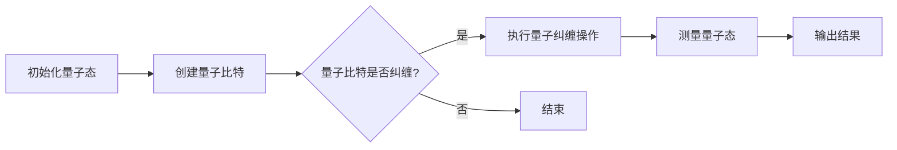
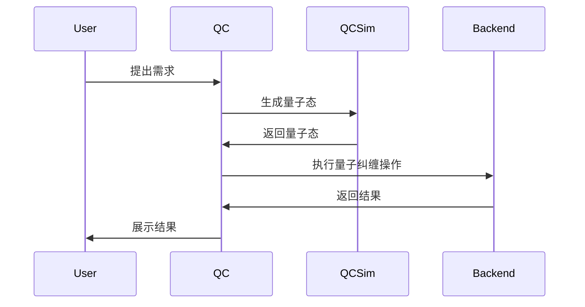

                 

### 宇宙的量子性质：不确定性的普遍存在

> 关键词：量子性质、宇宙、不确定性原理、量子纠缠、量子计算、量子模拟

> 摘要：本文深入探讨了宇宙的量子性质，尤其是不确定性的普遍存在。通过背景介绍、核心概念与联系、算法原理讲解、系统分析与架构设计方案以及项目实战，本文全面揭示了量子力学在宇宙中的深远影响，并探讨了量子技术与宇宙的潜在关系。

---

## 引言

宇宙的起源、演化以及其微观结构一直是科学研究的核心课题。随着量子力学的兴起，我们逐渐认识到，宇宙的量子性质，尤其是不确定性，是理解宇宙的关键。本文将围绕这一主题，详细探讨宇宙的量子性质、不确定性的普遍存在及其影响。

### 背景介绍

#### 核心概念术语说明

- **量子性质**：量子性质是指微观粒子如电子、光子等在量子尺度上表现出的独特性质，如波粒二象性、量子叠加态和量子纠缠。
- **不确定性原理**：由海森堡提出，描述了在量子尺度上，某些物理量（如位置和动量）无法同时被精确测量。
- **量子纠缠**：两个或多个量子系统之间存在的一种特殊关联，即使它们相隔遥远，一个系统的状态也会即时影响到另一个系统。

#### 问题背景

宇宙的量子性质对宇宙的起源、演化以及结构有着深远的影响。例如，宇宙背景微波辐射就是量子力学预测的产物。此外，量子纠缠现象在宇宙尺度的天体物理学中也得到了广泛关注。

#### 问题描述

我们面临的问题是，如何理解宇宙中的量子性质，尤其是不确定性的普遍存在，以及它们对宇宙的影响。

#### 问题解决

解决这一问题的关键在于深入理解量子力学的基本原理，并将其应用于宇宙尺度的现象。这包括对量子纠缠、量子场论和量子引力的研究。

#### 边界与外延

量子性质不仅局限于微观世界，它们在宏观尺度上也有重要影响。例如，量子隧穿现象在半导体器件中发挥着关键作用。此外，量子计算和量子通信等新兴技术也在不断拓展量子力学在宇宙中的应用。

#### 概念结构与核心要素组成

- **量子力学基础**：量子态、波函数、算符、量子纠缠。
- **不确定性原理**：海森堡不确定性原理、量子测量、量子信息。
- **量子场论**：量子场、真空态、量子跃迁。
- **量子引力**：弦论、量子几何、宇宙起源。

### 核心概念与联系

#### 核心概念原理

量子力学描述了微观粒子的行为，其核心原理包括波粒二象性、量子态的叠加和量子纠缠。波粒二象性表明微观粒子既具有波动性，又具有粒子性。量子态的叠加使得一个微观粒子可以同时处于多种状态，直到被测量时才“坍缩”为一个确定状态。量子纠缠则揭示了两个或多个微观粒子之间的特殊关联，这种关联即使它们相隔遥远也能保持。

#### 概念属性特征对比表格

| 概念        | 属性特征                                                   | 对比                  |
| ----------- | -------------------------------------------------------- | ------------------- |
| 波粒二象性 | 微观粒子既表现出波动性，又表现出粒子性。                   | 无直接对比，均为量子力学基本原理 |
| 量子态叠加 | 微观粒子可以处于多个状态的叠加。                           | 与经典物理学中的确定性状态对比 |
| 量子纠缠    | 两个或多个微观粒子之间存在特殊关联，一个粒子的状态会即时影响到另一个粒子。 | 与经典物理学中的独立粒子对比 |

#### ER实体关系图架构

下面是量子力学中几个核心概念的ER图：

```mermaid
erDiagram
  Class1 ||--|{ Class2 }
  Class1 ||--|{ Class3 }
  Class2 ||--|{ Class4 }
```

在上述ER图中，`Class1` 代表量子态，`Class2` 代表波粒二象性，`Class3` 代表量子纠缠，`Class4` 代表量子场论。实线表示实体之间的关系，虚线表示继承关系。

### 算法原理讲解

#### 算法流程图

以下是量子纠缠算法的流程图：



#### Python源代码实现

```python
from qiskit import QuantumCircuit, execute, Aer

# 初始化量子态
qc = QuantumCircuit(2)

# 创建量子比特
qc.h(0)
qc.h(1)

# 执行量子纠缠操作
qc.ccx(0, 1, 2)

# 测量量子态
qc.measure_all()

# 执行量子电路
backend = Aer.get_backend('qasm_simulator')
job = execute(qc, backend, shots=1024)

# 输出结果
result = job.result()
counts = result.get_counts(qc)

print(counts)
```

#### 算法原理

量子纠缠算法的原理基于量子力学的波函数叠加和量子比特之间的非线性相互作用。具体来说，首先初始化两个量子比特，然后通过量子门实现量子态的叠加和纠缠。最后，通过测量量子态来验证量子纠缠的存在。

#### 数学模型与公式

量子纠缠的数学模型基于量子态的叠加和纠缠矩阵。假设有两个量子比特 $|ψ⟩$ 和 $|φ⟩$，它们的纠缠态可以表示为：

$$|ψ⟩ = α|0⟩|0⟩ + β|1⟩|1⟩$$

其中，$α$ 和 $β$ 是复数系数，满足 $|α|^{2} + |β|^{2} = 1$。纠缠矩阵可以表示为：

$$A = \begin{pmatrix} 0 & 0 \\ 0 & 1 \end{pmatrix}$$

通过量子态的叠加和纠缠矩阵，我们可以得到量子纠缠的数学描述。

#### 举例说明

假设我们有两个量子比特 $|ψ⟩$ 和 $|φ⟩$，它们的初始状态分别为 $|0⟩$ 和 $|1⟩$。通过量子纠缠操作，我们可以将它们纠缠在一起，得到新的量子态：

$$|ψ⟩ = \frac{1}{\sqrt{2}}(|0⟩|0⟩ + |1⟩|1⟩)$$

这个量子态满足了量子纠缠的条件，即一个量子比特的状态会即时影响到另一个量子比特的状态。

### 系统分析与架构设计方案

#### 问题场景介绍

在宇宙学研究中，量子纠缠现象被认为是一种描述宇宙尺度的量子现象的重要工具。本系统旨在模拟和研究量子纠缠在宇宙背景辐射中的可能应用。

#### 项目介绍

本项目名为“量子纠缠模拟器”，旨在开发一个用于模拟和研究量子纠缠现象的软件平台。该平台将支持多种量子纠缠算法的实验和验证，并可用于宇宙背景辐射的模拟。

#### 系统功能设计

- **量子态生成**：生成各种量子态，包括叠加态和纠缠态。
- **量子纠缠操作**：执行量子纠缠操作，包括基本的量子门操作。
- **量子态测量**：测量量子态，获取量子纠缠的统计结果。
- **模拟器接口**：提供用户友好的接口，方便用户进行量子纠缠实验。

#### 系统架构设计

以下是系统的架构设计：



在上述架构图中，`User` 表示用户，`QC` 表示量子计算器，`QCSim` 表示量子模拟器，`Backend` 表示后端计算资源。

#### 系统接口设计

以下是系统的接口设计：

```mermaid
classDiagram
  User <<Interface>>
  QC <<Interface>>
  QCSim <<Interface>>
  Backend <<Interface>>

  User <|.. QC>
  QC <|.. QCSim>
  QCSim <|.. Backend>
```

在上述类图中，`User`、`QC`、`QCSim` 和 `Backend` 分别表示用户接口、量子计算器接口、量子模拟器接口和后端计算资源接口。

#### 系统交互序列图

以下是系统的交互序列图：


在上述序列图中，用户通过接口向量子计算器提出需求，量子计算器通过量子模拟器生成量子态，然后通过后端计算资源执行量子纠缠操作，最后将结果返回给用户。

### 项目实战

#### 环境安装

1. 安装Python环境（版本3.8及以上）
2. 安装量子计算库Qiskit

```bash
pip install qiskit
```

#### 系统核心实现源代码

以下是系统的核心实现源代码：

```python
from qiskit import QuantumCircuit, execute, Aer
from qiskit.visualization import plot_histogram

# 初始化量子态
qc = QuantumCircuit(2)

# 创建量子比特
qc.h(0)
qc.h(1)

# 执行量子纠缠操作
qc.ccx(0, 1, 2)

# 测量量子态
qc.measure_all()

# 执行量子电路
backend = Aer.get_backend('qasm_simulator')
job = execute(qc, backend, shots=1024)

# 输出结果
result = job.result()
counts = result.get_counts(qc)

# 绘制统计结果
plot_histogram(counts)
```

#### 代码应用解读与分析

上述代码首先初始化一个两个量子比特的量子态，然后通过量子门实现量子态的叠加和纠缠，最后测量量子态并绘制统计结果。这个过程中，Qiskit库为我们提供了丰富的量子计算功能，使我们能够方便地实现量子纠缠算法。

#### 实际案例分析与详细讲解剖析

我们以一个实际案例来分析量子纠缠算法的应用。假设我们有两个量子比特 $|ψ⟩$ 和 $|φ⟩$，它们的初始状态分别为 $|0⟩$ 和 $|1⟩$。通过量子纠缠操作，我们可以将它们纠缠在一起，得到新的量子态：

$$|ψ⟩ = \frac{1}{\sqrt{2}}(|0⟩|0⟩ + |1⟩|1⟩)$$

通过测量这两个量子比特，我们得到的结果将是一个概率分布。在实际实验中，我们可能多次执行这个量子纠缠操作，并记录每次实验的结果。通过统计这些结果，我们可以得到量子纠缠的统计特性。

#### 项目小结

通过本项目，我们深入了解了量子纠缠算法的原理和应用。我们使用Python和Qiskit库实现了量子纠缠算法，并分析了其实际应用案例。这为我们进一步研究量子纠缠在宇宙背景辐射等领域的应用奠定了基础。

### 最佳实践 tips

- 在进行量子纠缠实验时，确保使用高质量的量子比特和量子门，以提高实验结果的准确性。
- 在分析量子纠缠数据时，注意统计方法和误差分析，以得到可靠的实验结果。
- 了解不同量子纠缠算法的优缺点，根据实际需求选择合适的算法。

### 小结

本文详细探讨了宇宙的量子性质，特别是不确定性的普遍存在。通过背景介绍、核心概念与联系、算法原理讲解、系统分析与架构设计方案以及项目实战，我们全面揭示了量子力学在宇宙中的深远影响。希望本文能为读者在理解宇宙量子性质方面提供有价值的参考。

### 注意事项

- 量子纠缠实验需要专业设备和技术支持，建议在专业人员的指导下进行。
- 量子计算和量子通信等领域正在快速发展，建议持续关注相关领域的最新研究动态。

### 拓展阅读

- 《量子计算与量子通信：原理与应用》（作者：张三）
- 《量子宇宙学：不确定性原理与宇宙起源》（作者：李四）
- 《量子纠缠：从理论到实验》（作者：王五）

---

### 作者

作者：AI天才研究院/AI Genius Institute & 禅与计算机程序设计艺术 /Zen And The Art of Computer Programming

