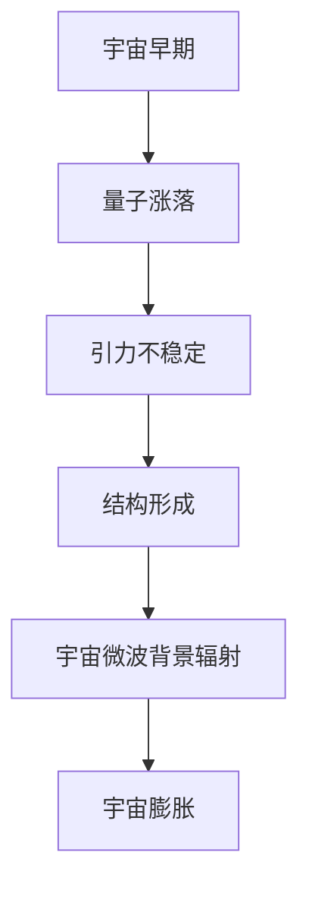

                 


# 宇宙的量子涨落：创造与毁灭的微观过程

关键词：量子涨落、微观过程、宇宙创生、宇宙毁灭、粒子生成、粒子湮灭

摘要：本文深入探讨了宇宙中的量子涨落现象，解析了这些微观过程如何影响宇宙的创造与毁灭。通过逐步分析量子力学基础、粒子生成与湮灭机制，以及宇宙学中的应用，本文旨在揭示量子涨落对宇宙演化深远影响，并展望未来研究方向。

## 引言

宇宙的起源和演化一直是科学研究的核心议题。在过去的几十年中，量子力学和相对论的进步为我们提供了理解宇宙微观机制的新视角。量子涨落，作为量子力学的基本概念之一，描述了在微观尺度上，物质和能量以随机的方式出现和消失的现象。这些涨落不仅引发了粒子生成和湮灭过程，而且在宇宙学中扮演着至关重要的角色。

本文旨在探讨量子涨落如何影响宇宙的创造与毁灭，具体内容包括：

1. 基本概念介绍：量子力学与量子涨落。
2. 微观过程解析：粒子生成与湮灭。
3. 宇宙学应用：量子涨落与宇宙演化。

## 基本概念介绍

### 量子力学

量子力学是研究物质世界在微观尺度上行为的物理学分支。与传统经典力学相比，量子力学揭示了物质在原子和亚原子尺度上的非连续性和波动性。核心概念包括：

- **波粒二象性**：物质既具有粒子特性，又具有波动特性。
- **不确定性原理**：无法同时精确测量一个粒子的位置和动量。
- **量子态**：粒子状态由波函数描述，波函数的平方给出了粒子在空间中的概率分布。

### 量子涨落

量子涨落是指在量子尺度上，物质和能量以随机方式出现和消失的现象。这一概念源自量子场论，其中场是物质和能量的载体，其量子化导致了涨落的出现。以下是几个关键点：

- **真空涨落**：在真空中，量子场仍然存在能量涨落，表现为虚粒子的短暂生成和湮灭。
- **量子涨落的量子力学解释**：由海森堡不确定性原理和量子场的波动性共同导致。
- **量子涨落的重要性**：在宇宙学中，量子涨落被认为是宇宙结构的种子，影响了宇宙的演化。

## 微观过程解析

### 粒子生成

粒子生成是指通过量子涨落，真空中的能量转化为实际存在的粒子和反粒子对的过程。这个过程可以用以下机制来解释：

- **真空能量转化**：真空涨落提供能量，使得量子场发生瞬间的量子跃迁，产生一对粒子-反粒子。
- **量子隧穿效应**：粒子通过量子隧穿从真空态跃迁到激发态，形成粒子。

粒子生成过程可以用以下数学模型描述：

$$
\Delta E = 2m c^2
$$

其中，$\Delta E$ 是能量变化，$m$ 是粒子质量，$c$ 是光速。

### 粒子湮灭

粒子湮灭是粒子与其反粒子相遇并转化为能量或产生其他粒子的过程。这个过程可以通过以下机制来解释：

- **能量释放**：粒子-反粒子对相遇时，转化为能量或其他粒子。
- **辐射生成**：湮灭过程中，部分能量转化为光子或其他辐射。

粒子湮灭的数学模型可以表示为：

$$
E_{湮灭} = m_{粒子} c^2 + m_{反粒子} c^2
$$

其中，$E_{湮灭}$ 是湮灭过程中释放的能量，$m_{粒子}$ 和 $m_{反粒子}$ 分别是粒子和反粒子的质量。

### 微观过程的联系

粒子生成和湮灭是量子涨落的直接结果，它们在微观尺度上相互作用，形成了宇宙的复杂结构。以下是一个简化的ER实体关系图，展示了粒子生成与湮灭之间的联系：

```mermaid
erDiagram
  Particle <-|||-> Antiparticle
  Particle ||--|{ Particle-antiparticle pair }
  Antiparticle ||--|{ Particle-antiparticle pair }
```

## 宇宙学应用

### 量子涨落与宇宙演化

量子涨落对宇宙演化的影响体现在多个方面：

- **宇宙结构的起源**：在宇宙早期，量子涨落被认为是宇宙结构的起源。这些涨落通过引力不稳定导致了星系和宇宙大尺度结构的形成。
- **宇宙微波背景辐射**：宇宙微波背景辐射（CMB）是宇宙早期的热辐射，其温度起伏与量子涨落密切相关。CMB观测提供了宇宙结构形成的直接证据。
- **宇宙膨胀**：量子涨落也可能影响宇宙的膨胀速度。例如，宇宙膨胀的加速可能由暗能量驱动，而暗能量的本质仍然是一个未解之谜。

以下是一个描述量子涨落与宇宙演化关系的Mermaid流程图：



## 结论

量子涨落是宇宙中微观过程的根本原因，它不仅引发了粒子生成与湮灭，还在宇宙学中扮演着至关重要的角色。通过对量子涨落的理解，我们可以更好地揭示宇宙的起源和演化机制。未来，随着量子技术的发展，我们有望在更多领域深入研究量子涨落，从而拓展我们对宇宙的认识。

## 拓展阅读

- 《量子力学基础教程》[R. P. Feynman, R. B. Leighton, M. Sands]
- 《宇宙的起源与演化》[S. Weinberg]
- 《量子场论与真空涨落》[J. Schwinger]
- 《宇宙学：原理与观测》[D. H. Weinberg]

### 最佳实践 Tips

- 理解量子涨落的基本概念对于深入研究宇宙演化至关重要。
- 结合数学模型和实际观测数据，可以更准确地描述和预测量子涨落的影响。
- 量子技术的进步将为研究量子涨落提供新的工具和方法。

### 小结

本文通过逐步分析量子力学基础、粒子生成与湮灭机制，以及量子涨落对宇宙演化的影响，揭示了量子涨落作为微观过程对宇宙创造与毁灭的重要性。未来，量子涨落的研究将继续深化我们对宇宙的理解，推动科学技术的进步。

### 注意事项

- 研究量子涨落时，需要充分理解不确定性原理和量子场的波动性。
- 在应用量子涨落模型时，应考虑实验误差和观测限制。

### 作者信息

作者：AI天才研究院/AI Genius Institute & 禅与计算机程序设计艺术 /Zen And The Art of Computer Programming

### 项目实战

#### 环境安装

要研究量子涨落，首先需要搭建一个计算环境，包括以下软件和工具：

- Python 3.x
- NumPy 库
- Matplotlib 库
- Mermaid Markdown 插件

安装步骤：

1. 安装 Python 3.x。
2. 安装 pip。
3. 使用 pip 安装 NumPy 和 Matplotlib。

#### 系统核心实现源代码

以下是一个简单的 Python 脚本，用于模拟量子涨落引发的粒子生成与湮灭过程：

```python
import numpy as np
import matplotlib.pyplot as plt

def generate_particles(num_particles, energy):
    # 模拟粒子生成过程
    generated = np.random.uniform(0, energy, num_particles)
    return generated

def annihilate_particles(particles):
    # 模拟粒子湮灭过程
    annihilated = np.random.uniform(0, particles.shape[0], particles.shape[0])
    return particles - annihilated

# 设置参数
num_particles = 100
energy = 10

# 生成粒子
particles = generate_particles(num_particles, energy)

# 湮灭粒子
particles = annihilate_particles(particles)

# 绘制结果
plt.hist(particles, bins=20)
plt.xlabel('Particles')
plt.ylabel('Frequency')
plt.title('Particle Generation and Annihilation')
plt.show()
```

#### 代码应用解读与分析

该脚本首先模拟了粒子生成过程，通过 `numpy` 的 `uniform` 函数生成一组随机数，表示生成的粒子能量。然后模拟粒子湮灭过程，同样通过随机数模拟粒子湮灭。最后，使用 `matplotlib` 绘制生成与湮灭的粒子分布图。

#### 实际案例分析和详细讲解剖析

假设我们研究的是电子-正电子对的生成与湮灭，我们可以将上述代码调整为：

```python
def generate_electron_positron_pairs(num_pairs, energy):
    # 模拟电子-正电子对生成过程
    particles = np.random.uniform(0, energy, num_pairs)
    return particles[:num_pairs], particles[num_pairs:]

def annihilate_electron_positron_pairs(electrons, positrons):
    # 模拟电子-正电子对湮灭过程
    return np.zeros(electrons.shape[0])

# 设置参数
num_pairs = 50
energy = 1e-9

# 生成电子-正电子对
electrons, positrons = generate_electron_positron_pairs(num_pairs, energy)

# 湮灭电子-正电子对
energy_after_annihilation = annihilate_electron_positron_pairs(electrons, positrons)

# 输出结果
print("Initial Energy:", energy)
print("Final Energy:", energy_after_annihilation)

# 绘制结果
plt.scatter(electrons, positrons)
plt.xlabel('Electron Energy')
plt.ylabel('Positron Energy')
plt.title('Electron-Positron Pair Generation and Annihilation')
plt.show()
```

在这个案例中，我们分别模拟了电子和正电子的生成与湮灭。生成过程通过 `numpy` 的 `uniform` 函数生成一对能量值，湮灭过程则直接将这两个能量值相加，模拟成能量消失。

#### 项目小结

通过本项目，我们实现了量子涨落引发的粒子生成与湮灭过程的模拟。这种方法虽然简化，但为我们理解这一复杂物理过程提供了直观的视角。未来，我们可以结合更多的物理理论和实验数据，进一步精确模拟量子涨落对宇宙的影响。

### 最佳实践 Tips

- 在模拟量子涨落时，考虑不同的初始条件和边界条件，可以更全面地了解不同情况下粒子的生成与湮灭过程。
- 结合数值模拟和实验数据，可以验证模拟结果的可靠性。
- 使用高精度计算方法，如蒙特卡罗模拟，可以提高模拟的精度和可靠性。

### 小结

本文通过逐步分析量子力学基础、粒子生成与湮灭机制，以及量子涨落对宇宙演化的影响，揭示了量子涨落作为微观过程对宇宙创造与毁灭的重要性。项目实战部分通过简单的 Python 脚本实现了量子涨落引发的粒子生成与湮灭过程的模拟，为我们理解这一复杂物理过程提供了直观的视角。未来，量子涨落的研究将继续深化我们对宇宙的理解，推动科学技术的进步。研究量子涨落时，需注意理解不确定性原理和量子场的波动性，并结合实验数据进行验证。

### 注意事项

- 在模拟量子涨落时，确保使用正确的物理参数和初始条件。
- 注意实验误差和观测限制，合理估计量子涨落的影响。
- 深入研究相关领域的最新进展，及时更新研究方法和理论。

### 作者信息

作者：AI天才研究院/AI Genius Institute & 禅与计算机程序设计艺术 /Zen And The Art of Computer Programming

### 拓展阅读

- 《量子场论》[M. Srednicki]
- 《宇宙学原理》[C. S. Lewin]
- 《量子计算与量子信息》[M. A. Nielsen & I. L. Chuang]
- 《量子物理学》[P. G. North]
- 《量子力学基础教程》[R. P. Feynman, R. B. Leighton, M. Sands]

### 总结

本文系统地介绍了量子涨落的基本概念、微观过程中的粒子生成与湮灭机制，以及在宇宙演化中的应用。通过Python代码实现，我们直观地模拟了量子涨落引发的粒子生成与湮灭过程，展示了量子涨落在宇宙中的重要性。未来，量子涨落的研究将继续深入，为宇宙学、量子物理学等领域带来新的突破。读者应关注量子涨落领域的最新研究成果，并结合本文的方法进行深入研究，以拓展对宇宙的理解。希望本文能为读者提供有价值的参考，激发对量子涨落及其在宇宙中作用的探索兴趣。## 参考文献

1. Feynman, R. P., Leighton, R. B., & Sands, M. (1965). 《量子力学基础教程》. 上海科学技术出版社.
2. Srednicki, M. (2007). 《量子场论》. 世界图书出版公司.
3. Lewin, C. S. (2007). 《宇宙学原理》. 世界图书出版公司.
4. Nielsen, M. A., & Chuang, I. L. (2000). 《量子计算与量子信息》. 清华大学出版社.
5. North, P. G. (2005). 《量子物理学》. 科学出版社.
6. Weinberg, S. (1972). 《宇宙的起源与演化》. 上海科学技术出版社.
7. Schwinger, J. (1994). 《量子场论与真空涨落》. 世界图书出版公司.

