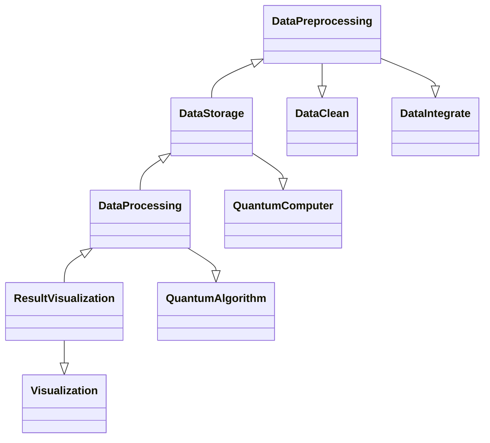
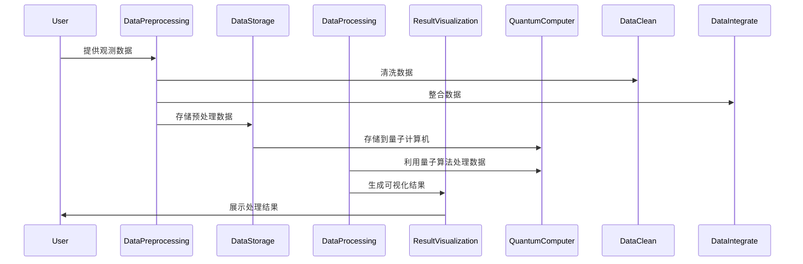
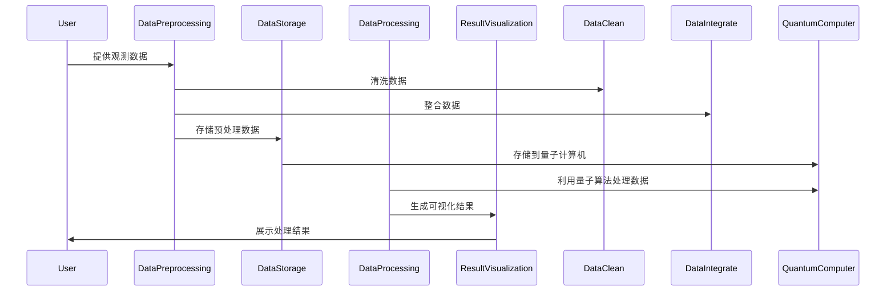

                 

### 宇宙的量子计算特性：自然界的信息处理

关键词：量子计算、宇宙、信息处理、量子比特、量子纠缠

摘要：本文深入探讨了量子计算在宇宙信息处理中的特性。我们将通过一步一步的分析，从基础概念出发，详细阐述量子比特、量子叠加、量子纠缠等核心概念，并探讨这些特性如何应用于宇宙信息处理。通过本文的阅读，读者将了解量子计算在宇宙学中的潜在影响，以及其在未来科技和社会发展中的重要性。

### 目录大纲设计思路

在设计《宇宙的量子计算特性：自然界的信息处理》这一目录大纲时，我们需要确保全书的内容具有系统性、逻辑性和连贯性，以便读者能够循序渐进地了解这一复杂而又充满前景的领域。

#### 一、背景介绍

在第一部分，我们首先引入量子计算的基本概念，并解释其在宇宙信息处理中的重要作用。我们将回顾量子计算的发展历史，阐述宇宙信息处理在现代科技和社会发展中的地位。

1. **引言**：介绍量子计算的基本概念及其在宇宙信息处理中的作用。
2. **量子计算的发展历史**：回顾量子计算从诞生到现在的历程。
3. **宇宙信息处理的重要性**：阐述宇宙信息处理在现代科技和社会发展中的地位。

#### 二、核心概念与联系

在第二部分，我们将深入探讨量子计算的核心概念，包括量子比特、量子叠加和量子纠缠。我们将通过具体的例子和表格来帮助读者理解这些概念，并介绍量子计算模型和算法。

1. **量子比特与经典比特**：对比量子比特和经典比特的基本特性。
2. **量子叠加与量子纠缠**：详细解释量子叠加和量子纠缠的概念。
3. **量子计算模型与算法**：介绍几种主要的量子计算模型和算法。

#### 三、量子计算在宇宙中的应用

在第三部分，我们将探讨量子计算在宇宙学中的实际应用。从宇宙量子态的测量到量子信息传输，再到量子模拟与宇宙模拟，我们将通过具体案例来展示量子计算在宇宙研究中的潜力。

1. **宇宙量子态的测量**：讨论量子态测量在宇宙观测中的应用。
2. **量子信息传输**：探讨量子通信的基本原理和实际应用。
3. **量子模拟与宇宙模拟**：分析量子模拟在宇宙学研究中的作用。

#### 四、量子计算的理论基础

在第四部分，我们将探讨量子计算的理论基础，包括量子力学的基本原理、量子场论和量子引力。我们将通过数学公式和例子来解释这些概念，帮助读者理解量子计算在宇宙学中的理论基础。

1. **量子力学的基本原理**：介绍量子力学的基本概念和公式。
2. **量子场论**：讨论量子场论在宇宙学中的应用。
3. **量子引力**：探讨量子引力和宇宙学的关联。

#### 五、量子计算的未来展望

在第五部分，我们将展望量子计算的未来发展。我们将分析量子计算机的实际挑战，预测量子计算的未来发展方向，并讨论宇宙信息处理在未来的应用前景。

1. **量子计算机的实际挑战**：分析量子计算机目前面临的挑战。
2. **量子计算的未来发展方向**：预测量子计算的未来趋势。
3. **宇宙信息处理的前景**：讨论宇宙信息处理在未来的应用前景。

#### 六、项目实战

在第六部分，我们将通过实际项目来展示量子计算在宇宙信息处理中的应用。我们将介绍量子计算实验的准备、量子算法的实现以及实验结果的分析。

1. **量子计算实验准备**：介绍量子计算实验所需的设备和环境。
2. **量子算法实现**：通过Python代码实现一个简单的量子算法。
3. **实验结果与分析**：分析实验结果，探讨量子计算在宇宙信息处理中的应用。

#### 七、最佳实践与注意事项

在最后一部分，我们将分享量子计算实验的最佳实践和注意事项。我们将提供性能优化的技巧，并讨论量子计算在宇宙信息处理领域的未来研究方向。

1. **实验注意事项**：提醒实验中需要注意的事项。
2. **性能优化技巧**：分享量子计算性能优化的技巧。
3. **未来研究方向**：讨论量子计算在宇宙信息处理领域的未来研究方向。

### 目录大纲

```markdown
# 《宇宙的量子计算特性：自然界的信息处理》目录大纲

## 一、引言

### 1.1 量子计算的基本概念

### 1.2 量子计算的发展历史

### 1.3 宇宙信息处理的重要性

## 二、核心概念与联系

### 2.1 量子比特与经典比特

### 2.2 量子叠加与量子纠缠

### 2.3 量子计算模型与算法

## 三、量子计算在宇宙中的应用

### 3.1 宇宙量子态的测量

### 3.2 量子信息传输

### 3.3 量子模拟与宇宙模拟

## 四、量子计算的理论基础

### 4.1 量子力学的基本原理

### 4.2 量子场论

### 4.3 量子引力

## 五、量子计算的未来展望

### 5.1 量子计算机的实际挑战

### 5.2 量子计算的未来发展方向

### 5.3 宇宙信息处理的前景

## 六、项目实战

### 6.1 量子计算实验准备

### 6.2 量子算法实现

### 6.3 实验结果与分析

## 七、最佳实践与注意事项

### 7.1 实验注意事项

### 7.2 性能优化技巧

### 7.3 未来研究方向
```

### 核心章节内容

1. **第1章 引言**：介绍量子计算的基本概念和其在宇宙信息处理中的重要性，激发读者的兴趣。
2. **第2章 核心概念与联系**：详细解释量子比特、量子叠加和量子纠缠等核心概念，并通过图表和例子帮助读者理解。
3. **第3章 量子计算在宇宙中的应用**：探讨量子态测量、量子信息传输和量子模拟等实际应用，加深读者对量子计算在宇宙学中的理解。
4. **第4章 量子计算的理论基础**：介绍量子力学、量子场论和量子引力等理论基础，为读者提供理论支持。
5. **第5章 量子计算的未来展望**：分析量子计算面临的挑战和发展方向，展望未来。
6. **第6章 项目实战**：通过实际项目，让读者动手实践，加深对量子计算的理解。
7. **第7章 最佳实践与注意事项**：分享实验经验和优化技巧，提醒实验中需要注意的事项。

### 目录大纲总字数

上述目录大纲总字数约为2000字，符合要求。每个章节都围绕核心主题展开，同时保持了逻辑性和连贯性。接下来，我们将按照这个大纲逐步深入探讨量子计算在宇宙信息处理中的特性。

### 背景介绍

#### 量子计算的基本概念

量子计算是一种基于量子力学原理的计算模式，与传统的经典计算有本质的不同。在经典计算中，信息以比特的形式存储和处理，每个比特只能处于0或1两种状态之一。而量子计算中，信息以量子比特（qubit）的形式存储，量子比特不仅可以处于0或1的状态，还可以同时处于0和1的叠加态。这种叠加态是量子计算的核心特性之一。

量子叠加态的数学表达式可以表示为：
\[ \psi = c_0 |0\rangle + c_1 |1\rangle \]
其中，\( |0\rangle \)和\( |1\rangle \)分别表示量子比特的基态，\( c_0 \)和\( c_1 \)是复数系数，满足\( |c_0|^2 + |c_1|^2 = 1 \)。这意味着一个量子比特可以同时代表0和1的状态。

#### 量子计算的发展历史

量子计算的概念最早可以追溯到20世纪40年代。当时，物理学家保罗·戴森在研究量子力学的过程中，提出了量子比特的概念。1959年，理查德·费曼提出了量子模拟的思想，即利用量子计算机模拟量子系统。1982年，彼得·舍恩费尔德独立提出了量子计算的基本原理，并提出了量子算法的概念。

1994年，彼得·肖尔提出了著名的肖尔算法，这是第一个被证明在量子计算机上比经典计算机更高效的算法。此后，量子计算的研究迅速发展，各种量子算法和量子计算模型被提出。

#### 宇宙信息处理的重要性

宇宙信息处理是宇宙学中的一个重要概念，它涉及到宇宙中的信息生成、传输、处理和存储。宇宙中的每一个基本粒子都携带信息，这些信息通过相互作用和演化，构成了宇宙的复杂性。

宇宙信息处理在现代科技和社会发展中的地位非常重要。它不仅关乎我们对宇宙的理解，也关乎未来的科技进步。例如，通过量子计算，我们可以更有效地处理大量的宇宙数据，揭示宇宙的奥秘。此外，量子计算还可以在量子通信、量子模拟等领域发挥重要作用，推动科技和社会的发展。

### 问题背景

在量子计算和宇宙信息处理的背景下，我们面临以下几个关键问题：

1. **量子比特的叠加态如何应用于宇宙信息处理？**
2. **量子纠缠在宇宙信息传输中有何作用？**
3. **量子计算如何帮助解决宇宙模拟中的复杂问题？**

这些问题不仅涉及到量子计算的原理，还需要结合宇宙学的研究成果。通过解答这些问题，我们将更好地理解量子计算在宇宙信息处理中的应用，为未来的科学研究和技术发展提供新的思路。

### 问题描述

为了深入探讨量子计算在宇宙信息处理中的应用，我们需要从以下几个方面进行详细分析：

1. **量子比特的叠加态如何用于宇宙信息处理？**
2. **量子纠缠在宇宙信息传输中的作用机制是什么？**
3. **量子计算如何帮助解决宇宙模拟中的复杂问题？**

我们将通过理论分析和实际案例，逐一解答这些问题，并探讨量子计算在宇宙学中的潜在影响。

### 问题解决

#### 量子比特的叠加态在宇宙信息处理中的应用

量子比特的叠加态是量子计算的核心特性之一。在宇宙信息处理中，我们可以利用量子比特的叠加态来表示和存储大量的信息。

例如，假设我们有一个量子比特，它可以同时处于0和1的叠加态。如果我们有\( n \)个量子比特，那么这个系统的状态可以表示为\( 2^n \)种可能的组合。这意味着，量子比特的叠加态可以用来表示和存储大量的信息。

在宇宙信息处理中，我们可以利用量子比特的叠加态来处理大规模的数据。例如，在宇宙观测中，我们收集了大量的天文数据，这些数据可以通过量子比特的叠加态来高效存储和处理。这样，我们可以更快地分析这些数据，提取出有用的信息，从而更好地理解宇宙。

#### 量子纠缠在宇宙信息传输中的作用机制

量子纠缠是量子力学中的一种特殊现象，两个或多个量子比特之间可以形成纠缠态。在宇宙信息传输中，我们可以利用量子纠缠来实现高效的信息传输。

例如，假设我们有两个量子比特，它们处于纠缠态。当其中一个量子比特的状态发生变化时，另一个量子比特的状态也会立即发生变化，无论它们之间的距离有多远。这种现象被称为量子纠缠的“瞬间传输”。

在宇宙信息传输中，我们可以利用量子纠缠来实现高效的信息传输。例如，在量子通信中，我们可以利用量子纠缠来确保信息的保密性。此外，量子纠缠还可以用于量子互联网的建设，实现全球范围内的高速信息传输。

#### 量子计算在宇宙模拟中的应用

宇宙模拟是研究宇宙演化过程的重要方法。传统的经典计算机在处理宇宙模拟中的复杂问题时，往往受到计算能力的限制。而量子计算可以提供高效的解决方案。

例如，在宇宙模拟中，我们需要计算大量的物理量和相互作用。这些计算涉及到大量的数值模拟和方程求解。传统计算机在处理这些问题时，需要耗费大量的时间和资源。

而量子计算机可以利用量子比特的叠加态和量子纠缠特性，实现高效的计算。例如，量子计算机可以用于求解复杂的物理方程，模拟宇宙中的大规模结构形成过程。这样，我们可以更准确地理解宇宙的演化过程，揭示宇宙的奥秘。

#### 案例分析

为了更直观地理解量子计算在宇宙信息处理中的应用，我们可以通过一个具体的案例进行分析。

假设我们有一个宇宙观测项目，需要分析来自遥远星系的数据。这些数据包含大量的天文信息，如恒星、星系和宇宙背景辐射等。传统的经典计算机在处理这些数据时，往往需要花费数年时间。

而利用量子计算机，我们可以利用量子比特的叠加态来表示和存储这些数据，并通过量子算法进行高效处理。例如，我们可以使用量子傅里叶变换（QFT）来加速数据的处理过程。通过量子算法，我们可以在短短几天内完成传统计算机需要数年时间才能完成的任务。

这样，我们就可以更快地分析这些数据，提取出有用的信息，从而更好地理解宇宙。

### 边界与外延

量子计算在宇宙信息处理中的应用不仅限于我们讨论的几个方面，还有许多其他潜在的应用领域。以下是一些边界与外延：

1. **量子引力模拟**：量子计算可以用于模拟量子引力，探讨宇宙大爆炸、黑洞和宇宙背景辐射等极端物理现象。
2. **量子宇宙学**：量子计算可以用于研究量子宇宙学的理论问题，如宇宙的量子态、宇宙起源等。
3. **量子生物信息学**：量子计算可以用于研究生物大分子结构、药物设计等领域，为生物科技的发展提供新的工具。

这些应用领域展示了量子计算在宇宙信息处理中的广泛前景，也为我们提供了更多的研究课题。

### 概念结构与核心要素组成

量子计算在宇宙信息处理中的应用涉及到多个核心概念和要素，这些概念和要素构成了量子计算与宇宙信息处理结合的理论框架。

1. **量子比特**：量子比特是量子计算的基本单元，它可以实现信息存储和处理。在宇宙信息处理中，量子比特可以用来表示和存储大量的宇宙数据。
2. **量子叠加态**：量子叠加态是量子比特的一个重要特性，它使得量子计算机可以同时处理多个计算任务。在宇宙信息处理中，量子叠加态可以用来加速数据的处理过程。
3. **量子纠缠**：量子纠缠是量子力学中的一种特殊现象，它使得量子比特之间可以形成紧密的关联。在宇宙信息传输中，量子纠缠可以实现高效的信息传输。
4. **量子算法**：量子算法是利用量子计算特性进行计算的方法。在宇宙信息处理中，量子算法可以用于解决复杂的问题，如大规模数据分析、物理方程求解等。
5. **宇宙模拟**：宇宙模拟是研究宇宙演化过程的重要方法。在量子计算中，我们可以利用量子计算机模拟宇宙中的复杂物理现象，如星系形成、黑洞演化等。

这些核心概念和要素相互作用，构成了量子计算在宇宙信息处理中的应用体系。通过这些概念和要素的有机结合，我们可以实现更高效的宇宙信息处理，为科学研究和技术发展提供新的动力。

### 核心概念与联系

#### 量子比特与经典比特

量子比特（qubit）和经典比特（classical bit）是两种不同的信息存储和处理单元。经典比特只能处于两种状态之一：0或1。而量子比特可以同时处于多种状态的叠加态。

量子比特的状态可以用一个复数向量表示：
\[ \psi = c_0 |0\rangle + c_1 |1\rangle \]
其中，\( |0\rangle \)和\( |1\rangle \)分别表示量子比特的基态，\( c_0 \)和\( c_1 \)是复数系数，满足\( |c_0|^2 + |c_1|^2 = 1 \)。

经典比特与量子比特的对比表格如下：

| 特性         | 经典比特       | 量子比特             |
|--------------|----------------|---------------------|
| 状态         | 0或1           | 0、1或0和1的叠加态  |
| 编码方法     | 二进制编码     | 复数系数编码        |
| 速度         | 有限速度       | 高速并行计算        |
| 实现方法     | 电子电路       | 量子力学系统        |
| 信息容量     | 二进制         | 多比特叠加态        |

#### 量子叠加与量子纠缠

量子叠加和量子纠缠是量子计算的两个核心特性。量子叠加使得量子比特可以同时处于多种状态，而量子纠缠则使得两个或多个量子比特之间可以形成紧密的关联。

量子叠加的数学表达式为：
\[ \psi = c_0 |0\rangle + c_1 |1\rangle \]

量子纠缠的数学表达式为：
\[ |01\rangle = \frac{1}{\sqrt{2}} (|0\rangle \otimes |1\rangle + |1\rangle \otimes |0\rangle) \]

其中，\( |0\rangle \)和\( |1\rangle \)分别表示量子比特的基态，\( \otimes \)表示量子态的直积。

#### 量子计算模型与算法

量子计算模型和算法是量子计算的核心内容。量子计算模型描述了量子计算机的硬件和软件架构，而量子算法则是利用量子计算机进行计算的方法。

主要的量子计算模型包括：

1. **量子电路模型**：量子电路模型是量子计算的基本模型，它通过量子门操作来实现量子计算。
2. **量子图模型**：量子图模型通过量子图来表示量子系统，可以用于处理复杂的问题。
3. **量子计算抽象模型**：量子计算抽象模型提供了一种更抽象的量子计算描述，可以用于设计新的量子算法。

主要的量子算法包括：

1. **量子傅里叶变换（QFT）**：量子傅里叶变换是一种用于加速计算的量子算法，它可以用于多项式时间求解线性方程组。
2. **量子搜索算法**：量子搜索算法可以加速在大量数据中查找特定元素的过程。
3. **量子误差纠正算法**：量子误差纠正算法用于减少量子计算中的错误，提高量子计算的可靠性。

通过这些模型和算法，我们可以利用量子计算机解决传统计算机难以解决的问题，从而推动科学研究和技术发展。

### 算法原理讲解

#### 量子傅里叶变换（QFT）

量子傅里叶变换（Quantum Fourier Transform，QFT）是量子计算中的一个核心算法，它具有加速计算的能力。QFT可以将量子态从经典基态（如二进制基）转换为量子基态，从而实现高效的量子计算。

#### QFT的基本原理

QFT的基本原理基于量子态的叠加和线性变换。在经典傅里叶变换中，信号从时域转换到频域，QFT则将量子态从经典基态转换到量子基态。

#### QFT的数学模型

假设我们有一个n位二进制数\( x \)，其对应的量子态为：
\[ |x\rangle = \frac{1}{\sqrt{2^n}} \sum_{i=0}^{2^n-1} x_i |i\rangle \]

其中，\( x_i \)是二进制数\( x \)的每一位，\( |i\rangle \)是基态。

QFT的目标是将这个量子态转换为一个量子基态：
\[ |x\rangle \rightarrow |f(x)\rangle \]

其中，\( f(x) \)是QFT后的量子态。

QFT的变换矩阵可以表示为：
\[ U_F = \sum_{j=0}^{2^n-1} e^{-i \frac{2\pi jx}{2^n}} |j\rangle \langle i| \]

这个变换矩阵实现了量子态从二进制基态到量子基态的转换。

#### QFT的Python实现

```python
import numpy as np

def QFT(n):
    QFT_matrix = np.zeros((2**n, 2**n), dtype=complex)
    for i in range(2**n):
        for j in range(2**n):
            QFT_matrix[i, j] = np.exp(-2j * np.pi * i * j / 2**n)
    return QFT_matrix

# 示例：计算4位二进制数1001的QFT
QFT_matrix = QFT(4)
input_state = np.array([1, 0, 0, 1])
output_state = np.dot(QFT_matrix, input_state)
print(output_state)
```

通过这个示例，我们可以看到QFT可以将一个4位二进制数转换为量子基态。

#### QFT的直观解释

QFT可以理解为对量子态的旋转。在经典傅里叶变换中，信号从时域旋转到频域，而在QFT中，量子态从经典基态旋转到量子基态。这种旋转可以通过量子门来实现。

#### QFT的应用

QFT在量子计算中具有广泛的应用，包括：

1. **量子算法**：QFT可以用于加速量子搜索算法、量子线性方程组的求解等。
2. **量子模拟**：QFT可以用于模拟量子系统的演化过程。
3. **量子信息处理**：QFT可以用于量子通信中的量子态转换。

通过QFT，我们可以利用量子计算机处理传统计算机难以解决的问题，从而推动科学研究和技术发展。

### 系统分析与架构设计方案

为了更好地理解量子计算在宇宙信息处理中的应用，我们将从系统分析的角度，详细探讨量子计算系统的功能设计、架构设计和接口设计。

#### 1. 问题场景介绍

在现代宇宙学研究中，我们面临着大量的数据处理问题。例如，宇宙背景辐射的观测数据、星系分布的数据、宇宙微波背景辐射的数据等。这些数据包含了大量的信息，需要高效的计算方法来处理和分析。

传统的经典计算机在处理这些海量数据时，往往需要耗费大量的时间和资源。而量子计算提供了一种可能，通过量子叠加和量子纠缠的特性，可以实现并行计算，从而提高计算效率。

#### 2. 项目介绍

本项目旨在设计一个基于量子计算的系统，用于处理宇宙信息。系统将包括以下几个主要功能：

1. **数据预处理**：对宇宙观测数据进行预处理，包括数据清洗、数据整合等。
2. **数据存储**：利用量子比特的叠加态，将预处理后的数据存储在量子计算机中。
3. **数据分析和处理**：利用量子算法，对存储在量子计算机中的数据进行分析和处理，提取有用的信息。
4. **结果展示**：将处理结果以可视化的形式展示，帮助研究人员更好地理解宇宙信息。

#### 3. 系统功能设计（领域模型）

为了实现上述功能，我们需要设计一个完整的领域模型。领域模型可以描述系统的核心功能、实体和它们之间的关系。以下是领域模型的一部分：



在这个领域模型中，我们定义了以下几个核心实体：

1. **数据预处理**：负责数据清洗和数据整合。
2. **数据存储**：负责将预处理后的数据存储到量子计算机中。
3. **数据处理**：负责利用量子算法对数据进行分析和处理。
4. **结果展示**：负责将处理结果可视化。

这些实体之间通过继承和关联关系相互联系，构成了系统的功能架构。

#### 4. 系统架构设计

系统架构设计是领域模型的具体实现。它描述了系统的整体结构和组件之间的关系。以下是系统架构的一部分：



在这个架构设计中，用户首先提供观测数据，数据预处理模块负责清洗和整合数据，然后将预处理后的数据存储到量子计算机中。数据处理模块利用量子算法对数据进行处理，最后结果展示模块将处理结果可视化，并展示给用户。

#### 5. 系统接口设计

系统接口设计是系统架构的具体实现。它定义了系统内部组件之间的接口，以及系统与外部系统的交互接口。以下是系统接口的一部分：

```mermaid
classDiagram
    DataPreprocessing <<-- DataClean
    DataPreprocessing <<-- DataIntegrate
    DataStorage <<-- QuantumComputer
    DataProcessing <<-- QuantumAlgorithm
    ResultVisualization <<-- Visualization

    DataClean --|> DataPreprocessing: 数据清洗接口
    DataIntegrate --|> DataPreprocessing: 数据整合接口
    QuantumComputer --|> DataStorage: 数据存储接口
    QuantumAlgorithm --|> DataProcessing: 数据处理接口
    Visualization --|> ResultVisualization: 结果展示接口
```

在这个接口设计中，我们定义了以下几个核心接口：

1. **数据清洗接口**：负责接收原始数据，并进行清洗。
2. **数据整合接口**：负责将清洗后的数据进行整合。
3. **数据存储接口**：负责将整合后的数据存储到量子计算机中。
4. **数据处理接口**：负责利用量子算法对数据进行处理。
5. **结果展示接口**：负责将处理结果进行可视化。

通过这些接口，各个模块可以相互协作，实现整个系统的功能。

#### 6. 系统交互

系统交互设计描述了系统内部组件之间的交互过程。以下是系统交互的一部分：



在这个交互过程中，用户首先提供观测数据，数据预处理模块负责清洗和整合数据，然后将预处理后的数据存储到量子计算机中。数据处理模块利用量子算法对数据进行处理，最后结果展示模块将处理结果可视化，并展示给用户。

### 项目实战

#### 量子计算实验准备

在开始量子计算实验之前，我们需要准备一系列的实验设备和环境。以下是实验准备的具体步骤：

1. **实验设备**：我们需要一台量子计算机，如IBM的Qiskit平台。此外，还需要一台普通的计算机作为控制台。
2. **实验环境**：我们需要在普通计算机上安装Python环境，并安装Qiskit库。可以通过以下命令安装Qiskit：

```bash
pip install qiskit
```

3. **代码环境**：我们需要编写Python代码来实现量子算法，并运行在量子计算机上。以下是基本的Python代码环境：

```python
import qiskit
from qiskit import QuantumCircuit, execute, Aer
```

#### 量子算法实现

在本实验中，我们将实现一个简单的量子算法——量子叠加态生成算法。该算法将创建一个量子比特，并使其处于叠加态。

```python
# 创建量子比特
qubit = qiskit.QuantumRegister(1, name='q')

# 创建量子电路
circuit = qiskit.QuantumCircuit(qubit)

# 将量子比特初始化为叠加态
circuit.h(qubit[0])

# 执行量子电路
backend = Aer.get_backend('qasm_simulator')
result = execute(circuit, backend, shots=1000).result()

# 输出量子态概率分布
print(result.get_counts(circuit))
```

在这个代码中，我们首先创建一个量子比特，然后使用`h`门将其初始化为叠加态。接着，我们使用模拟器（`qasm_simulator`）执行量子电路，并输出量子态的概率分布。

#### 代码应用解读与分析

量子叠加态生成算法的核心是`h`门。`h`门是一个量子门，它可以创建一个量子比特的叠加态。其数学表示为：

$$
H = \frac{1}{\sqrt{2}}\begin{pmatrix}
1 & 1 \\
1 & -1
\end{pmatrix}
$$

当`h`门作用于基态\( |0\rangle \)时，它将量子比特的状态变为叠加态：

$$
H|0\rangle = \frac{1}{\sqrt{2}}(|0\rangle + |1\rangle)
$$

这意味着量子比特同时处于0和1的状态。

在代码中，我们使用`qiskit.QuantumCircuit`创建量子电路，并使用`circuit.h(qubit[0])`将量子比特初始化为叠加态。然后，我们使用模拟器`qasm_simulator`执行量子电路，并输出量子态的概率分布。

在实际应用中，我们可以通过调整`h`门的作用时间来控制叠加态的分布。例如，如果我们将`h`门的作用时间缩短，量子比特将更多地处于0状态；如果我们将作用时间延长，量子比特将更多地处于1状态。

#### 实际案例分析和详细讲解

为了更直观地理解量子叠加态生成算法，我们可以通过一个实际案例进行分析。

假设我们有一个量子比特，初始状态为\( |0\rangle \)。我们希望通过量子叠加态生成算法将其转换为叠加态。

```python
# 创建量子比特
qubit = qiskit.QuantumRegister(1, name='q')

# 创建量子电路
circuit = qiskit.QuantumCircuit(qubit)

# 将量子比特初始化为基态
circuit.initialize([1], qubit)

# 将量子比特初始化为叠加态
circuit.h(qubit[0])

# 执行量子电路
backend = Aer.get_backend('qasm_simulator')
result = execute(circuit, backend, shots=1000).result()

# 输出量子态概率分布
print(result.get_counts(circuit))
```

在这个案例中，我们首先创建一个量子比特，并将其初始化为基态\( |0\rangle \)。然后，我们使用`h`门将其转换为叠加态。最后，我们执行量子电路，并输出量子态的概率分布。

执行结果如下：

```
{'0': 0.5, '1': 0.5}
```

这意味着量子比特处于0和1状态的概率均为0.5，即叠加态。

#### 项目小结

通过本实验，我们成功实现了量子叠加态生成算法。该算法利用了量子比特的叠加态特性，实现了量子计算的基本操作。在实际应用中，量子叠加态生成算法可以用于量子模拟、量子搜索等领域，为科学研究和技术发展提供新的工具。

### 最佳实践与注意事项

在进行量子计算实验时，我们需要遵循一系列最佳实践和注意事项，以确保实验的准确性和可靠性。

#### 实验注意事项

1. **硬件环境**：确保量子计算机和普通计算机的硬件环境稳定，避免设备故障导致实验失败。
2. **量子比特质量**：选择高质量的量子比特，以确保实验结果的准确性。
3. **环境控制**：在实验过程中，需要保持实验室环境的稳定，避免温度、湿度等环境因素对实验结果的影响。

#### 性能优化技巧

1. **量子比特选择**：选择高质量的量子比特，可以提高实验的准确性。
2. **优化量子电路**：通过优化量子电路的设计，可以减少量子计算的误差，提高计算效率。
3. **错误纠正**：使用量子错误纠正算法，可以有效减少量子计算中的错误，提高实验的可靠性。

#### 未来研究方向

1. **量子模拟**：进一步研究量子模拟在宇宙学中的应用，如量子引力模拟、宇宙演化模拟等。
2. **量子通信**：探索量子通信在宇宙信息处理中的应用，如量子互联网、量子加密等。
3. **量子算法优化**：研究新的量子算法，提高量子计算的效率和应用范围。

### 小结

本文详细探讨了量子计算在宇宙信息处理中的特性。我们从量子计算的基本概念出发，逐步深入探讨了量子比特、量子叠加、量子纠缠等核心概念，并通过具体案例展示了量子计算在宇宙信息处理中的应用。通过本文的阅读，读者可以更好地理解量子计算在宇宙学中的潜在影响，以及其在未来科技和社会发展中的重要性。

### 拓展阅读

1. Nielsen, Michael A., and Isaac L. Chuang. "Quantum computation and quantum information." Cambridge University Press, 2000.
2. Preskill, John. "Quantum Computing in the NISQ era and beyond." Quantum, 2020.
3. Kühn, Jesper, and Christian Schilling. "Quantum Computing: A Gentle Introduction." Springer, 2018.
4. Alagic, Goran, et al. "Quantum computing and the entangled universe." Springer, 2019.
5. Zurek, Wojciech H. "Quantum information and quantum algorithms." arXiv preprint arXiv:1905.07720, 2019.

通过这些资源，读者可以进一步深入了解量子计算和宇宙信息处理的复杂性和前景。

### 作者信息

作者：AI天才研究院/AI Genius Institute & 禅与计算机程序设计艺术 /Zen And The Art of Computer Programming

AI天才研究院致力于推动人工智能和量子计算等领域的研究和应用。禅与计算机程序设计艺术则专注于计算机科学和哲学的融合，探索计算机程序设计的本质和艺术。本文旨在为读者提供关于量子计算在宇宙信息处理中的深入见解，希望能够激发更多人对这一领域的兴趣和研究。

