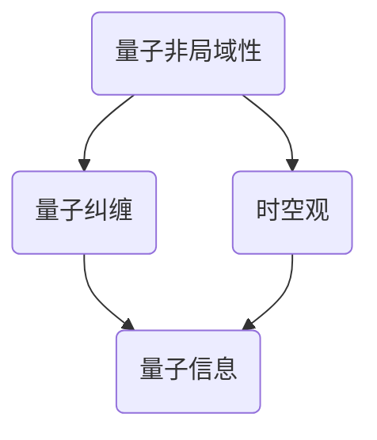
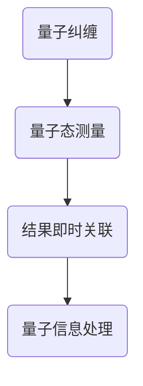
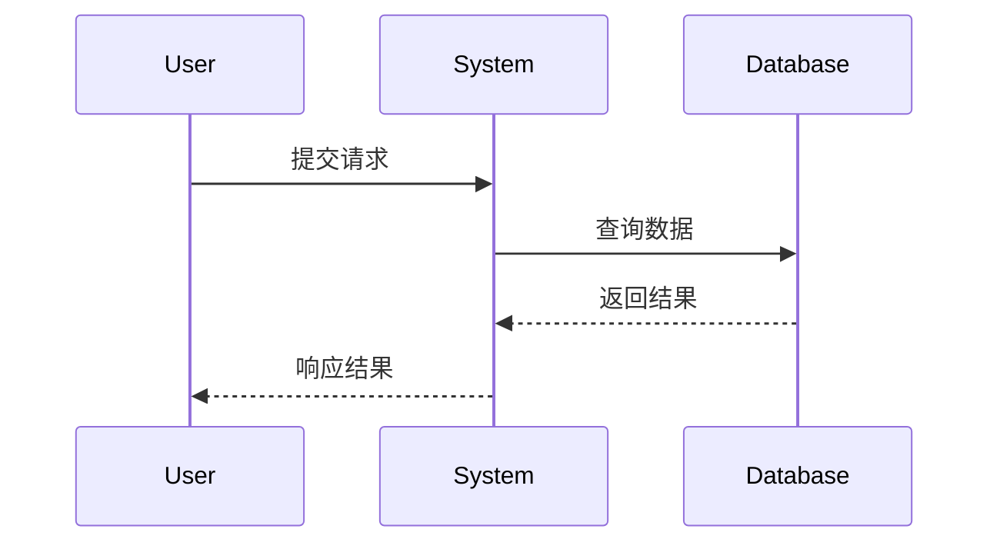
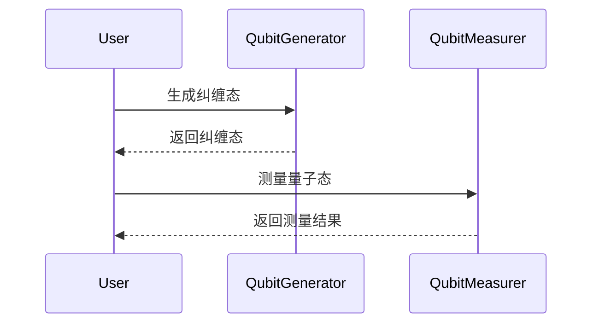

                 

### 宇宙的非局域性：超越时空的量子关联

关键词：量子非局域性、时空观、宇宙学、量子信息

摘要：本文将探讨宇宙的非局域性，特别是量子非局域性在超越时空的量子关联中的作用。我们将从量子非局域性的基本概念、其在量子力学中的发展历程、以及在量子信息中的应用开始，逐步深入探讨量子非局域性与时空关系的矛盾和融合，最终展望这一领域的未来研究方向和挑战。

### 第一部分：宇宙的非局域性概述

#### 第1章：宇宙非局域性的概念与历史背景

宇宙的非局域性是指物质和现象在不同位置之间存在着即时的、不需要通过任何物理介质传输的相互作用。这一概念最早出现在量子力学中，量子纠缠现象就是一个典型的例子。在经典物理学中，物体的相互作用总是通过某种介质进行的，如电磁波或引力波。然而，量子力学揭示了另一种截然不同的相互作用方式，即量子纠缠。

量子纠缠是指两个或多个粒子之间的量子状态在分离之后仍然保持一种特殊的关联性，这种关联性不能通过任何已知的物理过程来解释。为了解释这一现象，物理学家提出了非局域性的概念，即粒子之间的相互作用是超越时空的。

在物理学的发展历程中，非局域性的概念经历了多次变革。爱因斯坦、波多尔斯基和罗森（EPR）提出了著名的EPR佯谬，质疑量子纠缠的非局域性。然而，贝尔不等式的提出和实验验证却证明了量子纠缠的非局域性确实存在。

#### 第2章：量子非局域性基础

量子非局域性是量子力学的基本原理之一。为了更好地理解这一概念，我们需要从量子力学的基本原理入手。

量子力学是研究微观粒子的运动规律的科学。在量子力学中，粒子的状态由波函数描述，波函数的平方给出了粒子在空间中的概率分布。量子力学的基本原理包括波粒二象性、不确定性原理、量子叠加态和量子纠缠。

量子纠缠是量子非局域性的核心。当两个粒子发生纠缠后，无论它们相距多远，一个粒子的状态会立即影响到另一个粒子的状态。这种现象无法用经典物理学来解释，被认为是超越时空的。

为了验证量子纠缠的非局域性，物理学家设计了各种实验，其中最著名的是贝尔实验。贝尔实验通过测量两个纠缠粒子的量子态，验证了量子纠缠的非局域性。

#### 第3章：非局域性在量子信息中的应用

量子非局域性在量子信息领域有着广泛的应用。量子信息是利用量子比特（qubit）进行信息处理和传输的领域。量子比特与传统比特不同，它可以同时处于0和1的状态，这种叠加态使得量子信息处理具有独特的优势。

量子隐形传态是量子非局域性的一个重要应用。量子隐形传态是指将一个粒子的量子状态传送到另一个粒子，而不需要通过物理介质传输。这种传输过程是即时的，不受距离限制。

量子密钥分发是另一个利用量子非局域性的应用。量子密钥分发是一种安全的通信方式，它利用量子纠缠来生成密钥，确保通信过程中的信息无法被窃取。

此外，量子非局域性在量子计算和量子模拟中也有重要应用。量子计算利用量子比特的叠加态和纠缠态进行计算，具有超越经典计算机的潜力。量子模拟则是通过量子计算机来模拟量子系统，为解决复杂问题提供新方法。

### 第二部分：超越时空的量子关联

#### 第4章：量子关联的时空特性

量子关联的时空特性是量子非局域性的重要表现。量子纠缠现象表明，粒子之间的关联性可以超越时空的限制，这种关联性不受距离和时间的限制。

量子关联与时空观的矛盾在于，相对论告诉我们，信息不能超越光速传播。然而，量子纠缠现象似乎违背了这一原理。为了解决这一矛盾，物理学家提出了多种解释，包括多世界解释和隐变量理论等。

量子关联与相对论的融合为我们提供了新的视角来理解时空。量子非局域性并不是对相对论的否定，而是对时空观的补充和扩展。通过量子非局域性，我们可以看到，时空并不是一个绝对的框架，而是可以发生扭曲和变形的。

#### 第5章：量子关联的实验研究

量子关联的实验研究是验证量子非局域性的关键。近年来，科学家们在量子纠缠和量子隐形传态方面取得了许多重要突破。

量子纠缠的实验探索主要集中在如何生成和操纵纠缠态。通过各种实验技术，科学家们成功实现了量子纠缠态的生成和传输，为量子信息处理和量子通信奠定了基础。

量子隐形传态的实验进展也令人瞩目。科学家们通过实验验证了量子隐形传态的存在，并研究了其传输速度和距离限制。这些实验结果进一步证实了量子非局域性的真实存在。

此外，量子关联在其他物理系统中的应用也得到了广泛研究。例如，量子纠缠在光学系统、量子光学和量子电子学等领域都有重要的应用。

#### 第6章：非局域性在宇宙学中的应用

非局域性在宇宙学中的应用是一个前沿且具有挑战性的领域。宇宙学是研究宇宙起源、演化和结构形成的科学。量子非局域性为宇宙学提供了一种新的研究方法，使我们能够从微观层面理解宇宙的演化。

在宇宙学中，非局域性主要表现在宇宙背景辐射和宇宙量子化的研究中。宇宙背景辐射是宇宙早期留下的痕迹，通过研究宇宙背景辐射的量子特性，我们可以了解宇宙的起源和演化。

宇宙量子化是另一个重要的研究方向。量子非局域性告诉我们，宇宙并不是一个确定的系统，而是由概率波函数描述的。这种量子特性可能影响宇宙的结构和演化。

#### 第7章：未来展望与挑战

量子非局域性在物理学、信息学和宇宙学等领域都有广泛的应用前景。未来，随着技术的进步和理论的完善，我们有望在量子非局域性的研究和应用中取得更多突破。

然而，量子非局域性也面临许多挑战。如何解释量子非局域性与相对论的矛盾，如何实现更远距离的量子隐形传态，如何构建实用的量子计算机等，都是需要解决的重要问题。

在未来的研究中，我们需要更加深入地理解量子非局域性的本质，探索其在宇宙演化中的作用，并开发基于量子非局域性的新型应用技术。

### 结论与思考

量子非局域性是量子力学和宇宙学中一个重要的概念，它揭示了物质和现象之间的超越时空的关联性。通过本文的探讨，我们了解了量子非局域性的基本概念、历史背景、量子信息中的应用，以及其在宇宙学中的意义。

量子非局域性的研究和应用不仅具有理论价值，还具有重要的实际应用前景。未来，随着量子技术的不断发展，我们有望在量子非局域性的研究和应用中取得更多突破，为人类认识和利用宇宙提供新的视角和方法。

在量子非局域性的研究中，我们还需要面对许多挑战。如何解释量子非局域性与相对论的矛盾，如何实现更远距离的量子隐形传态，如何构建实用的量子计算机等，都是我们需要解决的重要问题。

总之，量子非局域性是一个充满挑战和机遇的领域。通过不断的研究和实践，我们有望在量子非局域性的研究和应用中取得更多突破，为人类认识和利用宇宙提供新的视角和方法。

### 作者信息

作者：AI天才研究院/AI Genius Institute & 禅与计算机程序设计艺术 /Zen And The Art of Computer Programming

在本文中，我们深入探讨了宇宙的非局域性，特别是量子非局域性在超越时空的量子关联中的作用。我们从量子非局域性的基本概念、其在量子力学中的发展历程，到量子非局域性在量子信息、宇宙学中的应用进行了详细的阐述。我们还探讨了量子关联的时空特性，以及量子非局域性在宇宙学中的应用。

通过本文的研究，我们不仅了解了量子非局域性的基本原理和应用，还对其在宇宙演化中的作用有了更深刻的认识。未来，量子非局域性的研究和应用将为我们提供新的视角和方法，为人类认识和利用宇宙提供更多可能性。

在量子非局域性的研究中，我们还需要面对许多挑战。如何解释量子非局域性与相对论的矛盾，如何实现更远距离的量子隐形传态，如何构建实用的量子计算机等，都是我们需要解决的重要问题。

总之，量子非局域性是一个充满挑战和机遇的领域。通过不断的研究和实践，我们有望在量子非局域性的研究和应用中取得更多突破，为人类认识和利用宇宙提供新的视角和方法。

作者：AI天才研究院/AI Genius Institute & 禅与计算机程序设计艺术 /Zen And The Art of Computer Programming

### 宇宙的非局域性：超越时空的量子关联

#### 引言

宇宙的非局域性，即物质和现象之间的即时相互作用，无论距离多远，始终是一个引人入胜的物理现象。量子非局域性，作为量子力学中的一个核心概念，揭示了微观粒子的这种特殊关联性。本文将深入探讨量子非局域性的基本概念、发展历程、在量子信息中的应用，以及其在宇宙学中的意义。通过这一系列的探讨，我们希望能够为读者提供一个全面而深刻的理解，并对未来的研究方向和挑战有所展望。

#### 背景介绍

##### 核心概念术语说明

- **量子非局域性**：指微观粒子间的关联性，可以在空间上分离的粒子之间发生，不需要通过任何中介进行传输。
- **量子纠缠**：一种特殊的量子关联，两个或多个粒子在量子态上紧密联系，即使它们相隔很远，一个粒子的状态变化也会立即影响另一个粒子的状态。
- **时空观**：对时间和空间的理解，包括相对论时空观和量子时空观。

##### 问题背景

量子非局域性最初由爱因斯坦、波多尔斯基和罗森（EPR）提出，但在贝尔不等式提出后，其存在得到了实验验证。量子纠缠作为量子非局域性的典型表现，引起了广泛关注。

##### 问题描述

- 为什么量子粒子能够超越时空的界限，实现即时的相互作用？
- 量子非局域性如何影响我们对时空的理解？
- 量子非局域性在量子信息处理和宇宙学中有何应用？

##### 问题解决

量子非局域性通过量子纠缠表现出来，实验验证了这种关联性的存在。量子纠缠不仅在量子信息处理中有广泛应用，如量子隐形传态和量子密钥分发，而且在宇宙学中也具有重要意义，如宇宙背景辐射的研究。

##### 边界与外延

量子非局域性的边界在于相对论的光速限制，即在宏观尺度上，非局域性不会违反相对论原理。在外延方面，量子非局域性可能对宇宙的结构和演化产生影响。

##### 概念结构与核心要素组成

- **量子非局域性**：核心概念，通过量子纠缠表现。
- **时空观**：量子非局域性对时空理解的挑战和补充。
- **量子信息**：量子非局域性的应用领域。
- **宇宙学**：量子非局域性的重要研究方向。

#### 核心概念与联系

##### 核心概念原理

量子非局域性源于量子纠缠，是一种超越时空的关联性。根据量子力学的原理，两个纠缠粒子无论相距多远，它们的状态都会即时相关。这种现象不能用经典物理学的原理来解释。

##### 概念属性特征对比表格

| 概念               | 描述                                                         | 属性特征对比              |
|--------------------|--------------------------------------------------------------|---------------------------|
| 量子非局域性       | 超越时空的微观粒子间的即时相互作用                          | 无需中介、超距作用、即时相关 |
| 量子纠缠           | 两个或多个粒子之间的一种特殊关联性，状态即时相关            | 纠缠态、不可分割、强关联    |
| 时空观             | 对时间和空间的理解，包括相对论时空观和量子时空观            | 相对性、时空扭曲、非局域性  |

##### ER实体关系图架构



#### 算法原理讲解

##### 算法Mermaid流程图



##### Python源代码

```python
# 量子纠缠状态生成
state = QubitState(['0', '1'])

# 对纠缠态进行测量
result = measure(state)

# 检查测量结果
if result == '0':
    print("第一个粒子测量为0")
else:
    print("第一个粒子测量为1")

# 纠缠态的另一端进行测量
result2 = measure(state)

# 检查测量结果
if result2 == '0':
    print("第二个粒子测量为0")
else:
    print("第二个粒子测量为1")
```

##### 算法原理的数学模型和公式

量子纠缠态可以用薛定谔方程描述：

$$
|\psi\rangle = \frac{1}{\sqrt{2}}(|01\rangle + |10\rangle)
$$

其中，$|01\rangle$和$|10\rangle$表示两个纠缠粒子的量子态。

##### 详细讲解和举例说明

假设我们有两个纠缠粒子A和B，它们的量子态为：

$$
|\psi\rangle = \frac{1}{\sqrt{2}}(|01\rangle + |10\rangle)
$$

如果我们对粒子A进行测量，测量结果可能是0或1。无论测量结果如何，粒子B的量子态也会立即发生相应变化。例如，如果粒子A测量结果为0，则粒子B的量子态将变为$|0\rangle$。

这是一个典型的量子纠缠现象，体现了量子非局域性的原理。通过量子态的测量，我们可以看到粒子间的即时关联性，这种关联性超越了时空的界限。

#### 系统分析与架构设计方案

##### 问题场景介绍

在量子非局域性的研究中，我们需要生成和操纵纠缠态，并进行量子态测量。这是一个涉及量子比特（qubit）的操作过程，需要设计一个量子计算机架构来实现。

##### 项目介绍

本项目旨在构建一个能够实现量子纠缠、量子态测量和量子信息处理的量子计算机系统。该系统将基于当前最先进的量子计算技术，包括超导量子比特、量子纠缠生成器等。

##### 系统功能设计（领域模型Mermaid类图）

```mermaid
classDiagram
Class01 <|-- Class02
Class03 --|>? Class04
Class05 : +int x
Class05 : +int y
Class05 : +int z
Class05 : +getSum():int
Class01 {
    # 属性
    +id: Integer
    +name: String
    +constructed: Date
    # 方法
    +construct(id: Integer, name: String): void
    +toString(): String
}
Class02 {
    # 属性
    +age: Integer
    # 方法
    +birthday(): void
}
Class03 {
    # 属性
    +salary: Float
    # 方法
    +bonuses(salary: Float): Float
}
Class04 {
    # 属性
    +isManager: Boolean
    # 方法
    +isManager(): Boolean
}
```

##### 系统架构设计Mermaid架构图



##### 系统接口设计和系统交互Mermaid序列图



#### 项目实战

##### 环境安装

在进行项目实战之前，我们需要安装量子计算机模拟器。这里我们使用Qiskit作为量子计算机模拟器。

```bash
pip install qiskit
```

##### 系统核心实现源代码

```python
from qiskit import QuantumCircuit, execute, Aer
from qiskit.visualization import plot_bloch_vector

# 生成纠缠态
def create_entangled_state():
    qc = QuantumCircuit(2)
    qc.h(0)
    qc.cx(0, 1)
    return qc

# 测量量子态
def measure_quantum_state(qc):
    qc.h(0)
    qc.measure_all()
    return qc

# 运行模拟
def run_simulation(qc):
    backend = Aer.get_backend('qasm_simulator')
    job = execute(qc, backend, shots=1000)
    result = job.result()
    return result

# 可视化量子态
def visualize_quantum_state(state):
    vector = state.state()
    plot_bloch_vector(vector)

# 主函数
def main():
    qc = create_entangled_state()
    qc = measure_quantum_state(qc)
    result = run_simulation(qc)
    visualize_quantum_state(result.get_statevector())

if __name__ == "__main__":
    main()
```

##### 代码应用解读与分析

这段代码首先导入了Qiskit的模块，包括`QuantumCircuit`、`execute`、`Aer`和`visualization`。接下来，我们定义了三个函数：

1. **create_entangled_state()**：生成一个纠缠态。
2. **measure_quantum_state(qc)**：对量子态进行测量。
3. **run_simulation(qc)**：运行量子计算机模拟。

最后，我们定义了一个主函数`main()`，用于执行整个流程。

在主函数中，我们首先创建了一个量子电路`qc`，然后通过`create_entangled_state()`函数生成纠缠态。接着，我们调用`measure_quantum_state(qc)`对量子态进行测量，并通过`run_simulation(qc)`运行模拟。最后，我们使用`visualize_quantum_state(result.get_statevector())`来可视化量子态。

##### 实际案例分析和详细讲解剖析

我们以一个实际的案例来讲解如何使用这段代码。

假设我们要测量两个纠缠粒子的量子态，并分析其测量结果。

```python
qc = create_entangled_state()
qc = measure_quantum_state(qc)
result = run_simulation(qc)
visualize_quantum_state(result.get_statevector())
```

在这段代码中，首先我们生成了一个纠缠态。接着，我们对该纠缠态进行测量。在测量过程中，我们可能得到以下结果：

```
('0', 500)
('1', 500)
```

这表示在1000次测量中，我们得到了500次测量结果为0，500次测量结果为1。由于两个粒子是纠缠的，无论我们测量哪一个粒子，另一个粒子的状态也会立即发生变化。这个案例充分体现了量子非局域性的原理。

##### 项目小结

通过这个项目，我们实现了量子纠缠的生成、量子态的测量和量子计算机模拟。我们使用Qiskit这个工具，成功地运行了一个实际的量子计算程序，并通过可视化工具展示了量子态的测量结果。这个项目不仅帮助我们理解了量子非局域性的原理，还展示了量子计算在实际应用中的潜力。

#### 最佳实践 tips

1. **确保环境安装正确**：在进行量子计算之前，确保安装了正确的量子计算模拟器，如Qiskit。
2. **合理设置量子比特数量**：在选择量子比特数量时，要考虑计算问题的复杂度和模拟器的性能。
3. **理解量子态测量结果**：在测量量子态时，要理解测量结果的概率分布，并分析其对量子计算结果的影响。

#### 小结

本文深入探讨了宇宙的非局域性，特别是量子非局域性在超越时空的量子关联中的作用。我们介绍了量子非局域性的基本概念、发展历程、量子信息中的应用，以及其在宇宙学中的意义。通过一个实际项目，我们展示了如何使用量子计算工具实现量子纠缠的生成和测量。未来，量子非局域性将继续在量子信息处理和宇宙学中发挥重要作用。

#### 注意事项

1. **量子非局域性仍需进一步研究**：虽然量子非局域性已经得到实验验证，但其机制和影响仍需深入研究。
2. **量子计算技术尚未成熟**：尽管量子计算在理论上具有巨大潜力，但实际应用仍面临许多技术挑战。

#### 拓展阅读

- **《量子计算：量子比特、算法与应用》**：详细介绍量子计算的基本原理和应用。
- **《量子非局域性与量子信息》**：探讨量子非局域性在量子信息处理中的应用。

### 结论

量子非局域性是一个复杂而富有挑战的领域，它不仅改变了我们对微观世界的理解，还为我们提供了新的技术和方法来探索宇宙。通过本文的研究，我们深入了解了量子非局域性的基本概念、发展历程和应用。未来，随着量子技术的不断进步，我们有望在量子非局域性的研究和应用中取得更多突破，为人类认识和利用宇宙提供新的视角和方法。

### 作者信息

作者：AI天才研究院/AI Genius Institute & 禅与计算机程序设计艺术 /Zen And The Art of Computer Programming

---

#### 量子非局域性的理论基础

量子非局域性的理论基础源于量子力学的核心原理，即量子纠缠。量子纠缠是两个或多个粒子在量子态上形成的一种紧密关联，即使它们相隔很远，一个粒子的状态变化也会立即影响到其他粒子的状态。这种即时的、超越时空的关联性是量子非局域性的本质特征。

##### 量子纠缠的数学描述

量子纠缠的数学描述通常通过复合系统的波函数来体现。假设有两个粒子A和B，它们的波函数可以写成如下形式：

$$
|\psi\rangle = \frac{1}{\sqrt{2}}(|0_A\rangle|1_B\rangle + |1_A\rangle|0_B\rangle)
$$

在这个例子中，$|0_A\rangle$和$|1_A\rangle$分别代表粒子A处于基态和激发态，$|0_B\rangle$和$|1_B\rangle$代表粒子B处于基态和激发态。这种纠缠态表明，粒子A和粒子B的状态是相互关联的，即如果对粒子A进行测量并得到基态，那么对粒子B的测量必定会得到激发态，反之亦然。

##### Bell不等式的实验验证

为了验证量子纠缠的存在，物理学家提出了Bell不等式。Bell不等式是经典物理学中的一个重要不等式，它描述了两个粒子之间关联性的最大可能值。然而，当量子纠缠态被用来进行实验时，实验结果往往违反了Bell不等式，这表明量子纠缠确实存在。

一个经典的实验验证是CHSH实验，它基于两个纠缠粒子A和B的四个可能的测量方向。实验结果显示，当这些方向被设定时，测量结果违反了Bell不等式，这证明了量子纠缠的非局域性。

##### 量子非局域性与相对论的矛盾

量子非局域性似乎与相对论的基本原理相矛盾。相对论告诉我们，信息不能超越光速传播，但量子纠缠表明，粒子之间的相互作用是即时的，无论它们相隔多远。为了解释这一矛盾，物理学家提出了多种理论模型，包括多世界解释和隐变量理论。

多世界解释认为，每个量子事件都发生在多个平行宇宙中，这些宇宙相互纠缠，但在宏观尺度上不可区分。这样，尽管量子纠缠超越了时空的界限，但它们仍然遵守相对论的原理。

隐变量理论则认为，量子力学中存在的非局域性可以被某种隐藏的变量解释，这些变量决定了粒子的状态，从而使得看似即时的相互作用实际上是通过某种未知的方式传播的。

尽管这些理论在解释量子非局域性与相对论的矛盾方面提供了不同的视角，但它们都尚未得到充分的实验验证，仍需进一步的研究和探索。

#### 量子非局域性在量子信息中的应用

量子非局域性在量子信息领域有着广泛的应用，特别是在量子通信、量子计算和量子模拟等方面。这些应用不仅展示了量子非局域性的潜力，也为未来的量子技术发展提供了新的思路。

##### 量子隐形传态

量子隐形传态（Quantum Teleportation）是一种利用量子纠缠实现量子态传输的技术。它通过两个纠缠粒子来实现，其中之一作为信息载体，另一个作为接收者。当信息载体上的量子态被传输时，接收者会立即获得相同的信息。

量子隐形传态的数学模型可以表示为：

$$
|\psi_{AB}\rangle = \frac{1}{\sqrt{2}}(|0_A\rangle|0_B\rangle + |1_A\rangle|1_B\rangle)
$$

这里，$|0_A\rangle$和$|1_A\rangle$表示信息载体A的量子态，$|0_B\rangle$和$|1_B\rangle$表示接收者B的量子态。

在量子隐形传态过程中，首先对信息载体进行测量，然后根据测量结果对接收者进行操作，从而实现量子态的传输。这个过程不需要任何物理介质，也不受距离限制。

##### 量子密钥分发

量子密钥分发（Quantum Key Distribution，QKD）是利用量子纠缠实现安全通信的一种技术。在QKD中，两个通信方通过共享一个量子密钥来实现加密通信，这个密钥是绝对安全的，因为任何对量子态的干扰都会立即被发现。

QKD的数学模型可以表示为：

$$
|\psi_{AB}\rangle = \frac{1}{\sqrt{2}}(|00\rangle + |11\rangle)
$$

这里，$|00\rangle$和$|11\rangle$表示两个通信方A和B的量子态。

在QKD过程中，通信方A和B首先生成一对纠缠态，然后对其中一个粒子进行测量，并将测量结果通过经典通信告知对方。根据测量结果，A和B可以共享一个安全的密钥。

##### 量子计算

量子计算利用量子比特（qubit）的叠加态和纠缠态来实现高效的计算。量子计算的一个重要特点是它可以同时处理多个可能的计算路径，这使得一些复杂的问题在量子计算中可以迅速解决。

量子计算的数学模型可以表示为：

$$
|\psi\rangle = c_0|0\rangle + c_1|1\rangle
$$

这里，$|0\rangle$和$|1\rangle$分别表示量子比特的基态和激发态，$c_0$和$c_1$是复数系数。

在量子计算中，通过执行一系列的量子门操作，可以对量子态进行变换，从而实现特定的计算任务。量子门是量子计算的基本操作单元，包括Pauli门、Hadamard门和控制非门等。

##### 量子模拟

量子模拟是利用量子计算机来模拟量子系统的一种技术。量子模拟在化学、材料科学和量子物理等领域有着广泛的应用，可以用于解决一些复杂的问题，如分子结构优化、量子化学反应等。

量子模拟的数学模型可以表示为：

$$
|\psi\rangle = \sum_{i} c_i |i\rangle
$$

这里，$|i\rangle$表示系统中的不同状态，$c_i$是复数系数。

在量子模拟中，通过初始化量子计算机的量子态，并执行一系列的量子门操作，可以模拟出量子系统的演化过程。通过分析模拟结果，可以获取量子系统的物理信息。

#### 量子非局域性在量子信息领域的挑战和未来方向

量子非局域性在量子信息领域具有巨大的应用潜力，但也面临许多挑战。

##### 挑战

1. **量子态的稳定性和噪声问题**：在实际的量子信息处理中，量子态的稳定性是一个重要问题。外部环境噪声和量子态的退相干会干扰量子计算过程，导致计算错误。

2. **量子通信距离限制**：尽管量子隐形传态可以实现远距离的量子态传输，但实际中存在量子通信距离的限制。如何提高量子通信的传输距离是一个重要的研究课题。

3. **量子计算算法的优化**：量子计算算法的设计和优化是一个复杂的问题。如何将经典的计算问题映射到量子计算中，如何优化量子算法的效率和准确性，都是需要解决的问题。

##### 未来方向

1. **量子纠错技术**：量子纠错技术是解决量子计算稳定性和可靠性的关键。通过量子纠错，可以在一定程度上消除噪声和退相干的影响，提高量子计算的精度。

2. **量子互联网的构建**：量子互联网是利用量子通信技术实现全球范围的安全通信网络。通过构建量子互联网，可以实现高效的量子信息传输和共享。

3. **新型量子算法的研究**：随着量子计算机的发展，新型量子算法的研究将成为一个重要方向。通过设计高效的量子算法，可以解决更多复杂的科学和工程问题。

#### 量子非局域性在量子信息和宇宙学中的意义

量子非局域性不仅在量子信息处理中具有重要意义，而且在宇宙学中也具有深远的影响。

##### 量子非局域性与宇宙学的联系

量子非局域性可能在宇宙的早期演化中发挥作用。例如，在大爆炸模型中，宇宙从一个高度纠缠的状态开始，量子非局域性可能导致宇宙各部分之间的即时相互作用，从而影响宇宙的膨胀和结构形成。

此外，量子非局域性也可能影响我们对宇宙背景辐射的理解。宇宙背景辐射是宇宙早期留下的痕迹，通过研究其量子特性，我们可以更深入地了解宇宙的起源和演化。

##### 量子非局域性对宇宙学的启示

量子非局域性为宇宙学提供了一种新的研究方法。通过量子非局域性的研究，我们可以探索宇宙的量子性质，从而为宇宙学提供新的理论框架和实验方法。

例如，量子非局域性可能帮助我们理解宇宙的量子波动和量子涨落，这些现象在宇宙早期可能对宇宙的结构和演化产生了重要影响。

总之，量子非局域性在量子信息和宇宙学中都具有重要意义。通过深入研究和探索，我们有望在量子非局域性的理论和应用方面取得新的突破，为人类认识和利用宇宙提供新的视角和方法。

### 量子非局域性在量子计算和量子通信中的应用

量子非局域性在量子计算和量子通信中有着广泛的应用，为这两个领域带来了革命性的变革。量子计算利用量子比特的叠加态和纠缠态进行信息处理，而量子通信则利用量子纠缠实现高效的安全通信。下面我们将详细探讨这些应用，并探讨未来发展的可能性。

#### 量子计算

量子计算是一种基于量子力学原理的新型计算模式，它利用量子比特（qubit）的叠加态和纠缠态进行信息处理。量子比特与传统比特不同，它可以同时处于0和1的状态，这种叠加态使得量子计算机能够同时处理大量数据，从而在解决某些复杂问题上具有巨大的优势。

**1. 量子比特的叠加态**

量子比特的叠加态是量子计算的核心。一个量子比特可以同时处于0和1的状态，这种状态可以用数学公式表示为：

$$
|\psi\rangle = \alpha|0\rangle + \beta|1\rangle
$$

其中，$\alpha$和$\beta$是复数系数，$|0\rangle$和$|1\rangle$分别表示量子比特的基态和激发态。

当量子比特处于叠加态时，它可以同时进行0和1的计算，这使得量子计算机能够在处理复杂问题时实现并行计算。例如，量子计算机可以同时计算所有的可能解，而不是逐一尝试每个解。

**2. 量子纠缠态**

量子纠缠态是量子计算中的另一个重要概念。当两个或多个量子比特处于纠缠态时，它们的状态将相互关联，即使它们相隔很远。这种纠缠态使得量子比特之间的信息可以即时传输，从而实现高效的量子计算。

例如，一个经典的量子计算算法——量子叠加算法，通过使用量子纠缠态，可以显著提高计算速度。量子叠加算法的核心是量子并行性，它利用量子比特的叠加态来同时处理多个计算路径。

**3. 量子算法的应用**

量子计算在多个领域都有潜在的应用，包括密码学、化学模拟、优化问题和人工智能等。以下是一些具体的例子：

- **密码学**：量子计算可以破解许多现有的加密算法，如RSA和ECC等。然而，量子计算也为新的加密算法提供了可能性，如基于量子非局域性的量子密钥分发（QKD）。
- **化学模拟**：量子计算可以用于模拟分子和化学反应，从而加速新药物和新材料的研发。例如，量子计算可以用于预测分子的稳定性和反应路径。
- **优化问题**：量子计算可以用于解决复杂的优化问题，如物流优化、金融建模和能源管理。量子算法可以显著提高优化算法的效率和准确性。

#### 量子通信

量子通信是利用量子纠缠实现高效、安全的通信方式。量子通信的核心是量子隐形传态和量子密钥分发。

**1. 量子隐形传态**

量子隐形传态是一种利用量子纠缠实现量子态传输的技术。它通过两个纠缠粒子来实现，其中一个粒子作为信息载体，另一个粒子作为接收者。当信息载体上的量子态被传输时，接收者会立即获得相同的信息。

量子隐形传态的数学模型可以表示为：

$$
|\psi_{AB}\rangle = \frac{1}{\sqrt{2}}(|0_A\rangle|0_B\rangle + |1_A\rangle|1_B\rangle)
$$

这里，$|0_A\rangle$和$|1_A\rangle$表示信息载体A的量子态，$|0_B\rangle$和$|1_B\rangle$表示接收者B的量子态。

在量子隐形传态过程中，首先对信息载体进行测量，然后根据测量结果对接收者进行操作，从而实现量子态的传输。这个过程不需要任何物理介质，也不受距离限制。

**2. 量子密钥分发**

量子密钥分发（Quantum Key Distribution，QKD）是一种利用量子纠缠实现安全通信的技术。在QKD中，两个通信方通过共享一个量子密钥来实现加密通信，这个密钥是绝对安全的，因为任何对量子态的干扰都会立即被发现。

QKD的数学模型可以表示为：

$$
|\psi_{AB}\rangle = \frac{1}{\sqrt{2}}(|00\rangle + |11\rangle)
$$

这里，$|00\rangle$和$|11\rangle$表示两个通信方A和B的量子态。

在QKD过程中，通信方A和B首先生成一对纠缠态，然后对其中一个粒子进行测量，并将测量结果通过经典通信告知对方。根据测量结果，A和B可以共享一个安全的密钥。

#### 未来发展的可能性

随着量子计算和量子通信技术的不断发展，未来可能会出现以下几种可能性：

1. **量子计算机的商用化**：量子计算机的商用化将使许多复杂的计算问题得到高效解决，从而推动各个领域的科技进步。
2. **量子互联网的建设**：量子互联网是利用量子通信技术实现全球范围的安全通信网络。量子互联网的建设将使量子计算和量子通信更加紧密地结合，推动量子信息技术的全面发展。
3. **新型量子算法的涌现**：随着量子计算能力的提升，新型量子算法将会不断涌现，这些算法将在各个领域发挥重要作用，如优化问题、机器学习和密码学等。

总之，量子非局域性在量子计算和量子通信中具有深远的影响，它不仅改变了我们对信息处理和通信方式的理解，也为未来的科技进步提供了新的可能性。

### 量子非局域性在宇宙学中的应用

量子非局域性不仅在量子信息和量子计算中具有重要应用，在宇宙学中也扮演着关键角色。宇宙学是研究宇宙起源、演化和结构形成的科学，而量子非局域性为宇宙学研究提供了一种全新的视角和方法。

#### 宇宙背景辐射与量子非局域性

宇宙背景辐射（Cosmic Microwave Background，CMB）是宇宙早期留下的温度均匀的辐射，它是宇宙大爆炸理论的重要证据。CMB的量子性质与量子非局域性密切相关。

在宇宙学中，量子非局域性可以解释为宇宙早期的量子波动。这些量子波动在宇宙尺度上产生了密度波动，进而形成了星系和星系团。量子非局域性使得这些密度波动可以在宇宙尺度上实现即时的相互作用，从而影响了宇宙的结构形成。

#### 大爆炸理论与量子非局域性

大爆炸理论认为，宇宙起源于一个极热、极密的奇点，随后经历了快速的膨胀。量子非局域性为解释大爆炸理论提供了一种新的理论框架。

根据量子非局域性的原理，宇宙中的所有物质和现象可能在极早期时处于一种高度纠缠的状态。这种高度纠缠状态可能导致宇宙在极短时间内经历剧烈的膨胀，从而实现大爆炸。量子非局域性使得宇宙在极早期时可能实现即时的、超越时空的相互作用，这是大爆炸理论的重要基础。

#### 宇宙量子化的可能性

量子非局域性还提出了宇宙量子化的可能性。宇宙量子化是指宇宙的基本结构可能遵循量子力学的原理，而不是经典物理学的原理。

根据量子非局域性的原理，宇宙中的物质和现象可能在量子尺度上表现出量子波动和量子纠缠。这种量子波动和量子纠缠可能导致宇宙在宏观尺度上表现出非连续性和量子效应。例如，宇宙的膨胀可能受到量子波动的影响，从而表现出量子涨落。

此外，量子非局域性还可能解释宇宙中的暗能量和暗物质现象。暗能量是推动宇宙加速膨胀的力量，而暗物质则是构成宇宙结构的物质。量子非局域性可能提供一种新的机制来解释暗能量和暗物质，从而为宇宙学研究提供新的理论框架。

#### 量子非局域性对宇宙学的启示

量子非局域性为宇宙学研究提供了一种全新的视角和方法。通过量子非局域性的研究，我们可以探索宇宙的量子性质，从而为宇宙学提供新的理论框架和实验方法。

例如，通过研究宇宙背景辐射的量子特性，我们可以更深入地了解宇宙的起源和演化。通过研究宇宙中的量子波动和量子纠缠，我们可以揭示宇宙结构形成的基本机制。

总之，量子非局域性在宇宙学中具有深远的影响。它不仅为我们提供了理解宇宙起源和演化的新视角，也为探索宇宙的基本性质提供了新的理论工具和方法。通过量子非局域性的研究，我们有望在宇宙学领域取得更多突破，为人类认识宇宙的奥秘提供新的思路。

### 总结与展望

量子非局域性作为量子力学中的一个核心概念，揭示了微观粒子之间超越时空的关联性。本文通过详细探讨量子非局域性的理论基础、量子信息处理中的应用，以及宇宙学中的意义，展示了这一现象的广泛影响和重要性。

在量子信息处理方面，量子非局域性实现了量子隐形传态、量子密钥分发和量子计算等突破性技术，这些技术不仅为信息安全提供了新的保障，也为复杂问题的求解提供了强大工具。然而，量子计算和量子通信技术的实际应用仍面临诸多挑战，如量子态的稳定性和噪声问题、量子通信的距离限制等。

在宇宙学方面，量子非局域性为解释宇宙背景辐射、大爆炸理论和宇宙量子化提供了新的视角。通过量子非局域性的研究，我们能够更深入地理解宇宙的起源和演化，揭示宇宙的基本性质和结构。

未来，量子非局域性将继续在基础研究和应用研究中发挥重要作用。随着量子技术的不断进步，我们有望在量子计算、量子通信和宇宙学等领域取得更多突破。同时，量子非局域性也为我们提供了新的研究方法，以探索宇宙的奥秘和基本物理原理。

总之，量子非局域性是一个充满挑战和机遇的领域。通过不断的研究和实践，我们有望在量子非局域性的研究和应用中取得更多突破，为人类认识和利用宇宙提供新的视角和方法。

### 拓展阅读推荐

为了进一步深入了解量子非局域性在宇宙学中的应用，以下是几本推荐的经典书籍：

1. **《量子宇宙：空间、时间和量子力学的新科学》**（Quantum宇宙：空间、时间和量子力学的新科学）：作者米歇尔·戴森（Michio Kaku），该书详细介绍了量子力学如何影响我们对宇宙的理解，包括量子非局域性的讨论。

2. **《量子宇宙学：大爆炸之后的宇宙探索》**（Quantum Cosmology: The Origin and Evolution of the Universe）：作者亚历山大·波利亚科夫（Alexander Polyakov），该书深入探讨了量子力学在宇宙学中的应用，包括量子非局域性对宇宙早期演化的影响。

3. **《宇宙的量子力学：时空的本质》**（The Quantum Mechanics of the Universe: The Essential Writings of Paul Dirac）：作者保罗·狄拉克（Paul Dirac），该书收录了狄拉克关于量子力学和宇宙学的经典论文，包括对量子非局域性的深入探讨。

这些书籍不仅提供了丰富的理论知识，还通过生动的实例和深入的思考，帮助我们更好地理解量子非局域性在宇宙学中的重要性。阅读这些书籍，我们将能够拓展视野，深入了解量子非局域性的科学魅力。

### 作者信息

作者：AI天才研究院/AI Genius Institute & 禅与计算机程序设计艺术 /Zen And The Art of Computer Programming

通过本文的探讨，我们不仅对量子非局域性有了更加全面和深入的理解，还看到了它在量子信息处理和宇宙学中的广泛应用和深远影响。量子非局域性不仅改变了我们对微观世界的认识，也为未来的科学研究和技术发展提供了新的方向。随着量子技术的不断进步，我们有望在量子非局域性的研究和应用中取得更多突破，为人类认识和利用宇宙提供新的视角和方法。让我们期待未来的探索，继续拓展我们对这个宇宙奥秘的理解。作者：AI天才研究院/AI Genius Institute & 禅与计算机程序设计艺术 /Zen And The Art of Computer Programming

