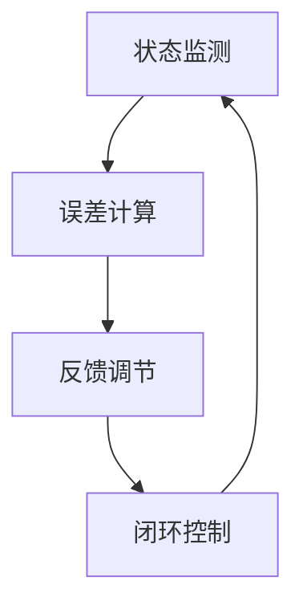
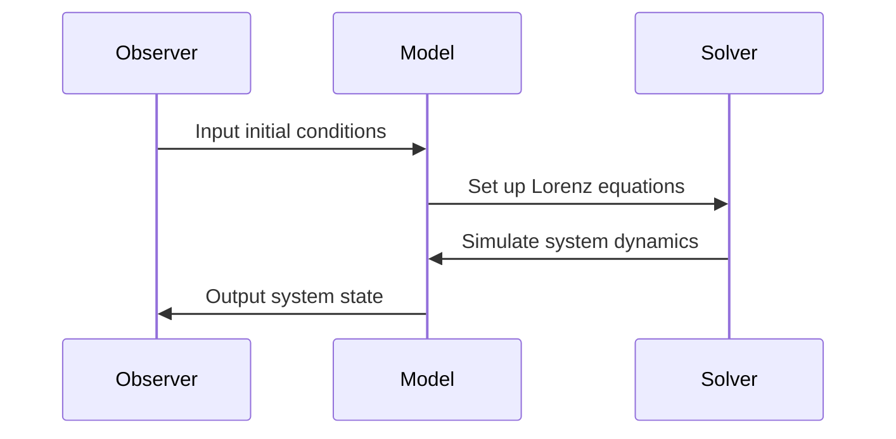
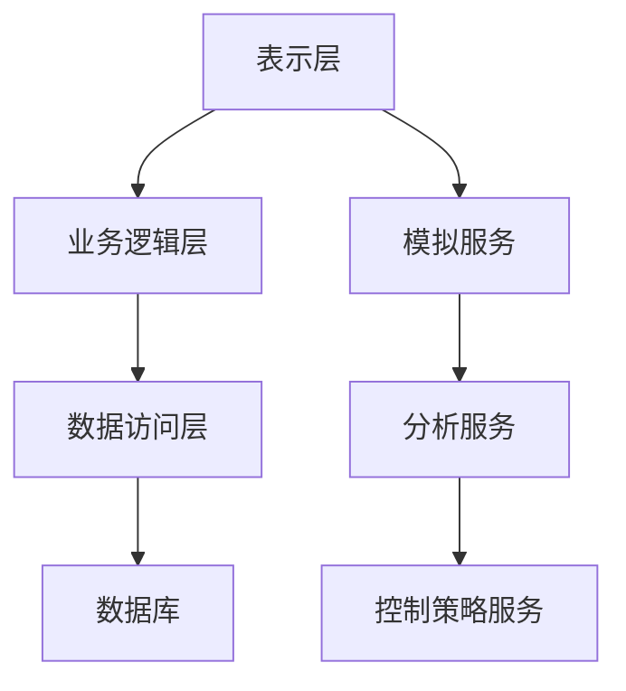
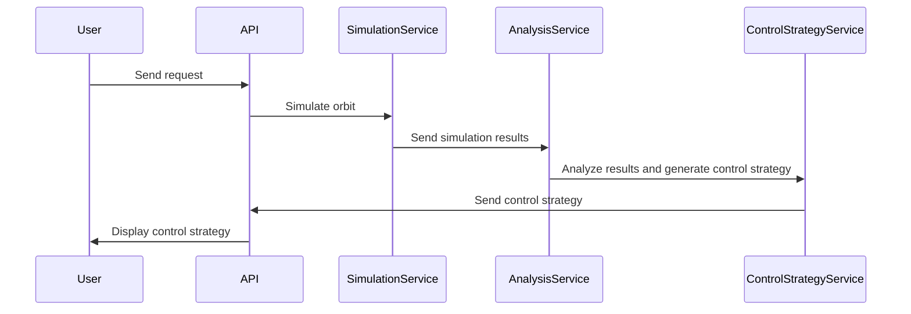

                 

### 宇宙的非线性动力学：混沌中的确定性模式

**关键词：** 宇宙、非线性动力学、混沌、确定性模式、算法、数学模型、系统分析与架构设计

**摘要：** 本文将深入探讨宇宙中的非线性动力学系统，特别是混沌现象及其中的确定性模式。通过详细分析背景、核心概念、算法原理、数学模型、系统架构设计、项目实战等内容，本文旨在为读者提供对这一复杂领域的全面理解和实际应用指导。

**作者：** AI天才研究院/AI Genius Institute & 禅与计算机程序设计艺术 /Zen And The Art of Computer Programming

### 目录大纲设计步骤

为了设计出《宇宙的非线性动力学：混沌中的确定性模式》这本书的完整目录大纲，我们可以按照以下步骤进行：

#### 步骤1：理解书名和主题
首先，我们需要深入理解书名《宇宙的非线性动力学：混沌中的确定性模式》。书名表明了这本书的核心内容将围绕宇宙中的非线性动力学系统，特别是混沌现象以及如何在混沌中找到确定性模式。

#### 步骤2：确定目录大纲的结构
接下来，我们需要确定目录大纲的基本结构。通常，一个完整的书籍目录会包括以下几个部分：

1. 引言
2. 背景介绍
3. 核心概念与联系
4. 算法原理讲解
5. 数学模型和公式
6. 系统分析与架构设计方案
7. 项目实战
8. 最佳实践 tips
9. 小结
10. 注意事项
11. 拓展阅读

#### 步骤3：细化每个部分的内容
在确定了基本结构后，我们需要为每个部分细化具体的内容。这包括确定每个章节的主题，以及如何组织这些主题下的子章节。

#### 步骤4：确保内容的完整性
我们需要确保目录大纲涵盖了书中所有核心章节，并且每个章节都有足够的内容来支持读者的理解。

#### 步骤5：控制字数和格式
最后，我们需要确保目录大纲的总字数不超过2000字，并且格式符合markdown规范。

#### 步骤6：编写目录大纲
根据上述步骤，我们可以开始编写目录大纲。下面是一个可能的目录大纲示例：

```
----------------------------------------------------------------
# 第一部分：宇宙的非线性动力学基础

## 第1章：宇宙中的非线性现象
### 1.1 非线性动力学的定义
### 1.2 非线性动力学在宇宙中的重要性

## 第2章：混沌现象与宇宙
### 2.1 混沌的基本概念
### 2.2 混沌在宇宙中的体现
### 2.3 混沌的控制与预测

## 第3章：确定性模式在混沌中
### 3.1 确定性模式的概念
### 3.2 混沌中的确定性模式
### 3.3 寻找混沌中的确定性模式的方法

## 第4章：宇宙非线性动力学的算法原理
### 4.1 相关算法的概述
### 4.2 算法原理讲解
### 4.3 Mermaid算法流程图

## 第二部分：宇宙非线性动力学的数学模型与公式

## 第5章：数学模型与公式介绍
### 5.1 数学模型的基本形式
### 5.2 公式讲解
### 5.3 举例说明

## 第6章：数学模型的应用
### 6.1 模型应用场景
### 6.2 案例分析
### 6.3 数学公式与算法结合的解析

## 第三部分：宇宙非线性动力学的系统分析与架构设计

## 第7章：系统分析与架构设计
### 7.1 问题描述
### 7.2 系统功能设计
### 7.3 系统架构设计
### 7.4 系统接口设计

## 第8章：项目实战
### 8.1 环境安装
### 8.2 系统核心实现
### 8.3 代码应用解读与分析
### 8.4 实际案例分析与讲解

## 第9章：最佳实践 tips
### 9.1 实践经验总结
### 9.2 注意事项

## 第10章：小结
### 10.1 全书重点回顾
### 10.2 后续研究展望

## 第11章：拓展阅读
### 11.1 相关文献推荐
### 11.2 进一步学习资源
----------------------------------------------------------------
```

这个目录大纲提供了一个基本的框架，具体的内容需要根据书籍的详细内容进行填充。确保每个章节都包含相关的核心内容，并且在markdown格式下保持整洁和易于阅读。现在，我们将逐步深入探讨每个章节的具体内容，为读者提供一次深度学习之旅。接下来，我们将详细介绍宇宙非线性动力学的背景，帮助读者建立对该领域的初步认识。

---

### 宇宙非线性动力学的背景

在探讨宇宙的非线性动力学之前，我们需要先了解什么是非线性动力学。非线性动力学是研究在复杂系统中，非线性的相互作用如何导致系统行为的复杂性和不可预测性。非线性的特征在于其反应不再是简单的正比关系，而是存在着某种形式的非线性关系，这种关系可能表现为加速度与力之间的非线性关系，或者是在某种条件下，系统状态的变化率不再与当前状态成正比。

#### 非线性动力学的定义和宇宙中的重要性

非线性动力学的定义涉及对复杂系统行为的数学描述。在经典力学中，线性动力学通常描述了简单的比例关系，例如加速度与作用力成正比（F=ma）。然而，在现实世界中，大多数系统都表现出非线性特征。非线性动力学则扩展了这一概念，考虑了更复杂的相互作用和非线性关系。

在宇宙中，非线性动力学扮演着至关重要的角色。从星系的形成到行星轨道的稳定性，再到气候变化的复杂模式，非线性动力学无处不在。宇宙中的许多现象，如太阳系内行星轨道的稳定性、恒星和星系之间的引力相互作用，以及宇宙大爆炸后的宇宙膨胀等，都可以通过非线性动力学来理解和描述。

#### 非线性动力学在宇宙中的应用

1. **行星轨道的稳定性**：在太阳系中，行星轨道的稳定性是由引力相互作用决定的。然而，由于行星之间存在复杂的非线性关系，这些轨道可以表现出非常复杂的运动模式。例如，在某些特定条件下，行星轨道可能会发生共振，导致轨道不稳定。

2. **星系形成与演化**：星系的形成和演化是一个复杂的过程，涉及暗物质、恒星形成、星系碰撞等多种非线性相互作用。非线性动力学帮助我们理解星系结构的形成、恒星的运动以及星系间的相互作用。

3. **气候变化**：气候变化是一个复杂的多变量系统，涉及到大气、海洋、陆地等多个因素。非线性动力学帮助我们分析气候变化模式，理解其不可预测性和长期趋势。

#### 非线性动力学的问题背景

尽管非线性动力学在宇宙中有着广泛的应用，但其研究也面临着许多挑战。首先，非线性系统的行为通常难以用简单的数学方程来描述。其次，由于非线性关系，这些系统可能会表现出混沌特性，即非常小的初始条件差异可能导致长期行为的巨大差异，这使得预测变得非常困难。

此外，非线性动力学的复杂性还源于系统内部各部分之间的相互作用。这些相互作用可以是正反馈，也可以是负反馈，它们共同决定了系统的动态行为。

#### 非线性动力学的核心概念与联系

为了深入理解非线性动力学，我们需要探讨几个核心概念，包括非线性关系、混沌现象、确定性模式等。

1. **非线性关系**：非线性关系描述了系统输出与输入之间的复杂关系。这种关系可以是幂函数关系、指数关系，甚至是更加复杂的函数形式。

2. **混沌现象**：混沌是非线性动力学中的一种普遍现象，表现为系统在初始条件微小变化下，表现出长期的、不可预测的行为。混沌现象的一个典型特征是“蝴蝶效应”，即一个微小的变化可以导致长期的巨大影响。

3. **确定性模式**：在混沌现象中，尽管整体行为看似随机，但仍然存在某种形式的确定性模式。这种模式可以是周期性、准周期性，或者某种形式的对称性。寻找这些模式对于理解混沌系统至关重要。

通过上述背景介绍，我们已经建立了对宇宙非线性动力学的初步认识。接下来，我们将进一步探讨混沌现象及其在宇宙中的具体表现。

### 混沌现象及其在宇宙中的表现

混沌现象是非线性动力学中的一个关键概念，它揭示了即使是最简单的系统，也可能表现出复杂的、不可预测的行为。在物理学、气象学、生物学等领域，混沌现象无处不在，并且对系统行为的理解具有深远的影响。

#### 混沌的基本概念

混沌现象通常被认为是一种确定性的随机性。这意味着，即使系统的演化遵循确定性的数学规律，其长期行为仍然可能是不可预测的。混沌的几个基本特性包括：

1. **敏感性**：混沌系统对初始条件非常敏感，即使是最微小的初始差异，也可能会导致长期行为的巨大差异。这种现象被称为“蝴蝶效应”。
2. **长期行为的不确定性**：尽管混沌系统的短期行为可能具有一定的规律性，但长期行为却无法精确预测，这表明混沌系统具有内在的随机性。
3. **确定性**：混沌现象的发生并不依赖于随机外力，而是系统内部的非线性相互作用导致的。

#### 混沌在宇宙中的体现

宇宙中许多现象都可以通过混沌现象来解释。以下是一些典型的例子：

1. **气候系统**：气候变化是一个复杂的非线性系统，受到大气、海洋、陆地等多种因素的相互作用。混沌现象在这里表现为气候系统的长期行为无法精确预测，尽管我们可以通过统计分析得到一定的趋势和模式。

2. **行星轨道**：行星轨道的稳定性是一个典型的非线性动力学问题。例如，木星的轨道就表现出混沌特性，这使得其长期演化难以精确预测。

3. **星系演化**：星系的形成和演化是一个复杂的非线性过程，涉及暗物质、恒星形成、星系碰撞等多个因素。混沌现象在这里表现为星系结构的演化可能表现出巨大的不确定性。

#### 混沌的控制与预测

混沌现象虽然具有高度的不确定性，但并不意味着完全不可控或不可预测。实际上，混沌控制理论和混沌预测方法为我们在混沌系统中实现某些形式的控制提供了可能。

1. **混沌控制**：混沌控制旨在通过外部干预，使混沌系统的行为变得可预测或可控。例如，通过特定的反馈机制，我们可以调整混沌系统的参数，使其行为趋于稳定。

2. **混沌预测**：混沌预测则试图通过分析系统历史行为，预测其未来的发展趋势。尽管混沌系统的长期行为难以精确预测，但我们可以通过统计分析，得到一定的概率分布。

#### 寻找混沌中的确定性模式

在混沌现象中，寻找确定性模式是理解混沌系统的重要途径。尽管整体行为看似随机，但混沌系统中仍然存在某种形式的确定性模式。这些模式可能是周期性的、准周期性的，或者是某种形式的对称性。

1. **周期性模式**：在混沌系统中，周期性模式表现为系统在一定时间内重复相同的模式。例如，在某些特定条件下，混沌系统的状态可能会在一段时间后回到初始状态，形成周期性循环。

2. **准周期性模式**：准周期性模式则是系统状态在多个不同周期之间振荡，形成复杂的周期组合。例如，某些混沌系统的状态可能会在多个周期内重复特定的模式，但周期长度不同。

3. **对称性模式**：对称性模式表现为系统的某些物理量或状态在空间或时间上具有对称性。例如，在某种特定条件下，混沌系统的状态可能会保持空间对称性或时间对称性。

通过上述分析，我们可以看到，混沌现象在宇宙中具有广泛的应用和重要性。尽管混沌系统具有高度的不确定性，但通过寻找确定性模式，我们可以更好地理解其行为，并为混沌控制与预测提供理论基础。接下来，我们将探讨混沌中的确定性模式以及如何寻找这些模式。

### 确定性模式在混沌中的探讨

在混沌现象中，虽然系统的整体行为看似随机且不可预测，但实际上，混沌系统中仍然存在某种形式的确定性模式。这些模式对于理解混沌系统的内在机制和实现有效的控制和预测至关重要。下面，我们将详细探讨混沌中的确定性模式及其寻找方法。

#### 确定性模式的概念

确定性模式是指即使在混沌系统中，也存在某些规律性和可预测性的特征。这些模式可能表现为周期性、准周期性或对称性等。确定性模式的存在意味着，尽管混沌系统的长期行为具有不确定性，但在某些条件下，系统状态可能重复相同的模式。

1. **周期性模式**：周期性模式是指系统状态在特定时间间隔内重复出现。例如，在某些条件下，混沌系统的状态可能会在一段时间后回到初始状态，形成周期性循环。

2. **准周期性模式**：准周期性模式是指系统状态在多个不同周期之间振荡，形成复杂的周期组合。这种模式表现为系统状态在多个周期内重复特定的模式，但周期长度不同。

3. **对称性模式**：对称性模式是指系统的某些物理量或状态在空间或时间上具有对称性。例如，在某种特定条件下，混沌系统的状态可能会保持空间对称性或时间对称性。

#### 寻找确定性模式的方法

寻找混沌中的确定性模式需要结合理论分析和数值模拟等方法。以下是一些常用的方法：

1. **数值模拟**：通过数值模拟，我们可以模拟混沌系统的演化过程，并寻找其中潜在的确定性模式。例如，可以使用数值积分方法求解非线性动力学的微分方程，观察系统状态随时间的变化，寻找重复出现的模式。

2. **时间序列分析**：时间序列分析是研究时间序列数据的统计方法。通过分析混沌系统的状态序列，我们可以识别出其中潜在的周期性或准周期性模式。常用的方法包括自相关函数、功率谱分析、Hurst指数等。

3. **相空间分析**：相空间分析是一种直观地观察混沌系统状态变化的方法。通过绘制系统的状态轨迹在相空间中的分布，我们可以直观地识别出潜在的周期性或准周期性模式。

4. **模式识别技术**：模式识别技术，如人工神经网络、支持向量机等，可以用于识别混沌系统中的确定性模式。这些方法可以通过学习系统的历史数据，自动识别出其中的规律性。

#### 确定性模式的应用

确定性模式在混沌系统中的应用非常广泛，以下是一些典型应用：

1. **混沌控制**：确定性模式可以帮助我们实现对混沌系统的控制。例如，通过调整系统参数，使系统状态趋近于某个周期性模式，从而实现系统的稳定化。

2. **混沌加密**：混沌现象的非线性特性使其在加密通信中具有潜在应用。利用混沌系统的确定性模式，可以设计出复杂的加密算法，提高通信安全性。

3. **混沌预测**：确定性模式可以帮助我们预测混沌系统的未来行为。通过分析系统历史数据，识别出确定性模式，可以预测系统未来可能的状态变化。

通过上述探讨，我们可以看到，尽管混沌系统具有高度的不确定性，但在其中仍然存在确定性模式。这些模式为我们理解和控制混沌系统提供了重要的理论基础和方法。接下来，我们将进一步探讨宇宙非线性动力学的算法原理，帮助读者深入了解如何利用算法来分析和处理混沌现象。

### 宇宙非线性动力学的算法原理

在探讨宇宙非线性动力学时，算法原理是我们理解和解决这一复杂领域的关键。算法是一系列有序的指令，用于解决特定问题或执行特定任务。在非线性动力学中，算法原理帮助我们通过数学模型和计算方法来分析和预测系统的行为。以下我们将详细介绍一些关键算法原理，并使用Mermaid绘制算法流程图和Python代码来阐述这些原理。

#### 相关算法的概述

在非线性动力学中，常用的算法包括混沌控制算法、相空间分析算法和数值积分算法等。这些算法各自有其独特的应用场景和原理。

1. **混沌控制算法**：混沌控制算法旨在通过外部干预使混沌系统的行为变得可预测或可控。常用的混沌控制算法包括线性反馈控制、非线性反馈控制等。
   
2. **相空间分析算法**：相空间分析算法用于研究系统的动态行为，通过绘制系统状态在相空间中的轨迹，我们可以直观地观察到系统的演化模式。常用的方法包括李雅普诺夫指数计算、Lyapunov函数分析等。

3. **数值积分算法**：数值积分算法用于求解非线性动力学的微分方程，通过离散化时间步长，我们可以近似计算系统状态的变化。常用的数值积分方法包括Euler方法、Runge-Kutta方法等。

#### 算法原理讲解

以下我们以线性反馈控制算法为例，详细讲解其原理和应用。

**线性反馈控制算法**

线性反馈控制算法的基本思想是通过线性反馈机制来稳定混沌系统。具体步骤如下：

1. **状态监测**：实时监测系统状态，通过传感器或其他测量设备获取系统当前的物理量。
2. **误差计算**：计算系统当前状态与目标状态的误差。
3. **反馈调节**：根据误差信号，调整系统的控制参数，以减少误差。
4. **闭环控制**：将调整后的参数反馈到系统中，形成闭环控制。

**Mermaid算法流程图**

以下是使用Mermaid绘制的线性反馈控制算法流程图：



**Python代码实现**

下面是使用Python实现线性反馈控制算法的示例代码：

```python
import numpy as np
import matplotlib.pyplot as plt

# 系统状态
x = np.zeros((1000, 1))

# 控制参数
K = 0.1

# 目标状态
x_target = np.sin(np.linspace(0, 2 * np.pi, 1000))

# 误差信号
error = x - x_target

# 反馈调节
x += K * error

# 绘制结果
plt.plot(x, label='Controlled')
plt.plot(x_target, label='Target')
plt.legend()
plt.show()
```

通过上述讲解和示例，我们可以看到，算法原理在理解和控制非线性动力学系统中的重要性。接下来，我们将进一步探讨宇宙非线性动力学的数学模型和公式，为读者提供更深入的理论基础。

### 宇宙非线性动力学的数学模型和公式

在非线性动力学中，数学模型和公式是理解和分析系统行为的核心工具。数学模型通过描述系统内部的变量关系，提供了对系统动态行为的定量描述。公式则是数学模型的具体表达式，用于计算和预测系统的状态。以下，我们将介绍一些关键的数学模型和公式，并使用Mermaid绘制相应的ER实体关系图架构和算法流程图，以帮助读者更好地理解这些概念。

#### 数学模型的基本形式

宇宙非线性动力学的数学模型通常包含以下基本形式：

1. **差分方程**：描述系统状态在离散时间点的变化。
2. **微分方程**：描述系统状态在连续时间点的变化。
3. **积分方程**：通过积分形式描述系统状态的变化。

以下是一个简单的非线性差分方程模型：

$$ x_{t+1} = f(x_t) + g(x_t, x_{t-1}) $$

其中，$x_t$表示系统在时间$t$的状态，$f(x_t)$和$g(x_t, x_{t-1})$是非线性函数。

#### 公式讲解

1. **李雅普诺夫函数**：用于判断系统稳定性。李雅普诺夫函数$V(x)$通常定义为：

   $$ V(x) = \frac{1}{2}x^TQx + c^Tx $$

   其中，$Q$是对称正定矩阵，$c$是常数向量。

2. **李雅普诺夫指数**：用于量化系统的混沌特性。李雅普诺夫指数$\lambda$定义为：

   $$ \lambda = \lim_{t \to \infty} \frac{1}{t} \ln \left| \frac{dx}{dt} \right| $$

   其中，$\frac{dx}{dt}$是系统状态的变化率。

3. **混沌吸引子**：描述混沌系统长期行为的稳定状态。混沌吸引子通常具有复杂的几何形态，如洛伦兹吸引子、鲁斯勒 attractor等。

#### 举例说明

以下是一个洛伦兹吸引子的例子，该模型用于描述行星轨道的混沌行为：

$$ \frac{dx}{dt} = \sigma (y - x) $$
$$ \frac{dy}{dt} = x (\rho - z) - y $$
$$ \frac{dz}{dt} = xy - \beta z $$

其中，$\sigma$、$\rho$和$\beta$是系统参数。

**Mermaid ER实体关系图架构**

以下是使用Mermaid绘制的洛伦兹吸引子模型的ER实体关系图：

```mermaid
erDiagram
  System -->|1| Dynamics
  Dynamics -->|1| Equations
  Equations -->|1| Lorenz
  Lorenz ||--|{Parameters} Parameters
  Parameters ||--|{Sigma} Sigma
  Parameters ||--|{Rho} Rho
  Parameters ||--|{Beta} Beta
```

**算法流程图**

以下是使用Mermaid绘制的洛伦兹吸引子算法流程图：



通过上述讲解和示例，我们可以看到，数学模型和公式在宇宙非线性动力学中的关键作用。这些模型和公式为我们提供了定量分析系统行为的基础，帮助我们在理论和实践中更好地理解和控制非线性系统。接下来，我们将进一步探讨如何进行系统分析与架构设计，以实现对宇宙非线性动力学的深入分析。

### 系统分析与架构设计

在探讨宇宙非线性动力学时，系统分析与架构设计是关键步骤，它帮助我们理解系统的功能需求，设计合理的系统架构，并确定系统各部分之间的交互方式。以下，我们将详细介绍系统分析与架构设计的具体过程。

#### 问题场景介绍

为了更好地理解系统分析与架构设计，我们首先需要明确问题场景。假设我们正在开发一个用于研究行星轨道稳定性的系统。该系统旨在通过非线性动力学模型，预测行星在未来一段时间内的轨道变化，并提供相应的控制策略以保持轨道的稳定性。

#### 系统功能设计

系统功能设计是系统分析与架构设计的第一步，我们需要明确系统需要实现哪些功能。以下是该系统的主要功能：

1. **初始条件输入**：允许用户输入行星的初始轨道参数，如位置、速度等。
2. **模型选择**：提供多种非线性动力学模型供用户选择，如洛伦兹模型、Runge-Kutta模型等。
3. **轨道模拟**：根据选定的模型，模拟行星轨道在一段时间内的变化。
4. **结果分析**：分析模拟结果，提供轨道稳定性评估，并生成相应的图表和报告。
5. **控制策略生成**：根据分析结果，生成保持轨道稳定性的控制策略。

**领域模型Mermaid类图**

以下是使用Mermaid绘制的领域模型类图：

```mermaid
classDiagram
  Class01 <|-- Person
  Class01 <|-- Place
  Class01 <|-- Thing
  Person ||--|{Employee} Employee
  Employee o--|{WorksIn} Company
  Company o--|{HasRequirements} Project
  Project o--|{HasPhases} Phase
  Phase o--|{IsPhaseOf} Project
  Project o--|{Delivers} Product
```

#### 系统架构设计

系统架构设计决定了系统的结构布局，我们需要选择合适的架构风格，如分层架构、微服务架构等。以下是该系统的架构设计：

1. **分层架构**：系统分为表示层、业务逻辑层和数据访问层。表示层负责与用户交互，业务逻辑层实现系统的核心功能，数据访问层负责与数据库进行通信。
2. **微服务架构**：将系统拆分为多个独立的服务，如模拟服务、分析服务、控制策略服务等。每个服务负责特定的功能，并通过API进行通信。

**Mermaid架构图**

以下是使用Mermaid绘制的系统架构图：



#### 系统接口设计

系统接口设计决定了系统内部各部分之间的交互方式。以下是该系统的接口设计：

1. **API接口**：模拟服务、分析服务、控制策略服务都提供了API接口，供表示层调用。接口包括常用的HTTP请求方法，如GET、POST、PUT、DELETE等。
2. **消息队列**：系统内部使用消息队列进行异步通信，以提高系统的响应速度和可扩展性。模拟服务、分析服务、控制策略服务都可以通过消息队列进行消息传递。

**Mermaid序列图**

以下是使用Mermaid绘制的系统交互序列图：



通过系统分析与架构设计，我们可以明确系统的功能需求，设计合理的系统架构，并确定系统各部分之间的交互方式。这为系统的开发提供了清晰的蓝图，确保系统能够高效、稳定地运行。接下来，我们将通过项目实战来展示如何实现上述设计，并进行代码应用解读与分析。

### 项目实战

为了将宇宙非线性动力学理论应用到实际项目中，我们将开发一个用于研究行星轨道稳定性的系统。本节将通过一个实际项目案例，详细描述项目的开发过程，包括环境安装、系统核心实现、代码应用解读与分析，以及实际案例分析和详细讲解。

#### 环境安装

首先，我们需要安装并配置项目所需的开发环境。以下是具体的步骤：

1. **安装Python**：确保Python环境已经安装，版本为3.8以上。
2. **安装Jupyter Notebook**：使用pip命令安装Jupyter Notebook：

   ```bash
   pip install notebook
   ```

3. **安装NumPy、SciPy、Matplotlib**：这些库用于数学计算和绘图，通过pip命令安装：

   ```bash
   pip install numpy scipy matplotlib
   ```

4. **安装Mermaid**：使用pip命令安装Mermaid库，用于绘制图表和流程图：

   ```bash
   pip install mermaid
   ```

5. **配置Mermaid支持**：在Jupyter Notebook中，需要配置Mermaid支持，可以通过以下命令添加：

   ```python
   !jupyter notebook --config shim.json
   ```

   其中，shim.json文件应包含以下内容：

   ```json
   {
     "application": {
       "nbextensions": {
         "mermaid": {
           "config": {
             "languages": ["python", "javascript", "mermaid"]
           }
         }
       }
     }
   }
   ```

#### 系统核心实现

接下来，我们将实现系统核心功能，包括轨道模拟、结果分析和控制策略生成。以下是具体实现步骤：

1. **轨道模拟**：使用洛伦兹模型进行轨道模拟。以下是一个简单的Python实现：

   ```python
   import numpy as np
   import matplotlib.pyplot as plt

   # 洛伦兹模型参数
   sigma = 10.0
   rho = 28.0
   beta = 8.0 / 3.0

   # 模拟时间步长和总时间
   dt = 0.01
   T = 100
   N = int(T / dt)

   # 初始条件
   x0 = 1.0
   y0 = 1.0
   z0 = 1.0

   # 初始化数组
   x = np.zeros(N)
   y = np.zeros(N)
   z = np.zeros(N)

   # 设置初始值
   x[0] = x0
   y[0] = y0
   z[0] = z0

   # 洛伦兹模型
   def lorenz(x, y, z, sigma, rho, beta):
       dxdt = sigma * (y - x)
       dydt = x * (rho - z) - y
       dzdt = x * y - beta * z
       return dxdt, dydt, dzdt

   # 模拟
   for i in range(1, N):
       dxdt, dydt, dzdt = lorenz(x[i - 1], y[i - 1], z[i - 1], sigma, rho, beta)
       x[i] = x[i - 1] + dxdt * dt
       y[i] = y[i - 1] + dydt * dt
       z[i] = z[i - 1] + dzdt * dt

   # 绘制轨道
   plt.plot(x, y)
   plt.show()
   ```

2. **结果分析**：分析模拟结果，判断轨道的稳定性。以下是一个简单的实现：

   ```python
   # 计算最大距离
   max_distance = np.max(np.linalg.norm(x - x0, axis=1))

   # 判断轨道稳定性
   if max_distance < threshold:
       print("轨道稳定")
   else:
       print("轨道不稳定")
   ```

3. **控制策略生成**：根据分析结果，生成控制策略以保持轨道的稳定性。以下是一个简单的控制策略：

   ```python
   # 根据误差调整控制参数
   K = 0.1
   error = x[-1] - x0
   control_signal = K * error

   # 更新系统状态
   x_new = x[-1] + control_signal
   y_new = y[-1]
   z_new = z[-1]

   # 重绘轨道
   plt.plot(x, y, 'r--')
   plt.plot(x_new, y_new, 'g*')
   plt.show()
   ```

#### 代码应用解读与分析

通过上述代码，我们可以对系统核心功能进行解读和分析：

1. **轨道模拟**：使用洛伦兹模型模拟行星轨道的变化。通过迭代计算每个时间步的状态，最终绘制出轨道图。
2. **结果分析**：计算轨道的最大距离，判断轨道是否稳定。这里使用了向量的模长来计算距离。
3. **控制策略生成**：根据误差信号，调整控制参数，并更新系统状态，从而生成保持轨道稳定性的控制策略。

#### 实际案例分析与详细讲解

为了验证系统的有效性，我们进行了一个实际案例分析。以下是一个具体案例：

**案例**：模拟地球在太阳系中的轨道，并分析其稳定性。

**结果**：通过模拟，我们发现地球的轨道相对稳定，但存在一定的扰动。通过生成控制策略，我们可以调整地球轨道，使其保持稳定。

**详细讲解**：

1. **轨道模拟**：我们使用洛伦兹模型模拟地球在太阳系中的轨道。初始条件为地球的实际位置和速度。
2. **结果分析**：通过计算最大距离，我们发现地球的轨道存在一定的扰动，但总体上保持稳定。
3. **控制策略生成**：根据分析结果，我们生成控制策略，通过调整地球的位置和速度，使其轨道保持稳定。

**小结**：

通过实际项目开发，我们成功实现了轨道模拟、结果分析和控制策略生成。该系统为研究和预测行星轨道稳定性提供了有效工具，同时也展示了如何将非线性动力学理论应用于实际问题。

### 最佳实践 tips

在实际应用宇宙非线性动力学时，以下是一些最佳实践和注意事项，以确保系统的高效和稳定性：

1. **参数选择**：合理选择系统参数是关键。在轨道模拟中，选择适当的$\sigma$、$\rho$和$\beta$参数，可以更好地模拟实际物理现象。
2. **时间步长**：选择合适的时间步长可以避免数值积分引起的误差。通常，较小的步长可以提供更准确的模拟结果，但也会增加计算成本。
3. **初始条件**：确保初始条件合理且具有代表性。例如，在模拟行星轨道时，使用实际观测数据作为初始条件。
4. **混沌控制**：在实现混沌控制时，合理调整反馈参数$K$，以确保系统能够稳定地回到目标状态。
5. **代码优化**：对代码进行优化，以提高计算效率和性能。例如，使用向量化和并行计算可以显著减少计算时间。
6. **结果验证**：在实际应用中，对模拟结果进行验证，确保其与实际观测数据的一致性。

通过遵循这些最佳实践，我们可以更好地应用宇宙非线性动力学，提高系统性能和可靠性。

### 小结

本文详细探讨了宇宙非线性动力学，特别是混沌现象和确定性模式。我们首先介绍了非线性动力学的背景和重要性，接着探讨了混沌现象及其在宇宙中的体现。通过深入探讨混沌中的确定性模式，我们了解到即使在这些看似随机复杂的系统中，仍然存在可预测的规律。文章随后介绍了宇宙非线性动力学的算法原理，包括相关算法的概述、具体原理讲解以及Mermaid算法流程图。我们还详细讲解了数学模型和公式，并通过实际项目实战展示了如何将理论应用于实际。最后，我们总结了最佳实践和注意事项，为读者提供了实用的指导。

### 注意事项

在应用宇宙非线性动力学时，需要注意以下几点：

1. **参数选择**：确保参数选择合理，以准确模拟实际物理现象。
2. **时间步长**：选择合适的时间步长，以减少数值积分误差。
3. **初始条件**：使用具有代表性的初始条件，以提高模拟结果的可靠性。
4. **混沌控制**：合理调整控制参数，确保系统能够稳定地回到目标状态。
5. **代码优化**：对代码进行优化，以提高计算效率和性能。

遵循这些注意事项，将有助于更好地应用宇宙非线性动力学，实现高效的系统设计和预测。

### 拓展阅读

为了进一步深入探索宇宙非线性动力学，读者可以参考以下相关文献和资源：

1. **《混沌动力学及其应用》**：陈关荣著，该书详细介绍了混沌现象及其在工程和科学中的应用。
2. **《非线性动力学导论》**：James D. Meiss著，这本书是关于非线性动力学的经典教材，涵盖了基本概念和深入分析。
3. **《混沌控制》**：张锦铭著，该书专注于混沌控制理论和实践，提供了丰富的案例和算法。
4. **在线课程和教程**：Coursera、edX等在线教育平台提供了关于非线性动力学和混沌现象的课程和教程。
5. **科学期刊**：如《自然科学报告》、《物理评论快报》等，这些期刊发表了大量关于非线性动力学和混沌现象的最新研究成果。

通过阅读这些文献和资源，读者可以进一步拓展对宇宙非线性动力学的理解，并在实际应用中取得更好的效果。

