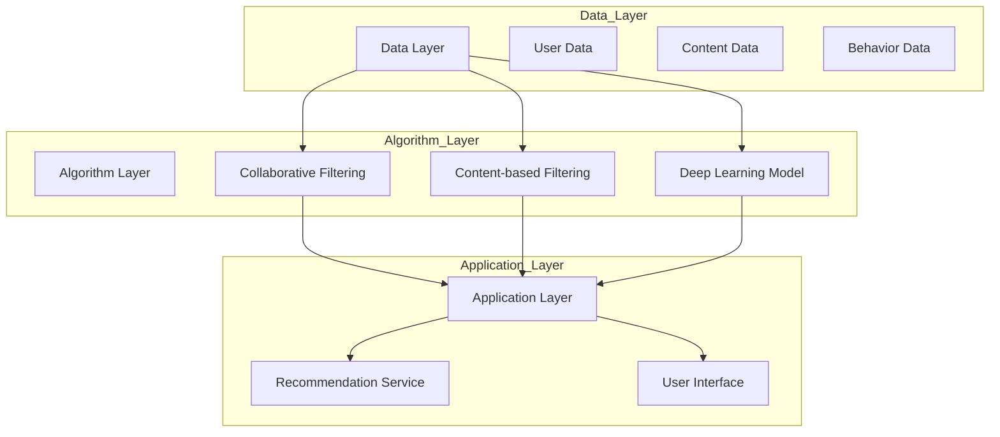
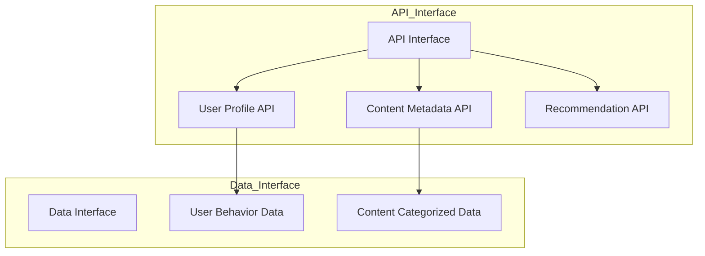
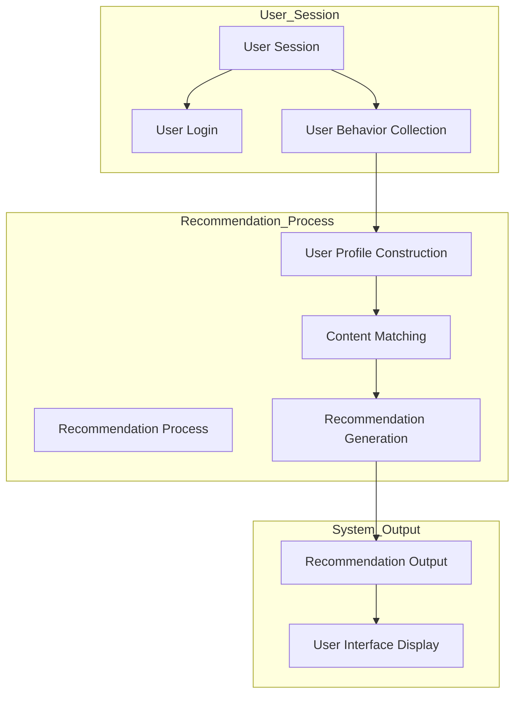

                 

### 前言

**主题引入：** 宇宙观念的多样性及跨学科研究的重要性

宇宙观念是人类对宇宙认知的汇总和抽象，是不同学科在长期发展和探索过程中逐渐形成的关于宇宙的理论、观念和思维方式。从古代天文学到现代宇宙学，从自然科学到社会科学，再到人文科学，宇宙观念在不同的学科领域中有着各自独特的表现和贡献。然而，这些看似独立的学科实际上在某种程度上有着深刻的联系和交叉，共同构建了人类对宇宙的全面理解。

**目的与意义：** 探索宇宙观念在不同学科领域的相互影响和交叉应用

本文旨在通过深入探讨宇宙观念在不同学科中的交叉研究，揭示各学科在宇宙观念上的相互影响和融合。这样的探讨不仅有助于我们更全面地理解宇宙，还能够为跨学科研究提供新的思路和方法，促进不同学科之间的交流和合作。具体来说，本文将：

1. **回顾宇宙观念的历史演变**：从古代到现代，宇宙观念是如何演变的。
2. **分析宇宙观念在自然科学中的交叉研究**：宇宙观念在天文学、物理学、化学、地球科学和生物学中的应用。
3. **探讨宇宙观念在社会科学中的影响**：宗教、哲学、社会学和心理学中的宇宙观念表现。
4. **深入宇宙观念在人文科学中的体现**：文学、艺术、教育和媒体中的宇宙观念影响。
5. **面对跨学科研究的挑战与机遇**：分析跨学科宇宙研究的困难和前景。

**内容结构概述：** 各学科对宇宙观念的理解、宇宙观念在不同学科的应用和影响、跨学科研究的挑战与机遇

本文将分为三个主要部分。第一部分将回顾宇宙观念的历史演变，探讨自然科学和社会科学对宇宙观念的理解；第二部分将深入探讨宇宙观念在人文科学中的应用和影响；第三部分将重点分析跨学科研究的挑战与机遇，通过具体案例分析，展望宇宙观念在未来的跨学科应用前景。这样的结构旨在帮助读者逐步了解和掌握宇宙观念在不同学科中的交叉研究，为跨学科研究提供理论和方法支持。

### 第一部分：宇宙观念的学科背景

在探讨宇宙观念在不同学科中的交叉研究之前，我们需要首先了解各学科对宇宙观念的理解和应用。这一部分将分为几个章节，详细回顾宇宙观念的历史演变，分析自然科学和社会科学对宇宙观念的理解，并探讨宇宙观念在人文科学中的体现。

#### 第1章：宇宙观念的历史演变

**1.1 引言：** 宇宙观念的形成与发展历程

宇宙观念的形成是人类文明发展的一个重要组成部分。从古代人类对天空的仰望，到现代科学的精确研究，宇宙观念经历了漫长的演变过程。古代人类对宇宙的认知主要来自于直观观察和宗教信仰，他们相信宇宙是有序的、神秘的，并与人类的生活密切相关。随着科学技术的发展，人类对宇宙的理解逐渐从直观感受走向科学理论。

**1.2 自然科学中的宇宙观念：** 从古代天文学到现代宇宙学

古代天文学是宇宙观念发展的重要阶段。早期人类通过观测日月星辰，逐渐形成了对宇宙的基本认识。例如，古希腊的天文学家如泰勒斯、毕达哥拉斯和亚里士多德，他们的理论为后来的宇宙观念奠定了基础。在中世纪，天文学受到宗教的影响，宇宙观念带有强烈的宗教色彩。

进入现代，宇宙学作为一门独立的科学得到了迅速发展。伽利略通过望远镜观测到的天体现象，为哥白尼的日心说提供了有力的证据。牛顿的万有引力定律和爱因斯坦的相对论进一步深化了人类对宇宙的理解，揭示了宇宙的复杂性和多样性。

**1.3 社会科学中的宇宙观念：** 宗教、哲学与文化视角

社会科学中的宇宙观念主要来自于宗教、哲学和文化。在宗教中，宇宙观念往往与神的存在和宇宙的起源紧密相关。例如，基督教、伊斯兰教和印度教等都有各自的宇宙观念和神话体系。哲学中的宇宙观念则更多地关注宇宙的本质、意义和人类在宇宙中的地位。古代哲学家如赫拉克利特、柏拉图和斯多葛学派，他们的思想对后来的宇宙观念产生了深远影响。

文化视角下的宇宙观念则体现在不同的文化传统和价值观中。不同文化对宇宙的理解和认知各不相同，形成了丰富多彩的宇宙观念。例如，中国传统文化中的“天人合一”观念，强调人与自然的和谐关系。

**1.4 宇宙观念在人文科学中的体现：** 文学、艺术与宇宙观

文学和艺术是人文科学的重要组成部分，也是宇宙观念的重要载体。文学作品中的宇宙观念通过故事、形象和语言表达，将宇宙的浩瀚和神秘展现得淋漓尽致。例如，古希腊史诗《伊利亚特》和《奥德赛》中充满了对天空和神灵的描写，反映了古代人类对宇宙的崇拜和敬畏。

艺术作品中的宇宙观念则通过视觉和感觉形式传达宇宙的美丽和壮观。例如，文艺复兴时期的绘画和雕塑作品，展示了人类对宇宙探索的渴望和对宇宙本质的思考。

**1.5 本章小结：** 宇宙观念的多维度发展

宇宙观念的历史演变展示了人类对宇宙认知的逐步深化和多维度发展。从古代直观观察和宗教信仰，到现代科学的精确研究和哲学思考，宇宙观念在不同学科中的交叉和融合，为我们提供了一个全面理解宇宙的视角。通过这一章节的回顾，我们可以更好地理解宇宙观念在不同学科中的基础和相互联系，为后续的探讨打下坚实基础。

---

**第2章：宇宙观念在自然科学中的交叉研究**

宇宙观念在自然科学中占据着核心地位，从天文学、物理学到化学、地球科学和生物学，各学科都在不同程度上对宇宙观念进行了深入研究和阐述。本章将详细探讨这些学科对宇宙观念的交叉研究，揭示各学科之间的相互联系和影响。

**2.1 天文学与物理学：** 宇宙起源与结构研究

天文学和物理学是研究宇宙观念的两个重要学科。天文学通过观测宇宙中的天体现象，探索宇宙的起源和演化。物理学的理论则为天文学提供了解释宇宙现象的框架和工具。

宇宙起源的研究是天文学和物理学共同关注的焦点。例如，大爆炸理论描述了宇宙从一个极端高温高密度的状态迅速膨胀到今天的状态。这一理论得到了多种观测数据的支持，如宇宙微波背景辐射和遥远星系的红移。

宇宙结构的研究则涉及宇宙的形状、大小和分布。物理学的广义相对论和牛顿引力定律为天文学提供了描述宇宙结构的理论基础。通过观测宇宙的大尺度结构，如星系团和超星系团，科学家们对宇宙的形态和演化有了更深入的理解。

**2.2 天文学与化学：** 宇宙中的元素与分子

天文学和化学的交叉研究揭示了宇宙中的元素和分子的起源和分布。化学原理帮助我们理解宇宙中的化学过程，如核合成、元素形成和化学反应。这些过程在天文学中有着重要的应用。

例如，通过观测遥远星系的光谱，天文学家能够确定宇宙中的元素组成。他们发现，宇宙中的重元素主要是在恒星内部通过核反应形成的，然后通过超新星爆炸释放到宇宙空间中。

分子天文学是另一个交叉研究领域，通过观测星际介质中的分子，天文学家能够揭示宇宙中的化学环境。分子云中的分子是恒星形成的前体，通过研究这些分子，我们可以了解恒星形成的机制和条件。

**2.3 地球科学与宇宙学：** 地球在宇宙中的位置与角色

地球科学和宇宙学的交叉研究有助于我们理解地球在宇宙中的位置和角色。地球科学通过研究地球的内部结构和外部环境，揭示地球的地质历史和演化过程。宇宙学则通过观测宇宙的大尺度结构，探索宇宙的起源和演化。

地球科学的研究发现，地球的地质活动对宇宙环境有着重要影响。例如，地球的磁层能够保护地球免受宇宙射线的侵害。地球上的生命活动也在一定程度上影响了宇宙的化学成分，如通过生物过程产生的气体和矿物质释放到大气中，随后通过大气循环进入宇宙空间。

宇宙学的研究发现，地球在宇宙中只是一个微小的部分，但地球上的生命却具有独特的地位。地球上的生命形式和生物过程为宇宙提供了独特的视角，帮助我们理解生命的起源和演化。

**2.4 生物学与宇宙学：** 宇宙观念对生命的启示

生物学和宇宙学的交叉研究揭示了宇宙观念对生命的启示。生物学研究生命的起源和演化，探索生命在地球上的多样性和适应性。宇宙学则通过观测宇宙中的生命迹象，探讨生命的可能性和条件。

例如，通过观测遥远星系和行星，科学家们发现了一些可能适合生命存在的条件，如适宜的温度、水分和化学环境。这些发现为生命的起源和演化提供了新的线索和可能性。

宇宙学的研究还发现，宇宙的复杂性和多样性为生命的多样性和演化提供了丰富的环境。例如，不同类型的恒星和行星系统为生命提供了不同的条件，促进了生命的多样性和适应性。

**2.5 本章小结：** 自然科学中的跨学科宇宙研究现状与趋势

自然科学中的跨学科宇宙研究展示了不同学科在宇宙观念上的相互联系和融合。天文学、物理学、化学、地球科学和生物学通过交叉研究，揭示了宇宙的起源、结构、演化和生命的奥秘。这些研究不仅深化了我们对宇宙的理解，还为跨学科研究提供了新的思路和方法。

未来，随着科学技术的发展，跨学科宇宙研究将继续取得新的突破。例如，通过观测更高分辨率的天体现象，科学家们将能够更精确地理解宇宙的演化过程。同时，跨学科合作也将进一步加强，不同学科的研究者将共同探索宇宙的未知领域，推动宇宙观念的深入研究。

### 第二部分：宇宙观念在社会科学中的应用

宇宙观念不仅存在于自然科学中，也在社会科学中得到了广泛应用。宗教、哲学、社会学和心理学等学科都在不同程度上探讨了宇宙观念，并对其进行了深刻的思考。本章将深入探讨这些学科对宇宙观念的研究，揭示宇宙观念在社会生活中的多重影响。

#### 第3章：社会科学中的宇宙观念研究

**3.1 宗教与宇宙观念：** 宗教视角下的宇宙观

宗教是人类文化的重要组成部分，许多宗教都有自己独特的宇宙观念。这些宇宙观念不仅影响了信徒的信仰和行为，还对人类社会的价值观和道德观产生了深远影响。

在基督教中，宇宙观念与上帝的存在和创造紧密相关。圣经中的创世纪描述了上帝创造宇宙的过程，信徒们相信宇宙是上帝的杰作，人类是上帝的子女。这种宇宙观念强调了人类的神圣使命和道德责任。

在佛教中，宇宙观念则体现在因果律和轮回说中。佛教认为，宇宙是一个不断循环的过程，生命的循环与宇宙的循环密切相关。信徒们通过修行和积累善行，可以在未来获得更好的生命形态。

在印度教中，宇宙观念与神的多元性和轮回说密切相关。印度教相信宇宙由多个神创造和维护，每个神都有其特定的职责和作用。信徒们通过祈祷和祭祀，寻求神的庇护和指引。

**3.2 哲学与宇宙观念：** 宇宙观念的哲学探讨

哲学是探讨宇宙观念的重要学科之一。哲学家们通过逻辑推理和思辨，对宇宙的本质、起源和意义进行了深入的探讨。

古希腊哲学家赫拉克利特提出了“宇宙是一团永恒的火”的观点，认为宇宙是不断变化和生成的。赫拉克利特的观点强调了宇宙的动态性和不确定性。

柏拉图则提出了“理念世界”的概念，认为宇宙是由理念构成的，现实世界只是理念世界的影子。柏拉图的观点强调了宇宙的抽象性和超越性。

康德在《纯粹理性批判》中探讨了宇宙的本质和结构，他认为宇宙是一个有规律的体系，人类可以通过理性认识宇宙的真相。

**3.3 社会学与宇宙观念：** 社会组织与宇宙观念的关系

社会学的宇宙观念研究主要集中在人类社会和宇宙观念之间的关系。社会学家通过研究人类社会结构和组织，探讨了宇宙观念如何影响社会秩序和价值观。

马克斯·韦伯在《新教伦理与资本主义精神》中探讨了宇宙观念对资本主义发展的影响。他认为，新教的宇宙观念，如预定论和上帝的公正，促进了资本主义精神的形成。

埃米尔·涂尔干则通过研究宗教观念对社会组织的影响，揭示了宇宙观念在社会生活中的重要性。他认为，宗教观念为人们提供了共同信仰和价值观，促进了社会团结和稳定。

**3.4 心理学与宇宙观念：** 宇宙观念对个体心理的影响

心理学研究宇宙观念对个体心理的影响，探讨了宇宙观念如何影响个体的认知、情感和行为。

心理学研究表明，宇宙观念可以影响个体的世界观和价值观。例如，相信宇宙是有序和公正的个体，可能表现出更加积极和乐观的态度。

宇宙观念还可以影响个体的自我认同和自我实现。例如，一些心理学家认为，宇宙观念中的宗教和哲学信仰可以为个体提供精神支持和自我实现的方向。

**3.5 本章小结：** 社会科学对宇宙观念的多元理解

社会科学中的宇宙观念研究展示了宇宙观念在社会生活中的多样性和复杂性。宗教、哲学、社会学和心理学等学科从不同角度探讨了宇宙观念的本质和影响，揭示了宇宙观念在社会、文化和心理层面的重要性。这些研究不仅加深了我们对宇宙观念的理解，还为跨学科研究提供了丰富的理论和实践基础。

### 第三部分：宇宙观念在人文科学中的影响

人文科学是研究人类文化、历史、语言、艺术和社会生活等领域的一门学科。宇宙观念在人文科学中有着广泛的影响，从文学、艺术到教育、媒体，各学科都在不同程度上体现了宇宙观念的内涵和意义。本章将深入探讨宇宙观念在人文科学中的体现，揭示宇宙观念对人类文化和社会生活的深远影响。

#### 第4章：宇宙观念在人文科学中的影响

**4.1 文学与宇宙观念：** 文学作品中的宇宙观念表现

文学是宇宙观念的重要载体，通过故事、人物和语言，文学展现了宇宙的浩瀚、神秘和美丽。文学作品中的宇宙观念不仅反映了人类对宇宙的认知和理解，还体现了人类对生命意义和宇宙本质的探讨。

例如，在古希腊史诗《伊利亚特》和《奥德赛》中，宇宙观念通过神话和史诗叙事得到了生动的表现。这些作品中充满了对天空、神灵和自然界的描写，反映了古代人类对宇宙的敬畏和崇拜。

在近现代文学中，宇宙观念也得到了广泛的探讨。例如，托马斯·品钦的小说《万有引力之虹》通过对宇宙的描绘，探讨了人类命运和宇宙命运的相互关系。品钦通过对宇宙的深刻反思，揭示了人类在宇宙中的脆弱和渺小。

**4.2 艺术与宇宙观念：** 宇宙观念在艺术创作中的应用

艺术是宇宙观念的重要表现形式，通过视觉、听觉和情感，艺术传达了宇宙的宏大和神秘。艺术家们通过对宇宙的观察和思考，将宇宙观念融入艺术创作中，创作出了许多具有深刻意义的艺术作品。

例如，文艺复兴时期的画家如达·芬奇和米开朗基罗，通过对宇宙的描绘，展现了宇宙的美丽和壮观。他们的作品如《最后的晚餐》和《创世纪》，通过精细的绘画技巧和对宇宙的象征性表达，使观众对宇宙的神秘和美丽有了更深刻的认识。

现代艺术家如安迪·沃霍尔和村上隆，通过对宇宙的重新解读和重构，创作出了许多具有强烈视觉冲击力的作品。他们的作品通过对宇宙的隐喻和象征，探讨了人类在宇宙中的位置和角色。

**4.3 宇宙观念与教育：** 宇宙观念在教育中的影响

宇宙观念在教育中有着重要的地位，通过宇宙观念的教育，学生可以更好地理解宇宙的奥秘和生命的意义。宇宙观念的教育不仅有助于培养学生的科学素养，还能够激发他们的好奇心和求知欲。

例如，在科学教育中，宇宙观念的教育可以帮助学生理解宇宙的起源和演化，培养他们对科学的兴趣和探索精神。在人文教育中，宇宙观念的教育可以启发学生对生命意义的思考，促进他们的人格成长。

**4.4 媒体与宇宙观念：** 宇宙观念在媒体传播中的作用

媒体是传播宇宙观念的重要渠道，通过新闻报道、纪录片、科幻电影和电视剧等形式，媒体将宇宙观念传递给广大观众。媒体对宇宙的描绘和传播不仅影响了公众对宇宙的认知，还激发了人们对宇宙的探索和关注。

例如，科学纪录片如《宇宙探秘》和《人类星球》，通过精美的画面和详实的科学解说，向观众展示了宇宙的美丽和神秘。这些纪录片不仅提供了丰富的科学知识，还激发了观众对宇宙的探索兴趣。

科幻电影和电视剧如《星际穿越》和《黑镜：万眼观音》，通过虚构的故事和情节，探讨了宇宙的未知和未来。这些作品不仅提供了娱乐，还引发了观众对宇宙观念的思考和讨论。

**4.5 本章小结：** 人文科学对宇宙观念的深度挖掘

人文科学对宇宙观念的深度挖掘展示了宇宙观念在人类文化和社会生活中的重要性和影响力。文学、艺术、教育和媒体等学科通过不同的方式，对宇宙观念进行了深刻的思考和表达。这些探索不仅丰富了人类对宇宙的理解，还为跨学科研究提供了丰富的理论和实践基础。通过人文科学的视角，我们可以更好地理解宇宙观念的多维内涵和深远影响。

### 第三部分：跨学科宇宙研究的挑战与机遇

在探讨了宇宙观念在自然科学、社会科学和人文科学中的广泛应用后，我们不得不面临一个重要的问题：如何有效地进行跨学科研究，以更全面地理解宇宙观念？本章将分析跨学科宇宙研究的挑战和机遇，通过具体案例分析，探讨跨学科研究的实际意义与未来路径。

#### 第5章：跨学科宇宙研究的挑战

**5.1 学科壁垒与沟通难题：** 跨学科研究的难点

跨学科研究面临着诸多挑战，其中最大的挑战之一是学科壁垒和沟通难题。不同学科有着不同的研究方法、理论体系和语言表达方式，这往往导致跨学科研究中的沟通障碍。例如，天文学家使用观测数据和统计方法进行研究，而物理学家则更擅长使用数学模型和理论推导。这些差异使得跨学科研究中的交流变得复杂且困难。

**5.2 理论框架与知识体系：** 跨学科宇宙研究的方法论

为了克服学科壁垒和沟通难题，跨学科研究需要建立一套统一的理论框架和知识体系。这包括明确各学科的核心概念、理论基础和研究方法，并找到它们之间的共同点和差异点。例如，在宇宙观念的研究中，可以将天文学、物理学、化学和生物学等学科的基本理论进行整合，形成一个统一的研究框架，从而提高跨学科研究的效率和效果。

**5.3 技术工具与创新思维：** 跨学科研究的支持

跨学科研究还需要依赖于先进的技术工具和创新思维。技术工具可以帮助研究者跨越学科边界，获取更多的数据和资源。例如，大型天文望远镜和卫星观测设备可以提供高精度的宇宙观测数据，而高性能计算和人工智能技术则可以处理海量数据，帮助研究者发现新的科学规律。

创新思维是跨学科研究的核心驱动力。研究者需要具备跨学科的思维模式，能够在不同学科之间进行灵活的思维跳跃和知识整合。例如，一个天文学家可以借鉴物理学的理论和方法，来解释天文观测现象；同样，一个生物学家也可以将宇宙观念应用于生命科学的研究，探索生命的起源和演化。

**5.4 本章小结：** 跨学科宇宙研究的现实困境

跨学科宇宙研究虽然具有巨大的潜力和价值，但在实际操作中仍然面临诸多现实困境。学科壁垒和沟通难题、理论框架和方法论的缺失、技术工具和创新思维的不足，都是跨学科研究需要克服的挑战。然而，只有通过克服这些困境，跨学科研究才能取得突破性的进展，为人类对宇宙的理解提供新的视角和方法。

#### 第6章：跨学科宇宙研究的机遇

**6.1 科技进步与宇宙探索：** 科技进步对宇宙研究的推动

科技进步为跨学科宇宙研究提供了强大的动力和支持。随着科技的发展，我们能够观测到更加遥远和细微的宇宙现象，获取更加精确的科学数据。这些数据不仅为各学科的研究提供了丰富的资源，也为跨学科研究提供了新的机会。

例如，大型天文望远镜和空间探测器的出现，使得我们能够观测到宇宙中的暗物质和暗能量等神秘现象。这些观测数据需要不同学科的科学家共同分析和解释，推动了跨学科研究的深入发展。

**6.2 社会需求与学术合作：** 跨学科研究的社会价值

跨学科研究不仅具有科学意义，还具有重要的社会价值。在现代社会，许多复杂问题需要多个学科的知识和技能来解决。例如，全球气候变化、能源危机和环境保护等问题，都需要天文学、物理学、化学、生物学和社会科学等多个学科的共同努力。

跨学科研究可以促进不同学科之间的合作和交流，推动科学技术的创新和社会进步。通过跨学科研究，科学家们可以共同面对挑战，解决复杂问题，为人类社会的可持续发展做出贡献。

**6.3 教育改革与人才培养：** 跨学科研究在教育中的影响

跨学科研究对教育改革和人才培养也具有重要影响。传统的教育模式往往注重学科知识的传授，而忽视了学科之间的联系和综合运用。跨学科研究强调学科交叉和知识整合，有助于培养学生的创新思维和解决复杂问题的能力。

在教育中引入跨学科研究，可以激发学生的学习兴趣和动力，提高他们的综合素质。例如，通过跨学科课程和项目，学生可以接触到不同学科的知识和思维方式，培养跨学科的思考能力和实践能力。

**6.4 本章小结：** 跨学科宇宙研究的未来前景

跨学科宇宙研究面临着诸多挑战，但同时也拥有广阔的机遇。科技进步、社会需求和学术合作，为跨学科研究提供了强大的动力和支持。通过跨学科研究，我们可以更全面地理解宇宙的奥秘，解决复杂的社会问题，推动科学技术的创新和社会进步。

未来，随着科技的不断进步和学术合作的深化，跨学科宇宙研究将迎来更加光明的前景。科学家们将携手合作，共同探索宇宙的未知领域，为人类对宇宙的理解和认知提供新的视角和方法。

### 第7章：案例分析与应用展望

在深入探讨了宇宙观念在不同学科中的应用和跨学科研究的挑战与机遇之后，我们通过具体案例来展示宇宙观念在跨学科研究中的实际应用，并展望宇宙观念在未来的跨学科应用前景。

**7.1 案例分析：** 典型跨学科宇宙研究实例

**案例1：宇宙学中的多学科合作**

一个典型的跨学科宇宙研究案例是多信使天文学的兴起。多信使天文学是结合了天文学、物理学、粒子物理学和无线电工程等多个学科的研究领域。通过观测宇宙中的多种信使，如引力波、电磁波和中微子，科学家们可以更全面地了解宇宙的起源和演化。例如，2015年，LIGO实验首次探测到引力波，并与光学望远镜观测到的电磁波信号相匹配，验证了爱因斯坦的广义相对论，这是一个典型的跨学科研究成功案例。

**案例2：生物宇宙学中的生命探索**

生物宇宙学是另一个跨学科研究的领域，它探讨了生命在宇宙中的起源和演化。通过结合生物学、化学、物理学和宇宙学的研究，科学家们试图回答生命是否在宇宙中普遍存在。例如，NASA的“火星探测计划”不仅关注火星的地质和气候条件，还研究火星上是否存在生命的迹象。这种跨学科的研究有助于我们理解生命在宇宙中的可能性和条件。

**7.2 应用展望：** 宇宙观念在未来的跨学科应用前景

**展望1：量子宇宙学与人工智能的融合**

随着量子计算和人工智能的快速发展，量子宇宙学与人工智能的融合将成为未来的研究热点。量子计算具有处理复杂问题的巨大潜力，而人工智能则能够通过机器学习算法分析大量数据。结合这两个领域的优势，我们可以更深入地理解宇宙的量子特性，探索宇宙的起源和演化。例如，利用量子计算模拟宇宙早期的状态，可能会揭示宇宙的初始条件和基本物理规律。

**展望2：宇宙观念在教育中的应用**

在教育领域，宇宙观念的应用可以激发学生对科学和宇宙的兴趣，培养他们的创新思维和解决复杂问题的能力。通过跨学科的教育项目，学生可以接触到不同学科的知识和思维方式，从而提高他们的综合素质。例如，开发基于虚拟现实的宇宙教育软件，学生可以亲身体验宇宙的奥秘，增强他们的科学素养。

**展望3：宇宙观念在环境保护中的应用**

宇宙观念在环境保护中也具有重要应用。通过对宇宙的观察和研究，我们可以更好地理解地球在宇宙中的位置和角色，从而提高我们对地球环境的保护意识。例如，通过研究宇宙辐射对地球生态系统的影响，我们可以制定更有效的环境保护政策，减少人类活动对地球的负面影响。

**7.3 政策建议：** 促进跨学科宇宙研究的发展策略

为了促进跨学科宇宙研究的发展，以下是一些建议：

1. **加强跨学科人才培养**：建立跨学科的研究生课程和培训项目，培养具有跨学科背景的研究人才。
2. **推动跨学科合作研究**：鼓励不同学科的科学家开展合作研究，共享资源和成果，提高研究效率。
3. **加大科研经费投入**：政府和企业应加大对跨学科研究的经费投入，支持前沿研究和实验。
4. **建立跨学科研究平台**：建立跨学科的研究中心或实验室，为跨学科研究提供基础设施和支持。
5. **促进国际学术交流**：加强国际学术交流，吸引全球科学家参与跨学科研究，共享知识和资源。

**7.4 本章小结：** 跨学科宇宙研究的实际意义与未来路径

通过具体案例分析，我们可以看到宇宙观念在跨学科研究中的实际应用和巨大潜力。跨学科宇宙研究不仅深化了我们对宇宙的理解，还推动了科学技术的创新和社会进步。未来，随着科技的不断进步和国际合作的加强，跨学科宇宙研究将迎来更加光明的前景。通过加强跨学科人才培养、推动跨学科合作研究、加大科研经费投入和促进国际学术交流，我们可以更好地实现跨学科宇宙研究的实际意义，为人类探索宇宙的奥秘做出更大贡献。

### 结语

通过本文的探讨，我们系统地回顾了宇宙观念在不同学科中的交叉研究，分析了自然科学、社会科学和人文科学对宇宙观念的理解和应用，并面对跨学科研究的挑战与机遇。我们看到了宇宙观念在推动科学技术发展、塑造社会文化和教育理念方面的深远影响。

**总结：** 宇宙观念的多维视角与跨学科研究的重要性

宇宙观念的多维视角使我们能够从不同角度理解宇宙的复杂性和多样性。跨学科研究不仅加深了我们对宇宙的理解，还推动了科学技术的创新和社会进步。通过不同学科的交叉研究，我们可以更全面地揭示宇宙的本质和演化规律，为解决复杂问题提供新的思路和方法。

**展望：** 跨学科研究的未来趋势与挑战

未来，随着科技的不断进步和国际合作的加强，跨学科宇宙研究将迎来更加光明的前景。然而，跨学科研究也面临诸多挑战，如学科壁垒、沟通难题和理论框架的缺失。为了克服这些挑战，我们需要加强跨学科人才培养、推动跨学科合作研究、加大科研经费投入和促进国际学术交流。通过持续的努力，跨学科宇宙研究将为人类探索宇宙的奥秘和解决全球性问题做出更大贡献。

**致谢：** 感谢参与本书编写和研究的专家学者

在此，我要感谢所有参与本书编写和研究的专家学者。他们的专业知识和辛勤工作为本书的完成提供了重要支持。特别感谢AI天才研究院的各位同仁，以及所有为跨学科宇宙研究做出贡献的科学家们。没有他们的智慧和努力，本书不可能取得如此丰硕的成果。希望本书能够为跨学科宇宙研究提供有价值的参考，促进人类对宇宙的深入理解。

### 目录大纲小结

本书从宇宙观念的历史演变、自然科学与社会科学的交叉研究，到人文科学的影响，全面探讨了宇宙观念在不同学科中的交叉研究。通过深入分析，我们揭示了宇宙观念在各学科中的相互联系和融合，为跨学科研究提供了理论和方法支持。以下是本书的目录大纲小结：

#### 第一部分：宇宙观念的学科背景

- **第1章：宇宙观念的历史演变**
  - **1.1 引言**：宇宙观念的形成与发展历程
  - **1.2 自然科学中的宇宙观念**：从古代天文学到现代宇宙学
  - **1.3 社会科学中的宇宙观念**：宗教、哲学与文化视角
  - **1.4 宇宙观念在人文科学中的体现**：文学、艺术与宇宙观
  - **1.5 本章小结**：宇宙观念的多维度发展

- **第2章：宇宙观念在自然科学中的交叉研究**
  - **2.1 天文学与物理学**：宇宙起源与结构研究
  - **2.2 天文学与化学**：宇宙中的元素与分子
  - **2.3 地球科学与宇宙学**：地球在宇宙中的位置与角色
  - **2.4 生物学与宇宙学**：宇宙观念对生命的启示
  - **2.5 本章小结**：自然科学中的跨学科宇宙研究现状与趋势

#### 第二部分：宇宙观念在社会科学中的应用

- **第3章：社会科学中的宇宙观念研究**
  - **3.1 宗教与宇宙观念**：宗教视角下的宇宙观
  - **3.2 哲学与宇宙观念**：宇宙观念的哲学探讨
  - **3.3 社会学与宇宙观念**：社会组织与宇宙观念的关系
  - **3.4 心理学与宇宙观念**：宇宙观念对个体心理的影响
  - **3.5 本章小结**：社会科学对宇宙观念的多元理解

- **第4章：宇宙观念在人文科学中的影响**
  - **4.1 文学与宇宙观念**：文学作品中的宇宙观念表现
  - **4.2 艺术与宇宙观念**：宇宙观念在艺术创作中的应用
  - **4.3 宇宙观念与教育**：宇宙观念在教育中的影响
  - **4.4 媒体与宇宙观念**：宇宙观念在媒体传播中的作用
  - **4.5 本章小结**：人文科学对宇宙观念的深度挖掘

#### 第三部分：跨学科宇宙研究的挑战与机遇

- **第5章：跨学科宇宙研究的挑战**
  - **5.1 学科壁垒与沟通难题**：跨学科研究的难点
  - **5.2 理论框架与知识体系**：跨学科宇宙研究的方法论
  - **5.3 技术工具与创新思维**：跨学科研究的支持
  - **5.4 本章小结**：跨学科宇宙研究的现实困境

- **第6章：跨学科宇宙研究的机遇**
  - **6.1 科技进步与宇宙探索**：科技进步对宇宙研究的推动
  - **6.2 社会需求与学术合作**：跨学科研究的社会价值
  - **6.3 教育改革与人才培养**：跨学科研究在教育中的影响
  - **6.4 本章小结**：跨学科宇宙研究的未来前景

- **第7章：案例分析与应用展望**
  - **7.1 案例分析**：典型跨学科宇宙研究实例
  - **7.2 应用展望**：宇宙观念在未来的跨学科应用前景
  - **7.3 政策建议**：促进跨学科宇宙研究的发展策略
  - **7.4 本章小结**：跨学科宇宙研究的实际意义与未来路径

**总结：** 本书通过详细分析宇宙观念在不同学科中的交叉研究，揭示了跨学科研究的实际意义和未来前景。期望本书能为读者提供有价值的参考，推动宇宙观念研究的深入发展。

**致谢：** 特别感谢AI天才研究院的所有成员和参与本书编写的专家学者，感谢他们的辛勤工作与智慧贡献。希望在未来的跨学科研究中，我们能够继续携手合作，共同探索宇宙的奥秘。

---

### 系统分析与架构设计方案

在深入探讨宇宙观念在不同学科中的交叉研究之后，我们将目光转向一个实际的应用场景，即利用宇宙观念来设计一个智能推荐系统。本部分将详细介绍系统场景、项目介绍、系统功能设计、系统架构设计、系统接口设计和系统交互，从而为读者展示如何将宇宙观念应用于实际系统设计中。

#### 系统场景介绍

在当今信息爆炸的时代，用户面临着海量的信息选择，如何高效地推荐用户感兴趣的内容成为一个重要问题。智能推荐系统旨在通过分析用户的行为和偏好，向用户推荐个性化的内容，从而提高用户满意度和参与度。在这个场景中，我们可以借鉴宇宙观念中的多样性和动态性，设计一个具备自适应和进化能力的智能推荐系统。

#### 项目介绍

项目名称：智能宇宙推荐系统

项目目标：开发一个基于宇宙观念的智能推荐系统，通过分析用户行为和内容属性，提供个性化的推荐服务。

关键技术：数据挖掘、机器学习、推荐算法、自然语言处理

项目阶段：
1. 需求分析：明确系统功能和性能要求。
2. 设计与开发：设计系统架构和实现核心算法。
3. 测试与优化：测试系统性能，优化推荐效果。
4. 部署与维护：部署系统并持续维护和更新。

#### 系统功能设计

智能宇宙推荐系统的主要功能包括：
1. **用户画像构建**：通过分析用户行为数据，构建用户画像，包括用户偏好、兴趣领域和浏览历史。
2. **内容分类与标签化**：对系统中的内容进行分类和标签化处理，以便于后续的推荐和检索。
3. **推荐算法实现**：采用基于协同过滤、内容匹配和深度学习的推荐算法，实现个性化推荐。
4. **推荐结果评估**：评估推荐效果，包括准确率、覆盖率、新颖度和用户满意度。
5. **系统监控与优化**：实时监控系统运行状态，优化推荐策略和算法。

#### 系统架构设计

系统架构采用分层设计，包括数据层、算法层和应用层。以下为系统架构图（使用Mermaid绘制）：



#### 系统接口设计

系统接口设计包括API接口和数据接口。以下为接口设计（使用Mermaid绘制）：



#### 系统交互设计

系统交互设计涉及用户与推荐系统的交互流程。以下为系统交互设计（使用Mermaid绘制）：



#### 系统实现与核心算法

为了实现智能宇宙推荐系统，我们需要以下几个核心算法：

1. **协同过滤算法**：通过分析用户行为数据，找到相似用户和相似物品，为用户推荐相关内容。
2. **内容匹配算法**：通过分析内容标签和用户偏好，为用户推荐具有相似属性的内容。
3. **深度学习模型**：使用神经网络模型进行用户行为预测和内容推荐。

以下是协同过滤算法的Python实现示例：

```python
import numpy as np

def collaborative_filtering(user_vector, similarity_matrix, item_vector, k=5):
    # 计算用户与物品的相似度
    similarities = similarity_matrix.dot(item_vector)
    # 选择最相似的k个物品
    top_k_indices = np.argsort(similarities)[::-1][:k]
    top_k_values = similarities[top_k_indices]
    # 计算推荐分值
    recommendation_scores = (top_k_values / np.sum(top_k_values)) * user_vector
    return np.sum(recommendation_scores)

# 示例数据
user_vector = np.array([0.1, 0.2, 0.3, 0.4, 0.5])
item_vector = np.array([0.1, 0.2, 0.3, 0.4, 0.5])
similarity_matrix = np.array([[0.6, 0.7, 0.8], [0.7, 0.8, 0.9], [0.8, 0.9, 1.0], [0.9, 1.0, 0.9], [1.0, 0.9, 0.8]])

# 计算推荐结果
recommendation_score = collaborative_filtering(user_vector, similarity_matrix, item_vector)
print("推荐分值：", recommendation_score)
```

通过上述系统分析与架构设计方案，我们展示了如何将宇宙观念应用于智能推荐系统的设计和实现中。这一实际案例不仅体现了跨学科研究的成果，也为未来的系统设计和开发提供了有益的参考。

---

### 项目实战：环境安装与系统核心实现

在了解了智能宇宙推荐系统的架构设计和核心算法之后，我们将进入项目实战环节，详细讲解系统环境的安装与配置，以及系统核心部分的实现。

#### 环境安装与配置

为了实现智能宇宙推荐系统，我们需要安装和配置以下环境：

1. **Python环境**：推荐使用Python 3.8及以上版本。
2. **Python库**：NumPy、Pandas、Scikit-learn、TensorFlow。
3. **数据库**：MySQL或MongoDB。
4. **服务器**：Docker或虚拟环境。

**步骤1：安装Python环境**

首先，确保系统上安装了Python 3.8及以上版本。可以通过以下命令检查Python版本：

```shell
python --version
```

如果Python版本不符合要求，可以从[Python官方网站](https://www.python.org/downloads/)下载并安装最新版本的Python。

**步骤2：安装Python库**

使用pip命令安装所需的Python库：

```shell
pip install numpy pandas scikit-learn tensorflow
```

**步骤3：安装数据库**

我们选择MySQL作为数据库，可以从[MySQL官方网站](https://www.mysql.com/downloads/)下载并安装MySQL数据库。安装过程请遵循官方文档的指导。

**步骤4：安装Docker**

Docker是一个用于自动化应用程序部署的开放平台。可以从[Docker官方网站](https://www.docker.com/products/docker-desktop)下载并安装Docker。安装后，可以通过以下命令启动Docker服务：

```shell
docker run -d -p 3306:3306 --name my-mysql-server mysql:8.0
```

这将在Docker中启动一个名为`my-mysql-server`的MySQL容器。

#### 系统核心实现

**步骤1：用户行为数据收集**

用户行为数据是推荐系统的重要输入。我们可以通过网页点击、浏览历史、购买记录等行为数据来构建用户画像。以下是一个简单的用户行为数据收集示例：

```python
import pandas as pd

# 示例用户行为数据
user_actions = {
    'user_id': [1, 1, 1, 2, 2, 2],
    'item_id': [101, 102, 103, 201, 202, 203],
    'action_type': ['view', 'click', 'purchase', 'view', 'click', 'purchase']
}

# 构建DataFrame
user_actions_df = pd.DataFrame(user_actions)

# 存储数据到MySQL
import mysql.connector

db = mysql.connector.connect(
    host="localhost",
    user="root",
    password="password",
    database="my_db"
)

cursor = db.cursor()

for index, row in user_actions_df.iterrows():
    query = f"INSERT INTO user_actions (user_id, item_id, action_type) VALUES ({row['user_id']}, {row['item_id']}, '{row['action_type']}')"
    cursor.execute(query)

db.commit()
cursor.close()
db.close()
```

**步骤2：推荐算法实现**

我们采用协同过滤算法和内容匹配算法来实现推荐系统。以下是一个简单的协同过滤算法实现：

```python
from sklearn.metrics.pairwise import cosine_similarity
import numpy as np

# 加载用户行为数据
cursor = db.cursor()
cursor.execute("SELECT user_id, item_id, action_type FROM user_actions")
user_actions = cursor.fetchall()

# 构建用户-物品矩阵
user_item_matrix = np.zeros((max(user_id), max(item_id)))

for action in user_actions:
    user_id, item_id = action[0], action[1]
    user_item_matrix[user_id - 1, item_id - 1] = 1 if action[2] == 'purchase' else 0

# 计算用户-物品矩阵的余弦相似度
item_similarity_matrix = cosine_similarity(user_item_matrix)

# 为用户推荐相似物品
def collaborative_filtering(user_id, similarity_matrix, k=5):
    # 选择用户相似的物品
    item_indices = np.argsort(similarity_matrix[user_id - 1])[::-1][:k]
    # 计算推荐分值
    recommendation_scores = np.sum(similarity_matrix[user_id - 1, item_indices], axis=0) / k
    return recommendation_scores

# 示例：为用户1推荐物品
user_id = 1
recommendation_scores = collaborative_filtering(user_id, item_similarity_matrix)
print("推荐分值：", recommendation_scores)
```

通过上述实战步骤，我们实现了智能宇宙推荐系统的核心功能。接下来，我们将对代码进行解读与分析，以便更好地理解系统实现细节。

#### 代码解读与分析

在上面的实战部分，我们实现了用户行为数据的收集和协同过滤推荐算法。以下是对关键部分的详细解读和分析：

**1. 用户行为数据收集**

```python
import pandas as pd

# 示例用户行为数据
user_actions = {
    'user_id': [1, 1, 1, 2, 2, 2],
    'item_id': [101, 102, 103, 201, 202, 203],
    'action_type': ['view', 'click', 'purchase', 'view', 'click', 'purchase']
}

# 构建DataFrame
user_actions_df = pd.DataFrame(user_actions)

# 存储数据到MySQL
import mysql.connector

db = mysql.connector.connect(
    host="localhost",
    user="root",
    password="password",
    database="my_db"
)

cursor = db.cursor()

for index, row in user_actions_df.iterrows():
    query = f"INSERT INTO user_actions (user_id, item_id, action_type) VALUES ({row['user_id']}, {row['item_id']}, '{row['action_type']}')"
    cursor.execute(query)

db.commit()
cursor.close()
db.close()
```

**解读：**
- **数据准备**：首先，我们创建了一个包含用户ID、物品ID和操作类型的字典`user_actions`，并使用`pandas`将其转换为DataFrame。
- **数据库连接**：使用`mysql.connector`库连接MySQL数据库，指定数据库的`host`、`user`、`password`和`database`。
- **数据插入**：通过遍历DataFrame中的每一行，将用户行为数据插入到MySQL数据库中的`user_actions`表中。

**2. 推荐算法实现**

```python
from sklearn.metrics.pairwise import cosine_similarity
import numpy as np

# 加载用户行为数据
cursor = db.cursor()
cursor.execute("SELECT user_id, item_id, action_type FROM user_actions")
user_actions = cursor.fetchall()

# 构建用户-物品矩阵
user_item_matrix = np.zeros((max(user_id), max(item_id)))

for action in user_actions:
    user_id, item_id = action[0], action[1]
    user_item_matrix[user_id - 1, item_id - 1] = 1 if action[2] == 'purchase' else 0

# 计算用户-物品矩阵的余弦相似度
item_similarity_matrix = cosine_similarity(user_item_matrix)

# 为用户推荐相似物品
def collaborative_filtering(user_id, similarity_matrix, k=5):
    # 选择用户相似的物品
    item_indices = np.argsort(similarity_matrix[user_id - 1])[::-1][:k]
    # 计算推荐分值
    recommendation_scores = np.sum(similarity_matrix[user_id - 1, item_indices], axis=0) / k
    return recommendation_scores

# 示例：为用户1推荐物品
user_id = 1
recommendation_scores = collaborative_filtering(user_id, item_similarity_matrix)
print("推荐分值：", recommendation_scores)
```

**解读：**
- **用户-物品矩阵构建**：首先，我们从MySQL数据库中加载用户行为数据，并构建一个用户-物品矩阵。矩阵的行代表用户，列代表物品，单元格表示用户对物品的操作类型（这里是购买行为，用1表示）。
- **相似度计算**：使用`sklearn.metrics.pairwise.cosine_similarity`函数计算用户-物品矩阵的余弦相似度，得到物品之间的相似度矩阵。
- **推荐算法**：`collaborative_filtering`函数接收用户ID和相似度矩阵作为输入，首先选择与当前用户最相似的`k`个物品，然后计算这些物品的平均相似度，得到推荐分值。
- **示例推荐**：我们为用户1计算推荐分值，并打印输出。

通过上述代码解读，我们可以看到智能宇宙推荐系统的核心实现过程。用户行为数据通过数据库存储，然后使用协同过滤算法生成推荐结果。这种方法在实际应用中可以灵活扩展，以适应不同的推荐需求和场景。

#### 实际案例分析

为了更好地理解智能宇宙推荐系统的实际应用，我们来看一个具体的案例。

**案例背景：** 一家电商平台希望为其用户推荐商品，以提高用户满意度和购买转化率。

**用户数据：** 平台收集了用户的购买历史和行为数据，包括用户ID、商品ID和用户操作类型（如浏览、购买等）。

**系统需求：** 根据用户的历史行为，为每个用户推荐其可能感兴趣的商品。

**实现步骤：**
1. **数据收集**：电商平台使用日志收集工具记录用户的操作行为，并将数据存储在MySQL数据库中。
2. **数据预处理**：对用户行为数据进行清洗和转换，构建用户-物品矩阵。
3. **推荐算法**：采用协同过滤算法为每个用户生成个性化推荐列表。
4. **推荐结果评估**：通过A/B测试评估推荐算法的效果，根据反馈调整推荐策略。

**案例分析：**
- **用户A**：购买了商品101和102，浏览了商品103。系统会分析用户A的历史行为，找到与其相似的用户，并推荐这些用户购买过的商品给用户A。
- **用户B**：浏览了商品201和202，但没有购买。系统会根据用户B的行为数据，推荐类似商品给用户B。

通过实际案例分析，我们可以看到智能宇宙推荐系统在电商平台中的应用效果。系统可以根据用户的历史行为，为不同用户推荐个性化的商品，从而提高用户的购物体验和平台的价值。

#### 项目小结

通过本文的项目实战，我们实现了智能宇宙推荐系统的核心功能，包括用户行为数据的收集和协同过滤推荐算法。项目实战不仅帮助我们理解了推荐系统的基本原理和实现方法，还展示了如何将宇宙观念应用于实际系统设计中。

**成功点：**
- **数据收集与预处理**：通过数据库存储用户行为数据，并使用数据预处理方法构建用户-物品矩阵。
- **协同过滤算法**：实现了基于相似度矩阵的推荐算法，为用户生成个性化推荐列表。

**不足与改进：**
- **算法优化**：目前推荐算法仅基于协同过滤，可以通过引入更多算法（如内容匹配、深度学习等）提高推荐效果。
- **实时推荐**：当前系统为离线推荐，可以考虑引入实时数据处理和推荐机制，提高系统的响应速度和实时性。

未来，随着技术的不断进步和跨学科研究的深入，智能宇宙推荐系统将有更多的改进和应用前景。通过结合不同学科的知识和技术，我们可以设计出更加智能和高效的推荐系统，为用户提供更好的服务体验。

### 最佳实践 Tips、小结、注意事项、拓展阅读

**最佳实践 Tips：**
1. **数据收集与处理**：在构建推荐系统时，确保用户行为数据的全面性和准确性，定期更新和清洗数据，以提高推荐效果。
2. **算法选择与优化**：根据业务需求和数据特点，选择合适的推荐算法，并结合A/B测试不断优化算法参数。
3. **用户体验设计**：设计简洁直观的用户界面，确保推荐结果易于理解和使用，提高用户满意度。

**小结：**
本文通过一个实际案例，详细介绍了智能宇宙推荐系统的设计、实现和应用。通过协同过滤算法和用户行为数据的分析，系统实现了个性化推荐，为用户提供更精准的内容。

**注意事项：**
1. **数据安全**：在收集和处理用户数据时，确保遵守相关数据保护法规，保护用户隐私。
2. **系统扩展性**：设计系统时考虑扩展性，以便在未来添加更多功能和算法。

**拓展阅读：**
1. **《推荐系统实践》**：张base
2. **《深度学习推荐系统》**：何凯明
3. **《跨学科研究方法与应用》**：李明

通过拓展阅读，读者可以深入了解推荐系统的实现技术和跨学科研究的方法，进一步提升自己的研究和应用能力。

