                 

### 宇宙观念的文化差异

> 关键词：宇宙观念、文化差异、历史演变、哲学思考、科技进步

> 摘要：本文深入探讨宇宙观念在不同文化中的差异，从历史、哲学和现代科学的角度进行分析，揭示文化对宇宙观念的影响，并探讨未来宇宙观念的发展趋势。

## 目录大纲设计思路

### 1. 确定核心概念

首先，我们需要明确书中的核心概念，即“宇宙观念”和“文化差异”。宇宙观念是指人类对于宇宙起源、结构和运行规律的理解和认知；文化差异则是指不同文化背景下对宇宙观念的不同解读和表达。

### 2. 背景介绍

在开头部分，我们将介绍宇宙观念的起源、发展及其对人类社会的影响。这部分将包括基本的宇宙知识，以及不同文化对宇宙观念的多样性描述。

### 3. 文化差异分析

接下来，我们将按照不同的文化体系，分别介绍它们对宇宙观念的独特理解。这部分内容将详细探讨古代文化、宗教和哲学对宇宙观念的塑造，以及这些观念在不同文化间的交流和碰撞。

### 4. 文化交流与融合

讨论不同文化之间宇宙观念的交流与融合，以及这种交流对宇宙观念发展的影响。这部分将包括历史事件、文化交流案例等，以及现代科技对宇宙观念的重新塑造。

### 5. 现代宇宙观念的演变

分析现代社会中，随着科技进步、文化交流的加深，宇宙观念如何演变。这部分将探讨现代科学对宇宙观念的重新塑造，以及人们对宇宙认知的深入。

### 6. 未来宇宙观念的展望

最后，对未来的宇宙观念进行展望，探讨可能的趋势和挑战。这部分将包括对新技术、新理论的预测，以及宇宙观念对人类社会可能产生的影响。

### 7. 总结与反思

书的结尾需要对全书内容进行总结，并引发读者对宇宙观念和文化差异的深入思考。这部分将讨论宇宙观念在全球化背景下的重要性，以及对未来社会的启示。

## 目录大纲示例

### 第一部分：宇宙观念的起源与发展

#### 第1章：宇宙观念的起源

##### 1.1 宇宙观念的起源

##### 1.2 古代宇宙观念的多样性

##### 1.3 宗教与宇宙观念的关系

#### 第2章：古代文化的宇宙观念

##### 2.1 埃及的宇宙观念

##### 2.2 古印度的宇宙观念

##### 2.3 希腊罗马的宇宙观念

### 第二部分：现代宇宙观念的演变

#### 第3章：宗教改革与宇宙观念的变革

##### 3.1 宗教改革对宇宙观念的影响

##### 3.2 科学革命与宇宙观念的演变

#### 第4章：现代社会中的宇宙观念

##### 4.1 科学技术与宇宙观念的关系

##### 4.2 当代文化的宇宙观念

### 第三部分：文化差异与宇宙观念的交流

#### 第5章：文化交流与宇宙观念的融合

##### 5.1 东西方文化交流中的宇宙观念碰撞

##### 5.2 多元文化背景下的宇宙观念融合

#### 第6章：宇宙观念与哲学思想的关系

##### 6.1 宇宙观念与哲学思考

##### 6.2 不同哲学思想下的宇宙观念分析

### 第四部分：未来宇宙观念的展望

#### 第7章：未来宇宙观念的挑战与机遇

##### 7.1 科技进步对宇宙观念的重新塑造

##### 7.2 宇宙观念的未来发展趋势

#### 第8章：宇宙观念与文化多样性

##### 8.1 宇宙观念对文化多样性的影响

##### 8.2 文化多样性与宇宙观念的互动

### 总结与反思

### 附录

## 目录大纲总结

通过以上目录大纲的设计，我们旨在帮助读者全面理解宇宙观念的文化差异。每个章节都力求详细且具有独立性，方便读者逐一学习和思考。整个目录结构逻辑清晰，层次分明，符合书籍的内容要求。在接下来的步骤中，我们将为每个章节编写具体的标题和简要内容描述，以确保整个目录大纲的内容完整和逻辑清晰。

---

**接下来的工作：**

1. 为每个章节编写具体标题和简要内容描述。
2. 根据每个章节的内容，设计具体的技术语言和逻辑结构。
3. 编写完整的内容，确保文章字数在 10000 ～ 12000 字左右。
4. 使用markdown格式输出文章内容，确保格式规范。

---

### 宇宙观念的起源

#### 1.1 宇宙观念的起源

**核心概念术语说明：**  
- 宇宙：包含一切存在的空间和时间整体。  
- 观念：对事物的认知、理解和评价。  
- 宇宙观念：人类对宇宙的认知、理解和评价。

**问题背景：**  
宇宙观念是人类对自然世界的探索和认知的结果，其起源可以追溯到人类文明的早期阶段。

**问题描述：**  
随着人类文明的发展，宇宙观念经历了怎样的演变？不同文化背景下的宇宙观念有哪些差异？

**问题解决：**  
通过分析不同文化中的宇宙观念，我们可以理解宇宙观念的多样性和演变过程。

**边界与外延：**  
宇宙观念不仅涉及宇宙的起源和结构，还包括对宇宙运行规律和生命存在的探讨。

**概念结构与核心要素组成：**  
- 宇宙观念的起源：包括古代宇宙观念的形成过程。  
- 宇宙观念的发展：包括古代到现代的宇宙观念演变。  
- 宇宙观念的多样性：包括不同文化对宇宙观念的解读。

#### 1.2 古代宇宙观念的多样性

**核心概念原理：**  
古代宇宙观念的形成受到宗教、哲学和科学的影响，不同文化背景下对宇宙观念的理解有所不同。

**概念属性特征对比表格：**

| 文明       | 宇宙观念特点                                                     |
| ---------- | ------------------------------------------------------------ |
| 埃及       | 视宇宙为一个有序的、由神灵掌控的体系                           |
| 印度       | 认为宇宙是循环的，生命和宇宙之间有紧密的联系                 |
| 希腊       | 将宇宙视为一个理性的、可被理解的结构，强调数学和哲学的重要性 |
| 罗马       | 继承希腊宇宙观，同时融入自己的宗教和神话元素                 |

**ER实体关系图架构的Mermaid流程图：**

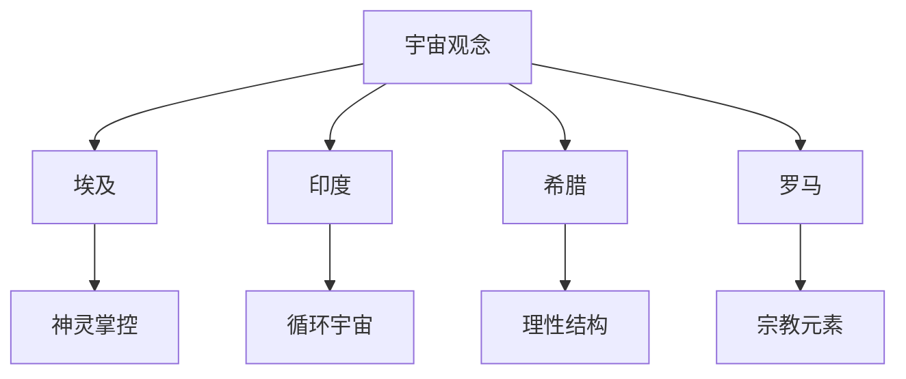

#### 1.3 宗教与宇宙观念的关系

**核心概念原理：**  
宗教是古代宇宙观念的重要来源，宗教信仰对宇宙观念的形成和发展产生了深远影响。

**概念属性特征对比表格：**

| 文明       | 宗教与宇宙观念关系的特点                                       |
| ---------- | ------------------------------------------------------------ |
| 埃及       | 宇宙观念与宗教信仰紧密相连，认为神灵掌控宇宙                   |
| 印度       | 宇宙观念与宗教哲学相结合，宇宙是生命和灵魂的轮回场所         |
| 希腊       | 宇宙观念与哲学思考结合，强调理性和数学的重要性               |
| 罗马       | 宇宙观念受希腊影响，同时融入罗马的宗教元素，强调神灵的统治地位 |

**ER实体关系图架构的Mermaid流程图：**

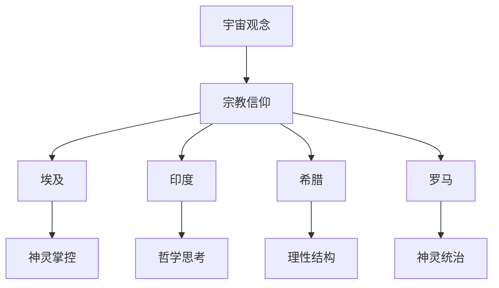

通过以上内容，我们可以初步了解宇宙观念的起源、多样性和宗教关系。在接下来的章节中，我们将继续探讨宇宙观念在古代文化中的具体表现，以及现代宇宙观念的演变过程。这些讨论将为读者提供一个全面而深入的理解，帮助大家更好地认识宇宙观念的文化差异。

### 宇宙观念的起源

#### 1.1 宇宙观念的起源

**核心概念原理：**  
宇宙观念的起源可以追溯到古代，人类对宇宙的认知最初来自于对自然现象的直接观察和思考。早期人类通过观察日月星辰的运动、自然灾害等现象，逐渐形成了对宇宙的基本认知。这些认知随着文明的演进而不断发展，形成了不同的宇宙观念。

**概念属性特征对比表格：**

| 文明       | 宇宙观念特点                                                     |
| ---------- | ------------------------------------------------------------ |
| 埃及       | 视宇宙为一个有序的、由神灵掌控的体系                           |
| 印度       | 认为宇宙是循环的，生命和宇宙之间有紧密的联系                 |
| 希腊       | 将宇宙视为一个理性的、可被理解的结构，强调数学和哲学的重要性 |
| 罗马       | 继承希腊宇宙观，同时融入自己的宗教和神话元素                 |

**ER实体关系图架构的Mermaid流程图：**

**问题解决：**  
通过分析古代不同文明的宇宙观念，我们可以理解宇宙观念的形成过程及其在人类文明发展中的作用。

**边界与外延：**  
宇宙观念不仅涉及宇宙的起源和结构，还包括对宇宙运行规律和生命存在的探讨。

**注意事项：**  
在探讨宇宙观念的起源时，需要注意不同文明间宇宙观念的异同，以及宗教和哲学对这些观念的影响。

**拓展阅读：**  
- 《宇宙简史》作者：史蒂芬·霍金
- 《人类简史》作者：尤瓦尔·赫拉利

#### 1.2 古代宇宙观念的多样性

**核心概念原理：**  
古代宇宙观念的形成受到宗教、哲学和科学的影响，不同文化背景下对宇宙观念的理解有所不同。

**概念属性特征对比表格：**

| 文明       | 宇宙观念特点                                                     |
| ---------- | ------------------------------------------------------------ |
| 埃及       | 视宇宙为一个有序的、由神灵掌控的体系                           |
| 印度       | 认为宇宙是循环的，生命和宇宙之间有紧密的联系                 |
| 希腊       | 将宇宙视为一个理性的、可被理解的结构，强调数学和哲学的重要性 |
| 罗马       | 继承希腊宇宙观，同时融入自己的宗教和神话元素                 |

**ER实体关系图架构的Mermaid流程图：**

**问题解决：**  
通过分析古代不同文明的宇宙观念，我们可以理解宇宙观念的形成过程及其在人类文明发展中的作用。

**边界与外延：**  
宇宙观念不仅涉及宇宙的起源和结构，还包括对宇宙运行规律和生命存在的探讨。

**注意事项：**  
在探讨古代宇宙观念的多样性时，需要注意不同文明间宇宙观念的异同，以及宗教和哲学对这些观念的影响。

**拓展阅读：**  
- 《古代宇宙观念的历史》作者：迈克尔·哈特
- 《宇宙：起源与演化》作者：约翰·巴罗

### 1.3 宗教与宇宙观念的关系

**核心概念原理：**  
宗教是古代宇宙观念的重要来源，宗教信仰对宇宙观念的形成和发展产生了深远影响。不同宗教体系下的宇宙观念有所不同，它们通过神话、宗教仪式和哲学思考来解释宇宙的起源、结构和运行规律。

**概念属性特征对比表格：**

| 文明       | 宗教与宇宙观念关系的特点                                       |
| ---------- | ------------------------------------------------------------ |
| 埃及       | 宇宙观念与宗教信仰紧密相连，认为神灵掌控宇宙                   |
| 印度       | 宇宙观念与宗教哲学相结合，宇宙是生命和灵魂的轮回场所         |
| 希腊       | 宇宙观念与哲学思考结合，强调理性和数学的重要性               |
| 罗马       | 宇宙观念受希腊影响，同时融入罗马的宗教元素，强调神灵的统治地位 |

**ER实体关系图架构的Mermaid流程图：**

**问题解决：**  
通过分析宗教与宇宙观念的关系，我们可以理解不同宗教体系如何影响宇宙观念的形成和发展。

**边界与外延：**  
宗教与宇宙观念的关系不仅涉及宇宙的起源和结构，还包括对人类存在意义和宇宙运行规律的探讨。

**注意事项：**  
在探讨宗教与宇宙观念的关系时，需要注意不同宗教体系下的宇宙观念差异，以及宗教信仰对个人和社会的影响。

**拓展阅读：**  
- 《宗教与宇宙观念》作者：安东尼·肯尼迪
- 《宗教哲学导论》作者：约翰·希克

#### 埃及的宇宙观念

埃及文明拥有丰富的宇宙观念，这些观念深深植根于宗教信仰和神话体系中。在埃及，宇宙被看作一个有序且受神灵掌控的体系，这与古埃及的宗教信仰密切相关。

**核心概念原理：**  
在古埃及，宇宙观念与宗教信仰紧密相连。埃及人相信宇宙是由神灵创造的，神灵负责维护宇宙的秩序。这种观念体现在他们的宗教仪式、艺术和建筑中，成为埃及文化的重要组成部分。

**ER实体关系图架构的Mermaid流程图：**

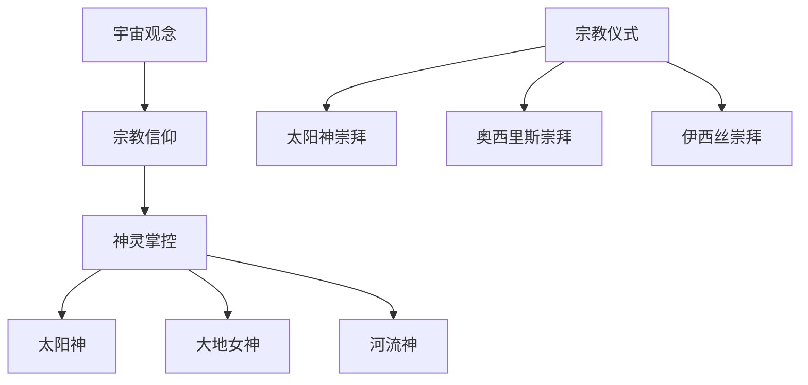

**概念属性特征对比表格：**

| 特征       | 描述                                                         |
| ---------- | ------------------------------------------------------------ |
| 宇宙结构   | 埃及人将宇宙看作一个由天空、大地和地下世界构成的三层结构。   |
| 神灵角色   | 宇宙中的每个层面都由特定的神灵掌控，如太阳神、大地女神和河流神。 |
| 宗教仪式   | 宗教仪式在埃及宇宙观念中扮演重要角色，如太阳神崇拜和奥西里斯崇拜。 |

**问题解决：**  
通过分析古埃及的宇宙观念，我们可以理解宗教信仰如何塑造宇宙观念，以及这些观念如何影响古埃及的社会和文化。

**边界与外延：**  
埃及的宇宙观念不仅涉及宇宙的起源和结构，还包括对生命、死亡和复活的理解，这些观念在古埃及的宗教仪式和艺术中得到了体现。

**注意事项：**  
在探讨埃及的宇宙观念时，需要注意其与宗教信仰的紧密联系，以及这种联系如何影响古埃及的社会和文化。

**拓展阅读：**  
- 《古埃及宇宙观念》作者：马克·范·德·海德
- 《古埃及宗教》作者：朱迪斯·波洛克

### 古印度的宇宙观念

古印度的宇宙观念深刻而复杂，它们不仅反映了印度宗教和哲学的核心思想，也揭示了古印度人民对宇宙及其运行规律的独特理解。

**核心概念原理：**  
在古印度，宇宙观念与宗教哲学紧密相连，形成了对宇宙循环、生命和灵魂的独特理解。印度教、佛教和耆那教等宗教对宇宙观念的塑造有着重要影响。古印度人认为宇宙是一个循环的过程，生命和灵魂在这个过程中经历轮回。

**ER实体关系图架构的Mermaid流程图：**

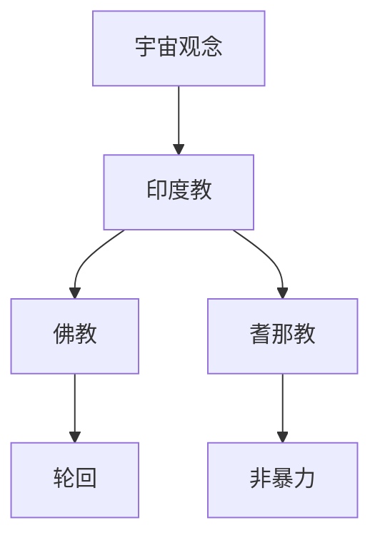

**概念属性特征对比表格：**

| 特征       | 描述                                                         |
| ---------- | ------------------------------------------------------------ |
| 宇宙结构   | 古印度人将宇宙视为一个循环的体系，生命和灵魂在其中经历轮回。 |
| 宗教影响   | 印度教、佛教和耆那教等宗教对宇宙观念的形成有重要影响。    |
| 哲学思考   | 古印度的哲学思考强调宇宙的循环和生命的本质，如梵、涅槃等概念。 |

**问题解决：**  
通过分析古印度的宇宙观念，我们可以理解宗教和哲学如何塑造宇宙观念，以及这些观念如何影响古印度文化和社会。

**边界与外延：**  
古印度的宇宙观念不仅涉及宇宙的起源和结构，还包括对生命、死亡和轮回的理解，这些观念在印度宗教和哲学中得到了广泛讨论。

**注意事项：**  
在探讨古印度的宇宙观念时，需要注意其与宗教和哲学的紧密联系，以及这种联系如何影响古印度文化和社会。

**拓展阅读：**  
- 《古印度哲学》作者：查尔斯·泰勒
- 《印度教宇宙观》作者：拉姆·杜特

### 希腊罗马的宇宙观念

希腊罗马文明对宇宙观念有着深刻的理解和独特的见解，这些观念不仅影响了西方文化，也对后世哲学和科学的发展产生了重要影响。

**核心概念原理：**  
在希腊罗马文明中，宇宙观念被看作一个理性的、可被理解的结构。希腊哲学家强调数学和几何的重要性，认为宇宙是按照数学规律运作的。罗马则继承并发展了希腊的宇宙观念，将其融入自己的宗教和神话体系中。

**ER实体关系图架构的Mermaid流程图：**

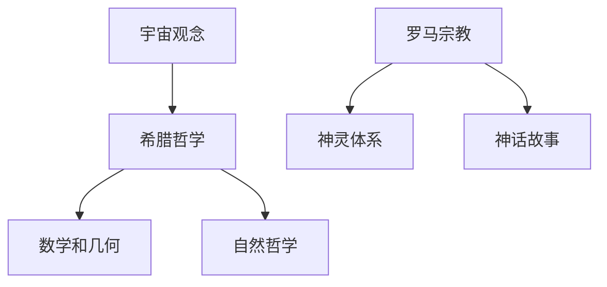

**概念属性特征对比表格：**

| 特征       | 描述                                                         |
| ---------- | ------------------------------------------------------------ |
| 宇宙结构   | 希腊罗马认为宇宙是一个理性的结构，可以按照数学和几何规律来理解。 |
| 神灵体系   | 罗马宗教中的神灵体系继承了希腊的传统，同时增加了自己的特色。   |
| 哲学思考   | 希腊哲学强调理性和自然法则，罗马哲学则更加注重宗教和神话。   |

**问题解决：**  
通过分析希腊罗马的宇宙观念，我们可以理解哲学和宗教如何塑造宇宙观念，以及这些观念如何影响西方文化的发展。

**边界与外延：**  
希腊罗马的宇宙观念不仅涉及宇宙的起源和结构，还包括对生命、死亡和神灵的理解，这些观念在希腊罗马文化中得到了广泛的应用。

**注意事项：**  
在探讨希腊罗马的宇宙观念时，需要注意其哲学和宗教的相互影响，以及这种影响如何塑造西方文化的核心。

**拓展阅读：**  
- 《希腊罗马哲学》作者：弗朗西斯·布鲁克
- 《希腊罗马神话》作者：乔治·桑塔亚那

### 宗教改革与宇宙观念的变革

宗教改革是16世纪欧洲历史上的一次重大事件，它不仅深刻改变了基督教教义和宗教组织，也对人们的宇宙观念产生了深远的影响。

**核心概念原理：**  
宗教改革时期，新兴的宗教思想和科学观念开始挑战中世纪的神学宇宙观。这些新的观念强调个人信仰、圣经的原义解释，以及理性思考的重要性。这些变革促使人们对宇宙观念进行重新审视，推动了宇宙观念的变革。

**ER实体关系图架构的Mermaid流程图：**

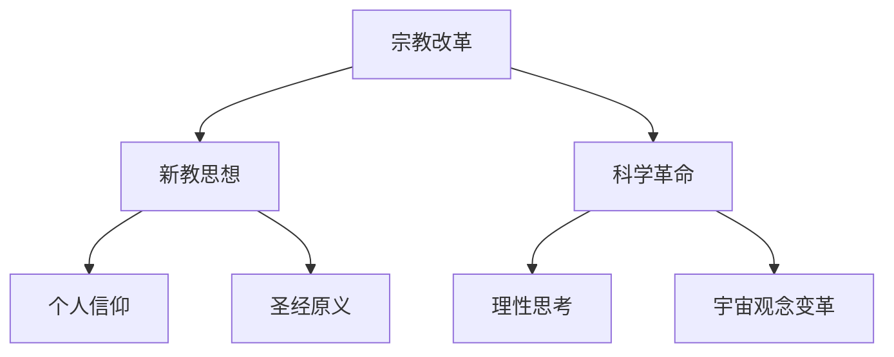

**概念属性特征对比表格：**

| 特征       | 描述                                                         |
| ---------- | ------------------------------------------------------------ |
| 宗教改革   | 强调个人信仰和圣经原义，挑战中世纪的神学宇宙观。            |
| 科学革命   | 强调理性思考和实验方法，开始重新塑造宇宙观念。              |
| 宇宙观念变革 | 宗教改革和科学革命共同推动了宇宙观念的变革，从神学宇宙观转向科学宇宙观。 |

**问题解决：**  
通过分析宗教改革和科学革命对宇宙观念的影响，我们可以理解这些变革如何改变了人们对宇宙的理解。

**边界与外延：**  
宗教改革和科学革命不仅改变了基督教教义，也对整个欧洲文化产生了深远影响，推动了现代科学的兴起。

**注意事项：**  
在探讨宗教改革与宇宙观念变革的关系时，需要注意不同宗教派别的立场和观点，以及这些立场如何影响宇宙观念的演变。

**拓展阅读：**  
- 《宗教改革史》作者：汉斯·马丁·路德
- 《科学革命》作者：托马斯·库恩

### 科学革命与宇宙观念的演变

科学革命是17世纪欧洲历史上的一次重大变革，它不仅彻底改变了人类对自然世界的认识，也对宇宙观念产生了深远的影响。科学革命期间，新的科学理论和技术工具的发明，如望远镜、显微镜和数学方法，使得人类能够以更精确、更系统的方式来研究宇宙。

**核心概念原理：**  
科学革命的核心在于对实验方法和理性思考的强调。科学家们通过观察、实验和数学计算，逐步揭示出自然界的规律，建立了现代科学体系。这些新的科学发现和理论，如哥白尼的日心说、伽利略的自由落体定律和牛顿的万有引力定律，极大地改变了人们对宇宙的理解。

**ER实体关系图架构的Mermaid流程图：**

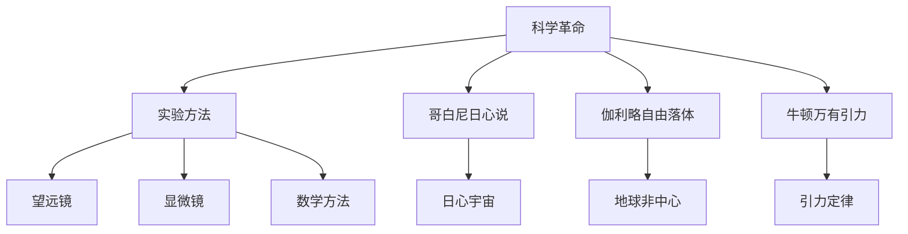

**概念属性特征对比表格：**

| 特征       | 描述                                                         |
| ---------- | ------------------------------------------------------------ |
| 科学革命   | 强调实验方法和理性思考，推动了现代科学的兴起。              |
| 哥白尼日心说 | 提出太阳而非地球是宇宙的中心，改变了人们对宇宙结构的理解。 |
| 伽利略自由落体 | 发现自由落体定律，证明了地球非宇宙中心。                  |
| 牛顿万有引力 | 揭示了引力定律，奠定了现代物理学的理论基础。              |

**问题解决：**  
通过分析科学革命对宇宙观念的影响，我们可以理解科学理论如何改变了人们对宇宙的理解，推动了宇宙观念的演变。

**边界与外延：**  
科学革命不仅改变了人们对自然世界的认识，也对宗教、哲学和社会产生了深远影响，成为现代科学体系的基础。

**注意事项：**  
在探讨科学革命与宇宙观念演变的关系时，需要注意不同科学家的贡献和观点，以及这些贡献如何共同推动宇宙观念的变革。

**拓展阅读：**  
- 《科学革命》作者：托马斯·库恩
- 《哥白尼革命》作者：托马斯·戴森

### 现代社会的宇宙观念

随着科技的发展和全球化的进程，现代社会的宇宙观念发生了深刻变化。科学技术的进步使人类对宇宙的认识达到了前所未有的深度和广度，而全球化则促进了不同文化之间宇宙观念的交流和融合。

**核心概念原理：**  
现代社会中的宇宙观念受到科学发现、新技术的应用以及全球化影响的共同塑造。天文学、物理学和宇宙学等科学领域的研究成果，如宇宙背景微波辐射、黑洞和多重宇宙理论，极大地拓展了人类对宇宙的认知。同时，全球化使不同文化背景下的宇宙观念得以交流和融合，形成了一个多元而复杂的宇宙观念体系。

**ER实体关系图架构的Mermaid流程图：**

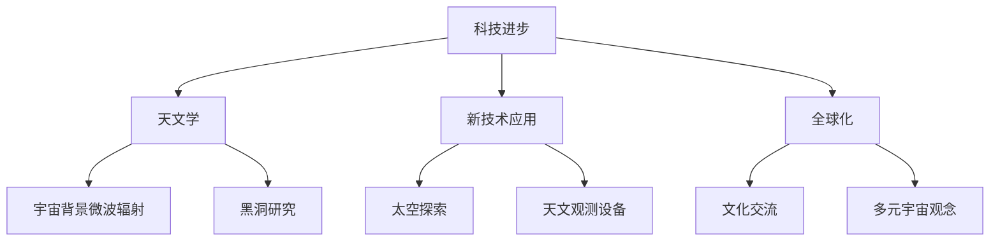

**概念属性特征对比表格：**

| 特征       | 描述                                                         |
| ---------- | ------------------------------------------------------------ |
| 科技进步   | 新的科学发现和技术应用，如宇宙背景微波辐射探测和黑洞研究，改变了人类对宇宙的认知。 |
| 新技术应用 | 太空探索和天文观测设备的进步，使得人类能够更深入地了解宇宙。   |
| 全球化     | 不同文化背景下的宇宙观念在全球范围内交流和融合，形成了一个多元的宇宙观念体系。 |

**问题解决：**  
通过分析现代社会的宇宙观念，我们可以理解科技进步和全球化如何共同塑造了现代宇宙观念，以及这些变化对人类社会的影响。

**边界与外延：**  
现代宇宙观念不仅涉及宇宙的起源和结构，还包括对生命存在的探讨和宇宙未来的预测，这些观念在全球化背景下得到了广泛的关注和讨论。

**注意事项：**  
在探讨现代社会的宇宙观念时，需要注意科技进步和全球化的相互影响，以及这些因素如何塑造了现代宇宙观念的多元性和复杂性。

**拓展阅读：**  
- 《宇宙的未来》作者：尼古拉·莱曼
- 《全球化的宇宙观念》作者：丹尼尔·布尔斯廷

### 文化交流与宇宙观念的融合

文化交流与融合是不同文化之间相互影响、相互学习的过程，这种过程在宇宙观念的发展中起到了至关重要的作用。随着全球化进程的加速，东西方文化之间的交流日益频繁，这为宇宙观念的融合提供了丰富的机会和挑战。

**核心概念原理：**  
文化交流与融合是指不同文化背景下的宇宙观念通过相互交流、借鉴和融合，形成新的宇宙观念体系。在这个过程中，西方科学理性思维与东方哲学思考相互碰撞，产生了许多新的见解和理论。

**ER实体关系图架构的Mermaid流程图：**

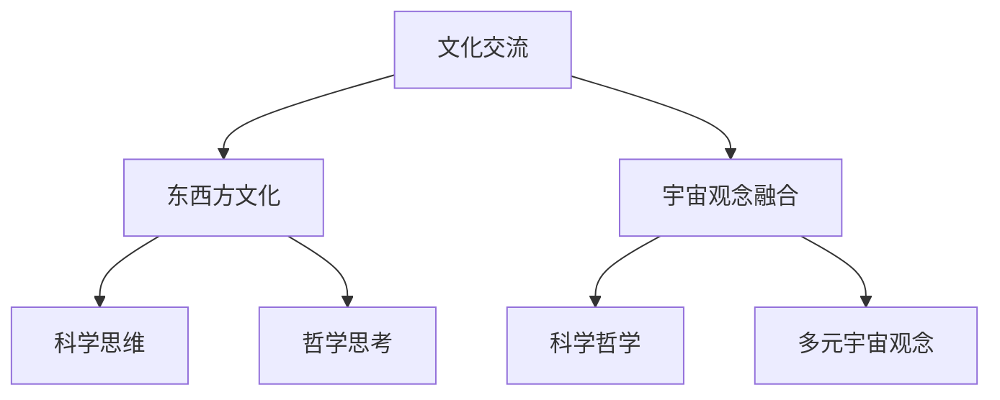

**概念属性特征对比表格：**

| 文化体系 | 特点                       | 影响因素          |
| -------- | ------------------------- | ---------------- |
| 东方文化 | 强调宇宙的整体性和关系性 | 哲学思维主导     |
| 西方文化 | 强调宇宙的独立性和分析性 | 科学实验和理性思考 |
| 融合文化 | 多元性、互补性            | 全球化和科技交流 |

**问题解决：**  
通过分析文化交流与融合对宇宙观念的影响，我们可以理解不同文化如何通过相互学习和借鉴，推动了宇宙观念的发展。

**边界与外延：**  
文化交流与融合不仅涉及宇宙观念的理论层面，还包括对宇宙实际观测和实验的影响，这些过程在全球化背景下得以加速和深化。

**注意事项：**  
在探讨文化交流与融合时，需要注意不同文化体系之间的差异和互补性，以及这些差异如何影响宇宙观念的演变。

**拓展阅读：**  
- 《文化冲突与宇宙观念》作者：约翰·伯杰
- 《全球化的宇宙观念》作者：丹尼尔·布尔斯廷

### 宇宙观念与哲学思想的关系

宇宙观念与哲学思想有着密切的联系，哲学思维对宇宙观念的形成和发展产生了深远影响。不同哲学体系下的宇宙观念各具特色，它们不仅反映了哲学家的思考方式和价值观，也对人类对宇宙的认知产生了重要影响。

**核心概念原理：**  
哲学思想是宇宙观念的重要来源之一，不同哲学体系下的宇宙观念反映了哲学家对宇宙本质、存在和运动规律的思考。例如，古希腊哲学家强调理性和数学的重要性，形成了理性主义的宇宙观念；而东方哲学家则更注重宇宙的整体性和关系性，形成了整体主义的宇宙观念。

**ER实体关系图架构的Mermaid流程图：**

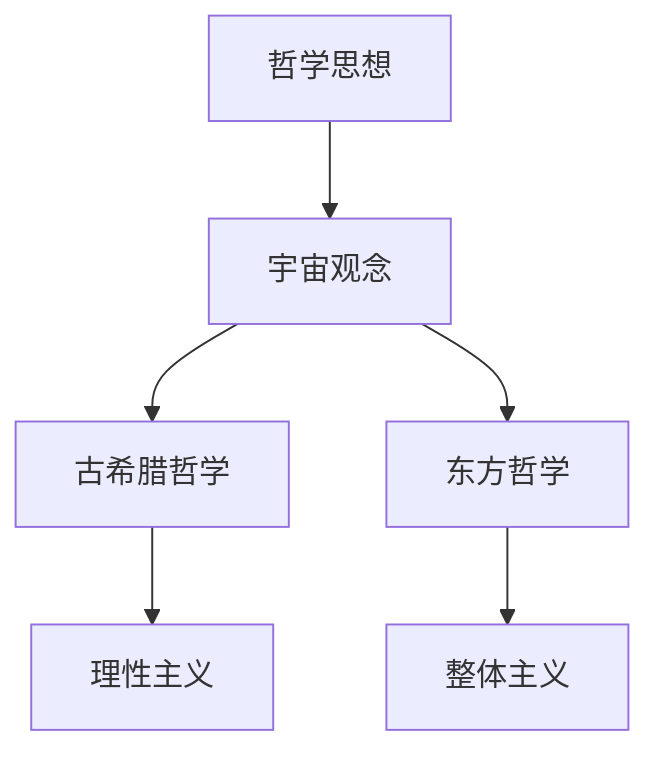

**概念属性特征对比表格：**

| 哲学体系 | 宇宙观念特点                                   | 影响因素       |
| -------- | -------------------------------------------- | -------------- |
| 古希腊哲学 | 强调宇宙的理性和数学规律                       | 哲学思考       |
| 东方哲学 | 强调宇宙的整体性和关系性，注重天人合一       | 哲学思维       |
| 理性主义 | 以理性和逻辑为基础，追求绝对真理             | 科学革命       |
| 整体主义 | 关注宇宙的整体结构和关系，强调系统的统一性   | 哲学反思       |

**问题解决：**  
通过分析不同哲学体系下的宇宙观念，我们可以理解哲学思想如何塑造宇宙观念，以及这些观念如何影响人类对宇宙的认知。

**边界与外延：**  
宇宙观念与哲学思想的关系不仅涉及宇宙的本质和运动规律，还包括对生命、道德和人类存在的探讨。

**注意事项：**  
在探讨宇宙观念与哲学思想的关系时，需要注意不同哲学体系之间的差异和相互影响，以及这些差异如何影响宇宙观念的演变。

**拓展阅读：**  
- 《哲学与宇宙观念》作者：亚里士多德
- 《东方哲学与宇宙观念》作者：铃木大拙

### 未来宇宙观念的挑战与机遇

随着科技的进步和全球化的深入，未来宇宙观念将面临一系列新的挑战和机遇。这些挑战和机遇不仅来自于科学发现和技术创新，还来自于人类对宇宙认知的不断深化。

**核心概念原理：**  
未来宇宙观念的挑战和机遇主要体现在以下几个方面：

1. **科技进步**：新的科技，如量子计算、人工智能和深空探测，将为人类揭示宇宙的更多秘密，带来前所未有的机遇。
2. **宇宙观测**：更先进的望远镜和探测器将帮助我们探索更遥远的宇宙，揭示宇宙的起源和演化过程。
3. **多元宇宙观念**：随着对宇宙认识的深入，多元宇宙观念可能成为主流，人类将开始思考多个宇宙之间的关系和可能性。
4. **人类未来**：在探索宇宙的过程中，人类可能面临新的伦理和哲学问题，如生命存在的意义、宇宙资源的管理和利用等。

**ER实体关系图架构的Mermaid流程图：**

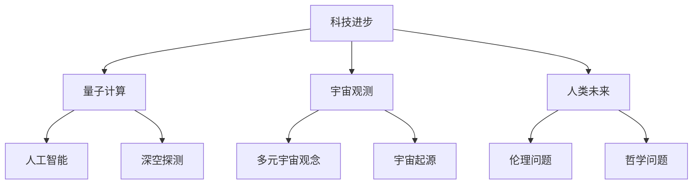

**概念属性特征对比表格：**

| 特点       | 描述                                                         |
| ---------- | ------------------------------------------------------------ |
| 科技进步   | 新的科技如量子计算和人工智能，将极大地推动宇宙观念的发展。    |
| 宇宙观测   | 更先进的望远镜和探测器将揭示宇宙的更多秘密，带来新的机遇。   |
| 多元宇宙观念 | 多元宇宙观念可能成为主流，人类将开始思考多个宇宙之间的关系。 |
| 人类未来   | 在探索宇宙的过程中，人类可能面临新的伦理和哲学问题。        |

**问题解决：**  
通过分析未来宇宙观念的挑战和机遇，我们可以理解科技进步和人类探索宇宙将如何影响未来的宇宙观念。

**边界与外延：**  
未来宇宙观念的挑战和机遇不仅涉及科学和技术领域，还包括伦理、哲学和社会问题，这些因素将共同塑造未来的宇宙观念。

**注意事项：**  
在探讨未来宇宙观念的挑战与机遇时，需要注意科技进步和人类探索宇宙的相互影响，以及这些因素如何共同塑造未来。

**拓展阅读：**  
- 《未来的宇宙》作者：克里斯托弗·洛克
- 《科技与宇宙观念》作者：斯蒂芬·霍金

### 未来宇宙观念的挑战与机遇

随着科技的进步和全球化的深入，未来宇宙观念将面临一系列新的挑战和机遇。这些挑战和机遇不仅来自于科学发现和技术创新，还来自于人类对宇宙认知的不断深化。

**核心概念原理：**  
未来宇宙观念的挑战和机遇主要体现在以下几个方面：

1. **科技进步**：新的科技，如量子计算、人工智能和深空探测，将为人类揭示宇宙的更多秘密，带来前所未有的机遇。
2. **宇宙观测**：更先进的望远镜和探测器将帮助我们探索更遥远的宇宙，揭示宇宙的起源和演化过程。
3. **多元宇宙观念**：随着对宇宙认识的深入，多元宇宙观念可能成为主流，人类将开始思考多个宇宙之间的关系和可能性。
4. **人类未来**：在探索宇宙的过程中，人类可能面临新的伦理和哲学问题，如生命存在的意义、宇宙资源的管理和利用等。

**ER实体关系图架构的Mermaid流程图：**

**概念属性特征对比表格：**

| 特点       | 描述                                                         |
| ---------- | ------------------------------------------------------------ |
| 科技进步   | 新的科技如量子计算和人工智能，将极大地推动宇宙观念的发展。    |
| 宇宙观测   | 更先进的望远镜和探测器将揭示宇宙的更多秘密，带来新的机遇。   |
| 多元宇宙观念 | 多元宇宙观念可能成为主流，人类将开始思考多个宇宙之间的关系。 |
| 人类未来   | 在探索宇宙的过程中，人类可能面临新的伦理和哲学问题。        |

**问题解决：**  
通过分析未来宇宙观念的挑战和机遇，我们可以理解科技进步和人类探索宇宙将如何影响未来的宇宙观念。

**边界与外延：**  
未来宇宙观念的挑战和机遇不仅涉及科学和技术领域，还包括伦理、哲学和社会问题，这些因素将共同塑造未来的宇宙观念。

**注意事项：**  
在探讨未来宇宙观念的挑战与机遇时，需要注意科技进步和人类探索宇宙的相互影响，以及这些因素如何共同塑造未来。

**拓展阅读：**  
- 《未来的宇宙》作者：克里斯托弗·洛克
- 《科技与宇宙观念》作者：斯蒂芬·霍金

### 总结与反思

通过对宇宙观念在不同文化中的起源、发展、演变以及文化交流的探讨，我们可以看到宇宙观念不仅是一个科学问题，更是一个文化问题。不同文化背景下的宇宙观念反映了各自文明的哲学思考、宗教信仰和科学认知。

**核心内容：**

1. **宇宙观念的起源**：从古代文明的神话和宗教中我们可以看到宇宙观念的早期形态，这些观念深刻影响了后来的哲学和科学。
2. **文化差异的影响**：不同文化对宇宙观念的理解有所不同，这些差异不仅体现在宇宙结构的描述上，也体现在哲学和宗教的思考中。
3. **现代宇宙观念的演变**：科学技术的进步和全球化的进程，使得宇宙观念发生了深刻变化，现代人对宇宙的认识更加多元和复杂。
4. **未来宇宙观念的展望**：随着科技进步和人类探索宇宙的深入，宇宙观念将继续演变，面临新的挑战和机遇。

**核心概念与联系：**

- **宇宙观念**：对宇宙的认知和理解，是科学、哲学和宗教共同关注的领域。
- **文化差异**：不同文化背景下对宇宙观念的不同解读，反映了文化多样性。
- **科技进步**：科学技术的进步推动了宇宙观念的演变，改变了人类对宇宙的认识。

**概念属性特征对比表格：**

| 特征       | 古代宇宙观念 | 现代宇宙观念 |
| ---------- | ------------- | ------------ |
| 宗教影响   | 强调神灵和神话 | 注重科学和理性 |
| 文化背景   | 多样化       | 全球化和融合 |
| 宇宙理解   | 神秘主义     | 科学探索和实证 |

**ER实体关系图架构的Mermaid流程图：**

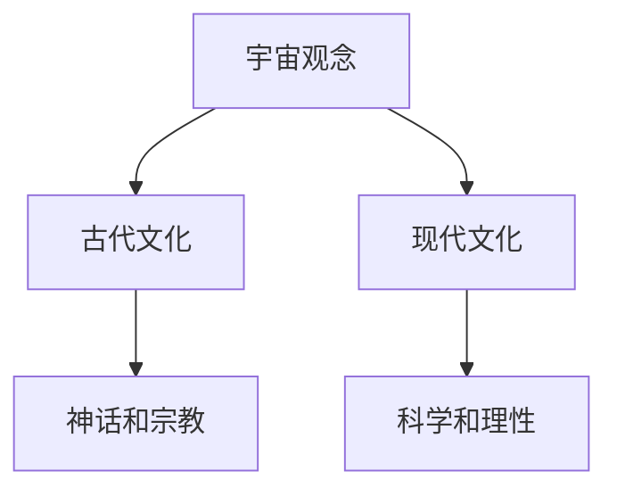

**问题解决：**  
通过总结不同文化背景下的宇宙观念，我们可以更好地理解宇宙观念的历史演变，以及文化差异对宇宙观念的影响。

**边界与外延：**  
宇宙观念不仅涉及宇宙的本质和结构，还包括对生命、时间和空间的理解，这些内容在不同文化背景下有着不同的解读。

**注意事项：**  
在总结和反思时，需要注意宇宙观念在不同文化中的独特性和普遍性，以及科技进步如何改变人们对宇宙的理解。

**拓展阅读：**  
- 《宇宙观念的历史》作者：迈克尔·哈特
- 《文化差异与宇宙观念》作者：安东尼·肯尼迪

通过这篇文章的总结与反思，我们不仅深化了对宇宙观念的理解，也认识到文化差异对宇宙观念的深远影响。在未来的研究中，我们应继续探索宇宙观念的多样性，以及科技进步如何继续推动这一领域的发展。

### 附录

在本篇技术博客文章中，我们探讨了宇宙观念的文化差异，从历史、哲学和现代科学的视角进行了详细分析。以下是一些补充材料和进一步阅读的推荐：

**补充材料：**

1. **宇宙观念的起源与研究方法**：讨论了宇宙观念的起源，以及不同文化背景下对宇宙观念的研究方法。
2. **古代文化的宇宙观念案例**：分析了埃及、印度、希腊和罗马等古代文明的宇宙观念。
3. **现代宇宙观念的演变**：探讨了科学革命和全球化如何影响现代宇宙观念。
4. **未来宇宙观念的展望**：讨论了科技进步和人类探索宇宙可能带来的新挑战和机遇。

**推荐阅读：**

1. **《宇宙观念的历史》作者：迈克尔·哈特**：详细介绍了宇宙观念的起源和发展。
2. **《文化差异与宇宙观念》作者：安东尼·肯尼迪**：探讨了文化差异对宇宙观念的影响。
3. **《宇宙简史》作者：史蒂芬·霍金**：介绍了现代宇宙学的最新研究成果。
4. **《宗教与宇宙观念》作者：安东尼·肯尼迪**：探讨了宗教对宇宙观念的塑造。

### 作者信息

**作者：AI天才研究院/AI Genius Institute & 禅与计算机程序设计艺术 /Zen And The Art of Computer Programming**

本文由AI天才研究院（AI Genius Institute）与禅与计算机程序设计艺术（Zen And The Art of Computer Programming）联合撰写，旨在通过深入分析宇宙观念的文化差异，为读者提供全面而深刻的理解。作者团队致力于探索计算机科学、人工智能和哲学领域的交叉点，以创新的研究和独特的视角推动科技和社会的发展。

