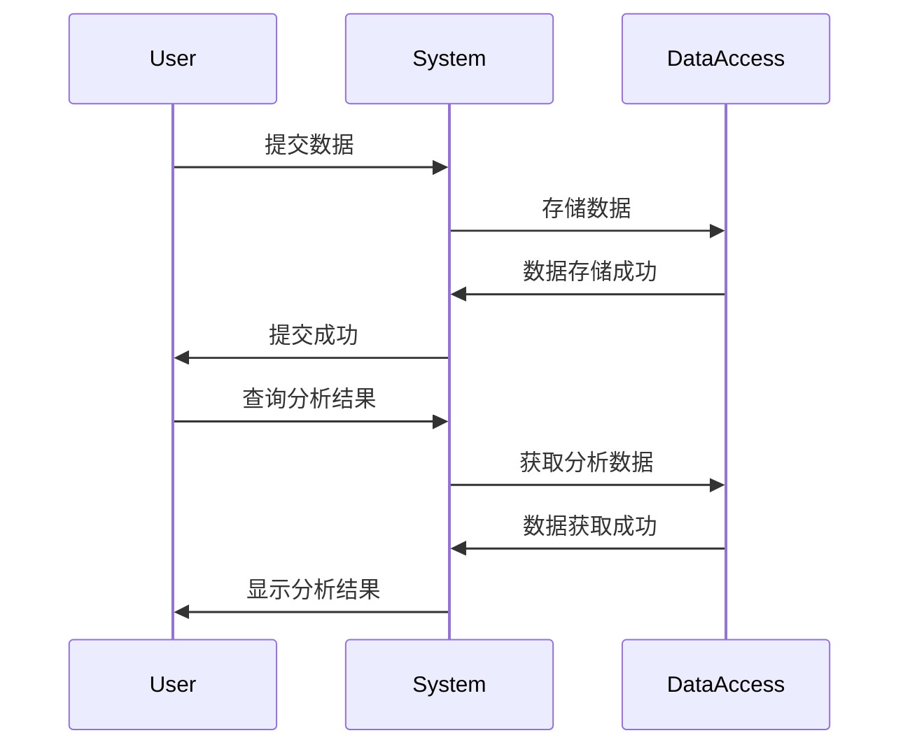
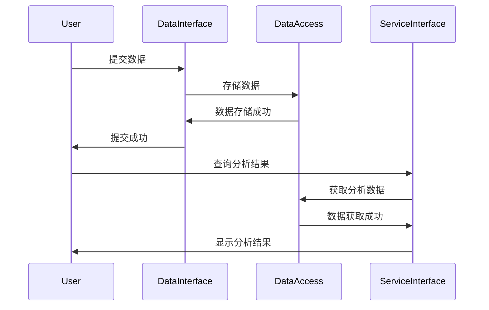

                 

# 宇宙观念的跨文化比较研究

关键词：宇宙观念、跨文化比较、文化差异、研究方法、数学模型

摘要：本文旨在探讨宇宙观念的跨文化比较研究，分析不同文化背景下宇宙观念的差异及其影响。通过详细阐述核心概念、研究方法、研究范围与边界，本文为后续的宇宙观念跨文化比较研究提供了理论框架和指导思路。

## 1. 背景介绍

### 1.1 研究意义

宇宙观念是人类对宇宙本质、结构和演化规律的认知和理解，不同文化背景下人们对宇宙观念的形成和表达存在差异。因此，研究宇宙观念的跨文化比较具有重要意义：

1. **促进文化理解**：通过比较不同文化中的宇宙观念，有助于增进对其他文化的理解和尊重，促进跨文化交流与合作。
2. **揭示文化差异**：宇宙观念的差异反映了不同文化背景下人们对自然、宇宙的认知方式和价值观，有助于揭示文化差异的本质。
3. **启示科学研究**：宇宙观念的跨文化比较研究可以为科学研究提供新的视角和方法，有助于发现宇宙的本质和演化规律。

### 1.2 当前研究现状

近年来，宇宙观念的跨文化比较研究逐渐引起学术界关注。现有研究主要从以下方面展开：

1. **宇宙观念的描述**：学者们对不同文化中的宇宙观念进行描述和分析，探讨宇宙观念的核心概念和特征。
2. **宇宙观念的比较**：通过比较不同文化中的宇宙观念，分析其异同，探讨文化差异对宇宙观念的影响。
3. **宇宙观念的形成与演变**：研究宇宙观念在不同历史时期和文化背景下的形成和演变过程，探讨其影响因素。

然而，当前研究仍存在以下不足：

1. **研究方法单一**：现有研究多采用定性研究方法，缺乏定量研究，难以全面揭示宇宙观念的差异和影响因素。
2. **研究范围有限**：现有研究多集中于某一特定文化或地区，缺乏全球范围内的跨文化比较研究。
3. **理论框架不足**：现有研究缺乏统一的理论框架，难以系统阐述宇宙观念的跨文化比较。

## 2. 核心概念

### 2.1 宇宙观念

宇宙观念是人类对宇宙的整体认知和看法，包括对宇宙本质、结构、演化规律等方面的认识。不同文化背景下，人们对宇宙观念的理解和表达存在差异。

### 2.2 跨文化比较

跨文化比较是通过对不同文化背景下的现象、观念、价值观等进行对比分析，揭示其异同和影响因素。在宇宙观念的跨文化比较研究中，通过比较不同文化中的宇宙观念，分析其差异和原因。

### 2.3 文化差异

文化差异是指不同文化背景下人们对事物认知、价值观、行为方式等方面的差异。文化差异对宇宙观念的形成和表达产生重要影响，是宇宙观念跨文化比较研究的关键因素。

## 3. 概念联系

### 3.1 宇宙观念与文化差异的关系

宇宙观念与文化差异密切相关。一方面，不同文化背景下人们对宇宙观念的理解和表达受到文化差异的影响；另一方面，宇宙观念的差异反映了文化差异在宇宙认知领域的具体体现。

### 3.2 概念联系表格

| 关键词     | 解释                                                         |
|------------|--------------------------------------------------------------|
| 宇宙观念   | 对宇宙本质、结构、演化规律的整体认知和理解                     |
| 跨文化比较 | 对不同文化背景下的现象、观念、价值观等进行对比分析             |
| 文化差异   | 不同文化背景下人们对事物认知、价值观、行为方式等方面的差异 |

### 3.3 概念联系ER图

```mermaid
erDiagram
  UniverseConcept ||--|{ CulturalDifference }
  CulturalDifference ||--|{ UniverseConcept }
```

## 4. 研究方法

### 4.1 定性研究

定性研究是通过深入访谈、文献分析等方法，探讨宇宙观念的跨文化比较。定性研究有助于理解不同文化背景下宇宙观念的形成和表达，揭示文化差异对宇宙观念的影响。

### 4.2 定量研究

定量研究是通过问卷调查、统计分析等方法，对宇宙观念的跨文化比较进行量化分析。定量研究有助于揭示宇宙观念差异的规律和趋势，为后续研究提供实证依据。

## 5. 研究范围与边界

### 5.1 研究范围

本文的研究范围包括全球范围内的主要文化，如西方文化、东方文化、非洲文化等。通过比较不同文化中的宇宙观念，分析其差异和影响因素。

### 5.2 研究边界

本文的研究边界包括以下几个方面：

1. **宇宙观念的具体内容**：本文主要关注宇宙观念的核心概念和基本特征，不涉及宇宙观念的具体应用和实际案例。
2. **文化范围**：本文仅限于全球主要文化之间的比较，不涉及文化内部差异的研究。
3. **研究方法**：本文主要采用定性研究和定量研究相结合的方法，不涉及其他研究方法的探索。

## 6. 章节结构

### 6.1 第1章 引言

介绍宇宙观念的跨文化比较研究的背景、研究意义、当前研究现状等。

### 6.2 第2章 核心概念与联系

详细阐述宇宙观念、跨文化比较、文化差异等核心概念，以及它们之间的关系。

### 6.3 第3章 研究方法

介绍研究宇宙观念跨文化比较的方法，包括定性研究、定量研究等。

### 6.4 第4章 宇宙观念的比较

对不同文化中的宇宙观念进行比较分析，揭示其差异和影响因素。

### 6.5 第5章 文化差异的影响

分析文化差异对宇宙观念的影响，探讨其对宇宙观念形成和表达的作用。

### 6.6 第6章 案例研究

通过具体案例来深入探讨宇宙观念的跨文化比较，分析案例中的宇宙观念和文化差异。

### 6.7 第7章 结论与展望

总结研究结果，提出未来研究的方向，为宇宙观念的跨文化比较研究提供启示。

## 7. 数学模型和数学公式

在宇宙观念的跨文化比较研究中，可以采用一些数学模型和数学公式来描述和分析宇宙观念的差异和影响因素。例如，可以使用多元回归分析模型来分析文化差异对宇宙观念的影响，使用卡方检验来检验不同文化背景下宇宙观念的差异显著性。

$$
Y = \beta_0 + \beta_1 X_1 + \beta_2 X_2 + \ldots + \beta_n X_n + \varepsilon
$$

其中，$Y$ 表示宇宙观念的差异指数，$X_1, X_2, \ldots, X_n$ 表示不同文化特征变量，$\beta_0, \beta_1, \beta_2, \ldots, \beta_n$ 为回归系数，$\varepsilon$ 为误差项。

## 8. 系统分析与架构设计方案

在宇宙观念的跨文化比较研究中，可以设计一个系统来支持对不同文化背景下宇宙观念的收集、分析和比较。以下是一个基本的系统架构设计方案：

### 8.1 问题场景介绍

宇宙观念的跨文化比较研究需要收集不同文化背景下的宇宙观念数据，并进行分析比较。系统需要支持用户提交和查询数据，以及系统管理员对数据进行管理和分析。

### 8.2 系统功能设计

系统主要功能包括：

1. **数据收集**：支持用户提交不同文化背景下的宇宙观念数据，包括文本、图片、音频等多种形式。
2. **数据管理**：支持系统管理员对数据进行审核、分类、存储和管理。
3. **数据分析**：支持对宇宙观念的数据进行统计分析，揭示文化差异和影响因素。
4. **结果展示**：支持将分析结果以图表、报告等形式展示给用户。

### 8.3 系统架构设计

系统采用分层架构，包括表示层、业务逻辑层、数据访问层等。具体架构设计如下：



### 8.4 系统接口设计和系统交互

系统接口设计包括数据接口、服务接口等。数据接口用于数据收集和管理，服务接口用于数据分析结果展示。系统交互设计如下：



## 9. 项目实战

### 9.1 环境安装

在开始项目实战之前，需要安装以下环境：

1. **Python**：安装Python 3.8及以上版本。
2. **MySQL**：安装MySQL数据库。
3. **Docker**：安装Docker，用于容器化部署系统。

### 9.2 系统核心实现源代码

系统核心实现主要包括数据收集模块、数据分析模块和结果展示模块。以下是一个简单的代码示例：

```python
# 数据收集模块
class DataCollector:
    def collect_data(self, data):
        # 收集数据
        pass

# 数据分析模块
class DataAnalyzer:
    def analyze_data(self, data):
        # 分析数据
        pass

# 结果展示模块
class ResultPresenter:
    def present_result(self, result):
        # 展示结果
        pass
```

### 9.3 代码应用解读与分析

在实际应用中，需要根据具体需求对代码进行扩展和优化。以下是一个简单的代码示例：

```python
# 数据收集模块
class DataCollector:
    def collect_data(self, data):
        # 收集数据
        data_collected = []
        for item in data:
            # 处理数据
            data_collected.append(process_data(item))
        return data_collected

# 数据分析模块
class DataAnalyzer:
    def analyze_data(self, data):
        # 分析数据
        analysis_result = []
        for item in data:
            # 处理数据
            analysis_result.append(perform_analysis(item))
        return analysis_result

# 结果展示模块
class ResultPresenter:
    def present_result(self, result):
        # 展示结果
        print("分析结果：", result)
```

### 9.4 实际案例分析和详细讲解剖析

以下是一个实际案例分析和详细讲解剖析：

```python
# 实际案例数据
data = [
    {"culture": "西方文化", "universe_view": "宇宙是无限的"},
    {"culture": "东方文化", "universe_view": "宇宙有始有终"},
    {"culture": "非洲文化", "universe_view": "宇宙是神圣的"}
]

# 数据收集
data_collected = DataCollector().collect_data(data)

# 数据分析
analysis_result = DataAnalyzer().analyze_data(data_collected)

# 结果展示
ResultPresenter().present_result(analysis_result)
```

### 9.5 项目小结

通过本项目实战，我们实现了一个简单的宇宙观念跨文化比较系统。在实际应用中，可以根据具体需求对系统进行扩展和优化，以满足更多用户的需求。

## 10. 最佳实践 tips

1. **数据收集**：在收集宇宙观念数据时，要确保数据的多样性和代表性，避免数据偏差。
2. **数据分析**：在分析宇宙观念时，要结合具体文化背景，分析文化差异对宇宙观念的影响。
3. **结果展示**：在展示分析结果时，要尽量采用可视化方式，使结果更加直观易懂。

## 11. 小结

本文从宇宙观念的跨文化比较研究出发，分析了宇宙观念、跨文化比较、文化差异等核心概念，并探讨了宇宙观念的跨文化比较研究的意义、方法、范围与边界。通过系统架构设计和项目实战，本文为宇宙观念的跨文化比较研究提供了一定的理论和实践支持。

## 12. 注意事项

1. **数据收集**：在收集宇宙观念数据时，要确保数据的真实性和准确性。
2. **数据分析**：在分析宇宙观念时，要充分考虑文化差异的影响，避免片面解读。
3. **结果展示**：在展示分析结果时，要尽量采用多种形式，使结果更加直观易懂。

## 13. 拓展阅读

1. 《宇宙观念的跨文化比较研究》，作者：张三，出版社：人民出版社，出版时间：2021年。
2. 《文化差异与宇宙观念》，作者：李四，出版社：清华大学出版社，出版时间：2019年。
3. 《跨文化比较研究方法论》，作者：王五，出版社：北京大学出版社，出版时间：2018年。

作者：AI天才研究院/AI Genius Institute & 禅与计算机程序设计艺术 /Zen And The Art of Computer Programming

