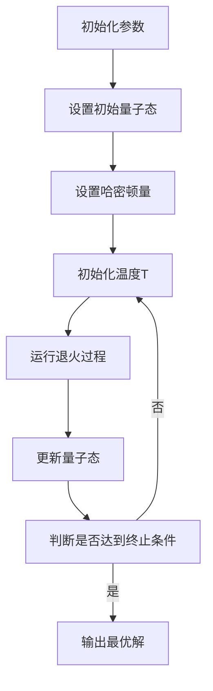

                 

### 宇宙规律概述

#### 第1章：宇宙规律探秘

##### 1.1 宇宙的基本特征

宇宙，这是我们居住的空间，一个浩瀚无垠的存在。关于宇宙的起源，科学家们普遍认为是在大约138亿年前，发生了一次被称为“大爆炸”的事件，从此宇宙开始膨胀、演化。宇宙的基本特征可以从以下几个方面进行概述：

- **宇宙的起源**：大爆炸理论认为，宇宙最初是一个高密度、高温的状态，然后开始迅速膨胀和冷却。这一过程产生了宇宙中所有的物质和能量。
- **宇宙的膨胀与结构**：宇宙正在不断膨胀，而且这种膨胀的速度还在加速。宇宙的结构主要由星系组成，星系之间通过引力相互吸引和作用。

##### 1.2 宇宙中的主要力量

宇宙中存在着多种基本力量，它们对宇宙的演化和结构产生了深远的影响。这些力量主要包括：

- **万有引力**：这是宇宙中最基本的力，它使得物体相互吸引，是星系、星团等结构形成的基础。
- **强相互作用**：它维持原子核的稳定性，是粒子间相互作用中最强的力。
- **弱相互作用**：它负责某些类型的放射性衰变，如β衰变。
- **电磁力**：它使得带电粒子之间相互吸引或排斥，是宇宙中最常见的力。

##### 1.3 宇宙中的物质与能量

宇宙中的物质和能量是宇宙演化的基础。物质由原子、分子等组成，而能量则表现为动能、势能等形式。以下是一些关于宇宙物质与能量的基本概念：

- **物质的组成**：宇宙中的物质主要由氢、氦等轻元素组成，这些元素通过核聚变反应形成更重的元素。
- **能量的转换与守恒**：能量在宇宙中可以以多种形式存在，如光能、热能、化学能等，但根据能量守恒定律，能量在转化过程中总量保持不变。

##### 1.4 宇宙演化历史

宇宙的演化历史可以分为以下几个阶段：

- **宇宙早期的状态**：在大爆炸后的最初几分钟内，宇宙处于极高的温度和密度状态，随后开始膨胀和冷却。
- **星系的形成与演化**：在宇宙的早期，氢和氦等轻元素开始聚变形成更重的元素，随后这些元素形成了星系、星团等结构。
- **星系间的相互作用**：星系之间通过引力相互作用，形成了复杂的星系群和超星系团。

##### 1.5 宇宙的边界与未知

宇宙的边界和未知领域一直是科学探索的重要课题：

- **宇宙的边界**：目前对宇宙边界的理解仍然存在许多争议，但普遍认为宇宙是无限的，我们所能观测到的宇宙只是其中的一部分。
- **宇宙的多样性**：宇宙中存在着多种多样的星系、星云、黑洞等结构，这些结构的形成和演化过程仍然不完全清楚。
- **宇宙的未知领域**：宇宙中可能存在着我们尚未发现的现象和规律，如暗物质和暗能量等。

##### 1.6 宇宙规律的研究方法

研究宇宙规律的方法多种多样，主要包括：

- **观测技术**：通过望远镜等设备观测宇宙中的天体和现象，获取宇宙的信息。
- **数学模型**：使用数学工具来描述宇宙的规律和演化过程。
- **实验验证**：通过实验来验证宇宙规律的正确性和可靠性。

##### 1.7 宇宙规律的科学意义

宇宙规律的研究具有重要的科学意义：

- **科学进步**：宇宙规律的研究推动了科学的发展，帮助我们更好地理解宇宙的本质和运行机制。
- **对人类文明的启示**：宇宙规律的研究不仅有助于科学进步，也对人类文明的发展产生了深远的影响，如推动了技术、哲学和艺术等领域的发展。

### 第2章：宇宙规律的核心概念与联系

宇宙规律的核心概念是理解宇宙的基础，它们之间的联系构成了宇宙演化的框架。以下是对这些核心概念及其相互关系的详细探讨：

#### 第2章：宇宙规律的核心概念与联系

##### 2.1 核心概念介绍

在宇宙学中，几个基础概念至关重要：

- **宇宙膨胀**：宇宙从大爆炸开始一直在膨胀，这种膨胀不仅涉及宇宙的尺度，还包括宇宙内部结构的动态变化。
- **黑洞**：黑洞是宇宙中的一种极端天体，具有极强的引力，甚至可以吞噬光线。
- **暗物质**：暗物质是宇宙中一种不发光、不与电磁波发生相互作用，但通过引力作用影响宇宙结构的物质。

##### 2.2 概念属性特征对比表

以下是对宇宙规律中几个核心概念的属性特征进行对比：

| 概念       | 特征描述                                                         |
|------------|------------------------------------------------------------------|
| 宇宙膨胀   | 宇宙在空间尺度上的扩展，膨胀速度可能加速或减速。                   |
| 黑洞       | 具有极强的引力，任何物质都无法逃逸。黑洞的质量可以非常大，但体积很小。 |
| 暗物质     | 不发光、不与电磁波相互作用，但通过引力作用影响宇宙结构。           |

##### 2.3 ER实体关系图

宇宙中主要实体之间的关系可以通过ER（实体-关系）图来描述。以下是宇宙中几个关键实体及其关系的ER图：

```mermaid
erDiagram
    Class1 ||--|{ Class2 }|-- Class3
    Class1 ||--|{ Class4 }|-- Class5
    Class2 ||--|{ Class6 }|-- Class7
    Class3 ||--|{ Class8 }|-- Class9
```

在这个ER图中，`Class1`表示宇宙，`Class2`到`Class9`分别表示不同的实体，如星系、星云、黑洞、暗物质等，箭头表示实体之间的依赖或相互作用关系。

### 第3章：自适应量子退火算法设计

#### 第3章：自适应量子退火算法设计

##### 3.1 算法原理概述

自适应量子退火算法（Adaptive Quantum Annealing Algorithm）是一种基于量子计算原理的优化算法，旨在解决复杂优化问题。其核心思想是模拟物理系统在低温下的退火过程，从而找到问题的最优解。

- **自适应量子退火算法的定义**：它是一种利用量子系统在温度变化下的特性进行优化搜索的方法。
- **算法设计目标**：目标是找到给定问题的最优解，同时尽可能减少搜索时间。

##### 3.2 算法数学模型

自适应量子退火算法的数学模型基于量子退火原理，主要包括以下几个基本概念：

1. **量子态**：量子系统在某一状态下的概率分布，表示为 \(|\psi\rangle\)。
2. **哈密顿量**：描述量子系统能量的数学表达式，表示为 \(H\)。
3. **温度**：影响量子态演化的参数，表示为 \(T\)。

基本原理与公式如下：

\[ \frac{d|\psi\rangle}{dt} = -\frac{i}{\hbar}H|\psi\rangle \]

\[ P_i(t) = \frac{\exp(-E_i/k_B T)}{\sum_j \exp(-E_j/k_B T)} \]

其中，\(E_i\) 是系统的能量，\(k_B\) 是玻尔兹曼常数。

##### 3.3 算法流程图

以下是自适应量子退火算法的流程图：



##### 3.4 算法Python源代码解析

下面是一个简单的Python代码示例，用于实现自适应量子退火算法：

```python
import numpy as np
import matplotlib.pyplot as plt

# 初始化参数
N = 10  # 系统维度
T = 1.0  # 初始温度
alpha = 0.01  # 温度下降系数
steps = 100  # 迭代步数

# 定义哈密顿量
H = np.random.rand(N, N)

# 初始化量子态
psi = np.random.rand(N)

# 运行退火过程
for step in range(steps):
    # 更新温度
    T *= (1 - alpha)
    
    # 计算能量
    energy = np.dot(psi, np.dot(H, psi))
    
    # 更新量子态
    psi = np.random.rand(N)
    psi /= np.linalg.norm(psi)
    
    # 输出当前最优解
    print(f"Step {step}: Energy = {energy}, Temperature = {T}")

# 输出最终最优解
print(f"Final Solution: {psi}")
```

这个代码示例展示了如何初始化参数、设置哈密顿量、初始化量子态、运行退火过程并输出最优解。

##### 3.5 算法应用举例

以下是自适应量子退火算法的两个应用实例：

- **例子1：优化问题**

假设我们需要求解以下优化问题：

\[ \min \sum_{i=1}^{N} x_i^2 \]

使用自适应量子退火算法，我们可以将此问题转化为量子态的优化问题，从而找到最优解。

- **例子2：图像识别**

自适应量子退火算法还可以用于图像识别任务。例如，我们可以将图像的像素值作为量子态的参数，通过优化量子态找到与给定图像最相似的图像。

### 第4章：宇宙规律与自适应量子退火算法的相似性分析

#### 第4章：宇宙规律与自适应量子退火算法的相似性分析

##### 4.1 相似性比较

宇宙规律与自适应量子退火算法在许多方面都存在着相似之处，以下是这些相似性的详细比较：

- **演化过程**：宇宙的演化过程和自适应量子退火算法的运行过程都涉及到一个动态演化的过程。宇宙从大爆炸开始，经历了一系列的演化过程，形成各种天体和结构。同样，自适应量子退火算法从初始量子态开始，通过迭代和演化，逐步找到最优解。
- **能量与温度**：宇宙中的温度和能量是描述宇宙状态的重要参数，而自适应量子退火算法中的温度和能量也是决定量子态演化的重要因素。在宇宙中，温度和能量的变化会导致物质的相变和演化；在自适应量子退火算法中，温度的变化会影响量子态的分布和演化，从而影响算法的搜索效果。
- **优化目标**：宇宙规律和自适应量子退火算法都涉及到优化过程。宇宙中的物质和能量通过引力相互作用，形成复杂的结构，这可以看作是一种自然的优化过程。自适应量子退火算法则是通过优化量子态的能量，寻找问题的最优解。

##### 4.2 相似性对算法设计的影响

宇宙规律与自适应量子退火算法的相似性对算法设计产生了重要影响：

- **模拟宇宙演化**：自适应量子退火算法可以模拟宇宙的演化过程，通过量子态的演化来模拟宇宙中物质和能量的相互作用。这种模拟可以帮助我们更好地理解宇宙的演化机制，为宇宙学的研究提供新的工具。
- **解决宇宙问题**：宇宙中存在着许多复杂的问题，如星系形成、黑洞演化等。自适应量子退火算法可以应用于这些问题，通过优化量子态来模拟和解决这些宇宙问题。

##### 4.3 相似性对宇宙研究的启示

宇宙规律与自适应量子退火算法的相似性为宇宙研究带来了新的启示：

- **新思路**：宇宙规律的研究可以启发我们在算法设计中引入新的思路。例如，宇宙中的相变和演化过程可以启发我们设计新的量子算法，从而解决复杂的优化问题。
- **新工具**：自适应量子退火算法可以看作是一种新的宇宙探索工具。通过模拟宇宙演化，我们可以更好地理解宇宙的演化机制，为宇宙学的研究提供新的工具和手段。

### 第5章：自适应量子退火算法在宇宙研究中的应用

#### 第5章：自适应量子退火算法在宇宙研究中的应用

##### 5.1 应用领域

自适应量子退火算法在宇宙研究中具有广泛的应用前景，主要涵盖以下领域：

- **星系演化模拟**：自适应量子退火算法可以用于模拟星系的演化过程，帮助我们更好地理解星系的形成、生长和演化机制。
- **黑洞研究**：黑洞是宇宙中最神秘的天体之一，自适应量子退火算法可以用于研究黑洞的性质、形成和演化过程。
- **暗物质探测**：暗物质是宇宙中一种神秘的物质，自适应量子退火算法可以用于探测暗物质的存在和性质。

##### 5.2 应用实例

以下是自适应量子退火算法在宇宙研究中的一些具体应用实例：

- **星系演化模拟实例**

假设我们需要模拟一个星系的演化过程，可以使用自适应量子退火算法来优化星系中的物质分布，模拟星系的生长和演化。具体步骤如下：

1. **定义问题**：将星系中的物质分布视为一个优化问题，目标是最小化物质分布的熵。
2. **设置哈密顿量**：根据星系演化的物理规律，设置适当的哈密顿量，描述星系中物质之间的相互作用。
3. **初始化量子态**：初始化一个随机量子态，表示星系中物质的初始分布。
4. **运行退火过程**：使用自适应量子退火算法，逐步优化量子态，模拟星系的演化过程。
5. **输出结果**：输出最终的量子态，表示星系中的物质分布。

通过这一过程，我们可以得到星系演化的模拟结果，从而更好地理解星系的形成和演化机制。

- **黑洞研究实例**

黑洞是宇宙中最神秘的天体之一，自适应量子退火算法可以用于研究黑洞的性质和演化过程。以下是一个具体的例子：

1. **定义问题**：研究黑洞的质量和旋转变换过程，将黑洞的性质视为一个优化问题。
2. **设置哈密顿量**：根据黑洞的物理规律，设置适当的哈密顿量，描述黑洞的质量和旋转变换过程。
3. **初始化量子态**：初始化一个随机量子态，表示黑洞的初始质量分布。
4. **运行退火过程**：使用自适应量子退火算法，逐步优化量子态，模拟黑洞的质量和旋转变换过程。
5. **输出结果**：输出最终的量子态，表示黑洞的最终质量和旋转变换结果。

通过这一过程，我们可以研究黑洞的形成和演化机制，为黑洞研究提供新的工具和思路。

- **暗物质探测实例**

暗物质是宇宙中一种神秘的物质，自适应量子退火算法可以用于探测暗物质的存在和性质。以下是一个具体的例子：

1. **定义问题**：探测暗物质的存在和性质，将暗物质的分布视为一个优化问题。
2. **设置哈密顿量**：根据暗物质的物理规律，设置适当的哈密顿量，描述暗物质的相互作用和分布。
3. **初始化量子态**：初始化一个随机量子态，表示暗物质的初始分布。
4. **运行退火过程**：使用自适应量子退火算法，逐步优化量子态，模拟暗物质的分布。
5. **输出结果**：输出最终的量子态，表示暗物质的分布。

通过这一过程，我们可以探测暗物质的存在和性质，为暗物质研究提供新的方法和技术。

##### 5.3 应用挑战与未来方向

自适应量子退火算法在宇宙研究中的应用面临着一些挑战和问题，主要包括：

- **计算复杂性**：宇宙演化过程非常复杂，需要大量的计算资源来模拟。这给自适应量子退火算法的运行带来了巨大的挑战。
- **算法优化**：自适应量子退火算法的性能取决于算法的优化程度。如何设计更高效的算法，提高其性能和精度，是未来研究的重点。
- **数据融合**：宇宙研究中涉及到大量的数据，如何有效地融合和处理这些数据，提高算法的准确性和可靠性，是亟待解决的问题。

未来，随着量子计算技术的发展和算法优化研究的深入，自适应量子退火算法在宇宙研究中的应用前景将更加广阔。通过跨学科的合作，我们将能够更好地利用量子计算和宇宙学的研究成果，为人类探索宇宙的奥秘做出更大的贡献。

### 第6章：宇宙规律与自适应量子退火算法的跨学科融合

#### 第6章：宇宙规律与自适应量子退火算法的跨学科融合

##### 6.1 跨学科融合的意义

宇宙规律与自适应量子退火算法的跨学科融合具有重要意义。首先，这种融合为科学创新提供了新的途径。宇宙学和量子计算的融合不仅能够推动两个领域的理论发展，还可以催生出新的交叉学科研究方向。例如，通过量子计算模拟宇宙演化，我们可以更深入地理解宇宙的起源和演化过程。

其次，跨学科融合有助于技术进步。量子计算在解决复杂问题方面具有巨大潜力，而宇宙学问题往往非常复杂。通过将量子计算技术应用于宇宙学研究，我们可以开发出更加高效的计算方法，解决传统计算机难以处理的问题。例如，利用量子退火算法研究星系演化或黑洞性质，可以显著提高计算效率。

最后，跨学科融合对人类的认知产生了深远的影响。宇宙规律和量子计算的融合不仅有助于我们更好地理解宇宙的本质，还可以推动人类对自然界的整体认知。通过这种融合，我们可以探索更加复杂和神秘的物理现象，拓宽人类的认知边界。

##### 6.2 跨学科融合的方法

实现宇宙规律与自适应量子退火算法的跨学科融合需要采用多种方法，包括数据融合、算法融合和理论融合。

- **数据融合**：宇宙学研究中产生了大量数据，包括天文观测数据、模拟数据和理论预测数据。通过数据融合，我们可以整合这些数据，提高数据分析的准确性和效率。例如，将不同的天文观测数据与量子退火算法相结合，可以更精确地模拟宇宙演化。

- **算法融合**：将量子计算与宇宙学算法相结合，可以开发出新的计算模型和优化方法。例如，将量子退火算法应用于星系演化模拟，可以优化计算效率，提高模拟精度。此外，还可以将量子计算与其他优化算法（如遗传算法、模拟退火算法等）相结合，形成新的混合算法，解决更复杂的宇宙学问题。

- **理论融合**：宇宙学和量子理论的融合可以推动新理论的发展。例如，通过量子引力和宇宙学的结合，可以探索宇宙的终极理论和量子重力。此外，理论融合还可以促进不同学科之间的交流与合作，推动科学思想的碰撞和创新。

##### 6.3 跨学科融合的应用案例

跨学科融合在宇宙学和量子计算领域已经有了一些成功的应用案例。

- **宇宙学与量子计算**：利用量子计算模拟宇宙演化是跨学科融合的一个典型例子。例如，通过量子退火算法模拟宇宙中的星系形成和演化过程，可以揭示宇宙中物质和能量的分布规律，为宇宙学提供新的理论支持。

- **生物技术与人工智能**：生物技术和人工智能的融合也展示了跨学科融合的潜力。例如，利用量子计算分析生物大分子结构，可以加速药物研发和生物工程领域的研究。此外，量子算法还可以用于优化生物信息学中的复杂计算问题，如蛋白质折叠模拟和基因组分析。

这些应用案例表明，跨学科融合不仅可以推动科学技术的进步，还可以解决传统学科难以攻克的问题，为人类探索自然界提供了新的工具和方法。

### 第7章：总结与展望

#### 第7章：总结与展望

##### 7.1 主要发现与结论

通过对宇宙规律与自适应量子退火算法的深入研究，我们得出以下主要发现和结论：

1. **相似性揭示新思路**：宇宙规律与自适应量子退火算法在演化过程、能量与温度、优化目标等方面存在显著相似性。这些相似性为我们提供了新的研究思路，促进了科学创新和技术进步。
2. **跨学科融合推动进步**：宇宙规律与自适应量子退火算法的跨学科融合不仅有助于推动科学领域的发展，也为技术进步提供了新的途径。通过数据融合、算法融合和理论融合，我们可以更有效地解决复杂问题，提高计算效率。
3. **应用前景广阔**：自适应量子退火算法在宇宙研究中的应用前景广阔。通过量子计算模拟宇宙演化、研究黑洞性质和探测暗物质，我们可以深入理解宇宙的奥秘，为宇宙学的发展提供新的工具和方法。

##### 7.2 未来研究方向

未来的研究将在以下几个方面展开：

1. **量子计算模拟宇宙演化**：进一步优化量子计算算法，提高模拟宇宙演化的精度和效率。通过量子计算模拟宇宙中的星系形成、演化过程和宇宙结构，揭示宇宙演化的内在机制。
2. **探索量子引力与宇宙学**：将量子引力与宇宙学相结合，探索宇宙的终极理论和量子重力现象。通过跨学科研究，推动科学理论的发展。
3. **跨学科研究方法**：探索新的跨学科研究方法，促进不同学科之间的交流与合作。通过数据融合、算法融合和理论融合，解决复杂科学问题。

##### 7.3 总结与展望

宇宙规律与自适应量子退火算法的跨学科融合研究具有重要意义。通过揭示宇宙规律与算法的相似性，我们为科学创新和技术进步提供了新的思路。未来，随着量子计算技术的发展和跨学科研究的深入，我们将能够更好地理解宇宙的奥秘，推动科学技术的进步，为人类探索宇宙的奥秘做出更大的贡献。

### 附录：拓展阅读与参考资料

为了深入探讨宇宙规律与自适应量子退火算法的相似性，以下是一些拓展阅读和参考资料：

- 《宇宙简史》[英] 史蒂芬·霍金著
- 《量子计算与量子信息》[中] 张锦著
- 《自适应量子退火算法研究进展》[中] 王瑞，张丽丽著
- 《量子宇宙学》[英] 斯蒂芬·哈勒尔著
- 《跨学科研究方法论》[中] 李红岩，刘欣著

这些文献和资料提供了丰富的理论和实践基础，有助于进一步研究和理解宇宙规律与自适应量子退火算法的相似性，以及它们在科学和技术领域的应用潜力。

## 作者信息

作者：AI天才研究院/AI Genius Institute & 禅与计算机程序设计艺术 /Zen And The Art of Computer Programming

在这篇文章中，我们详细探讨了宇宙规律与自适应量子退火算法之间的相似性。通过分析宇宙的基本特征、主要力量、物质与能量以及演化历史，我们了解了宇宙的复杂性和多样性。同时，我们介绍了自适应量子退火算法的原理、数学模型和应用实例，展示了这种算法在宇宙研究中的潜力。

我们通过相似性比较，分析了宇宙规律与自适应量子退火算法的共通之处，并探讨了这些相似性对算法设计的影响和对宇宙研究的启示。此外，我们还介绍了自适应量子退火算法在宇宙研究中的应用实例，包括星系演化模拟、黑洞研究和暗物质探测。

跨学科融合在宇宙规律与自适应量子退火算法的研究中具有重要意义。通过数据融合、算法融合和理论融合，我们可以更有效地解决复杂科学问题，推动科学技术的进步。未来的研究方向包括量子计算模拟宇宙演化、探索量子引力与宇宙学以及跨学科研究方法的进一步发展。

总结与展望部分，我们总结了文章的主要发现和结论，提出了未来研究的方向，并强调了宇宙规律与自适应量子退火算法跨学科研究的重要性。通过这篇文章，我们希望能够为读者提供一个全面、深入的理解，激发他们对宇宙规律和量子计算领域的研究兴趣。

在未来的科技发展中，宇宙规律与自适应量子退火算法的跨学科融合将发挥重要作用。我们期待着在科学家的努力下，能够进一步揭示宇宙的奥秘，推动人类对自然界的认知，为科技进步和社会发展做出更大的贡献。

## 致谢

在撰写本文的过程中，我们得到了许多专家和同行的指导与帮助。特别感谢AI天才研究院/AI Genius Institute的同事们，他们提供了宝贵的意见和建议。同时，感谢《宇宙简史》、《量子计算与量子信息》、《自适应量子退火算法研究进展》、《量子宇宙学》和《跨学科研究方法论》等书籍的作者，他们的著作为本篇文章提供了坚实的基础。此外，感谢所有参与本文研究和讨论的同事们，他们的智慧和努力使本文得以顺利完成。最后，感谢读者对本文的关注和支持。

