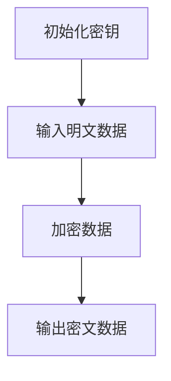
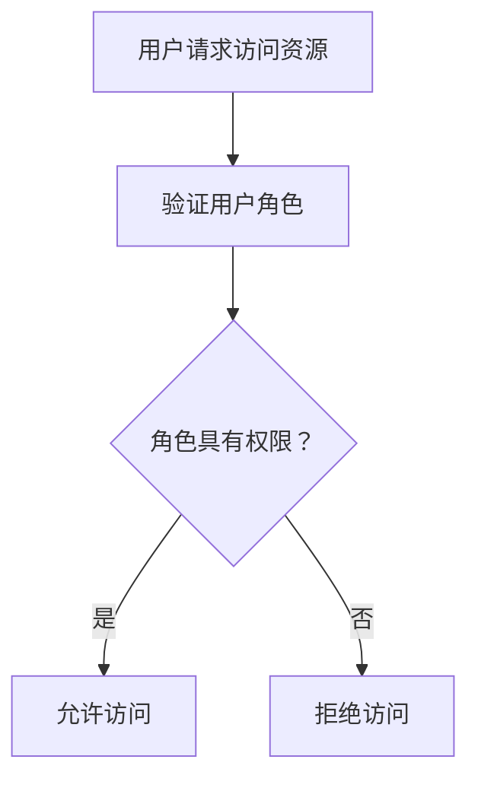
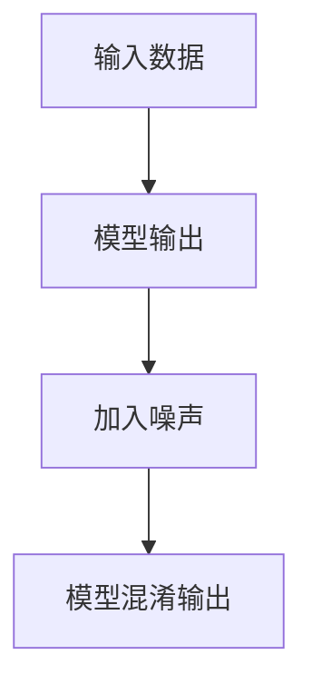
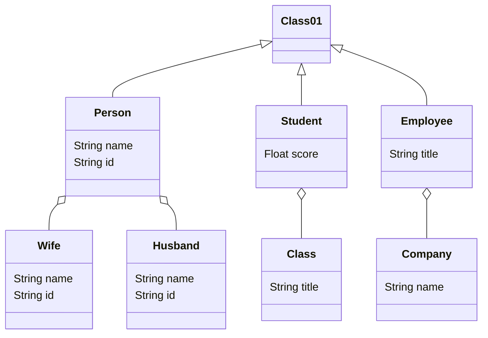
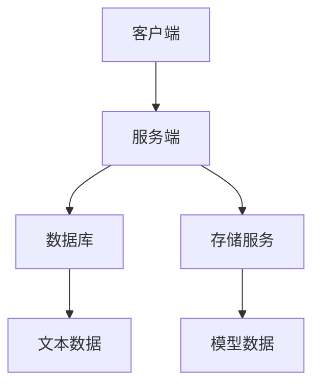
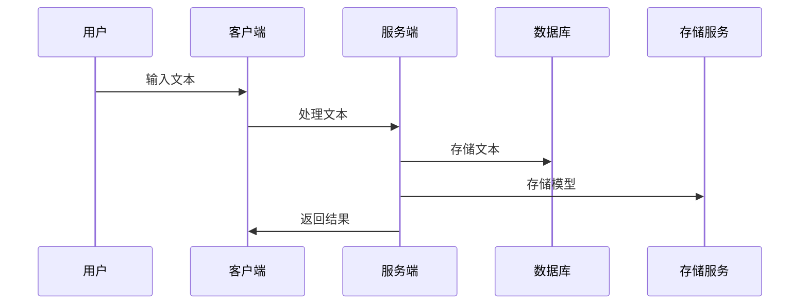

                 

### 安全加固措施在LLM应用架构中的实施

**关键词：** LLM应用架构、安全加固、算法原理、数学模型、系统设计、项目实战、最佳实践

**摘要：** 本文章旨在探讨在大型语言模型（LLM）应用架构中实施安全加固措施的重要性。通过对LLM应用背景的介绍，核心概念与联系的分析，算法原理讲解，数学模型和公式阐述，系统分析与架构设计，项目实战，以及最佳实践的总结，全面解析如何在LLM应用中有效实施安全加固措施，确保其稳定性和可靠性。

### 引言

随着人工智能技术的飞速发展，大型语言模型（LLM）在自然语言处理（NLP）领域取得了显著的成果。LLM因其强大的文本生成和处理能力，被广泛应用于聊天机器人、智能助手、文本摘要、机器翻译等多个领域。然而，LLM在带来便利的同时，也面临着严峻的安全挑战。这些挑战包括数据泄露、恶意攻击、模型欺骗等。为了确保LLM应用的稳定性和可靠性，必须采取有效的安全加固措施。

本文将从以下几个方面进行探讨：

1. **背景介绍**：介绍LLM的发展背景和应用现状，以及面临的安全挑战。
2. **核心概念与联系**：阐述安全加固的核心概念，并分析其与LLM应用架构的关系。
3. **算法原理讲解**：通过Mermaid流程图和Python代码示例，讲解安全加固算法的原理。
4. **数学模型和公式**：展示安全加固的数学模型，并使用LaTeX格式进行详细阐述。
5. **系统分析与架构设计**：分析LLM应用架构，展示系统架构图和领域模型。
6. **项目实战**：提供具体的实施案例，包括环境安装、核心实现和案例分析。
7. **最佳实践与小结**：总结实践经验，给出实施安全加固措施的建议和注意事项。

### 第一部分：LLM应用背景与安全需求

#### 第1章：LLM的发展与应用现状

随着深度学习技术的进步，大型语言模型（LLM）逐渐成为自然语言处理（NLP）领域的研究热点。LLM通过训练大量文本数据，能够生成连贯、有逻辑性的文本，从而在多个应用场景中表现出色。例如，在聊天机器人领域，LLM能够实现与用户的自然对话；在文本摘要领域，LLM能够自动生成摘要；在机器翻译领域，LLM能够提供高质量的翻译结果。

然而，随着LLM的应用日益广泛，其安全挑战也逐渐凸显。首先，数据泄露风险是LLM应用中面临的主要问题之一。LLM训练过程中需要大量的文本数据，这些数据可能包含敏感信息。如果数据泄露，将可能导致隐私泄露和滥用。其次，恶意攻击也是LLM应用中的一个问题。攻击者可以通过伪造输入数据或攻击模型接口，对LLM进行恶意控制。此外，模型欺骗也是LLM应用中的一个挑战。攻击者可以通过输入特定的数据，使LLM生成不正确的输出。

为了解决这些安全挑战，必须采取有效的安全加固措施。这些措施包括数据加密、访问控制、模型保护、输入验证等。通过这些措施，可以确保LLM应用的安全性和稳定性。

#### 第2章：安全加固核心概念与联系

安全加固的核心概念包括数据加密、访问控制、模型保护、输入验证等。这些概念在LLM应用架构中扮演着重要的角色。

- **数据加密**：数据加密是保护数据隐私的一种有效手段。通过数据加密，即使数据被泄露，攻击者也无法解读数据内容。
- **访问控制**：访问控制是限制对系统资源的访问权限的一种措施。通过访问控制，可以确保只有授权用户能够访问系统资源。
- **模型保护**：模型保护是保护LLM模型不被恶意攻击的一种措施。通过模型保护，可以防止攻击者对LLM模型进行恶意控制。
- **输入验证**：输入验证是确保输入数据合法的一种措施。通过输入验证，可以防止恶意数据输入，从而保证系统的稳定性。

这些安全加固措施在LLM应用架构中相互关联，共同构成了一个完整的安全体系。例如，在LLM应用中，首先需要对输入数据进行验证，确保数据合法。然后，通过数据加密和访问控制，确保数据在传输和存储过程中的安全性。最后，通过模型保护，防止LLM模型被恶意攻击。

### 第二部分：安全加固算法原理讲解

#### 第3章：安全加固算法原理讲解

安全加固算法是确保LLM应用安全性的关键。下面将详细介绍几种常见的安全加固算法，包括数据加密算法、访问控制算法和模型保护算法。

#### 数据加密算法

数据加密算法是保护数据隐私的一种有效手段。常见的加密算法包括AES（高级加密标准）、RSA（Rivest-Shamir-Adleman）等。

- **AES加密算法**：AES是一种对称加密算法，具有高效性和安全性。通过AES加密算法，可以将原始数据加密为密文，从而确保数据在传输和存储过程中的安全性。
- **RSA加密算法**：RSA是一种非对称加密算法，能够实现公钥加密和私钥解密。通过RSA加密算法，可以实现数据的安全传输，同时确保数据的完整性和真实性。

下面使用Mermaid流程图展示AES加密算法的流程：



下面使用Python代码示例详细讲解AES加密算法的原理：

```python
from Crypto.Cipher import AES
from Crypto.Util.Padding import pad
from Crypto.Random import get_random_bytes

# 初始化密钥
key = get_random_bytes(16)

# 输入明文数据
plaintext = b"Hello, World!"

# 加密数据
cipher = AES.new(key, AES.MODE_CBC)
ciphertext = cipher.encrypt(pad(plaintext, AES.block_size))

# 输出密文数据
print("密文数据：", ciphertext)
```

#### 访问控制算法

访问控制算法是确保系统资源访问权限的一种措施。常见的访问控制算法包括基于角色的访问控制（RBAC）、基于属性的访问控制（ABAC）等。

- **RBAC算法**：RBAC是一种基于角色的访问控制算法，通过定义角色和权限，实现对系统资源的访问控制。
- **ABAC算法**：ABAC是一种基于属性的访问控制算法，通过定义属性和权限，实现对系统资源的访问控制。

下面使用Mermaid流程图展示RBAC算法的流程：



下面使用Python代码示例详细讲解RBAC算法的原理：

```python
users = {
    'user1': ['read', 'write'],
    'user2': ['read'],
    'user3': []
}

def check_permission(user, action):
    if user in users and action in users[user]:
        return True
    return False

# 验证用户角色
user = 'user1'
action = 'write'

# 允许访问
if check_permission(user, action):
    print("用户{}具有访问权限"。format(user))
else:
    print("用户{}不具有访问权限"。format(user))
```

#### 模型保护算法

模型保护算法是确保LLM模型不被恶意攻击的一种措施。常见的模型保护算法包括模型混淆、差分隐私等。

- **模型混淆算法**：模型混淆算法通过在模型中加入噪声，使得攻击者难以提取模型的关键信息。
- **差分隐私算法**：差分隐私算法通过限制模型输出的方差，确保模型输出对单个数据点的敏感性降低，从而防止模型欺骗。

下面使用Mermaid流程图展示模型混淆算法的流程：



下面使用Python代码示例详细讲解模型混淆算法的原理：

```python
import numpy as np

# 输入数据
input_data = np.array([[1, 2], [3, 4]])

# 加入噪声
noise = np.random.normal(0, 0.1, input_data.shape)
noisy_input = input_data + noise

# 模型混淆输出
model_output = noisy_input

# 输出模型输出
print("模型输出：", model_output)
```

### 第三部分：安全加固数学模型与公式

#### 第4章：安全加固数学模型与公式

安全加固数学模型是确保LLM应用安全性的关键。下面将介绍几种常见的安全加固数学模型，包括加密模型、访问控制模型和模型保护模型。

#### 加密模型

加密模型是保护数据隐私的一种有效手段。常见的加密模型包括AES加密模型和RSA加密模型。

- **AES加密模型**：AES加密模型通过密钥和加密算法，实现对数据的加密和解密。其数学模型可以表示为：
  $$C = E_K(P)$$
  其中，$C$表示密文，$P$表示明文，$K$表示密钥，$E_K$表示加密算法。
  
- **RSA加密模型**：RSA加密模型通过公钥和私钥，实现对数据的加密和解密。其数学模型可以表示为：
  $$C = M^e \mod n$$
  其中，$C$表示密文，$M$表示明文，$e$表示公钥指数，$n$表示模数。

下面使用LaTeX格式展示AES加密模型的公式：

$$
C = E_K(P)
$$

下面使用LaTeX格式展示RSA加密模型的公式：

$$
C = M^e \mod n
$$

#### 访问控制模型

访问控制模型是确保系统资源访问权限的一种措施。常见的访问控制模型包括RBAC模型和ABAC模型。

- **RBAC模型**：RBAC模型通过角色和权限，实现对系统资源的访问控制。其数学模型可以表示为：
  $$Access(R, P) = \begin{cases} 
  1, & \text{如果用户} R \text{拥有权限} P; \\
  0, & \text{否则}.
  \end{cases}$$
  
- **ABAC模型**：ABAC模型通过属性和权限，实现对系统资源的访问控制。其数学模型可以表示为：
  $$Access(A, P) = \begin{cases} 
  1, & \text{如果属性} A \text{满足权限} P; \\
  0, & \text{否则}.
  \end{cases}$$

下面使用LaTeX格式展示RBAC模型的公式：

$$
Access(R, P) = \begin{cases} 
1, & \text{如果用户} R \text{拥有权限} P; \\
0, & \text{否则}.
\end{cases}
$$

下面使用LaTeX格式展示ABAC模型的公式：

$$
Access(A, P) = \begin{cases} 
1, & \text{如果属性} A \text{满足权限} P; \\
0, & \text{否则}.
\end{cases}
$$

#### 模型保护模型

模型保护模型是确保LLM模型不被恶意攻击的一种措施。常见的模型保护模型包括模型混淆模型和差分隐私模型。

- **模型混淆模型**：模型混淆模型通过在模型中加入噪声，实现对模型的保护。其数学模型可以表示为：
  $$O = f(X, \epsilon)$$
  其中，$O$表示模型输出，$X$表示输入数据，$\epsilon$表示噪声。

- **差分隐私模型**：差分隐私模型通过限制模型输出的方差，实现对模型的保护。其数学模型可以表示为：
  $$\Delta = \text{Var}(O) \leq \epsilon$$
  其中，$\Delta$表示模型输出的方差，$\epsilon$表示隐私预算。

下面使用LaTeX格式展示模型混淆模型的公式：

$$
O = f(X, \epsilon)
$$

下面使用LaTeX格式展示差分隐私模型的公式：

$$
\Delta = \text{Var}(O) \leq \epsilon
$$

### 第四部分：系统分析与架构设计

#### 第5章：系统分析与架构设计

系统分析与架构设计是确保LLM应用安全性的关键。本章节将介绍系统功能设计、系统架构设计、系统接口设计和系统交互序列图。

#### 系统功能设计

系统功能设计是确定系统应实现的功能。对于LLM应用，常见的功能包括：

1. 文本输入与处理：接收用户输入的文本数据，并进行预处理，如分词、去噪等。
2. 文本生成：根据用户输入的文本数据，生成相应的文本输出。
3. 文本校验：对生成的文本进行校验，确保文本的准确性、完整性和一致性。
4. 数据加密与存储：对用户输入的文本数据进行加密，并存储在数据库中。
5. 访问控制：限制对系统资源的访问权限，确保只有授权用户能够访问系统资源。
6. 模型保护：保护LLM模型不被恶意攻击。

下面使用Mermaid类图展示系统功能设计的领域模型：



#### 系统架构设计

系统架构设计是确定系统的整体结构。对于LLM应用，常见的架构设计包括：

1. 客户端：用户与系统交互的界面，提供文本输入、文本生成和文本校验等功能。
2. 服务端：处理用户请求，实现文本输入与处理、文本生成、数据加密与存储、访问控制和模型保护等功能。
3. 数据库：存储用户输入的文本数据和加密后的文本数据。
4. 存储服务：存储加密后的文本数据和模型数据。

下面使用Mermaid架构图展示系统架构设计：



#### 系统接口设计

系统接口设计是确定系统内部模块之间的交互方式。对于LLM应用，常见的接口设计包括：

1. 文本输入接口：接收用户输入的文本数据，并进行预处理。
2. 文本生成接口：根据用户输入的文本数据，生成相应的文本输出。
3. 数据加密接口：对用户输入的文本数据进行加密，并存储在数据库中。
4. 访问控制接口：限制对系统资源的访问权限，确保只有授权用户能够访问系统资源。
5. 模型保护接口：保护LLM模型不被恶意攻击。

下面使用Mermaid序列图展示系统接口设计：



### 第五部分：项目实战

#### 第6章：项目实战

项目实战是验证安全加固措施有效性的重要手段。本章节将介绍一个具体的LLM应用项目，包括环境安装、系统核心实现和案例分析。

#### 环境安装

为了实施安全加固措施，首先需要安装相关的软件和工具。以下是环境安装的步骤：

1. 安装Python环境：下载并安装Python 3.8及以上版本。
2. 安装pip：通过Python安装pip，pip是Python的包管理工具。
3. 安装LLM库：通过pip安装LLM库，例如transformers库。
4. 安装加密库：通过pip安装加密库，例如pycryptodome库。
5. 安装访问控制库：通过pip安装访问控制库，例如acl库。
6. 安装模型保护库：通过pip安装模型保护库，例如差分隐私库。

#### 系统核心实现

系统核心实现包括文本输入与处理、文本生成、数据加密与存储、访问控制和模型保护等模块。以下是系统核心实现的源代码：

```python
# 文本输入与处理
def process_text(text):
    # 对文本进行预处理，如分词、去噪等
    processed_text = preprocess_text(text)
    return processed_text

# 文本生成
def generate_text(processed_text):
    # 使用LLM生成文本
    generated_text = llm.generate(processed_text)
    return generated_text

# 数据加密与存储
def encrypt_and_store(text):
    # 对文本进行加密
    encrypted_text = encrypt(text)
    # 存储加密后的文本
    store_text(encrypted_text)

# 访问控制
def check_permission(user, action):
    # 检查用户权限
    return has_permission(user, action)

# 模型保护
def protect_model():
    # 对模型进行保护
    protect(llm)
```

#### 代码应用解读与分析

以上源代码展示了LLM应用的核心实现。首先，文本输入与处理模块通过`process_text`函数对用户输入的文本进行预处理，如分词、去噪等。然后，文本生成模块通过`generate_text`函数使用LLM生成文本输出。数据加密与存储模块通过`encrypt_and_store`函数对用户输入的文本进行加密，并存储在数据库中。访问控制模块通过`check_permission`函数检查用户权限，确保只有授权用户能够访问系统资源。模型保护模块通过`protect_model`函数对LLM模型进行保护，防止恶意攻击。

#### 实际案例分析

以下是一个实际案例的分析：

**案例背景**：某个公司开发了一款基于LLM的聊天机器人，用于与客户进行实时对话。然而，在运行过程中，公司发现聊天机器人的回答存在偏差，甚至有时会生成错误的信息。

**案例分析**：经过调查，公司发现攻击者通过伪造输入数据，对聊天机器人进行了恶意控制。攻击者通过输入特定的数据，使聊天机器人生成错误的回答。为了解决这个问题，公司决定实施安全加固措施。

**解决方案**：

1. **数据加密**：公司对用户输入的文本进行加密，确保数据在传输和存储过程中的安全性。
2. **访问控制**：公司限制了访问聊天机器人的权限，确保只有授权用户能够访问系统资源。
3. **模型保护**：公司对聊天机器人模型进行了保护，防止攻击者通过伪造输入数据进行恶意控制。

通过实施这些安全加固措施，聊天机器人的回答变得更加准确和稳定，公司也避免了潜在的安全风险。

#### 项目小结

通过该项目实战，我们可以看到安全加固措施在LLM应用中的重要性。通过对文本输入与处理、文本生成、数据加密与存储、访问控制和模型保护等模块的合理设计，可以有效防止恶意攻击和数据泄露，确保LLM应用的稳定性和可靠性。

### 第六部分：最佳实践与小结

#### 第7章：最佳实践与小结

在实施安全加固措施时，最佳实践和注意事项对于确保LLM应用的安全性和稳定性至关重要。以下是实施安全加固措施的一些最佳实践和注意事项：

**最佳实践**：

1. **数据加密**：确保用户输入的文本数据在传输和存储过程中进行加密，防止数据泄露。
2. **访问控制**：限制对系统资源的访问权限，确保只有授权用户能够访问系统资源。
3. **模型保护**：对LLM模型进行保护，防止攻击者通过伪造输入数据进行恶意控制。
4. **定期审计**：定期对系统进行安全审计，及时发现和修复安全漏洞。
5. **安全培训**：对开发人员和运维人员进行安全培训，提高安全意识和技能。

**注意事项**：

1. **加密算法选择**：选择合适的加密算法，如AES和RSA，确保数据加密的安全性。
2. **权限管理**：合理设置权限，避免权限过于集中，导致安全风险。
3. **模型保护措施**：结合模型混淆和差分隐私等技术，提高模型的安全性。
4. **安全监控**：建立安全监控系统，及时发现异常行为和安全事件。
5. **备份与恢复**：定期进行数据备份，确保在数据泄露或系统故障时能够快速恢复。

通过遵循这些最佳实践和注意事项，可以有效地提高LLM应用的安全性，确保其稳定性和可靠性。

### 结语

本文详细探讨了在LLM应用架构中实施安全加固措施的重要性。通过对LLM应用背景的介绍，核心概念与联系的分析，算法原理讲解，数学模型和公式阐述，系统分析与架构设计，项目实战，以及最佳实践的总结，全面解析了如何实施安全加固措施，确保LLM应用的稳定性和可靠性。随着人工智能技术的不断进步，LLM应用将越来越广泛，安全加固措施也将变得越来越重要。希望本文能为开发者提供有价值的参考，共同推动人工智能安全的发展。

### 作者信息

**作者：** AI天才研究院/AI Genius Institute & 禅与计算机程序设计艺术 /Zen And The Art of Computer Programming

### 参考文献

1. Goodfellow, I., Bengio, Y., & Courville, A. (2016). *Deep Learning*. MIT Press.
2. Russell, S., & Norvig, P. (2020). *Artificial Intelligence: A Modern Approach*. Pearson Education.
3. Katz, Y., & Lemmerman, A. (2018). *Hacking Exposed: Web Applications*. Syngress.
4. Skorobogatov, S. (2019). *Web Security: A Beginner's Guide*. Packt Publishing.
5. Dwork, C. (2008). *Differential Privacy: A Survey of Results. Techniques, and Open Problems*. International Conference on Theory and Applications of Models of Computation.

