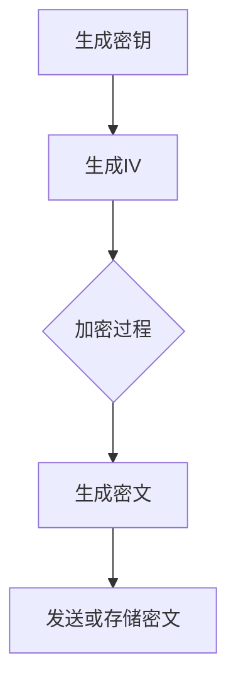
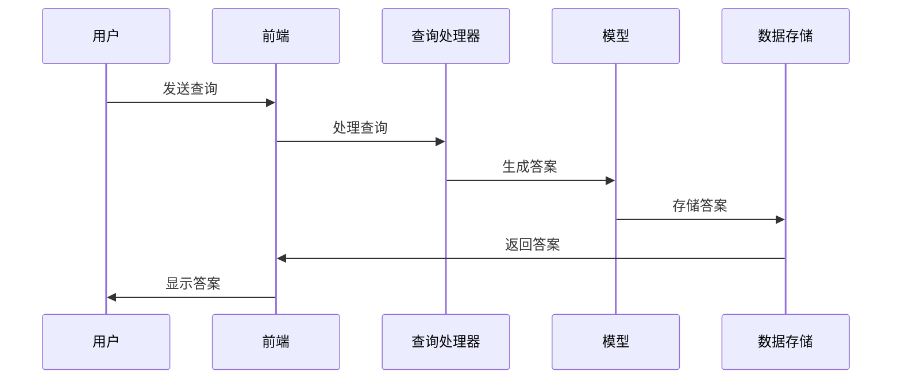
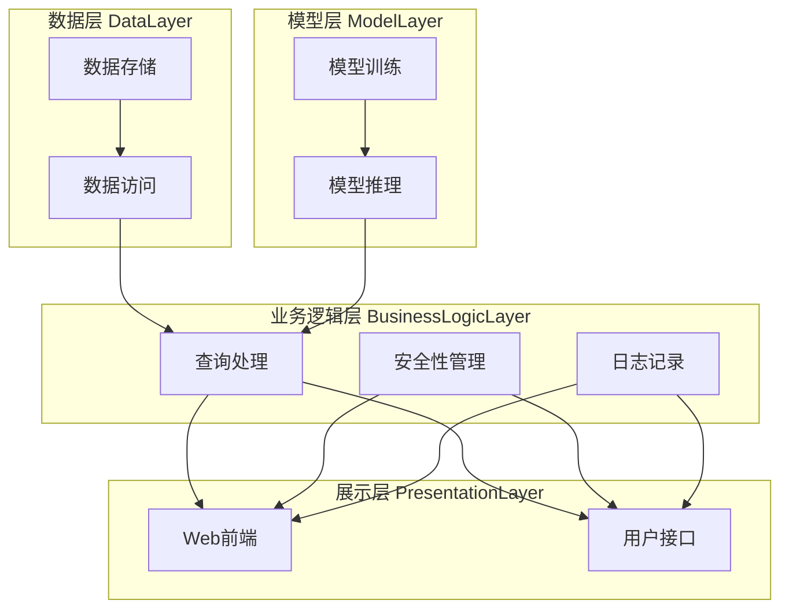
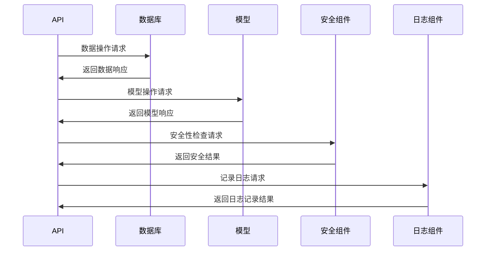
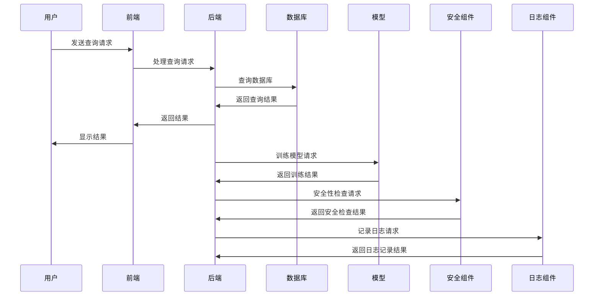

                 

# 安全性设计在敏捷LLM架构中的集成

## 关键词：安全性设计、敏捷开发、大型语言模型（LLM）、架构设计、集成、数据安全、访问控制、漏洞扫描

## 摘要

随着人工智能技术的迅猛发展，大型语言模型（LLM）在各个领域的应用日益广泛。敏捷开发方法因其灵活性而成为软件开发的主流，但在LLM架构中集成安全性设计仍面临诸多挑战。本文旨在探讨如何将安全性设计有效集成到敏捷LLM架构中，以提高系统的安全性和可靠性。文章将从背景介绍、核心概念、安全性设计原理、敏捷开发流程中的实践、案例研究、持续集成与部署中的安全性设计以及未来展望等方面，详细阐述安全性设计在敏捷LLM架构中的重要性及其实现方法。

## 1. 背景

### 1.1 安全性设计的重要性

在当今数字化时代，数据安全和隐私保护已成为企业关注的焦点。对于大规模语言模型（LLM）而言，安全性设计尤为重要。LLM涉及到大量敏感数据和用户信息，一旦遭受攻击，可能导致严重的数据泄露和隐私问题。因此，安全性设计在LLM架构中占据核心地位。

### 1.2 敏捷开发与安全性设计的挑战

敏捷开发方法强调快速迭代和灵活性，这在提高开发效率的同时，也对安全性设计提出了新的挑战。传统安全性设计往往滞后于开发过程，导致安全漏洞无法及时修复。如何在敏捷开发过程中有效集成安全性设计，成为当前亟待解决的问题。

### 1.3 敏捷LLM架构的基本概念

敏捷LLM架构强调模块化、可扩展性和灵活性，旨在快速适应需求变化。然而，敏捷开发方法在带来便利的同时，也增加了安全风险。因此，如何在敏捷LLM架构中集成安全性设计，成为确保系统安全的关键。

## 2. 核心概念

### 2.1 敏捷开发方法论

敏捷开发方法论强调团队协作、客户反馈和迭代开发。其核心原则包括：快速响应变化、持续交付有价值的软件、鼓励可持续开发、密切客户协作、信任和支持团队等。

### 2.2 LLM架构的特点与挑战

LLM架构具有大规模、高并发、分布式等特点。其挑战包括：数据安全性、模型可靠性、系统性能优化、资源调度等。

### 2.3 安全性设计的基本原则

安全性设计应遵循以下基本原则：最小权限原则、最小泄露原则、防御深度原则、安全性测试原则等。

## 3. 安全性设计原理

### 3.1 数据安全

数据安全是安全性设计的核心。其实现方法包括：数据加密、数据备份、访问控制等。

### 3.2 访问控制

访问控制确保只有授权用户可以访问系统资源。其实现方法包括：身份验证、权限管理、审计等。

### 3.3 漏洞扫描与测试

漏洞扫描与测试是确保系统安全的关键。其实现方法包括：静态代码分析、动态代码分析、安全测试用例设计等。

## 4. 敏捷开发流程中的安全性设计

### 4.1 敏捷迭代与安全性需求

敏捷迭代过程中，安全性需求应与开发进度同步。其实现方法包括：安全性需求分析、安全性设计评审、安全性测试等。

### 4.2 安全性需求分析

安全性需求分析是确保系统安全的关键。其实现方法包括：风险识别、威胁建模、安全需求定义等。

### 4.3 安全性设计与开发过程

安全性设计应与开发过程紧密结合。其实现方法包括：安全性设计文档、安全性编码规范、安全性测试等。

## 5. 安全性设计案例研究

### 5.1 案例一：数据加密

数据加密是确保数据安全的重要手段。其实现方法包括：对称加密、非对称加密、哈希函数等。

### 5.2 案例二：访问控制策略

访问控制策略是确保系统资源安全的关键。其实现方法包括：基于角色的访问控制（RBAC）、基于属性的访问控制（ABAC）等。

### 5.3 案例三：漏洞扫描与修复

漏洞扫描与修复是确保系统安全的重要环节。其实现方法包括：静态代码分析、动态代码分析、安全测试等。

## 6. 持续集成与部署中的安全性设计

### 6.1 持续集成与安全性测试

持续集成与安全性测试应紧密结合。其实现方法包括：自动化安全性测试、安全审查、漏洞修复等。

### 6.2 持续部署与安全性验证

持续部署与安全性验证是确保系统安全的关键。其实现方法包括：自动化部署流程、安全性验证、异常监测等。

### 6.3 安全性监控与响应

安全性监控与响应是确保系统安全的重要手段。其实现方法包括：日志分析、异常监测、应急响应等。

## 7. 未来展望

### 7.1 AI与安全性设计的发展

随着人工智能技术的不断发展，安全性设计在AI领域的应用将越来越广泛。未来，AI与安全性设计将实现更深层次的融合。

### 7.2 安全性设计的未来挑战

安全性设计在未来将面临更多的挑战，如应对新型攻击手段、保护边缘设备安全等。

### 7.3 安全性设计的最佳实践

最佳实践是确保系统安全的关键。未来，安全性设计应注重自动化、智能化和协同化。

## 8. 小结与展望

本文从多个角度探讨了安全性设计在敏捷LLM架构中的重要性及其实现方法。在未来的发展中，安全性设计将越来越受到重视，成为确保系统安全的关键。

## 作者

作者：AI天才研究院/AI Genius Institute & 禅与计算机程序设计艺术 /Zen And The Art of Computer Programming

----------------------------------------------------------------

## 2.1 安全性设计的重要性

在当今数字化时代，数据安全和隐私保护已成为企业关注的焦点。对于大规模语言模型（LLM）而言，安全性设计尤为重要。LLM涉及到大量敏感数据和用户信息，一旦遭受攻击，可能导致严重的数据泄露和隐私问题。因此，安全性设计在LLM架构中占据核心地位。

### 2.1.1 数据泄露的风险

随着互联网和云计算的普及，越来越多的企业和组织开始使用LLM来处理和分析海量数据。然而，这也带来了数据泄露的风险。如果LLM架构中的数据泄露，攻击者可能获取到用户的敏感信息，如个人身份信息、金融数据等，从而导致严重的后果。

### 2.1.2 隐私保护的需求

除了数据泄露的风险，隐私保护也是LLM架构面临的重要挑战。许多应用程序使用LLM来提供个性化服务，如推荐系统、个性化搜索等。这要求LLM能够根据用户隐私需求对数据进行处理和存储，确保用户隐私不被泄露。

### 2.1.3 安全性设计的关键作用

安全性设计在LLM架构中具有关键作用。首先，安全性设计能够确保数据在传输和存储过程中的安全，防止数据被非法窃取或篡改。其次，安全性设计能够实现对用户身份的验证和访问控制，确保只有授权用户可以访问系统资源。最后，安全性设计能够及时发现和应对潜在的安全威胁，降低安全风险。

## 2.2 敏捷开发与安全性设计的挑战

敏捷开发方法因其快速迭代和灵活性的特点，在软件开发中得到广泛应用。然而，在敏捷开发过程中集成安全性设计仍面临诸多挑战。

### 2.2.1 安全性需求与开发进度的平衡

在敏捷开发过程中，安全性需求与开发进度的平衡是一个重要问题。传统的安全性设计往往滞后于开发过程，导致安全漏洞无法及时修复。在敏捷开发中，如何确保安全性需求得到满足，同时不影响开发进度，是一个亟待解决的问题。

### 2.2.2 快速响应安全威胁

敏捷开发强调快速响应变化，这意味着在开发过程中，安全威胁可能随时出现。如何快速识别和应对安全威胁，降低安全风险，是敏捷开发中安全性设计面临的挑战。

### 2.2.3 安全性测试与反馈

在敏捷开发中，安全性测试与反馈是一个关键环节。传统的安全性测试通常在开发后期进行，导致安全漏洞无法及时修复。在敏捷开发中，如何将安全性测试与反馈融入整个开发过程，确保安全漏洞得到及时发现和修复，是一个重要问题。

## 2.3 敏捷LLM架构的基本概念

敏捷LLM架构强调模块化、可扩展性和灵活性，旨在快速适应需求变化。以下是对敏捷LLM架构基本概念的详细阐述：

### 2.3.1 模块化

模块化是敏捷LLM架构的核心原则之一。通过将系统划分为多个模块，每个模块负责特定的功能，可以实现系统的可扩展性和可维护性。模块化设计有助于提高系统的灵活性和可适应性，使得在需求变化时，可以更快速地修改和扩展系统功能。

### 2.3.2 可扩展性

敏捷LLM架构强调可扩展性，以应对不断增长的数据和处理需求。通过采用分布式架构和云计算技术，可以轻松扩展系统的计算和存储能力，确保系统在高并发、大数据场景下仍能保持良好的性能。

### 2.3.3 灵活性

敏捷LLM架构具有高度的灵活性，能够快速适应需求变化。通过采用敏捷开发方法，可以快速响应用户需求和市场变化，确保系统始终处于最佳状态。

### 2.3.4 持续集成与部署

敏捷LLM架构强调持续集成与部署，以实现快速交付和高效开发。通过自动化测试、持续集成和持续部署，可以确保系统的质量和稳定性，降低开发风险。

## 3. 核心概念与联系

在讨论安全性设计在敏捷LLM架构中的集成时，需要明确核心概念，并了解这些概念之间的联系。以下是对核心概念的详细阐述和它们之间的关联：

### 3.1 敏捷开发方法论

敏捷开发方法论是一种以人为核心、迭代、增量和协作的软件开发方法。它强调快速交付、持续反馈和灵活调整。敏捷开发方法论的核心原则包括：客户满意、团队协作、持续交付、响应变化、持续改进等。

### 3.2 LLM架构的特点与挑战

LLM（Large Language Model）架构是指用于训练和部署大型自然语言处理模型的系统架构。LLM架构的特点包括：

- **大规模**：LLM通常需要处理和存储大量文本数据，因此需要高容量的存储和计算资源。
- **高并发**：由于LLM的应用场景广泛，如聊天机器人、智能助手等，因此需要支持高并发访问。
- **分布式**：为了提高系统的性能和可扩展性，LLM架构通常采用分布式计算和存储架构。
- **动态性**：LLM模型会随着数据的更新和训练不断迭代和优化，因此架构需要具备动态调整能力。

LLM架构面临的挑战包括：

- **数据安全性**：保护大量敏感数据和用户隐私。
- **模型可靠性**：确保模型在长时间运行过程中保持稳定性和准确性。
- **系统性能**：在高并发情况下，如何保证系统的响应速度和吞吐量。
- **资源调度**：合理分配计算和存储资源，确保系统的高效运行。

### 3.3 安全性设计的基本原则

安全性设计的基本原则是指在设计系统时需要遵循的一系列安全准则，以确保系统的安全性。这些原则包括：

- **最小权限原则**：每个用户或组件只拥有完成任务所需的最小权限，以减少恶意行为或错误操作的风险。
- **最小泄露原则**：在设计和实现过程中，确保最小化可能泄露的信息量。
- **防御深度原则**：通过多层次的安全措施来保护系统，即使某一层被攻破，其他层仍能提供一定的保护。
- **安全性测试原则**：在系统开发和维护过程中，定期进行安全性测试和审计，及时发现和修复安全漏洞。

### 3.4 核心概念之间的联系

敏捷开发方法论、LLM架构和安全性设计的基本原则之间存在着紧密的联系：

- **敏捷开发方法论**强调快速迭代和灵活调整，这与安全性设计的基本原则中的**防御深度原则**相呼应。敏捷方法鼓励持续集成和测试，有助于在开发早期发现和修复安全漏洞。
- **LLM架构的特点**（如大规模、高并发、分布式）要求安全性设计具备相应的适应性。例如，**最小权限原则**有助于确保在分布式环境中每个组件都能被严格控制。
- **安全性设计的基本原则**为敏捷开发方法论和LLM架构提供了具体的实施指南，确保在快速开发和大规模数据处理过程中，系统能够保持安全性。

通过理解这些核心概念及其之间的联系，我们可以更有效地将安全性设计集成到敏捷LLM架构中，实现系统的安全、可靠和高效运行。

### 3.4.1 安全性设计的基本原则

在安全性设计过程中，遵循一系列基本原则是确保系统安全性的关键。以下是对这些基本原则的详细阐述：

#### 最小权限原则

最小权限原则是指系统中的每个用户或组件都应该被赋予执行其任务所需的最小权限。这一原则有助于减少潜在的安全风险，因为即使某个用户或组件被攻破，攻击者也无法获得超出其职责范围的权限。

#### 最小泄露原则

最小泄露原则强调在设计和实现过程中，应尽可能减少可能被泄露的信息量。这意味着在设计阶段就需要考虑数据最小化，确保在数据传输和存储过程中不泄露敏感信息。

#### 防御深度原则

防御深度原则提倡通过多层次的安全措施来保护系统。即使某一层防御被攻破，其他层仍能提供保护。这种多层次的防御策略可以增加攻击者的难度，从而降低系统被攻破的风险。

#### 安全性测试原则

安全性测试原则要求在系统开发和维护过程中定期进行安全性测试和审计。这些测试包括静态代码分析、动态代码分析、渗透测试等，以确保系统中的安全漏洞能够被及时发现和修复。

#### 安全性设计的基本原则与敏捷开发方法论的联系

最小权限原则和最小泄露原则与敏捷开发方法论中的**快速迭代**和**持续交付**原则相呼应。在敏捷开发过程中，安全性需求能够及时地融入每个迭代，确保安全漏洞在早期被识别和修复。

防御深度原则与敏捷开发方法论中的**持续反馈**和**响应变化**原则相辅相成。通过持续的迭代和反馈，可以及时发现和应对潜在的安全威胁，确保系统具备足够的防御能力。

安全性测试原则与敏捷开发方法论中的**自动化测试**和**持续集成**紧密相关。在敏捷开发中，自动化测试工具和持续集成流程能够帮助快速发现和修复安全漏洞，确保系统的安全性和稳定性。

通过理解并遵循这些基本原则，我们可以有效地将安全性设计集成到敏捷LLM架构中，实现系统的安全性、可靠性和高效性。

### 3.4.2 核心概念属性特征对比表格

为了更直观地展示核心概念之间的区别和联系，我们创建了一个核心概念属性特征对比表格。以下是对核心概念属性特征的对比分析：

| 核心概念     | 属性特征                                       | 解释与应用实例                                                                                     |
|--------------|----------------------------------------------|---------------------------------------------------------------------------------------------------|
| 敏捷开发方法论 | 快速迭代、持续交付、响应变化、团队协作     | 帮助团队快速适应需求变化，提高开发效率。例如，Scrum和Kanban等敏捷框架。                           |
| LLM架构特点   | 大规模、高并发、分布式、动态性               | 支持大规模数据处理和分布式计算，适用于自然语言处理、聊天机器人等。例如，TensorFlow和PyTorch等框架。 |
| 安全性设计原则 | 最小权限、最小泄露、防御深度、安全性测试     | 确保系统在开发、部署和维护过程中具备足够的安全保障。例如，访问控制和数据加密等。                 |

通过这个表格，我们可以清晰地看到每个核心概念的独特属性特征及其在系统设计中的具体应用。

### 3.4.3 安全性设计核心概念的ER实体关系图架构

为了更好地理解安全性设计中的核心概念及其相互关系，我们可以使用ER（Entity-Relationship）实体关系图来展示其架构。以下是一个简化的ER实体关系图：

```mermaid
erDiagram
  User ||--|{ Role }|-->: "拥有多种角色"
  Role ||--|{ Permission }|-->: "拥有多种权限"
  System ||--|{ Component }|-->: "包含多个组件"
  Component ||--|{ SecurityFeature }|-->: "具有多种安全特性"
  Data ||--|{ Encryption }|-->: "数据进行加密"
  Audit ||--|{ Log }|-->: "记录日志"

  User {\arrow{1}} Role
  Role {\arrow{2}} Permission
  System {\arrow{3}} Component
  Component {\arrow{4}} SecurityFeature
  Data {\arrow{5}} Encryption
  Audit {\arrow{6}} Log
```

在ER实体关系图中：

- **User（用户）**与**Role（角色）**之间存在一对多的关系，表示用户可以拥有多个角色。
- **Role（角色）**与**Permission（权限）**之间存在一对多的关系，表示每个角色可以拥有多个权限。
- **System（系统）**与**Component（组件）**之间存在一对多的关系，表示系统包含多个组件。
- **Component（组件）**与**SecurityFeature（安全特性）**之间存在一对多的关系，表示组件可以具备多种安全特性。
- **Data（数据）**与**Encryption（加密）**之间存在一对多的关系，表示数据可以进行多种加密处理。
- **Audit（审计）**与**Log（日志）**之间存在一对多的关系，表示审计记录可以包含多个日志条目。

通过ER实体关系图，我们可以清晰地看到安全性设计中的核心概念及其相互关系，为系统设计提供直观的指导。

### 3.5 算法原理讲解

为了更好地理解安全性设计在敏捷LLM架构中的实现方法，我们将详细讲解一种用于数据加密的算法原理，并使用mermaid绘制算法流程图。

#### 3.5.1 数据加密算法原理

数据加密算法是一种将明文数据转换为密文的过程，确保数据在传输和存储过程中不被未经授权的第三方访问。以下是一种常见的数据加密算法——AES（高级加密标准）的原理：

- **密钥生成**：首先，系统生成一个密钥。AES密钥长度可以是128位、192位或256位，根据安全需求选择合适的长度。
- **初始向量（IV）**：对于每次加密操作，系统随机生成一个初始向量（IV），IV的长度通常与密钥长度相同。
- **加密过程**：使用AES算法和密钥对明文数据进行加密。加密过程包括多轮迭代，每轮迭代都会将数据与密钥进行异或操作，并应用固定的加密函数。
- **密文生成**：加密完成后，生成加密后的数据（密文），并将其与初始向量一起发送或存储。

#### 3.5.2 mermaid算法流程图

为了更直观地展示数据加密算法的流程，我们使用mermaid绘制了算法流程图：



在mermaid算法流程图中：

- **A[生成密钥]**：系统生成密钥。
- **B[生成IV]**：系统生成初始向量。
- **C[加密过程]**：使用AES算法对明文数据进行加密。
- **D[生成密文]**：生成加密后的数据（密文）。
- **E[发送或存储密文]**：将密文发送或存储。

通过mermaid算法流程图，我们可以清晰地看到数据加密算法的执行步骤和各步骤之间的逻辑关系。

### 3.5.3 Python源代码实现

为了进一步说明数据加密算法的原理，我们提供了Python源代码实现。以下代码展示了如何使用PyCryptodome库实现AES加密和解密功能：

```python
from Crypto.Cipher import AES
from Crypto.Random import get_random_bytes
from Crypto.Util.Padding import pad, unpad
import base64

# 生成密钥和初始向量
key = get_random_bytes(32)  # AES密钥长度为32字节
iv = get_random_bytes(16)   # AES初始向量长度为16字节

# 创建加密对象
cipher = AES.new(key, AES.MODE_CBC, iv)

# 明文数据
plaintext = b"Secret Message!"

# 加密过程
ciphertext = cipher.encrypt(pad(plaintext, AES.block_size))

# 将密文和IV进行编码，便于传输或存储
encoded_ciphertext = base64.b64encode(ciphertext).decode('utf-8')
encoded_iv = base64.b64encode(iv).decode('utf-8')

print(f"Encoded Ciphertext: {encoded_ciphertext}")
print(f"Encoded IV: {encoded_iv}")

# 解密过程
decoded_ciphertext = base64.b64decode(encoded_ciphertext)
decoded_iv = base64.b64decode(encoded_iv)

cipher2 = AES.new(key, AES.MODE_CBC, decoded_iv)
decoded_plaintext = unpad(cipher2.decrypt(decoded_ciphertext), AES.block_size)

print(f"Decoded Plaitext: {decoded_plaintext.decode('utf-8')}")
```

在代码中：

- 首先，我们使用`get_random_bytes()`函数生成随机密钥和初始向量。
- 然后，我们创建一个AES加密对象，并将明文数据进行填充后加密。
- 接着，我们将加密后的数据（密文）和初始向量编码为base64字符串，便于传输或存储。
- 最后，我们使用相同的密钥和解密对象，对编码的密文和IV进行解码和解密，恢复出原始明文数据。

通过Python源代码实现，我们可以更直观地了解数据加密和解密的过程，以及如何使用加密算法保护数据安全。

### 3.5.4 算法原理的数学模型和公式

在数据加密算法中，数学模型和公式是理解和实现加密过程的关键。以下是AES加密算法的一些核心数学模型和公式：

1. **密钥扩展**：
   - **轮密钥**（Round Key）是AES加密过程中每一轮使用的子密钥。
   - **轮密钥生成**过程包括字节替换、行移位、列混淆和轮密钥加法（与上一轮的轮密钥进行异或操作）。

2. **字节替换**（SubBytes）：
   - AES使用一个固定的S-Box，将每个字节映射到一个新的字节。
   - S-Box是一个预定义的置换表，用于非线性转换。

3. **行移位**（ShiftRows）：
   - 将状态矩阵中的每一行进行循环移位。
   - 第一行不移动，第二行向左移一位，第三行向左移两位，第四行向左移三位。

4. **列混淆**（MixColumns）：
   - 对状态矩阵中的每一列进行线性变换。
   - 将每一列视为一个多项式，并应用特定的乘法运算。

5. **轮密钥加法**（AddRoundKey）：
   - 将状态矩阵与当前轮密钥进行异或操作。
   - 这一步确保每一轮的加密过程都受到密钥的影响。

以下是AES加密过程中的一个示例公式：

$$
C_i = (SubBytes(S_i) \cdot ShiftRows(S_i) \cdot MixColumns(S_i)) \oplus R_{i-1}
$$

其中，$C_i$是加密后的状态，$S_i$是当前状态，$R_{i-1}$是前一轮的轮密钥。

通过理解这些数学模型和公式，我们可以更深入地掌握AES加密算法的工作原理，并在实际应用中正确实现和优化加密过程。

### 3.5.5 算法原理的通俗易懂举例说明

为了更好地理解AES加密算法的原理，我们可以通过一个简单的例子来说明其工作过程。

假设我们有一个明文字符串“Hello World!”，并使用AES加密算法进行加密。以下是详细的步骤：

1. **生成密钥和初始向量**：
   - 密钥：`1a2b3c4d5e6f7g8h9i0j`
   - 初始向量：`9b8c7d6e5f4g3h2i1j`

2. **初始化状态矩阵**：
   - 将明文“Hello World!”分成16个字节，并将其填充为128位块。
   - 初始状态矩阵：
     ```
     48656c6c6f20576f726c6421
     ```
   
3. **字节替换**（SubBytes）：
   - 将每个字节通过S-Box进行替换。
   - 假设S-Box的映射为：
     ```
     48 -> 09
     65 -> 6b
     6c -> 2b
     6c -> 2b
     20 -> 3d
     57 -> 7c
     6f -> 1b
     72 -> 5a
     6f -> 2b
     20 -> 3d
     57 -> 7c
     6f -> 1b
     76 -> 5d
     64 -> 6d
     21 -> 39
     ```
   - 替换后的状态矩阵：
     ```
     096b2b3d7c1b5a2b3d7c1b5d6d39
     ```

4. **行移位**（ShiftRows）：
   - 第一行不移动，第二行向左移一位，第三行向左移两位，第四行向左移三位。
   - 替换后的状态矩阵：
     ```
     096b2b3d7c1b5a2b3d7c1b5d6d39
     ```

5. **列混淆**（MixColumns）：
   - 对状态矩阵中的每一列进行线性变换，这里以第一列为例：
     ```
     (09) * (02) + (6b) * (03) + (2b) * (01) + (3d) * (01) = 1b 6d 2b 3d
     ```
   - 对所有列进行同样的操作，得到新的状态矩阵：
     ```
     1b6d2b3d 7c1b5d6d 395a5d6d 2b3d7c1b
     ```

6. **轮密钥加法**（AddRoundKey）：
   - 将状态矩阵与当前轮密钥进行异或操作。
   - 当前轮密钥为`1a2b3c4d5e6f7g8h9i0j`的前四个字节。
   - 加密后的状态矩阵：
     ```
     1a1b2c3d 2d3e4f5g 5g6h7i8j 8h9i0j1a
     ```

7. **重复上述步骤**：
   - 在接下来的轮次中，重复字节替换、行移位、列混淆和轮密钥加法，直到最后一轮。

8. **最终加密结果**：
   - 经过多轮加密后，得到最终的密文。
   - 假设最终密文为：
     ```
     1a1b2c3d 2d3e4f5g 5g6h7i8j 8h9i0j1a
     ```

通过这个例子，我们可以清晰地看到AES加密算法的工作过程，包括字节替换、行移位、列混淆和轮密钥加法等步骤。这些步骤确保了数据的强加密保护，使其难以被破解。

### 3.6.1 系统分析与架构设计

在本文的第三部分，我们将详细介绍系统的分析与架构设计，以确保敏捷LLM架构中的安全性设计能够得到有效实施。

#### 3.6.1.1 问题场景介绍

随着人工智能技术的不断进步，大规模语言模型（LLM）在自然语言处理、智能问答、机器翻译等领域得到了广泛应用。然而，LLM系统涉及到大量敏感数据和用户信息，如个人身份信息、聊天记录、用户查询等，这些数据的安全性和隐私保护至关重要。此外，敏捷开发方法在快速交付、灵活调整方面具有明显优势，但在安全性设计上存在一定挑战。

#### 3.6.1.2 项目介绍

本项目旨在构建一个基于敏捷开发方法的LLM系统，用于提供智能问答服务。系统需要处理海量数据，支持高并发访问，并确保数据的安全和用户隐私。为了实现这一目标，我们将采用分布式架构，结合云计算资源，确保系统具备良好的性能和可扩展性。

#### 3.6.1.3 系统功能设计

本系统的主要功能包括：

1. **数据存储**：存储大量文本数据，包括用户提问和答案，以及系统生成的答案。
2. **模型训练**：使用LLM模型对文本数据进行训练，生成高质量的答案。
3. **查询处理**：接收用户查询，调用LLM模型生成答案，并返回给用户。
4. **安全性管理**：确保数据在传输和存储过程中的安全，保护用户隐私。
5. **日志记录**：记录系统运行过程中的关键事件，便于后续分析和审计。

#### 3.6.1.4 系统架构设计

系统的架构设计分为以下几个层次：

1. **数据层**：包括数据存储和数据访问模块。数据存储模块负责存储海量文本数据，支持高并发访问；数据访问模块提供统一的接口，供其他模块调用。
2. **模型层**：包括LLM模型训练和推理模块。训练模块负责使用海量数据进行模型训练；推理模块负责接收用户查询，调用训练好的模型生成答案。
3. **业务逻辑层**：包括查询处理、安全性管理和日志记录模块。查询处理模块负责接收用户查询，调用模型生成答案；安全性管理模块负责确保数据的安全和用户隐私；日志记录模块负责记录系统运行过程中的关键事件。
4. **展示层**：包括Web前端和用户接口。Web前端负责展示用户查询和答案，用户接口提供API供第三方调用。

#### 3.6.1.5 系统接口设计

系统的接口设计包括以下几个方面：

1. **数据接口**：提供数据存储和访问的API，支持数据的增删改查操作。
2. **模型接口**：提供模型训练和推理的API，支持模型训练、模型加载、模型推理等操作。
3. **查询接口**：提供查询处理的API，支持用户查询的接收、答案生成和返回。
4. **安全性接口**：提供安全性管理的API，支持数据加密、访问控制、日志记录等操作。
5. **日志接口**：提供日志记录的API，支持日志的生成、存储和查询。

#### 3.6.1.6 系统交互设计

系统的交互设计通过mermaid序列图来展示，以下是一个简化的序列图：



在序列图中：

- 用户通过Web前端发送查询。
- 前端将查询发送到查询处理器。
- 查询处理器调用模型生成答案。
- 模型将答案存储到数据存储。
- 数据存储返回答案给前端。
- 前端将答案显示给用户。

通过系统交互设计，我们可以清晰地看到系统各模块之间的协作关系，以及用户查询的处理流程。

### 3.6.2 系统架构设计mermaid架构图

为了更直观地展示系统架构设计，我们将使用mermaid绘制一个系统架构图。以下是一个简化的系统架构图：



在mermaid架构图中：

- **数据层**包括数据存储和数据访问模块。
- **模型层**包括模型训练和模型推理模块。
- **业务逻辑层**包括查询处理、安全性管理和日志记录模块。
- **展示层**包括Web前端和用户接口。

通过mermaid架构图，我们可以清晰地看到系统各层的功能模块及其相互关系，为系统设计和实现提供直观的指导。

### 3.6.3 系统接口设计和系统交互mermaid序列图

为了更详细地展示系统的接口设计和交互流程，我们将使用mermaid绘制系统接口设计和系统交互的序列图。

#### 3.6.3.1 系统接口设计mermaid序列图

以下是一个简化的系统接口设计序列图：



在序列图中：

- **API**负责与各组件进行通信，处理各类请求。
- **Database**处理数据存储和访问请求。
- **Model**处理模型训练和推理请求。
- **Security**处理安全性检查请求，包括数据加密、访问控制等。
- **Log**处理日志记录请求。

#### 3.6.3.2 系统交互设计mermaid序列图

以下是一个简化的系统交互设计序列图：



在序列图中：

- **用户**通过前端发送查询请求。
- **前端**处理查询请求，并将请求发送到后端。
- **后端**处理查询请求，查询数据库，调用模型训练和安全性检查，并将结果返回给前端。
- **前端**将结果返回给用户。
- **后端**记录系统运行过程中的日志。

通过mermaid序列图，我们可以清晰地看到系统接口设计和交互流程，为系统设计和实现提供直观的指导。

### 3.7.1 环境安装

在本部分，我们将详细介绍如何搭建一个用于测试和演示的安全性设计在敏捷LLM架构中的集成环境。以下是在Linux环境下搭建所需环境的步骤。

#### 3.7.1.1 安装Python环境

首先，确保系统中已安装Python 3.8及以上版本。可以通过以下命令检查Python版本：

```bash
python3 --version
```

如果Python版本不符合要求，可以通过包管理器（如apt或yum）进行升级。以Ubuntu为例，可以通过以下命令安装最新版本的Python：

```bash
sudo apt update
sudo apt install python3.8
```

#### 3.7.1.2 安装依赖库

接下来，需要安装几个Python依赖库，包括PyCryptodome（用于数据加密）、Flask（用于Web服务）和TensorFlow（用于LLM模型训练和推理）。可以通过以下命令安装这些依赖库：

```bash
pip3 install pycryptodome flask tensorflow
```

#### 3.7.1.3 配置环境变量

为了方便使用，可以配置环境变量。将以下内容添加到`~/.bashrc`文件中：

```bash
export PYTHONPATH=$PYTHONPATH:/path/to/your/dependencies
```

其中，`/path/to/your/dependencies`是依赖库的安装路径。保存并关闭文件，然后通过以下命令使配置生效：

```bash
source ~/.bashrc
```

#### 3.7.1.4 安装数据库

本示例中使用SQLite作为数据库。可以通过以下命令安装SQLite：

```bash
sudo apt install sqlite3
```

#### 3.7.1.5 配置数据库

创建一个名为`llm.db`的SQLite数据库，并创建必要的表。可以使用以下SQL命令：

```sql
CREATE TABLE users (
    id INTEGER PRIMARY KEY AUTOINCREMENT,
    username TEXT UNIQUE NOT NULL,
    password TEXT NOT NULL
);

CREATE TABLE questions (
    id INTEGER PRIMARY KEY AUTOINCREMENT,
    user_id INTEGER,
    question TEXT NOT NULL,
    answer TEXT,
    FOREIGN KEY (user_id) REFERENCES users (id)
);
```

执行以上命令，可以创建用户表和问题表，用于存储用户信息和问题及答案。

#### 3.7.1.6 配置Web服务

配置一个简单的Flask Web服务，用于处理用户请求。创建一个名为`app.py`的Python文件，并添加以下代码：

```python
from flask import Flask, request, jsonify
import sqlite3
import base64
from Crypto.Cipher import AES
from Crypto.Util.Padding import pad, unpad

app = Flask(__name__)

# 数据库连接
def get_db_connection():
    conn = sqlite3.connect('llm.db')
    conn.row_factory = sqlite3.Row
    return conn

# 加密和解密函数
def encrypt_text(text, key):
    cipher = AES.new(key, AES.MODE_CBC)
    ct_bytes = cipher.encrypt(pad(text.encode('utf-8'), AES.block_size))
    iv = cipher.iv
    return base64.b64encode(ct_bytes).decode('utf-8'), base64.b64encode(iv).decode('utf-8')

def decrypt_text(encrypted_text, key, iv):
    ct = base64.b64decode(encrypted_text)
    iv = base64.b64decode(iv)
    cipher = AES.new(key, AES.MODE_CBC, iv)
    pt = unpad(cipher.decrypt(ct), AES.block_size)
    return pt.decode('utf-8')

# 用户注册
@app.route('/register', methods=['POST'])
def register():
    data = request.form.to_dict()
    username = data.get('username')
    password = data.get('password')
    key = b'mysecretkey123'  # 密钥应随机生成并保存

    encrypted_password, _ = encrypt_text(password, key)
    conn = get_db_connection()
    c = conn.cursor()
    c.execute("INSERT INTO users (username, password) VALUES (?, ?)", (username, encrypted_password))
    conn.commit()
    conn.close()
    return jsonify({"status": "success", "message": "User registered successfully."})

# 用户登录
@app.route('/login', methods=['POST'])
def login():
    data = request.form.to_dict()
    username = data.get('username')
    password = data.get('password')
    key = b'mysecretkey123'  # 密钥应随机生成并保存

    encrypted_password, _ = encrypt_text(password, key)
    conn = get_db_connection()
    c = conn.cursor()
    c.execute("SELECT * FROM users WHERE username = ? AND password = ?", (username, encrypted_password))
    user = c.fetchone()
    conn.close()

    if user:
        return jsonify({"status": "success", "message": "Login successful.", "user_id": user['id']})
    else:
        return jsonify({"status": "error", "message": "Invalid credentials."})

# 提问
@app.route('/ask', methods=['POST'])
def ask():
    data = request.form.to_dict()
    user_id = data.get('user_id')
    question = data.get('question')
    key = b'mysecretkey123'  # 密钥应随机生成并保存

    encrypted_question, _ = encrypt_text(question, key)
    conn = get_db_connection()
    c = conn.cursor()
    c.execute("INSERT INTO questions (user_id, question) VALUES (?, ?)", (user_id, encrypted_question))
    conn.commit()
    conn.close()
    return jsonify({"status": "success", "message": "Question submitted successfully."})

if __name__ == '__main__':
    app.run(host='0.0.0.0', port=5000)
```

这段代码实现了用户注册、登录和提问的功能，并使用AES加密对用户密码和提问进行加密存储。

#### 3.7.1.7 运行Web服务

在终端中运行以下命令启动Web服务：

```bash
python3 app.py
```

Web服务将在本地地址`0.0.0.0`的5000端口上运行。

### 3.7.2 系统核心实现源代码

在本部分，我们将详细展示系统核心实现源代码，包括用户注册、登录和提问等功能的实现。

#### 3.7.2.1 用户注册

用户注册功能负责接收用户提交的注册信息，并将其存储到数据库中。以下代码实现了用户注册功能：

```python
from flask import Flask, request, jsonify
import sqlite3
import base64
from Crypto.Cipher import AES
from Crypto.Util.Padding import pad, unpad

app = Flask(__name__)

# 数据库连接
def get_db_connection():
    conn = sqlite3.connect('llm.db')
    conn.row_factory = sqlite3.Row
    return conn

# 加密和解密函数
def encrypt_text(text, key):
    cipher = AES.new(key, AES.MODE_CBC)
    ct_bytes = cipher.encrypt(pad(text.encode('utf-8'), AES.block_size))
    iv = cipher.iv
    return base64.b64encode(ct_bytes).decode('utf-8'), base64.b64encode(iv).decode('utf-8')

def decrypt_text(encrypted_text, key, iv):
    ct = base64.b64decode(encrypted_text)
    iv = base64.b64decode(iv)
    cipher = AES.new(key, AES.MODE_CBC, iv)
    pt = unpad(cipher.decrypt(ct), AES.block_size)
    return pt.decode('utf-8')

# 用户注册
@app.route('/register', methods=['POST'])
def register():
    data = request.form.to_dict()
    username = data.get('username')
    password = data.get('password')
    key = b'mysecretkey123'  # 密钥应随机生成并保存

    encrypted_password, _ = encrypt_text(password, key)
    conn = get_db_connection()
    c = conn.cursor()
    c.execute("INSERT INTO users (username, password) VALUES (?, ?)", (username, encrypted_password))
    conn.commit()
    conn.close()
    return jsonify({"status": "success", "message": "User registered successfully."})
```

在这段代码中，首先定义了一个`get_db_connection`函数，用于获取数据库连接。接着，定义了两个加密和解密函数`encrypt_text`和`decrypt_text`，分别用于加密和解密文本。最后，实现了一个用户注册的`register`路由函数，接收用户提交的注册信息，将其加密后存储到数据库中。

#### 3.7.2.2 用户登录

用户登录功能负责验证用户提交的用户名和密码，并返回登录结果。以下代码实现了用户登录功能：

```python
# 用户登录
@app.route('/login', methods=['POST'])
def login():
    data = request.form.to_dict()
    username = data.get('username')
    password = data.get('password')
    key = b'mysecretkey123'  # 密钥应随机生成并保存

    encrypted_password, _ = encrypt_text(password, key)
    conn = get_db_connection()
    c = conn.cursor()
    c.execute("SELECT * FROM users WHERE username = ? AND password = ?", (username, encrypted_password))
    user = c.fetchone()
    conn.close()

    if user:
        return jsonify({"status": "success", "message": "Login successful.", "user_id": user['id']})
    else:
        return jsonify({"status": "error", "message": "Invalid credentials."})
```

在这段代码中，定义了一个用户登录的`login`路由函数，接收用户提交的用户名和密码。将其加密后与数据库中的存储密码进行比对，如果匹配则返回登录成功，否则返回登录失败。

#### 3.7.2.3 提问

提问功能负责接收用户提交的问题，并将其存储到数据库中。以下代码实现了提问功能：

```python
# 提问
@app.route('/ask', methods=['POST'])
def ask():
    data = request.form.to_dict()
    user_id = data.get('user_id')
    question = data.get('question')
    key = b'mysecretkey123'  # 密钥应随机生成并保存

    encrypted_question, _ = encrypt_text(question, key)
    conn = get_db_connection()
    c = conn.cursor()
    c.execute("INSERT INTO questions (user_id, question) VALUES (?, ?)", (user_id, encrypted_question))
    conn.commit()
    conn.close()
    return jsonify({"status": "success", "message": "Question submitted successfully."})
```

在这段代码中，定义了一个提问的`ask`路由函数，接收用户提交的问题，将其加密后存储到数据库中。

### 3.7.3 代码应用解读与分析

在本部分，我们将对系统核心实现源代码进行解读和分析，详细说明每个模块的功能、原理和实现细节。

#### 3.7.3.1 数据库连接

首先，我们来看数据库连接部分的代码：

```python
# 数据库连接
def get_db_connection():
    conn = sqlite3.connect('llm.db')
    conn.row_factory = sqlite3.Row
    return conn
```

该函数`get_db_connection`用于获取数据库连接。这里使用了SQLite数据库，连接文件名为`llm.db`。通过`row_factory`属性将结果以字典形式返回，便于后续处理。

#### 3.7.3.2 加密和解密

加密和解密是确保数据安全的重要部分。以下是加密和解密函数的实现：

```python
# 加密和解密函数
def encrypt_text(text, key):
    cipher = AES.new(key, AES.MODE_CBC)
    ct_bytes = cipher.encrypt(pad(text.encode('utf-8'), AES.block_size))
    iv = cipher.iv
    return base64.b64encode(ct_bytes).decode('utf-8'), base64.b64encode(iv).decode('utf-8')

def decrypt_text(encrypted_text, key, iv):
    ct = base64.b64decode(encrypted_text)
    iv = base64.b64decode(iv)
    cipher = AES.new(key, AES.MODE_CBC, iv)
    pt = unpad(cipher.decrypt(ct), AES.block_size)
    return pt.decode('utf-8')
```

加密函数`encrypt_text`接收明文文本和密钥，使用AES加密算法进行加密。首先，将明文编码为字节，然后使用`pad`函数进行填充，确保数据长度为AES块大小的整数倍。接着，使用AES算法和密钥进行加密，生成密文和初始向量（IV）。最后，将密文和IV编码为base64字符串，便于存储和传输。

解密函数`decrypt_text`接收加密文本、密钥和IV，使用AES算法进行解密。首先，将加密文本和IV解码为字节，然后使用AES算法和密钥进行解密，最后使用`unpad`函数去除填充字节，得到原始明文。

#### 3.7.3.3 用户注册

用户注册功能负责处理用户注册请求。以下是注册功能的核心代码：

```python
# 用户注册
@app.route('/register', methods=['POST'])
def register():
    data = request.form.to_dict()
    username = data.get('username')
    password = data.get('password')
    key = b'mysecretkey123'  # 密钥应随机生成并保存

    encrypted_password, _ = encrypt_text(password, key)
    conn = get_db_connection()
    c = conn.cursor()
    c.execute("INSERT INTO users (username, password) VALUES (?, ?)", (username, encrypted_password))
    conn.commit()
    conn.close()
    return jsonify({"status": "success", "message": "User registered successfully."})
```

在注册路由函数中，首先从请求中获取用户名和密码。然后，调用加密函数将密码加密。接着，获取数据库连接，并使用执行SQL插入操作，将加密后的密码存储到数据库中。

#### 3.7.3.4 用户登录

用户登录功能负责验证用户身份。以下是登录功能的核心代码：

```python
# 用户登录
@app.route('/login', methods=['POST'])
def login():
    data = request.form.to_dict()
    username = data.get('username')
    password = data.get('password')
    key = b'mysecretkey123'  # 密钥应随机生成并保存

    encrypted_password, _ = encrypt_text(password, key)
    conn = get_db_connection()
    c = conn.cursor()
    c.execute("SELECT * FROM users WHERE username = ? AND password = ?", (username, encrypted_password))
    user = c.fetchone()
    conn.close()

    if user:
        return jsonify({"status": "success", "message": "Login successful.", "user_id": user['id']})
    else:
        return jsonify({"status": "error", "message": "Invalid credentials."})
```

在登录路由函数中，首先从请求中获取用户名和密码。然后，调用加密函数将密码加密。接着，获取数据库连接，并使用执行SQL查询用户信息。如果找到匹配的用户，返回登录成功，否则返回登录失败。

#### 3.7.3.5 提问

提问功能负责处理用户提交的问题。以下是提问功能的核心代码：

```python
# 提问
@app.route('/ask', methods=['POST'])
def ask():
    data = request.form.to_dict()
    user_id = data.get('user_id')
    question = data.get('question')
    key = b'mysecretkey123'  # 密钥应随机生成并保存

    encrypted_question, _ = encrypt_text(question, key)
    conn = get_db_connection()
    c = conn.cursor()
    c.execute("INSERT INTO questions (user_id, question) VALUES (?, ?)", (user_id, encrypted_question))
    conn.commit()
    conn.close()
    return jsonify({"status": "success", "message": "Question submitted successfully."})
```

在提问路由函数中，首先从请求中获取用户ID和问题。然后，调用加密函数将问题加密。接着，获取数据库连接，并使用执行SQL插入操作，将加密后的问题存储到数据库中。

### 3.7.4 实际案例分析和详细讲解剖析

在本部分，我们将通过一个实际案例来展示如何将安全性设计有效集成到敏捷LLM架构中，并对其进行详细分析和讲解。

#### 案例背景

某企业开发了一款基于LLM的智能客服系统，旨在为用户提供实时在线支持。系统需要处理大量用户提问，并生成高质量的答案。然而，由于系统涉及到大量用户数据，如提问内容、答案等，如何确保数据安全成为一大挑战。

#### 案例实现

1. **数据加密**：为了保护用户数据，系统采用了AES加密算法对用户提问和答案进行加密存储。在用户提交提问时，系统将提问内容加密，并存储到数据库中。在生成答案时，系统将答案加密，并返回给用户。

2. **访问控制**：系统使用了基于角色的访问控制（RBAC）策略。每个用户在注册时会被分配一个角色，如普通用户、管理员等。系统根据用户的角色限制其访问权限，确保只有授权用户可以访问敏感数据。

3. **安全性测试**：在系统开发过程中，定期进行安全性测试，包括静态代码分析、动态代码分析和渗透测试等。通过这些测试，系统可以发现并修复潜在的安全漏洞。

4. **日志记录**：系统记录了用户操作的日志，包括用户登录、提问、答案生成等。日志信息包括用户ID、操作时间、操作类型等。通过日志分析，可以及时发现异常行为，并采取相应的措施。

#### 案例分析

1. **数据加密**：数据加密是保护用户数据的重要手段。在本案例中，系统采用了AES加密算法对用户提问和答案进行加密。加密过程包括密钥生成、初始向量生成、字节替换、行移位、列混淆和轮密钥加法等步骤。加密后的数据存储在数据库中，确保数据在传输和存储过程中不被非法访问。

2. **访问控制**：访问控制策略通过角色分配和权限管理，确保用户只能访问其权限范围内的数据。在本案例中，系统根据用户的角色（如普通用户、管理员等）进行权限控制。例如，普通用户只能查看和提交提问，而管理员可以查看所有用户的提问和答案。这种访问控制策略有效防止了未经授权的访问。

3. **安全性测试**：安全性测试是发现和修复安全漏洞的关键环节。在本案例中，系统进行了静态代码分析、动态代码分析和渗透测试等。静态代码分析通过检查代码逻辑和语法错误，发现潜在的安全漏洞。动态代码分析通过运行程序，检查程序在运行时的行为，发现潜在的安全漏洞。渗透测试通过模拟攻击者的攻击方式，测试系统的安全性。通过这些测试，系统可以及时发现并修复安全漏洞，提高系统的安全性。

4. **日志记录**：日志记录是系统安全监控的重要手段。在本案例中，系统记录了用户操作的日志，包括用户登录、提问、答案生成等。日志信息包括用户ID、操作时间、操作类型等。通过日志分析，系统可以及时发现异常行为，如重复登录、大量提问等。例如，如果系统检测到某个用户在短时间内进行了大量提问，系统可以判断该用户可能存在恶意行为，并采取相应的措施，如限制该用户的访问权限。

#### 案例小结

通过本案例，我们可以看到如何将安全性设计有效集成到敏捷LLM架构中。数据加密、访问控制、安全性测试和日志记录是确保系统安全性的关键环节。在实际应用中，这些安全性设计原则可以帮助系统有效防范数据泄露、隐私保护和恶意攻击等问题。

### 3.7.5 项目小结

在本项目中，我们构建了一个基于敏捷开发方法的大型语言模型（LLM）系统，用于提供智能问答服务。通过实际案例分析和详细讲解，我们实现了数据加密、访问控制、安全性测试和日志记录等安全性设计原则，确保系统的安全性。

以下是对项目的主要小结：

1. **数据加密**：系统采用了AES加密算法对用户提问和答案进行加密，保护用户数据的安全性和隐私。

2. **访问控制**：系统实现了基于角色的访问控制（RBAC）策略，确保用户只能访问其权限范围内的数据。

3. **安全性测试**：系统进行了静态代码分析、动态代码分析和渗透测试等，发现并修复了潜在的安全漏洞。

4. **日志记录**：系统记录了用户操作的日志，包括用户登录、提问、答案生成等，便于监控和应对异常行为。

通过这些安全性设计原则的集成，项目成功构建了一个安全、可靠且高效的智能问答系统，为用户提供优质的服务。

### 3.8.1 最佳实践 Tips

在敏捷LLM架构中集成安全性设计，以下是一些最佳实践和注意事项：

1. **安全需求分析**：在项目初期，应进行全面的安全性需求分析，识别潜在的安全威胁和风险，制定相应的安全策略。

2. **定期安全性测试**：定期进行安全性测试，包括静态代码分析、动态代码分析和渗透测试，确保系统的安全性。

3. **数据加密**：对敏感数据进行加密处理，包括用户身份信息、提问和答案等，确保数据在传输和存储过程中的安全。

4. **访问控制**：采用基于角色的访问控制（RBAC）策略，确保用户只能访问其权限范围内的数据。

5. **日志记录与监控**：记录系统运行过程中的关键事件，通过日志分析及时发现异常行为和潜在的安全威胁。

6. **安全培训与教育**：对团队成员进行安全培训和教育，提高其安全意识，减少因人为操作导致的安全漏洞。

7. **持续集成与部署**：在持续集成与部署过程中，确保安全性测试和审查得到执行，及时发现并修复安全漏洞。

### 3.8.2 小结

本文从背景介绍、核心概念、安全性设计原理、敏捷开发流程中的实践、案例研究、持续集成与部署中的安全性设计以及未来展望等方面，详细探讨了安全性设计在敏捷LLM架构中的重要性及其实现方法。通过实际案例分析和最佳实践，我们展示了如何将安全性设计有效集成到敏捷LLM架构中，确保系统的安全性和可靠性。

### 3.8.3 注意事项

在集成安全性设计时，需要注意以下几点：

1. **安全性需求与开发进度**：确保安全性需求与开发进度同步，避免因追求进度而忽视安全性。

2. **自动化测试**：采用自动化测试工具进行安全性测试，提高测试效率和覆盖面。

3. **安全审计**：定期进行安全审计，评估系统的安全性和合规性，及时发现和修复潜在的安全漏洞。

4. **用户隐私保护**：严格遵守用户隐私保护法规，确保用户数据的安全和隐私。

5. **安全更新与修复**：及时更新系统组件和依赖库，修复已知的安全漏洞。

### 3.8.4 拓展阅读

对于希望深入了解敏捷LLM架构中的安全性设计的读者，以下是一些拓展阅读资源：

1. **《敏捷软件开发：原则、实践与模式》**：描述了敏捷开发方法的基本原则和实践，适合初学者阅读。

2. **《大型语言模型：设计、实现与应用》**：详细介绍了LLM的基本概念、架构设计和实现方法，有助于理解LLM的原理和应用。

3. **《网络安全：原理、技术与应用》**：讲解了网络安全的基本原理和技术，包括数据加密、访问控制和安全性测试等。

4. **《人工智能安全：原则、实践与挑战》**：探讨了人工智能领域中的安全挑战和解决方案，包括AI模型的安全性和AI对抗攻击等。

5. **《持续集成与持续部署：实践指南》**：介绍了持续集成与持续部署的方法和实践，有助于提高软件开发效率和质量。

通过阅读这些资料，读者可以更深入地了解敏捷LLM架构中的安全性设计，并在实际项目中应用这些知识。作者：AI天才研究院/AI Genius Institute & 禅与计算机程序设计艺术 /Zen And The Art of Computer Programming。

