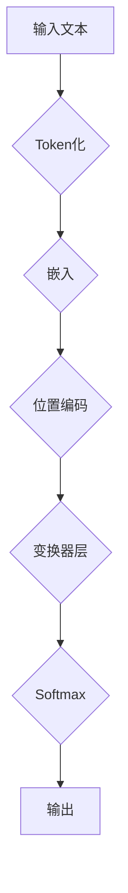

                 

### 文章标题

# 安全性设计：保护LLM应用及用户数据

### 关键词

- 安全性设计
- LLM应用
- 用户数据保护

### 摘要

本文旨在深入探讨如何通过安全性设计来保护大型语言模型（LLM）应用及其用户数据。我们将从背景介绍出发，逐步分析安全性设计原则、LLM应用的安全性需求、用户数据保护策略、安全性测试与评估、案例研究以及最佳实践。希望通过本文，读者能够全面了解并掌握保护LLM应用及用户数据的有效方法。

### 第一部分：背景介绍

#### 第1章：安全性设计概述

##### 1.1 安全性设计：问题背景

###### 1.1.1 问题的提出

在现代信息时代，数据安全和隐私保护成为了各界关注的焦点。随着人工智能技术的迅猛发展，尤其是大型语言模型（LLM）的应用越来越广泛，其安全性问题也日益凸显。LLM应用涉及到大量的用户数据和敏感信息，如何确保这些数据和信息的完整性和保密性，成为了当前亟待解决的问题。

###### 1.1.2 安全性设计的意义

安全性设计不仅仅是为了防范外部攻击，更重要的是确保内部数据的保密性、完整性和可用性。对于LLM应用来说，安全性设计意味着在设计和开发过程中，充分考虑潜在的安全威胁和风险，采用适当的技术手段和策略，保障系统的安全运行。

###### 1.1.3 安全性设计的边界与外延

安全性设计的边界包括系统架构、数据存储、数据处理、用户交互等各个环节。其外延涉及到信息安全、隐私保护、法律法规遵守等多个层面。本文将重点讨论与LLM应用直接相关的安全性设计问题。

##### 1.2 LLM应用概述

###### 1.2.1 LLM的定义

大型语言模型（LLM）是基于深度学习技术构建的语言处理模型，具有处理自然语言文本的能力。它们可以用于智能客服、智能推荐、文本生成、机器翻译等多种应用场景。

###### 1.2.2 LLM的应用场景

LLM广泛应用于智能客服、智能推荐、文本生成、机器翻译等领域。这些应用场景对模型的安全性和数据保护提出了不同的要求。

###### 1.2.3 LLM的技术原理

LLM的核心是基于神经网络和大规模数据训练的模型，通过优化模型的参数，使其能够准确地理解和生成自然语言文本。

##### 1.3 用户数据定义与重要性

###### 1.3.1 用户数据的定义

用户数据指的是用户在使用LLM应用过程中产生的数据，包括用户身份信息、行为数据、偏好数据等。

###### 1.3.2 用户数据的重要性

用户数据对于LLM应用的运行至关重要，不仅用于训练和优化模型，也是个性化推荐和服务的重要依据。同时，用户数据也是隐私泄露和安全威胁的主要目标。

###### 1.3.3 用户数据的涉及范围

用户数据的涉及范围广泛，包括用户个人信息、行为记录、交互数据等，这些数据需要在安全性设计过程中得到充分保护。

### 第二部分：安全性设计原则

#### 第2章：安全性设计原则

##### 2.1 安全性目标

###### 2.1.1 安全性目标的确定

安全性目标的确定是安全性设计的基础。对于LLM应用，安全性目标主要包括数据保密性、完整性、可用性和合法性。

###### 2.1.2 安全性目标的层次结构

安全性目标可以分为三个层次：系统级目标、数据级目标和操作级目标。系统级目标关注整个系统的安全运行；数据级目标关注数据的安全保护；操作级目标关注用户操作的安全性。

##### 2.2 设计原则

###### 2.2.1 设计原则的制定

安全性设计原则是在安全性目标的基础上制定的。主要原则包括最小权限原则、防御深度原则、安全隔离原则和安全性审计原则。

###### 2.2.2 设计原则的应用

设计原则需要在系统的各个层次和环节中得到贯彻和执行，以确保系统的安全性。

##### 2.3 安全模型

###### 2.3.1 安全模型的构建

安全模型是安全性设计的核心，用于描述系统的安全需求和安全策略。常见的安全模型包括安全需求模型和安全策略模型。

###### 2.3.2 安全模型的特点与优势

安全模型的特点是能够系统化地描述安全性需求和安全策略，具有灵活性和可扩展性。通过安全模型，可以更好地理解和控制系统的安全性。

### 第三部分：LLM应用的安全性需求

#### 第3章：应用层安全性需求

##### 3.1 应用层需求概述

###### 3.1.1 应用层需求的重要性

应用层需求直接关系到LLM应用的安全性和用户体验。正确识别和满足应用层需求是安全性设计的重要步骤。

###### 3.1.2 应用层需求的分类

应用层需求可以分为功能需求和非功能需求。功能需求包括身份验证、授权、数据加密等；非功能需求包括可靠性、可用性、性能等。

##### 3.2 具体应用场景的安全性需求

###### 3.2.1 智能客服系统的安全性需求

智能客服系统需要确保用户身份验证和权限控制的安全性，同时保护用户交互数据和隐私。

###### 3.2.2 智能推荐系统的安全性需求

智能推荐系统需要防止数据泄露和滥用，确保推荐算法的公平性和透明性。

###### 3.2.3 自然语言处理平台的安全性需求

自然语言处理平台需要确保数据存储、传输和处理的安全性，防止未授权访问和数据泄露。

#### 第4章：系统层安全性需求

##### 4.1 系统层需求概述

###### 4.1.1 系统层需求的重要性

系统层需求直接关系到LLM应用的基础设施和运行环境的安全性。确保系统层需求得到满足是保障应用层安全性的基础。

###### 4.1.2 系统层需求的分类

系统层需求包括操作系统安全、网络安全、存储安全和备份与恢复等。

##### 4.2 系统架构的安全性设计

###### 4.2.1 系统架构的安全性设计原则

系统架构的安全性设计原则包括安全性隔离、多级安全控制、安全审计和应急响应等。

###### 4.2.2 系统架构的安全性评估方法

系统架构的安全性评估方法包括安全测试、安全评估和安全审计等。

#### 第5章：数据层安全性需求

##### 5.1 数据层需求概述

###### 5.1.1 数据层需求的重要性

数据层需求直接关系到LLM应用的数据安全性和完整性。确保数据层需求得到满足是保障系统安全性的关键。

###### 5.1.2 数据层需求的分类

数据层需求包括数据加密、数据备份与恢复、数据脱敏和数据访问控制等。

##### 5.2 数据处理过程中的安全性需求

###### 5.2.1 数据加密的需求

数据加密是保障数据安全性的重要手段，需要确保数据在存储、传输和处理过程中的加密。

###### 5.2.2 数据访问控制的需求

数据访问控制是确保数据被授权用户访问和控制的重要机制。

###### 5.2.3 数据脱敏的需求

数据脱敏是保护用户隐私的重要手段，需要确保敏感数据在处理和存储过程中被脱敏。

### 第四部分：用户数据保护策略

#### 第6章：数据加密

##### 6.1 数据加密技术概述

###### 6.1.1 数据加密的定义

数据加密是将数据转换成密文的过程，只有授权用户才能解密并获取原始数据。

###### 6.1.2 数据加密的分类

数据加密可以分为对称加密和非对称加密两种类型。

##### 6.2 常见加密算法及应用

###### 6.2.1 对称加密算法

对称加密算法使用相同的密钥进行加密和解密，如AES、DES等。

###### 6.2.2 非对称加密算法

非对称加密算法使用不同的密钥进行加密和解密，如RSA、ECC等。

###### 6.2.3 哈希算法

哈希算法用于生成数据的摘要，如MD5、SHA-256等。

#### 第7章：访问控制

##### 7.1 访问控制概述

###### 7.1.1 访问控制的定义

访问控制是限制和监控用户对系统资源的访问权限的过程。

###### 7.1.2 访问控制的分类

访问控制可以分为基于角色的访问控制（RBAC）、基于属性的访问控制（ABAC）等。

##### 7.2 常见访问控制机制

###### 7.2.1 基于角色的访问控制（RBAC）

基于角色的访问控制（RBAC）将用户和角色关联起来，角色与权限相对应，用户通过角色获得权限。

###### 7.2.2 访问控制列表（ACL）

访问控制列表（ACL）是一种细粒度的访问控制机制，为每个对象设置访问权限。

### 第五部分：安全性测试与评估

#### 第8章：安全性测试与评估

##### 8.1 安全测试方法

安全性测试是评估LLM应用安全性的重要手段，包括渗透测试、漏洞扫描、代码审计等。

##### 8.2 安全评估流程

安全评估流程包括风险评估、安全测试、漏洞修复和安全审计等环节。

##### 8.3 漏洞修复与改进

漏洞修复与改进是安全性设计的重要环节，需要及时修复已发现的漏洞，并根据安全评估结果进行持续改进。

### 第六部分：安全性设计与实现案例

#### 第9章：安全性设计与实现案例

##### 9.1 案例背景

介绍一个具体的LLM应用案例，如智能客服系统。

##### 9.2 安全性设计方案

详细描述案例中的安全性设计方案，包括安全模型、安全性需求、安全策略等。

##### 9.3 实现细节

介绍案例中的安全性设计如何在实际开发过程中得到实现，包括技术选型、开发工具、安全框架等。

##### 9.4 安全效果评估

对案例中的安全性设计效果进行评估，包括安全性测试结果、用户反馈等。

### 第七部分：安全性最佳实践

#### 第10章：安全性最佳实践

##### 10.1 设计原则回顾

回顾本文提到的安全性设计原则，如最小权限原则、防御深度原则等。

##### 10.2 用户数据保护实践

介绍用户数据保护的最佳实践，如数据加密、访问控制等。

##### 10.3 安全性测试与评估实践

介绍安全性测试与评估的最佳实践，如渗透测试、安全审计等。

##### 10.4 小结与展望

总结本文的核心内容，并对未来的安全性设计提出展望。

### 作者信息

- 作者：AI天才研究院/AI Genius Institute & 禅与计算机程序设计艺术 /Zen And The Art of Computer Programming

---

### 附录

- 参考文献
- 参考资料

---

### 结语

本文通过对LLM应用及其用户数据安全性设计的全面探讨，希望能够为读者提供有价值的参考。随着人工智能技术的不断进步，安全性设计将越来越重要。让我们共同努力，为构建安全可靠的人工智能生态系统贡献力量。

---

在完成上述文章框架的构建后，我们可以根据这个大纲逐步填充内容，确保每个章节都详细、具体、有深度。以下是一个例子，展示了如何撰写第1章的一部分：

## 第1章：安全性设计概述

### 1.1 安全性设计：问题背景

#### 1.1.1 问题的提出

在当今数字化时代，信息安全已成为社会发展的重要议题。随着人工智能（AI）技术的快速发展和广泛应用，尤其是大型语言模型（LLM）的出现，其安全性问题愈发引起关注。LLM具有强大的数据处理和生成能力，被广泛应用于智能客服、智能推荐、文本生成等领域。然而，这些应用在带来便利的同时，也带来了新的安全风险。

#### 1.1.2 安全性设计的意义

安全性设计是对系统在设计和开发阶段进行的安全考量，其核心目标是保护系统免受各种安全威胁，确保数据的保密性、完整性和可用性。对于LLM应用而言，安全性设计不仅关乎系统的稳定运行，更涉及到用户隐私和数据安全，因此具有重要的现实意义。

#### 1.1.3 安全性设计的边界与外延

安全性设计的边界涵盖了从系统架构到数据存储，从数据处理到用户交互的各个环节。其外延则包括对系统内部安全威胁的防御、外部攻击的防护，以及法律法规的遵守等多个层面。具体来说，安全性设计需要关注以下几个方面：

1. **系统层面**：确保系统的整体安全性，包括操作系统安全、网络防护、系统加固等。
2. **数据层面**：确保数据的保密性、完整性和可用性，包括数据加密、数据备份与恢复等。
3. **应用层面**：确保应用功能的安全性，包括身份验证、权限控制、接口安全等。
4. **用户层面**：确保用户操作的安全性，包括用户教育、操作审计等。

#### 1.1.4 安全性设计的核心要素

安全性设计的核心要素包括以下几个方面：

1. **安全需求分析**：识别和确定系统的安全需求，包括保密性、完整性、可用性等。
2. **安全策略制定**：根据安全需求制定相应的安全策略，包括加密、访问控制、安全审计等。
3. **安全模型构建**：构建安全模型，用于描述系统的安全需求和安全策略，如安全需求模型和安全策略模型。
4. **安全架构设计**：在系统架构设计阶段融入安全性考虑，确保系统架构的安全性和可扩展性。
5. **安全测试与评估**：对系统进行安全性测试和评估，确保系统在实际运行中的安全性。

通过以上要素，我们可以构建一个全面的安全性设计框架，确保LLM应用及其用户数据的安全。

### 1.2 LLM应用概述

在撰写具体章节时，我们需要对LLM的定义、应用场景、技术原理等进行详细的阐述，同时使用核心概念术语说明、概念属性特征对比表格和ER实体关系图架构的Mermaid流程图，以增强文章的直观性和逻辑性。

例如：

#### 1.2.1 LLM的定义

大型语言模型（LLM）是一种基于深度学习技术的语言处理模型，通过大规模的数据训练，使其具备理解和生成自然语言文本的能力。LLM的核心是神经网络模型，如变换器架构（Transformer）等。

#### 1.2.2 LLM的应用场景

LLM在多个领域具有广泛应用，包括但不限于：

1. **智能客服**：使用LLM自动处理用户查询，提高客户服务效率。
2. **智能推荐**：根据用户行为和偏好，提供个性化的推荐服务。
3. **文本生成**：自动生成文章、报告、对话等自然语言文本。
4. **机器翻译**：实现不同语言之间的自动翻译。

#### 1.2.3 LLM的技术原理

LLM的技术原理基于深度学习和神经网络，特别是变换器架构（Transformer）。Transformer模型通过多头注意力机制（Multi-Head Attention）和自注意力（Self-Attention）机制，使模型能够捕捉长距离依赖和复杂的关系。

上述Mermaid流程图展示了LLM从输入文本到输出的基本处理流程。

通过这样的方式，我们可以确保文章内容丰富、结构清晰，同时具备实际操作价值。

接下来，我们将按照上述框架逐步完善每个章节的内容，确保整个文章的逻辑性和连贯性，最终完成一篇高质量的技术博客文章。在撰写过程中，我们将不断迭代和优化，确保文章的专业性和可读性。让我们一步一步地深入分析和探讨，以期为读者带来有深度和思考的价值。

