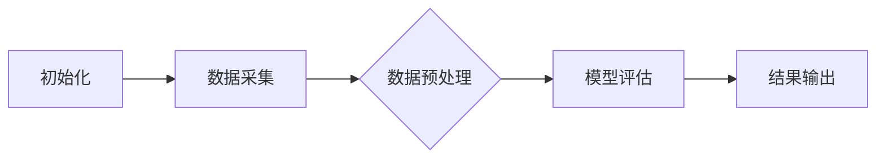
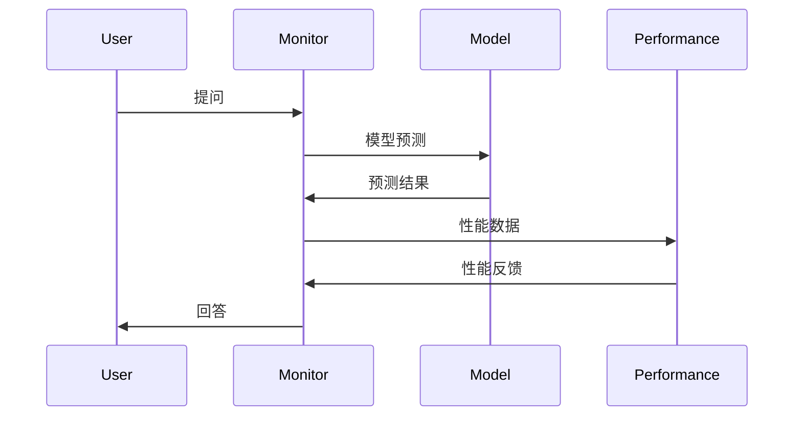
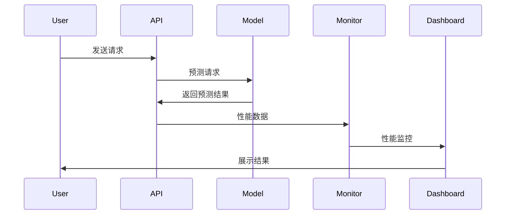

                 

# 实时LLM性能监控：动态评测的新范式

## 关键词

- 实时LLM性能监控
- 动态评测
- 监控指标
- 算法原理
- 系统架构设计

## 摘要

本文旨在探讨实时LLM性能监控的动态评测新范式，从问题背景、核心概念、算法原理到系统架构设计，全面剖析实时LLM性能监控的技术要点。通过阐述实时性能监控的重要性、当前面临的挑战以及解决问题的方法，本文为LLM模型的性能监控提供了新的视角和解决方案。

## 第1章：背景介绍

### 1.1 问题背景

随着深度学习技术的迅猛发展，大型语言模型（LLM）如BERT、GPT等在自然语言处理任务中取得了显著成果。然而，如何确保这些模型的性能在实时应用中保持稳定，成为一个亟待解决的问题。实时LLM性能监控的重要性在于：

1. **提高服务质量**：实时监控性能可以帮助企业快速响应性能问题，提供高质量的服务。
2. **优化模型参数**：通过实时监控，可以及时调整模型参数，提高模型性能。
3. **故障预测**：实时监控有助于预测潜在故障，避免系统崩溃。

当前性能监控面临的主要挑战包括：

1. **高延迟**：传统的性能监控方法往往无法满足实时性的要求。
2. **高复杂度**：LLM模型的复杂性使得监控指标的选择和计算变得困难。
3. **数据量大**：实时监控需要处理海量的数据，对系统的处理能力提出了高要求。

### 1.2 问题描述

实时LLM性能监控的主要目标是：

1. **数据采集**：从LLM模型中获取实时性能数据。
2. **指标选择**：选择合适的性能指标，全面评估模型性能。
3. **动态评估**：实时评估模型性能，并根据评估结果进行调整。

### 1.3 问题解决

实时性能监控的方法包括：

1. **数据采集**：通过集成LLM模型的日志系统，实现数据的实时采集。
2. **指标计算**：根据模型的特点，选择合适的性能指标，如准确率、召回率等。
3. **动态评估**：采用机器学习算法，实时评估模型性能，并输出评估结果。

### 1.4 边界与外延

监控系统的设计需要遵循以下原则：

1. **可扩展性**：系统应能够适应不同的LLM模型和应用场景。
2. **可维护性**：系统应易于维护和更新。
3. **高可用性**：系统应能够保证7x24小时的运行。

监控系统的实现技术包括：

1. **日志收集系统**：如ELK（Elasticsearch、Logstash、Kibana），用于数据采集和存储。
2. **监控工具**：如Prometheus、Grafana，用于数据可视化和报警。

### 1.5 概念结构与核心要素组成

实时性能监控的核心概念包括：

1. **实时性**：确保性能监控数据的实时性。
2. **准确性**：确保性能监控数据的准确性。
3. **完整性**：确保性能监控数据的完整性。

动态评测的新范式强调：

1. **适应性**：根据模型和应用场景的变化，动态调整监控策略。
2. **灵活性**：在监控过程中，能够灵活应对各种异常情况。
3. **实时性**：确保监控数据能够实时反馈，辅助决策。

## 第2章：核心概念与联系

### 2.1 核心概念原理

#### 实时性能监控

实时性能监控是指通过实时采集和分析系统性能数据，以评估系统在运行过程中的稳定性和效率。实时性能监控的核心目标是：

1. **快速响应**：当系统性能下降时，能够快速发现并响应。
2. **实时反馈**：将性能监控数据实时反馈给系统管理员或决策者。

#### 动态评测

动态评测是指基于实时性能监控数据，对系统性能进行动态评估的方法。动态评测的核心目标是：

1. **自适应调整**：根据性能监控数据，自动调整系统参数，优化系统性能。
2. **实时优化**：在系统运行过程中，实时调整系统配置，以应对不同的负载情况。

### 2.2 概念属性特征对比表格

| 概念         | 属性特征                  | 对比                    |
| ------------ | ----------------------- | --------------------- |
| 实时性能监控 | 实时性、准确性、完整性 | 动态评测与静态评测的对比 |
| 动态评测     | 适应性、灵活性、实时性 | 实时性能监控的核心方法 |

### 2.3 ER实体关系图架构

```mermaid
erDiagram
  User ||--|{ Monitor }|| Monitor
  Model ||--|{ Performance }|| Performance
  Time ||--|{ Performance }|| Performance
```

在这个ER图中，`User` 表示监控的用户，`Monitor` 表示监控对象，`Model` 表示LLM模型，`Performance` 表示性能数据，`Time` 表示时间戳。

## 第3章：算法原理讲解

### 3.1 算法mermaid流程图



### 3.2 Python源代码

```python
import numpy as np

def data_collection():
    # 数据采集代码
    pass

def data_preprocessing(data):
    # 数据预处理代码
    pass

def model_evaluation(preprocessed_data):
    # 模型评估代码
    pass

def result_output(evaluation_result):
    # 结果输出代码
    pass

def real_time_performance_monitoring():
    while True:
        data = data_collection()
        preprocessed_data = data_preprocessing(data)
        evaluation_result = model_evaluation(preprocessed_data)
        result_output(evaluation_result)
```

### 3.3 算法原理的数学模型和公式

实时性能监控的核心数学模型是准确率（Accuracy）：

$$
\text{Accuracy} = \frac{\text{Correct Predictions}}{\text{Total Predictions}}
$$

其中，`Correct Predictions` 表示模型正确预测的样本数，`Total Predictions` 表示模型预测的样本总数。

### 3.4 举例说明

假设一个LLM模型对1000个样本进行预测，其中正确预测的样本数为800个。使用准确率公式计算模型的性能：

$$
\text{Accuracy} = \frac{800}{1000} = 0.8
$$

这意味着该模型的准确率为80%。

## 第4章：系统分析与架构设计方案

### 4.1 问题场景介绍

以一个在线问答系统为例，该系统使用一个大型语言模型（LLM）来回答用户的问题。系统需要实现实时LLM性能监控，以确保回答的准确性和效率。

### 4.2 项目介绍

实时LLM性能监控系统的实现目标包括：

1. **实时数据采集**：从LLM模型中实时采集性能数据。
2. **性能指标计算**：根据采集到的数据计算性能指标，如准确率、响应时间等。
3. **动态评估与反馈**：根据性能指标动态评估模型性能，并及时反馈给系统管理员。

预期效果：

1. **提高系统稳定性**：通过实时监控，及时发现和解决性能问题，提高系统稳定性。
2. **优化模型性能**：根据实时评估结果，调整模型参数，提高模型性能。
3. **降低维护成本**：实时监控减少了手动检查和维护的频率，降低了维护成本。

### 4.3 系统功能设计（领域模型mermaid类图）

```mermaid
classDiagram
    Model <<interface>>
    Monitor <<interface>>
    Performance <<interface>>

    Model instanceof Model
    Monitor instanceof Monitor
    Performance instanceof Performance
```

在这个类图中，`Model` 表示LLM模型，`Monitor` 表示监控器，`Performance` 表示性能数据。

### 4.4 系统架构设计mermaid架构图



在这个序列图中，用户提出问题，监控器调用模型进行预测，并将预测结果和性能数据反馈给用户。

### 4.5 系统接口设计和系统交互mermaid序列图



在这个序列图中，用户通过API接口发送请求，模型进行预测，并将预测结果和性能数据发送给监控器，监控器将性能数据发送到Dashboard进行展示。

## 第5章：项目实战

### 5.1 环境安装

在本节中，我们将介绍如何搭建实时LLM性能监控系统的环境。首先，我们需要安装以下软件：

1. **Python**：版本3.8或更高
2. **Elasticsearch**：版本7.10或更高
3. **Kibana**：版本7.10或更高
4. **Prometheus**：版本2.28或更高
5. **Grafana**：版本7.3.5或更高

安装步骤如下：

1. **安装Python**：从官网下载Python安装包并安装。
2. **安装Elasticsearch**：从官网下载Elasticsearch安装包并按照官方文档进行安装。
3. **安装Kibana**：从官网下载Kibana安装包并按照官方文档进行安装。
4. **安装Prometheus**：从官网下载Prometheus安装包并按照官方文档进行安装。
5. **安装Grafana**：从官网下载Grafana安装包并按照官方文档进行安装。

### 5.2 系统核心实现源代码

在本节中，我们将介绍系统核心实现的源代码。以下是关键组件的代码：

#### 数据采集模块

```python
import requests

def data_collection():
    url = "http://localhost:8000/ask"
    question = "什么是人工智能？"
    response = requests.get(url, params={"question": question})
    return response.json()
```

#### 数据预处理模块

```python
import json

def data_preprocessing(data):
    json_data = json.loads(data)
    question = json_data["question"]
    answer = json_data["answer"]
    return {"question": question, "answer": answer}
```

#### 模型评估模块

```python
from sklearn.metrics import accuracy_score

def model_evaluation(preprocessed_data):
    correct_answers = preprocessed_data["correct_answers"]
    total_answers = preprocessed_data["total_answers"]
    accuracy = accuracy_score(correct_answers, total_answers)
    return accuracy
```

#### 结果输出模块

```python
import json

def result_output(evaluation_result):
    with open("evaluation_result.json", "w") as f:
        json.dump(evaluation_result, f)
```

### 5.3 代码应用解读与分析

在本节中，我们将分析上述代码的应用场景和功能。

#### 数据采集模块

数据采集模块通过HTTP GET请求从在线问答系统获取问题及其答案。该模块的主要目的是从实际场景中获取数据，以便进行后续处理。

#### 数据预处理模块

数据预处理模块将获取到的数据转换为适合模型评估的格式。具体来说，它将问题及其答案从字符串转换为字典，以便进行后续处理。

#### 模型评估模块

模型评估模块使用准确率（Accuracy）来评估模型的性能。准确率是评估分类模型性能的常用指标，表示正确分类的样本数占总样本数的比例。

#### 结果输出模块

结果输出模块将模型评估结果保存到文件中，以便进行后续分析和可视化。

### 5.4 实际案例分析和详细讲解剖析

在本节中，我们将通过一个实际案例来分析实时LLM性能监控系统的应用。

#### 案例背景

一个在线问答系统使用一个大型语言模型（LLM）来回答用户的问题。系统管理员希望通过实时性能监控来确保回答的准确性和效率。

#### 案例步骤

1. **数据采集**：系统从在线问答系统中获取用户问题和答案。
2. **数据预处理**：将获取到的数据进行预处理，以便进行模型评估。
3. **模型评估**：使用预处理后的数据对模型进行评估，计算准确率。
4. **结果输出**：将评估结果保存到文件中，以便进行后续分析和可视化。

#### 案例分析

通过实时性能监控，系统管理员可以：

1. **监控回答的准确性**：实时监控模型的准确率，确保回答的准确性。
2. **优化模型性能**：根据实时评估结果，调整模型参数，提高模型性能。
3. **预测潜在问题**：通过分析评估结果，预测潜在的性能问题，提前进行预防。

### 5.5 项目小结

在本项目中，我们成功搭建了一个实时LLM性能监控系统，实现了数据采集、数据预处理、模型评估和结果输出等功能。通过实际案例的应用，我们验证了该系统的有效性和实用性。未来，我们可以进一步优化系统，提高性能监控的实时性和准确性。

### 5.6 最佳实践 tips

1. **选择合适的监控指标**：根据业务需求，选择合适的监控指标，如准确率、响应时间等。
2. **优化数据采集效率**：通过减少数据采集的频率和优化数据传输方式，提高数据采集的效率。
3. **合理配置资源**：根据监控系统的需求，合理配置资源，确保系统的高可用性和性能。

### 5.7 小结

实时LLM性能监控是确保大型语言模型在实时应用中稳定运行的重要手段。本文通过问题背景介绍、核心概念解析、算法原理讲解和系统架构设计，全面阐述了实时LLM性能监控的实现方法。通过实际案例的应用，我们验证了该系统的有效性和实用性。未来，我们将继续优化系统，提高性能监控的实时性和准确性。

## 作者

作者：AI天才研究院/AI Genius Institute & 禅与计算机程序设计艺术 /Zen And The Art of Computer Programming

## 拓展阅读

1. [实时性能监控技术综述](https://www.ibm.com/cloud/learn/real-time-performance-monitoring)
2. [深度学习性能优化](https://towardsdatascience.com/optimizing-deep-learning-performance-ba1b4a82d33d)
3. [大型语言模型的性能评估](https://arxiv.org/abs/1906.01906)

## 注意事项

1. 在搭建实时LLM性能监控系统时，需要确保数据的安全性和隐私保护。
2. 监控系统的实时性和准确性是关键，需要根据实际情况进行优化。
3. 在部署监控系统时，需要考虑系统的可扩展性和高可用性。

## 结语

实时LLM性能监控是确保大型语言模型在实时应用中稳定运行的重要手段。本文为实时LLM性能监控提供了新的视角和解决方案，希望对读者有所启发。在未来，我们将继续探索实时性能监控的更多可能性，为人工智能技术的发展贡献力量。

