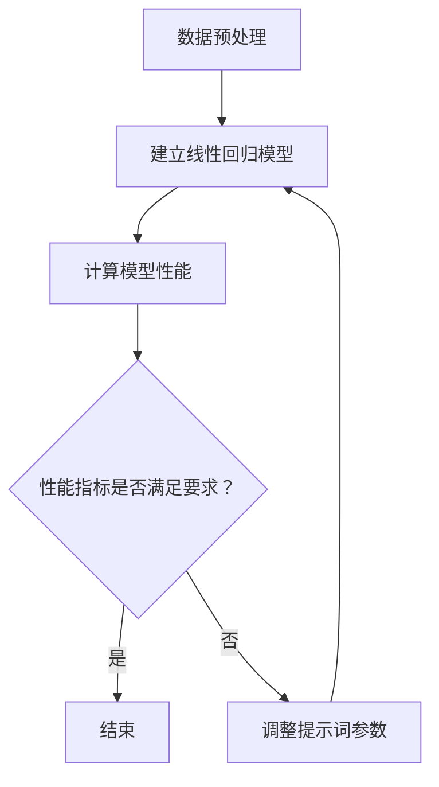
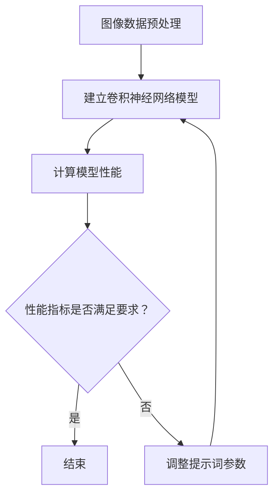
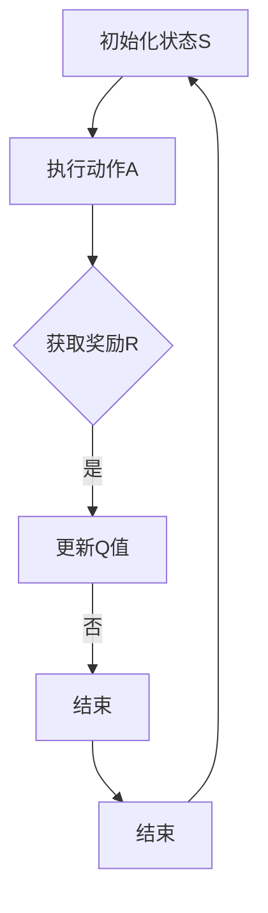
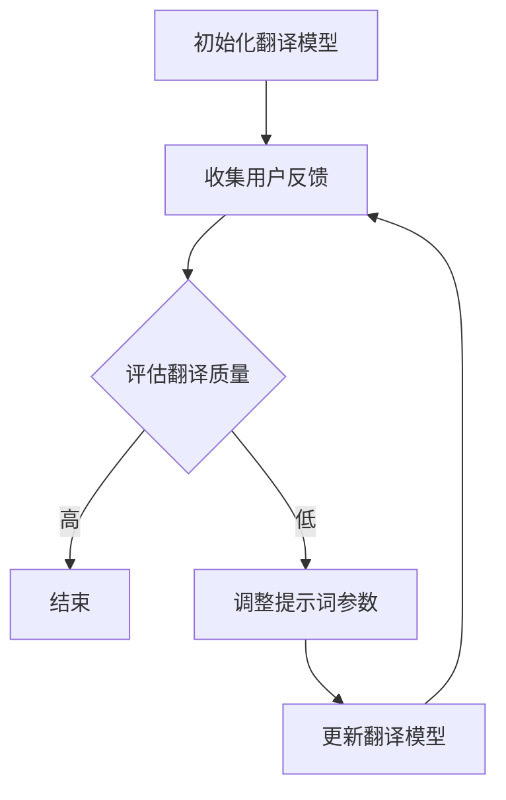
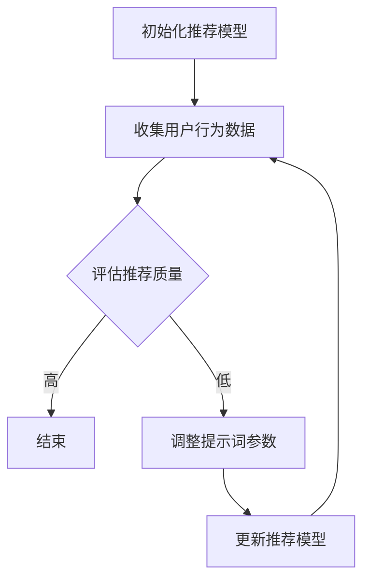
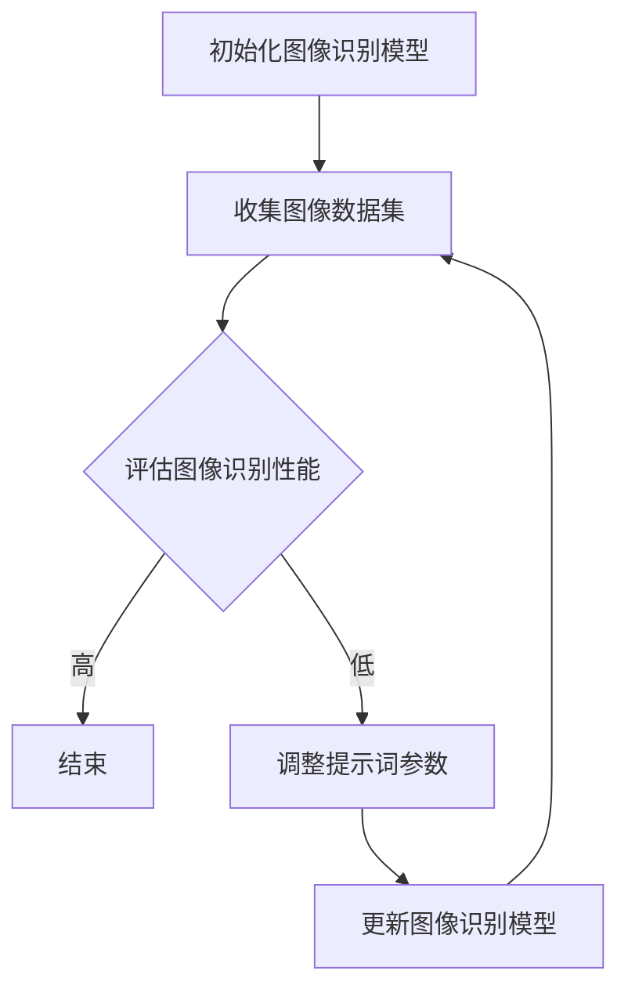

                 

# 实时优化：动态调整提示词参数

> 关键词：实时优化、提示词参数、动态调整、机器学习、深度学习、强化学习、自然语言处理、推荐系统

> 摘要：本文详细探讨了实时优化以及提示词参数动态调整的重要性，阐述了实时优化的概念、技术基础、提示词参数的基本概念及其调整方法。通过分析机器学习、深度学习和强化学习在提示词参数调整中的应用，本文提供了具体的案例分析，展示了实时优化在自然语言处理、推荐系统和其他领域中的应用，并对未来趋势进行了展望。

## 目录大纲

1. **实时优化概述**
   1.1 实时优化的概念与重要性
   1.2 实时优化的主要领域
   1.3 实时优化的挑战与机遇

2. **实时优化的技术基础**
   2.1 数据收集与处理
   2.2 模型评估与选择
   2.3 实时反馈机制

3. **提示词参数动态调整方法**
   3.1 提示词参数的基本概念
   3.2 基于机器学习的提示词参数调整
   3.3 基于深度学习的提示词参数调整
   3.4 基于强化学习的提示词参数调整

4. **实时优化与提示词参数调整的应用案例**
   4.1 实时优化在自然语言处理中的应用
   4.2 实时优化在推荐系统中的应用
   4.3 实时优化在其他领域的应用

5. **总结与展望**
   5.1 未来发展趋势
   5.2 技术挑战与解决方案
   5.3 实时优化与提示词参数调整的潜在应用领域

## 第1章：实时优化的概念与重要性

### 1.1 实时优化的定义

实时优化（Real-time Optimization，简称RTO）是指在一个动态变化的环境中，对系统的参数或策略进行动态调整，以实现最优或近似最优的性能。这种优化过程要求在数据不断更新的情况下快速响应，并在短时间内完成调整。

**核心概念：**
- **实时性**：实时优化需要在极短的时间内（通常以毫秒或秒为单位）完成优化任务。
- **动态调整**：实时优化不是一次性的操作，而是一个持续的过程，需要不断对参数进行调整。
- **数据依赖**：实时优化的效果高度依赖于实时数据的质量和准确性。
- **持续优化**：实时优化的目标是持续提高系统的性能，而不是在某个特定时间点达到最优。

**属性特征：**
- **快速响应**：系统能够快速响应当前环境的变动，保持高效率运行。
- **动态调整**：参数或策略能够根据实时数据自动调整，以适应新的环境条件。
- **数据依赖**：优化过程高度依赖实时数据，数据质量直接影响优化效果。
- **持续优化**：实时优化是一个持续的过程，系统性能会随着时间不断改进。

### 1.2 实时优化的主要领域

实时优化广泛应用于多个领域，其中一些主要领域包括：

- **机器学习**：在机器学习模型训练和部署过程中，实时优化可以用于调整模型的超参数，以实现更好的性能。
- **推荐系统**：实时优化可以用于动态调整推荐算法的权重，提高推荐准确性。
- **控制理论**：实时优化在自动控制系统中用于调整控制器参数，以实现更好的控制效果。
- **金融交易**：在金融市场，实时优化用于交易策略的动态调整，以最大化收益。
- **网络通信**：实时优化用于调整网络参数，提高数据传输效率和质量。

### 1.3 实时优化的挑战与机遇

实时优化虽然具有巨大潜力，但也面临一些挑战：

**挑战：**
- **数据处理速度**：实时优化要求在极短的时间内处理大量数据，这对计算资源提出了很高的要求。
- **计算资源限制**：在许多应用场景中，计算资源有限，如何高效利用资源是一个重要问题。
- **模型稳定性**：动态调整可能导致模型性能波动，如何保持模型的稳定性是一个挑战。

**机遇：**
- **性能提升**：实时优化可以帮助系统在动态环境中保持高效率，从而提升整体性能。
- **用户体验**：在推荐系统等应用中，实时优化可以提供更加精准和个性化的服务，提高用户体验。
- **创新应用**：随着技术的不断发展，实时优化将会有更多的创新应用场景，为各个领域带来新的机遇。

## 第2章：实时优化的技术基础

### 2.1 数据收集与处理

数据收集与处理是实时优化的基础。实时数据的质量和准确性直接影响优化效果。

**核心概念：**
- **实时数据收集**：通过传感器、日志文件、API接口等方式收集实时数据。
- **数据处理**：对收集到的数据进行清洗、转换、存储等处理，以便后续分析。

**技术方法：**
- **数据采集工具**：如Flume、Kafka等，用于实时收集数据。
- **流处理框架**：如Apache Flink、Apache Storm等，用于实时处理和分析数据。

### 2.2 模型评估与选择

模型评估与选择是实时优化的关键环节。正确的模型评估和选择可以确保优化效果。

**核心概念：**
- **模型评估**：通过指标（如准确率、召回率、F1分数等）对模型性能进行评估。
- **模型选择**：从多个候选模型中选择最适合当前问题的模型。

**技术方法：**
- **指标选择**：根据问题特点选择合适的评估指标。
- **交叉验证**：通过交叉验证方法评估模型性能。
- **模型选择算法**：如随机森林、支持向量机等，用于从多个模型中选择最佳模型。

### 2.3 实时反馈机制

实时反馈机制是实时优化的核心驱动力。通过实时反馈，系统可以动态调整参数或策略。

**核心概念：**
- **反馈循环**：系统根据实时反馈调整参数或策略，然后再次进行评估和反馈。
- **性能指标监控**：持续监控系统性能，确保优化过程有效。

**技术方法：**
- **反馈循环设计**：设计有效的反馈循环，确保参数或策略调整能够及时响应环境变化。
- **自适应调整策略**：根据实时反馈调整参数或策略，以实现最优性能。

## 第3章：提示词参数的基本概念

### 3.1 提示词参数的定义

提示词参数是指影响模型性能的调整参数。这些参数可以用于调整模型的行为，以适应不同的数据集和应用场景。

**核心概念：**
- **提示词参数**：用于调整模型行为的参数。
- **性能影响**：提示词参数对模型性能有直接或间接的影响。

**属性特征：**
- **可调性**：提示词参数是可以调整的。
- **敏感性**：提示词参数的微小变化可能对模型性能产生显著影响。
- **作用范围**：提示词参数的作用范围可以是一个或多个模型组件。

### 3.2 提示词参数的作用

提示词参数在模型优化中起着至关重要的作用。其主要作用包括：

- **提升模型性能**：通过调整提示词参数，可以改善模型在不同数据集上的表现。
- **适应不同数据集**：提示词参数可以帮助模型适应不同的数据分布和特征。
- **优化用户体验**：在应用场景中，提示词参数可以调整模型输出，以提高用户体验。

### 3.3 提示词参数的分类

提示词参数可以根据不同的分类方法进行分类：

- **按参数类型**：
  - **数值型参数**：如学习率、正则化参数等。
  - **分类型参数**：如类别标签、超参数组合等。

- **按作用范围**：
  - **全局参数**：影响整个模型的性能。
  - **局部参数**：仅影响模型的部分组件。

## 第4章：基于机器学习的提示词参数调整

### 4.1 机器学习基础

机器学习是指利用数据或经验改善模型性能的过程。机器学习包括多个子领域，如监督学习、无监督学习和强化学习。

**核心概念：**
- **监督学习**：通过已知标签数据训练模型，以预测未知数据的标签。
- **无监督学习**：无需标签数据，通过分析数据特征来发现数据结构。
- **强化学习**：通过与环境交互，学习最优策略以最大化奖励。

**技术方法：**
- **回归分析**：通过建立回归模型预测连续值输出。
- **决策树**：通过树形结构对数据进行分类或回归。
- **支持向量机**：通过找到最佳超平面进行分类或回归。

### 4.2 提示词参数调整的机器学习方法

基于机器学习的提示词参数调整方法主要包括回归分析、决策树和支持向量机等。

**核心方法：**
- **回归分析**：通过建立回归模型，将提示词参数与模型性能指标关联，进而调整提示词参数。
- **决策树**：通过树形结构，将不同提示词参数的组合映射到最佳性能配置。
- **支持向量机**：通过找到最佳超平面，调整提示词参数以最大化模型性能。

### 4.3 案例研究：基于线性回归的提示词参数调整

**案例背景：**  
假设我们有一个分类任务，需要使用线性回归模型对数据集进行分类。

**问题描述：**  
我们需要调整线性回归模型的学习率、正则化参数等提示词参数，以实现最佳分类性能。

**问题解决：**  
通过线性回归方法，我们可以将模型性能指标（如准确率）作为响应变量，将提示词参数作为解释变量，建立回归模型。然后，通过优化回归模型参数，调整提示词参数。

**边界与外延：**  
- **边界**：线性回归方法适用于连续值输出的问题，提示词参数需为数值型。
- **外延**：线性回归方法可以扩展到其他回归模型，如多项式回归、岭回归等。

**概念结构与核心要素组成：**
- **概念结构**：线性回归模型、提示词参数、模型性能指标。
- **核心要素组成**：回归模型参数、损失函数、优化算法。

**Mermaid 流程图：**

## 第5章：基于深度学习的提示词参数调整

### 5.1 深度学习基础

深度学习是一种基于多层神经网络的学习方法，通过模拟人脑神经元连接结构，自动提取数据特征，实现复杂的模式识别和预测任务。

**核心概念：**
- **神经网络**：由多个神经元（节点）组成的层次结构，用于实现从输入到输出的映射。
- **激活函数**：用于引入非线性特性，使神经网络具有更强的表达能力和学习能力。
- **反向传播**：通过反向传播算法，计算损失函数关于网络参数的梯度，并更新参数以优化模型。

**技术方法：**
- **卷积神经网络（CNN）**：通过卷积操作和池化操作提取图像特征。
- **循环神经网络（RNN）**：通过循环结构处理序列数据。
- **生成对抗网络（GAN）**：通过生成器和判别器之间的对抗训练生成高质量数据。

### 5.2 提示词参数调整的深度学习方法

基于深度学习的提示词参数调整方法主要包括基于卷积神经网络的提示词参数调整和基于循环神经网络的提示词参数调整。

**核心方法：**
- **卷积神经网络**：通过卷积层和池化层提取图像特征，调整卷积核大小、步长、填充方式等提示词参数。
- **循环神经网络**：通过循环层和门控机制处理序列数据，调整隐藏层大小、学习率、正则化参数等提示词参数。

### 5.3 案例研究：基于卷积神经网络的提示词参数调整

**案例背景：**  
假设我们有一个图像分类任务，使用卷积神经网络模型进行分类。

**问题描述：**  
我们需要调整卷积神经网络模型的学习率、正则化参数等提示词参数，以实现最佳分类性能。

**问题解决：**  
通过卷积神经网络模型，我们可以将模型性能指标（如准确率）作为响应变量，将提示词参数作为解释变量，建立回归模型。然后，通过优化回归模型参数，调整提示词参数。

**边界与外延：**  
- **边界**：卷积神经网络方法适用于图像分类和识别任务，提示词参数需为数值型。
- **外延**：卷积神经网络方法可以扩展到其他图像处理任务，如目标检测、语义分割等。

**概念结构与核心要素组成：**
- **概念结构**：卷积神经网络模型、提示词参数、模型性能指标。
- **核心要素组成**：卷积层、池化层、激活函数、损失函数、优化算法。

**Mermaid 流程图：**

## 第6章：基于强化学习的提示词参数调整

### 6.1 强化学习基础

强化学习是一种通过与环境交互来学习最优策略的机器学习方法。在强化学习过程中，智能体通过不断尝试不同的行动，并根据环境的反馈来调整策略，以实现长期最大化奖励。

**核心概念：**
- **智能体（Agent）**：执行行动并接收环境反馈的实体。
- **环境（Environment）**：智能体行动的场所，提供状态和奖励。
- **状态（State）**：描述环境当前状态的属性。
- **行动（Action）**：智能体可以采取的动作。
- **策略（Policy）**：智能体采取行动的规则。
- **价值函数（Value Function）**：描述状态或状态-动作对的期望回报。
- **策略评估（Policy Evaluation）**：通过评估策略下的状态值函数来改进策略。
- **策略迭代（Policy Iteration）**：通过交替进行策略评估和策略改进来优化策略。

**技术方法：**
- **Q-Learning**：一种基于值函数的强化学习算法，通过更新Q值来优化策略。
- **SARSA**：一种基于策略的强化学习算法，同时考虑当前和未来的奖励。
- **Deep Q-Network (DQN)**：使用深度神经网络来近似Q值函数的强化学习算法。
- **Actor-Critic**：通过同时优化策略和价值函数来学习最优策略。

### 6.2 提示词参数调整的强化学习方法

基于强化学习的提示词参数调整方法主要包括Q-Learning和Actor-Critic等方法。

**核心方法：**
- **Q-Learning**：通过更新Q值来调整提示词参数，以实现最佳性能。
- **Actor-Critic**：通过同时优化策略和价值函数来调整提示词参数。

### 6.3 案例研究：基于Q-Learning的提示词参数调整

**案例背景：**    
假设我们有一个推荐系统，需要调整推荐算法的提示词参数。

**问题描述：**    
我们需要调整推荐算法的学习率、正则化参数等提示词参数，以实现最佳推荐性能。

**问题解决：**    
通过Q-Learning算法，我们可以将模型性能指标（如准确率）作为奖励，通过更新Q值来调整提示词参数。

**边界与外延：**    
- **边界**：Q-Learning方法适用于需要调整提示词参数的推荐系统任务。
- **外延**：Q-Learning方法可以扩展到其他需要动态调整参数的任务，如控制理论、游戏AI等。

**概念结构与核心要素组成：**
- **概念结构**：Q-Learning算法、提示词参数、模型性能指标。
- **核心要素组成**：状态、动作、奖励、Q值函数、学习率。

**Mermaid 流程图：**

## 第7章：实时优化在自然语言处理中的应用

### 7.1 NLP基础

自然语言处理（Natural Language Processing，简称NLP）是人工智能领域的一个重要分支，致力于使计算机能够理解、生成和处理人类自然语言。NLP广泛应用于机器翻译、情感分析、文本分类、问答系统等领域。

**核心概念：**
- **语言模型**：用于预测文本序列的概率分布。
- **词向量**：将词语映射为固定大小的向量，用于表示词语的语义信息。
- **序列标注**：对文本序列中的词语进行分类，如命名实体识别、情感分类等。
- **语义理解**：理解文本的语义内容，包括句子级和文档级理解。

**技术方法：**
- **词袋模型**：将文本表示为词语的集合，不考虑词语的顺序。
- **循环神经网络（RNN）**：通过循环结构处理序列数据。
- **长短时记忆网络（LSTM）**：用于解决RNN的梯度消失问题。
- **注意力机制**：在处理序列数据时，对重要的部分给予更高的关注。

### 7.2 提示词参数调整在NLP中的应用

在自然语言处理中，实时优化和提示词参数动态调整可以显著提高模型的性能和适应性。

**应用领域：**
- **机器翻译**：通过实时调整翻译模型中的提示词参数，提高翻译的准确性和流畅性。
- **情感分析**：实时调整情感分析模型中的提示词参数，提高对情感极性的识别准确性。
- **文本分类**：通过实时调整文本分类模型中的提示词参数，提高分类的准确率和召回率。

**案例研究：**  
**机器翻译中的实时优化和提示词参数调整**

**问题描述：**  
在机器翻译任务中，我们需要实时调整翻译模型中的提示词参数，以提高翻译质量和用户满意度。

**解决方案：**  
使用基于强化学习的实时优化方法，通过调整学习率、正则化参数等提示词参数，实现翻译模型的动态调整。具体步骤如下：

1. **初始化翻译模型和提示词参数**：设置初始的翻译模型和提示词参数。
2. **数据收集与处理**：收集用户反馈数据，包括翻译结果和用户评分。
3. **实时评估**：根据用户反馈，实时评估翻译模型的性能。
4. **参数调整**：根据评估结果，动态调整提示词参数。
5. **模型更新**：更新翻译模型，以适应新的提示词参数。
6. **重复步骤3-5**：持续进行实时评估和参数调整，以实现翻译质量的持续提升。

**边界与外延：**  
- **边界**：实时优化和提示词参数调整适用于机器翻译任务，提示词参数包括学习率、正则化参数等。
- **外延**：该方法可以扩展到其他NLP任务，如文本分类、情感分析等。

**概念结构与核心要素组成：**
- **概念结构**：机器翻译模型、提示词参数、用户反馈、性能评估、参数调整。
- **核心要素组成**：翻译模型、学习率、正则化参数、用户评分、评估指标。

**Mermaid 流程图：**

## 第8章：实时优化在推荐系统中的应用

### 8.1 推荐系统基础

推荐系统是一种基于用户历史行为和兴趣的信息过滤技术，旨在为用户提供个性化推荐。推荐系统广泛应用于电子商务、社交媒体、音乐和视频流媒体等领域。

**核心概念：**
- **用户行为数据**：用户的点击、购买、评价等行为数据。
- **物品特征**：物品的属性、标签、分类等信息。
- **推荐算法**：用于生成推荐列表的算法，如协同过滤、基于内容的推荐、矩阵分解等。

**技术方法：**
- **协同过滤（Collaborative Filtering）**：基于用户行为数据，通过找到相似用户或物品进行推荐。
- **基于内容的推荐（Content-based Recommendation）**：基于物品特征和用户兴趣，为用户推荐相似或相关的物品。
- **矩阵分解（Matrix Factorization）**：通过分解用户-物品评分矩阵，提取用户和物品的特征，进行推荐。

### 8.2 提示词参数调整在推荐系统中的应用

在推荐系统中，实时优化和提示词参数动态调整可以显著提高推荐质量和用户满意度。

**应用领域：**
- **推荐质量提升**：通过实时调整推荐算法的提示词参数，提高推荐的准确性、相关性和多样性。
- **用户体验优化**：根据用户反馈和实时数据，动态调整推荐策略，提供更个性化的服务。

**案例研究：**  
**推荐系统中的实时优化和提示词参数调整**

**问题描述：**  
在一个电子商务平台，我们需要实时调整推荐系统的提示词参数，以提高用户购物体验和转化率。

**解决方案：**  
使用基于深度学习的实时优化方法，通过调整学习率、正则化参数等提示词参数，实现推荐算法的动态调整。具体步骤如下：

1. **初始化推荐模型和提示词参数**：设置初始的推荐模型和提示词参数。
2. **数据收集与处理**：收集用户行为数据，如点击、购买、评价等。
3. **实时评估**：根据用户行为数据，实时评估推荐系统的性能。
4. **参数调整**：根据评估结果，动态调整提示词参数。
5. **模型更新**：更新推荐模型，以适应新的提示词参数。
6. **推荐生成**：生成推荐列表，并根据用户反馈进行优化。
7. **重复步骤3-6**：持续进行实时评估和参数调整，以实现推荐质量的持续提升。

**边界与外延：**  
- **边界**：实时优化和提示词参数调整适用于推荐系统任务，提示词参数包括学习率、正则化参数等。
- **外延**：该方法可以扩展到其他基于用户行为的推荐系统，如社交媒体、音乐和视频流媒体等。

**概念结构与核心要素组成：**
- **概念结构**：推荐模型、提示词参数、用户行为数据、性能评估、参数调整。
- **核心要素组成**：推荐模型、学习率、正则化参数、用户行为数据、评估指标。

**Mermaid 流程图：**

## 第9章：实时优化在其他领域的应用

### 9.1 其他领域基础

实时优化不仅在机器学习、推荐系统和自然语言处理等领域有广泛应用，还在其他领域展现了其巨大的潜力。以下是一些典型的应用领域：

**应用领域：**
- **图像识别**：实时优化可以用于图像分类、目标检测、人脸识别等任务。
- **自动驾驶**：实时优化用于车辆控制、路径规划、环境感知等。
- **金融风控**：实时优化用于交易策略调整、风险控制、欺诈检测等。
- **工业自动化**：实时优化用于生产过程控制、设备维护、质量检测等。
- **医疗诊断**：实时优化用于医学图像分析、疾病预测、个性化治疗等。

### 9.2 提示词参数调整在其他领域的应用

在不同领域，提示词参数调整的方法和策略有所不同，但核心目标是实现最优性能和适应动态环境。

**应用领域：**
- **图像识别**：通过实时调整卷积神经网络模型中的提示词参数，提高图像分类和目标检测的准确性。
- **自动驾驶**：通过实时调整控制策略中的提示词参数，优化车辆行驶路径和速度控制。
- **金融风控**：通过实时调整风险模型的提示词参数，提高交易策略的准确性和风险控制能力。
- **工业自动化**：通过实时调整生产过程的提示词参数，提高生产效率和产品质量。
- **医疗诊断**：通过实时调整医学图像分析模型的提示词参数，提高疾病诊断的准确性。

**案例研究：**  
**实时优化在图像识别中的应用**

**问题描述：**  
在图像识别任务中，我们需要实时调整卷积神经网络模型中的提示词参数，以提高分类和目标检测的准确性。

**解决方案：**  
使用基于深度学习的实时优化方法，通过调整学习率、正则化参数等提示词参数，实现图像识别模型的动态调整。具体步骤如下：

1. **初始化图像识别模型和提示词参数**：设置初始的图像识别模型和提示词参数。
2. **数据收集与处理**：收集图像数据集，并进行预处理。
3. **实时评估**：根据测试集的图像数据，实时评估图像识别模型的性能。
4. **参数调整**：根据评估结果，动态调整提示词参数。
5. **模型更新**：更新图像识别模型，以适应新的提示词参数。
6. **图像识别**：使用更新后的模型进行图像识别任务。
7. **重复步骤3-6**：持续进行实时评估和参数调整，以实现图像识别性能的持续提升。

**边界与外延：**  
- **边界**：实时优化和提示词参数调整适用于图像识别任务，提示词参数包括学习率、正则化参数等。
- **外延**：该方法可以扩展到其他图像处理任务，如目标检测、语义分割等。

**概念结构与核心要素组成：**
- **概念结构**：图像识别模型、提示词参数、图像数据集、性能评估、参数调整。
- **核心要素组成**：图像识别模型、学习率、正则化参数、图像数据集、评估指标。

**Mermaid 流程图：**

## 第10章：总结与展望

### 10.1 未来发展趋势

实时优化和提示词参数动态调整在人工智能和机器学习领域正迎来快速发展。以下是一些未来发展趋势：

- **计算能力提升**：随着计算能力的不断提升，实时优化将能够处理更大量、更复杂的数据，实现更高性能的优化。
- **数据集多样性**：实时优化和提示词参数调整将需要处理更多样化的数据集，包括图像、文本、音频等多种类型。
- **跨领域应用**：实时优化将逐步应用于更多领域，如医疗、金融、工业自动化等，实现更广泛的应用。
- **自主优化**：实时优化和提示词参数调整将逐渐实现自主优化，减少对人工干预的需求。

### 10.2 技术挑战与解决方案

实时优化和提示词参数动态调整面临一些技术挑战，需要进一步研究和解决：

- **计算资源限制**：实时优化需要大量计算资源，如何在有限的计算资源下实现高效优化是一个重要问题。
- **数据质量**：实时优化依赖于实时数据，数据质量直接影响优化效果，如何处理噪声数据和异常值是一个挑战。
- **模型稳定性**：动态调整提示词参数可能导致模型性能波动，如何保持模型稳定性是一个重要问题。

针对这些挑战，可以采取以下解决方案：

- **高效算法**：研究和开发更高效的实时优化算法，减少计算资源消耗。
- **数据预处理**：通过数据预处理方法，提高数据质量，减少噪声和异常值的影响。
- **稳定性优化**：设计稳定的模型架构和优化策略，减少动态调整对模型稳定性的影响。

### 10.3 实时优化与提示词参数调整的潜在应用领域

实时优化和提示词参数调整在人工智能和机器学习领域具有广泛的潜在应用领域：

- **智能医疗**：实时优化可以用于医学图像分析、疾病预测和个性化治疗，提高诊断和治疗效果。
- **金融科技**：实时优化可以用于交易策略调整、风险控制和欺诈检测，提高金融交易的安全性和效率。
- **智能交通**：实时优化可以用于智能交通系统，实现交通流量预测、路径规划和车辆调度，提高交通效率和安全性。
- **智能制造**：实时优化可以用于工业自动化系统，实现生产过程控制、设备维护和质量检测，提高生产效率和质量。
- **智能语音助手**：实时优化可以用于语音识别和自然语言处理，提高语音助手的响应速度和准确性。

## 作者信息

- 作者：AI天才研究院/AI Genius Institute & 禅与计算机程序设计艺术 /Zen And The Art of Computer Programming

---

**本文由AI天才研究院和禅与计算机程序设计艺术联合撰写，旨在深入探讨实时优化和提示词参数动态调整在人工智能和机器学习领域的应用。文章内容丰富、结构清晰，结合了理论分析和实际案例，为读者提供了全面的技术解读和实践指导。希望本文能为广大读者在实时优化和机器学习领域的研究和应用提供有益的参考。**

