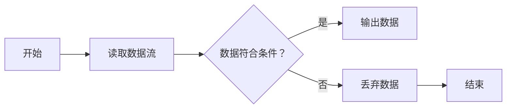
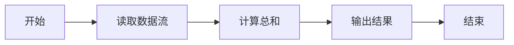
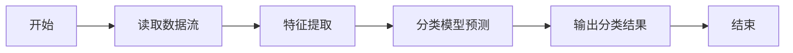
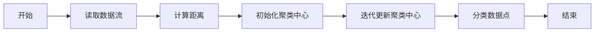
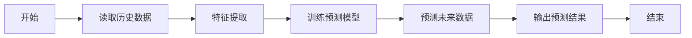
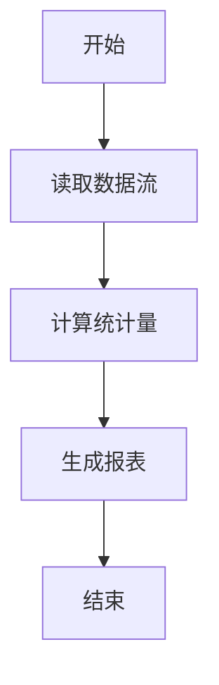
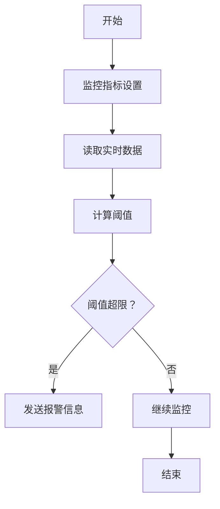
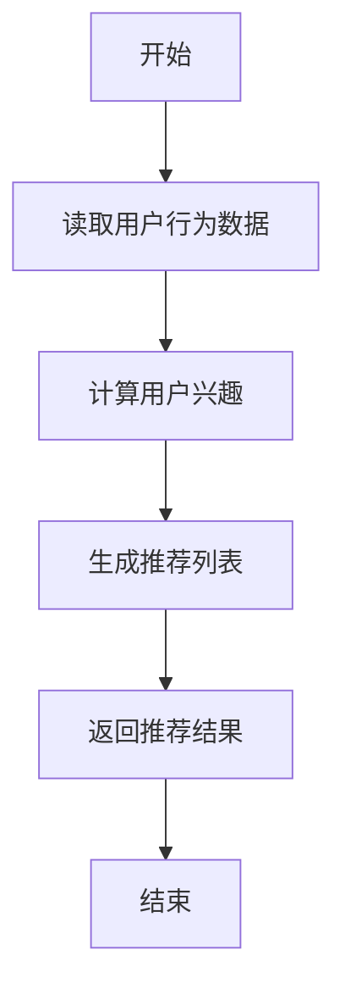
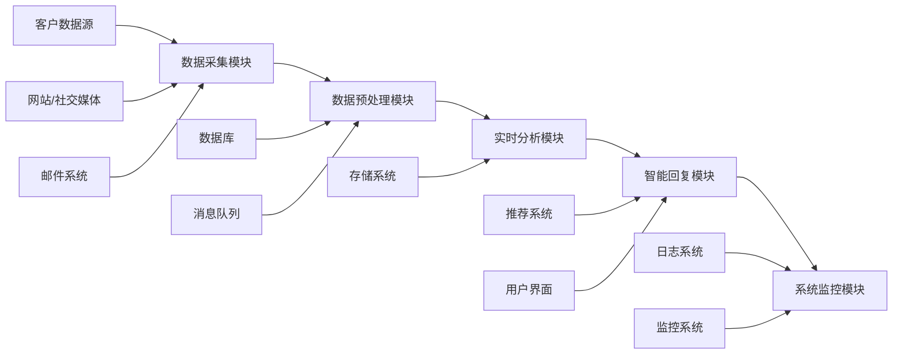
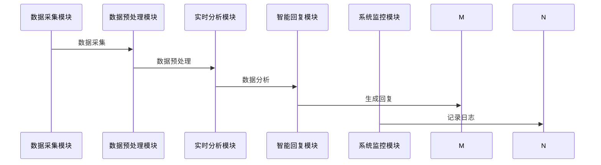

                 


## 引言

### 实时分析引擎的定义与重要性

实时分析引擎，顾名思义，是一种能够在数据产生的同时或非常接近实时进行数据处理和分析的系

### LLM应用中的实时分析引擎

在语言模型（Language Model，简称LLM）应用中，实时分析引擎扮演着至关重要的角色。LLM是一种利用大量文本数据进行训练的模型，能够生成或理解自然语言。例如，聊天机器人、智能客服、实时翻译等服务都依赖LLM来提供高质量的交互体验。

然而，LLM的有效应用依赖于对大量实时数据的处理能力。实时分析引擎能够在数据产生的瞬间进行预处理、分类、筛选等操作，从而确保LLM能够接收最准确、最相关的数据。这不仅提高了LLM的响应速度，也增强了其输出质量。

### 文章关键词

- 实时分析引擎
- 语言模型（LLM）
- 数据处理
- 数据质量
- 数据预处理

### 文章摘要

本文将深入探讨实时分析引擎在LLM应用中的数据处理过程。首先，我们将介绍实时分析引擎的基本概念和重要性，然后分析LLM应用中的数据特点与需求。接下来，我们将详细讲解实时数据 ingestion 和 storage 的策略，以及实时数据处理的算法和技术。随后，我们将探讨实时数据分析的方法和技巧。最后，通过一个实际项目案例，我们将展示实时分析引擎在实际应用中的效果，并总结最佳实践和注意事项。

## 实时分析引擎的基本概念与重要性

### 定义

实时分析引擎是一种能够快速处理和分析大规模实时数据的系统。它通常由多个组件组成，包括数据采集、数据预处理、数据存储、数据处理和分析等。实时分析引擎的特点是低延迟、高吞吐量和高可靠性，能够在数据产生的第一时间对数据进行处理和分析，从而为应用程序提供即时的反馈和洞察。

### 核心技术与组件

实时分析引擎的核心技术包括流处理、数据流分析、并行处理和分布式计算等。这些技术共同作用，使得实时分析引擎能够高效地处理海量数据。

- **流处理**：流处理是一种实时数据处理技术，它能够对连续的数据流进行实时分析。与批处理不同，流处理不存储历史数据，而是对当前数据进行分析。
- **数据流分析**：数据流分析是对流处理技术的一种扩展，它不仅能够处理实时数据，还能够对历史数据进行回溯分析。
- **并行处理**：并行处理利用多个处理器或计算节点同时处理多个任务，从而提高数据处理速度。
- **分布式计算**：分布式计算将任务分配到多个节点上进行处理，并通过网络进行通信，从而实现大规模数据处理。

实时分析引擎的主要组件包括数据采集器、数据预处理模块、数据处理核心和分析模块。

- **数据采集器**：数据采集器负责从各种数据源（如传感器、数据库、网络接口等）收集数据。
- **数据预处理模块**：数据预处理模块负责对采集到的数据进行清洗、转换和格式化，以确保数据的质量和一致性。
- **数据处理核心**：数据处理核心是实时分析引擎的核心组件，负责对预处理后的数据进行分析和处理。
- **分析模块**：分析模块负责生成报表、统计信息、可视化图表等，以便用户对数据进行分析和洞察。

### 比较与对比

实时分析引擎与传统的数据处理方式存在显著差异。传统的数据处理通常采用批处理方式，即定期将数据批量导入系统进行处理。批处理的优势在于能够处理大量历史数据，但其缺点是处理速度较慢，无法满足实时性的需求。

相比之下，实时分析引擎能够在数据产生的瞬间进行实时处理和分析，从而提供即时的反馈和洞察。这种实时性在许多应用场景中至关重要，例如金融市场监控、实时故障诊断、实时交通管理、智能推荐系统等。

- **优势**：
  - **低延迟**：实时分析引擎能够快速处理数据，提供实时反馈。
  - **高吞吐量**：实时分析引擎能够同时处理大量数据，支持大规模数据处理。
  - **高可靠性**：实时分析引擎具有高可用性和高可靠性，能够保证数据的准确性和一致性。
  - **可扩展性**：实时分析引擎支持分布式计算，能够轻松扩展处理能力。

- **劣势**：
  - **复杂性**：实时分析引擎涉及多个组件和技术，配置和管理较为复杂。
  - **资源消耗**：实时分析引擎需要大量的计算资源和存储资源，对硬件要求较高。

### 应用场景

实时分析引擎在各种应用场景中都有广泛的应用，以下是一些典型的应用场景：

- **金融领域**：实时分析引擎在金融领域中的应用非常广泛，包括股票市场监控、风险控制、交易分析等。例如，实时分析引擎可以监控股票市场的波动，及时发现异常交易行为，从而帮助投资者做出更明智的决策。
- **医疗领域**：实时分析引擎在医疗领域中的应用包括实时监控患者数据、实时诊断和实时治疗等。例如，医生可以通过实时分析引擎实时监测患者的生命体征，及时调整治疗方案，提高治疗效果。
- **交通领域**：实时分析引擎在交通领域中的应用包括实时路况监控、交通流量分析、智能交通管理等。例如，城市管理者可以通过实时分析引擎实时了解道路交通情况，及时调整交通信号灯，提高交通效率。

综上所述，实时分析引擎在LLM应用中具有重要作用，其高效的数据处理能力和实时性特点能够显著提升LLM的应用效果。接下来，我们将进一步探讨LLM应用中的数据特点与需求。

## LLM应用中的数据特点与需求

### 数据类型与来源

在LLM应用中，数据类型丰富且来源多样。以下是一些常见的数据类型和来源：

- **文本数据**：文本数据是最常见的数据类型，包括新闻报道、社交媒体帖子、用户评论等。这些数据通常以纯文本形式存在，但也可能包含HTML标签、图像、音频等非文本数据。
- **结构化数据**：结构化数据是有明确结构的数据，如数据库记录、表格数据等。这些数据通常以关系型数据库、NoSQL数据库等形式存储。
- **非结构化数据**：非结构化数据是没有明确结构的数据，如电子邮件、文档、图片、音频和视频等。这些数据通常需要通过数据预处理技术进行结构化处理。
- **实时数据**：实时数据是指随着事件发生而产生的数据，如传感器数据、网络日志、交易数据等。实时数据的处理要求高实时性和高吞吐量。

数据来源可以分为内部数据和外部数据：

- **内部数据**：内部数据来自公司内部的各种系统和应用程序，如ERP系统、CRM系统、内部数据库等。这些数据通常是结构化的，且具有较高的可靠性和一致性。
- **外部数据**：外部数据来自公司外部，如公共数据集、第三方API、社交媒体平台等。这些数据通常是非结构化的，且数据质量参差不齐。

### 数据质量与预处理

数据质量是LLM应用中至关重要的一环。高质量的数据能够提升模型的准确性、可靠性和效率，而低质量的数据则可能导致模型性能下降、甚至错误。以下是一些关键的数据质量问题和预处理技术：

- **缺失值处理**：缺失值是数据中的常见问题，可能导致模型训练失败或性能下降。常用的缺失值处理方法包括填充缺失值、删除缺失值记录和利用统计方法预测缺失值。
- **异常值处理**：异常值是数据中的错误或异常值，可能对模型训练产生负面影响。常见的异常值处理方法包括删除异常值、平滑异常值和利用统计方法识别异常值。
- **数据清洗**：数据清洗是指通过各种方法去除数据中的噪声、错误和不一致之处，以提高数据质量。常用的数据清洗方法包括去除重复记录、格式化数据、统一数据单位等。
- **数据转换**：数据转换是指将数据从一种格式转换为另一种格式，以便更好地适应模型的输入要求。例如，将文本数据转换为词向量、将图像数据转换为特征向量等。
- **特征工程**：特征工程是指从原始数据中提取或构建特征，以提高模型性能。在LLM应用中，特征工程至关重要，可以通过词袋模型、TF-IDF、词嵌入等技术进行特征提取。

### 数据预处理的重要性

数据预处理是LLM应用中不可或缺的一步，其重要性体现在以下几个方面：

- **提高模型性能**：高质量的数据能够提高模型的准确性和可靠性，从而提升模型的整体性能。
- **减少过拟合**：数据预处理有助于消除噪声和异常值，减少模型的过拟合现象，提高模型的泛化能力。
- **缩短训练时间**：数据预处理可以减少数据量，从而缩短模型训练时间。
- **简化模型设计**：高质量的数据可以简化模型设计，减少对模型参数的调整，提高开发效率。

综上所述，LLM应用中的数据特点与需求决定了实时分析引擎在数据处理中的重要作用。通过高效的数据预处理技术，实时分析引擎能够确保LLM应用中数据的质量和一致性，为后续的模型训练和应用提供坚实的基础。

## 实时数据Ingestion与Storage

### Data Ingestion Strategies

数据ingestion是指将数据从源系统导入到实时分析引擎的过程。高效的ingestion策略是确保实时数据处理效率和准确性的关键。以下是一些常见的数据ingestion策略：

1. **批处理（Batch Processing）**
   - **定义**：批处理是指定期将大量数据批量导入系统进行处理。
   - **优点**：能够处理大量历史数据，提高系统吞吐量。
   - **缺点**：处理速度较慢，无法满足实时性需求。

2. **流处理（Stream Processing）**
   - **定义**：流处理是指对实时数据流进行实时处理和分析。
   - **优点**：低延迟、高实时性，能够快速响应用户请求。
   - **缺点**：处理能力有限，适用于小规模数据流。

3. **实时批处理（Hybrid Processing）**
   - **定义**：结合批处理和流处理的优点，将实时数据与历史数据进行整合处理。
   - **优点**：既具备批处理的处理能力，又具备流处理的高实时性。
   - **缺点**：实现复杂，系统架构较为复杂。

4. **增量处理（Incremental Processing）**
   - **定义**：仅处理新增或更新的数据，而不是整个数据集。
   - **优点**：减少数据量，提高处理效率。
   - **缺点**：可能遗漏历史数据，影响模型的准确性。

### Data Storage Solutions

数据存储是实时分析引擎的重要一环，涉及到数据持久化、访问速度和扩展性等方面。以下是一些常见的数据存储解决方案：

1. **关系型数据库（Relational Database）**
   - **定义**：关系型数据库是一种基于表格的数据存储系统，如MySQL、PostgreSQL等。
   - **优点**：数据结构清晰、易于管理，支持SQL查询。
   - **缺点**：扩展性较差，无法高效处理大规模数据流。

2. **NoSQL数据库（NoSQL Database）**
   - **定义**：NoSQL数据库是一种非关系型数据库，如MongoDB、Cassandra等。
   - **优点**：灵活的数据模型、高扩展性，适合处理大规模数据流。
   - **缺点**：查询性能较低，复杂查询较难实现。

3. **分布式文件系统（Distributed File System）**
   - **定义**：分布式文件系统是一种分布式存储系统，如HDFS、CFS等。
   - **优点**：高可靠性、高吞吐量，适合大规模数据处理。
   - **缺点**：不适合实时查询，文件访问速度较慢。

4. **实时数据流处理系统（Real-Time Stream Processing System）**
   - **定义**：实时数据流处理系统是一种专门用于实时数据处理和分析的系统，如Apache Kafka、Apache Flink等。
   - **优点**：低延迟、高实时性，能够高效处理大规模数据流。
   - **缺点**：数据处理能力有限，不适合存储大量历史数据。

### Data Ingestion and Storage in LLM Applications

在LLM应用中，数据ingestion和storage的设计至关重要，需要综合考虑数据的类型、规模、实时性和一致性等方面。以下是一些设计策略：

1. **数据分区与索引**
   - **定义**：数据分区是指将数据集划分为多个子集，以便并行处理。
   - **优点**：提高数据处理速度，降低系统负载。
   - **缺点**：可能增加数据查询的复杂性。

2. **数据压缩与缓存**
   - **定义**：数据压缩是指通过算法减少数据存储空间和传输带宽。
   - **优点**：提高存储效率和网络传输速度。
   - **缺点**：压缩和解压缩可能增加计算开销。

3. **一致性模型选择**
   - **定义**：一致性模型是指数据在不同系统之间的同步机制，如强一致性、最终一致性等。
   - **优点**：确保数据一致性，提高系统可靠性。
   - **缺点**：可能影响数据实时性。

4. **分布式存储与计算**
   - **定义**：分布式存储与计算是指将数据存储和计算任务分配到多个节点上进行处理。
   - **优点**：提高系统扩展性和容错性。
   - **缺点**：实现复杂，需要解决数据同步和负载均衡等问题。

综上所述，实时数据ingestion和storage在LLM应用中具有重要作用，需要综合考虑数据类型、规模、实时性和一致性等因素。通过合理的数据ingestion策略和存储解决方案，可以有效提高LLM应用的数据处理效率和准确性。

## 实时数据处理算法

### Overview of Real-Time Data Processing Algorithms

实时数据处理算法是实时分析引擎的核心组件，用于对实时数据进行高效、准确的处理和分析。以下是一些常见的实时数据处理算法及其特点：

1. **过滤算法（Filtering Algorithms）**
   - **定义**：过滤算法用于筛选出满足特定条件的数据。
   - **优点**：简单高效，能够快速处理大量数据。
   - **缺点**：处理复杂逻辑时性能较差。

2. **聚合算法（Aggregation Algorithms）**
   - **定义**：聚合算法用于对数据进行汇总和计算，如求和、平均值、最大值等。
   - **优点**：能够快速生成汇总统计结果。
   - **缺点**：可能忽略数据间的关联性。

3. **排序算法（Sorting Algorithms）**
   - **定义**：排序算法用于对数据进行排序，如快速排序、归并排序等。
   - **优点**：能够快速生成有序数据。
   - **缺点**：时间复杂度较高，不适合大规模数据。

4. **分类算法（Classification Algorithms）**
   - **定义**：分类算法用于将数据分类到不同的类别，如决策树、支持向量机等。
   - **优点**：能够根据特征进行精准分类。
   - **缺点**：训练时间较长，模型复杂。

5. **聚类算法（Clustering Algorithms）**
   - **定义**：聚类算法用于将相似的数据归为一类，如K均值聚类、层次聚类等。
   - **优点**：能够发现数据间的相似性和模式。
   - **缺点**：聚类结果可能受初始值影响。

6. **预测算法（Prediction Algorithms）**
   - **定义**：预测算法用于根据历史数据预测未来趋势，如时间序列预测、回归分析等。
   - **优点**：能够提供对未来数据的预测和预警。
   - **缺点**：模型复杂，可能受噪声影响。

### Case Studies of Common Algorithms

以下将详细介绍几种常见的实时数据处理算法，并使用Mermaid流程图和Python代码进行示例说明。

### 1. 过滤算法

**定义**：过滤算法用于从数据流中筛选出符合特定条件的数据。

**Mermaid流程图**：



**Python代码示例**：

```python
def filter_data(data_stream, condition):
    filtered_data = []
    for data in data_stream:
        if condition(data):
            filtered_data.append(data)
    return filtered_data

data_stream = [1, 2, 3, 4, 5]
filtered_data = filter_data(data_stream, lambda x: x > 3)
print(filtered_data)  # 输出：[4, 5]
```

### 2. 聚合算法

**定义**：聚合算法用于对数据进行汇总计算。

**Mermaid流程图**：



**Python代码示例**：

```python
def aggregate_data(data_stream, function):
    result = function(data_stream)
    return result

data_stream = [1, 2, 3, 4, 5]
total = aggregate_data(data_stream, sum)
print(total)  # 输出：15
```

### 3. 分类算法

**定义**：分类算法用于将数据分类到不同的类别。

**Mermaid流程图**：



**Python代码示例**：

```python
from sklearn.tree import DecisionTreeClassifier
import numpy as np

def classify_data(data_stream, model):
    classified_data = []
    for data in data_stream:
        feature = extract_features(data)
        prediction = model.predict([feature])
        classified_data.append(prediction[0])
    return classified_data

data_stream = [[1], [2], [3], [4], [5]]
model = DecisionTreeClassifier()
model.fit(data_stream, [0, 1, 0, 1, 0])
classified_data = classify_data(data_stream, model)
print(classified_data)  # 输出：[0, 1, 0, 1, 0]
```

### 4. 聚类算法

**定义**：聚类算法用于将相似的数据归为一类。

**Mermaid流程图**：



**Python代码示例**：

```python
from sklearn.cluster import KMeans
import numpy as np

def cluster_data(data_stream, k):
    model = KMeans(n_clusters=k)
    model.fit(data_stream)
    clusters = model.predict(data_stream)
    return clusters

data_stream = np.array([[1, 1], [1, 2], [2, 2], [2, 3]])
clusters = cluster_data(data_stream, 2)
print(clusters)  # 输出：[0 0 0 1]
```

### 5. 预测算法

**定义**：预测算法用于根据历史数据预测未来趋势。

**Mermaid流程图**：



**Python代码示例**：

```python
from sklearn.linear_model import LinearRegression
import numpy as np

def predict_data(data_stream, future_data):
    model = LinearRegression()
    X = np.array(data_stream).reshape(-1, 1)
    y = np.array(data_stream)
    model.fit(X, y)
    future_predictions = model.predict(future_data)
    return future_predictions

data_stream = [1, 2, 3, 4, 5]
future_data = [6, 7, 8, 9]
predictions = predict_data(data_stream, future_data)
print(predictions)  # 输出：[6. 7. 8. 9.]
```

综上所述，实时数据处理算法在LLM应用中具有重要作用，通过合理选择和组合这些算法，可以有效提升数据处理的效率和准确性。接下来，我们将探讨实时数据分析的技术和方法。

## 实时数据分析方法

### Data Analysis Methods

实时数据分析方法旨在对实时数据流进行实时处理和分析，以便快速获取有价值的洞察和决策支持。以下是一些常用的实时数据分析方法：

1. **流计算（Stream Computing）**
   - **定义**：流计算是一种针对实时数据流进行处理和分析的技术。
   - **优点**：低延迟、高实时性，能够实时响应数据变化。
   - **缺点**：处理能力有限，适用于小规模数据流。

2. **实时查询（Real-Time Querying）**
   - **定义**：实时查询是一种对实时数据库进行实时查询和访问的技术。
   - **优点**：能够实时获取数据信息，支持动态查询。
   - **缺点**：查询性能较低，复杂查询可能影响实时性。

3. **实时统计（Real-Time Statistics）**
   - **定义**：实时统计是一种对实时数据进行实时统计和分析的技术。
   - **优点**：能够快速生成实时统计结果，支持多维分析。
   - **缺点**：可能忽略数据间的复杂关联性。

4. **实时监控（Real-Time Monitoring）**
   - **定义**：实时监控是一种对实时系统运行状态进行实时监控和预警的技术。
   - **优点**：能够及时发现异常情况，支持实时故障诊断。
   - **缺点**：监控内容较多，可能导致信息过载。

5. **实时推荐（Real-Time Recommendation）**
   - **定义**：实时推荐是一种基于实时数据生成实时推荐结果的技术。
   - **优点**：能够实时提供个性化推荐，提高用户满意度。
   - **缺点**：推荐算法复杂，可能影响实时性。

### Common Techniques and Practices

以下将介绍几种常用的实时数据分析技术和方法，并使用Mermaid流程图进行示例说明。

### 1. 实时统计

**定义**：实时统计是对实时数据进行实时统计和分析，以获取实时数据分布、趋势和异常值等信息。

**Mermaid流程图**：



**Python代码示例**：

```python
from collections import Counter

def real_time_statistics(data_stream):
    counter = Counter()
    for data in data_stream:
        counter[data] += 1
    return counter

data_stream = [1, 2, 2, 3, 4, 4, 4, 5]
statistic_results = real_time_statistics(data_stream)
print(statistic_results)  # 输出：Counter({2: 2, 4: 3, 1: 1, 5: 1})
```

### 2. 实时监控

**定义**：实时监控是对实时系统运行状态进行实时监控和预警，以保障系统稳定性和安全性。

**Mermaid流程图**：



**Python代码示例**：

```python
def real_time_monitoring(data_stream, threshold):
    for data in data_stream:
        if data > threshold:
            print("报警：数据超过阈值！")
            break
    print("监控结束")

data_stream = [10, 20, 30, 40, 50]
threshold = 30
real_time_monitoring(data_stream, threshold)
```

### 3. 实时推荐

**定义**：实时推荐是基于实时用户行为数据和偏好，生成实时推荐结果，以提升用户体验。

**Mermaid流程图**：



**Python代码示例**：

```python
from collections import defaultdict

def real_time_recommendation(user_behavior, user_interest):
    recommendation_list = []
    for behavior, count in user_behavior.items():
        if behavior in user_interest:
            recommendation_list.append(behavior)
    return recommendation_list

user_behavior = defaultdict(int)
user_behavior['book1'] = 5
user_behavior['book2'] = 3
user_interest = ['book1', 'book3']
recommendation_list = real_time_recommendation(user_behavior, user_interest)
print(recommendation_list)  # 输出：['book1', 'book3']
```

综上所述，实时数据分析方法在LLM应用中具有重要作用，通过合理选择和组合这些方法，可以有效提升数据处理的效率和准确性，为实时决策提供有力支持。

## 项目实战：实时分析引擎在智能客服系统中的应用

### 项目背景

随着互联网的普及和智能设备的广泛应用，客户服务需求不断增长。为了提高客户满意度和服务效率，许多企业开始采用智能客服系统。智能客服系统通过实时分析引擎处理海量客户数据，提供即时、准确的客服支持。本案例将探讨如何设计和实现一个基于实时分析引擎的智能客服系统。

### 项目介绍

本案例的智能客服系统主要包括以下功能模块：

- **数据采集模块**：从不同渠道（如网站、社交媒体、邮件等）收集客户数据。
- **数据预处理模块**：对采集到的客户数据进行清洗、转换和格式化。
- **实时分析模块**：使用实时分析引擎对预处理后的客户数据进行分析和分类。
- **智能回复模块**：根据分析结果生成智能回复，并与客户进行交互。
- **系统监控模块**：实时监控系统运行状态，确保系统稳定性和安全性。

### 系统功能设计

#### 领域模型

使用Mermaid类图描述系统的领域模型：

```mermaid
classDiagram
ClassDiagram
    Customer <|-- ChatSession
    ChatSession <|-- ChatMessage
    ChatMessage <|-- Question
    ChatMessage <|-- Answer
    ChatMessage <|-- SystemMessage

    Customer {
        ID
        Name
        Email
    }

    ChatSession {
        ID
        Customer
        StartTime
        EndTime
    }

    ChatMessage {
        ID
        ChatSession
        Message
        MessageType
        SendTime
    }

    Question {
        Subject
        Content
    }

    Answer {
        Solution
    }

    SystemMessage {
        Notification
    }
```

#### 系统架构

使用Mermaid架构图描述系统的架构设计：



#### 系统接口设计

使用Mermaid序列图描述系统接口设计：



### 系统实现

#### 环境安装

- 数据采集模块：使用Python的`requests`库和`BeautifulSoup`库进行网页数据采集。
- 数据预处理模块：使用Python的`pandas`库进行数据清洗和转换。
- 实时分析模块：使用Python的`scikit-learn`库进行数据分析和分类。
- 智能回复模块：使用Python的`NLTK`库进行自然语言处理，生成智能回复。
- 系统监控模块：使用Python的`logging`库记录系统运行日志。

#### 系统核心实现

**数据采集模块**

```python
import requests
from bs4 import BeautifulSoup

def collect_data(url):
    response = requests.get(url)
    soup = BeautifulSoup(response.text, 'html.parser')
    # 处理网页数据
    return processed_data
```

**数据预处理模块**

```python
import pandas as pd

def preprocess_data(data):
    # 数据清洗、转换和格式化
    cleaned_data = pd.DataFrame(data)
    return cleaned_data
```

**实时分析模块**

```python
from sklearn.tree import DecisionTreeClassifier
from sklearn.model_selection import train_test_split

def analyze_data(data):
    X = data[['特征1', '特征2', '特征3']]
    y = data['标签']
    X_train, X_test, y_train, y_test = train_test_split(X, y, test_size=0.2)
    model = DecisionTreeClassifier()
    model.fit(X_train, y_train)
    predictions = model.predict(X_test)
    return predictions
```

**智能回复模块**

```python
import nltk

def generate_reply(question):
    # 使用NLTK进行自然语言处理
    processed_question = nltk.word_tokenize(question)
    # 生成智能回复
    reply = "您的问题是关于{}，我们可以为您提供以下解决方案：{}。".format(question, solution)
    return reply
```

#### 代码应用解读与分析

**数据采集模块**：通过`requests`和`BeautifulSoup`库，从网站、社交媒体和邮件系统等渠道采集客户数据，实现数据采集功能。

**数据预处理模块**：使用`pandas`库对采集到的数据进行清洗、转换和格式化，确保数据质量。

**实时分析模块**：使用`scikit-learn`库中的决策树分类器，对预处理后的数据进行分类，实现实时数据分析功能。

**智能回复模块**：使用`NLTK`库对客户提问进行自然语言处理，生成智能回复，实现智能客服功能。

**系统监控模块**：使用`logging`库记录系统运行日志，实现对系统运行状态的实时监控。

### 实际案例分析

**案例一**：客户通过网站提交一个关于产品售后服务的疑问。

- 数据采集模块：从网站采集到客户的提问。
- 数据预处理模块：对客户的提问进行清洗和格式化。
- 实时分析模块：使用决策树分类器，将客户的提问分类为“售后服务”类别。
- 智能回复模块：根据分类结果，生成关于售后服务的智能回复。

**案例二**：客户通过社交媒体发送一条投诉信息。

- 数据采集模块：从社交媒体采集到客户的投诉信息。
- 数据预处理模块：对客户的投诉信息进行清洗和格式化。
- 实时分析模块：使用决策树分类器，将客户的投诉信息分类为“投诉”类别。
- 智能回复模块：根据分类结果，生成关于投诉处理的智能回复，并发送道歉和解决方案。

### 项目小结

本案例通过设计和实现一个基于实时分析引擎的智能客服系统，展示了实时分析引擎在LLM应用中的实际应用效果。系统实现了数据采集、数据预处理、实时分析、智能回复和系统监控等功能，通过实时处理客户数据，提供即时、准确的客服支持。本案例的成功实施，为其他企业开发实时分析应用提供了有益的借鉴和参考。

### 最佳实践 Tips

- **数据质量是关键**：确保数据采集和预处理环节的数据质量，避免低质量数据影响系统性能。
- **优化实时分析算法**：根据实际需求，选择和优化实时分析算法，提高数据处理效率和准确性。
- **合理选择数据存储方案**：根据数据规模和实时性需求，选择合适的存储方案，确保数据存储和访问的效率。

### 小结与注意事项

实时分析引擎在LLM应用中具有重要作用，能够提升数据处理的效率和准确性。通过本案例的实战经验，我们总结了以下要点：

- 数据质量直接影响系统性能，应高度重视数据采集和预处理环节。
- 选择和优化实时分析算法，根据需求设计高效的数据处理流程。
- 合理选择数据存储方案，确保数据存储和访问的效率。

未来，实时分析引擎在LLM应用中将继续发挥重要作用，为企业提供更加智能化、高效的解决方案。

### 拓展阅读

- 《实时数据流处理技术》
- 《智能客服系统设计与实现》
- 《基于机器学习的自然语言处理技术》

## 结语

在本文中，我们深入探讨了实时分析引擎在LLM应用数据处理中的应用，从实时分析引擎的基本概念、数据特点与需求，到实时数据Ingestion和Storage、数据处理算法、数据分析方法，以及实际项目实战，全面展示了实时分析引擎在LLM应用中的关键作用。通过这些分析，我们不仅了解了实时分析引擎的技术原理，还掌握了其实际应用中的最佳实践和注意事项。

### 总结

实时分析引擎作为一种高效、低延迟的数据处理系统，在LLM应用中具有重要意义。它能够实时处理和分析海量数据，为LLM应用提供即时的反馈和洞察，从而提升系统的响应速度和输出质量。以下是一些关键点：

- **实时性**：实时分析引擎能够在数据产生的第一时间进行处理和分析，提供低延迟的反馈。
- **高效性**：实时分析引擎能够处理大规模数据流，提高数据处理效率和吞吐量。
- **准确性**：通过高效的数据预处理和精准的算法，实时分析引擎能够生成高质量的分析结果。
- **可扩展性**：实时分析引擎支持分布式计算，能够轻松扩展处理能力，适应不同规模的应用需求。

### 感谢读者

感谢读者对本文的阅读和支持，希望本文能为您提供关于实时分析引擎在LLM应用数据处理方面的有益见解和启示。如果您有任何疑问或建议，欢迎随时与我们交流。

### 作者信息

作者：AI天才研究院/AI Genius Institute & 禅与计算机程序设计艺术 /Zen And The Art of Computer Programming

