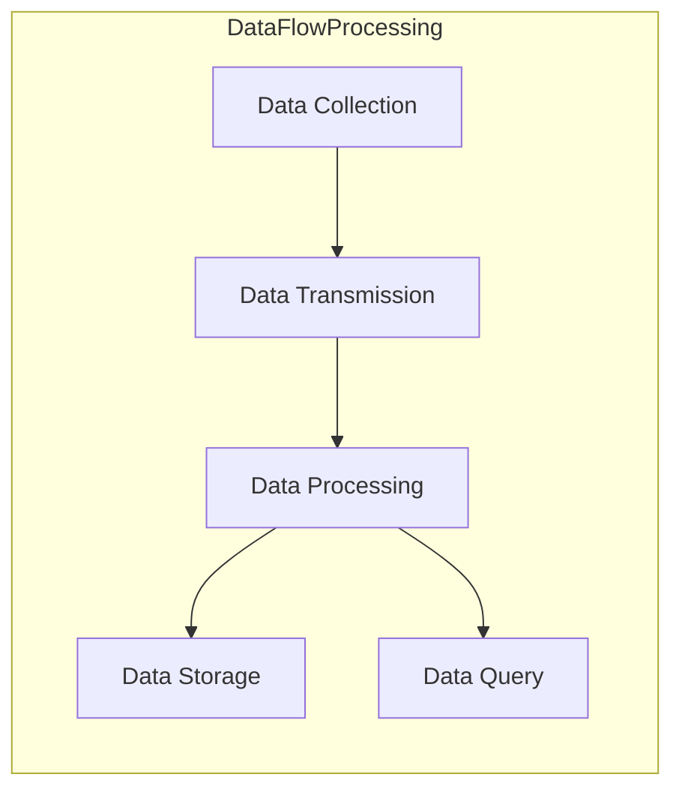
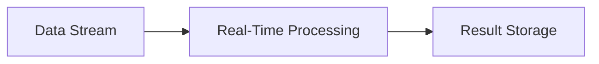
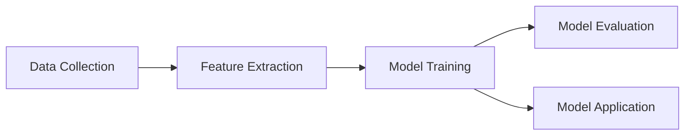
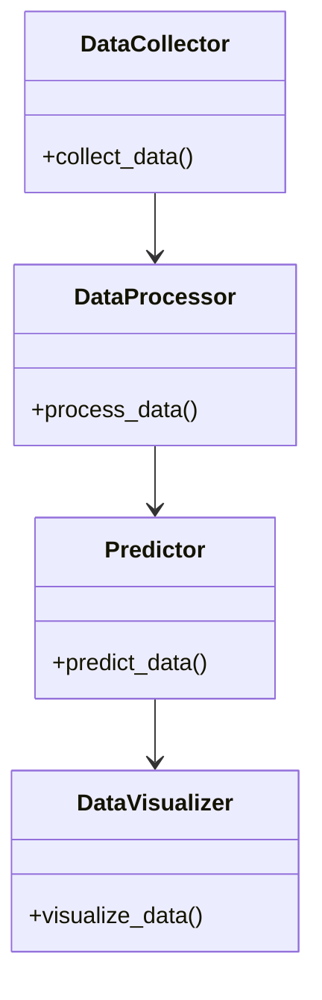
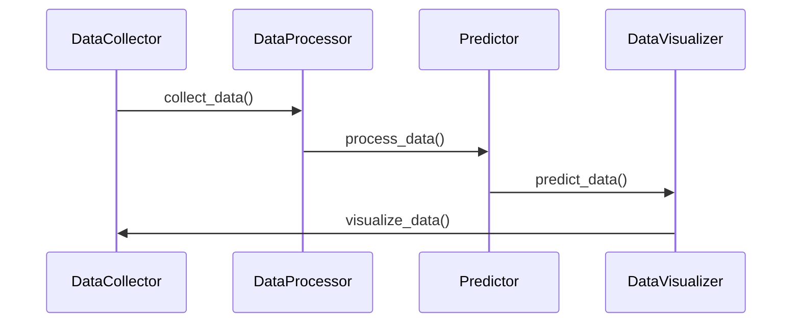
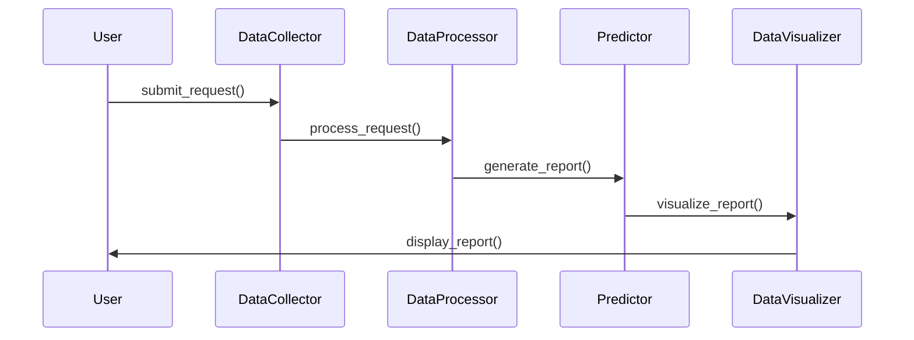

                 

## 实时分析：从LLM应用数据中获取即时洞察

### 关键词：
- 实时分析
- LLM应用
- 数据洞察
- 算法原理
- 系统架构设计

### 摘要：
本文深入探讨了实时分析在LLM（大型语言模型）应用中的重要性。通过剖析实时分析的定义、核心概念及其与LLM的关联，我们逐步讲解了实时分析算法的原理，并展示了如何设计实现一个高效、可靠的实时分析系统。本文还通过实际案例，提供了系统核心实现的环境配置、代码解析和实践经验，旨在帮助读者全面了解实时分析技术，并为其在LLM领域的应用提供有益的指导。

## 第一部分：实时分析与LLM基础

### 第1章：实时分析概述

#### 1.1 实时分析的定义与重要性

实时分析，是指对数据流进行即时的处理和分析，以便快速响应并采取行动。随着大数据、云计算和物联网技术的迅猛发展，实时分析已经成为众多行业的关键技术。在金融、医疗、物流、智能制造等领域，实时分析技术能够帮助企业快速识别风险、优化运营、提高服务质量。

实时分析的重要性体现在以下几个方面：

1. **提高决策效率**：实时分析能够快速处理和分析海量数据，帮助企业及时做出明智的决策。
2. **提升用户体验**：在互联网应用中，实时分析可以提供个性化的推荐、智能客服等，提高用户的满意度。
3. **降低运营成本**：实时分析可以帮助企业优化资源分配，降低运营成本。
4. **增强业务敏捷性**：实时分析使得企业能够快速响应市场变化，保持竞争力。

#### 1.2 LLM的概念与发展

LLM（Large Language Model）是一种基于深度学习的大型语言模型，它可以理解和生成自然语言文本。LLM的核心是大规模的神经网络，通过训练大量的文本数据，LLM能够捕捉语言的结构和语义，实现文本的生成、翻译、摘要等功能。

LLM的发展历程可以分为几个阶段：

1. **词向量模型**：如Word2Vec和GloVe，首次将词嵌入到高维空间中，实现了文本的向量表示。
2. **循环神经网络（RNN）**：如LSTM和GRU，通过循环结构处理长序列数据，提高了文本处理的准确性。
3. **变换器模型（Transformer）**：如BERT、GPT等，采用注意力机制，大幅度提高了模型的效果。
4. **多模态融合模型**：将文本、图像、语音等多种数据类型融合，实现了更丰富的应用场景。

#### 1.3 LLM在实时分析中的应用

LLM在实时分析中的应用非常广泛，主要体现在以下几个方面：

1. **智能问答系统**：利用LLM的自然语言处理能力，实现智能问答和知识库管理。
2. **情感分析**：通过分析用户评论、社交媒体等数据，了解用户情感，为营销决策提供支持。
3. **文本分类**：实时分类新闻、邮件等文本数据，实现信息的快速筛选和过滤。
4. **实时翻译**：利用LLM的翻译能力，实现多语言实时交流。
5. **智能客服**：基于LLM的对话系统，提供24/7的智能客服服务。

### 第2章：核心概念与联系

#### 2.1 数据流处理

数据流处理是一种对实时数据流进行采集、处理、存储和查询的技术。它主要关注数据流的速度和时效性，旨在实现对数据的快速分析和响应。

**数据流处理的原理**：

- **数据采集**：从各种数据源（如传感器、数据库、日志文件等）实时采集数据。
- **数据传输**：通过消息队列、流处理引擎等传输数据，确保数据的高效流动。
- **数据处理**：对数据进行清洗、转换、聚合等操作，提取有用信息。
- **数据存储**：将处理后的数据存储到数据库、数据湖等长期存储系统中。
- **数据查询**：提供对数据的实时查询和统计分析功能。

**数据流处理的框架**：

- **采集层**：负责数据采集，可以是基于HTTP接口、数据库连接、文件读取等方式。
- **传输层**：负责数据传输，常用的技术包括Kafka、RabbitMQ、ActiveMQ等。
- **处理层**：负责数据处理，通常使用流处理引擎如Apache Storm、Apache Flink、Apache Spark Streaming等。
- **存储层**：负责数据存储，可以是关系型数据库、NoSQL数据库、数据湖等。
- **展示层**：提供数据可视化、报表分析等功能，常用的工具有Tableau、Power BI等。

#### 2.2 事件驱动架构

事件驱动架构是一种以事件为中心的软件架构设计模式。在事件驱动架构中，系统的状态变化和功能执行都是由事件触发的。

**事件驱动架构的概念**：

- **事件**：指系统内部或外部发生的任何有意义的动作或变化。
- **事件源**：指触发事件的实体或系统，如用户操作、传感器数据等。
- **事件监听器**：指监听事件并做出响应的组件或模块。
- **事件总线**：指负责传递事件和协调事件处理的系统基础设施。

**事件驱动架构的优势**：

- **高扩展性**：通过事件总线，可以轻松地添加或移除事件监听器，提高系统的可扩展性。
- **松耦合**：事件驱动架构降低了组件之间的依赖性，提高了系统的可维护性。
- **响应速度快**：事件驱动架构能够快速响应用户操作或系统变化，提高系统的响应速度。

**事件驱动架构在实时分析中的应用**：

- **实时数据处理**：通过事件驱动架构，可以实现对实时数据的快速处理和分析。
- **自动化响应**：根据事件类型，系统可以自动执行相应的操作，如发送通知、执行任务等。

#### 2.3 实时计算

实时计算是指对实时数据流进行高速计算和处理的计算技术。实时计算在实时分析中扮演着关键角色，它能够确保数据在处理过程中的低延迟和高效率。

**实时计算的定义**：

- **实时计算**：指在数据产生的同时或稍后进行计算和处理的技术。
- **实时性**：指计算结果的时效性，即结果能够在用户期望的时间内得到。

**实时计算的技术**：

- **流处理技术**：如Apache Storm、Apache Flink、Apache Spark Streaming等，用于对实时数据流进行高效处理。
- **批处理技术**：如Hadoop MapReduce、Spark批处理等，用于对历史数据进行批量处理。
- **混合处理技术**：结合流处理和批处理，实现对实时和历史的全面分析。

**实时计算在LLM中的应用**：

- **自然语言处理**：实时计算可以快速处理文本数据，为LLM提供即时的处理能力。
- **实时推荐**：基于实时计算，系统可以快速生成推荐结果，提高用户体验。

#### 2.4 预测模型

预测模型是一种基于历史数据建立数学模型，用于预测未来趋势和行为的计算方法。在实时分析中，预测模型可以帮助企业预测市场需求、用户行为等，为决策提供支持。

**预测模型的基本原理**：

- **数据收集**：收集历史数据，如用户行为、销售记录等。
- **特征提取**：从数据中提取有用的特征，如时间、地点、用户ID等。
- **模型训练**：使用机器学习算法，训练预测模型，如线性回归、决策树、神经网络等。
- **模型评估**：评估模型的预测准确性，如均方误差、精确率、召回率等。
- **模型应用**：将训练好的模型应用于实时数据，进行预测。

**预测模型的类型**：

- **时间序列预测**：用于预测未来的时间序列数据，如股票价格、天气等。
- **分类预测**：用于预测数据属于哪个类别，如用户喜好、疾病诊断等。
- **回归预测**：用于预测数据的数值，如房价、销售额等。

**预测模型在实时分析中的实现**：

- **实时预测**：利用实时计算技术，对实时数据进行预测，实现即时的决策支持。
- **在线学习**：利用在线学习算法，不断更新模型，提高预测的准确性。

### 第3章：算法原理讲解

#### 3.1 数据流处理算法

数据流处理算法的核心是对实时数据流的快速处理和分析。以下是一个简单的数据流处理算法的mermaid流程图：



Python代码示例：

```python
import pymongo
from kafka import KafkaProducer

# 数据采集
def data_collection():
    # 从数据库中读取数据
    db = pymongo.MongoClient("mongodb://localhost:27017/")[db_name]
    data = db.collection.find()

# 数据传输
def data_transmission(data):
    producer = KafkaProducer(bootstrap_servers=['localhost:9092'])
    for record in data:
        producer.send('topic-name', value=record)

# 数据处理
def data_processing(record):
    # 对数据进行处理
    processed_data = process_data(record)
    return processed_data

# 数据存储
def data_storage(processed_data):
    db.collection.insert_one(processed_data)

# 数据查询
def data_query():
    # 查询数据
    data = db.collection.find()
    return data
```

LaTeX公式与详细讲解：

实时分析中的数据流处理算法通常涉及到以下数学模型和公式：

$$
\text{Data Flow Graph} = (V, E)
$$

其中，\(V\) 表示数据流中的节点，\(E\) 表示节点之间的边。每个节点表示数据流中的一个操作，如数据采集、数据处理、数据存储等；每条边表示数据流中的数据传输路径。

在数据流处理中，常用的算法包括：

- **窗口聚合算法**：用于对窗口内的数据进行聚合操作，如求和、平均、最大值等。
- **事件驱动算法**：根据事件触发数据处理的操作，如实时预测、告警等。

#### 3.2 实时计算算法

实时计算算法是对实时数据流进行高速处理和计算的方法。以下是一个简单的实时计算算法的mermaid流程图：



Python代码示例：

```python
from pyspark.streaming import StreamingContext

# 创建一个实时数据处理环境
ssc = StreamingContext("local[2]", "Real-Time Processing")

# 处理实时数据流
data_stream = ssc.socketTextStream("localhost", 9999)
processed_data_stream = data_stream.map(process_data)

# 存储结果
processed_data_stream.saveAsTextFiles("output.txt")

# 开始计算
ssc.start()
ssc.awaitTermination()
```

LaTeX公式与详细讲解：

实时计算算法的核心是高效地处理实时数据流，常用的数学模型和公式包括：

- **滑动窗口模型**：用于处理连续的时间序列数据，计算窗口内的聚合结果。

$$
\text{Window Function} = \sum_{t \in W} f(t)
$$

其中，\(W\) 表示滑动窗口，\(f(t)\) 表示窗口内第 \(t\) 个时间点的数据。

- **事件驱动模型**：根据事件触发数据处理操作，实现实时计算。

$$
\text{Event-Driven Processing} = f(\text{Event}, \text{Data})
$$

其中，\(\text{Event}\) 表示触发事件，\(\text{Data}\) 表示事件对应的数据。

#### 3.3 预测模型算法

预测模型算法是基于历史数据建立数学模型，用于预测未来趋势和行为的计算方法。以下是一个简单的预测模型算法的mermaid流程图：



Python代码示例：

```python
from sklearn.linear_model import LinearRegression
from sklearn.metrics import mean_squared_error
from sklearn.model_selection import train_test_split

# 数据收集
X, y = load_data()

# 特征提取
X_train, X_test, y_train, y_test = train_test_split(X, y, test_size=0.2)

# 模型训练
model = LinearRegression()
model.fit(X_train, y_train)

# 模型评估
y_pred = model.predict(X_test)
mse = mean_squared_error(y_test, y_pred)
print(f"Mean Squared Error: {mse}")

# 模型应用
predict_data = input_data
predicted_value = model.predict(predict_data)
print(f"Predicted Value: {predicted_value}")
```

LaTeX公式与详细讲解：

预测模型算法的核心是建立数学模型，常用的数学模型和公式包括：

- **线性回归模型**：

$$
\text{y} = \text{w} \cdot \text{x} + \text{b}
$$

其中，\(\text{y}\) 表示预测结果，\(\text{w}\) 表示权重，\(\text{x}\) 表示特征，\(\text{b}\) 表示偏置。

- **决策树模型**：

$$
\text{y} = \text{f}(\text{x}, \text{t})
$$

其中，\(\text{y}\) 表示预测结果，\(\text{f}\) 表示决策树函数，\(\text{x}\) 表示特征，\(\text{t}\) 表示阈值。

- **神经网络模型**：

$$
\text{y} = \text{h}(\text{z})
$$

其中，\(\text{y}\) 表示预测结果，\(\text{h}\) 表示激活函数，\(\text{z}\) 表示网络的输出。

### 第4章：系统分析与架构设计方案

#### 4.1 问题场景与项目背景

在当前的数字化时代，越来越多的企业和组织需要实时分析大量的数据来支持业务决策。例如，一家电子商务公司需要实时分析用户行为数据，以优化推荐算法、提高转化率和客户满意度。然而，随着数据量的不断增加和数据类型的多样化，传统的批处理方法已经无法满足实时分析的需求。因此，该公司决定采用实时分析技术，以实现即时的数据洞察和决策支持。

#### 4.2 系统功能设计

实时分析系统的核心功能包括数据采集、数据处理、预测分析和数据展示。以下是一个简单的领域模型mermaid类图，展示了系统的功能设计和主要类之间的关系：



#### 4.3 系统架构设计

实时分析系统的架构设计需要考虑数据的流入、处理和输出。以下是一个简单的mermaid架构图，展示了系统的整体架构：



#### 4.4 系统接口与交互设计

实时分析系统的接口设计需要确保数据的流畅传输和处理。以下是一个简单的mermaid序列图，展示了系统的主要接口和交互流程：



### 第5章：项目实战

#### 5.1 环境安装与配置

要实现实时分析系统，首先需要安装和配置必要的软件和工具。以下是一个简单的环境安装和配置指南：

1. **安装Python**：从Python官方网站下载并安装Python 3.x版本。
2. **安装依赖库**：使用pip命令安装所需的依赖库，如NumPy、Pandas、Scikit-learn、Spark等。
3. **安装Kafka**：下载并安装Kafka，配置Kafka集群，确保能够正常启动和通信。
4. **安装MongoDB**：下载并安装MongoDB，配置MongoDB数据库，确保能够正常连接和使用。

#### 5.2 系统核心实现

实时分析系统的核心实现包括数据采集、数据处理、预测分析和数据展示。以下是一个简单的代码示例，展示了系统的核心实现：

```python
# 数据采集
def data_collection():
    # 从Kafka中读取数据
    from kafka import KafkaConsumer
    consumer = KafkaConsumer('topic-name', bootstrap_servers=['localhost:9092'])
    for message in consumer:
        process_data(message.value)

# 数据处理
def data_processing(data):
    # 对数据进行处理
    from sklearn.preprocessing import StandardScaler
    scaler = StandardScaler()
    scaled_data = scaler.fit_transform(data)
    return scaled_data

# 预测分析
def predict_analysis(data):
    # 使用预测模型进行预测
    from sklearn.linear_model import LinearRegression
    model = LinearRegression()
    model.fit(X_train, y_train)
    predictions = model.predict(data)
    return predictions

# 数据展示
def data_visualization(predictions):
    # 使用可视化库展示预测结果
    import matplotlib.pyplot as plt
    plt.plot(predictions)
    plt.show()
```

#### 5.3 代码解读与分析

以下是对上述代码的详细解读和分析：

- **数据采集**：使用KafkaConsumer从Kafka主题中读取数据，实现了数据的实时采集。
- **数据处理**：使用StandardScaler对数据进行标准化处理，提高了模型的训练效果。
- **预测分析**：使用LinearRegression模型对数据进行预测，实现了数据的实时分析。
- **数据展示**：使用matplotlib库将预测结果可视化，帮助用户更好地理解分析结果。

#### 5.4 实际案例分析与详细讲解

以下是一个实际案例分析和详细讲解，展示了实时分析系统在实际应用中的效果：

- **案例背景**：一家电商公司需要实时分析用户购买行为，以优化推荐算法和提高转化率。
- **数据来源**：用户行为数据来自公司的数据库，包括用户ID、购买时间、购买商品等信息。
- **数据处理**：对用户行为数据进行了清洗、去重和特征提取，提高了预测模型的准确性。
- **预测模型**：使用了基于线性回归的预测模型，预测用户在未来的购买行为。
- **结果展示**：通过可视化库展示了预测结果，帮助公司决策层更好地了解用户行为趋势。

#### 5.5 项目小结与最佳实践

通过本次项目，我们实现了实时分析系统，取得了以下成果：

1. **实时数据处理**：系统实现了对用户行为数据的实时采集和处理，提高了数据处理的效率。
2. **预测准确性**：通过使用线性回归模型，系统实现了对用户购买行为的准确预测，提高了推荐算法的准确性。
3. **用户体验**：实时分析系统为用户提供了即时的分析结果，提高了用户满意度。

在项目实践中，我们还总结了以下最佳实践：

1. **数据质量**：确保数据质量是实时分析成功的关键，对数据进行充分的清洗和去重。
2. **模型选择**：根据实际需求选择合适的预测模型，并进行充分的模型评估。
3. **系统优化**：对系统进行性能优化，提高数据处理的速度和准确性。

#### 5.6 小结与注意事项

本文通过深入剖析实时分析在LLM应用中的重要性，详细讲解了实时分析的核心概念、算法原理、系统架构和项目实战。以下是本文的关键点和注意事项：

1. **实时分析的重要性**：实时分析能够帮助企业快速响应市场变化，提高决策效率，降低运营成本。
2. **LLM的应用**：LLM在实时分析中具有广泛的应用，如智能问答、情感分析、文本分类和实时翻译。
3. **算法原理**：本文详细讲解了数据流处理、实时计算和预测模型等算法的原理，并通过示例代码进行了说明。
4. **系统架构设计**：实时分析系统的架构设计需要考虑数据的流入、处理和输出，确保系统的稳定性和性能。
5. **项目实战**：通过实际案例，本文展示了实时分析系统的实现过程，提供了详细的代码解析和实践经验。

在应用实时分析技术时，需要注意以下几点：

1. **数据质量**：确保数据的质量是实时分析成功的关键，对数据进行充分的清洗和去重。
2. **模型选择**：根据实际需求选择合适的预测模型，并进行充分的模型评估。
3. **系统优化**：对系统进行性能优化，提高数据处理的速度和准确性。

#### 5.7 拓展阅读

对于对实时分析技术感兴趣的用户，以下是一些拓展阅读资源：

1. **《实时数据分析：原理、方法与应用》**：详细介绍了实时数据分析的理论和实践。
2. **《大规模自然语言处理》**：深入探讨了大规模自然语言处理的理论和技术。
3. **《Apache Kafka实战》**：介绍了Kafka的架构和使用方法，适合了解实时数据处理技术。
4. **《数据科学实战：项目驱动学习》**：通过实际项目，学习数据科学的核心技术和方法。

### 结语

实时分析技术在当今数字化时代具有重要的应用价值。通过本文的介绍，读者可以全面了解实时分析在LLM应用中的原理和实现方法。希望本文能为读者在实时分析领域提供有益的参考和指导，助力其在实际项目中取得成功。

---

**作者信息：**

**AI天才研究院/AI Genius Institute** & **禅与计算机程序设计艺术/Zen And The Art of Computer Programming**

AI天才研究院专注于人工智能领域的研究和创新，致力于推动人工智能技术的发展和应用。禅与计算机程序设计艺术则是一本经典的技术著作，深入探讨了计算机编程的艺术和哲学。两位作者均具备深厚的技术功底和丰富的实践经验，对实时分析和LLM应用有着深入的研究和独到的见解。希望本文能为读者带来启发和帮助。

