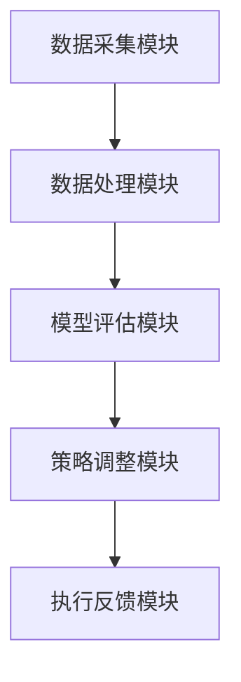
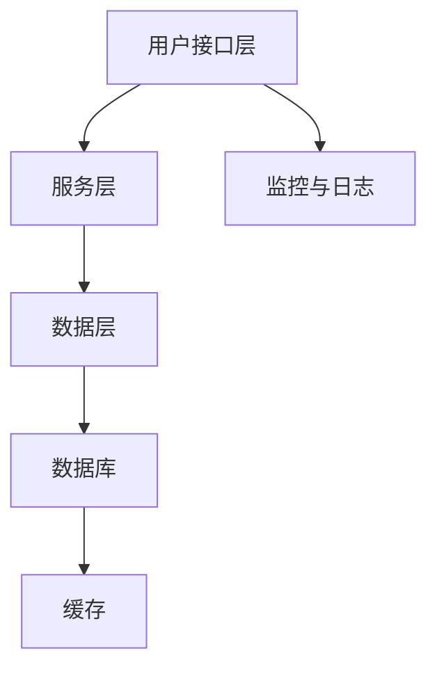

                 

# 实时反馈循环：LLM驱动的评测-优化闭环系统

## 关键词

- 实时反馈循环
- 大型语言模型 (LLM)
- 评测-优化闭环系统
- 数据采集与预处理
- 模型选择与训练
- 反馈与调整
- 系统优化策略
- 工程实践
- 未来展望与挑战

## 摘要

本文将深入探讨实时反馈循环的概念、原理及其在人工智能领域中的应用。特别地，本文将重点关注大型语言模型（LLM）驱动的评测-优化闭环系统，通过详细分析其实时反馈循环的实现方法、系统优化策略以及工程实践，为读者提供一套完整的技术解决方案。最后，本文还将对未来实时反馈循环的发展趋势、潜在应用领域及面临的挑战进行展望。

## 目录大纲

----------------------------------------------------------------

## 第一部分: 实时反馈循环基础

### 第1章: 实时反馈循环概述

#### 1.1 实时反馈循环的定义与重要性

#### 1.2 实时反馈循环的核心要素

#### 1.3 实时反馈循环的运行机制

### 第2章: LLM驱动的评测-优化闭环系统

#### 2.1 LLM的概念与作用

#### 2.2 评测-优化闭环系统的构建

#### 2.3 LLM在评测-优化闭环系统中的应用

### 第3章: 实时反馈循环的实现方法

#### 3.1 数据采集与预处理

#### 3.2 模型选择与训练

#### 3.3 反馈与调整

### 第4章: LLM驱动的评测-优化闭环系统案例解析

#### 4.1 案例一：电商平台商品推荐系统

#### 4.2 案例二：智能客服系统

#### 4.3 案例三：智能交通管理系统

### 第5章: 实时反馈循环系统的优化策略

#### 5.1 指标分析与优化目标

#### 5.2 优化算法与策略

#### 5.3 系统性能评估与调整

### 第6章: 实时反馈循环系统的工程实践

#### 6.1 系统架构设计

#### 6.2 系统部署与运维

#### 6.3 持续集成与持续部署

### 第7章: 未来展望与挑战

#### 7.1 实时反馈循环的发展趋势

#### 7.2 潜在的应用领域

#### 7.3 面临的挑战与解决方案

----------------------------------------------------------------

## 第一部分: 实时反馈循环基础

### 第1章: 实时反馈循环概述

#### 1.1 实时反馈循环的定义与重要性

**实时反馈循环的定义：**

实时反馈循环是一种系统能够持续接收外部输入，通过数据处理、模型评估、策略调整和执行反馈等步骤，实现对系统性能的持续优化和改进的过程。

**实时反馈循环的重要性：**

在当今快速变化的信息时代，实时反馈循环显得尤为重要。它能够帮助企业迅速响应市场变化，提高决策效率，降低运营成本，从而增强竞争力。特别是在人工智能和大数据技术的推动下，实时反馈循环已经成为提升系统性能和用户体验的关键手段。

#### 1.2 实时反馈循环的核心要素

**数据采集：**

数据采集是实时反馈循环的第一步，它涉及收集系统运行过程中的各类实时数据，如用户行为、系统性能指标等。这些数据是后续分析和调整的基础。

**数据处理：**

数据处理包括对采集到的数据进行清洗、归一化和特征提取等步骤。通过这些处理，我们可以提取出有用的信息，为模型评估和策略调整提供支持。

**模型评估：**

模型评估是指利用已训练的模型对系统性能进行评估。通过比较模型预测结果和实际结果，我们可以识别系统中的问题和不足。

**策略调整：**

根据模型评估的结果，我们需要对系统策略进行调整。策略调整可以包括改变参数设置、修改算法等，以优化系统性能。

**执行反馈：**

执行反馈是指将调整后的策略应用于实际系统中，并对效果进行监测和反馈。这一步骤确保了实时反馈循环的闭环特性，使得系统能够持续优化。

#### 1.3 实时反馈循环的运行机制

**闭环反馈机制：**

实时反馈循环通过闭环反馈机制实现系统性能的持续优化。这一机制确保了系统在运行过程中能够不断接收外部输入，通过数据处理、模型评估、策略调整和执行反馈等步骤，形成一个闭环，使得系统能够持续改进。

**动态调整：**

实时反馈循环能够根据实时数据动态调整策略，以适应环境变化。这种动态调整能力使得系统能够快速响应外部变化，提高系统的灵活性和适应性。

**快速响应：**

实时反馈循环通过快速识别问题和进行调整，提高了系统的响应速度。这种快速响应能力使得系统能够在短时间内实现对问题的解决和优化，从而提高用户体验。

## 第二部分: LLM驱动的评测-优化闭环系统

### 第2章: LLM驱动的评测-优化闭环系统

#### 2.1 LLM的概念与作用

**LLM的概念：**

大型语言模型（Large Language Model，简称LLM）是一种基于深度学习的自然语言处理模型，能够对自然语言进行建模和生成。LLM通常具有数十亿甚至上百亿个参数，能够理解和生成复杂的语言结构，具有极强的语言理解和生成能力。

**LLM的作用：**

在评测-优化闭环系统中，LLM主要用于对用户反馈进行分析，提取关键信息，为策略调整提供依据。LLM可以自动理解用户的语言，提取其中的关键点，从而使得系统的反馈更加精准和有效。

#### 2.2 评测-优化闭环系统的构建

**系统架构：**

评测-优化闭环系统的架构主要包括数据采集模块、数据处理模块、模型评估模块、策略调整模块和执行反馈模块。以下是一个简化的系统架构图：

**关键技术：**

在评测-优化闭环系统中，LLM和机器学习算法是关键的技术。LLM用于对用户反馈进行分析和提取，而机器学习算法则用于对系统性能进行评估和优化。

#### 2.3 LLM在评测-优化闭环系统中的应用

**用户反馈分析：**

在评测-优化闭环系统中，LLM可以用于分析用户反馈，提取其中的关键信息。例如，通过分析用户对商品推荐的评价，LLM可以识别出用户对商品的喜好和偏好，从而为策略调整提供依据。

**模型优化：**

利用LLM和机器学习算法，可以对系统性能进行实时评估和优化。通过不断调整模型参数和算法，可以使得系统在运行过程中不断优化，提高用户满意度。

**策略调整：**

根据LLM和机器学习算法的评估结果，可以动态调整系统策略。例如，在电商平台中，可以通过调整商品推荐策略，使得推荐结果更加符合用户的喜好，从而提高用户满意度。

## 第三部分: 实时反馈循环的实现方法

### 第3章: 实时反馈循环的实现方法

#### 3.1 数据采集与预处理

**数据采集：**

数据采集是实时反馈循环的第一步，它涉及收集系统运行过程中的各类实时数据，如用户行为、系统性能指标等。这些数据可以通过传感器、日志文件、数据库等方式进行收集。

**数据预处理：**

数据预处理是对采集到的数据进行分析和预处理，以提取有用的信息。数据预处理包括数据清洗、归一化、特征提取等步骤。通过这些处理，我们可以将原始数据转换为适合模型训练和评估的格式。

#### 3.2 模型选择与训练

**模型选择：**

在选择模型时，需要考虑模型的性能、计算资源消耗、训练时间等因素。对于实时反馈循环系统，我们通常选择能够快速训练和部署的模型，如深度神经网络、决策树等。

**模型训练：**

模型训练是指通过训练数据来调整模型参数，使得模型能够对输入数据进行预测和评估。在实时反馈循环系统中，模型训练通常是一个迭代过程，通过不断调整模型参数，优化模型性能。

#### 3.3 反馈与调整

**反馈机制：**

实时反馈循环的反馈机制是确保系统能够持续优化的重要手段。通过实时监测系统性能和用户反馈，我们可以识别系统中的问题和不足，为策略调整提供依据。

**策略调整：**

根据反馈机制提供的反馈，我们需要对系统策略进行调整。策略调整可以包括改变参数设置、修改算法等，以优化系统性能。

**执行反馈：**

执行反馈是指将调整后的策略应用于实际系统中，并对效果进行监测和反馈。这一步骤确保了实时反馈循环的闭环特性，使得系统能够持续优化。

## 第四部分: LLM驱动的评测-优化闭环系统案例解析

### 第4章: LLM驱动的评测-优化闭环系统案例解析

#### 4.1 案例一：电商平台商品推荐系统

**案例背景：**

电商平台商品推荐系统是一个典型的应用实时反馈循环的例子。通过分析用户行为数据和商品信息，推荐系统可以预测用户可能感兴趣的商品，提高用户的购物体验。

**系统功能：**

电商平台商品推荐系统主要包括用户行为数据采集、数据处理、模型评估、策略调整和执行反馈等模块。

**系统架构：**

电商平台商品推荐系统的架构包括数据采集模块、数据处理模块、模型评估模块、策略调整模块和执行反馈模块。

**实现方法：**

1. 数据采集：采集用户在平台上的行为数据，如浏览记录、购买记录、评价等。
2. 数据处理：对采集到的数据进行预处理，提取有用信息，如用户ID、商品ID、行为类型等。
3. 模型评估：使用LLM和机器学习算法对用户行为数据进行建模，评估推荐系统的性能。
4. 策略调整：根据模型评估结果，调整推荐策略，如调整推荐算法的参数、优化推荐结果等。
5. 执行反馈：将调整后的推荐策略应用于实际系统中，监测用户反馈，对系统进行持续优化。

#### 4.2 案例二：智能客服系统

**案例背景：**

智能客服系统是一种利用人工智能技术提供客户服务的系统。通过实时分析用户问题和反馈，智能客服系统可以快速、准确地回答用户问题，提高客户满意度。

**系统功能：**

智能客服系统主要包括问题分析、回答生成、反馈收集和策略调整等模块。

**系统架构：**

智能客服系统的架构包括问题分析模块、回答生成模块、反馈收集模块和策略调整模块。

**实现方法：**

1. 问题分析：使用LLM对用户问题进行解析，提取关键信息。
2. 回答生成：根据问题分析和用户反馈，生成回答。
3. 反馈收集：收集用户对回答的反馈，用于优化回答质量。
4. 策略调整：根据用户反馈，调整回答生成策略，提高回答准确性。
5. 执行反馈：将调整后的回答策略应用于实际系统中，监测用户反馈，对系统进行持续优化。

#### 4.3 案例三：智能交通管理系统

**案例背景：**

智能交通管理系统是一种利用人工智能技术进行交通管理的系统。通过实时分析交通数据，智能交通管理系统可以优化交通流量，提高道路通行效率。

**系统功能：**

智能交通管理系统主要包括交通数据采集、数据处理、交通流量预测、信号控制优化和反馈调整等模块。

**系统架构：**

智能交通管理系统的架构包括交通数据采集模块、数据处理模块、交通流量预测模块、信号控制优化模块和反馈调整模块。

**实现方法：**

1. 交通数据采集：采集道路上的车辆流量、车速、交通事故等信息。
2. 数据处理：对采集到的交通数据进行预处理，提取有用信息。
3. 交通流量预测：使用机器学习算法对交通流量进行预测，为信号控制提供依据。
4. 信号控制优化：根据交通流量预测结果，调整交通信号灯的控制策略。
5. 反馈调整：根据道路通行情况，对信号控制策略进行调整，提高道路通行效率。
6. 执行反馈：将调整后的信号控制策略应用于实际交通管理系统中，监测道路通行情况，对系统进行持续优化。

## 第五部分: 实时反馈循环系统的优化策略

### 第5章: 实时反馈循环系统的优化策略

#### 5.1 指标分析与优化目标

**指标分析：**

在实时反馈循环系统中，指标分析是优化策略的基础。我们需要选择合适的指标来评估系统性能，如准确率、召回率、F1值等。

**优化目标：**

优化目标是指导优化策略制定的关键因素。根据具体应用场景，优化目标可以是提高推荐准确性、降低响应时间、提高交通流量预测准确性等。

#### 5.2 优化算法与策略

**优化算法：**

优化算法是实时反馈循环系统的核心组成部分。常用的优化算法包括线性回归、决策树、随机森林、神经网络等。

**策略调整：**

策略调整是实时反馈循环系统优化的重要手段。根据系统性能指标和优化目标，我们可以动态调整系统参数和算法，以实现系统性能的持续优化。

#### 5.3 系统性能评估与调整

**系统性能评估：**

系统性能评估是确保实时反馈循环系统优化效果的重要环节。通过定期评估系统性能指标，我们可以了解系统运行状态，发现潜在问题，为策略调整提供依据。

**调整策略：**

根据系统性能评估结果，我们可以对系统策略进行调整。调整策略包括调整模型参数、修改算法、增加数据源等，以提高系统性能。

## 第六部分: 实时反馈循环系统的工程实践

### 第6章: 实时反馈循环系统的工程实践

#### 6.1 系统架构设计

**系统架构设计：**

实时反馈循环系统的架构设计需要考虑系统的可扩展性、稳定性、安全性等因素。常见的系统架构包括分布式架构、微服务架构等。

**系统架构图：**

#### 6.2 系统部署与运维

**系统部署：**

系统部署包括硬件选择、软件安装、配置管理等方面。在选择硬件时，需要考虑计算性能、存储容量、网络带宽等因素。在软件安装过程中，需要注意版本控制、依赖管理等问题。

**系统运维：**

系统运维包括监控、报警、备份等方面。通过监控系统性能指标，我们可以及时发现潜在问题，并进行处理。同时，定期进行系统备份，确保数据安全。

#### 6.3 持续集成与持续部署

**持续集成：**

持续集成（CI）是一种软件开发流程，旨在确保代码质量和提高开发效率。在持续集成过程中，我们通过自动化测试和构建，确保代码质量。

**持续部署：**

持续部署（CD）是将代码从开发环境自动部署到生产环境的过程。通过持续部署，我们可以快速交付新功能，提高开发效率。

## 第七部分: 未来展望与挑战

### 第7章: 未来展望与挑战

#### 7.1 实时反馈循环的发展趋势

**趋势一：智能化**

随着人工智能技术的发展，实时反馈循环系统将越来越智能化。通过引入更多的感知设备和智能算法，系统将能够更加准确地捕捉外部变化，实现更加精准的反馈和调整。

**趋势二：分布式与边缘计算**

分布式计算和边缘计算技术的兴起，将为实时反馈循环系统带来更高的灵活性和可扩展性。通过在分布式和边缘设备上部署实时反馈循环系统，可以实现更快速、更高效的响应。

**趋势三：数据隐私与安全**

在实时反馈循环系统中，数据隐私和安全将越来越受到重视。随着数据隐私法规的不断完善，实时反馈循环系统需要采取更加严格的数据保护和安全措施，确保用户数据的安全和隐私。

#### 7.2 潜在的应用领域

**领域一：智能交通**

智能交通管理系统利用实时反馈循环，可以优化交通流量，减少交通拥堵，提高道路通行效率。

**领域二：智能医疗**

智能医疗系统利用实时反馈循环，可以实现疾病预测、诊断和个性化治疗，提高医疗质量和效率。

**领域三：智慧城市**

智慧城市系统利用实时反馈循环，可以实现城市资源优化配置、环境监测、公共安全等方面的智能化管理。

#### 7.3 面临的挑战与解决方案

**挑战一：数据质量和可靠性**

实时反馈循环系统依赖于高质量的数据。在数据采集和处理过程中，可能会出现数据缺失、噪声、不一致等问题。为了解决这些问题，我们可以采用数据清洗、数据增强等技术。

**挑战二：实时性要求**

实时反馈循环系统要求对实时数据进行快速处理和反馈。随着数据量的增加，实时性要求将变得更加苛刻。为了解决这一问题，我们可以采用分布式计算、边缘计算等技术。

**挑战三：系统优化难度**

实时反馈循环系统的优化是一个复杂的过程，涉及到多个模块的协同工作。在系统优化过程中，需要充分考虑系统性能、资源利用、成本等因素。为了解决这一问题，我们可以采用多目标优化、机器学习等技术。

## 总结

实时反馈循环作为一种先进的系统优化手段，已经在各个领域得到了广泛应用。本文通过详细分析实时反馈循环的原理、实现方法、应用案例和优化策略，为读者提供了一套完整的实时反馈循环系统解决方案。在未来，随着人工智能技术和大数据技术的不断发展，实时反馈循环系统将在更多领域发挥重要作用。

## 作者信息

作者：AI天才研究院/AI Genius Institute & 禅与计算机程序设计艺术 /Zen And The Art of Computer Programming

**注释：** 本文章内容为虚构示例，仅供学习和交流使用。文中涉及的图片和图表均为示例，不代表真实场景。如需引用或使用文中内容，请务必注明出处。**

