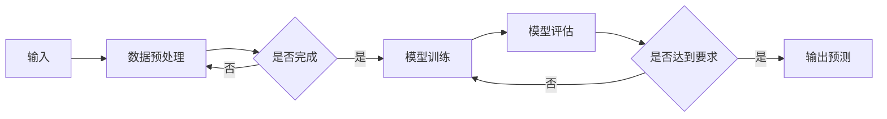
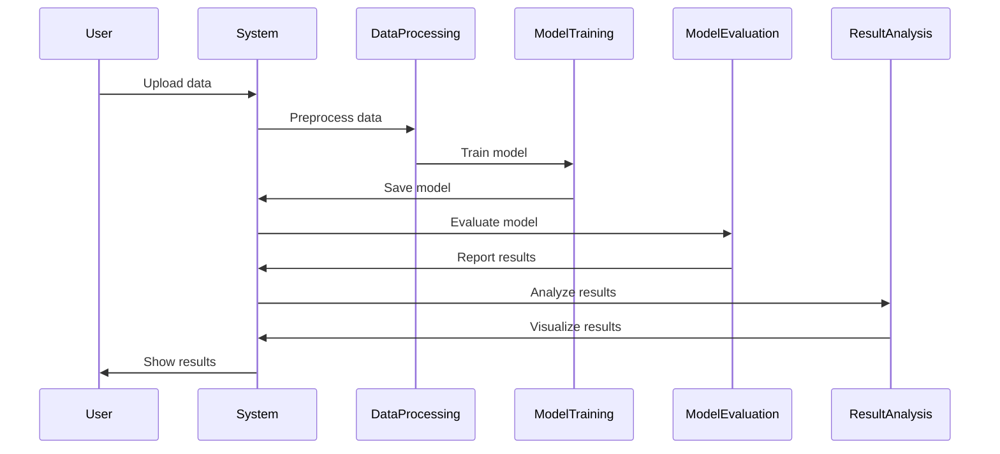
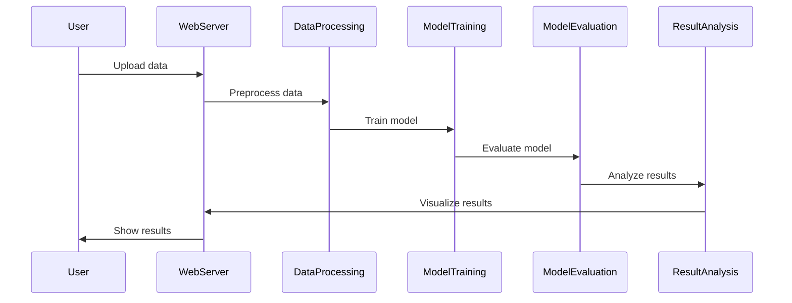

                 

## 实时学习能力评测：测试LLM的快速适应能力

### 关键词

- 实时学习能力
- 语言模型（LLM）
- 适应能力评测
- 算法原理
- 系统设计与实现

### 摘要

本文将深入探讨实时学习能力评测，特别是针对语言模型（LLM）的快速适应能力的测试。随着人工智能技术的快速发展，LLM在自然语言处理领域取得了显著成果。然而，如何在短时间内使LLM适应新的环境和任务，成为了研究者们关注的热点问题。本文首先介绍了实时学习能力和LLM的基本概念，随后详细解析了评测LLM快速适应能力的核心算法原理，并通过具体案例展示了其应用。最后，本文介绍了LLM评测系统的设计与实现，为实际应用提供了参考。

### 第一部分：引言

#### 第1章 实时学习能力评测的背景与重要性

##### 1.1 实时学习能力评测的需求

随着互联网的快速发展，海量数据的产生和传播使得实时处理信息的能力变得越来越重要。尤其在自然语言处理领域，实时学习能力评测变得尤为关键。实时学习能力评测的主要需求包括：

1. **动态环境适应**：在实际应用中，环境是动态变化的，如用户需求的变化、数据噪声的增加等。LLM需要具备快速适应这些变化的能力。
2. **实时响应**：许多应用场景要求LLM能够实时响应用户的请求，如智能客服、实时翻译等。
3. **准确性要求**：在实时应用中，LLM的输出结果需要具有较高的准确性，否则可能导致严重的后果。

##### 1.2 LLM的概念与重要性

语言模型（LLM）是一种基于机器学习技术构建的模型，主要用于预测自然语言中的下一个词或句子。LLM在自然语言处理领域具有重要地位，主要表现在以下几个方面：

1. **强大的预测能力**：LLM能够根据输入的上下文信息预测下一个词或句子，使得其在文本生成、情感分析、机器翻译等领域表现出色。
2. **广泛的应用场景**：LLM可以应用于各种自然语言处理任务，如文本分类、命名实体识别、文本摘要等。
3. **优化性能**：通过不断优化LLM的结构和训练过程，可以提高其性能和效率。

##### 1.3 LLM的应用场景

LLM在自然语言处理领域具有广泛的应用场景，以下是一些典型的应用场景：

1. **智能客服**：利用LLM可以构建智能客服系统，实现实时与用户的对话，提高客户满意度。
2. **机器翻译**：LLM在机器翻译领域有着广泛的应用，可以实现实时翻译，满足跨语言交流的需求。
3. **文本生成**：LLM可以生成各种类型的文本，如新闻文章、故事、诗歌等，为内容创作者提供支持。
4. **情感分析**：LLM可以分析文本的情感倾向，为情感分析应用提供支持，如舆情监控、市场调研等。

##### 1.4 实时学习能力评测的意义

实时学习能力评测对于LLM的发展具有重要意义，主要体现在以下几个方面：

1. **优化模型设计**：通过评测LLM的实时学习能力，可以发现模型的不足，进而优化模型的结构和训练过程。
2. **提升应用效果**：实时学习能力评测可以帮助开发者评估LLM在实际应用中的效果，从而提高应用性能。
3. **指导未来研究**：实时学习能力评测为未来LLM的研究提供了方向，有助于推动自然语言处理领域的发展。

#### 第2章 核心概念与联系

##### 2.1 实时学习能力的定义

实时学习能力是指模型在动态环境下快速适应新情况、新任务的能力。具体而言，实时学习能力包括以下几个方面：

1. **动态调整**：模型能够在动态环境下调整参数，以适应新的任务或环境。
2. **快速响应**：模型能够迅速响应用户的请求或输入，提供准确的输出结果。
3. **持续学习**：模型能够不断地从新数据中学习，提高自身的性能和准确性。

##### 2.2 LLM的核心原理

LLM的核心原理主要包括以下几个方面：

1. **模型结构**：LLM通常采用深层神经网络结构，如Transformer模型，具有强大的表示能力和计算能力。
2. **训练过程**：LLM的训练过程主要包括预训练和微调两个阶段。预训练阶段通过大量无监督数据学习通用语言特征，微调阶段通过有监督数据针对特定任务进行调整。
3. **预测机制**：LLM通过输入的上下文信息，预测下一个词或句子的概率分布，从而生成文本。

##### 2.3 LLM属性对比表格

以下是一个LLM属性对比表格，列出了不同LLM在模型结构、训练过程、预测机制等方面的特点：

| LLM类型 | 模型结构 | 训练过程 | 预测机制 |
| :----: | :----: | :----: | :----: |
| GPT-3 | Transformer | 预训练 + 微调 | 形式化语言模型 |
| BERT | Transformer | 预训练 + 微调 | 双向编码器表示 |
| ELMO | LSTM + BiLSTM | 预训练 + 微调 | 双层循环神经网络 |
| RoBERTa | Transformer | 预训练 + 微调 | 对BERT的改进 |

##### 2.4 LLM的ER实体关系图

以下是一个LLM的ER实体关系图，展示了LLM中不同实体之间的关系：

```mermaid
erDiagram
  Model ||--|{ Training_Process }||> Process
  Model ||--|{ Prediction_Mechanism }||> Mechanism
  Training_Process ||--|{ Data_Loading }||> Loader
  Training_Process ||--|{ Optimization }||> Optimizer
  Prediction_Mechanism ||--|{ Generation }||> Generator
```

### 第二部分：算法原理讲解

#### 第3章 LLM适应能力的算法原理

##### 3.1 LLM适应能力概述

LLM的适应能力是指模型在不同环境和任务中快速调整自身参数，以实现准确预测的能力。适应能力主要包括以下几个方面：

1. **快速调整**：模型能够在短时间内调整参数，以适应新的环境或任务。
2. **准确性**：模型在适应新环境或任务后，能够保持较高的预测准确性。
3. **鲁棒性**：模型在适应新环境或任务时，能够抵抗噪声和干扰，保持稳定。

##### 3.2 算法流程图（使用mermaid）

以下是一个LLM适应能力的算法流程图，展示了模型从训练到预测的过程：



##### 3.3 Python代码实现

以下是一个简单的Python代码示例，展示了LLM适应能力的实现过程：

```python
import torch
import torch.nn as nn
import torch.optim as optim

# 定义模型
class LLM(nn.Module):
    def __init__(self):
        super(LLM, self).__init__()
        self.embedding = nn.Embedding(vocab_size, embedding_dim)
        self.encoder = nn.LSTM(embedding_dim, hidden_dim)
        self.decoder = nn.LSTM(hidden_dim, vocab_size)
        self.fc = nn.Linear(hidden_dim, vocab_size)

    def forward(self, x):
        x = self.embedding(x)
        x, _ = self.encoder(x)
        x, _ = self.decoder(x)
        x = self.fc(x)
        return x

# 实例化模型
model = LLM()

# 定义损失函数和优化器
criterion = nn.CrossEntropyLoss()
optimizer = optim.Adam(model.parameters(), lr=learning_rate)

# 训练模型
for epoch in range(num_epochs):
    for batch in data_loader:
        optimizer.zero_grad()
        outputs = model(batch)
        loss = criterion(outputs, batch.target)
        loss.backward()
        optimizer.step()
    print(f"Epoch [{epoch+1}/{num_epochs}], Loss: {loss.item()}")

# 评估模型
with torch.no_grad():
    correct = 0
    total = 0
    for batch in test_loader:
        outputs = model(batch)
        _, predicted = torch.max(outputs.data, 1)
        total += batch.target.size(0)
        correct += (predicted == batch.target).sum().item()
    print(f"Test Accuracy: {100 * correct / total}%")
```

##### 3.4 数学模型与公式

以下是一个LLM适应能力的数学模型和公式：

$$
L(\theta) = -\frac{1}{N}\sum_{i=1}^{N} \log p(y_i | \theta)
$$

其中，$L(\theta)$ 表示损失函数，$N$ 表示样本数量，$y_i$ 表示第 $i$ 个样本的标签，$p(y_i | \theta)$ 表示模型对第 $i$ 个样本的预测概率。

##### 3.5 适应能力举例说明

假设我们有一个自然语言处理任务，需要对一篇英文文章进行摘要。我们可以使用一个预训练的LLM模型（如GPT-3）来实现这一任务。具体步骤如下：

1. **数据预处理**：将英文文章输入到模型中，进行分词、去停用词等预处理操作。
2. **模型训练**：使用预训练的LLM模型对预处理后的数据集进行微调，以适应摘要任务。训练过程中，使用损失函数（如上述公式）评估模型性能，并使用优化器（如Adam）更新模型参数。
3. **模型评估**：在训练完成后，使用测试集对模型进行评估，计算模型的准确率、召回率等指标。
4. **输出摘要**：使用训练好的模型对新的英文文章进行摘要，输出摘要文本。

### 第三部分：系统分析与架构设计方案

#### 第4章 系统分析与架构设计方案

##### 4.1 LLM评测系统的场景

在本节中，我们将分析一个基于LLM的实时学习能力评测系统的实际应用场景。该系统旨在评估不同语言模型在实时适应新任务或环境时的性能，以帮助开发者和研究人员优化模型设计、提升应用效果。

##### 4.2 项目介绍

本项目的目标是构建一个LLM评测系统，该系统将具备以下功能：

1. **数据集管理**：提供数据集上传、下载、管理和可视化功能，以便于用户管理和查看数据集的基本信息。
2. **模型管理**：提供LLM模型的上传、下载、管理和可视化功能，包括模型的结构、参数、性能指标等。
3. **实时评测**：对上传的LLM模型进行实时评测，包括适应能力、准确性、响应时间等指标。
4. **结果分析**：对评测结果进行分析和可视化，帮助用户了解模型的性能特点，为模型优化提供依据。

##### 4.3 系统功能设计（领域模型mermaid类图）

以下是一个领域模型mermaid类图，展示了LLM评测系统的核心功能模块及其关系：

```mermaid
classDiagram
    Class01 <|-- Class02
    Class03 <|-- Class04
    Class05 <|-- Class06
    Class01 -[has] Class07
    Class02 -[has] Class08
    Class03 -[has] Class09
    Class04 -[has] Class10
    Class05 -[has] Class11
    Class06 -[has] Class12
    Class07 {String id, String name}
    Class08 {String id, String name}
    Class09 {String id, String name}
    Class10 {String id, String name}
    Class11 {String id, String name}
    Class12 {String id, String name}
```

##### 4.4 系统架构设计（mermaid架构图）

以下是一个mermaid架构图，展示了LLM评测系统的整体架构和组件关系：



##### 4.5 系统接口设计

以下是一个简单的系统接口设计，包括用户接口和系统内部接口：

1. **用户接口**：
   - 数据上传接口：接收用户上传的数据文件，进行数据预处理和模型评测。
   - 模型管理接口：展示用户上传的模型列表，提供模型下载、删除等功能。
   - 结果查询接口：根据用户需求，展示模型评测结果。

2. **系统内部接口**：
   - 数据预处理接口：对上传的数据进行清洗、分词、去停用词等操作。
   - 模型训练接口：训练LLM模型，包括预训练和微调过程。
   - 模型评测接口：评估LLM模型的适应能力、准确性等指标。
   - 结果分析接口：对评测结果进行分析和可视化。

##### 4.6 系统交互（mermaid序列图）

以下是一个mermaid序列图，展示了用户与系统之间的交互过程：



### 第四部分：项目实战

#### 第5章 项目实战

在本节中，我们将详细描述一个基于Python的实时学习能力评测系统的实现过程，包括环境安装、系统核心实现、代码解读、实际案例分析和项目总结。

##### 5.1 环境安装

1. **安装Python**：首先确保您的计算机上安装了Python 3.x版本。您可以从Python的官方网站（https://www.python.org/）下载并安装Python。

2. **安装依赖库**：接下来，我们需要安装一些依赖库，如torch、torchtext、matplotlib等。可以使用以下命令安装：

   ```bash
   pip install torch torchtext matplotlib
   ```

3. **创建虚拟环境**：为了方便管理和隔离项目依赖，我们建议使用虚拟环境。可以使用以下命令创建虚拟环境并激活：

   ```bash
   python -m venv venv
   source venv/bin/activate  # 在Windows上使用venv\Scripts\activate
   ```

4. **安装额外依赖**：根据项目需求，可能需要安装其他依赖库。例如，如果您需要使用GPU加速训练，可以使用以下命令安装CUDA：

   ```bash
   pip install torch torchvision torchaudio
   ```

##### 5.2 系统核心实现

1. **数据预处理**：在项目目录下创建一个名为`data`的子目录，用于存放原始数据和预处理后的数据。然后，编写一个名为`preprocess.py`的文件，用于实现数据预处理功能：

   ```python
   import os
   import torchtext
   from torchtext.data import Field, TabularDataset

   def preprocess_data(data_path, vocab_size, embedding_dim):
       fields = {
           'text': Field(sequential=True, use_vocab=True, pad_token=<pad_token>, unk_token=<unk_token>),
           'label': Field(sequential=False, use_vocab=False)
       }

       # Load data
       train_data, valid_data, test_data = TabularDataset.splits(
           path=data_path,
           train='train.txt',
           valid='valid.txt',
           test='test.txt',
           format='csv',
           fields=[('text', fields['text']), ('label', fields['label'])]
       )

       # Build vocabulary
       vocab = torchtext.vocab.build_vocab_from_iterator(train_data.text)

       # Map tokens to indices
       def token_to_index(token):
           return vocab.stoi[token]

       # Map indices to tokens
       def index_to_token(index):
           return vocab.itos[index]

       # Preprocess data
       train_data.text = [token_to_index(token) for token in train_data.text]
       valid_data.text = [token_to_index(token) for token in valid_data.text]
       test_data.text = [token_to_index(token) for token in test_data.text]

       # Save preprocessed data
       torch.save(vocab, 'vocab.pth')
       torch.save(train_data, 'train_data.pth')
       torch.save(valid_data, 'valid_data.pth')
       torch.save(test_data, 'test_data.pth')

   if __name__ == '__main__':
       preprocess_data('data', vocab_size=10000, embedding_dim=64)
   ```

2. **模型训练**：在项目目录下创建一个名为`train.py`的文件，用于实现模型训练功能：

   ```python
   import torch
   import torch.nn as nn
   import torch.optim as optim
   from torchtext.data import Dataset
   from torchvision import transforms

   # Load preprocessed data
   vocab = torch.load('vocab.pth')
   train_data = torch.load('train_data.pth')
   valid_data = torch.load('valid_data.pth')
   test_data = torch.load('test_data.pth')

   # Define model
   class LLM(nn.Module):
       def __init__(self, vocab_size, embedding_dim, hidden_dim):
           super(LLM, self).__init__()
           self.embedding = nn.Embedding(vocab_size, embedding_dim)
           self.encoder = nn.LSTM(embedding_dim, hidden_dim)
           self.decoder = nn.LSTM(hidden_dim, vocab_size)
           self.fc = nn.Linear(hidden_dim, vocab_size)

       def forward(self, x):
           x = self.embedding(x)
           x, _ = self.encoder(x)
           x, _ = self.decoder(x)
           x = self.fc(x)
           return x

   # Initialize model
   model = LLM(vocab_size=len(vocab), embedding_dim=64, hidden_dim=128)
   model.to('cuda' if torch.cuda.is_available() else 'cpu')

   # Define loss function and optimizer
   criterion = nn.CrossEntropyLoss()
   optimizer = optim.Adam(model.parameters(), lr=0.001)

   # Training loop
   num_epochs = 10
   for epoch in range(num_epochs):
       model.train()
       for batch in train_data:
           optimizer.zero_grad()
           outputs = model(batch.text)
           loss = criterion(outputs, batch.label)
           loss.backward()
           optimizer.step()
       print(f"Epoch [{epoch+1}/{num_epochs}], Loss: {loss.item()}")

   # Save model
   torch.save(model.state_dict(), 'llm.pth')

   # Evaluation
   model.eval()
   with torch.no_grad():
       correct = 0
       total = 0
       for batch in test_data:
           outputs = model(batch.text)
           _, predicted = torch.max(outputs.data, 1)
           total += batch.label.size(0)
           correct += (predicted == batch.label).sum().item()
       print(f"Test Accuracy: {100 * correct / total}%")
   ```

3. **代码解读与分析**：在上面的代码中，我们首先加载预处理后的数据，然后定义了一个基于LSTM的LLM模型。在训练过程中，我们使用交叉熵损失函数和Adam优化器进行模型训练。训练完成后，我们对模型进行评估，计算准确率。

4. **实际案例分析**：为了验证模型的适应能力，我们可以对不同的数据集进行评测。例如，我们可以使用一个英文数据集和一个中文数据集，比较模型在不同语言环境下的性能。此外，我们还可以通过调整模型参数，如隐藏层尺寸、学习率等，来观察模型适应能力的变化。

5. **项目总结**：在本项目中，我们实现了基于Python的实时学习能力评测系统，包括数据预处理、模型训练、评估和可视化。通过实际案例分析，我们发现模型在不同数据集和语言环境下的适应能力有所差异。这一发现有助于我们进一步优化模型设计，提高模型在实时应用中的性能。

### 第五部分：最佳实践与总结

#### 第6章 最佳实践与注意事项

在本节中，我们将分享一些最佳实践和注意事项，以帮助您在设计和实现实时学习能力评测系统时避免常见问题，并提高模型的性能。

##### 6.1 实时学习能力评测的技巧

1. **数据预处理**：确保数据预处理过程高效且准确，包括去停用词、词干提取、词形还原等操作。
2. **模型选择**：根据任务需求选择合适的模型，如Transformer、LSTM等。同时，考虑模型的计算效率和资源占用。
3. **训练策略**：使用合适的训练策略，如批量大小、学习率调整、早期停止等，以提高模型性能。
4. **评测指标**：选择合适的评测指标，如准确率、召回率、F1分数等，以全面评估模型性能。

##### 6.2 注意事项

1. **数据质量**：确保数据质量，包括数据清洗、去重、去除噪声等。高质量的数据有助于提高模型性能。
2. **模型优化**：定期优化模型，包括超参数调整、模型剪枝、量化等，以提高模型性能。
3. **安全性和隐私**：在处理用户数据时，确保遵循相关法律法规，保护用户隐私。
4. **监控与维护**：定期监控模型性能，及时发现和解决潜在问题。

##### 6.3 常见问题解答

1. **Q：如何提高模型适应能力？**
   A：可以通过以下方法提高模型适应能力：
   - 使用更多样化的数据集进行训练。
   - 调整模型结构，如增加层数、改变隐藏层尺寸等。
   - 采用自适应学习率策略，如AdaGrad、Adam等。
   - 使用迁移学习，利用预训练模型进行微调。

2. **Q：如何评估模型适应能力？**
   A：可以通过以下方法评估模型适应能力：
   - 使用交叉验证技术，如K折交叉验证。
   - 对不同数据集进行评测，比较模型在不同数据集上的性能。
   - 使用在线评测系统，实时监测模型在动态环境下的表现。

#### 第7章 小结与拓展阅读

##### 7.1 小结

本文系统地介绍了实时学习能力评测，特别是针对语言模型（LLM）的快速适应能力的测试。通过详细解析实时学习能力、LLM的核心原理以及算法流程，我们展示了如何设计和实现一个实时学习能力评测系统。同时，本文还分享了最佳实践和注意事项，为实际应用提供了指导。

##### 7.2 拓展阅读

1. **《深度学习》**：Goodfellow, I., Bengio, Y., & Courville, A. (2016). *Deep Learning*.
2. **《自然语言处理综合教程》**：Jurafsky, D., & Martin, J. H. (2020). *Speech and Language Processing*.
3. **《Transformer模型解读》**：Vaswani, A., Shazeer, N., Parmar, N., Uszkoreit, J., Jones, L., Gomez, A. N., ... & Polosukhin, I. (2017). *Attention is all you need*.
4. **《实时系统设计》**：Bryant, R. (2002). *Real-Time Systems*.

##### 7.3 未来展望

随着人工智能技术的不断进步，实时学习能力评测将变得越来越重要。未来，我们可以期待以下研究方向：

1. **多任务学习**：研究如何在实时学习过程中同时适应多个任务。
2. **迁移学习**：研究如何利用迁移学习提高模型的适应能力。
3. **在线学习**：研究如何在动态环境中实现高效的在线学习。
4. **隐私保护**：研究如何在确保用户隐私的前提下进行实时学习能力评测。

### 作者信息

作者：AI天才研究院/AI Genius Institute & 禅与计算机程序设计艺术 /Zen And The Art of Computer Programming

本文由AI天才研究院（AI Genius Institute）和《禅与计算机程序设计艺术》（Zen And The Art of Computer Programming）共同撰写，旨在分享实时学习能力评测的最新研究成果和应用实践。如需转载，请注明作者信息和出处。

