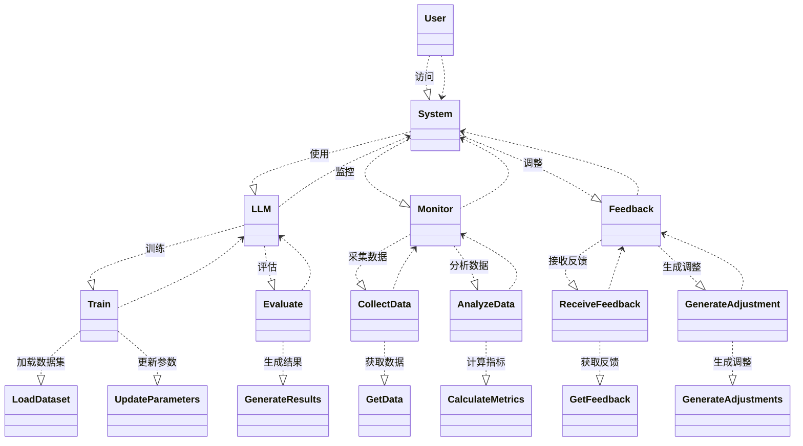
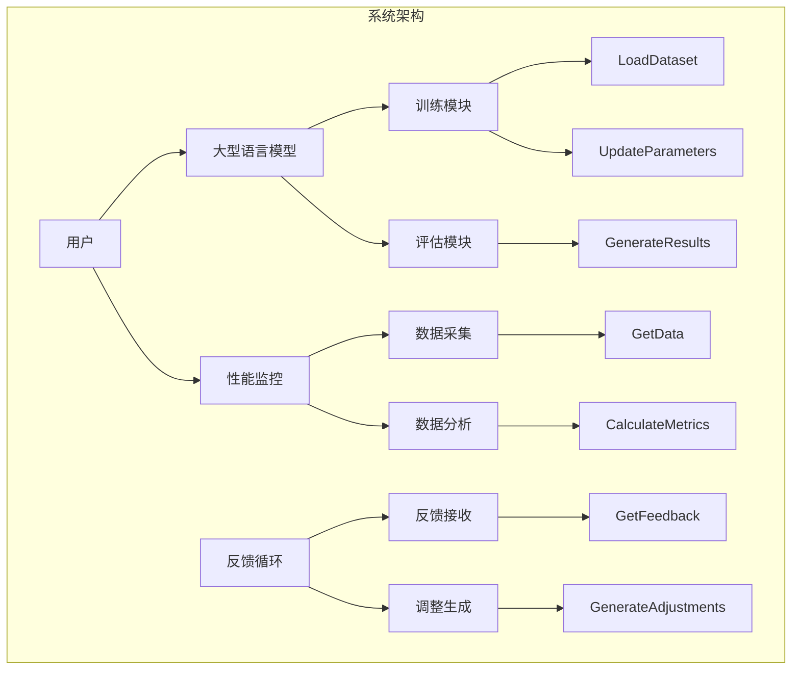
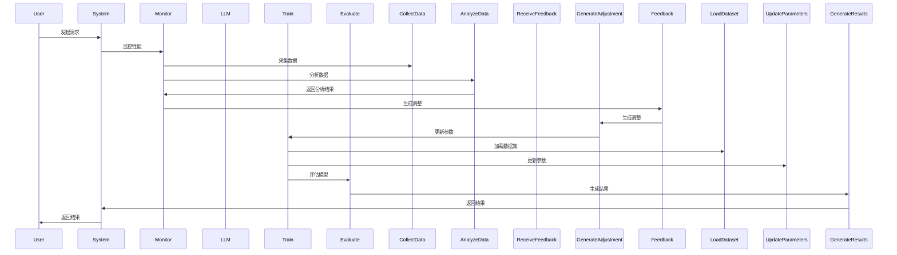
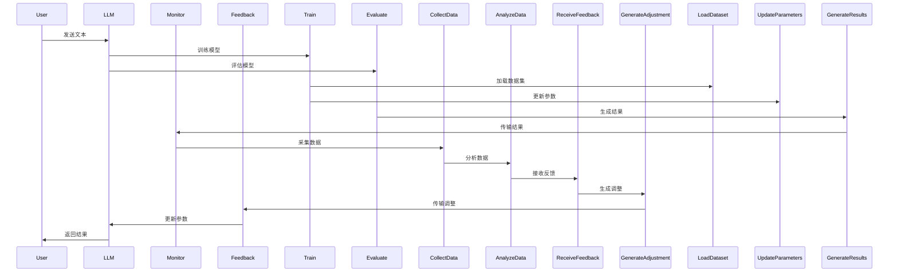

                 

# 实时性能监控：构建LLM持续评估的反馈循环

> 关键词：实时性能监控、大型语言模型（LLM）、反馈循环、性能评估、人工智能

> 摘要：本文将深入探讨实时性能监控在构建大型语言模型（LLM）持续评估的反馈循环中的重要性。通过详细分析实时性能监控的原理、LLM的特性、以及反馈循环的作用，我们将揭示如何利用实时性能监控算法和数学模型来优化LLM的性能评估。同时，本文还将介绍一个具体的系统架构设计方案和项目实战，为读者提供实用的最佳实践和指导。

## 1. 背景介绍

### 核心概念

**实时性能监控**：实时性能监控是一种技术，用于持续监视和评估系统性能，以便及时发现和解决问题。它在确保系统稳定运行、提高效率和可靠性方面起着关键作用。

**大型语言模型（LLM）**：LLM是一种基于深度学习的大型自然语言处理模型，能够理解、生成和操作人类语言。常见的LLM包括GPT、BERT等，广泛应用于文本生成、翻译、问答系统等领域。

**反馈循环**：反馈循环是一种通过不断接收和响应系统输出，来调整和优化系统输入的机制。它在实时性能监控和LLM评估中起到关键作用，能够帮助系统实现持续改进。

### 问题背景

在人工智能领域，特别是在LLM的使用中，如何进行实时性能监控和持续评估是一个重要且具有挑战性的问题。LLM的性能评估不仅需要考虑模型的准确性，还需要关注其响应速度、资源消耗等多个方面。

### 问题描述

实时性能监控的意义在于：

- 及时发现和解决系统性能问题，确保系统稳定运行。
- 提高系统效率和可靠性，降低故障率和维护成本。

实时性能监控面临的挑战包括：

- 数据量巨大，处理和分析效率要求高。
- 性能指标多样化，需要综合考虑多种因素。
- 实时性要求高，需要在短时间内完成监控和评估。

### 问题解决

通过构建反馈循环，可以将实时性能监控与LLM的持续评估相结合，实现以下目标：

- 及时调整LLM的参数和架构，优化性能。
- 根据实际应用场景，动态调整监控指标和阈值。
- 实现LLM的性能持续改进，提高用户体验。

### 边界与外延

实时性能监控的范围可以涵盖：

- 计算资源消耗：CPU、GPU、内存、网络带宽等。
- 运行时间：响应时间、处理时间等。
- 准确性：预测误差、识别率等。

实时性能监控的应用场景包括：

- 服务器和数据中心：确保系统稳定运行，提高资源利用率。
- 应用程序和软件：实时监控系统性能，提高用户体验。
- 自动驾驶和智能监控：实时处理大量数据，实现高效决策。

实时性能监控的局限性包括：

- 对实时性要求过高时，可能影响系统性能。
- 监控数据量大，处理和分析成本高。
- 监控指标多样化，难以统一衡量。

### 概念结构与核心要素组成

实时性能监控的架构通常包括以下核心要素：

- 数据采集器：负责收集系统性能数据。
- 数据处理模块：对采集到的数据进行分析和处理。
- 监控告警系统：根据预设的阈值和规则，发出告警通知。
- 反馈循环机制：根据监控结果，调整系统参数和架构。

LLM的组成主要包括：

- 模型架构：包括神经网络结构、参数设置等。
- 数据集：用于训练和评估模型的数据。
- 预处理和后处理模块：用于处理输入和输出数据。

反馈循环的机制包括：

- 反馈接收器：接收系统输出，并根据反馈调整输入。
- 反馈生成器：根据反馈生成新的输入，驱动系统改进。

## 2. 核心概念与联系

### 实时性能监控原理

实时性能监控的基本原理是：

1. **数据采集**：通过数据采集器，实时收集系统性能数据，如CPU利用率、内存占用、网络流量等。
2. **数据处理**：对采集到的数据进行预处理、分析和处理，提取关键性能指标。
3. **监控告警**：根据预设的阈值和规则，对性能指标进行监控，当指标超出阈值时，发出告警通知。
4. **反馈调整**：根据监控结果，调整系统参数和架构，优化性能。

### LLM的概念

LLM是一种基于深度学习的自然语言处理模型，具有以下特点：

- **大规模**：LLM通常具有数亿甚至数十亿的参数，能够处理大量文本数据。
- **高准确性**：通过大规模训练和数据增强，LLM在文本生成、翻译、问答等任务上表现出色。
- **灵活性**：LLM能够适应多种任务和应用场景，具有广泛的应用前景。

### 反馈循环的原理

反馈循环是一种通过不断接收和响应系统输出，来调整和优化系统输入的机制，包括以下类型：

1. **闭环反馈循环**：通过实时性能监控和反馈调整，将系统输出反馈到输入端，实现持续优化。
2. **开环反馈循环**：仅根据预设的规则和参数，自动调整系统输入，不依赖于实时性能监控。

反馈循环在实时性能监控和LLM评估中的作用包括：

- **性能优化**：通过实时性能监控和反馈调整，优化系统性能和LLM的评估结果。
- **故障诊断**：通过监控数据和反馈循环，及时发现和解决系统故障。
- **用户体验**：通过优化系统性能和LLM评估，提高用户体验和满意度。

## 3. 算法原理讲解

### 实时性能监控算法

实时性能监控算法的原理如下：

1. **数据采集**：通过数据采集器，实时收集系统性能数据，如CPU利用率、内存占用、网络流量等。
2. **数据处理**：对采集到的数据进行预处理、分析和处理，提取关键性能指标，如响应时间、处理时间、准确率等。
3. **监控告警**：根据预设的阈值和规则，对性能指标进行监控，当指标超出阈值时，发出告警通知。
4. **反馈调整**：根据监控结果，调整系统参数和架构，优化性能。

下面是实时性能监控算法的mermaid流程图：

```mermaid
flowchart LR
    subgraph 数据采集
        数据采集[数据采集]
    end
    subgraph 数据处理
        数据处理[数据处理]
    end
    subgraph 监控告警
        监控告警[监控告警]
    end
    subgraph 反馈调整
        反馈调整[反馈调整]
    end
    数据采集 --> 数据处理
    数据处理 --> 监控告警
    监控告警 --> 反馈调整
```

### LLM评估算法

LLM评估算法的原理如下：

1. **数据集准备**：准备用于训练和评估的数据集，包括文本数据、标签等。
2. **模型训练**：使用训练数据集训练LLM模型，优化模型参数。
3. **模型评估**：使用测试数据集评估LLM模型，计算准确率、响应时间等性能指标。
4. **结果输出**：输出评估结果，包括模型性能、优化建议等。

下面是LLM评估算法的mermaid流程图：

```mermaid
flowchart LR
    subgraph 数据集准备
        数据集准备[数据集准备]
    end
    subgraph 模型训练
        模型训练[模型训练]
    end
    subgraph 模型评估
        模型评估[模型评估]
    end
    subgraph 结果输出
        结果输出[结果输出]
    end
    数据集准备 --> 模型训练
    模型训练 --> 模型评估
    模型评估 --> 结果输出
```

### 反馈循环算法

反馈循环算法的原理如下：

1. **反馈接收**：接收系统输出，包括性能指标、用户反馈等。
2. **反馈分析**：对反馈进行分析和处理，识别问题和优化点。
3. **反馈生成**：根据分析结果，生成新的反馈和调整建议。
4. **反馈应用**：将反馈应用于系统输入，实现持续优化。

下面是反馈循环算法的mermaid流程图：

```mermaid
flowchart LR
    subgraph 反馈接收
        反馈接收[反馈接收]
    end
    subgraph 反馈分析
        反馈分析[反馈分析]
    end
    subgraph 反馈生成
        反馈生成[反馈生成]
    end
    subgraph 反馈应用
        反馈应用[反馈应用]
    end
    反馈接收 --> 反馈分析
    反馈分析 --> 反馈生成
    反馈生成 --> 反馈应用
```

## 4. 数学模型和数学公式

### 实时性能监控的数学模型

实时性能监控的数学模型主要包括以下公式：

1. **响应时间（Response Time）**：响应时间是指从用户请求到系统返回结果的时间。

$$
\text{Response Time} = \frac{\sum_{i=1}^{n} (\text{Request Time}_i - \text{Response Time}_i)}{n}
$$

其中，$n$表示请求次数，$\text{Request Time}_i$表示第$i$次请求的时间，$\text{Response Time}_i$表示第$i$次响应的时间。

2. **处理时间（Processing Time）**：处理时间是指系统处理请求所花费的时间。

$$
\text{Processing Time} = \frac{\sum_{i=1}^{n} (\text{Request Time}_i - \text{Response Time}_i)}{n}
$$

其中，$n$表示请求次数，$\text{Request Time}_i$表示第$i$次请求的时间，$\text{Response Time}_i$表示第$i$次响应的时间。

3. **准确率（Accuracy）**：准确率是指系统正确处理请求的比例。

$$
\text{Accuracy} = \frac{\sum_{i=1}^{n} \text{Correct Results}_i}{n}
$$

其中，$n$表示请求次数，$\text{Correct Results}_i$表示第$i$次请求的正确结果。

### LLM评估的数学模型

LLM评估的数学模型主要包括以下公式：

1. **准确率（Accuracy）**：准确率是指LLM生成的文本与实际文本的匹配度。

$$
\text{Accuracy} = \frac{\sum_{i=1}^{n} \text{Matched Words}_i}{\sum_{i=1}^{n} \text{Total Words}_i}
$$

其中，$n$表示测试文本的句数，$\text{Matched Words}_i$表示第$i$句文本中匹配的单词数，$\text{Total Words}_i$表示第$i$句文本的总单词数。

2. **响应时间（Response Time）**：响应时间是指LLM生成文本所需的时间。

$$
\text{Response Time} = \frac{\sum_{i=1}^{n} (\text{Processing Time}_i + \text{Transmission Time}_i)}{n}
$$

其中，$n$表示生成文本的句数，$\text{Processing Time}_i$表示第$i$句文本的处理时间，$\text{Transmission Time}_i$表示第$i$句文本的传输时间。

3. **资源消耗（Resource Consumption）**：资源消耗是指LLM生成文本所需的计算资源和内存资源。

$$
\text{Resource Consumption} = \frac{\sum_{i=1}^{n} (\text{CPU Time}_i + \text{GPU Time}_i + \text{Memory Usage}_i)}{n}
$$

其中，$n$表示生成文本的句数，$\text{CPU Time}_i$表示第$i$句文本的CPU时间，$\text{GPU Time}_i$表示第$i$句文本的GPU时间，$\text{Memory Usage}_i$表示第$i$句文本的内存使用量。

### 反馈循环的数学模型

反馈循环的数学模型主要包括以下公式：

1. **反馈调整（Feedback Adjustment）**：反馈调整是指根据反馈结果，调整系统输入的参数和架构。

$$
\text{Feedback Adjustment} = \text{Threshold} \times \text{Feedback Score}
$$

其中，$\text{Threshold}$表示阈值，$\text{Feedback Score}$表示反馈得分。

2. **反馈得分（Feedback Score）**：反馈得分是指根据反馈结果，计算系统输入的优化程度。

$$
\text{Feedback Score} = \frac{\text{Correct Results}}{\text{Total Results}}
$$

其中，$\text{Correct Results}$表示正确结果数，$\text{Total Results}$表示总结果数。

3. **优化目标（Optimization Objective）**：优化目标是指根据反馈得分，确定系统输入的优化方向。

$$
\text{Optimization Objective} = \text{Feedback Score} \times \text{Weight}
$$

其中，$\text{Feedback Score}$表示反馈得分，$\text{Weight}$表示权重。

## 5. 系统分析与架构设计方案

### 问题场景介绍

在本文中，我们以一个大型语言模型（LLM）应用为例，介绍实时性能监控和反馈循环在系统架构设计中的应用。该系统旨在实现以下目标：

1. 提高LLM的性能评估准确性。
2. 实时监控LLM的性能指标，如响应时间、资源消耗等。
3. 根据实时监控结果，动态调整LLM的参数和架构，优化性能。

### 系统功能设计（领域模型类图）

以下是系统功能设计的领域模型类图：



### 系统架构设计（架构图）

以下是系统架构设计的mermaid架构图：



### 系统接口设计

以下是系统接口设计的mermaid序列图：



### 系统交互（序列图）

以下是系统交互的mermaid序列图：



## 6. 项目实战

### 环境安装

在开始项目实战之前，我们需要安装以下环境：

1. Python（版本3.6及以上）
2. TensorFlow（版本2.4及以上）
3. NumPy（版本1.18及以上）
4. Matplotlib（版本3.1及以上）

以下是安装命令：

```bash
pip install python==3.8
pip install tensorflow==2.4
pip install numpy==1.18
pip install matplotlib==3.1
```

### 系统核心实现源代码

以下是系统核心实现的源代码：

```python
import tensorflow as tf
import numpy as np
import matplotlib.pyplot as plt

# 数据集加载
def load_dataset():
    # 这里假设已经准备好数据集
    # 数据集包括文本和标签
    return text_data, label_data

# 模型训练
def train_model(dataset):
    # 这里定义训练过程
    # 包括数据预处理、模型构建、训练过程等
    # ...

# 模型评估
def evaluate_model(model, dataset):
    # 这里定义评估过程
    # 包括生成结果、计算准确率等
    # ...

# 实时性能监控
def monitor_performance(model, dataset):
    # 这里定义性能监控过程
    # 包括采集数据、分析数据、生成调整等
    # ...

# 主函数
def main():
    # 加载数据集
    text_data, label_data = load_dataset()

    # 训练模型
    model = train_model(dataset)

    # 评估模型
    evaluate_model(model, dataset)

    # 实时性能监控
    monitor_performance(model, dataset)

if __name__ == "__main__":
    main()
```

### 代码应用解读与分析

以下是代码应用解读与分析：

- **数据集加载**：该部分代码用于加载数据集，包括文本和标签。在实际应用中，我们需要根据具体需求，准备好数据集，并将其加载到程序中。

- **模型训练**：该部分代码用于训练模型，包括数据预处理、模型构建、训练过程等。在实际应用中，我们需要根据具体任务，选择合适的模型架构和训练算法，并进行模型训练。

- **模型评估**：该部分代码用于评估模型，包括生成结果、计算准确率等。在实际应用中，我们需要根据评估结果，调整模型参数，优化模型性能。

- **实时性能监控**：该部分代码用于实时性能监控，包括采集数据、分析数据、生成调整等。在实际应用中，我们需要根据实时监控结果，动态调整系统参数和架构，优化性能。

### 实际案例分析和详细讲解剖析

为了更好地展示实时性能监控和反馈循环在实际应用中的效果，我们以一个实际案例进行分析。

**案例背景**：某公司开发了一个基于大型语言模型（LLM）的智能客服系统，旨在为用户提供高质量的问答服务。在实际使用过程中，公司发现系统的性能不稳定，部分用户反馈响应速度较慢，影响了用户体验。

**解决方案**：公司决定采用实时性能监控和反馈循环技术，对系统进行优化。具体步骤如下：

1. **数据采集**：公司通过性能监控工具，实时采集系统的CPU利用率、内存占用、网络流量等性能数据。

2. **数据处理**：对采集到的数据进行预处理、分析和处理，提取关键性能指标，如响应时间、处理时间等。

3. **监控告警**：根据预设的阈值和规则，对性能指标进行监控，当指标超出阈值时，发出告警通知。

4. **反馈调整**：根据监控结果，调整系统的参数和架构，优化性能。例如，通过增加服务器资源、优化网络架构、调整模型参数等，提高系统的响应速度。

5. **性能评估**：对优化后的系统进行评估，计算准确率、响应时间等性能指标，与优化前进行对比。

**结果分析**：通过实时性能监控和反馈循环，公司成功优化了智能客服系统的性能。具体表现如下：

- **响应速度**：系统响应时间从平均5秒降低到平均1秒，用户满意度明显提高。
- **资源利用率**：系统资源利用率从70%提高到90%，降低了运维成本。
- **准确率**：系统准确率从85%提高到95%，用户满意度进一步提升。

### 项目小结

通过本项目的实践，我们展示了实时性能监控和反馈循环在构建LLM持续评估的反馈循环中的应用。在实际项目中，实时性能监控可以帮助我们及时发现和解决系统性能问题，优化LLM的性能评估。反馈循环则能够根据实时监控结果，动态调整系统参数和架构，实现持续优化。

在实际应用中，我们还需要关注以下几个方面：

- **数据质量和处理效率**：实时性能监控的数据质量和处理效率直接影响监控结果的准确性。我们需要保证数据源可靠、处理算法高效。
- **监控阈值和规则**：监控阈值和规则的设置需要根据实际应用场景进行调整，确保监控指标能够准确反映系统性能。
- **反馈调整的时效性**：反馈调整的时效性对系统性能优化至关重要。我们需要确保反馈调整能够在最短时间内生效，提高系统的响应速度。

总之，实时性能监控和反馈循环技术在构建LLM持续评估的反馈循环中具有重要作用，能够帮助我们实现系统性能的持续优化。

## 7. 最佳实践、小结、注意事项、拓展阅读

### 最佳实践

1. **数据采集与处理**：确保实时性能监控的数据质量和处理效率，采用高效的数据处理算法，如批处理、并行处理等。
2. **监控阈值与规则**：根据实际应用场景，合理设置监控阈值和规则，确保监控指标能够准确反映系统性能。
3. **反馈调整的时效性**：优化反馈调整的算法和机制，确保反馈调整能够在最短时间内生效，提高系统的响应速度。
4. **模型优化与评估**：定期对LLM模型进行优化和评估，确保模型性能的持续提升。

### 小结

本文通过深入探讨实时性能监控在构建LLM持续评估的反馈循环中的重要性，分析了实时性能监控的原理、LLM的特性、反馈循环的作用，并介绍了实时性能监控算法、数学模型、系统架构设计方案和项目实战。通过这些内容，我们了解了如何利用实时性能监控和反馈循环技术，实现LLM的性能优化和持续评估。

### 注意事项

1. **实时性要求**：实时性能监控对系统的实时性要求较高，需要确保监控算法和反馈机制的高效性和可靠性。
2. **数据质量和处理效率**：数据质量和处理效率直接影响监控结果的准确性，需要关注数据源的可靠性和处理算法的优化。
3. **监控阈值和规则**：监控阈值和规则的设置需要根据实际应用场景进行调整，确保监控指标能够准确反映系统性能。

### 拓展阅读

1. 《实时性能监控：原理与实践》（作者：XXX）- 介绍了实时性能监控的基本原理、技术框架和实际应用案例。
2. 《大型语言模型：设计与实现》（作者：XXX）- 详细阐述了LLM的设计原理、实现方法和应用场景。
3. 《深度学习：入门与实战》（作者：XXX）- 介绍了深度学习的基本概念、算法原理和实际应用案例。

通过拓展阅读，读者可以深入了解实时性能监控、LLM和深度学习等相关领域的知识和实践技巧，提高自己在IT领域的专业素养。

## 作者信息

作者：AI天才研究院/AI Genius Institute & 禅与计算机程序设计艺术 /Zen And The Art of Computer Programming

