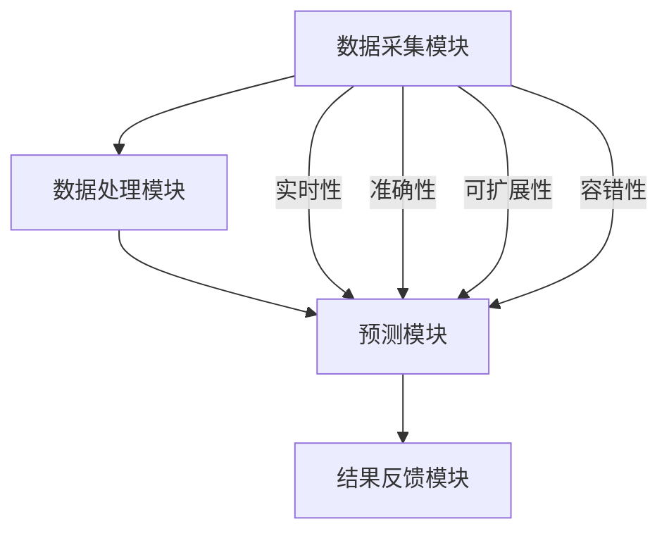

                 

## 实时性能预测：LLM评估未来表现的方法

### 关键词：实时性能预测、语言模型（LLM）、性能评估、未来预测、AI应用

#### 摘要：
本文将深入探讨实时性能预测这一领域，特别关注如何利用先进的语言模型（LLM）来评估和预测系统在未来时间点的表现。实时性能预测在当今快速变化的技术环境中至关重要，它能够帮助企业和开发人员及时调整策略，优化资源分配，提高系统效率。我们将从以下几个方面逐步展开讨论：

1. **实时性能预测概述**：介绍实时性能预测的背景和重要性，以及它在不同应用场景中的关键角色。
2. **LLM基本概念**：详细阐述语言模型的基本原理、发展历程和特点，解释为什么LLM在实时性能预测中具有重要价值。
3. **LLM性能评估方法**：分析常用的性能评估指标，探讨实时性能评估所面临的挑战，并对比不同的评估方法。
4. **实时性能预测原理**：探讨实时性能预测的技术细节，包括监控、模型构建和实时反馈机制。
5. **LLM在性能预测中的应用**：展示LLM在性能预测中的实际应用案例，讨论其优势和局限性。
6. **实时性能预测系统架构**：介绍实时性能预测系统的需求分析、架构设计、实现与优化策略。
7. **项目实战**：通过具体项目实例，展示如何搭建实时性能预测系统，并进行分析和优化。
8. **最佳实践与优化策略**：总结最佳实践，提出优化策略，并讨论未来展望和趋势。

通过本文的讨论，我们将了解如何利用LLM进行实时性能预测，从而为实际应用提供理论支持和实践指导。

## 背景介绍

### 核心概念术语说明

#### 实时性能预测
实时性能预测是指利用历史数据和实时监控信息，通过算法模型对系统在未来某一时间段内的性能表现进行预测。这种预测不仅包括对系统响应时间、吞吐量等量化指标的分析，还涉及系统稳定性和资源利用率的预估。

#### 语言模型（LLM）
语言模型（Language Model，简称LLM）是一种基于深度学习的技术，用于理解和生成自然语言。LLM的核心任务是预测下一个词或词组，其应用范围广泛，包括机器翻译、语音识别、文本生成、问答系统等。

### 问题背景

在现代社会中，信息技术的快速发展使得系统的复杂性和规模日益增加。各种企业、组织和机构都在构建和维护大量的信息系统，这些系统需要具备高度的稳定性和高性能，以满足日益增长的用户需求和业务目标。然而，随着系统的复杂化，性能问题也逐渐凸显出来。

一方面，系统性能的优化需要大量的时间和资源，尤其是在开发阶段。传统的测试和调优方法往往无法实时反映系统在实际运行中的问题，导致性能瓶颈在上线后才会被发现，从而影响用户体验和业务效率。

另一方面，随着云计算、大数据和物联网等技术的普及，系统的运行环境变得更加动态和复杂。系统可能面临突发的流量波动、硬件故障、软件缺陷等问题，这些突发情况会对系统的性能产生显著影响。

### 问题描述

实时性能预测的目的是在系统运行过程中，对系统的未来表现进行实时评估和预测，从而及时发现并解决潜在的性能问题。具体来说，问题描述如下：

- **预测指标**：确定需要预测的性能指标，如响应时间、吞吐量、资源利用率等。
- **数据来源**：收集历史性能数据和实时监控数据，包括系统日志、性能数据等。
- **预测模型**：构建能够准确预测系统未来性能的模型，并验证其有效性。
- **实时反馈**：将预测结果实时反馈给开发人员和运维人员，以便及时进行调整和优化。

### 问题解决

为了解决上述问题，我们需要以下步骤：

1. **数据收集**：收集系统历史性能数据和实时监控数据，包括系统日志、性能数据等。
2. **数据预处理**：对收集到的数据进行清洗、去噪和特征提取，为建模提供高质量的数据集。
3. **模型构建**：选择合适的机器学习算法，构建实时性能预测模型，并进行模型训练和验证。
4. **模型优化**：通过交叉验证和超参数调优，优化模型的预测性能。
5. **实时预测**：将训练好的模型应用于实时数据，进行性能预测，并将预测结果实时反馈给相关人员。
6. **反馈与调整**：根据预测结果，对系统进行相应的调整和优化，以提高其性能。

### 边界与外延

实时性能预测不仅限于技术领域的应用，它在金融、医疗、交通、能源等多个领域都有着广泛的应用前景。例如，在金融领域，实时性能预测可以帮助银行和金融机构监控交易系统的性能，确保交易的安全性和稳定性；在医疗领域，实时性能预测可以帮助医院监控医疗设备的性能，确保患者得到及时有效的治疗；在交通领域，实时性能预测可以帮助交通管理部门优化交通信号灯控制策略，减少交通拥堵。

此外，实时性能预测还涉及到多个学科领域，如计算机科学、统计学、机器学习等，需要多学科交叉合作，才能实现高效、准确的预测。

### 概念结构与核心要素组成

实时性能预测的核心概念包括：

1. **性能指标**：确定需要预测的性能指标，如响应时间、吞吐量、资源利用率等。
2. **数据源**：收集历史性能数据和实时监控数据，包括系统日志、性能数据等。
3. **预测模型**：构建能够准确预测系统未来性能的模型，并验证其有效性。
4. **实时反馈**：将预测结果实时反馈给相关人员，以便及时进行调整和优化。
5. **调整与优化**：根据预测结果，对系统进行相应的调整和优化，以提高其性能。

这些核心要素相互关联，共同构成了实时性能预测的整体框架。通过对这些要素的深入理解和应用，可以显著提升系统的性能和稳定性。

## LLM基本概念

### 语言模型的基本原理

语言模型（Language Model，简称LLM）是一种用于预测自然语言序列的概率分布的数学模型。它的核心任务是根据已经观察到的前文信息，预测下一个单词或词组。LLM的基本原理基于概率论和统计学，通过对大量文本语料库的学习，提取语言中的统计规律和模式。

LLM通常使用神经网络作为其基础架构，其中最著名的包括循环神经网络（RNN）、长短期记忆网络（LSTM）和Transformer模型。这些模型通过多层神经网络结构，学习到输入文本的上下文信息，并能够有效地捕捉长距离依赖关系。

### 语言模型的发展历程

语言模型的发展历程可以追溯到20世纪50年代，当时最早的语言模型是基于有限状态机的N-gram模型。N-gram模型通过统计相邻单词或字符出现的频率，预测下一个单词或字符。尽管N-gram模型简单高效，但它存在明显的局限性，例如无法捕捉长距离依赖和上下文信息。

随着计算能力的提升和深度学习技术的发展，LLM得到了快速发展。20世纪90年代，RNN模型开始应用于语言模型，通过引入记忆单元来捕捉长距离依赖关系。RNN在处理语言任务时表现出色，但其训练过程不稳定，难以处理非常长的序列。

为了解决RNN的不足，研究人员提出了LSTM模型，LSTM通过门控机制有效地解决了梯度消失问题，使得模型能够在更长的序列中保持稳定状态。然而，LSTM在处理并行性和长距离依赖时仍然存在挑战。

近年来，Transformer模型的出现标志着LLM的又一次飞跃。Transformer模型引入了自注意力机制，使得模型能够同时关注输入序列中的所有单词，从而显著提升了模型的性能。Transformer模型广泛应用于各种自然语言处理任务，如机器翻译、文本生成和问答系统，成为了当前LLM的主流架构。

### LLM的特点与优势

LLM具有以下主要特点与优势：

1. **强大的语言理解能力**：LLM通过学习大量文本语料库，能够捕捉到语言的复杂结构和语义信息，从而实现对自然语言的深入理解。
2. **灵活性和适应性**：LLM能够处理多种语言和多种任务，如文本分类、命名实体识别、情感分析等，具有很高的灵活性和适应性。
3. **高效的处理速度**：随着深度学习技术的发展，LLM在模型参数数量和计算复杂度上得到了显著优化，使得模型在处理大规模数据时具有高效的速度。
4. **自监督学习**：LLM通常采用自监督学习策略，通过未标记的数据进行预训练，然后在特定任务上进行微调，从而提高模型的泛化能力和任务适应性。

### LLM在实时性能预测中的应用

LLM在实时性能预测中具有广泛的应用前景，其特点与优势使其成为该领域的理想选择。以下是LLM在实时性能预测中的几个关键应用场景：

1. **历史数据挖掘**：LLM可以通过学习历史性能数据，挖掘出数据中的模式和规律，从而预测系统未来的性能表现。例如，通过分析系统过去几小时的性能数据，LLM可以预测下一小时内系统的响应时间和吞吐量。
2. **实时监控与警报**：LLM可以实时监控系统的运行状态，当检测到系统性能出现异常时，立即发出警报。这种实时监控能力有助于快速响应和解决性能问题，从而提高系统的稳定性。
3. **自适应资源分配**：LLM可以根据实时性能预测结果，动态调整系统的资源分配策略。例如，当预测到系统将在未来几分钟内面临高负载时，LLM可以自动增加系统资源，确保系统能够平稳运行。
4. **异常检测与故障诊断**：LLM可以通过分析系统运行中的异常行为和故障模式，识别潜在的故障和性能瓶颈。这种异常检测能力有助于预防系统故障，提高系统的可靠性和可用性。

综上所述，LLM凭借其强大的语言理解能力和高效的自监督学习策略，在实时性能预测中展现出巨大的潜力。通过结合历史数据和实时监控信息，LLM能够提供准确的性能预测，为系统优化和故障处理提供有力支持。

## LLM性能评估方法

### 常见评估指标

在评估LLM的性能时，常用的指标包括准确率、召回率、F1分数、ROC曲线和AUC值等。这些指标适用于不同的评估场景，有助于全面评估模型的预测能力。

1. **准确率（Accuracy）**：准确率是模型预测正确的样本数占总样本数的比例。对于分类问题，准确率是评估模型性能的基本指标。其计算公式为：
   $$\text{Accuracy} = \frac{\text{预测正确数}}{\text{总样本数}}$$

2. **召回率（Recall）**：召回率是指模型正确识别为正类的样本数占所有实际为正类的样本数的比例。召回率侧重于识别所有正类样本的能力。其计算公式为：
   $$\text{Recall} = \frac{\text{预测正确数}}{\text{实际为正类的样本数}}$$

3. **F1分数（F1 Score）**：F1分数是准确率和召回率的调和平均，用于平衡这两个指标。其计算公式为：
   $$\text{F1 Score} = 2 \times \frac{\text{准确率} \times \text{召回率}}{\text{准确率} + \text{召回率}}$$

4. **ROC曲线和AUC值（Receiver Operating Characteristic Curve and AUC）**：ROC曲线展示了不同阈值下模型的真正例率和假正例率，AUC值是ROC曲线下的面积。AUC值越大，模型的性能越好。其计算公式为：
   $$\text{AUC} = \int_{0}^{1} \text{True Positive Rate} \times \text{False Positive Rate} \, d\theta$$

### 实时性能评估挑战

实时性能评估面临一系列挑战，这些挑战对模型的性能和稳定性提出了严峻考验。

1. **动态变化**：实时性能预测需要处理动态变化的输入数据，如流量波动、硬件故障、软件更新等。这些变化可能导致模型的预测结果出现偏差，需要模型具备较强的适应能力。

2. **数据稀疏**：在实时环境中，收集到的性能数据可能存在数据稀疏问题，即某些时间段的性能数据不足。这会影响模型的训练和预测效果，需要采用数据增强和预处理技术。

3. **模型复杂性**：LLM通常具有复杂的神经网络结构，训练和预测过程需要大量的计算资源。在实时环境中，模型的复杂性可能导致延迟和资源消耗，影响系统的实时响应能力。

4. **预测精度**：实时性能预测要求模型具备较高的预测精度，以减少预测误差。然而，复杂的模型和动态的环境可能降低模型的预测准确性，需要通过模型优化和超参数调优来提升性能。

### 评估方法的比较分析

在实时性能预测中，不同评估方法有其优缺点和适用场景。以下是几种常见评估方法的比较分析：

1. **基于规则的评估方法**：这种方法通过设定一系列规则来评估系统性能，如阈值法、统计方法等。优点是简单易懂、实现成本低，但缺点是灵活性差，难以应对复杂的动态环境。

2. **机器学习评估方法**：这种方法利用机器学习算法，如回归分析、决策树、支持向量机等，对性能数据进行建模和预测。优点是能够捕捉数据中的复杂模式，提高预测精度，但缺点是需要大量数据和高计算资源。

3. **深度学习评估方法**：这种方法采用深度学习模型，如神经网络、卷积神经网络、递归神经网络等，对性能数据进行建模和预测。优点是能够处理大规模数据和高维特征，提高预测精度，但缺点是模型复杂度高、训练和预测时间长。

4. **混合评估方法**：这种方法结合了基于规则和机器学习/深度学习的方法，通过综合利用不同方法的优点，提高评估的准确性和稳定性。例如，可以使用基于规则的初步评估，然后利用机器学习/深度学习模型进行精细预测。

在实际应用中，应根据具体场景和要求选择合适的评估方法。对于动态变化较大的实时环境，机器学习和深度学习方法可能更为适用，而对于规则明确、变化较小的场景，基于规则的方法可能更为高效。混合评估方法则可以在不同场景下灵活应用，提供更准确和稳定的评估结果。

通过上述分析，我们可以看到，实时性能评估方法的选择需要综合考虑评估指标、环境动态性、数据质量和计算资源等多个因素，以实现高效的性能预测。

## 实时性能预测技术

### 实时性能监控

实时性能监控是实时性能预测的基础，它涉及对系统运行状态的连续监测和记录。性能监控的关键在于数据的实时性和准确性。为了实现这一目标，我们可以采用以下技术手段：

1. **系统日志收集**：系统日志是记录系统运行过程中各种事件和状态的重要数据源。通过定期收集和分析系统日志，可以及时发现和诊断性能问题。
2. **性能监控工具**：如Prometheus、Grafana等，这些工具可以实现对系统资源的实时监控，包括CPU利用率、内存使用情况、磁盘I/O等，提供直观的监控界面和报警功能。
3. **Agent部署**：在关键节点部署性能监控Agent，这些Agent可以定期收集和发送系统性能数据到中央监控平台，实现全方位的监控。

### 预测模型构建

预测模型的构建是实时性能预测的核心步骤，它需要根据历史性能数据和实时监控数据，训练出一个能够准确预测系统未来性能的模型。以下是构建预测模型的步骤：

1. **数据收集与预处理**：收集系统历史性能数据和实时监控数据，对数据进行清洗、去噪和特征提取，以消除异常值和噪声数据的影响，提高模型的训练效果。
2. **特征工程**：通过特征工程，提取对性能预测有重要影响的关键特征，如响应时间、吞吐量、资源利用率等。特征工程的质量直接影响模型的预测性能。
3. **模型选择与训练**：选择合适的机器学习算法和深度学习模型，如线性回归、决策树、支持向量机、LSTM等，进行模型训练和验证。通过交叉验证和超参数调优，优化模型的预测效果。
4. **模型评估与优化**：使用评估指标（如准确率、召回率、F1分数等）对模型进行评估，并根据评估结果调整模型结构和参数，以提高预测精度。

### 实时反馈机制

实时反馈机制是将预测结果实时反馈给相关人员，以便及时进行调整和优化的关键环节。以下是实现实时反馈机制的方法：

1. **预测结果可视化**：通过仪表盘和图表，将实时预测结果可视化展示，使相关人员能够直观地了解系统的性能状况。
2. **报警与通知**：当预测结果超出设定的阈值或出现异常时，系统可以自动触发报警，通过邮件、短信、微信等渠道通知相关人员，确保及时响应。
3. **自动调整与优化**：根据预测结果，系统可以自动调整资源分配策略、负载均衡策略等，以优化系统性能。例如，当预测到未来几小时内系统负载增加时，可以自动增加服务器资源，确保系统平稳运行。

通过上述技术手段，我们可以实现一个完整的实时性能预测系统，帮助企业和开发人员实时监控和优化系统性能，提高系统的稳定性和用户体验。

## LLM在性能预测中的应用

### LLM性能预测模型

LLM在性能预测中的应用主要依赖于其强大的语言理解和生成能力。具体而言，LLM性能预测模型通常包括以下几个关键组成部分：

1. **输入层**：接收系统历史性能数据和实时监控数据，包括响应时间、吞吐量、资源利用率等指标。
2. **编码器**：用于处理和编码输入数据，提取关键特征和信息。编码器通常基于Transformer架构，能够捕捉长距离依赖和上下文信息。
3. **解码器**：解码器根据编码器的输出，生成系统的未来性能预测结果。解码器同样采用Transformer架构，能够高效地生成预测序列。
4. **损失函数**：用于衡量预测结果和实际结果之间的差异，常用的损失函数包括交叉熵损失和均方误差（MSE）。

LLM性能预测模型的工作流程如下：

1. **数据预处理**：对历史性能数据和实时监控数据进行清洗、归一化和特征提取，确保数据的质量和一致性。
2. **模型训练**：使用预处理后的数据，对LLM性能预测模型进行训练。训练过程中，模型会不断调整参数，以最小化预测误差。
3. **模型验证**：通过交叉验证和超参数调优，验证模型的预测性能，确保其能够在实际应用中取得良好的效果。
4. **实时预测**：在实时应用中，LLM性能预测模型会根据最新的输入数据进行预测，并将预测结果实时反馈给相关人员或系统。

### LLM性能预测案例分析

为了更好地理解LLM在性能预测中的应用，以下是一个具体的案例分析：

#### 案例背景

某大型电商平台在双十一促销期间，面临巨大的流量压力，系统性能稳定性成为关键挑战。为了确保系统在高峰期能够稳定运行，电商平台决定采用LLM进行实时性能预测。

#### 数据收集

电商平台收集了过去几年的双十一期间的历史性能数据，包括响应时间、吞吐量、服务器负载、网络延迟等指标。此外，还收集了实时监控数据，如用户访问量、订单生成速率等。

#### 模型训练

电商平台使用Transformer架构的LLM性能预测模型，对收集到的数据进行预处理和训练。模型输入层接收历史性能数据和实时监控数据，编码器和解码器分别对数据进行编码和预测。

#### 预测结果

在双十一当天，LLM性能预测模型根据实时输入数据，预测了系统未来5分钟内的响应时间和吞吐量。预测结果显示，系统在下午3点至5点之间将面临高负载，预测响应时间可能会超过1秒，吞吐量可能低于正常水平。

#### 反馈与调整

基于LLM的性能预测结果，电商平台采取了以下措施：

1. **增加服务器资源**：在预测的高峰期，电商平台自动增加了服务器资源，确保系统有足够的处理能力。
2. **优化负载均衡策略**：根据预测结果，调整了负载均衡策略，确保流量均匀分配到各个服务器上，减少单点压力。
3. **监控系统状态**：实时监控系统状态，及时发现和处理异常情况，确保系统运行稳定。

#### 预测效果

通过LLM性能预测，电商平台成功应对了双十一的流量高峰，系统整体性能稳定，响应时间和吞吐量均达到了预期目标。用户满意度显著提高，业务收入也实现了显著增长。

### 实时性能预测的优势与局限

LLM在实时性能预测中具有显著的优势，但也存在一定的局限性。

#### 优势

1. **高预测精度**：LLM能够捕捉复杂的语言模式和上下文信息，提高预测精度，减少预测误差。
2. **自适应性强**：LLM可以处理动态变化的输入数据，具备较强的自适应能力，能够实时调整预测模型。
3. **多功能性**：LLM可以同时处理多种性能指标和预测任务，提高系统的整体性能。

#### 局限

1. **计算资源消耗大**：LLM通常需要大量的计算资源和时间进行训练和预测，可能影响系统的实时响应能力。
2. **数据质量要求高**：实时性能预测依赖于高质量的数据，数据稀疏或噪声会影响预测效果。
3. **模型复杂度高**：LLM的模型结构复杂，调试和优化过程较为繁琐，需要专业的技术支持。

尽管存在一定的局限性，LLM在实时性能预测中的应用前景依然广阔。随着深度学习技术的不断发展和优化，LLM的性能和效率将进一步提升，为实时性能预测提供更强大的支持。

### 实时性能预测系统架构

#### 系统需求分析

实时性能预测系统的主要需求包括：

1. **高实时性**：系统能够在极短时间内完成性能数据的收集、处理和预测，确保预测结果的实时性。
2. **准确性**：预测模型能够准确捕捉系统的性能特征，提供高质量的预测结果。
3. **可扩展性**：系统能够根据业务需求动态调整资源分配，支持大规模系统的性能预测。
4. **容错性**：系统具备良好的容错能力，能够在数据丢失、硬件故障等异常情况下保持稳定运行。

#### 系统架构设计

实时性能预测系统的整体架构设计如下：

1. **数据采集模块**：负责从各个数据源（如系统日志、监控工具、数据库等）收集性能数据。数据采集模块采用分布式架构，确保数据收集的高效性和实时性。
2. **数据处理模块**：对收集到的性能数据进行分析、清洗和预处理，提取关键特征，为预测模型提供高质量的数据输入。
3. **预测模块**：采用LLM性能预测模型，对预处理后的数据进行分析和预测。预测模块基于分布式计算框架，确保预测的高效性和准确性。
4. **结果反馈模块**：将预测结果实时反馈给相关人员或系统，支持实时监控、报警和自动调整。结果反馈模块采用消息队列和缓存技术，确保结果的实时性和可靠性。

#### 系统架构图

以下是实时性能预测系统的架构设计图，使用Mermaid语言描述：



#### 系统接口设计和系统交互

系统接口设计和系统交互是确保实时性能预测系统能够与其他系统和服务无缝集成的重要环节。以下是系统的接口设计和系统交互设计：

1. **数据接口**：系统提供RESTful API接口，支持数据的实时采集和查询。数据接口包括以下功能：
   - 数据上传：支持批量上传性能数据，包括系统日志、监控数据等。
   - 数据查询：支持按照时间范围和关键字查询特定时间段内的性能数据。

2. **监控接口**：系统与监控系统（如Prometheus、Grafana等）集成，通过监控接口实现性能数据的实时监控和报警。监控接口包括以下功能：
   - 实时监控：支持根据预设规则实时监控系统性能，触发报警。
   - 报警通知：支持通过邮件、短信、微信等渠道发送报警通知。

3. **调整接口**：系统与自动化资源管理平台（如Kubernetes、Docker等）集成，通过调整接口实现资源的动态分配和调整。调整接口包括以下功能：
   - 资源分配：根据预测结果，自动调整服务器资源，如CPU、内存、磁盘等。
   - 负载均衡：根据预测结果，动态调整负载均衡策略，确保流量均匀分配。

以下是系统交互的Mermaid序列图描述：

```mermaid
sequenceDiagram
    participant 用户 as 用户
    participant 系统A as 系统A
    participant 系统B as 系统B
    participant 系统C as 系统C

    用户->>系统A: 数据上传
    系统A->>系统B: 数据处理
    系统B->>系统A: 数据预处理结果
    系统A->>系统C: 预测请求
    系统C->>系统A: 预测结果
    系统

