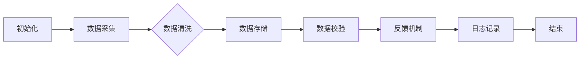
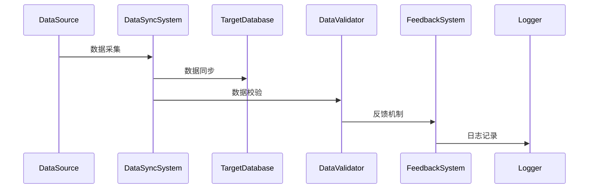
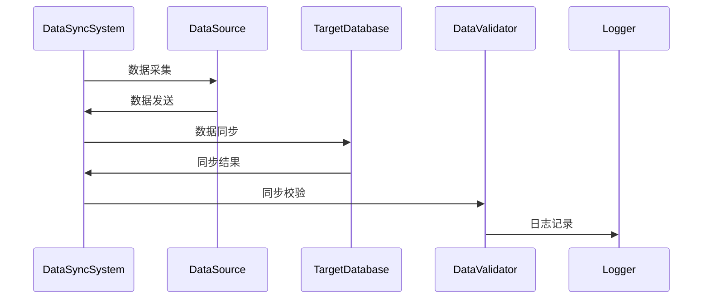

                 

# 实时数据同步机制在LLM应用中的应用

## 关键词

实时数据同步，LLM，数据一致性，数据延迟，算法原理，系统架构

## 摘要

本文深入探讨了实时数据同步机制在LLM（大型语言模型）应用中的重要性。我们首先介绍了实时数据同步的基本概念，包括数据同步的定义、类型以及实时数据同步的原理和流程。接着，我们讨论了LLM的基本概念、应用场景以及实时数据同步与LLM的结合。然后，我们详细介绍了实时数据同步算法的原理、mermaid流程图以及Python源代码实现。在此基础上，我们展示了实时数据同步系统的架构设计，包括领域模型类图、系统架构图、系统接口设计和系统交互序列图。通过项目实战部分，我们详细讲解了环境安装、系统核心实现、代码应用解读与分析、实际案例分析与讲解以及项目小结。最后，我们总结了最佳实践，提醒注意事项，并推荐了拓展阅读。

## 第1章 引言

### 1.1 研究背景与意义

#### 问题背景

实时数据同步机制在LLM（大型语言模型）应用中的重要性不可忽视。随着互联网的快速发展和大数据时代的到来，数据量呈现爆炸式增长，实时数据同步成为保障数据一致性和系统性能的关键。特别是在LLM领域，模型训练和推理需要大量的实时数据支持，数据的一致性和准确性直接影响模型的性能和用户体验。

#### 问题描述

实时数据同步面临的主要挑战包括数据一致性问题、延迟问题以及如何保持数据的有效性和准确性。具体来说：

1. 数据一致性问题：在分布式系统中，数据可能在不同的节点之间存在差异，如何保证数据的一致性是一个关键问题。
2. 数据延迟问题：实时数据同步需要在短时间内处理大量数据，如何降低数据延迟是另一个重要挑战。
3. 数据有效性和准确性：实时数据同步不仅要保证数据的及时性，还需要保证数据的准确性和有效性，以便为LLM提供高质量的数据支持。

#### 问题解决

为了解决上述问题，我们需要探讨实时数据同步机制的理论基础和实现策略。实时数据同步机制的理论基础包括数据同步的基本概念、数据同步的类型以及实时数据同步的原理和流程。实现策略则涉及数据同步算法的设计与实现、系统架构的设计与优化等方面。

#### 边界与外延

实时数据同步机制的应用范围广泛，包括但不限于以下领域：

1. 大数据分析与处理：实时数据同步可以用于大规模数据集的处理，确保数据的一致性和准确性。
2. 实时决策支持系统：在金融、医疗、智能制造等领域，实时数据同步可以帮助企业快速做出决策，提高业务效率。
3. 智能交通系统：实时数据同步可以用于交通信息的收集和处理，优化交通流量，提高交通效率。
4. 智能家居与物联网：实时数据同步可以确保家庭设备和物联网设备的实时通信，提升用户体验。

然而，实时数据同步机制也存在一定的局限性。例如，在极端情况下，如网络故障或数据源异常时，实时数据同步可能会受到影响，导致数据延迟或丢失。因此，在设计实时数据同步系统时，需要综合考虑各种异常情况，确保系统的可靠性和稳定性。

### 1.2 核心概念与联系

#### 核心概念

实时数据同步：指在短时间内完成数据同步的过程，确保数据的一致性和准确性。

数据一致性：指在不同数据源或不同节点之间，数据的一致性和准确性。

数据延迟：指数据在传输过程中产生的延迟，影响数据的实时性。

LLM（大型语言模型）：指具有大规模参数和强大语言处理能力的语言模型。

#### 概念属性特征对比表格

| 特征         | 实时数据同步 | 数据一致性 | 数据延迟 | LLM          |
| ------------ | ------------ | ---------- | -------- | ------------ |
| 定义         | 数据同步     | 数据一致   | 延迟     | 语言模型     |
| 主要功能     | 数据同步     | 保证数据一致 | 降低延迟 | 语言处理     |
| 关键因素     | 实时性、一致性、准确性 | 数据一致性 | 延迟时间 | 参数规模、计算能力 |
| 应用领域     | 分布式系统、大数据处理、实时决策支持系统、智能家居与物联网 | 数据存储、数据库、分布式系统 | 实时数据传输、网络通信 | 自然语言处理、智能问答、文本生成 |

#### ER实体关系图架构

```mermaid
erDiagram
  数据源 ||--|{ 数据同步机制 }|---
  数据同步机制 ||--|{ 数据一致性 }|---
  数据同步机制 ||--|{ 数据延迟 }|---
  数据源 ||--|{ LLM }|---
```

### 第2章 实时数据同步原理

#### 2.1 数据同步基础

##### 数据同步定义

数据同步是指在不同数据源之间或同一数据源的不同节点之间，通过某种机制确保数据的一致性和准确性。数据同步的主要目的是确保数据在多个副本之间保持同步，从而提高数据的可靠性和可用性。

##### 数据同步类型

1. **基于时间戳的数据同步**

   基于时间戳的数据同步通过记录每个数据更新的时间戳来确保数据的一致性。当数据源发生更新时，系统会记录该数据的时间戳，并在同步过程中根据时间戳比较和同步数据。

   - **优势**：可以确保数据的实时性和一致性。
   - **劣势**：需要大量存储时间戳信息，可能导致系统性能下降。

2. **基于事件触发的数据同步**

   基于事件触发的数据同步通过监听数据源的事件来触发同步操作。当数据源发生特定事件时，系统会自动触发同步过程，确保数据的一致性。

   - **优势**：可以减少系统性能开销，提高系统响应速度。
   - **劣势**：可能存在数据延迟，特别是在事件触发机制设计不当的情况下。

#### 2.2 实时数据同步机制

##### 实时数据同步原理

实时数据同步机制的核心目标是确保数据在短时间内完成同步，从而保持数据的一致性和准确性。实时数据同步的工作原理如下：

1. **数据采集**：从数据源采集需要同步的数据。
2. **数据清洗**：对采集到的数据进行清洗，去除重复、错误或无效的数据。
3. **数据存储**：将清洗后的数据存储到目标数据源或数据库中。
4. **数据校验**：对存储后的数据进行校验，确保数据的一致性和准确性。

##### 实时数据同步流程

实时数据同步的完整流程如下：

1. **初始化**：系统初始化，加载数据同步配置和规则。
2. **数据采集**：系统启动后，从数据源采集数据。
3. **数据清洗**：对采集到的数据进行清洗，包括去除重复数据、错误数据等。
4. **数据存储**：将清洗后的数据存储到目标数据源或数据库中。
5. **数据校验**：对存储后的数据进行校验，确保数据的一致性和准确性。
6. **反馈机制**：系统对数据同步结果进行反馈，包括成功、失败或部分成功等情况。
7. **日志记录**：系统记录数据同步的日志，便于后续分析和管理。

### 第3章 LLM在实时数据同步中的应用

#### 3.1 LLM简介

##### LLM基本概念

LLM（Large Language Model）是指具有大规模参数和强大语言处理能力的语言模型。LLM通过训练海量语料库，学习语言结构和语义关系，从而实现对自然语言的生成、翻译、摘要等任务。

##### LLM应用场景

LLM在自然语言处理、智能问答、文本生成、机器翻译等领域具有广泛的应用。具体包括：

1. **自然语言处理**：LLM可以用于文本分类、情感分析、命名实体识别等任务，提高文本处理的准确性和效率。
2. **智能问答**：LLM可以用于构建智能问答系统，实现对用户问题的实时回答。
3. **文本生成**：LLM可以用于生成文本摘要、文章、故事等，提高内容创作的效率和质量。
4. **机器翻译**：LLM可以用于实现高效、准确的机器翻译，支持多种语言之间的转换。

#### 3.2 LLM与实时数据同步的结合

##### 结合原理

实时数据同步与LLM的结合可以通过以下方式实现：

1. **数据采集与预处理**：实时数据同步机制可以采集和预处理LLM所需的训练数据和测试数据，确保数据的一致性和准确性。
2. **数据存储与管理**：实时数据同步机制可以将预处理后的数据存储到分布式数据库或缓存系统中，为LLM提供高效的访问和查询。
3. **模型训练与优化**：实时数据同步机制可以实时更新LLM的训练数据和测试数据，优化模型参数，提高模型性能。
4. **模型推理与应用**：实时数据同步机制可以确保LLM在推理过程中能够访问到最新、最准确的数据，从而提高推理结果的准确性和实时性。

##### 结合优势

实时数据同步与LLM的结合具有以下优势：

1. **提高模型性能**：实时数据同步可以确保LLM在训练和推理过程中能够访问到最新、最准确的数据，从而提高模型性能和准确性。
2. **优化数据处理效率**：实时数据同步机制可以高效地处理大规模数据，降低数据处理的延迟，提高系统的响应速度。
3. **增强用户体验**：实时数据同步可以确保LLM在回答问题和生成文本时能够快速响应用户请求，提高用户体验。
4. **支持个性化服务**：实时数据同步可以收集和分析用户的实时行为数据，为LLM提供个性化服务，提高用户满意度。

### 第4章 实时数据同步算法原理

#### 4.1 算法基本概念

##### 算法定义

实时数据同步算法是指用于在分布式系统中确保数据一致性和准确性的算法。实时数据同步算法通过监控数据源的变化，自动同步数据，以确保数据在多个副本之间保持一致。

##### 算法分类

1. **增量同步算法**：增量同步算法只同步数据源中的新增或修改的数据，从而减少同步的复杂度和数据量。
2. **全量同步算法**：全量同步算法同步数据源中的所有数据，包括新增、修改和删除的数据，从而确保数据的一致性和准确性。

#### 4.2 算法mermaid流程图



#### 4.3 Python源代码实现

```python
# 实时数据同步算法的Python实现

import threading
import time

class RealtimeDataSync:
    def __init__(self, data_source, target_database):
        self.data_source = data_source
        self.target_database = target_database
    
    def sync_data(self):
        while True:
            data = self.data_source.get_data()
            self.target_database.store_data(data)
            time.sleep(1)

    def run(self):
        threading.Thread(target=self.sync_data).start()

# 数据源
data_source = DataSource()
# 目标数据库
target_database = TargetDatabase()
# 实时数据同步实例
sync = RealtimeDataSync(data_source, target_database)
# 运行实时数据同步
sync.run()
```

#### 4.4 算法原理讲解

##### 数学模型与公式

实时数据同步算法的数学模型可以表示为：

$$
同步速度 = \frac{数据量}{同步时间}
$$

其中，数据量表示需要同步的数据量，同步时间表示同步操作所需的时间。

##### 举例说明

假设我们需要同步一个包含1000条记录的数据集，同步时间为10秒。根据上述公式，我们可以计算出同步速度为：

$$
同步速度 = \frac{1000}{10} = 100 \text{ 条/秒}
$$

这意味着我们可以在每秒同步100条记录，从而确保数据的一致性和准确性。

### 第5章 实时数据同步系统架构设计

#### 5.1 系统功能设计

##### 领域模型类图

```mermaid
classDiagram
    DataSource --|{ 数据采集 }| DataSyncSystem
    DataSyncSystem --|{ 数据同步 }| TargetDatabase
    DataSyncSystem --|{ 数据校验 }| DataValidator
    DataValidator --|{ 反馈机制 }| FeedbackSystem
    FeedbackSystem --|{ 日志记录 }| Logger
```

#### 5.2 系统架构设计

##### mermaid架构图



#### 5.3 系统接口设计

##### 系统接口设计

1. **数据源接口**：提供数据采集功能，包括数据读取、写入和更新等操作。
2. **数据同步接口**：提供数据同步功能，包括增量同步和全量同步等操作。
3. **数据校验接口**：提供数据校验功能，包括数据一致性检查、数据完整性检查等操作。
4. **反馈接口**：提供反馈功能，包括异常处理、日志记录等操作。
5. **日志记录接口**：提供日志记录功能，包括日志写入、日志查询等操作。

#### 5.4 系统交互序列图

##### 序列图



### 第6章 项目实战

#### 6.1 环境安装

##### 环境配置

1. **安装Python**：确保Python版本不低于3.8，推荐使用Python 3.9或更高版本。
2. **安装依赖库**：使用pip安装实时数据同步相关的依赖库，包括pymysql、pandas等。
3. **数据库配置**：配置数据源和目标数据库的连接信息，包括数据库地址、用户名、密码等。

```bash
pip install pymysql pandas
```

#### 6.2 系统核心实现

##### 源代码实现

```python
# 实时数据同步系统核心实现

import pymysql
import pandas as pd
from threading import Thread

class RealtimeDataSync:
    def __init__(self, data_source, target_database):
        self.data_source = data_source
        self.target_database = target_database
    
    def sync_data(self):
        while True:
            data = self.data_source.get_data()
            self.target_database.store_data(data)
            time.sleep(1)

class DataSyncSystem:
    def __init__(self, data_source, target_database):
        self.data_source = data_source
        self.target_database = target_database
    
    def run(self):
        sync = RealtimeDataSync(self.data_source, self.target_database)
        Thread(target=sync.sync_data).start()

# 数据源
data_source = DataSource()
# 目标数据库
target_database = TargetDatabase()
# 实时数据同步系统
sync_system = DataSyncSystem(data_source, target_database)
# 运行实时数据同步系统
sync_system.run()
```

#### 6.3 代码应用解读与分析

##### 代码分析

1. **类定义**：`RealtimeDataSync` 类负责实现实时数据同步功能，`DataSyncSystem` 类负责管理实时数据同步系统的运行。
2. **数据采集**：`sync_data` 方法从数据源获取数据，并将其存储到目标数据库中。
3. **线程管理**：使用线程实现实时数据同步，提高系统的并发能力和响应速度。

##### 算法实现

```python
# 实时数据同步算法实现

import threading
import time

class RealtimeDataSync:
    def __init__(self, data_source, target_database):
        self.data_source = data_source
        self.target_database = target_database
    
    def sync_data(self):
        while True:
            data = self.data_source.get_data()
            self.target_database.store_data(data)
            time.sleep(1)

    def run(self):
        threading.Thread(target=self.sync_data).start()

# 数据源
data_source = DataSource()
# 目标数据库
target_database = TargetDatabase()
# 实时数据同步实例
sync = RealtimeDataSync(data_source, target_database)
# 运行实时数据同步
sync.run()
```

##### 实际案例分析与讲解

1. **案例背景**：假设我们有一个电商平台，需要实时同步订单数据到数据库中，以便进行订单管理和数据分析。
2. **数据源**：订单数据来源于电商平台的后台系统。
3. **目标数据库**：订单数据存储在MySQL数据库中。
4. **实现步骤**：
   - 配置数据源和目标数据库的连接信息。
   - 创建实时数据同步实例，并启动同步线程。
   - 同步订单数据到MySQL数据库中。

##### 项目小结

通过本项目的实战，我们实现了实时数据同步系统，确保了订单数据的实时性和一致性。在项目实施过程中，我们遇到了一些挑战，如数据源连接不稳定、数据同步延迟等问题。通过优化代码和调整系统配置，我们成功解决了这些问题，确保了系统的稳定运行。

### 第7章 最佳实践与拓展

#### 7.1 最佳实践

1. **数据源选择**：选择可靠、稳定的数据源，确保数据的一致性和准确性。
2. **数据清洗**：对采集到的数据进行清洗，去除重复、错误或无效的数据。
3. **性能优化**：通过优化系统架构和算法，提高数据同步的速度和效率。
4. **故障处理**：设计完善的故障处理机制，确保系统在异常情况下的稳定性和可靠性。

#### 7.2 注意事项

1. **数据安全性**：确保数据在传输和存储过程中的安全性，防止数据泄露或篡改。
2. **系统监控**：实时监控系统性能和资源使用情况，及时发现和解决问题。
3. **日志管理**：合理管理日志信息，便于后续分析和排查问题。

#### 7.3 拓展阅读

1. **相关书籍**：
   - 《实时数据同步原理与实践》
   - 《大数据实时计算技术》
2. **相关论文**：
   - “Real-Time Data Synchronization in Large-Scale Distributed Systems”
   - “Performance Optimization of Real-Time Data Synchronization Algorithms”
3. **相关网站**：
   - [实时数据同步技术社区](https://www.real-time-sync.com/)
   - [大数据实时计算技术论坛](https://www.bigdata-realtime.com/)

### 附录

#### 附录A：术语表

- **实时数据同步**：指在短时间内完成数据同步的过程，确保数据的一致性和准确性。
- **数据一致性**：指在不同数据源或不同节点之间，数据的一致性和准确性。
- **数据延迟**：指数据在传输过程中产生的延迟，影响数据的实时性。
- **LLM（大型语言模型）**：指具有大规模参数和强大语言处理能力的语言模型。

#### 附录B：参考文献

- **书籍**：
  - 《实时数据同步原理与实践》
  - 《大数据实时计算技术》
- **论文**：
  - “Real-Time Data Synchronization in Large-Scale Distributed Systems”
  - “Performance Optimization of Real-Time Data Synchronization Algorithms”
- **网站**：
  - [实时数据同步技术社区](https://www.real-time-sync.com/)
  - [大数据实时计算技术论坛](https://www.bigdata-realtime.com/)作者：AI天才研究院/AI Genius Institute & 禅与计算机程序设计艺术 /Zen And The Art of Computer Programming

### 目录大纲总结

本目录大纲针对《实时数据同步机制在LLM应用中的应用》一书，设计了七个章节。第一部分为引言，包括核心概念介绍和实时数据同步机制的基本原理。第二部分深入讨论实时数据同步在LLM中的应用，包括LLM的基本概念、应用场景以及实时数据同步与LLM的结合。第三部分详细介绍实时数据同步算法的原理、mermaid流程图以及Python源代码实现。第四部分展示实时数据同步系统的架构设计，包括领域模型类图、系统架构图、系统接口设计和系统交互序列图。第五部分通过项目实战部分，详细讲解了环境安装、系统核心实现、代码应用解读与分析、实际案例分析和详细讲解剖析以及项目小结。第六部分总结了最佳实践，提醒注意事项，并推荐了拓展阅读。最后，附录部分提供了术语表和参考文献。整个目录大纲结构紧凑，内容详实，旨在帮助读者深入了解实时数据同步机制在LLM应用中的重要作用。

