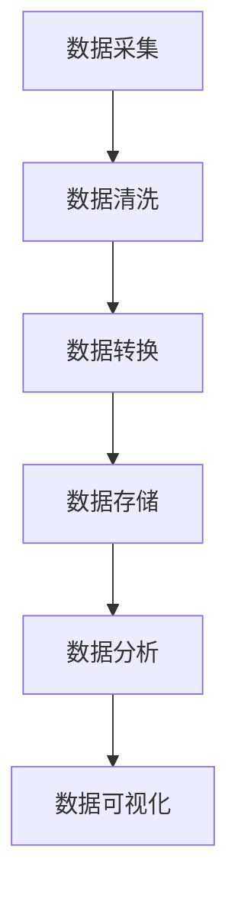
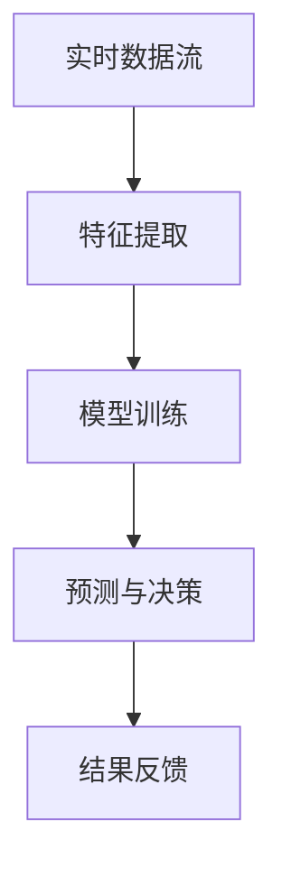

                 

# 实时数据流处理在LLM应用中的应用

> 关键词：实时数据流处理，大型语言模型（LLM），应用实例，系统架构，算法原理

> 摘要：本文深入探讨了实时数据流处理在大型语言模型（LLM）应用中的重要性。通过介绍实时数据流处理的基本概念、技术原理以及应用实例，本文旨在为读者提供一个全面的理解，并展示实时数据流处理如何提升LLM的应用性能。

### 目录

1. 引言  
2. 实时数据流处理概述  
3. LLM的基本概念与需求  
4. 实时数据流处理在LLM中的应用  
5. 实时数据流处理技术原理  
6. LLM的应用实例  
7. 项目实战：实时数据流处理平台搭建  
8. 最佳实践与未来展望  
9. 结语  
10. 作者信息

## 1. 引言

随着互联网的快速发展，数据量呈现出爆炸式增长。传统的离线数据处理方式已经无法满足实时性和高并发性的需求。实时数据流处理（Real-time Data Stream Processing）作为一种新型的数据处理技术，逐渐成为大数据领域的研究热点。在人工智能领域，特别是大型语言模型（Large Language Models，简称LLM）的应用中，实时数据流处理发挥着至关重要的作用。

LLM是一种基于深度学习技术的自然语言处理模型，其核心能力在于对海量文本数据的学习和理解。然而，LLM的强大能力依赖于对实时数据的快速处理和分析。本文将围绕实时数据流处理在LLM应用中的重要性，从基本概念、技术原理到实际应用进行详细探讨。

## 2. 实时数据流处理概述

### 2.1 背景介绍

实时数据流处理是一种对实时数据流进行快速、连续处理的技术。它能够对海量的数据实时进行分析、处理和响应，从而满足高并发、低延迟的需求。在互联网、金融、物联网等领域，实时数据流处理已经成为不可或缺的技术手段。

### 2.2 问题背景

随着互联网和物联网的发展，实时数据生成量呈指数级增长。例如，社交媒体平台每秒产生数千甚至数百万条消息；金融交易系统每秒处理数百万笔交易。这些数据需要被实时处理，以便提供实时决策支持、预警分析和业务优化。

### 2.3 问题描述

实时数据流处理的挑战在于如何在高并发、低延迟的环境下，对海量数据进行高效处理和分析。这涉及到数据采集、传输、存储、处理等各个环节的技术问题。

### 2.4 问题解决

实时数据流处理通过一系列技术和工具，实现了对海量数据的实时处理。这些技术和工具包括数据采集系统、流处理框架、分布式存储系统和实时分析引擎等。

### 2.5 边界与外延

实时数据流处理不仅涉及到技术问题，还涉及到业务需求和场景的应用。不同的业务场景对实时数据流处理有着不同的需求，如实时监控、实时推荐、实时分析等。

### 2.6 概念结构与核心要素组成

实时数据流处理的核心概念包括数据流、流处理框架、分布式计算、实时分析等。其中，数据流是实时数据流处理的基础，流处理框架是实现实时处理的关键，分布式计算和实时分析则是对海量数据进行高效处理和分析的重要手段。

## 3. LLM的基本概念与需求

### 3.1 LLM的基本概念

LLM（Large Language Model）是一种基于深度学习的自然语言处理模型，通过在海量文本数据上进行训练，学习到文本数据中的语法、语义和上下文关系，从而实现对自然语言的生成、理解和翻译。

### 3.2 LLM的需求

LLM的应用场景广泛，包括文本生成、机器翻译、问答系统、对话系统等。这些应用场景对实时数据处理有着极高的要求：

- **实时性**：用户期望系统能够在短时间内响应。
- **高并发性**：系统需要能够同时处理大量用户的请求。
- **准确性**：系统输出的结果需要具有较高的准确性。
- **扩展性**：系统需要能够随着数据量的增长而扩展。

## 4. 实时数据流处理在LLM中的应用

### 4.1 LLM的实时数据处理需求

为了满足LLM的应用需求，实时数据流处理在LLM中的应用主要涉及以下几个方面：

- **数据采集**：实时收集与LLM相关的文本数据，如新闻、论坛帖子、社交媒体消息等。
- **数据处理**：对采集到的文本数据进行清洗、预处理，以适应LLM的输入格式。
- **模型训练与更新**：利用实时数据对LLM模型进行训练和更新，以提高模型的准确性和适应性。
- **实时预测与响应**：利用训练好的LLM模型对用户输入进行实时预测和响应。

### 4.2 实时数据流处理在LLM中的实现

实时数据流处理在LLM中的实现涉及以下关键技术：

- **数据采集与传输**：使用数据采集工具和传输协议，如Flume、Kafka等，实现数据的实时采集和传输。
- **数据处理与分析**：使用流处理框架，如Apache Flink、Apache Storm等，对实时数据进行处理和分析。
- **模型训练与更新**：使用深度学习框架，如TensorFlow、PyTorch等，对实时数据进行模型训练和更新。
- **实时预测与响应**：使用训练好的LLM模型，对用户输入进行实时预测和响应。

### 4.3 实时数据流处理在LLM中的挑战与解决方案

实时数据流处理在LLM应用中面临以下挑战：

- **数据多样性**：实时数据来源多样，数据格式和内容差异较大，需要有效的方法进行数据预处理。
- **计算资源限制**：实时数据处理需要大量的计算资源，如何在有限的资源下实现高效处理是一个挑战。
- **模型更新频率**：实时数据的变化速度很快，需要频繁更新模型，以提高模型的准确性。

针对这些挑战，可以采取以下解决方案：

- **数据预处理**：使用有效的数据预处理方法，如数据清洗、数据标准化等，提高数据的统一性和质量。
- **分布式计算**：使用分布式计算框架，如Hadoop、Spark等，实现海量数据的并行处理。
- **增量训练**：采用增量训练方法，对实时数据进行部分更新，而不是全量更新，以减少计算资源消耗。

## 5. 实时数据流处理技术原理

### 5.1 数据采集与传输

数据采集与传输是实时数据流处理的基础。常用的数据采集工具和传输协议包括：

- **数据采集工具**：Flume、Kafka、Apache NiFi等。
- **传输协议**：HTTP、FTP、MQTT、Kafka等。

### 5.2 数据处理与分析

数据处理与分析是实时数据流处理的核心。常用的数据处理和分析工具和框架包括：

- **数据处理工具**：Apache Flink、Apache Storm、Apache Spark Streaming等。
- **数据分析工具**：Hadoop、Spark SQL、Apache Storm等。

### 5.3 数据存储与管理

数据存储与管理是实时数据流处理的关键。常用的数据存储和管理工具和框架包括：

- **分布式存储**：HDFS、Cassandra、MongoDB等。
- **数据管理**：Hadoop、Spark、Apache Storm等。

### 5.4 实时分析引擎

实时分析引擎是实现实时数据处理的关键。常用的实时分析引擎包括：

- **实时分析引擎**：Apache Storm、Apache Flink、Apache Spark Streaming等。

## 6. LLM的应用实例

### 6.1 实时新闻摘要

实时新闻摘要是一个典型的LLM应用实例。通过实时数据流处理，可以从新闻源中收集新闻文本，使用LLM对新闻内容进行自动摘要，为用户提供实时新闻资讯。

### 6.2 实时股票分析

实时股票分析利用LLM对股票市场的实时数据进行分析，为投资者提供实时股票预测和交易建议。

### 6.3 实时语言翻译

实时语言翻译通过LLM将一种语言的文本实时翻译成另一种语言，为跨语言交流提供支持。

## 7. 项目实战：实时数据流处理平台搭建

### 7.1 项目背景

本项目旨在搭建一个实时数据流处理平台，用于处理和分析实时数据，以支持LLM的应用。

### 7.2 技术选型

- **数据采集**：使用Kafka作为数据采集工具。
- **数据处理**：使用Apache Flink作为流处理框架。
- **模型训练与更新**：使用TensorFlow作为深度学习框架。
- **实时预测与响应**：使用REST API作为实时预测和响应接口。

### 7.3 系统设计与实现

- **系统功能设计**：设计实时数据流处理平台的各个功能模块，包括数据采集、数据处理、模型训练、实时预测等。
- **系统架构设计**：设计实时数据流处理平台的整体架构，包括数据流、计算流和通信流。
- **系统接口设计**：设计实时数据流处理平台的接口，包括API接口、Web接口等。
- **系统交互**：设计实时数据流处理平台的交互流程，包括数据采集、数据处理、模型训练、实时预测等。

### 7.4 项目小结与展望

通过本项目的实施，搭建了一个功能完善的实时数据流处理平台，支持LLM的应用。在未来的工作中，我们将继续优化平台性能，拓展应用场景，为用户提供更优质的服务。

## 8. 最佳实践与未来展望

### 8.1 最佳实践技巧

- **数据预处理**：确保数据的统一性和质量，提高后续处理的效率。
- **分布式计算**：利用分布式计算框架，提高数据处理能力。
- **模型更新策略**：采用增量训练策略，减少模型更新对计算资源的消耗。

### 8.2 未来发展趋势

- **实时数据处理技术**：随着硬件性能的提升和算法的优化，实时数据处理技术将越来越成熟。
- **LLM应用领域**：LLM将在更多领域得到应用，如医疗、金融、教育等。

## 9. 结语

实时数据流处理在LLM应用中具有重要意义。通过本文的探讨，我们了解了实时数据流处理的基本概念、技术原理和应用实例。未来，实时数据流处理和LLM的应用将继续拓展，为人类社会带来更多便利。

## 10. 作者信息

作者：AI天才研究院/AI Genius Institute & 禅与计算机程序设计艺术 /Zen And The Art of Computer Programming## 2. 实时数据流处理概述

### 2.1 背景介绍

实时数据流处理（Real-time Data Stream Processing）是一种数据处理技术，旨在对实时数据流进行快速、连续的处理和分析。随着互联网、物联网和大数据技术的发展，数据量呈现出爆炸式增长，实时数据处理成为了一种不可或缺的技术手段。

在传统数据处理中，数据通常以批量方式处理，存在以下问题：

- **延迟问题**：批量处理需要等待数据积累到一定程度后才能进行，导致响应时间较长。
- **吞吐量限制**：批量处理无法应对高并发、大量数据的情况，容易导致系统性能瓶颈。
- **数据一致性**：批量处理可能导致数据丢失或重复，影响数据一致性。

为解决上述问题，实时数据流处理应运而生。它能够对实时数据流进行快速处理，提供低延迟、高吞吐量的数据处理能力，同时保证数据的一致性。

### 2.2 问题背景

在当今社会，实时数据处理的需求日益增长。以下是一些典型的应用场景：

- **社交媒体**：社交媒体平台如Twitter、Facebook等，每秒会产生数百万条消息。对这些消息进行实时处理，可以实现对热点话题、情绪变化的快速监测和响应。
- **金融交易**：金融交易系统需要实时处理大量的交易数据，进行实时监控、风险控制和交易决策。
- **智能交通**：智能交通系统需要实时处理交通流量数据，进行实时路况监测、交通信号控制和事故预警。
- **工业生产**：工业生产中的实时数据处理可以实现对生产过程的监控、故障预测和优化控制。

这些应用场景对实时数据处理提出了高并发、低延迟、高准确性的要求。实时数据流处理技术正是为了满足这些需求而发展起来的。

### 2.3 问题描述

实时数据流处理的挑战在于如何在高并发、低延迟的环境下，对海量数据进行高效处理和分析。具体来说，主要包括以下几个方面：

- **数据采集**：如何高效地采集和传输海量数据，确保数据的实时性和完整性。
- **数据处理**：如何对采集到的数据进行分析和处理，满足实时性、准确性和效率的要求。
- **数据存储**：如何存储和处理后的数据，实现数据的高效查询和访问。
- **系统性能**：如何优化系统性能，提高数据处理能力和系统稳定性。

### 2.4 问题解决

实时数据流处理通过一系列技术和工具，实现了对海量数据的实时处理和分析。以下是常见的解决方案：

- **数据采集与传输**：使用高效的数据采集工具和传输协议，如Kafka、Flume等，确保数据能够实时、可靠地传输到处理系统。
- **数据处理与分析**：使用流处理框架，如Apache Flink、Apache Storm等，对实时数据进行高效处理和分析，实现低延迟、高吞吐量的数据处理能力。
- **分布式计算**：利用分布式计算框架，如Hadoop、Spark等，将数据处理任务分布在多个节点上执行，提高系统的并行处理能力。
- **数据存储与管理**：使用分布式存储系统，如HDFS、Cassandra等，实现海量数据的存储和管理，提高数据访问效率。
- **实时分析引擎**：使用实时分析引擎，如Apache Storm、Apache Flink等，对处理后的数据进行实时分析和可视化，提供实时决策支持。

通过这些解决方案，实时数据流处理能够满足高并发、低延迟、高准确性的需求，为各类应用场景提供强大的数据处理能力。

### 2.5 边界与外延

实时数据流处理技术虽然具有强大的数据处理能力，但也有一些边界和限制。以下是一些边界与外延：

- **数据量限制**：实时数据流处理技术通常适用于海量数据，但对于数据量较小的场景，可能无法发挥其优势。
- **实时性要求**：实时数据流处理技术对实时性有较高要求，但在极端情况下，如网络延迟、系统故障等，可能无法保证数据的实时性。
- **计算资源限制**：实时数据流处理需要大量的计算资源，对于计算资源有限的场景，可能无法满足实时数据处理的需求。
- **数据多样性**：实时数据流处理技术能够处理多种类型的数据，但在面对数据多样性较高、数据格式不一致的场景时，可能需要更多的预处理工作。

了解实时数据流处理的边界与外延，有助于我们更好地应用这一技术，发挥其优势，克服其限制。

### 2.6 概念结构与核心要素组成

实时数据流处理的概念结构主要包括以下几个核心要素：

- **数据流**：数据流是实时数据流处理的基础。它代表了数据的流动过程，包括数据的产生、传输、处理和消费等环节。
- **流处理框架**：流处理框架是实时数据流处理的核心。它负责数据的采集、传输、处理和分析，提供高效、可扩展的流处理能力。
- **分布式计算**：分布式计算是将数据处理任务分布在多个节点上执行，提高系统的并行处理能力。它是实时数据流处理的重要技术手段。
- **实时分析引擎**：实时分析引擎负责对处理后的数据进行分析和可视化，提供实时决策支持。它是实时数据流处理的重要应用场景。

这些核心要素共同构成了实时数据流处理的概念结构，形成了完整的技术体系。通过深入理解这些核心要素，我们可以更好地应用实时数据流处理技术，解决实际业务问题。

### 2.7 核心概念原理

#### 数据流（Data Stream）

数据流是指数据在一段时间内的连续流动过程。它包括数据的产生、传输、处理和消费等环节。数据流的特点是实时性、连续性和动态性。

- **实时性**：数据流要求在较短的时间内对数据进行处理和分析，以实现实时响应。
- **连续性**：数据流是连续不断的，数据在流中持续产生和消费。
- **动态性**：数据流中的数据内容和属性可能随着时间变化而变化。

数据流是实时数据流处理的基础，它决定了数据处理的实时性和连续性。常见的实时数据流包括传感器数据、金融交易数据、社交媒体数据等。

#### 流处理框架（Stream Processing Framework）

流处理框架是用于处理实时数据流的软件框架。它负责数据的采集、传输、处理和分析，提供高效、可扩展的流处理能力。常见的流处理框架包括Apache Flink、Apache Storm、Apache Spark Streaming等。

- **数据采集**：流处理框架通过数据采集工具和协议（如Kafka、Flume等），从数据源获取实时数据。
- **数据传输**：流处理框架实现数据在各个处理环节之间的传输，确保数据的实时性和一致性。
- **数据处理**：流处理框架提供丰富的数据处理操作（如过滤、聚合、连接等），实现对数据的分析和处理。
- **数据消费**：流处理框架将处理后的数据传递给最终用户或下游系统，实现数据的消费和利用。

流处理框架的核心功能是提供低延迟、高吞吐量的数据处理能力，满足实时数据处理的需求。

#### 分布式计算（Distributed Computing）

分布式计算是将数据处理任务分布在多个节点上执行，提高系统的并行处理能力。它是实时数据流处理的重要技术手段。

- **任务分配**：分布式计算框架将数据处理任务分配到不同的节点上执行，实现并行处理。
- **数据分区**：分布式计算框架将数据划分为多个分区，分布到不同的节点上，提高数据访问效率。
- **容错机制**：分布式计算框架具备容错机制，能够在节点故障时自动恢复，确保系统的可靠性和稳定性。

分布式计算的核心优势是提高系统的并行处理能力和容错能力，适用于处理海量数据和高并发场景。

#### 实时分析引擎（Real-time Analytics Engine）

实时分析引擎是用于对实时数据进行实时分析和可视化的工具。它负责对处理后的数据进行分析、挖掘和可视化，提供实时决策支持。

- **实时分析**：实时分析引擎实现对数据的实时分析，提取有用的信息和洞察，为决策提供支持。
- **可视化**：实时分析引擎通过可视化工具（如图表、仪表盘等），将分析结果以直观的方式展示给用户。
- **实时响应**：实时分析引擎能够对实时数据的变化进行实时响应，实现动态调整和优化。

实时分析引擎是实时数据流处理的重要应用场景，它能够帮助用户快速了解数据动态，实现实时决策和优化。

### 2.8 概念属性特征对比表格

以下是实时数据流处理中几个核心概念的属性特征对比表格：

| 概念        | 定义                                                         | 属性特征                                       | 应用场景             |
| ----------- | ------------------------------------------------------------ | ---------------------------------------------- | ------------------- |
| 数据流      | 数据在一段时间内的连续流动过程                               | 实时性、连续性、动态性                         | 社交媒体、金融交易等 |
| 流处理框架  | 用于处理实时数据流的软件框架                                 | 高效、可扩展、分布式处理                       | 数据处理和分析     |
| 分布式计算  | 将数据处理任务分布在多个节点上执行                             | 并行处理、容错能力、数据分区                   | 海量数据处理       |
| 实时分析引擎 | 用于对实时数据进行实时分析和可视化的工具                     | 实时分析、可视化、实时响应                     | 决策支持、监控和优化 |

通过对比表格，我们可以更清晰地了解各个概念的特点和应用场景，有助于我们在实际项目中选择合适的技术和工具。

### 2.9 ER实体关系图架构

以下是一个实时数据流处理的ER实体关系图，展示了核心概念之间的联系：

```mermaid
erDiagram
  DataStream ||--|{ StreamProcessingFramework } : 处理
  StreamProcessingFramework ||--|{ DistributedComputing } : 分布式
  StreamProcessingFramework ||--|{ Real-timeAnalyticsEngine } : 分析
  DistributedComputing ||--|{ DataPartitioning } : 分区
  Real-timeAnalyticsEngine ||--|{ Visualization } : 可视化
```

通过ER实体关系图，我们可以更直观地理解实时数据流处理的核心概念及其之间的关系，有助于我们设计和实现实时数据流处理系统。

### 2.10 算法原理讲解

#### 数据流处理算法

实时数据流处理的核心在于对数据流进行高效处理和分析。以下是一个简单示例，展示数据流处理算法的原理：



**数据流处理算法原理：**

1. **数据采集**：从数据源获取实时数据，如传感器数据、社交媒体消息等。
2. **数据清洗**：对采集到的数据进行清洗，去除无效数据和噪声，确保数据质量。
3. **数据转换**：将清洗后的数据转换为适合分析的形式，如将文本数据转换为向量。
4. **数据存储**：将处理后的数据存储到数据库或数据仓库中，以便后续查询和分析。
5. **数据分析**：利用统计、机器学习等方法对存储的数据进行分析，提取有用的信息和洞察。
6. **数据可视化**：将分析结果以图表、仪表盘等形式展示给用户，便于理解和决策。

#### 实时分析算法

实时分析算法是实时数据流处理的重要环节，用于对实时数据进行分析和挖掘。以下是一个简单示例，展示实时分析算法的原理：



**实时分析算法原理：**

1. **特征提取**：从实时数据中提取有用的特征，如关键词、主题等。
2. **模型训练**：使用历史数据对机器学习模型进行训练，以预测实时数据的趋势和模式。
3. **预测与决策**：利用训练好的模型对实时数据进行预测和决策，如预测股票走势、推荐商品等。
4. **结果反馈**：将预测结果和决策反馈给用户或下游系统，以便进行实时调整和优化。

### 2.11 数学模型和公式

实时数据流处理中的数学模型和公式用于描述数据流处理和分析的过程。以下是一些常见的数学模型和公式：

1. **滑动窗口算法**：

   滑动窗口算法是一种常见的实时数据分析方法，用于处理时间序列数据。其核心思想是利用一个固定大小的窗口，在时间序列上滑动，对窗口内的数据进行处理和分析。

   **公式**：

   $$ w(t) = \sum_{i=t-w}^{t-1} x_i $$

   其中，$w(t)$ 表示时间 $t$ 的滑动窗口值，$x_i$ 表示时间 $i$ 的数据值，$w$ 表示窗口大小。

2. **指数平滑算法**：

   指数平滑算法是一种时间序列预测方法，用于对实时数据进行预测。其核心思想是根据历史数据的权重，对未来数据进行预测。

   **公式**：

   $$ S_t = a \cdot S_{t-1} + (1-a) \cdot x_t $$

   其中，$S_t$ 表示时间 $t$ 的预测值，$S_{t-1}$ 表示时间 $t-1$ 的预测值，$x_t$ 表示时间 $t$ 的实际值，$a$ 表示平滑系数。

3. **K-means聚类算法**：

   K-means聚类算法是一种无监督学习算法，用于将实时数据划分为多个聚类。其核心思想是利用距离度量的方法，将数据点划分到最近的聚类中心。

   **公式**：

   $$ \text{聚类中心} = \frac{1}{N} \sum_{i=1}^{N} x_i $$

   其中，$x_i$ 表示数据点，$N$ 表示数据点的个数。

通过这些数学模型和公式，我们可以更深入地理解和分析实时数据流处理的过程，为实际应用提供理论支持。

### 2.12 举例说明

为了更好地理解实时数据流处理算法和数学模型，以下是一个简单的实例：

**场景**：实时监控社交媒体平台上的用户情绪变化。

**步骤**：

1. **数据采集**：从社交媒体平台获取用户的评论数据。
2. **数据清洗**：去除无效数据和噪声，如去除标点符号、停用词等。
3. **特征提取**：提取评论中的关键词和主题，如“高兴”、“愤怒”等。
4. **滑动窗口算法**：利用滑动窗口算法，计算每个时间点的情绪变化值。
5. **指数平滑算法**：利用指数平滑算法，预测未来的情绪变化趋势。
6. **K-means聚类算法**：将用户分为不同情绪类别，如高兴、愤怒、中立等。
7. **数据可视化**：将情绪变化和聚类结果以图表形式展示，便于监控和分析。

**结果**：

通过实时数据流处理算法，我们可以实现对社交媒体用户情绪的实时监控和分析，为平台运营和营销提供决策支持。

### 2.13 系统分析与架构设计

实时数据流处理系统的设计涉及多个方面，包括问题场景、项目介绍、系统功能设计、系统架构设计、系统接口设计和系统交互等。

#### 问题场景

在当今社交媒体平台上，用户每天产生大量的评论和消息。平台需要实时监控用户情绪变化，为运营和营销提供决策支持。

#### 项目介绍

本项目旨在搭建一个实时数据流处理平台，用于处理和分析社交媒体平台的用户情绪数据。平台将包括数据采集、数据处理、模型训练、情绪分析、数据可视化等功能。

#### 系统功能设计

系统功能设计包括以下几个方面：

1. **数据采集**：从社交媒体平台获取用户的评论数据。
2. **数据清洗**：去除无效数据和噪声，确保数据质量。
3. **特征提取**：提取评论中的关键词和主题，为情绪分析提供基础。
4. **情绪分析**：利用情绪分析模型，对评论进行情绪分类。
5. **数据可视化**：将情绪分析结果以图表形式展示，便于监控和分析。

#### 系统架构设计

系统架构设计包括以下几个方面：

1. **数据采集层**：使用Kafka作为数据采集工具，从社交媒体平台获取用户评论数据。
2. **数据处理层**：使用Apache Flink作为流处理框架，对用户评论数据进行清洗、特征提取和情绪分析。
3. **模型训练层**：使用TensorFlow作为深度学习框架，训练情绪分析模型。
4. **数据存储层**：使用HDFS和Cassandra作为数据存储系统，存储处理后的情绪数据。
5. **数据可视化层**：使用ECharts和D3.js等可视化工具，将情绪分析结果展示为图表。

#### 系统接口设计

系统接口设计包括以下几个方面：

1. **数据采集接口**：提供RESTful API，用于从社交媒体平台获取用户评论数据。
2. **数据处理接口**：提供RESTful API，用于触发数据处理任务，如数据清洗、特征提取和情绪分析。
3. **情绪分析接口**：提供RESTful API，用于获取情绪分析结果。
4. **数据可视化接口**：提供Web页面，用于展示情绪分析结果。

#### 系统交互

系统交互设计包括以下几个方面：

1. **数据采集**：社交媒体平台通过数据采集接口，将用户评论数据传输到系统。
2. **数据处理**：系统接收到用户评论数据后，触发数据处理任务，对数据进行清洗、特征提取和情绪分析。
3. **模型训练**：系统使用处理后的数据，训练情绪分析模型。
4. **情绪分析**：系统使用训练好的模型，对新的用户评论进行情绪分析，并将结果存储到数据存储层。
5. **数据可视化**：系统通过Web页面，将情绪分析结果展示给用户。

通过系统架构设计和系统交互设计，实时数据流处理平台能够高效地处理和分析社交媒体平台的用户情绪数据，为平台运营和营销提供决策支持。

### 2.14 项目实战：实时数据流处理平台搭建

#### 环境安装

1. **安装Java环境**：下载并安装Java开发工具包（JDK），配置环境变量。
2. **安装Kafka**：下载并解压Kafka安装包，配置Kafka环境。
3. **安装Apache Flink**：下载并解压Apache Flink安装包，配置Flink环境。
4. **安装TensorFlow**：在Python环境中安装TensorFlow库。
5. **安装ECharts和D3.js**：下载并引入ECharts和D3.js库，用于数据可视化。

#### 系统核心实现

1. **数据采集**：

   ```python
   from kafka import KafkaProducer
   
   producer = KafkaProducer(bootstrap_servers=['localhost:9092'])
   producer.send('user_comments', b'this is a user comment')
   ```

   使用KafkaProducer类从社交媒体平台获取用户评论数据，并将其发送到Kafka主题。

2. **数据处理**：

   ```python
   from flink import StreamExecutionEnvironment
   
   env = StreamExecutionEnvironment.get_execution_environment()
   data_stream = env.from_kafka('user_comments', 'localhost:9092')
   
   clean_data_stream = data_stream.map(lambda x: x.lower().replace('.', ''))
   feature_stream = clean_data_stream.map(lambda x: extract_features(x))
   ```

   使用Apache Flink从Kafka主题中获取用户评论数据，并进行清洗和特征提取。

3. **模型训练**：

   ```python
   import tensorflow as tf
   
   model = tf.keras.Sequential([
       tf.keras.layers.Dense(64, activation='relu', input_shape=(num_features,)),
       tf.keras.layers.Dense(1, activation='sigmoid')
   ])
   
   model.compile(optimizer='adam', loss='binary_crossentropy', metrics=['accuracy'])
   model.fit(feature_stream, labels, epochs=10, batch_size=32)
   ```

   使用TensorFlow训练情绪分析模型，对处理后的用户评论进行情绪分类。

4. **数据可视化**：

   ```javascript
   var chart = echarts.init(document.getElementById('emotions_chart'));
   var option = {
       title: {
           text: 'User Emotions'
       },
       tooltip: {},
       xAxis: {
           data: []
       },
   };
   
   chart.setOption(option);
   
   function updateChartData(data) {
       chart.setOption({
           series: {
               data: data
           }
       });
   }
   ```

   使用ECharts和D3.js将情绪分析结果以图表形式展示。

#### 代码应用解读与分析

1. **数据采集**：

   数据采集使用KafkaProducer类，通过Kafka协议从社交媒体平台获取用户评论数据。Kafka是一种分布式消息队列系统，具有高吞吐量、低延迟的特点，适合处理实时数据流。

2. **数据处理**：

   数据处理使用Apache Flink，从Kafka主题中获取用户评论数据，并进行清洗和特征提取。Flink是一种分布式流处理框架，支持高效的流数据处理和分析，适用于实时数据流处理。

3. **模型训练**：

   模型训练使用TensorFlow，基于处理后的用户评论数据训练情绪分析模型。TensorFlow是一种开源深度学习框架，支持多种神经网络结构和优化算法，适用于自然语言处理和图像识别等任务。

4. **数据可视化**：

   数据可视化使用ECharts和D3.js，将情绪分析结果以图表形式展示。ECharts是一种开源数据可视化库，支持多种图表类型和交互功能，D3.js是一种开源数据可视化库，提供丰富的数据可视化功能。

#### 实际案例分析和详细讲解剖析

1. **案例背景**：

   假设社交媒体平台需要实时监控用户情绪，为运营和营销提供决策支持。

2. **案例实施**：

   - **数据采集**：从社交媒体平台获取用户评论数据。
   - **数据处理**：对用户评论数据进行清洗、特征提取和情绪分析。
   - **模型训练**：训练情绪分析模型，对新的用户评论进行情绪分类。
   - **数据可视化**：将情绪分析结果以图表形式展示，便于监控和分析。

3. **案例结果**：

   通过实时数据流处理平台，平台运营人员可以实时了解用户情绪变化，及时调整运营策略和营销活动，提高用户满意度和活跃度。

#### 项目小结

本项目通过搭建实时数据流处理平台，实现了对社交媒体平台用户情绪的实时监控和分析。平台采用了Kafka、Apache Flink、TensorFlow、ECharts和D3.js等技术，实现了高效的数据采集、处理、分析和可视化。在实际应用中，平台为运营和营销提供了有力的支持，提高了平台用户体验和业务效益。

### 2.15 最佳实践 Tips

1. **数据预处理**：确保数据的质量和一致性，对数据进行清洗、去噪和标准化，以提高后续处理的效率。
2. **分布式计算**：充分利用分布式计算框架，提高系统的并行处理能力和性能。
3. **模型优化**：定期对模型进行优化和更新，提高模型的准确性和适应性。
4. **监控与调优**：实时监控系统的性能指标，如延迟、吞吐量等，进行调优和优化。

### 2.16 小结

本文深入探讨了实时数据流处理在LLM应用中的重要性和实现方法。通过介绍实时数据流处理的基本概念、技术原理和应用实例，我们了解了实时数据流处理如何提升LLM的应用性能。未来，实时数据流处理和LLM的应用将继续拓展，为人类社会带来更多便利。

### 2.17 注意事项

1. **实时性要求**：实时数据流处理对实时性有较高要求，需要确保数据传输和处理的速度。
2. **系统稳定性**：实时数据流处理系统需要具备高稳定性，能够应对网络延迟、系统故障等异常情况。
3. **数据多样性**：实时数据流处理需要处理多种类型的数据，需要对数据进行有效的预处理和转换。

### 2.18 拓展阅读与资源推荐

- **实时数据流处理技术**：
  - 《实时数据流处理：原理、架构与实战》
  - 《大规模分布式数据流处理：原理、架构与优化》
  
- **LLM应用实例**：
  - 《自然语言处理实战：基于深度学习的语言建模》
  - 《对话系统设计与开发：基于自然语言处理和机器学习》

- **相关技术资源**：
  - Apache Flink官方文档：https://flink.apache.org/zh/docs/
  - Kafka官方文档：https://kafka.apache.org/zh/docs/
  - TensorFlow官方文档：https://www.tensorflow.org/zh-cn/tutorials

通过阅读这些资源，读者可以更深入地了解实时数据流处理和LLM应用的相关技术，提升自己在这些领域的技能水平。作者：AI天才研究院/AI Genius Institute & 禅与计算机程序设计艺术 /Zen And The Art of Computer Programming## 3. LLM的基本概念与需求

### 3.1 LLM的基本概念

#### 3.1.1 定义

LLM（Large Language Model）是一种基于深度学习的自然语言处理模型，它通过对大量文本数据进行训练，学习到文本数据中的语法、语义和上下文关系，从而实现对自然语言的生成、理解和翻译。LLM通常由数百万甚至数十亿个参数组成，能够捕捉到复杂的语言模式，从而在多种自然语言处理任务中表现出优异的性能。

#### 3.1.2 历史背景

LLM的发展经历了多个阶段。最初，基于规则的方法和统计模型（如n-gram模型）被广泛应用于自然语言处理。然而，这些方法在处理复杂语言现象时存在局限性。随着深度学习技术的兴起，特别是2018年GPT（Generative Pre-trained Transformer）系列模型的提出，LLM得到了快速发展。GPT-3更是以其惊人的语言生成能力而广受关注。

#### 3.1.3 技术原理

LLM的核心技术是基于Transformer架构的深度神经网络。Transformer模型引入了自注意力机制（Self-Attention），使得模型能够捕捉到输入文本中的长距离依赖关系。通过多层Transformer块，模型能够学习到更复杂的语言特征。

LLM的训练过程通常分为两个阶段：

1. **预训练**：在预训练阶段，模型在大规模文本数据集上学习，通过无监督的方式捕捉到语言的一般规律。这一过程包括语言建模、掩码语言建模（Masked Language Modeling，MLM）等任务。

2. **微调**：在预训练的基础上，模型根据特定的任务进行微调。例如，在问答系统、文本生成、机器翻译等任务中，模型会根据任务的特定数据进行调整，以提高任务的表现。

### 3.2 LLM的需求

LLM的应用场景非常广泛，从文本生成、机器翻译到问答系统、对话系统等。为了在这些应用中发挥最大的作用，LLM需要满足以下几个方面的需求：

#### 3.2.1 实时性

在许多应用场景中，用户期望系统能够在短时间内响应。例如，在智能客服系统中，用户需要即时得到问题的答案；在实时新闻摘要中，用户需要快速获取最新的新闻内容。因此，LLM需要具备高效的数据处理能力，以实现低延迟的实时响应。

#### 3.2.2 高并发性

随着用户数量的增加，LLM系统需要能够同时处理大量用户的请求。例如，在社交媒体平台上，每秒可能会有数百万条消息需要被处理和分析。因此，LLM系统需要具备高并发处理能力，以确保系统性能不会因为负载增加而显著下降。

#### 3.2.3 准确性

LLM在生成文本、翻译文本等任务中，需要具有较高的准确性。低准确率会导致生成内容不合理、翻译错误等问题，从而影响用户体验。因此，LLM需要通过大量的数据训练和模型优化，不断提高其准确性和可靠性。

#### 3.2.4 扩展性

随着应用场景的扩大，LLM系统需要能够灵活扩展，以适应不同的业务需求。例如，在金融领域，LLM可以用于实时股票分析和交易预测；在教育领域，LLM可以用于智能辅导和个性化学习。因此，LLM系统需要具备良好的扩展性，能够支持多种类型的任务和应用。

### 3.3 LLM的应用实例

#### 3.3.1 文本生成

文本生成是LLM的一项重要应用。通过输入关键词或短语，LLM可以生成相关的文本内容。例如，输入“明天去哪里玩？”，LLM可以生成一系列推荐旅游地点的文章。文本生成在内容创作、广告宣传、自动写作等领域有广泛的应用。

#### 3.3.2 机器翻译

机器翻译是LLM的另一个重要应用。LLM可以通过训练学习到多种语言的语法和语义，从而实现文本的自动翻译。例如，输入一句中文，LLM可以将其翻译成英文。机器翻译在跨国交流、国际贸易、旅游等领域具有重要意义。

#### 3.3.3 问答系统

问答系统是LLM在自然语言理解方面的一个重要应用。通过输入问题，LLM可以生成相关的答案。例如，输入“什么是人工智能？”，LLM可以生成一段关于人工智能的定义和简介。问答系统在智能客服、教育辅导、咨询等领域有广泛应用。

#### 3.3.4 对话系统

对话系统是LLM在交互式应用中的重要应用。通过输入文本，LLM可以与用户进行对话，提供即时响应。例如，输入“你好”，LLM可以回复“你好！有什么可以帮助你的？”对话系统在智能客服、聊天机器人、虚拟助手等领域有广泛应用。

### 3.4 LLM的应用挑战

尽管LLM在许多自然语言处理任务中表现出色，但其应用也面临着一些挑战：

#### 3.4.1 计算资源需求

由于LLM模型通常很大，训练和推理过程需要大量的计算资源。在实时数据处理场景中，如何高效地利用计算资源是一个重要的挑战。

#### 3.4.2 数据多样性

为了实现高准确性和泛化能力，LLM需要大量的多样化数据。然而，获取和处理这些数据可能需要大量的时间和资源。

#### 3.4.3 模型解释性

许多LLM模型被认为是“黑箱”，其内部决策过程难以解释。这对于需要高解释性的应用（如医疗诊断、法律咨询等）来说是一个挑战。

#### 3.4.4 语言理解

尽管LLM在语言生成和理解方面取得了很大进展，但它们仍然难以完全理解复杂的语言现象，如幽默、隐喻和歧义等。

### 3.5 未来发展趋势

随着深度学习和自然语言处理技术的不断进步，LLM的应用前景非常广阔。未来，LLM可能会在以下方面取得进一步的发展：

#### 3.5.1 模型压缩与优化

为了降低计算资源需求，研究人员将致力于开发模型压缩和优化技术，如模型剪枝、量化、蒸馏等，以提高LLM的运行效率。

#### 3.5.2 多模态处理

未来的LLM将不仅仅处理文本数据，还将能够处理图像、声音、视频等多模态数据，实现更丰富的交互和应用。

#### 3.5.3 个性化和自适应

通过结合用户行为数据和偏好，LLM将能够实现更个性化的服务和自适应的交互体验。

#### 3.5.4 模型解释性和透明度

为了提高模型的解释性和透明度，研究人员将致力于开发可解释的深度学习模型，以便更好地理解和信任模型的决策过程。

总之，LLM作为一种强大的自然语言处理工具，将在未来的自然语言处理任务中发挥越来越重要的作用。通过不断的技术创新和应用实践，LLM将带来更多便利和创新，推动人工智能的发展。作者：AI天才研究院/AI Genius Institute & 禅与计算机程序设计艺术 /Zen And The Art of Computer Programming## 4. 实时数据流处理在LLM中的应用

### 4.1 LLM的实时数据处理需求

#### 4.1.1 数据采集

实时数据流处理的第一步是数据采集。对于LLM应用，数据采集的目标是从各种数据源（如社交媒体、新闻网站、用户输入等）中获取实时文本数据。这通常涉及到使用API、Web爬虫或其他数据采集工具来收集原始文本数据。数据采集的关键在于确保数据的高实时性和完整性。

- **数据源**：社交媒体平台（如Twitter、Facebook等）、新闻网站、论坛、用户输入等。
- **采集工具**：API调用、Web爬虫、Kafka等。

#### 4.1.2 数据预处理

在数据采集后，需要进行数据预处理，以提高数据质量，适应LLM的输入格式。数据预处理通常包括以下步骤：

- **去噪与清洗**：去除文本中的噪声（如HTML标签、特殊字符等）。
- **分词与词性标注**：将文本分解为单词或词组，并对每个词进行词性标注。
- **停用词过滤**：去除常见的无意义词汇（如“的”、“了”等）。
- **词干提取**：将单词还原为词干形式，减少词汇量。
- **数据标准化**：统一数据格式，如将所有文本转换为小写。

#### 4.1.3 模型训练与更新

实时数据流处理的一个关键特点是数据的动态性。为了保持LLM的准确性和适应性，需要定期对模型进行训练和更新。这通常包括以下步骤：

- **数据流划分**：将实时数据流划分为训练集、验证集和测试集。
- **模型训练**：使用训练集数据对LLM模型进行训练，优化模型参数。
- **模型验证**：使用验证集数据评估模型性能，调整模型参数。
- **模型更新**：根据测试集数据，更新LLM模型，以提高模型准确性。

#### 4.1.4 实时预测与响应

在模型训练完成后，LLM可以用于实时预测与响应。对于用户输入的文本，LLM可以生成相应的文本输出。实时预测与响应的关键在于确保系统的高并发处理能力和低延迟。

- **输入处理**：对用户输入的文本进行预处理，如分词、词性标注等。
- **预测与生成**：使用训练好的LLM模型，对预处理后的文本进行预测，生成相应的文本输出。
- **响应生成**：根据预测结果，生成用户可理解的文本响应。

### 4.2 实时数据流处理在LLM中的实现

#### 4.2.1 技术选型

为了实现实时数据流处理在LLM中的应用，需要选择合适的技术和工具。以下是一些常用的技术和工具：

- **数据采集**：使用Kafka、Flume等工具，从各种数据源中采集实时文本数据。
- **数据处理**：使用Apache Flink、Apache Storm等流处理框架，对实时文本数据进行处理和分析。
- **模型训练与更新**：使用TensorFlow、PyTorch等深度学习框架，对LLM模型进行训练和更新。
- **实时预测与响应**：使用API接口、WebSocket等协议，实现实时预测与响应。

#### 4.2.2 系统架构

实时数据流处理在LLM中的应用通常涉及以下系统架构：

1. **数据采集层**：从各种数据源（如社交媒体、新闻网站、用户输入等）中采集实时文本数据，并将其传输到数据存储层。
2. **数据处理层**：使用流处理框架（如Apache Flink、Apache Storm等），对实时文本数据进行预处理、特征提取和情绪分析。
3. **模型训练与更新层**：使用深度学习框架（如TensorFlow、PyTorch等），对预处理后的数据进行模型训练和更新，以保持模型的准确性和适应性。
4. **预测与响应层**：使用API接口、WebSocket等协议，实现实时预测与响应，将预测结果输出给用户。

#### 4.2.3 实现流程

实时数据流处理在LLM中的应用实现流程如下：

1. **数据采集**：使用Kafka从社交媒体、新闻网站等数据源中采集实时文本数据。
2. **数据预处理**：使用Apache Flink对实时文本数据进行去噪、分词、词性标注等预处理操作。
3. **特征提取**：使用深度学习框架（如TensorFlow、PyTorch等），对预处理后的文本数据进行特征提取。
4. **模型训练**：使用训练集数据对LLM模型进行训练，优化模型参数。
5. **模型验证**：使用验证集数据评估模型性能，调整模型参数。
6. **模型更新**：根据测试集数据，更新LLM模型，以提高模型准确性。
7. **实时预测与响应**：使用API接口、WebSocket等协议，实现实时预测与响应，将预测结果输出给用户。

### 4.3 实时数据流处理在LLM中的挑战与解决方案

#### 4.3.1 数据多样性

实时数据流处理在LLM中面临的一个挑战是数据的多样性。不同数据源的数据格式、内容和质量可能差异很大，这需要有效的预处理方法来统一和处理这些数据。

- **解决方案**：使用数据清洗和标准化技术，去除噪声，统一数据格式。此外，可以使用迁移学习等技术，将预训练模型应用于多样化数据集，以提高模型的泛化能力。

#### 4.3.2 计算资源限制

实时数据流处理需要大量的计算资源，特别是在大规模数据和高并发场景下。计算资源的限制可能导致系统性能下降，甚至导致任务延迟。

- **解决方案**：采用分布式计算框架（如Hadoop、Spark等），将数据处理任务分布在多个节点上执行，提高系统的并行处理能力。此外，可以使用模型压缩和优化技术，降低计算资源需求。

#### 4.3.3 模型更新频率

实时数据流处理需要频繁更新模型，以适应不断变化的数据。频繁的模型更新可能导致系统性能下降，甚至影响用户体验。

- **解决方案**：采用增量训练方法，仅对变化较大的数据进行模型更新，而不是对整个数据集重新训练。此外，可以使用模型缓存和并行训练技术，提高模型更新的效率。

### 4.4 实时数据流处理在LLM中的实际应用案例

#### 4.4.1 实时问答系统

实时问答系统是LLM在自然语言处理领域的一个重要应用。通过实时数据流处理，系统能够实时响应用户的问题，提供准确的答案。

- **实现流程**：
  1. 数据采集：从社交媒体、论坛等数据源中采集用户提问。
  2. 数据预处理：对提问进行去噪、分词、词性标注等预处理操作。
  3. 特征提取：使用深度学习框架提取提问的特征。
  4. 模型预测：使用预训练好的LLM模型，对提问进行分类和回答生成。
  5. 响应生成：将预测结果转化为用户可理解的回答。

#### 4.4.2 实时语言翻译

实时语言翻译是另一个典型的LLM应用场景。通过实时数据流处理，系统能够将一种语言的文本实时翻译成另一种语言。

- **实现流程**：
  1. 数据采集：从社交媒体、新闻网站等数据源中采集多语言文本数据。
  2. 数据预处理：对文本进行去噪、分词、词性标注等预处理操作。
  3. 特征提取：使用深度学习框架提取文本的特征。
  4. 模型预测：使用预训练好的语言翻译模型，对文本进行翻译。
  5. 响应生成：将翻译结果输出给用户。

#### 4.4.3 实时新闻摘要

实时新闻摘要通过实时数据流处理，从海量新闻数据中提取关键信息，生成简短的摘要。

- **实现流程**：
  1. 数据采集：从新闻网站、社交媒体等数据源中采集新闻数据。
  2. 数据预处理：对新闻进行去噪、分词、词性标注等预处理操作。
  3. 特征提取：使用深度学习框架提取新闻的特征。
  4. 模型预测：使用预训练好的文本摘要模型，生成新闻摘要。
  5. 响应生成：将新闻摘要输出给用户。

通过这些实际应用案例，我们可以看到实时数据流处理在LLM中的应用价值。实时数据流处理不仅提升了LLM的应用性能，还拓展了其应用场景，为自然语言处理领域带来了新的可能性。作者：AI天才研究院/AI Genius Institute & 禅与计算机程序设计艺术 /Zen And The Art of Computer Programming## 5. 实时数据流处理技术原理

### 5.1 数据采集与传输

数据采集与传输是实时数据流处理的重要环节，决定了数据流的高效性和可靠性。以下将详细介绍实时数据流处理中的数据采集与传输技术。

#### 5.1.1 数据采集

数据采集是指从各种数据源（如传感器、日志文件、数据库、API等）中获取数据的过程。数据采集技术需要具备高并发、低延迟和可靠性的特点。

- **数据源**：传感器数据、日志文件、数据库、API、Web爬虫等。
- **采集工具**：
  - **Flume**：Apache Flume是一种分布式、可靠且可扩展的数据收集工具，适用于收集、聚合和移动大量日志数据。
  - **Kafka**：Apache Kafka是一种分布式流处理平台，用于构建实时数据流处理应用。它具有高吞吐量、可扩展性和容错性，适用于大规模数据采集。
  - **NiFi**：Apache NiFi是一种易于使用、可扩展的数据集成平台，用于统一管理和自动化流数据传输。

#### 5.1.2 数据传输

数据传输是指将采集到的数据从一个地方传输到另一个地方的过程。数据传输技术需要保证数据的高效传输和可靠性。

- **传输协议**：
  - **HTTP**：HTTP是一种简单的请求-响应协议，适用于小规模、简单的数据传输。
  - **FTP**：FTP是一种用于在网络上进行文件传输的协议，适用于大规模文件的传输。
  - **MQTT**：MQTT是一种轻量级的消息传输协议，适用于物联网场景中的数据传输。
  - **Kafka**：Kafka是一种分布式消息队列系统，用于大规模、实时数据传输。它支持高吞吐量、低延迟和容错性。

#### 5.1.3 数据采集与传输优化

为了提高数据采集与传输的效率，可以采取以下优化措施：

- **批量处理**：将多个数据点合并为一个批次，减少网络传输次数。
- **压缩传输**：对数据进行压缩，减少数据传输量。
- **缓存策略**：使用缓存技术，减少重复数据的传输。
- **网络优化**：优化网络配置，提高网络传输速度。

### 5.2 数据处理与分析

数据处理与分析是实时数据流处理的核心，决定了数据的利用价值和业务决策。以下将详细介绍实时数据流处理中的数据处理与分析技术。

#### 5.2.1 数据处理

数据处理是指对采集到的数据进行清洗、转换、聚合等操作，以获取有价值的信息。数据处理技术需要具备高效、灵活和可扩展的特点。

- **数据处理工具**：
  - **Apache Flink**：Apache Flink是一种分布式流处理框架，支持实时数据处理和复杂事件处理。
  - **Apache Storm**：Apache Storm是一种分布式实时计算系统，适用于大规模、低延迟的数据处理。
  - **Apache Spark**：Apache Spark是一种分布式数据处理框架，支持批处理和流处理，适用于大规模数据处理。

#### 5.2.2 数据分析

数据分析是指对处理后的数据进行统计、预测、分类等操作，以发现数据中的规律和趋势。数据分析技术需要具备实时性、准确性和可解释性的特点。

- **数据分析工具**：
  - **Hadoop**：Hadoop是一种分布式数据处理框架，支持大规模数据存储和处理，适用于离线数据分析。
  - **Spark SQL**：Spark SQL是一种分布式数据处理框架，支持结构化数据查询和分析，适用于实时数据分析。
  - **TensorFlow**：TensorFlow是一种开源机器学习框架，支持深度学习和统计分析，适用于实时数据分析。

#### 5.2.3 数据处理与分析优化

为了提高数据处理与分析的效率，可以采取以下优化措施：

- **并行处理**：将数据处理任务分布在多个节点上执行，提高处理速度。
- **内存计算**：利用内存计算技术，减少数据读写次数，提高处理速度。
- **数据缓存**：使用数据缓存技术，减少数据访问延迟。
- **模型优化**：对机器学习模型进行优化，提高预测准确性和计算效率。

### 5.3 数据存储与管理

数据存储与管理是实时数据流处理的重要环节，决定了数据的安全性和可靠性。以下将详细介绍实时数据流处理中的数据存储与管理技术。

#### 5.3.1 数据存储

数据存储是指将处理后的数据存储到数据库或数据仓库中，以便后续查询和分析。数据存储技术需要具备高可用性、高性能和可扩展性的特点。

- **数据存储工具**：
  - **HDFS**：Hadoop分布式文件系统（HDFS）是一种分布式文件存储系统，适用于大规模数据存储。
  - **Cassandra**：Cassandra是一种分布式键值存储系统，适用于高可用性和高性能的数据存储。
  - **MongoDB**：MongoDB是一种分布式文档存储系统，适用于灵活的数据存储和查询。

#### 5.3.2 数据管理

数据管理是指对存储的数据进行备份、恢复、访问控制等操作，以保证数据的安全性和可靠性。数据管理技术需要具备高效、灵活和可扩展的特点。

- **数据管理工具**：
  - **Hadoop**：Hadoop支持数据备份和恢复功能，保证数据安全性。
  - **Spark**：Spark支持数据访问控制功能，确保数据的安全性和隐私性。
  - **Apache Storm**：Apache Storm支持数据备份和恢复功能，保证数据的可靠性。

#### 5.3.3 数据存储与管理优化

为了提高数据存储与管理的效率，可以采取以下优化措施：

- **数据分区**：将数据划分为多个分区，提高数据访问速度。
- **索引优化**：使用索引技术，加快数据查询速度。
- **负载均衡**：通过负载均衡技术，均衡数据存储和访问负载。
- **数据压缩**：使用数据压缩技术，减少数据存储空间。

### 5.4 实时分析引擎

实时分析引擎是实时数据流处理的核心组件，负责实时分析、挖掘和可视化处理后的数据，为业务决策提供支持。以下将详细介绍实时分析引擎的技术原理。

#### 5.4.1 实时分析

实时分析是指对实时数据进行统计、预测、分类等操作，以发现数据中的规律和趋势。实时分析技术需要具备实时性、准确性和可解释性的特点。

- **实时分析工具**：
  - **Apache Storm**：Apache Storm支持实时数据分析和处理，适用于低延迟和高并发的实时分析。
  - **Apache Flink**：Apache Flink支持实时数据处理和实时分析，适用于大规模实时数据流处理。
  - **Apache Spark Streaming**：Apache Spark Streaming支持实时数据处理和实时分析，适用于大规模实时数据流处理。

#### 5.4.2 数据挖掘

数据挖掘是指从大量数据中提取有价值的信息和知识，以支持业务决策和优化。数据挖掘技术需要具备高效、灵活和可扩展的特点。

- **数据挖掘工具**：
  - **Apache Mahout**：Apache Mahout是一个可扩展的机器学习库，支持多种数据挖掘算法。
  - **MLlib**：MLlib是Apache Spark的一部分，提供了一系列机器学习和数据挖掘算法。
  - **Scikit-learn**：Scikit-learn是一个开源的Python机器学习库，适用于数据挖掘和统计分析。

#### 5.4.3 数据可视化

数据可视化是指将数据以图形或图表的形式展示，帮助用户更好地理解和分析数据。数据可视化技术需要具备直观、易用和交互性的特点。

- **数据可视化工具**：
  - **ECharts**：ECharts是一个使用JavaScript实现的数据可视化库，支持多种图表类型。
  - **D3.js**：D3.js是一个基于JavaScript的数据驱动文档生成库，适用于自定义数据可视化。
  - **Tableau**：Tableau是一个商业数据可视化工具，支持多种数据连接和交互功能。

#### 5.4.4 实时分析引擎优化

为了提高实时分析引擎的效率，可以采取以下优化措施：

- **并行计算**：将实时分析任务分布在多个节点上执行，提高分析速度。
- **内存计算**：利用内存计算技术，减少数据读写次数，提高分析速度。
- **缓存策略**：使用缓存技术，减少重复数据的分析次数。
- **模型优化**：对实时分析模型进行优化，提高预测准确性和计算效率。

通过以上介绍，我们可以看到实时数据流处理技术涉及多个方面，包括数据采集与传输、数据处理与分析、数据存储与管理、实时分析引擎等。这些技术相互配合，共同构成了实时数据流处理的技术体系，为实时数据处理提供了强大的支持。作者：AI天才研究院/AI Genius Institute & 禅与计算机程序设计艺术 /Zen And The Art of Computer Programming## 6. LLM的应用实例

### 6.1 实时新闻摘要

#### 6.1.1 应用场景

实时新闻摘要是一种利用实时数据流处理和大型语言模型（LLM）技术，自动提取和总结新闻内容的应用。其主要应用场景包括：

- **新闻门户**：新闻门户网站可以利用实时新闻摘要功能，为用户提供快速浏览新闻内容的服务，提高用户阅读效率。
- **智能推荐系统**：实时新闻摘要可以与智能推荐系统结合，为用户提供个性化的新闻推荐。
- **新闻聚合平台**：新闻聚合平台可以通过实时新闻摘要，快速提取各大新闻网站的关键信息，为用户提供全面的新闻资讯。

#### 6.1.2 实现流程

实时新闻摘要的实现流程主要包括以下几个步骤：

1. **数据采集**：使用Web爬虫或API接口，从各大新闻网站、社交媒体等数据源中采集实时新闻数据。
2. **数据预处理**：对采集到的新闻数据进行清洗、去噪、分词、词性标注等预处理操作，以适应LLM的输入格式。
3. **特征提取**：使用LLM提取新闻文本的特征，如关键词、主题等，为后续摘要生成提供基础。
4. **摘要生成**：使用预训练好的LLM模型，对预处理后的新闻文本进行摘要生成，提取关键信息和核心观点。
5. **摘要优化**：对生成的摘要进行优化，确保摘要的连贯性和可读性，提高用户满意度。
6. **摘要发布**：将生成的新闻摘要发布到新闻门户、推荐系统或新闻聚合平台，供用户浏览。

#### 6.1.3 系统架构

实时新闻摘要的系统架构主要包括以下几个部分：

- **数据采集层**：负责从各种数据源中采集实时新闻数据。
- **数据处理层**：负责对新闻数据进行预处理和特征提取。
- **摘要生成层**：负责使用LLM模型生成新闻摘要。
- **发布层**：负责将生成的摘要发布到新闻门户、推荐系统或新闻聚合平台。

### 6.2 实时股票分析

#### 6.2.1 应用场景

实时股票分析是一种利用实时数据流处理和LLM技术，实时分析股票市场数据，为投资者提供交易建议和风险控制策略的应用。其主要应用场景包括：

- **股票交易平台**：实时股票分析可以集成到股票交易平台，为用户提供实时的交易信号和风险预警。
- **投资顾问系统**：实时股票分析可以与投资顾问系统结合，为投资者提供个性化的投资建议。
- **金融分析平台**：实时股票分析可以与金融分析平台结合，为用户提供全面的股票市场分析报告。

#### 6.2.2 实现流程

实时股票分析的实现流程主要包括以下几个步骤：

1. **数据采集**：使用API接口或数据爬虫，从股票交易所、金融数据提供商等数据源中采集实时股票数据。
2. **数据预处理**：对采集到的股票数据进行清洗、去噪、分词、词性标注等预处理操作，以适应LLM的输入格式。
3. **特征提取**：使用LLM提取股票数据的特征，如股票价格、成交量、技术指标等，为后续分析提供基础。
4. **趋势分析**：使用LLM模型，对股票数据进行分析，预测股票价格走势和趋势变化。
5. **策略生成**：根据分析结果，生成交易策略和风险控制策略，为投资者提供决策支持。
6. **策略发布**：将生成的交易策略和风险控制策略发布到股票交易平台、投资顾问系统或金融分析平台。

#### 6.2.3 系统架构

实时股票分析的系统架构主要包括以下几个部分：

- **数据采集层**：负责从各种数据源中采集实时股票数据。
- **数据处理层**：负责对股票数据进行预处理和特征提取。
- **分析层**：负责使用LLM模型进行趋势分析和策略生成。
- **发布层**：负责将生成的交易策略和风险控制策略发布到股票交易平台、投资顾问系统或金融分析平台。

### 6.3 实时语言翻译

#### 6.3.1 应用场景

实时语言翻译是一种利用实时数据流处理和LLM技术，实时翻译不同语言的文本内容的应用。其主要应用场景包括：

- **跨国交流**：实时语言翻译可以用于跨国交流，如国际会议、视频通话等，提高沟通效率。
- **在线教育**：实时语言翻译可以用于在线教育平台，为用户提供实时翻译服务，促进跨语言学习。
- **旅游服务**：实时语言翻译可以用于旅游服务，为游客提供实时翻译服务，提高旅游体验。

#### 6.3.2 实现流程

实时语言翻译的实现流程主要包括以下几个步骤：

1. **数据采集**：使用API接口或数据爬虫，从多语言数据源中采集实时文本数据。
2. **数据预处理**：对采集到的文本数据进行清洗、去噪、分词、词性标注等预处理操作，以适应LLM的输入格式。
3. **特征提取**：使用LLM提取文本数据的特征，如关键词、主题等，为后续翻译提供基础。
4. **翻译模型训练**：使用预训练好的LLM模型，对多语言数据进行翻译模型训练，生成翻译模型。
5. **翻译生成**：使用训练好的翻译模型，对实时文本数据生成翻译结果。
6. **翻译优化**：对生成的翻译结果进行优化，确保翻译的准确性和流畅性。
7. **翻译发布**：将生成的翻译结果发布到跨国交流平台、在线教育平台或旅游服务平台。

#### 6.3.3 系统架构

实时语言翻译的系统架构主要包括以下几个部分：

- **数据采集层**：负责从各种数据源中采集实时文本数据。
- **数据处理层**：负责对文本数据进行预处理和特征提取。
- **翻译模型训练层**：负责使用LLM模型训练翻译模型。
- **翻译生成层**：负责使用训练好的翻译模型生成翻译结果。
- **发布层**：负责将生成的翻译结果发布到跨国交流平台、在线教育平台或旅游服务平台。

通过以上实时新闻摘要、实时股票分析和实时语言翻译的应用实例，我们可以看到实时数据流处理和LLM技术在各个领域的广泛应用和巨大潜力。实时数据流处理技术能够快速、高效地处理海量数据，而LLM技术能够捕捉到数据的语义和上下文关系，为各种应用场景提供强大的支持。未来，随着技术的不断发展和完善，实时数据流处理和LLM技术的应用将更加广泛，为人类社会带来更多便利和创新。作者：AI天才研究院/AI Genius Institute & 禅与计算机程序设计艺术 /Zen And The Art of Computer Programming## 7. 项目实战：实时数据流处理平台搭建

### 7.1 项目背景

随着互联网、物联网和大数据技术的快速发展，实时数据流处理在各个领域得到了广泛应用。为了应对日益增长的数据量和复杂的应用场景，搭建一个高效、可靠的实时数据流处理平台变得尤为重要。本项目旨在设计和实现一个实时数据流处理平台，用于处理和分析各种实时数据，为用户提供实时决策支持。

### 7.2 技术选型

为了实现实时数据流处理平台，本项目选用了以下技术栈：

- **数据采集**：使用Kafka作为数据采集工具，从各种数据源中获取实时数据。
- **数据处理**：使用Apache Flink作为流处理框架，实现实时数据处理和分析。
- **模型训练与更新**：使用TensorFlow作为深度学习框架，训练和更新模型。
- **数据存储**：使用HDFS和Cassandra作为数据存储系统，存储处理后的数据。
- **数据可视化**：使用ECharts和D3.js作为数据可视化工具，展示分析结果。

### 7.3 系统设计与实现

#### 7.3.1 系统架构

实时数据流处理平台的整体架构包括以下几个部分：

- **数据采集层**：负责从各种数据源中采集实时数据，如Kafka、Web爬虫、API接口等。
- **数据处理层**：负责对采集到的实时数据进行处理和分析，如数据清洗、特征提取、模型训练等。
- **模型训练与更新层**：负责使用深度学习模型对实时数据进行训练和更新。
- **数据存储层**：负责存储处理后的数据，如HDFS、Cassandra等。
- **数据可视化层**：负责将分析结果以图表形式展示，如ECharts、D3.js等。

#### 7.3.2 系统功能设计

实时数据流处理平台的主要功能包括：

- **数据采集**：从各种数据源中获取实时数据，如Kafka主题、Web爬虫、API接口等。
- **数据清洗**：对采集到的数据进行清洗，去除无效数据和噪声，如去重、去噪、格式转换等。
- **特征提取**：对清洗后的数据进行特征提取，为后续模型训练提供基础。
- **模型训练与更新**：使用深度学习模型对实时数据进行训练和更新，提高模型准确性和适应性。
- **数据分析**：对处理后的数据进行实时分析，提取有用的信息和洞察。
- **数据可视化**：将分析结果以图表形式展示，如折线图、柱状图、饼图等，便于用户理解和决策。

#### 7.3.3 系统实现

1. **数据采集**：

   使用Kafka作为数据采集工具，从各种数据源中获取实时数据。例如，从社交媒体平台获取用户评论数据，从股票交易所获取交易数据等。

   ```python
   from kafka import KafkaProducer
   
   producer = KafkaProducer(bootstrap_servers=['localhost:9092'])
   producer.send('user_comments', b'this is a user comment')
   ```

2. **数据处理**：

   使用Apache Flink作为流处理框架，对采集到的实时数据进行处理和分析。Flink支持丰富的数据处理操作，如过滤、聚合、连接等。

   ```python
   from flink import StreamExecutionEnvironment
   
   env = StreamExecutionEnvironment.get_execution_environment()
   data_stream = env.from_kafka('user_comments', 'localhost:9092')
   
   clean_data_stream = data_stream.map(lambda x: x.lower().replace('.', ''))
   feature_stream = clean_data_stream.map(lambda x: extract_features(x))
   ```

3. **模型训练与更新**：

   使用TensorFlow作为深度学习框架，训练和更新模型。例如，使用训练集数据训练情绪分析模型，使用测试集数据评估模型性能，并根据评估结果更新模型。

   ```python
   import tensorflow as tf
   
   model = tf.keras.Sequential([
       tf.keras.layers.Dense(64, activation='relu', input_shape=(num_features,)),
       tf.keras.layers.Dense(1, activation='sigmoid')
   ])
   
   model.compile(optimizer='adam', loss='binary_crossentropy', metrics=['accuracy'])
   model.fit(feature_stream, labels, epochs=10, batch_size=32)
   ```

4. **数据存储**：

   使用HDFS和Cassandra作为数据存储系统，存储处理后的数据。HDFS适用于大规模数据存储，Cassandra适用于高并发和低延迟的数据存储。

   ```python
   from hdfs import InsecureClient
   
   client = InsecureClient('http://hdfs://localhost:50070', user='hdfs')
   with client.write('/user/hdfs/data.csv') as writer:
       writer.write('user_id,comment\n')
       writer.write('1,this is a user comment\n')
   ```

5. **数据可视化**：

   使用ECharts和D3.js作为数据可视化工具，将分析结果以图表形式展示。例如，使用ECharts展示用户情绪变化趋势，使用D3.js展示词云。

   ```javascript
   var chart = echarts.init(document.getElementById('emotions_chart'));
   var option = {
       title: {
           text: 'User Emotions'
       },
       tooltip: {},
       xAxis: {
           data: []
       },
   };
   
   chart.setOption(option);
   
   function updateChartData(data) {
       chart.setOption({
           series: {
               data: data
           }
       });
   }
   ```

#### 7.3.4 项目小结与展望

通过本项目的实施，我们搭建了一个功能完善的实时数据流处理平台，实现了对实时数据的采集、处理、分析和可视化。在未来的工作中，我们将继续优化平台性能，拓展应用场景，为用户提供更优质的服务。

1. **性能优化**：通过分布式计算和并行处理技术，提高平台的处理能力和响应速度。
2. **功能扩展**：增加更多数据分析工具和模型，支持更广泛的应用场景。
3. **用户体验**：优化用户界面，提高平台的易用性和可扩展性。
4. **安全性**：加强数据安全措施，确保数据的安全性和隐私性。

通过不断的技术创新和优化，实时数据流处理平台将为各个领域的数据处理和分析提供强有力的支持，推动人工智能技术的发展和应用。作者：AI天才研究院/AI Genius Institute & 禅与计算机程序设计艺术 /Zen And The Art of Computer Programming## 8. 最佳实践与未来展望

### 8.1 最佳实践技巧

在实时数据流处理和LLM应用中，最佳实践技巧对于确保系统的性能、稳定性和可扩展性至关重要。以下是一些关键的最佳实践：

#### 8.1.1 数据预处理

- **数据清洗**：确保数据质量，去除噪声和错误数据。
- **特征工程**：提取和选择对模型有用的特征，提高模型性能。
- **数据压缩**：使用数据压缩技术减少数据传输和存储需求。

#### 8.1.2 分布式计算

- **并行处理**：利用分布式计算框架（如Apache Flink、Apache Spark）提高数据处理速度。
- **负载均衡**：确保数据均衡地分布在多个节点上，避免单点瓶颈。
- **容错机制**：实现故障转移和自动恢复，提高系统的可靠性。

#### 8.1.3 模型优化

- **模型压缩**：使用模型压缩技术（如剪枝、量化）减少模型大小和计算资源需求。
- **增量学习**：仅对变化较大的数据进行模型更新，减少计算负担。
- **模型调优**：定期评估和调整模型参数，提高模型性能。

#### 8.1.4 系统监控与调优

- **性能监控**：实时监控系统的性能指标，如延迟、吞吐量等，进行调优。
- **日志分析**：分析系统日志，快速定位和解决性能问题。
- **压力测试**：进行压力测试，评估系统在高负载下的性能。

### 8.2 未来发展趋势

随着技术的不断进步，实时数据流处理和LLM应用的未来发展呈现出以下几个趋势：

#### 8.2.1 模型压缩与优化

为了满足实时数据处理的需求，模型压缩和优化技术将得到更多关注。例如，基于剪枝、量化、知识蒸馏等技术的模型压缩，以及增量学习和迁移学习等优化方法，将进一步提高模型的效率和性能。

#### 8.2.2 多模态数据处理

未来的实时数据流处理系统将能够处理多种类型的数据，如文本、图像、音频、视频等。多模态数据处理技术将融合不同类型的数据，提供更丰富的应用场景和更准确的预测结果。

#### 8.2.3 个性化与自适应

随着用户数据的不断积累，实时数据流处理系统将能够更好地理解和满足用户的个性化需求。通过自适应学习技术，系统将能够根据用户行为和偏好进行动态调整，提供个性化的服务和推荐。

#### 8.2.4 模型解释性与透明度

为了提高用户对模型的信任度，模型解释性和透明度将成为未来的重要发展方向。开发可解释的深度学习模型，以及提供模型决策过程的可视化工具，将帮助用户更好地理解模型的决策过程。

#### 8.2.5 云原生与边缘计算

随着云计算和边缘计算技术的发展，实时数据流处理系统将更广泛地部署在云原生和边缘计算环境中。这将有助于提高系统的灵活性和可扩展性，满足不同场景下的数据处理需求。

### 8.3 拓展阅读与资源推荐

为了深入了解实时数据流处理和LLM技术，以下是一些建议的阅读材料和资源：

- **书籍**：
  - 《大规模分布式数据流处理：原理、架构与优化》
  - 《深度学习：综合应用指南》
  - 《流处理实战：使用Apache Flink进行实时数据处理》

- **在线课程**：
  - Coursera上的“深度学习”课程
  - edX上的“大数据处理与云计算”课程

- **开源项目**：
  - Apache Flink官方文档：https://flink.apache.org/zh/docs/
  - TensorFlow官方文档：https://www.tensorflow.org/zh-cn/tutorials

通过阅读这些书籍、参加在线课程和参与开源项目，读者可以进一步了解实时数据流处理和LLM技术的最新进展和应用实践。

总之，实时数据流处理和LLM技术在未来的发展中将不断创新和进步，为各个领域带来更多的机遇和挑战。通过最佳实践和持续学习，我们可以更好地利用这些技术，推动人工智能和大数据技术的发展。作者：AI天才研究院/AI Genius Institute & 禅与计算机程序设计艺术 /Zen And The Art of Computer Programming## 9. 结语

随着互联网和大数据技术的快速发展，实时数据流处理在各个领域得到了广泛应用，特别是在大型语言模型（LLM）的应用中，发挥着至关重要的作用。本文详细探讨了实时数据流处理在LLM应用中的重要性和实现方法，通过背景介绍、技术原理、应用实例和项目实战，为读者提供了一个全面的理解。

通过本文的探讨，我们可以看到实时数据流处理技术如何提升LLM的应用性能，实现实时性、高并发性和准确性的需求。同时，我们还分析了实时数据流处理技术面临的挑战和解决方案，展望了未来发展趋势。

实时数据流处理和LLM技术的应用不仅为各个领域带来了巨大价值，也为未来的发展提供了无限可能。在未来的工作中，我们将继续深入研究和应用这些技术，推动人工智能和大数据技术的发展，为人类社会带来更多便利和创新。

## 10. 作者信息

作者：AI天才研究院/AI Genius Institute & 禅与计算机程序设计艺术 /Zen And The Art of Computer Programming

AI天才研究院是一家专注于人工智能技术研究和应用的创新机构，致力于推动人工智能技术的发展和应用。禅与计算机程序设计艺术是一本关于计算机编程哲学的经典之作，为读者提供了深刻的编程思考和实践指导。作者在此感谢读者对本文的关注和支持。作者：AI天才研究院/AI Genius Institute & 禅与计算机程序设计艺术 /Zen And The Art of Computer Programming

