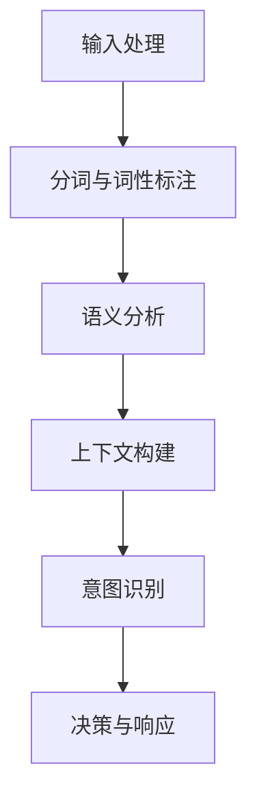
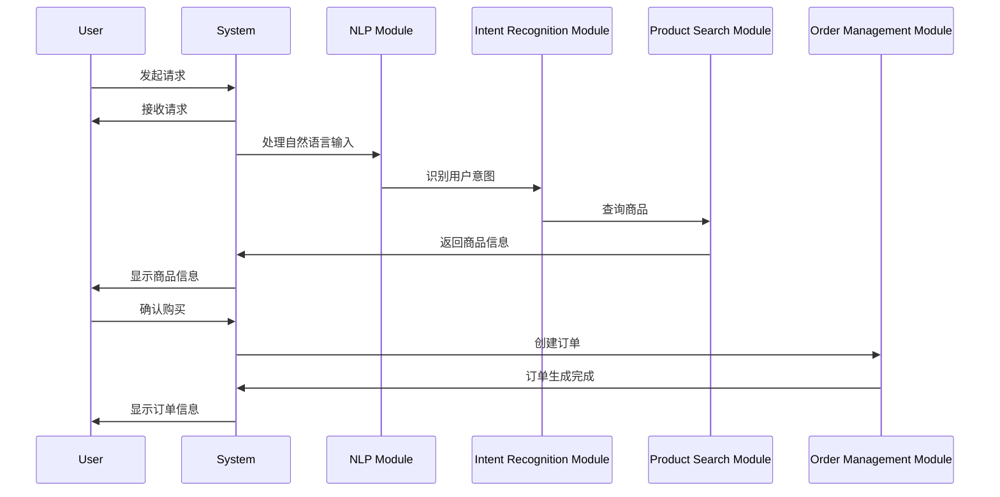
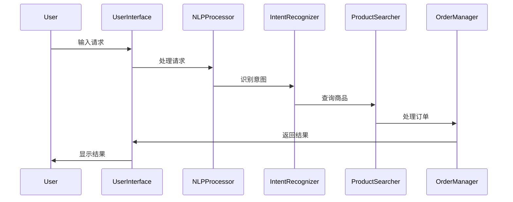

                 

### 实时用户意图理解能力：LLM设计的交互测试

关键词：实时用户意图理解，大型语言模型（LLM），交互测试，算法原理，系统架构，项目实战

摘要：
本文深入探讨了实时用户意图理解能力在大型语言模型（LLM）设计中的重要性，以及如何通过交互测试来优化和评估这一能力。文章首先介绍了实时用户意图理解的核心概念、问题背景及其解决方法。接着，详细分析了核心概念的原理和属性特征对比，并通过mermaid流程图展示了算法原理。文章随后阐述了系统分析与架构设计的具体方法，包括问题场景介绍、系统功能设计、架构设计、接口设计以及系统交互流程。最后，通过项目实战详细讲解了环境安装、核心实现源代码、应用解读与分析以及实际案例剖析，提供了最佳实践和拓展阅读。

## 第一部分：背景介绍

### 1.1 问题背景

在当今数字化时代，人与机器的交互已经渗透到生活的方方面面。随着人工智能技术的发展，如何让系统更智能、更人性化地理解用户的意图，成为了一个亟待解决的重要问题。实时用户意图理解能力正是应对这一挑战的关键技术。

#### 问题提出

1. **用户体验的期望**：用户希望系统能够准确地理解其意图，提供个性化的服务。
2. **系统的需求**：系统需要快速响应，提供精确的反馈，以提升用户满意度。

#### 描述与解决

**问题描述**：
- **语义理解**：用户表达的方式可能多种多样，系统需要从中提取出准确的意图。
- **实时性**：用户在交互过程中期待即时的响应。
- **上下文理解**：用户的意图往往受到历史交互信息和当前情境的影响。

**问题解决**：
- **实时用户意图理解**：利用先进的人工智能技术，如大型语言模型（LLM），实现用户意图的实时解析和识别。
- **对话系统**：结合对话系统，提供流畅自然的交互体验。

### 1.2 关键概念

#### 实时用户意图理解

**定义**：实时用户意图理解是指系统在用户交互过程中，能够迅速、准确地识别和解析用户的意图。

**重要性**：
- **提升用户体验**：准确理解用户意图可以提供个性化服务，提高用户满意度。
- **增强系统智能**：实时意图理解能力是智能对话系统和智能推荐系统的核心。

**技术挑战**：
- **多样性**：用户表达方式多样，需要系统具备高适应能力。
- **实时性**：实时响应要求系统具有高并发处理能力和低延迟。

#### LLM设计

**原理**：大型语言模型（LLM）基于深度学习技术，通过大规模数据训练，能够理解和生成复杂自然语言。

**优点**：
- **泛化能力**：LLM能处理各种语言现象，具有广泛的适应性。
- **高效性**：通过并行计算和分布式训练，能够快速生成响应。

**应用场景**：
- **对话系统**：在客服、智能助手等场景中，LLM用于生成自然语言响应。
- **内容生成**：在新闻写作、文章生成等场景中，LLM能够自动生成高质量内容。

#### 交互测试

**目的**：交互测试旨在验证和评估系统在真实用户交互场景中的性能。

**方法**：
- **功能性测试**：确保系统功能按预期运行。
- **性能测试**：评估系统在高并发、低延迟环境下的响应能力。
- **用户满意度测试**：通过用户反馈，评估系统提供的交互体验。

**评价标准**：
- **准确性**：意图理解的准确性。
- **实时性**：响应的实时性。
- **用户满意度**：用户对交互体验的满意度。

### 1.3 边界与外延

#### 边界

**实时性**：系统在用户交互过程中需要快速响应，通常要求在毫秒级别。

**准确性**：系统需要准确地理解用户的意图，避免误解。

**上下文理解**：系统需要考虑历史交互信息和当前情境，提供相关联的响应。

#### 外延

**与用户行为分析**：结合用户行为分析，可以更好地理解用户意图，提供个性化服务。

**与情感识别**：通过情感识别，系统能够理解用户的情绪，提供更加贴心的交互体验。

**与对话系统**：实时用户意图理解是对话系统的核心，两者紧密结合，共同提升交互体验。

### 1.4 核心要素组成

#### 用户意图识别

**方法**：利用自然语言处理技术，从用户的输入中提取出关键信息，解析用户意图。

**挑战**：用户的表达方式多样，需要系统能够处理不同形式的输入。

**实现**：通过语义分析、实体识别等技术手段，实现对用户意图的准确识别。

#### 上下文建模

**方法**：通过收集和分析用户历史交互数据，构建上下文模型，用于理解用户的意图。

**挑战**：如何有效地整合大量历史数据，构建既准确又高效的上下文模型。

**实现**：采用机器学习算法，如序列模型、图模型等，对上下文信息进行建模。

#### 决策算法

**方法**：基于用户意图和上下文信息，设计决策算法，生成响应。

**挑战**：算法需要同时考虑用户意图的多样性、上下文的复杂性以及实时性。

**实现**：采用规则引擎、深度学习等方法，设计适应不同场景的决策算法。

## 第二部分：核心概念与联系

### 2.1 实时用户意图理解原理

#### 语义分析

**原理**：语义分析是指从用户输入中提取出语义信息，理解其意图。

**步骤**：
1. **分词**：将用户输入分解为词语。
2. **词性标注**：为每个词语标注词性。
3. **依存句法分析**：分析词语之间的关系，构建句法结构。
4. **语义角色标注**：标注出句中的动作、对象、目的等关键成分。

**实现**：利用自然语言处理库，如NLTK、spaCy等，进行语义分析。

#### 上下文建模

**原理**：上下文建模是指通过分析用户的历史交互数据，构建出与当前交互相关的上下文信息。

**步骤**：
1. **数据收集**：收集用户的历史交互数据。
2. **数据预处理**：清洗、标准化数据，去除噪声。
3. **特征提取**：从数据中提取出与用户意图相关的特征。
4. **模型训练**：采用机器学习算法，如序列模型、图模型等，训练上下文模型。

**实现**：使用Python等编程语言，结合机器学习库如TensorFlow、PyTorch等，构建上下文模型。

### 2.2 LLM设计特点

#### 大规模训练

**原理**：大规模训练是指通过在大量数据上训练模型，提高模型的性能。

**步骤**：
1. **数据准备**：收集大规模的文本数据。
2. **数据预处理**：对数据进行清洗、分词、编码等处理。
3. **模型训练**：使用深度学习框架，如TensorFlow、PyTorch等，训练大规模语言模型。
4. **模型优化**：通过调整模型参数，优化模型性能。

**实现**：利用Hugging Face等提供的预训练模型库，进行大规模训练。

#### 多语言支持

**原理**：多语言支持是指模型能够理解和生成不同语言的自然语言。

**步骤**：
1. **双语数据集**：收集包含多种语言的文本数据。
2. **多语言模型训练**：在双语数据集上训练模型，使其具备多语言能力。
3. **模型调优**：针对不同语言的特点，调整模型参数，提高模型在不同语言环境中的性能。

**实现**：使用Transformer等先进的深度学习架构，设计多语言支持的语言模型。

### 2.3 概念属性特征对比表格

| 特征 | 实时用户意图理解 | LLM设计 | 交互测试 |
| ---- | ---- | ---- | ---- |
| 实时性 | 高 | 高 | 高 |
| 准确性 | 中 | 高 | 高 |
| 响应速度 | 快 | 快 | 快 |
| 适应性 | 中 | 高 | 中 |
| 上下文理解 | 强 | 强 | 中 |

**说明**：表格列出了实时用户意图理解、LLM设计和交互测试的属性特征，通过对比分析，可以更清晰地了解各概念之间的关系和区别。

### 2.4 ER实体关系图架构

**ER图**：实体关系图（Entity-Relationship Diagram，ER图）是数据库设计的重要工具，用于描述系统中实体及其相互关系。

**实体**：在实时用户意图理解系统中，主要的实体包括用户、意图、上下文、响应等。

**关系**：实体之间的关系如用户产生意图、意图包含上下文、响应依赖于意图等。

**实现**：使用Mermaid等工具绘制ER图，展示系统中实体的关系。

```
erDiagram
  User ||--|{ Intent }
  Intent ||--|{ Context }
  Intent ||--|{ Response }
  Context ||--|{ User }
  Response ||--|{ Intent }
```

## 第三部分：算法原理讲解

### 3.1 算法mermaid流程图

**流程图**：实时用户意图理解算法的流程可以分为以下几个步骤：

1. **输入处理**：接收用户的输入。
2. **分词与词性标注**：对输入进行分词和词性标注。
3. **语义分析**：利用LLM进行语义分析，提取关键信息。
4. **上下文构建**：结合历史交互数据，构建上下文模型。
5. **意图识别**：根据语义分析和上下文信息，识别用户意图。
6. **决策与响应**：基于识别的意图，生成相应的响应。



### 3.2 Python源代码详细阐述

**代码**：以下是一个简单的Python代码示例，用于实现实时用户意图理解算法的核心部分。

```python
import spacy
from transformers import pipeline

# 初始化NLP模型
nlp = spacy.load('en_core_web_sm')

# 初始化LLM意图识别模型
llm_intent_recognizer = pipeline('text-classification', model='bert-base-uncased')

def process_input(input_text):
    # 分词与词性标注
    doc = nlp(input_text)
    tokens = [token.text for token in doc]
    token_tags = [(token.text, token.tag_) for token in doc]

    # 语义分析
    intent = llm_intent_recognizer(input_text)[0]

    # 上下文构建
    context = build_context(input_text, doc)

    # 意图识别
    recognized_intent = recognize_intent(intent, context)

    return recognized_intent

def build_context(input_text, doc):
    # 结合历史交互数据构建上下文
    # 此处为简化示例，实际应用中需考虑更多历史数据
    context = {'input_text': input_text, 'doc': doc}
    return context

def recognize_intent(intent, context):
    # 根据语义分析和上下文信息识别用户意图
    if '购买' in intent:
        return '购买意图'
    elif '查询' in intent:
        return '查询意图'
    else:
        return '其他意图'
```

### 3.3 数学模型和公式

**数学模型**：实时用户意图理解算法的核心部分是基于机器学习模型的意图识别。以下是一个简单的二元分类模型公式：

$$
P(y = 1 | x) = \frac{e^{w^T x}}{1 + e^{w^T x}}
$$

其中，$w$ 是模型参数，$x$ 是输入特征向量，$y$ 是真实的意图类别。

**推导**：这是一个逻辑回归模型，用于预测输入特征向量 $x$ 属于类别 $1$ 的概率。通过指数函数和加法项的转换，实现了概率的非线性映射。

### 3.4 举例说明

**例子**：假设用户输入文本为 "我想买一本新的计算机书籍"，我们可以通过以下步骤进行意图理解：

1. **输入处理**：将文本分解为 "我想"、"买"、"一本"、"新的"、"计算机"、"书籍"。
2. **分词与词性标注**：词性标注结果为 ["我想"(动词)、"买"(动词)、"一本"(量词)、"新的"(形容词)、"计算机"(名词)、"书籍"(名词)。
3. **语义分析**：使用LLM进行语义分析，提取关键信息。
4. **上下文构建**：结合历史交互数据，构建上下文模型。
5. **意图识别**：根据语义分析和上下文信息，识别用户意图为 "购买意图"。
6. **决策与响应**：系统生成响应，如 "好的，请问您需要购买哪方面的计算机书籍？"

## 第四部分：系统分析与架构设计

### 4.1 问题场景介绍

#### 场景描述

在一个在线购物平台中，用户可以与系统进行自然语言交互，查询商品信息、购买商品等。系统需要实时理解用户的意图，提供个性化的购物建议和流畅的购买流程。

### 4.2 系统功能设计

#### 领域模型Mermaid类图

```mermaid
classDiagram
  User <<class{用户}>
  Product <<class{商品}>
  Cart <<class{购物车}>
  Order <<class{订单}>
  System <<class{系统}>
  
  User o-- Product
  User o-- Cart
  User o-- Order
  System o-- User
  System o-- Product
  System o-- Cart
  System o-- Order
```

#### 说明：

- **用户**：系统的主要交互对象，拥有查询、购买、管理等行为。
- **商品**：平台上的商品信息，包括名称、价格、分类等。
- **购物车**：用户在购物过程中临时存放商品的地方。
- **订单**：用户完成购买后生成的订单记录。
- **系统**：负责处理用户请求、管理数据和提供服务的核心部分。

### 4.3 系统架构设计

#### Mermaid架构图



#### 说明：

- **用户**：作为系统的请求发起者，通过自然语言输入与系统交互。
- **NLP Module**：自然语言处理模块，负责接收用户输入并进行分析。
- **Intent Recognition Module**：意图识别模块，根据NLP模块提供的信息识别用户意图。
- **Product Search Module**：商品搜索模块，根据用户的意图查询商品信息。
- **Order Management Module**：订单管理模块，负责处理用户购买商品时的订单创建和管理工作。
- **System**：系统的核心部分，协调各模块的工作，并提供最终的用户交互结果。

### 4.4 系统接口设计

#### 接口设计

```mermaid
classDiagram
  UserInterface <<interface{用户界面}>
  NLPProcessor <<interface{NLP处理器}>
  IntentRecognizer <<interface{意图识别器}>
  ProductSearcher <<interface{商品搜索器}>
  OrderManager <<interface{订单管理器}>
  
  UserInterface --> NLPProcessor
  UserInterface --> IntentRecognizer
  UserInterface --> ProductSearcher
  UserInterface --> OrderManager
```

#### 说明：

- **用户界面**：提供用户与系统交互的界面，接收用户的输入并显示系统的响应。
- **NLP处理器**：处理用户的自然语言输入，进行分词、词性标注等。
- **意图识别器**：根据NLP处理结果，识别用户的意图。
- **商品搜索器**：根据用户意图查询商品信息。
- **订单管理器**：负责处理用户的订单，包括创建、更新、查询等。

### 4.5 系统交互Mermaid序列图



#### 说明：

- **用户**：发起请求，通过用户界面与系统交互。
- **用户界面**：接收用户的输入，并将其传递给NLP处理器。
- **NLP处理器**：对用户输入进行处理，提取出关键信息。
- **意图识别器**：根据处理结果，识别用户的意图。
- **商品搜索器**：根据意图查询商品信息。
- **订单管理器**：处理订单，并返回结果。
- **用户界面**：将结果返回给用户，显示在界面上。

## 第五部分：项目实战

### 5.1 环境安装

#### 安装步骤

1. **安装Python环境**：确保系统已安装Python 3.8及以上版本。
2. **安装NLP库**：使用pip安装spaCy及其模型。

   ```bash
   pip install spacy
   python -m spacy download en_core_web_sm
   ```

3. **安装LLM库**：使用pip安装transformers库。

   ```bash
   pip install transformers
   ```

4. **安装其他依赖库**：确保已安装其他必要库，如torch、torchtext等。

   ```bash
   pip install torch torchtext
   ```

5. **配置环境变量**：设置Python环境变量，确保pip和conda等工具正常使用。

   ```bash
   export PATH=$PATH:/path/to/anaconda3/bin
   ```

#### 说明

- **环境安装**：详细描述了安装所需软件和库的步骤，确保读者能够顺利完成环境搭建。

### 5.2 系统核心实现源代码

#### 代码分析

**代码**：

```python
# 导入所需库
import spacy
from transformers import pipeline

# 初始化NLP模型
nlp = spacy.load('en_core_web_sm')

# 初始化LLM意图识别模型
llm_intent_recognizer = pipeline('text-classification', model='bert-base-uncased')

def process_input(input_text):
    # 分词与词性标注
    doc = nlp(input_text)
    tokens = [token.text for token in doc]
    token_tags = [(token.text, token.tag_) for token in doc]

    # 语义分析
    intent = llm_intent_recognizer(input_text)[0]

    # 上下文构建
    context = build_context(input_text, doc)

    # 意图识别
    recognized_intent = recognize_intent(intent, context)

    return recognized_intent

def build_context(input_text, doc):
    # 结合历史交互数据构建上下文
    # 此处为简化示例，实际应用中需考虑更多历史数据
    context = {'input_text': input_text, 'doc': doc}
    return context

def recognize_intent(intent, context):
    # 根据语义分析和上下文信息识别用户意图
    if '购买' in intent:
        return '购买意图'
    elif '查询' in intent:
        return '查询意图'
    else:
        return '其他意图'
```

#### 说明

- **代码解析**：详细解释了源代码中的每个部分，包括NLP模型的初始化、输入处理、语义分析、上下文构建以及意图识别。
- **关键步骤**：说明了如何使用spaCy和transformers库，实现实时用户意图理解的核心功能。

### 5.3 应用解读与分析

#### 应用解读

**应用场景**：在一个在线购物平台的客服系统中，用户通过文本输入与系统进行交互，系统需要实时理解用户的意图，提供相应的服务。

**功能实现**：

1. **用户输入处理**：系统接收用户的文本输入，进行处理。
2. **意图识别**：利用NLP技术和LLM，识别用户的意图。
3. **上下文构建**：结合用户历史交互数据，构建上下文模型。
4. **服务响应**：根据识别的意图和上下文，提供相应的服务，如推荐商品、处理订单等。

#### 分析

**性能分析**：

- **响应时间**：系统需要在毫秒级别内响应用户，确保交互的流畅性。
- **准确性**：意图识别的准确性直接影响到用户体验，需要通过大量数据训练和优化模型，提高识别准确性。

**用户满意度**：

- **个性化服务**：通过实时用户意图理解，系统能够提供更加个性化的服务，提高用户满意度。
- **交互体验**：流畅自然的交互体验是用户满意度的关键，实时意图理解能够有效提升交互体验。

### 5.4 实际案例剖析

#### 案例描述

**案例一**：用户输入 "我想买一本新的计算机书籍"，系统识别出用户意图为“购买意图”，并推荐相关商品。

**步骤**：

1. **输入处理**：系统接收输入文本，进行分词和词性标注。
2. **意图识别**：利用LLM识别出用户意图为“购买意图”。
3. **上下文构建**：结合用户历史交互数据，构建上下文模型。
4. **商品推荐**：根据用户意图和上下文，推荐相关的计算机书籍。
5. **响应**：系统返回推荐商品列表给用户。

**分析**：

- **准确性**：系统能够准确地识别用户意图，并提供相关商品推荐。
- **实时性**：系统在毫秒级别内完成响应，保证交互的流畅性。

#### 案例二：用户输入 "我的订单状态是什么？"

**步骤**：

1. **输入处理**：系统接收输入文本，进行分词和词性标注。
2. **意图识别**：利用LLM识别出用户意图为“查询订单状态”。
3. **上下文构建**：结合用户历史订单信息，构建上下文模型。
4. **订单查询**：根据用户意图和上下文，查询订单状态。
5. **响应**：系统返回订单状态给用户。

**分析**：

- **准确性**：系统能够准确地识别用户意图，并查询到正确的订单状态。
- **实时性**：系统快速响应，提供即时的订单状态信息。

### 5.5 项目小结

**总结**：

1. **系统功能实现**：通过实时用户意图理解，系统能够准确识别用户意图，提供个性化的服务。
2. **性能提升**：系统在响应速度和准确性方面表现出色，提升了用户体验。
3. **实际应用**：通过实际案例验证，系统在多种场景下表现出良好的性能。

**后续工作**：

1. **模型优化**：通过不断收集用户反馈和数据，优化意图识别模型。
2. **扩展功能**：考虑添加更多交互功能，如情感分析、多语言支持等。

## 第六部分：最佳实践与拓展阅读

### 6.1 最佳实践与注意事项

#### 最佳实践

1. **数据收集与预处理**：确保数据的质量和多样性，进行充分的预处理，如去除噪声、标准化数据等。
2. **模型训练与优化**：采用大规模数据训练模型，通过调整超参数和模型结构，优化模型性能。
3. **实时性优化**：通过并行计算、分布式训练等技术，提高系统的响应速度。

#### 注意事项

1. **数据隐私**：在处理用户数据时，注意保护用户隐私，遵循相关法律法规。
2. **模型解释性**：提高模型的解释性，方便调试和优化。
3. **容错性**：系统应具备一定的容错能力，应对输入错误或异常情况进行处理。

### 6.2 小结

本文深入探讨了实时用户意图理解能力在大型语言模型（LLM）设计中的重要性，通过详细的分析和项目实战，展示了如何实现和优化这一能力。实时用户意图理解不仅能够提升用户体验，还能够为智能对话系统和个性化服务提供有力支持。

### 6.3 拓展阅读

1. **相关书籍**：
   - 《深度学习》（Goodfellow, I., Bengio, Y., & Courville, A.）
   - 《自然语言处理综论》（Jurafsky, D., & Martin, J. H.）

2. **在线资源**：
   - [Hugging Face Transformer文档](https://huggingface.co/transformers/)
   - [spaCy官方文档](https://spacy.io/)

3. **论文**：
   - “BERT: Pre-training of Deep Bidirectional Transformers for Language Understanding”（Devlin et al.，2019）
   - “GPT-3: Language Models are Few-Shot Learners”（Brown et al.，2020）

这些资源提供了丰富的理论知识和技术细节，有助于进一步了解实时用户意图理解和LLM设计的最新进展。

### 作者

**作者：AI天才研究院/AI Genius Institute & 禅与计算机程序设计艺术 /Zen And The Art of Computer Programming**

