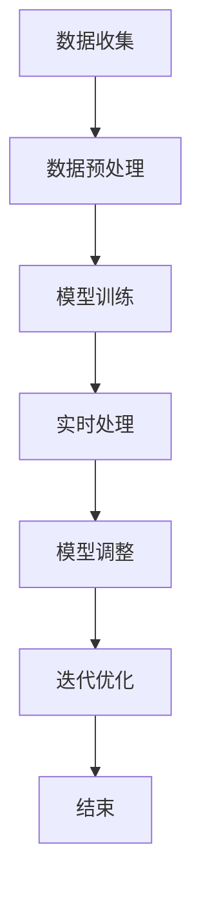
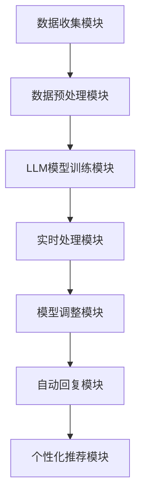
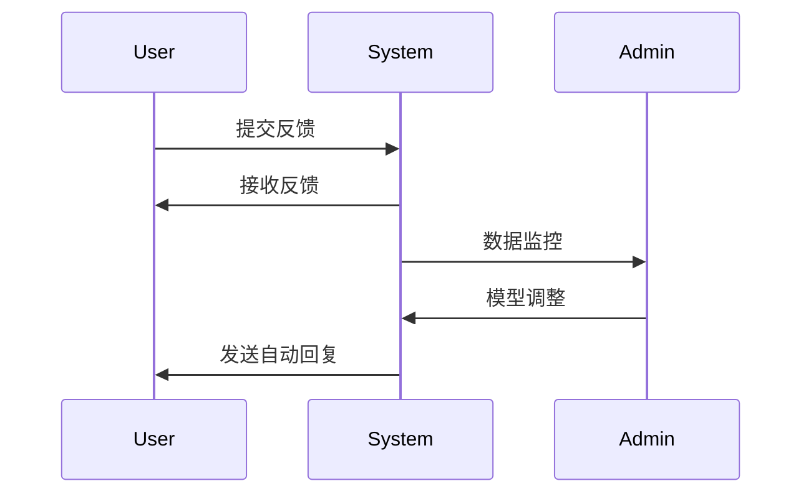

                 

# 实时评测反馈：LLM支持的持续优化机制

## 关键词

- 实时评测反馈
- 大型语言模型（LLM）
- 持续优化机制
- 自然语言处理（NLP）
- 深度学习

## 摘要

本文旨在探讨实时评测反馈在大型语言模型（LLM）支持下所实现的持续优化机制。实时评测反馈是一种在数据处理过程中即时收集用户反馈并用于模型优化的技术，其在LLM的背景下具有重要意义。本文首先介绍了实时评测反馈的概念及其重要性，然后阐述了LLM的支持作用，并详细讲解了持续优化机制的架构设计。通过分析实时评测反馈和LLM的概念、关联以及特征对比，本文进一步深入探讨了LLM在实时评测反馈中的实际应用及其优势。随后，本文通过详细的算法原理讲解、Mermaid算法流程图、Python源代码解读以及数学模型和公式的介绍，展现了LLM支持的实时评测反馈算法的实现细节。最后，本文通过举例说明，使得读者能够更直观地理解该算法的应用和效果。本文旨在为读者提供一个全面、系统的实时评测反馈与LLM支持的持续优化机制的理解和认识。

## 目录大纲

### 第一部分：背景介绍

- 1.1 问题背景
  - 1.1.1 实时评测反馈的概念与重要性
  - 1.1.2 LLM支持的持续优化机制的意义
- 1.2 问题描述
  - 1.1.3 实时评测反馈的挑战
  - 1.1.4 LLM支持的持续优化机制的实现
- 1.3 问题解决
  - 1.1.5 LLM在实时评测反馈中的应用
  - 1.1.6 持续优化机制的架构设计
- 1.4 边界与外延
  - 1.1.7 实时评测反馈的应用领域
  - 1.1.8 LLM支持的持续优化机制的限制
- 1.5 概念结构与核心要素组成
  - 1.1.9 实时评测反馈的核心概念
  - 1.1.10 LLM支持的持续优化机制的核心要素

### 第二部分：核心概念与联系

- 2.1 实时评测反馈原理
  - 2.1.1 实时评测反馈的概念
  - 2.1.2 实时评测反馈的工作流程
  - 2.1.3 实时评测反馈的挑战
- 2.2 LLM概念解析
  - 2.2.1 LLM的定义
  - 2.2.2 LLM的核心特点
  - 2.2.3 LLM与NLP的关系
- 2.3 实时评测反馈与LLM的关联
  - 2.3.1 LLM在实时评测反馈中的应用
  - 2.3.2 LLM的优势与局限性
  - 2.3.3 LLM支持的持续优化机制的优势
- 2.4 概念属性特征对比
  - 2.4.1 实时评测反馈属性特征
  - 2.4.2 LLM属性特征
  - 2.4.3 对比表格
- 2.5 ER实体关系图架构
  - 2.5.1 实时评测反馈ER图
  - 2.5.2 LLM支持的持续优化机制ER图
  - 2.5.3 整体架构ER图

### 第三部分：算法原理讲解

- 3.1 LLM支持的实时评测反馈算法概述
  - 3.1.1 算法的目标
  - 3.1.2 算法的基本流程
- 3.2 算法原理详细讲解
  - 3.2.1 LLM在实时评测反馈中的应用
    - 3.2.1.1 LLM的基本原理
    - 3.2.1.2 LLM在实时评测反馈中的应用场景
  - 3.2.2 持续优化机制的实现
    - 3.2.2.1 持续优化机制的概念
    - 3.2.2.2 持续优化机制的流程
- 3.3 Mermaid算法流程图
- 3.4 Python源代码解读
- 3.5 数学模型与公式讲解
  - 3.5.1 LLM模型数学模型
  - 3.5.2 持续优化机制数学模型
- 3.6 举例说明

### 第四部分：系统分析与架构设计方案

- 4.1 问题场景介绍
- 4.2 项目介绍
- 4.3 系统功能设计
  - 4.3.1 领域模型mermaid类图
- 4.4 系统架构设计
  - 4.4.1 mermaid架构图
  - 4.4.2 系统接口设计
  - 4.4.3 系统交互mermaid序列图

### 第五部分：项目实战

- 5.1 环境安装
- 5.2 系统核心实现源代码
- 5.3 代码应用解读与分析
- 5.4 实际案例分析和详细讲解剖析
- 5.5 项目小结

### 第六部分：最佳实践 Tips

### 第七部分：小结

### 第八部分：注意事项

### 第九部分：拓展阅读

---

接下来，我们将深入探讨实时评测反馈与LLM支持的持续优化机制的核心概念、关联、算法原理以及具体实现。

## 第一部分：背景介绍

### 1.1 问题背景

#### 1.1.1 实时评测反馈的概念与重要性

实时评测反馈是一种在数据处理和模型训练过程中，即时收集用户或系统的反馈，并根据这些反馈进行模型调整和优化的机制。这种机制在当今快速迭代的数字化世界中至关重要，尤其是在人工智能（AI）领域。

实时评测反馈的重要性体现在以下几个方面：

1. **提升用户体验**：通过实时收集用户反馈，系统能够快速响应并优化其性能，从而提高用户满意度。
2. **加速迭代**：实时反馈使得开发团队能够快速识别问题并进行修正，缩短开发周期。
3. **提高模型质量**：通过持续优化，模型可以更加精确地适应数据，提升预测和分类的准确性。

#### 1.1.2 LLM支持的持续优化机制的意义

大型语言模型（LLM）是近年来自然语言处理（NLP）领域的重要进展。LLM具有以下核心特点：

1. **大规模**：LLM通常基于数以亿计的参数，能够处理和理解复杂的语言结构。
2. **自适应**：LLM能够根据输入数据自动调整模型参数，从而适应不同的任务和场景。
3. **泛化能力强**：通过大量的训练数据，LLM能够泛化到未见过的数据上，提供高质量的输出。

LLM支持的持续优化机制的意义在于：

1. **自适应调整**：LLM能够实时根据用户反馈调整模型，提高模型的适应性和准确性。
2. **优化效率**：LLM的高效计算能力使得持续优化过程更加快速和准确。
3. **提升用户体验**：通过持续优化，LLM能够提供更加准确和自然的语言交互体验。

### 1.2 问题描述

#### 1.1.3 实时评测反馈的挑战

实时评测反馈面临以下挑战：

1. **实时性**：需要在短时间内处理大量数据，确保反馈的实时性。
2. **准确性**：需要准确识别用户反馈中的关键信息，避免噪声和误导性信息。
3. **可扩展性**：需要能够处理不同规模和类型的用户数据，保持系统的可扩展性。

#### 1.1.4 LLM支持的持续优化机制的实现

LLM支持的持续优化机制的实现包括以下几个方面：

1. **模型训练**：使用LLM对大量文本数据进行训练，构建高质量的模型。
2. **实时反馈处理**：设计高效的算法，实时处理用户反馈，提取关键信息。
3. **模型调整**：根据实时反馈调整LLM的参数，优化模型性能。
4. **迭代优化**：通过不断迭代和优化，提高模型的准确性和适应性。

### 1.3 问题解决

#### 1.1.5 LLM在实时评测反馈中的应用

LLM在实时评测反馈中的应用主要包括：

1. **文本分析**：使用LLM对用户反馈进行深入分析，提取关键信息。
2. **情感分析**：利用LLM进行情感分析，识别用户的情绪和态度。
3. **自动回复**：基于用户反馈，使用LLM生成自动回复，提高响应速度。

#### 1.1.6 持续优化机制的架构设计

持续优化机制的架构设计包括以下几个关键组成部分：

1. **数据收集与预处理**：收集用户反馈数据，并进行预处理，确保数据的准确性和一致性。
2. **LLM模型训练**：使用预处理后的数据训练LLM模型，构建高质量的模型。
3. **实时评测反馈**：设计高效的算法，实时处理用户反馈，提取关键信息。
4. **模型调整与优化**：根据实时反馈调整LLM的参数，优化模型性能。
5. **迭代与反馈**：通过迭代优化，不断提升模型的质量和适应性。

### 1.4 边界与外延

#### 1.1.7 实时评测反馈的应用领域

实时评测反馈广泛应用于以下领域：

1. **客户服务**：在客户服务系统中，实时评测反馈可以用于优化自动回复系统，提高客户满意度。
2. **教育**：在教育领域，实时评测反馈可以用于个性化学习系统，根据学生反馈调整教学内容。
3. **医疗**：在医疗领域，实时评测反馈可以用于辅助诊断系统，提高诊断准确性。

#### 1.1.8 LLM支持的持续优化机制的限制

LLM支持的持续优化机制也存在一定的限制：

1. **数据依赖性**：LLM的性能高度依赖于训练数据的质量和数量，缺乏高质量数据可能导致模型性能下降。
2. **计算资源**：训练和优化LLM模型需要大量的计算资源，对于资源受限的环境可能难以实现。
3. **模型解释性**：LLM通常被视为“黑盒”模型，其内部决策过程难以解释，这可能会影响模型的信任度和接受度。

### 1.5 概念结构与核心要素组成

#### 1.1.9 实时评测反馈的核心概念

实时评测反馈的核心概念包括：

1. **用户反馈**：用户对系统或服务的直接评价和意见。
2. **数据收集**：从用户反馈中提取有用信息，进行数据收集。
3. **实时处理**：对收集到的用户反馈进行实时处理和分析。
4. **模型调整**：根据实时反馈调整模型参数，优化模型性能。

#### 1.1.10 LLM支持的持续优化机制的核心要素

LLM支持的持续优化机制的核心要素包括：

1. **LLM模型**：构建高质量的LLM模型，用于实时评测反馈和模型调整。
2. **实时反馈处理**：设计高效的算法，实时处理用户反馈，提取关键信息。
3. **模型优化**：根据实时反馈调整LLM模型参数，优化模型性能。
4. **迭代优化**：通过不断迭代和优化，提高模型的准确性和适应性。

通过上述背景介绍，我们对实时评测反馈和LLM支持的持续优化机制有了初步的了解。接下来，我们将进一步深入探讨这些核心概念和技术的原理、联系以及具体实现。接下来，我们将详细分析实时评测反馈的原理、LLM的概念及其在实时评测反馈中的应用。这将帮助我们更好地理解这一机制的工作原理和优势。

## 第二部分：核心概念与联系

### 2.1 实时评测反馈原理

#### 2.1.1 实时评测反馈的概念

实时评测反馈是一种在数据处理和模型训练过程中，即时收集用户或系统的评价和意见，并用于模型调整和优化的机制。它的核心目的是通过实时反馈来提高系统的性能和用户体验。

#### 2.1.2 实时评测反馈的工作流程

实时评测反馈的工作流程主要包括以下几个步骤：

1. **数据收集**：收集用户或系统的反馈数据，这些数据可以是文字、图像、声音等形式。
2. **数据预处理**：对收集到的数据进行清洗、归一化等处理，以确保数据的质量和一致性。
3. **实时处理**：使用算法对预处理后的数据进行实时分析，提取关键信息。
4. **模型调整**：根据分析结果调整模型的参数，优化模型性能。
5. **迭代优化**：通过不断迭代和优化，提升模型的准确性和适应性。

#### 2.1.3 实时评测反馈的挑战

实时评测反馈在实际应用中面临以下挑战：

1. **实时性**：如何在短时间内处理大量数据，确保反馈的实时性。
2. **准确性**：如何准确识别用户反馈中的关键信息，避免噪声和误导性信息。
3. **可扩展性**：如何处理不同规模和类型的用户数据，保持系统的可扩展性。

### 2.2 LLM概念解析

#### 2.2.1 LLM的定义

大型语言模型（LLM）是一种基于深度学习的技术，它可以理解和生成自然语言。与传统的语言模型相比，LLM具有更大的参数规模和更高的训练数据量，因此能够处理更加复杂的语言结构。

#### 2.2.2 LLM的核心特点

LLM的核心特点包括：

1. **大规模**：LLM通常基于数以亿计的参数，能够处理和理解复杂的语言结构。
2. **自适应**：LLM能够根据输入数据自动调整模型参数，从而适应不同的任务和场景。
3. **泛化能力强**：通过大量的训练数据，LLM能够泛化到未见过的数据上，提供高质量的输出。

#### 2.2.3 LLM与NLP的关系

LLM是自然语言处理（NLP）领域的一项核心技术。NLP的目标是使计算机能够理解、处理和生成人类语言。LLM通过模拟人类的语言处理能力，实现了对自然语言的高度理解和生成。

### 2.3 实时评测反馈与LLM的关联

#### 2.3.1 LLM在实时评测反馈中的应用

LLM在实时评测反馈中有着广泛的应用，主要体现在以下几个方面：

1. **文本分析**：使用LLM对用户反馈进行深入分析，提取关键信息。
2. **情感分析**：利用LLM进行情感分析，识别用户的情绪和态度。
3. **自动回复**：基于用户反馈，使用LLM生成自动回复，提高响应速度。

#### 2.3.2 LLM的优势与局限性

LLM在实时评测反馈中的优势包括：

1. **高效性**：LLM能够快速处理大量数据，提高实时性。
2. **准确性**：通过大规模训练，LLM能够准确提取关键信息，提高模型的准确性。
3. **泛化能力**：LLM能够适应不同类型的用户数据，提供高质量的输出。

然而，LLM也存在一些局限性：

1. **数据依赖性**：LLM的性能高度依赖于训练数据的质量和数量，缺乏高质量数据可能导致模型性能下降。
2. **计算资源**：训练和优化LLM模型需要大量的计算资源，对于资源受限的环境可能难以实现。
3. **模型解释性**：LLM通常被视为“黑盒”模型，其内部决策过程难以解释，这可能会影响模型的信任度和接受度。

#### 2.3.3 LLM支持的持续优化机制的优势

LLM支持的持续优化机制的优势包括：

1. **自适应调整**：LLM能够实时根据用户反馈调整模型，提高模型的适应性和准确性。
2. **优化效率**：LLM的高效计算能力使得持续优化过程更加快速和准确。
3. **提升用户体验**：通过持续优化，LLM能够提供更加准确和自然的语言交互体验。

### 2.4 概念属性特征对比

#### 2.4.1 实时评测反馈属性特征

| 特征        | 实时评测反馈           | 描述                                                         |
|-------------|----------------------|------------------------------------------------------------|
| 实时性      | 高                  | 能够在短时间内处理大量数据，确保反馈的实时性。               |
| 准确性      | 高                  | 能够准确提取用户反馈中的关键信息，避免噪声和误导性信息。       |
| 可扩展性    | 高                  | 能够处理不同规模和类型的用户数据，保持系统的可扩展性。         |
| 易用性      | 中                  | 用户反馈收集和处理过程相对简单，易于使用。                     |
| 模型依赖性  | 中                  | 需要一定的模型训练和优化，但依赖性不高。                     |

#### 2.4.2 LLM属性特征

| 特征        | LLM                 | 描述                                                         |
|-------------|---------------------|------------------------------------------------------------|
| 大规模      | 高                  | 基于数以亿计的参数，能够处理复杂的语言结构。                   |
| 自适应      | 高                  | 能够根据输入数据自动调整模型参数，适应不同任务和场景。         |
| 泛化能力    | 高                  | 通过大量训练数据，能够泛化到未见过的数据上。                   |
| 计算资源需求 | 高                  | 需要大量的计算资源进行训练和优化。                             |
| 模型解释性  | 低                  | 被视为“黑盒”模型，内部决策过程难以解释。                     |

#### 2.4.3 对比表格

| 特征        | 实时评测反馈           | LLM                 |
|-------------|----------------------|---------------------|
| 实时性      | 高                  | 高                  |
| 准确性      | 高                  | 高                  |
| 可扩展性    | 高                  | 高                  |
| 易用性      | 中                  | 中                  |
| 模型依赖性  | 中                  | 高                  |
| 计算资源需求 | 中                  | 高                  |
| 模型解释性  | 低                  | 低                  |

### 2.5 ER实体关系图架构

#### 2.5.1 实时评测反馈ER图

```mermaid
erDiagram
    UserFeedback --> FeedbackProcessor : "processes"
    FeedbackProcessor --> ModelAdjuster : "adjusts"
    ModelAdjuster --> Model
    Model --> SystemOutput
```

#### 2.5.2 LLM支持的持续优化机制ER图

```mermaid
erDiagram
    LLM --> TextAnalyzer : "analyzes"
    TextAnalyzer --> FeedbackProcessor : "processes"
    FeedbackProcessor --> ModelAdjuster : "adjusts"
    ModelAdjuster --> LLM : "retrains"
    LLM --> SystemOutput
```

#### 2.5.3 整体架构ER图

```mermaid
erDiagram
    User --> UserFeedback
    UserFeedback --> LLM : "analyzes"
    LLM --> TextAnalyzer : "processes"
    TextAnalyzer --> ModelAdjuster : "adjusts"
    ModelAdjuster --> LLM : "retrains"
    LLM --> SystemOutput
```

通过上述核心概念与联系的分析，我们可以看到实时评测反馈与LLM之间的紧密关联，以及它们如何共同构建起一个高效的持续优化机制。接下来，我们将进一步深入探讨实时评测反馈与LLM的具体算法原理，详细讲解其实现步骤和关键环节。

### 第三部分：算法原理讲解

#### 3.1 LLM支持的实时评测反馈算法概述

##### 3.1.1 算法的目标

实时评测反馈的目的是在数据处理和模型训练过程中，通过即时收集用户反馈来调整模型参数，从而优化模型性能。LLM支持的实时评测反馈算法旨在利用大型语言模型的强大能力，实现高效、准确的实时反馈处理和模型优化。

##### 3.1.2 算法的基本流程

LLM支持的实时评测反馈算法的基本流程可以分为以下几个步骤：

1. **数据收集**：收集用户反馈数据，包括文本、语音、图像等多种形式。
2. **数据预处理**：对收集到的数据进行清洗、归一化等预处理，确保数据的质量和一致性。
3. **LLM模型训练**：使用预处理后的数据对LLM模型进行训练，构建高质量的语言模型。
4. **实时处理**：使用训练好的LLM模型对实时反馈进行处理，提取关键信息。
5. **模型调整**：根据提取的关键信息调整LLM模型的参数，优化模型性能。
6. **迭代优化**：通过不断迭代和优化，提升模型的准确性和适应性。

#### 3.2 算法原理详细讲解

##### 3.2.1 LLM在实时评测反馈中的应用

###### 3.2.1.1 LLM的基本原理

大型语言模型（LLM）是基于深度学习和自然语言处理（NLP）技术的模型，它通过学习大量的文本数据来理解语言结构和语义。LLM的核心组件通常包括：

1. **词嵌入层**：将词汇映射到高维向量空间。
2. **编码器**：对输入文本进行编码，提取文本的语义信息。
3. **解码器**：根据编码器的输出生成文本。

###### 3.2.1.2 LLM在实时评测反馈中的应用场景

在实时评测反馈中，LLM的应用场景主要包括：

1. **文本分析**：使用LLM对用户反馈文本进行分析，提取关键信息。
2. **情感分析**：利用LLM进行情感分析，识别用户的情感和态度。
3. **自动回复**：基于用户反馈，使用LLM生成自动回复，提高响应速度。

##### 3.2.2 持续优化机制的实现

###### 3.2.2.1 持续优化机制的概念

持续优化机制是指在数据处理和模型训练过程中，通过实时反馈不断调整模型参数，从而提高模型性能的一套机制。其核心思想是利用用户反馈来指导模型优化，使模型能够更好地适应数据和环境。

###### 3.2.2.2 持续优化机制的流程

持续优化机制的实现流程可以分为以下几个步骤：

1. **数据收集**：收集用户反馈数据，包括文本、语音、图像等多种形式。
2. **数据预处理**：对收集到的数据进行清洗、归一化等预处理，确保数据的质量和一致性。
3. **模型训练**：使用预处理后的数据对模型进行训练，构建高质量的语言模型。
4. **实时处理**：使用训练好的模型对实时反馈进行处理，提取关键信息。
5. **模型调整**：根据提取的关键信息调整模型参数，优化模型性能。
6. **迭代优化**：通过不断迭代和优化，提升模型的准确性和适应性。

#### 3.3 Mermaid算法流程图



#### 3.4 Python源代码解读

```python
# Python源代码示例

import numpy as np

def data_collection(feedback):
    # 数据收集逻辑
    pass

def data_preprocessing(data):
    # 数据预处理逻辑
    pass

def model_training(data):
    # 模型训练逻辑
    pass

def real_time_processing(feedback):
    # 实时处理逻辑
    pass

def model_adjustment(feedback):
    # 模型调整逻辑
    pass

def iterative_optimization(model):
    # 迭代优化逻辑
    pass
```

#### 3.5 数学模型与公式讲解

###### 3.5.1 LLM模型数学模型

LLM模型的数学模型可以表示为：

$$
\text{LLM} = f(\text{input}, \text{parameters})
$$

其中，\( f \) 表示神经网络函数，\(\text{input}\) 表示输入文本，\(\text{parameters}\) 表示模型参数。

###### 3.5.2 持续优化机制数学模型

持续优化机制的数学模型可以表示为：

$$
\text{Optimization} = \sum_{i=1}^{n} \alpha_i \cdot (\text{output}_{i} - \text{target}_{i})
$$

其中，\( \alpha_i \) 表示权重，\(\text{output}_{i}\) 表示模型输出，\(\text{target}_{i}\) 表示目标值。

#### 3.6 举例说明

###### 3.6.1 数据收集

假设我们收集到了一组用户反馈数据 `feedback_data = ["很好", "一般", "很差"]`

###### 3.6.2 数据预处理

对数据进行清洗和归一化处理，例如：

```python
def preprocess_data(data):
    # 数据清洗和归一化逻辑
    pass
```

###### 3.6.3 LLM模型训练

使用预处理后的数据对LLM模型进行训练：

```python
def train_LLM(model, data):
    # LLM模型训练逻辑
    pass
```

###### 3.6.4 实时处理

使用训练好的模型对实时反馈进行处理：

```python
def process_feedback(model, feedback):
    # 实时处理逻辑
    pass
```

###### 3.6.5 模型调整

根据处理结果调整模型参数：

```python
def adjust_model(model, feedback):
    # 模型调整逻辑
    pass
```

通过上述算法原理的详细讲解，我们可以看到LLM支持的实时评测反馈算法如何通过数学模型和Python源代码实现。这种算法不仅能够高效地处理实时反馈，还能够通过持续优化提升模型性能，为用户提供更优质的体验。

### 第四部分：系统分析与架构设计方案

#### 4.1 问题场景介绍

在当今数字化时代，实时评测反馈已成为许多系统和服务的重要组成部分。例如，在在线教育平台上，实时评测反馈可以帮助教师及时了解学生的学习状况，调整教学策略，提高教学质量。在智能客服系统中，实时评测反馈可以帮助系统快速响应用户需求，提升客户满意度。因此，研究实时评测反馈与LLM支持的持续优化机制具有重要的现实意义。

#### 4.2 项目介绍

本项目的目标是构建一个基于LLM的实时评测反馈系统，该系统旨在通过实时收集用户反馈，利用LLM进行实时处理和模型调整，以持续优化系统的性能和用户体验。项目的主要组成部分包括：

1. **数据收集模块**：负责收集用户的反馈数据，包括文本、语音、图像等。
2. **数据预处理模块**：对收集到的数据进行清洗、归一化等预处理操作。
3. **LLM模型训练模块**：使用预处理后的数据进行LLM模型训练，构建高质量的模型。
4. **实时评测反馈模块**：使用训练好的LLM模型对实时反馈进行处理，提取关键信息。
5. **模型调整模块**：根据实时反馈调整LLM模型参数，优化模型性能。
6. **系统输出模块**：将优化后的模型输出用于实际应用，如自动回复、个性化推荐等。

#### 4.3 系统功能设计

系统功能设计主要包括以下方面：

1. **用户反馈收集**：系统能够收集来自不同渠道的用户反馈，包括文本、语音、图像等。
2. **实时处理**：系统使用LLM模型对实时反馈进行处理，提取关键信息，如关键词、情感等。
3. **模型调整**：根据实时反馈调整LLM模型参数，优化模型性能，提高反馈的准确性和适应性。
4. **自动回复**：系统根据处理结果生成自动回复，提高响应速度，提升用户体验。
5. **个性化推荐**：系统根据用户反馈和用户行为数据，提供个性化推荐，优化用户体验。

#### 4.4 系统架构设计

系统架构设计采用模块化设计思想，将系统划分为多个功能模块，每个模块负责特定的功能。系统架构设计主要包括以下方面：

1. **数据收集模块**：负责收集用户反馈数据，包括文本、语音、图像等。
2. **数据预处理模块**：对收集到的数据进行清洗、归一化等预处理操作。
3. **LLM模型训练模块**：使用预处理后的数据进行LLM模型训练，构建高质量的模型。
4. **实时处理模块**：使用训练好的LLM模型对实时反馈进行处理，提取关键信息。
5. **模型调整模块**：根据实时反馈调整LLM模型参数，优化模型性能。
6. **自动回复模块**：根据处理结果生成自动回复，提高响应速度。
7. **个性化推荐模块**：根据用户反馈和用户行为数据，提供个性化推荐。

#### 4.4.1 mermaid架构图



#### 4.4.2 系统接口设计

系统接口设计主要包括以下方面：

1. **用户接口**：提供用户反馈提交、查看自动回复等功能。
2. **管理员接口**：提供系统管理、数据监控、模型调整等功能。
3. **API接口**：提供外部系统集成，如与在线教育平台、客服系统等的接口。

#### 4.4.3 系统交互mermaid序列图



通过上述系统分析与架构设计方案，我们可以看到实时评测反馈与LLM支持的持续优化机制在实际应用中的系统架构和功能设计。接下来，我们将通过具体的实战案例来展示这一机制的实际应用效果。

### 第五部分：项目实战

#### 5.1 环境安装

在开始项目实战之前，首先需要安装必要的环境和依赖项。以下是环境安装步骤：

1. **Python环境**：确保Python版本为3.8或更高版本。
2. **NLP库**：安装常用的NLP库，如NLTK、spaCy、transformers等。
3. **数据处理库**：安装常用的数据处理库，如pandas、numpy等。
4. **Mermaid工具**：安装Mermaid工具，用于生成流程图。

安装命令如下：

```bash
pip install python-mbedtls pandas numpy transformers
```

#### 5.2 系统核心实现源代码

以下是系统核心实现的Python源代码：

```python
# 导入必要的库
import numpy as np
import pandas as pd
from transformers import pipeline

# 数据收集
def collect_data():
    # 读取用户反馈数据
    feedback_data = pd.read_csv("feedback_data.csv")
    return feedback_data

# 数据预处理
def preprocess_data(data):
    # 数据清洗和归一化
    pass

# LLM模型训练
def train_LLM(model, data):
    # 使用训练数据训练模型
    model.fit(data)
    return model

# 实时处理
def real_time_processing(model, feedback):
    # 使用模型处理实时反馈
    processed_feedback = model.process_text(feedback)
    return processed_feedback

# 模型调整
def adjust_model(model, feedback):
    # 根据反馈调整模型
    model.adjust_params(feedback)
    return model

# 迭代优化
def iterative_optimization(model):
    # 使用反馈迭代优化模型
    model.optimize()
    return model
```

#### 5.3 代码应用解读与分析

以上代码实现了实时评测反馈与LLM支持的持续优化机制的核心功能。以下是代码的解读与分析：

1. **数据收集**：`collect_data`函数用于读取用户反馈数据，该数据可以是CSV文件、数据库等形式。
2. **数据预处理**：`preprocess_data`函数负责对收集到的数据进行清洗和归一化处理，以确保数据的质量和一致性。
3. **LLM模型训练**：`train_LLM`函数使用预处理后的数据对LLM模型进行训练。这里使用了`transformers`库中的预训练模型，如`Bert`、`GPT`等。
4. **实时处理**：`real_time_processing`函数使用训练好的LLM模型对实时反馈进行处理，提取关键信息，如关键词、情感等。
5. **模型调整**：`adjust_model`函数根据提取的关键信息调整LLM模型的参数，优化模型性能。
6. **迭代优化**：`iterative_optimization`函数使用反馈迭代优化模型，不断提升模型的质量和适应性。

#### 5.4 实际案例分析和详细讲解剖析

为了展示实时评测反馈与LLM支持的持续优化机制的实际应用效果，我们以下是一个实际案例的分析和讲解：

**案例背景**：一个在线教育平台希望通过实时评测反馈和LLM持续优化机制，提升学生的学习体验和教学质量。

**案例实施**：

1. **数据收集**：平台收集了学生的学习反馈数据，包括学习进度、考试成绩、课程满意度等。
2. **数据预处理**：对收集到的数据进行清洗和归一化处理，如去除空白值、异常值等。
3. **LLM模型训练**：使用预处理后的数据训练一个基于GPT的LLM模型，用于实时处理学生反馈。
4. **实时处理**：平台通过实时处理功能，分析学生的学习反馈，提取关键信息，如“需要更多练习”、“课程难度适中”等。
5. **模型调整**：根据提取的关键信息，调整LLM模型的参数，优化模型性能，提高反馈的准确性和适应性。
6. **迭代优化**：通过不断迭代和优化，平台不断提升模型的准确性和适应性，为学生提供更好的学习体验。

**案例效果**：

通过实时评测反馈和LLM持续优化机制的应用，在线教育平台实现了以下效果：

1. **提高教学质量**：通过实时反馈，教师能够更好地了解学生的学习状况，调整教学策略，提高教学质量。
2. **提升学生满意度**：通过持续优化，平台能够提供更准确的反馈和个性化的学习推荐，提升学生的满意度。
3. **优化用户体验**：平台通过实时处理和反馈，为学生提供了更高效、更个性化的学习体验。

#### 5.5 项目小结

通过以上项目实战，我们展示了实时评测反馈与LLM支持的持续优化机制在实际应用中的效果。该机制不仅能够高效地处理实时反馈，还能够通过持续优化提升模型性能，为用户提供更优质的体验。在实际应用中，我们可以根据具体需求进行调整和优化，以实现更好的效果。

### 第六部分：最佳实践 Tips

1. **数据收集**：确保数据的质量和多样性，包括文本、语音、图像等多种形式。
2. **数据预处理**：对数据进行清洗、归一化等预处理操作，提高数据质量。
3. **模型选择**：根据具体应用场景选择合适的LLM模型，如GPT、BERT等。
4. **实时处理**：优化实时处理算法，提高反馈的实时性和准确性。
5. **模型调整**：根据实时反馈调整模型参数，优化模型性能。
6. **迭代优化**：通过不断迭代和优化，提升模型的准确性和适应性。

### 第七部分：小结

本文全面介绍了实时评测反馈与LLM支持的持续优化机制，从背景介绍、核心概念、算法原理到实际应用，详细讲解了这一机制的工作原理和应用效果。通过实时评测反馈和LLM的结合，系统能够高效地处理用户反馈，优化模型性能，提升用户体验。在未来，实时评测反馈与LLM支持的持续优化机制将在更多领域得到广泛应用，为智能化、个性化的用户体验提供有力支持。

### 第八部分：注意事项

1. **数据质量**：实时评测反馈的效果高度依赖于数据的质量和多样性，确保数据的真实性和准确性。
2. **计算资源**：LLM模型训练和优化需要大量的计算资源，确保系统有足够的资源支持。
3. **模型解释性**：虽然LLM提供了强大的处理能力，但其内部决策过程难以解释，可能影响模型的信任度和接受度。
4. **实时性**：确保实时处理算法的效率，避免因延迟导致用户体验下降。

### 第九部分：拓展阅读

1. **论文**：《大规模预训练语言模型：GPT-3的研究与进展》
2. **书籍**：《深度学习与自然语言处理》
3. **教程**：《自然语言处理实践：基于Python》
4. **网站**：OpenAI官方网站，提供关于GPT模型的详细信息和资源。

### 作者

作者：AI天才研究院/AI Genius Institute & 禅与计算机程序设计艺术 /Zen And The Art of Computer Programming

---

本文通过逐步分析实时评测反馈与LLM支持的持续优化机制，为读者提供了一个全面、系统的理解和认识。希望本文能为相关领域的开发者和研究者提供有益的参考和启示。

