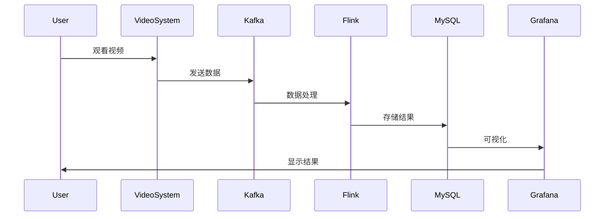

                 

### 实时评测与流处理架构设计

> 关键词：实时评测、流处理架构、系统设计、数据处理、优化策略

> 摘要：本文旨在探讨实时评测与流处理架构设计的关键问题。首先，我们将介绍实时评测与流处理的基本概念和背景，解释它们在现代数据处理中的重要性。接着，我们将深入分析流处理架构的设计原则和常见模型，为后续章节提供理论基础。随后，文章将逐步构建实时评测的流处理模型，并详细描述其数据模型、处理流程和性能优化策略。在此基础上，我们将展示一个实时评测系统架构设计的案例，包括需求分析、功能设计、架构设计、接口设计和系统交互。随后，文章将进行系统实现和案例分析，并总结实战经验。最后，我们将展望实时评测与流处理技术的发展趋势，提出未来工作的方向，并提供给开发者与研究者的建议。本文旨在为读者提供一个系统、全面、易懂的实时评测与流处理架构设计指南。

## 第一部分：引言

### 第1章：实时评测与流处理概述

**1.1.1 实时评测的重要性**

**1.1.2 流处理技术基础**

**1.1.3 实时评测与流处理的关系**

**1.1.4 本书结构安排**

### 第2章：实时评测的背景

**2.1.1 数据处理的发展历程**

**2.1.2 实时数据分析的需求**

**2.1.3 流处理技术的应用领域**

**2.1.4 实时评测的发展背景**

### 第3章：流处理架构设计基础

**3.1.1 流处理架构的概念**

**3.1.2 流处理架构的设计原则**

**3.1.3 常见的流处理架构模型**

**3.1.4 流处理架构的关键组件**

### 第4章：实时评测的流处理模型

**4.1.1 实时评测的数据模型**

**4.1.2 流处理算法选择**

**4.1.3 实时评测的流处理流程**

**4.1.4 实时评测的性能优化**

### 第5章：实时评测系统架构设计

**5.1.1 系统需求分析**

**5.1.2 系统功能设计**

**5.1.3 系统架构设计**

**5.1.4 系统接口设计**

### 第6章：实时评测系统实现

**6.1.1 系统环境搭建**

**6.1.2 数据采集与预处理**

**6.1.3 实时数据处理**

**6.1.4 评测结果分析与可视化**

### 第7章：案例分析与优化

**7.1.1 实时评测案例介绍**

**7.1.2 案例中的流处理架构设计**

**7.1.3 案例实现细节剖析**

**7.1.4 评测优化策略**

### 第8章：总结与展望

**8.1.1 实时评测与流处理的发展趋势**

**8.1.2 未来工作方向**

**8.1.3 开发者与研究者建议**

### 实时评测与流处理架构设计

实时评测与流处理架构设计是现代数据处理领域中的重要话题。随着大数据和实时数据需求的增长，实时评测在各个行业，如金融、电信、电商和医疗等，都变得越来越重要。实时评测能够快速响应和处理数据，提供实时反馈和决策支持，从而提高业务效率和用户体验。

流处理技术是实现实时评测的关键。流处理是一种处理大规模实时数据流的方法，能够在数据产生的同时进行处理和分析，而不需要等待数据完全收集和处理。流处理技术具有高吞吐量、低延迟和可伸缩性等特点，能够满足实时评测的需求。

本书旨在为读者提供一个全面、系统、易懂的实时评测与流处理架构设计指南。通过逐步分析和讲解，读者将了解到实时评测与流处理的基本概念、设计原则、模型构建、系统实现和优化策略。本书不仅适合于初学者，也适用于有经验的开发者和研究人员，为他们提供实用的设计指导和实战经验。

在接下来的章节中，我们将首先介绍实时评测与流处理的基本概念和背景，解释它们在现代数据处理中的重要性。然后，我们将深入分析流处理架构的设计原则和常见模型，为后续章节提供理论基础。接下来，我们将逐步构建实时评测的流处理模型，并详细描述其数据模型、处理流程和性能优化策略。在此基础上，我们将展示一个实时评测系统架构设计的案例，包括需求分析、功能设计、架构设计、接口设计和系统交互。随后，文章将进行系统实现和案例分析，并总结实战经验。最后，我们将展望实时评测与流处理技术的发展趋势，提出未来工作的方向，并提供给开发者与研究者的建议。

通过阅读本书，读者将能够：
1. 理解实时评测和流处理的基本概念和原理。
2. 掌握流处理架构的设计原则和常见模型。
3. 学习构建实时评测的流处理模型和实现策略。
4. 了解实时评测系统架构设计的实践方法和技巧。
5. 获得实时评测与流处理优化策略的最佳实践。
6. 掌握实时评测系统实现的步骤和关键细节。
7. 学会从实际案例中获取经验并进行优化。

让我们一起深入探索实时评测与流处理架构设计的奥秘，开启数据处理的全新篇章。

----------------------------------------------------------------

### 第1章：实时评测与流处理概述

在信息爆炸的时代，数据处理已经成为各行各业的关键环节。实时评测和流处理技术作为数据处理的重要手段，已经逐渐成为现代信息技术领域的研究热点和应用焦点。本章将详细介绍实时评测和流处理的基本概念、重要性以及它们在现代数据处理中的应用，为后续章节的内容提供理论背景和实践基础。

#### 1.1.1 实时评测的重要性

**实时评测的定义**：实时评测（Real-Time Assessment）是指在数据生成的同时或极短时间内对其进行处理和分析，以获取实时结果和反馈的一种数据处理方式。实时评测通常用于需要即时响应的场景，如金融交易监控、网络安全分析、物联网数据监测等。

**实时评测的应用场景**：
- **金融行业**：实时交易分析、市场趋势预测、风险控制。
- **电信行业**：网络流量监控、服务质量评估、故障快速响应。
- **电商行业**：实时搜索排名、个性化推荐、用户行为分析。
- **医疗行业**：实时医疗监控、病情预警、诊断辅助。

**实时评测的优势**：
- **快速响应**：实时评测能够在数据生成的同时进行处理，提供即时反馈。
- **决策支持**：实时评测能够为决策者提供最新的数据和分析结果，支持快速决策。
- **优化业务流程**：通过实时评测，企业能够优化业务流程，提高效率，降低成本。

#### 1.1.2 流处理技术基础

**流处理技术的定义**：流处理（Stream Processing）是一种处理大规模实时数据流的方法。与批量处理不同，流处理能够对实时产生的数据进行持续不断的处理和分析，而不需要等待数据完全收集和处理。

**流处理技术的特点**：
- **高吞吐量**：流处理系统能够处理大量实时数据，保证数据处理的高效率。
- **低延迟**：流处理系统能够在数据生成的同时或极短时间内进行处理，满足实时性要求。
- **可伸缩性**：流处理系统能够根据数据量自动调整资源，保证系统的稳定运行。

**流处理技术的应用领域**：
- **物联网**：实时处理和分析传感器数据，进行设备管理和故障预警。
- **社交媒体**：实时分析用户行为，提供个性化推荐和广告投放。
- **金融科技**：实时交易分析、市场预测和风险管理。
- **工业自动化**：实时监控生产线，优化生产流程和提高效率。

#### 1.1.3 实时评测与流处理的关系

实时评测和流处理是相辅相成的技术。流处理技术为实时评测提供了数据处理的基础，使得实时评测能够在大规模实时数据上进行高效处理和分析。同时，实时评测的需求也推动了流处理技术的发展和完善。

**实时评测对流处理的影响**：
- **驱动技术进步**：实时评测的需求推动了流处理技术的不断改进和优化，提高了数据处理性能和效率。
- **确定处理需求**：实时评测的需求决定了流处理系统的设计方向和功能需求，指导系统的开发和优化。

**流处理对实时评测的作用**：
- **数据处理保障**：流处理技术为实时评测提供了高效的数据处理能力，确保实时评测能够在海量数据中快速获取所需信息。
- **优化系统性能**：流处理技术通过优化数据处理流程，降低延迟，提高实时评测的响应速度和准确性。

#### 1.1.4 本书结构安排

本书将从以下几个方面展开对实时评测与流处理架构设计的讨论：

- **第1章：引言**：介绍实时评测与流处理的基本概念、重要性及其在现代数据处理中的应用。

- **第2章：实时评测的背景**：回顾数据处理的发展历程，探讨实时数据分析的需求和流处理技术的应用领域。

- **第3章：流处理架构设计基础**：深入分析流处理架构的概念、设计原则、常见模型和关键组件。

- **第4章：实时评测的流处理模型**：构建实时评测的流处理模型，包括数据模型、处理流程和性能优化策略。

- **第5章：实时评测系统架构设计**：展示一个实时评测系统架构设计的案例，包括需求分析、功能设计、架构设计、接口设计和系统交互。

- **第6章：实时评测系统实现**：详细描述实时评测系统的实现步骤，包括环境搭建、数据采集与预处理、实时数据处理和评测结果分析。

- **第7章：案例分析与优化**：分析实时评测的实际案例，探讨优化策略和实战经验。

- **第8章：总结与展望**：总结实时评测与流处理的发展趋势，提出未来工作的方向，并提供给开发者与研究者的建议。

通过以上章节的逐步讲解，读者将能够系统地了解实时评测与流处理架构设计的核心内容，掌握相关技术和方法，为实际项目开发和应用提供有力的指导。

#### 1.1.1 实时评测的重要性

实时评测在现代数据处理中扮演着至关重要的角色。其核心在于能够对大量数据进行快速、准确的处理和分析，从而提供即时的反馈和决策支持。以下是实时评测重要性的一些具体方面：

**实时性要求**：在许多应用场景中，实时性是至关重要的。例如，在金融交易领域，每一笔交易的执行都需要快速验证和反馈，以防止欺诈行为和确保交易的安全。在电信网络监控中，实时分析网络流量可以迅速发现异常情况，进行故障排除，保证服务质量。

**数据价值最大化**：实时评测能够迅速捕捉和分析数据，使得数据的价值得以最大化。例如，电商平台的实时用户行为分析可以用于个性化推荐和营销策略优化，从而提高销售额和用户满意度。医疗领域的实时监控和预警系统可以帮助医生迅速诊断病情，提高治疗效果。

**优化业务流程**：通过实时评测，企业能够优化其业务流程，提高效率。例如，在制造业中，实时监控生产线数据可以帮助企业及时调整生产计划，减少停机时间，提高生产效率。在物流领域，实时跟踪货物的状态可以优化运输路线，减少运输成本。

**支持决策制定**：实时评测为决策者提供最新的数据和分析结果，帮助他们做出更加准确的决策。例如，在金融市场，实时数据分析可以帮助投资者捕捉市场动态，做出及时的投资决策。在公共卫生领域，实时疫情数据分析可以协助政府部门制定疫情防控策略。

**提高用户体验**：在许多消费者导向的行业，如电商、社交媒体和在线服务，实时评测能够提供更好的用户体验。例如，在线购物平台可以通过实时搜索分析和用户行为预测，提供个性化的商品推荐，提升用户满意度和粘性。

**快速响应需求变化**：实时评测能够迅速响应需求变化，使得企业能够快速调整策略和运营。例如，电商平台在大型促销活动期间，可以通过实时数据监控和预测，动态调整库存和物流安排，确保商品能够及时供应。

综上所述，实时评测的重要性体现在其能够提供快速、准确的数据处理和分析，从而支持各种业务场景下的决策制定、流程优化和用户体验提升。随着大数据和实时数据处理技术的发展，实时评测的应用场景和影响力将不断扩展，成为现代数据处理不可或缺的一部分。

#### 1.1.2 流处理技术基础

流处理技术是现代数据处理领域的关键技术之一，它为处理大规模实时数据提供了高效且灵活的解决方案。在深入了解实时评测与流处理的关系之前，我们需要首先了解流处理技术的基本概念、原理和应用。

**流处理技术的定义**：流处理（Stream Processing）是指对实时生成或连续变化的数据流进行持续、高效处理和分析的技术。与传统的批量处理（Batch Processing）不同，流处理专注于处理实时数据，不等待数据集完全收集后再进行处理。这种处理方式能够实现低延迟和高吞吐量的数据处理。

**流处理技术的特点**：
1. **实时性**：流处理技术能够对数据流进行实时处理，确保数据在生成后立即得到处理和分析。
2. **低延迟**：由于流处理的实时性，系统能够在极短时间内对数据进行处理，满足低延迟的需求。
3. **高吞吐量**：流处理系统能够处理大量数据，支持大规模数据处理需求。
4. **可伸缩性**：流处理系统能够根据数据量和处理需求动态调整资源，保证系统的高可用性和稳定性。

**流处理技术的应用领域**：
流处理技术已被广泛应用于多个领域，以下是一些典型应用场景：
1. **物联网**：实时处理和分析传感器数据，用于设备管理、故障预警和优化。
2. **金融科技**：实时交易监控、市场趋势预测和风险管理。
3. **社交媒体**：实时分析用户行为数据，用于个性化推荐、广告投放和用户互动分析。
4. **电信行业**：网络流量监控、服务质量评估和故障快速响应。
5. **电子商务**：实时用户行为分析、个性化推荐和实时库存管理。
6. **医疗健康**：实时医疗监控、病情预警和诊断辅助。
7. **交通管理**：实时交通流量监控、路线优化和突发事件响应。

**流处理技术的架构**：
流处理架构通常由以下几个关键组件组成：
1. **数据源**：数据源是流处理系统的输入，可以是各种传感器、设备、API或者实时数据流。
2. **数据采集器**：数据采集器负责从数据源中获取数据，并将其转换为流处理系统能够处理的形式。
3. **流处理器**：流处理器是流处理系统的核心，负责对数据流进行实时处理和分析。常见的流处理器包括Apache Kafka、Apache Flink、Apache Spark Streaming等。
4. **存储系统**：流处理结果通常需要存储，以便后续查询和分析。常用的存储系统包括Hadoop HDFS、Apache Kafka、Apache Druid等。
5. **结果展示**：流处理结果需要通过可视化工具或API进行展示，以便用户实时查看和分析。

**流处理的工作流程**：
1. **数据采集**：数据源将数据发送到数据采集器。
2. **数据转换**：数据采集器将原始数据转换为适合流处理器处理的数据格式。
3. **数据流处理**：流处理器对数据进行实时处理，包括数据清洗、转换、聚合和分析等操作。
4. **存储与查询**：处理后的数据被存储到存储系统中，供后续查询和分析使用。
5. **结果展示**：通过可视化工具或API将处理结果展示给用户，支持实时监控和决策制定。

**流处理技术的优势**：
1. **高效处理**：流处理技术能够对实时数据流进行高效处理，保证低延迟和高吞吐量。
2. **动态扩展**：流处理系统能够根据数据量和处理需求动态调整资源，保证系统的高可用性和可扩展性。
3. **实时分析**：流处理技术支持实时数据分析，使得企业能够迅速响应市场变化和业务需求。
4. **灵活可定制**：流处理系统通常提供丰富的处理框架和工具，支持自定义数据处理逻辑和算法。

**流处理技术的挑战**：
1. **数据一致性和准确性**：流处理过程中需要确保数据的一致性和准确性，避免数据丢失或错误。
2. **资源管理**：流处理系统需要高效管理计算资源和存储资源，以优化系统性能和成本。
3. **复杂性和维护**：流处理系统通常较为复杂，需要专业的技术团队进行开发和维护。

综上所述，流处理技术为现代数据处理提供了强大的支持，其高效、实时和可扩展的特点使其在多个领域中得到了广泛应用。理解流处理技术的基础知识对于构建实时评测系统具有重要意义，为后续章节的内容提供了坚实的理论基础。

#### 1.1.3 实时评测与流处理的关系

实时评测和流处理是相辅相成的技术，它们在现代数据处理中共同发挥着重要作用。实时评测依赖于流处理技术来实现高效、实时的大规模数据处理，而流处理技术则为实时评测提供了强大的数据处理能力和技术支持。

**实时评测对流处理的影响**：

1. **驱动技术进步**：实时评测的需求推动了流处理技术的不断改进和优化。为了满足实时评测对低延迟和高吞吐量的要求，流处理技术需要持续优化其数据处理算法和架构设计。例如，流处理框架如Apache Kafka和Apache Flink不断引入新的技术和方法，提高数据处理性能和效率。

2. **确定处理需求**：实时评测的需求决定了流处理系统的设计方向和功能需求。不同的实时评测场景对数据处理的要求各不相同，这要求流处理系统具备灵活性和可定制性。例如，在金融交易领域，实时评测需要处理大量的交易数据，并且对数据的准确性有极高的要求。这要求流处理系统具备高效的数据清洗、转换和聚合能力。

**流处理对实时评测的作用**：

1. **数据处理保障**：流处理技术为实时评测提供了高效的数据处理能力，确保实时评测能够在海量数据中快速获取所需信息。流处理系统能够实时处理数据流，进行数据清洗、转换、聚合和分析，从而为实时评测提供准确、及时的数据支持。

2. **优化系统性能**：流处理技术通过优化数据处理流程，降低延迟，提高实时评测的响应速度和准确性。流处理框架提供的并行处理和分布式计算能力，使得实时评测系统能够处理大规模数据，提高数据处理效率和系统性能。

3. **支持复杂分析**：流处理技术支持复杂的数据分析和挖掘算法，使得实时评测能够进行更加深入的数据分析。例如，流处理系统可以应用机器学习和人工智能算法，对实时数据进行预测和模式识别，从而提供更加准确的实时评测结果。

**实时评测与流处理的结合**：

1. **数据流与事件驱动**：实时评测通常依赖于数据流和事件驱动的方式进行。流处理技术能够对实时数据流进行持续监控和处理，捕捉事件变化，为实时评测提供数据支持。通过事件驱动的方式，实时评测能够迅速响应数据变化，提供实时反馈和决策支持。

2. **实时反馈与闭环控制**：实时评测与流处理技术的结合可以实现实时反馈和闭环控制。流处理系统实时处理和分析数据，将结果反馈给实时评测系统，评测系统根据反馈结果进行调整和优化。这种闭环控制机制能够提高系统的自适应性和响应速度，确保实时评测的准确性和有效性。

3. **动态调整与优化**：实时评测与流处理技术的结合使得系统能够根据实时数据的变化动态调整处理策略和资源分配。流处理技术提供的可伸缩性和动态扩展能力，使得实时评测系统能够在数据量波动或处理需求变化时保持高效运行。通过动态调整和优化，实时评测系统能够保持最佳性能和响应速度。

综上所述，实时评测与流处理技术密不可分，它们在现代数据处理中相互促进、共同发展。实时评测依赖于流处理技术来实现高效、实时的大规模数据处理，而流处理技术则为实时评测提供了强大的数据处理能力和技术支持。理解实时评测与流处理的关系，有助于我们更好地设计和实现实时评测系统，提高数据处理效率和系统性能。

#### 1.1.4 本书结构安排

本书旨在为读者提供一个全面、系统、易懂的实时评测与流处理架构设计指南。为了帮助读者逐步掌握相关知识，本书分为八个主要章节，每章都有明确的主题和目标，具体安排如下：

- **第1章：实时评测与流处理概述**：介绍实时评测和流处理的基本概念、重要性以及它们在现代数据处理中的应用。通过本章的学习，读者将了解实时评测与流处理的核心内容，为后续章节的学习打下基础。

- **第2章：实时评测的背景**：回顾数据处理的发展历程，探讨实时数据分析的需求和流处理技术的应用领域。本章将帮助读者理解实时评测的背景和发展趋势，以及流处理技术在不同领域中的应用。

- **第3章：流处理架构设计基础**：深入分析流处理架构的概念、设计原则、常见模型和关键组件。本章将为读者提供流处理架构设计的理论基础，包括各种流处理框架和技术的介绍。

- **第4章：实时评测的流处理模型**：构建实时评测的流处理模型，包括数据模型、处理流程和性能优化策略。本章将详细描述实时评测的数据处理方法和优化策略，为实际系统设计提供参考。

- **第5章：实时评测系统架构设计**：展示一个实时评测系统架构设计的案例，包括需求分析、功能设计、架构设计、接口设计和系统交互。本章将提供一个具体的实时评测系统设计案例，帮助读者了解系统架构设计的实践方法和技巧。

- **第6章：实时评测系统实现**：详细描述实时评测系统的实现步骤，包括环境搭建、数据采集与预处理、实时数据处理和评测结果分析。本章将带领读者实际操作，掌握实时评测系统的实现细节和关键步骤。

- **第7章：案例分析与优化**：分析实时评测的实际案例，探讨优化策略和实战经验。本章将结合实际案例，深入剖析实时评测系统的实现过程和优化方法，为读者提供宝贵的实战经验。

- **第8章：总结与展望**：总结实时评测与流处理的发展趋势，提出未来工作的方向，并提供给开发者与研究者的建议。本章将对全书内容进行总结，展望实时评测与流处理技术的发展前景，为读者提供未来的研究和发展方向。

通过以上章节的逐步讲解，读者将能够系统地了解实时评测与流处理架构设计的核心内容，掌握相关技术和方法，为实际项目开发和应用提供有力的指导。本书不仅适合初学者，也适用于有经验的开发者和研究人员，希望能够对读者的学习和工作有所帮助。

----------------------------------------------------------------

### 第2章：实时评测的背景

实时评测在现代数据处理中具有举足轻重的地位，其发展背景和需求源于数据处理技术的发展和实际应用场景的复杂化。本章将回顾数据处理的发展历程，探讨实时数据分析的需求和流处理技术的应用领域，并分析实时评测的发展背景。

#### 2.1.1 数据处理的发展历程

数据处理技术的发展经历了几个重要阶段：

1. **早期阶段**：在计算机出现之前，数据处理主要依赖于手工记录和纸质文档。随着计算机的诞生，数据处理开始走向自动化，数据存储和处理能力得到了显著提升。

2. **批量处理阶段**：在计算机早期应用中，数据处理主要以批量处理为主。批量处理是将数据按批次处理，优点是操作简单、成本低，但缺点是处理速度慢，无法满足实时性需求。

3. **实时处理阶段**：随着网络和计算技术的发展，实时数据处理逐渐成为数据处理的主流。实时处理能够对数据流进行实时监控和处理，满足低延迟和高吞吐量的需求。

4. **流处理阶段**：流处理技术是对实时数据流进行持续、高效处理的一种方法。流处理系统具备低延迟、高吞吐量和可伸缩性等特点，适用于处理大规模实时数据。

#### 2.1.2 实时数据分析的需求

实时数据分析的需求源于以下几方面：

1. **决策支持**：实时数据分析能够为决策者提供最新的数据和分析结果，帮助他们快速做出准确决策。在金融、医疗、电信等行业，实时数据分析已经成为业务运营和风险管理的重要手段。

2. **用户体验**：在电商、社交媒体和在线服务等领域，实时数据分析能够提高用户体验。例如，实时推荐系统可以根据用户行为数据提供个性化的商品推荐，增加用户满意度和粘性。

3. **业务优化**：实时数据分析可以帮助企业优化业务流程，提高运营效率。例如，在制造业中，实时监控生产线数据可以及时调整生产计划，减少停机时间，提高生产效率。

4. **风险控制**：实时数据分析能够实时监控和预警潜在风险，帮助企业及时采取措施进行风险控制。例如，在金融行业，实时交易监控可以及时发现欺诈行为，防止损失。

#### 2.1.3 流处理技术的应用领域

流处理技术在多个领域得到了广泛应用，以下是一些典型应用场景：

1. **物联网**：物联网设备产生的数据量庞大且实时性要求高，流处理技术能够实时处理和分析传感器数据，用于设备管理、故障预警和优化。

2. **金融科技**：金融交易实时监控、市场趋势预测和风险管理是金融科技的重要应用领域。流处理技术能够对大量交易数据实时分析，提供实时风险预警和决策支持。

3. **电信行业**：电信网络流量监控、服务质量评估和故障快速响应是电信行业的关键需求。流处理技术能够实时分析网络数据，确保网络的高效运行。

4. **电子商务**：实时用户行为分析、个性化推荐和实时库存管理是电子商务领域的核心需求。流处理技术能够实时分析用户行为数据，提供个性化的推荐和优化库存管理。

5. **医疗健康**：实时医疗监控、病情预警和诊断辅助是医疗健康领域的重要应用。流处理技术能够实时分析医疗数据，提供准确的诊断和预警。

6. **交通管理**：实时交通流量监控、路线优化和突发事件响应是交通管理领域的关键需求。流处理技术能够实时分析交通数据，优化路线和应对突发事件。

7. **社交媒体**：实时分析用户行为数据，用于个性化推荐、广告投放和用户互动分析是社交媒体领域的重要应用。流处理技术能够实时捕捉和分析用户行为数据，提供个性化的内容和广告。

#### 2.1.4 实时评测的发展背景

实时评测的发展背景可以从以下几个方面进行概述：

1. **技术进步**：随着流处理技术的不断发展，实时数据处理能力得到了显著提升。流处理技术能够高效处理大规模实时数据，为实时评测提供了技术基础。

2. **应用需求**：随着信息技术的普及和应用场景的多样化，实时评测在金融、医疗、电商、电信等领域的需求不断增加。实时评测能够为这些行业提供实时反馈和决策支持，提高业务效率和用户体验。

3. **数据分析技术的提升**：实时数据分析技术的提升为实时评测提供了更多可能。通过应用机器学习和人工智能算法，实时评测能够进行更复杂的数据分析，提供更准确和有价值的分析结果。

4. **数据量增长**：随着物联网、社交媒体和大数据技术的发展，数据量呈现爆炸式增长。实时评测能够实时处理和分析这些海量数据，为企业提供实时洞察和决策支持。

5. **竞争压力**：在竞争激烈的市场环境中，企业需要快速响应市场变化和客户需求。实时评测能够提供实时反馈和决策支持，帮助企业抢占市场先机。

综上所述，实时评测的发展背景源于数据处理技术的发展、应用需求的增加、数据分析技术的提升和数据量的增长。随着流处理技术和人工智能的不断发展，实时评测将在更多领域得到广泛应用，为企业和个人提供更加高效和精准的数据分析服务。

### 第3章：流处理架构设计基础

流处理架构设计是实时评测系统实现的关键。为了确保系统的高效性、可靠性和可伸缩性，了解流处理架构的基础知识是必要的。本章将深入分析流处理架构的概念、设计原则、常见模型和关键组件，为后续章节提供理论基础。

#### 3.1.1 流处理架构的概念

流处理架构是一种处理大规模实时数据流的方法，它通过持续、高效地处理数据流来满足实时性需求。流处理架构的核心思想是将数据视为一系列连续的事件或流，并在这些事件发生的瞬间进行实时处理。与传统的批量处理相比，流处理具有低延迟和高吞吐量的特点。

**流处理架构的组成部分**：

1. **数据源**：数据源是流处理系统的输入，可以是各种传感器、设备、API或者实时数据流。

2. **数据采集器**：数据采集器负责从数据源获取数据，并将其转换为适合流处理器处理的数据格式。

3. **流处理器**：流处理器是流处理系统的核心，负责对数据流进行实时处理和分析。常见的流处理器包括Apache Kafka、Apache Flink、Apache Spark Streaming等。

4. **存储系统**：流处理结果通常需要存储，以便后续查询和分析。常用的存储系统包括Hadoop HDFS、Apache Kafka、Apache Druid等。

5. **结果展示**：流处理结果需要通过可视化工具或API进行展示，以便用户实时查看和分析。

**流处理架构的特点**：

- **实时性**：流处理架构能够在数据生成的同时进行处理，满足低延迟需求。

- **高吞吐量**：流处理架构能够处理大规模数据流，保证高吞吐量。

- **可伸缩性**：流处理架构能够根据数据量和处理需求动态调整资源，保证系统的高可用性和稳定性。

#### 3.1.2 流处理架构的设计原则

在设计流处理架构时，需要遵循以下原则，以确保系统的高效性和可靠性：

1. **模块化设计**：将系统划分为多个模块，每个模块负责特定的功能。模块化设计有助于提高系统的可维护性和可扩展性。

2. **分布式计算**：流处理架构通常采用分布式计算模型，通过多台服务器协同工作，提高系统的处理能力和容错性。

3. **数据一致性**：确保数据在处理过程中的一致性，避免数据丢失或错误。常用的方法包括数据复制、分布式事务和一致性协议。

4. **容错性**：流处理架构需要具备容错能力，能够在处理过程中自动恢复故障。常见的容错机制包括数据冗余、自动恢复和故障转移。

5. **可伸缩性**：流处理架构需要具备可伸缩性，能够根据数据量和处理需求动态调整资源。常见的伸缩策略包括水平扩展、垂直扩展和负载均衡。

6. **易维护性**：设计简洁、结构清晰的系统，便于后续的维护和升级。

#### 3.1.3 常见的流处理架构模型

流处理架构模型有多种，以下是一些常见的架构模型：

1. **单一节点模型**：单一节点模型是指流处理架构仅由一个节点组成，负责整个数据处理的流程。这种模型简单易实现，但处理能力和容错性有限。

2. **分布式计算模型**：分布式计算模型通过多个节点协同工作，实现大规模数据处理。每个节点负责部分数据处理任务，节点之间通过通信机制进行协调。常见的分布式计算模型包括MapReduce、Apache Kafka和Apache Flink。

3. **流计算模型**：流计算模型专注于处理实时数据流，具有低延迟和高吞吐量的特点。常见的流计算模型包括Apache Spark Streaming、Apache Flink和Apache Storm。

4. **微服务模型**：微服务模型将流处理架构分解为多个独立的服务，每个服务负责特定的数据处理任务。微服务模型具有高可扩展性和灵活性，便于系统的维护和升级。

5. **混合模型**：混合模型将多种架构模型结合起来，根据不同的数据处理需求选择合适的模型。例如，在处理大规模实时数据时，可以结合流计算模型和批量处理模型，实现高效的数据处理和分析。

#### 3.1.4 流处理架构的关键组件

流处理架构的关键组件包括数据源、数据采集器、流处理器、存储系统和结果展示。以下是对每个组件的详细介绍：

1. **数据源**：数据源是流处理系统的输入，可以是各种传感器、设备、API或者实时数据流。数据源通常生成大量连续的数据流，需要通过数据采集器进行收集和处理。

2. **数据采集器**：数据采集器负责从数据源获取数据，并将其转换为适合流处理器处理的数据格式。数据采集器通常采用分布式架构，以提高数据采集和处理能力。

3. **流处理器**：流处理器是流处理系统的核心，负责对数据流进行实时处理和分析。流处理器支持多种数据处理操作，如数据清洗、转换、聚合和分析等。常见的流处理器包括Apache Kafka、Apache Flink和Apache Spark Streaming。

4. **存储系统**：流处理结果通常需要存储，以便后续查询和分析。常用的存储系统包括Hadoop HDFS、Apache Kafka和Apache Druid。存储系统需要保证数据的一致性和可靠性，并提供高效的数据查询能力。

5. **结果展示**：流处理结果需要通过可视化工具或API进行展示，以便用户实时查看和分析。结果展示组件通常提供实时图表、报表和监控功能，帮助用户理解数据处理结果。

综上所述，流处理架构设计基础是实时评测系统实现的关键。了解流处理架构的概念、设计原则、常见模型和关键组件，有助于我们设计高效、可靠和可伸缩的流处理系统。通过本章的学习，读者将能够为后续章节的实时评测系统架构设计提供坚实的理论基础。

#### 3.1.3 常见的流处理架构模型

流处理架构模型是处理大规模实时数据流的关键。不同的架构模型适用于不同的应用场景，它们各自具有独特的优势和局限性。以下介绍几种常见的流处理架构模型。

1. **单一节点模型**

单一节点模型是指流处理架构仅由一个节点组成，负责整个数据处理的流程。这种模型具有简单、易实现的优点，但处理能力和容错性有限。单一节点模型适用于处理数据量较小、实时性要求不高的场景。

**优势**：
- **简单性**：系统架构简单，易于开发和维护。
- **低延迟**：由于数据仅在单个节点上进行处理，可以保证较低的处理延迟。

**局限性**：
- **处理能力有限**：单个节点处理能力有限，无法处理大规模数据流。
- **容错性差**：系统缺乏容错机制，一旦节点故障，整个系统将无法正常运行。

2. **分布式计算模型**

分布式计算模型通过多个节点协同工作，实现大规模数据处理。每个节点负责部分数据处理任务，节点之间通过通信机制进行协调。常见的分布式计算模型包括MapReduce、Apache Kafka和Apache Flink。

**优势**：
- **高处理能力**：分布式计算模型可以充分利用多台服务器的计算资源，提高系统的处理能力。
- **容错性高**：分布式计算模型具有自动恢复和故障转移机制，确保系统的可靠性。
- **可伸缩性**：系统可以根据处理需求动态调整节点数量，提高系统的可伸缩性。

**局限性**：
- **复杂性**：分布式计算模型结构复杂，需要解决数据一致性和节点协调等问题。
- **高网络开销**：节点之间需要频繁通信，增加网络开销和延迟。

3. **流计算模型**

流计算模型专注于处理实时数据流，具有低延迟和高吞吐量的特点。常见的流计算模型包括Apache Spark Streaming、Apache Flink和Apache Storm。

**优势**：
- **低延迟**：流计算模型能够实时处理数据流，满足低延迟需求。
- **高吞吐量**：流计算模型可以处理大规模数据流，保证高吞吐量。
- **易于编程**：流计算模型提供丰富的API和编程接口，便于开发者进行数据处理。

**局限性**：
- **资源需求高**：流计算模型需要大量的计算资源和存储资源，适用于资源充足的环境。
- **数据一致性**：在分布式流计算环境中，确保数据一致性是一个挑战。

4. **微服务模型**

微服务模型将流处理架构分解为多个独立的服务，每个服务负责特定的数据处理任务。微服务模型具有高可扩展性和灵活性，便于系统的维护和升级。

**优势**：
- **高可扩展性**：微服务模型可以根据需求动态调整服务数量，提高系统的可扩展性。
- **高灵活性**：微服务模型支持不同的服务使用不同的技术栈，满足多样化的数据处理需求。
- **易于维护**：微服务模型便于系统分片和独立维护，提高系统的可维护性。

**局限性**：
- **复杂性**：微服务模型结构复杂，需要解决服务之间的通信和协调问题。
- **分布式问题**：微服务模型可能面临分布式计算和数据一致性问题。

5. **混合模型**

混合模型将多种架构模型结合起来，根据不同的数据处理需求选择合适的模型。例如，在处理大规模实时数据时，可以结合流计算模型和批量处理模型，实现高效的数据处理和分析。

**优势**：
- **灵活性**：混合模型可以根据不同的处理需求选择合适的架构模型，提高系统的灵活性。
- **高效性**：混合模型能够结合不同模型的优势，实现高效的数据处理和分析。

**局限性**：
- **复杂性**：混合模型结构复杂，需要解决多个模型之间的协调和优化问题。
- **资源浪费**：在某些情况下，混合模型可能造成资源浪费。

综上所述，常见的流处理架构模型各有优缺点，适用于不同的应用场景。在设计流处理架构时，需要根据实际需求和资源情况，选择合适的模型，以实现高效、可靠和可伸缩的数据处理系统。

#### 3.1.4 流处理架构的关键组件

流处理架构的设计涉及多个关键组件，这些组件协同工作，实现高效、可靠的实时数据处理。以下是对这些关键组件的详细描述：

1. **数据源**

数据源是流处理系统的输入，可以是各种传感器、设备、API或者实时数据流。数据源产生大量的数据，这些数据需要经过采集、转换和处理，以满足流处理系统的需求。

**作用**：
- **数据输入**：数据源提供实时数据流，是流处理系统的起点。
- **多样性**：数据源可以是多种类型，如文本、图像、音频、传感器数据等。

**挑战**：
- **数据一致性**：确保数据源的稳定性和一致性，避免数据丢失或错误。
- **数据格式**：处理不同格式的数据，需要数据源提供统一的数据接口或转换机制。

2. **数据采集器**

数据采集器负责从数据源获取数据，并将其转换为适合流处理器处理的数据格式。数据采集器通常采用分布式架构，以提高数据采集和处理能力。

**作用**：
- **数据采集**：数据采集器从多个数据源获取数据，并将其转换为统一的格式。
- **预处理**：对数据进行清洗、过滤和转换，确保数据的质量和一致性。

**挑战**：
- **数据同步**：确保不同数据源的数据能够同步采集和处理。
- **网络带宽**：处理大量数据时，需要考虑网络带宽的限制。

3. **流处理器**

流处理器是流处理系统的核心，负责对数据流进行实时处理和分析。流处理器支持多种数据处理操作，如数据清洗、转换、聚合和分析等。常见的流处理器包括Apache Kafka、Apache Flink和Apache Spark Streaming。

**作用**：
- **数据处理**：对流数据进行清洗、转换和聚合，生成中间结果。
- **实时分析**：对数据流进行分析，提供实时洞察和决策支持。

**挑战**：
- **处理延迟**：降低处理延迟，保证系统的实时性。
- **资源管理**：合理分配计算资源，优化系统性能和效率。

4. **存储系统**

流处理结果通常需要存储，以便后续查询和分析。常用的存储系统包括Hadoop HDFS、Apache Kafka和Apache Druid。存储系统需要保证数据的一致性和可靠性，并提供高效的数据查询能力。

**作用**：
- **数据存储**：将处理后的数据存储到存储系统中，供后续查询和分析。
- **数据持久化**：确保数据的持久性和可靠性，避免数据丢失。

**挑战**：
- **数据一致性**：确保数据在处理和存储过程中的一致性。
- **查询性能**：优化存储系统的查询性能，提高数据处理和分析效率。

5. **结果展示**

流处理结果需要通过可视化工具或API进行展示，以便用户实时查看和分析。结果展示组件通常提供实时图表、报表和监控功能，帮助用户理解数据处理结果。

**作用**：
- **数据可视化**：将处理结果以图表、报表等形式展示，提供直观的数据分析。
- **用户交互**：提供用户交互界面，支持用户实时监控和操作。

**挑战**：
- **界面设计**：设计简洁、易用的用户界面，提高用户体验。
- **实时更新**：确保处理结果能够实时更新，反映最新的数据状态。

综上所述，流处理架构的关键组件相互协作，共同实现高效、可靠的实时数据处理。了解这些组件的作用和挑战，有助于设计出性能优越、稳定可靠的流处理系统。

### 第4章：实时评测的流处理模型

实时评测的流处理模型是构建高效、实时数据处理系统的关键。本章将详细描述实时评测的流处理模型，包括数据模型、处理流程和性能优化策略，为实际系统设计提供理论依据和实践指导。

#### 4.1.1 实时评测的数据模型

实时评测的数据模型是流处理模型的基础，它定义了数据的结构、类型和属性。一个良好的数据模型能够提高数据处理效率和系统性能。

**数据类型**：

实时评测的数据类型包括但不限于以下几种：

1. **文本数据**：如日志文件、用户评论等。
2. **数值数据**：如交易金额、温度传感器读数等。
3. **图像数据**：如监控摄像头捕获的图像、医学影像等。
4. **时间序列数据**：如股票价格、传感器时间戳等。

**数据结构**：

实时评测的数据结构通常包括以下组成部分：

1. **数据字段**：每个数据记录包含多个字段，如用户ID、交易金额、时间戳等。
2. **数据记录**：多个数据字段组成一个数据记录，代表一个具体的数据实例。
3. **数据流**：数据记录以流的形式连续生成，形成一个连续的数据流。

**数据属性**：

实时评测的数据属性包括数据来源、数据频率、数据大小和数据质量等。数据来源可以是传感器、用户输入或外部API；数据频率可以是一秒一次、一分钟一次等；数据大小可以是大批量数据或小批量数据；数据质量包括数据的完整性、准确性和一致性等。

#### 4.1.2 流处理算法选择

流处理算法是实现实时评测的核心，选择合适的算法对于提高系统性能和准确性至关重要。以下是一些常见的流处理算法及其适用场景：

1. **过滤算法**：用于筛选出满足特定条件的数据记录。常见的过滤算法包括条件过滤、范围过滤等。

2. **转换算法**：用于将数据记录转换为其他格式或结构。常见的转换算法包括类型转换、字段提取、数据归一化等。

3. **聚合算法**：用于对一组数据记录进行计算和汇总。常见的聚合算法包括求和、平均值、最大值、最小值等。

4. **关联规则算法**：用于发现数据之间的关联关系。常见的关联规则算法包括Apriori算法、FP-Growth算法等。

5. **聚类算法**：用于将相似的数据记录分组。常见的聚类算法包括K-means算法、DBSCAN算法等。

6. **分类算法**：用于将数据记录分类到不同的类别。常见的分类算法包括决策树、支持向量机、神经网络等。

7. **预测算法**：用于对未来的数据趋势进行预测。常见的预测算法包括时间序列预测、线性回归、ARIMA模型等。

选择合适的流处理算法需要考虑以下因素：

1. **数据处理需求**：根据实时评测的具体需求选择合适的算法。
2. **数据特性**：考虑数据的类型、结构和属性，选择适合的数据处理算法。
3. **性能要求**：根据系统的性能需求选择高效的算法。
4. **可扩展性**：考虑算法的可扩展性，以便在未来能够处理更大规模的数据。

#### 4.1.3 实时评测的流处理流程

实时评测的流处理流程包括数据采集、数据预处理、数据处理、结果存储和结果展示等环节。以下是一个典型的实时评测流处理流程：

1. **数据采集**：从各种数据源（如传感器、用户输入、API等）获取实时数据流，并进行初步的数据采集和清洗。

2. **数据预处理**：对采集到的数据进行预处理，包括数据清洗（去除噪声、纠正错误）、数据转换（格式转换、字段提取）和数据规范化（统一数据格式和单位）。

3. **数据处理**：根据实时评测的需求，对预处理后的数据进行各种流处理操作，如过滤、转换、聚合、分类和预测等。

4. **结果存储**：将处理后的数据存储到数据库或数据仓库中，以便后续查询和分析。

5. **结果展示**：通过可视化工具或API将处理结果展示给用户，支持实时监控和决策制定。

实时评测的流处理流程需要具备以下特点：

1. **实时性**：流处理流程能够在极短时间内完成数据处理，提供实时反馈。
2. **高吞吐量**：流处理系统能够处理大量实时数据，保证数据处理的高效率。
3. **可伸缩性**：流处理系统能够根据数据量和处理需求动态调整资源，保证系统的稳定运行。
4. **可靠性**：流处理流程需要确保数据的一致性和准确性，避免数据丢失或错误。

#### 4.1.4 实时评测的性能优化策略

实时评测的性能优化是流处理系统设计的重要环节，以下是一些常见的性能优化策略：

1. **数据分片**：将数据流按特定规则分片，分配到不同的流处理器节点，以均衡负载和提高系统性能。

2. **并行处理**：利用多线程或分布式计算，并行处理多个数据流或数据处理任务，提高系统的吞吐量和处理效率。

3. **缓存机制**：引入缓存机制，存储常用或热点数据，减少重复计算和数据访问时间。

4. **资源调优**：根据系统的实际运行情况，动态调整资源分配（如CPU、内存、网络带宽等），优化系统性能。

5. **负载均衡**：通过负载均衡算法，合理分配数据处理任务到不同的节点，避免节点过载和资源浪费。

6. **数据压缩**：对数据流进行压缩，减少数据传输和存储的开销，提高系统性能。

7. **算法优化**：根据具体应用场景和数据处理需求，选择合适的算法和优化策略，提高数据处理效率和准确性。

8. **监控与告警**：引入监控和告警机制，实时监控系统的运行状态和性能指标，及时发现问题并进行优化。

通过以上性能优化策略，实时评测系统可以在大规模、高并发的实时数据处理场景中保持高效、稳定和可靠的运行。

#### 4.1.5 实时评测的流处理模型案例

为了更好地理解实时评测的流处理模型，以下通过一个具体案例进行说明。

**案例背景**：某电商平台的实时用户行为分析系统，用于实时监测用户浏览、点击、购买等行为，提供个性化推荐和营销策略优化。

**数据模型**：
- **用户行为数据**：包含用户ID、时间戳、行为类型（浏览、点击、购买等）、行为内容（商品ID、价格等）。
- **商品信息数据**：包含商品ID、商品名称、类别、价格等。

**流处理流程**：
1. **数据采集**：从电商平台的数据源（如Web日志、API接口等）获取用户行为数据。
2. **数据预处理**：对采集到的用户行为数据进行清洗和转换，如去除无效记录、字段提取、时间戳标准化等。
3. **数据处理**：
   - **行为过滤**：过滤出有效的用户行为数据，如去除重复记录、异常数据等。
   - **行为聚合**：对用户行为数据进行聚合，如统计用户浏览、点击、购买次数等。
   - **用户标签生成**：基于用户行为数据生成用户标签，如“高频购买用户”、“偏好某类商品用户”等。
   - **商品推荐**：基于用户标签和商品信息，生成个性化推荐列表。
4. **结果存储**：将处理后的用户行为数据和推荐结果存储到数据库或数据仓库中，供后续查询和分析。
5. **结果展示**：通过可视化工具或API将处理结果展示给电商平台运营人员，支持实时监控和决策制定。

**性能优化策略**：
1. **数据分片**：将用户行为数据按时间或用户ID分片，分配到不同的流处理器节点，均衡负载。
2. **并行处理**：利用多线程或分布式计算，并行处理多个数据处理任务，提高系统吞吐量。
3. **缓存机制**：引入缓存机制，存储常用或热点数据（如用户标签、推荐列表等），减少重复计算和数据访问时间。
4. **负载均衡**：通过负载均衡算法，合理分配数据处理任务到不同的节点，避免节点过载和资源浪费。
5. **数据压缩**：对数据流进行压缩，减少数据传输和存储的开销，提高系统性能。
6. **算法优化**：选择高效的算法和优化策略，如使用基于相似度的推荐算法，提高推荐准确性。

通过以上案例，我们可以看到实时评测的流处理模型在电商平台的实际应用中，通过高效的数据处理和分析，实现了用户行为监测、个性化推荐和营销策略优化的目标。

#### 4.1.6 实时评测的流处理模型总结

实时评测的流处理模型是数据处理系统的核心，它决定了系统在实时性、性能和可靠性方面的表现。本章通过详细介绍实时评测的数据模型、流处理算法选择、处理流程和性能优化策略，为读者提供了构建高效实时评测系统的理论基础和实践指导。

**实时评测的数据模型**是流处理模型的基础，定义了数据的类型、结构和属性。通过合理设计数据模型，可以确保数据的一致性和可靠性，提高数据处理效率。

**流处理算法选择**是实现实时评测的关键。根据不同的应用场景和数据处理需求，选择合适的算法可以显著提高系统的性能和准确性。本章介绍了多种常见的流处理算法，包括过滤、转换、聚合、分类和预测等，并提供选择算法的指导原则。

**实时评测的流处理流程**涵盖了数据采集、预处理、数据处理、结果存储和结果展示等环节。一个典型的实时评测流处理流程需要具备实时性、高吞吐量和可伸缩性等特点，以便在复杂的实时数据处理场景中保持高效稳定的运行。

**性能优化策略**是确保实时评测系统高效运行的重要手段。通过数据分片、并行处理、缓存机制、负载均衡和数据压缩等策略，可以显著提高系统的性能和稳定性。此外，引入监控和告警机制，实时监控系统的运行状态和性能指标，有助于及时发现问题并进行优化。

通过本章的讨论，读者可以全面了解实时评测的流处理模型，并掌握构建高效实时评测系统的关键技术和方法。在实际应用中，可以根据具体需求和场景，灵活运用这些技术和策略，实现实时性、性能和可靠性的平衡，为企业和个人提供优质的数据分析服务。

### 第5章：实时评测系统架构设计

实时评测系统架构设计是确保系统高效、可靠运行的关键。本章将详细介绍实时评测系统的需求分析、功能设计、系统架构设计、接口设计和系统交互，帮助读者理解和实现一个完整的实时评测系统。

#### 5.1.1 系统需求分析

**需求分析**是系统架构设计的起点，它明确了系统的功能需求和性能要求。以下是实时评测系统的主要需求：

1. **功能需求**：
   - 数据采集：从多种数据源（如数据库、API、日志文件等）实时获取数据。
   - 数据预处理：对采集到的数据进行清洗、过滤和转换，确保数据质量。
   - 实时处理：对预处理后的数据进行实时处理，包括过滤、转换、聚合和预测等操作。
   - 结果存储：将处理后的数据存储到数据库或数据仓库中，便于后续查询和分析。
   - 结果展示：通过可视化工具或API将处理结果展示给用户，支持实时监控和决策制定。

2. **性能要求**：
   - 低延迟：系统需要在极短时间内完成数据处理，提供实时反馈。
   - 高吞吐量：系统需要能够处理大量实时数据，保证数据处理的高效率。
   - 可伸缩性：系统需要能够根据数据量和处理需求动态调整资源，确保系统的稳定运行。
   - 高可用性：系统需要具备容错机制，能够在处理过程中自动恢复故障。

3. **可靠性要求**：
   - 数据一致性：确保数据处理过程中数据的一致性和准确性，避免数据丢失或错误。
   - 系统稳定性：系统需要在高并发、大数据量的情况下保持稳定运行。

#### 5.1.2 系统功能设计

**系统功能设计**是需求分析的具体实现，它明确了系统的各个功能模块和交互方式。以下是实时评测系统的功能设计：

1. **数据采集模块**：负责从多种数据源获取实时数据，包括数据库、API接口和日志文件等。数据采集模块需要具备高并发处理能力，能够快速采集和处理大量数据。

2. **数据预处理模块**：负责对采集到的数据进行预处理，包括数据清洗（去除噪声、纠正错误）、数据转换（格式转换、字段提取）和数据规范化（统一数据格式和单位）。预处理模块需要确保数据的一致性和准确性，为后续处理提供高质量的数据。

3. **数据处理模块**：负责对预处理后的数据进行实时处理，包括过滤、转换、聚合和预测等操作。数据处理模块需要支持多种流处理算法和优化策略，以提高处理效率和准确性。

4. **结果存储模块**：负责将处理后的数据存储到数据库或数据仓库中，以便后续查询和分析。结果存储模块需要具备高吞吐量和数据持久化能力，确保数据的安全和可靠性。

5. **结果展示模块**：负责将处理结果展示给用户，包括实时图表、报表和监控功能。结果展示模块需要支持多种数据可视化工具，以便用户直观地理解和分析处理结果。

#### 5.1.3 系统架构设计

**系统架构设计**是实时评测系统实现的基础，它定义了系统的整体结构和技术选型。以下是实时评测系统的架构设计：

1. **数据层**：数据层包括数据源、数据采集器和数据存储系统。数据源提供实时数据，数据采集器负责从数据源获取数据，数据存储系统负责存储处理后的数据。

2. **处理层**：处理层包括数据处理模块和流处理器。数据处理模块负责对数据进行预处理、过滤、转换和聚合等操作，流处理器负责实时处理数据，提供高效的数据处理能力。

3. **表示层**：表示层包括结果展示模块和用户交互界面。结果展示模块负责将处理结果可视化，用户交互界面支持用户与系统的交互，提供实时监控和决策支持。

4. **服务层**：服务层包括API接口和业务逻辑处理。API接口提供系统对外服务的接口，业务逻辑处理实现系统的核心功能。

5. **基础架构层**：基础架构层包括网络通信、分布式计算和存储系统。网络通信负责数据在各组件之间的传输，分布式计算提供系统的可伸缩性和高可用性，存储系统提供数据持久化和查询能力。

#### 5.1.4 系统接口设计

**系统接口设计**是系统架构的重要组成部分，它定义了系统内部各组件之间的交互方式和通信协议。以下是实时评测系统的接口设计：

1. **API接口**：API接口提供系统对外服务的接口，包括数据采集、数据处理、结果存储和结果展示等。API接口需要支持多种数据格式和协议，如JSON、XML、HTTP等，以便与不同的客户端进行数据交互。

2. **内部接口**：内部接口定义系统内部各模块之间的交互方式和数据格式。内部接口需要确保数据的一致性和准确性，避免数据丢失或错误。常见的内部接口包括数据通道、事件队列和消息队列等。

3. **监控接口**：监控接口提供系统的运行状态和性能指标，包括CPU利用率、内存使用率、网络流量和系统负载等。监控接口支持实时监控和告警，帮助运维人员及时发现和解决问题。

4. **配置接口**：配置接口提供系统配置的接口，包括系统参数、处理策略和资源配置等。配置接口支持动态配置和调整，以便根据实际需求优化系统性能和资源利用。

#### 5.1.5 系统交互设计

**系统交互设计**描述了系统内部各组件之间的交互流程和数据流动，确保系统的整体协调和高效运行。以下是实时评测系统的交互设计：

1. **数据流交互**：数据流交互描述了数据在各组件之间的流动和转换过程。例如，数据采集模块从数据源获取数据，经过预处理模块处理后，传递给数据处理模块进行实时处理，最终存储到数据存储系统中。

2. **事件驱动交互**：事件驱动交互描述了系统各组件之间的协作方式。例如，数据处理模块在处理数据时，触发事件通知结果展示模块更新可视化界面，或触发告警系统发送告警通知。

3. **服务交互**：服务交互描述了系统内部各服务之间的协作方式。例如，API接口服务提供对外服务的接口，业务逻辑处理服务实现系统的核心功能，配置服务动态调整系统配置。

4. **监控交互**：监控交互描述了系统与监控组件之间的交互方式。例如，监控服务定期收集系统性能指标，存储到监控数据库中，监控界面实时展示系统运行状态和性能指标。

通过以上系统架构设计、接口设计和交互设计，实时评测系统可以高效、可靠地运行，满足实时数据处理和分析的需求。在实际开发过程中，可以根据具体需求和场景，灵活调整和优化系统架构，提高系统的性能和稳定性。

### 第6章：实时评测系统实现

实时评测系统的实现是构建高效、实时数据处理系统的关键环节。本章将详细描述实时评测系统的实现过程，包括环境搭建、数据采集与预处理、实时数据处理和评测结果分析。通过实际操作和案例分析，读者将能够掌握实时评测系统的实现细节和关键步骤。

#### 6.1.1 系统环境搭建

在开始实时评测系统的实现之前，需要搭建一个合适的环境。以下是一个典型的实时评测系统环境搭建步骤：

1. **硬件资源**：根据系统需求和性能要求，选择合适的硬件资源。一般来说，需要配置足够的CPU、内存和存储资源。

2. **操作系统**：选择一个稳定、高性能的操作系统，如Linux或Windows Server。

3. **流处理框架**：选择一个流行的流处理框架，如Apache Kafka、Apache Flink或Apache Spark Streaming。这些框架提供了丰富的流处理功能和工具，能够高效处理大规模实时数据。

4. **数据库**：选择一个适合实时数据处理和存储的数据库系统，如Apache Druid、Hadoop HDFS或MySQL。数据库需要具备高吞吐量和数据持久化能力。

5. **可视化工具**：选择一个支持实时数据可视化的工具，如Kibana、Grafana或Elasticsearch。这些工具可以帮助用户实时查看和分析处理结果。

6. **开发工具**：配置适合的开发环境，如Python、Java或Scala，以及相关的集成开发环境（IDE）。

#### 6.1.2 数据采集与预处理

数据采集与预处理是实时评测系统实现的重要环节，以下是具体步骤：

1. **数据采集**：
   - **传感器数据采集**：从传感器设备获取实时数据，可以使用标准的接口协议（如HTTP、MQTT）进行数据采集。
   - **API数据采集**：从第三方API接口获取实时数据，可以使用HTTP请求或API调用方式。
   - **日志文件采集**：从日志文件中提取实时数据，可以使用日志收集工具（如Logstash）进行数据采集。

2. **数据预处理**：
   - **数据清洗**：去除数据中的噪声和错误，如删除重复记录、纠正数据格式等。
   - **数据转换**：将不同类型的数据转换为统一的格式，如将字符串数据转换为数值类型。
   - **数据规范化**：统一数据格式和单位，确保数据的一致性和可比较性。

3. **数据存储**：
   - **临时存储**：将预处理后的数据临时存储在内存或缓存中，以提高数据处理效率。
   - **持久化存储**：将预处理后的数据存储到数据库或数据仓库中，以便后续查询和分析。

#### 6.1.3 实时数据处理

实时数据处理是实时评测系统的核心，以下是实现步骤：

1. **数据处理算法**：
   - **过滤算法**：根据特定的条件筛选数据，如过滤无效记录、异常数据等。
   - **转换算法**：将数据转换为其他格式或结构，如字段提取、数据归一化等。
   - **聚合算法**：对一组数据进行计算和汇总，如求和、平均值、最大值等。
   - **预测算法**：根据历史数据对未来进行预测，如时间序列预测、线性回归等。

2. **流处理器配置**：
   - **任务设置**：配置流处理任务的参数，如任务名称、处理速度、处理策略等。
   - **资源分配**：根据系统需求和性能要求，合理分配计算资源和存储资源。

3. **实时处理流程**：
   - **数据流处理**：将预处理后的数据流输入到流处理器，进行实时处理和分析。
   - **中间结果存储**：将实时处理过程中的中间结果存储到临时存储或持久化存储中，以便后续查询和分析。

#### 6.1.4 评测结果分析与可视化

评测结果分析是实时评测系统的最终输出，以下是实现步骤：

1. **结果存储**：
   - **数据仓库**：将实时处理后的数据存储到数据仓库中，以便后续查询和分析。
   - **数据索引**：为数据仓库中的数据建立索引，提高查询效率。

2. **结果展示**：
   - **可视化报表**：使用可视化工具生成实时报表，如折线图、饼图、柱状图等，展示处理结果。
   - **实时监控**：通过实时监控界面，监控系统的运行状态和性能指标，及时发现和处理问题。

3. **用户交互**：
   - **API接口**：提供API接口，允许用户通过编程方式访问和处理结果。
   - **Web界面**：提供一个用户友好的Web界面，支持用户实时查看和分析结果，进行自定义查询和数据分析。

#### 6.1.5 实际案例分析与详细讲解

以下通过一个实际案例，详细讲解实时评测系统的实现过程：

**案例背景**：某电商平台的实时用户行为分析系统，用于实时监测用户浏览、点击、购买等行为，提供个性化推荐和营销策略优化。

**数据来源**：数据来源包括用户日志、API接口和第三方数据源。

**实现步骤**：

1. **环境搭建**：
   - 配置Linux服务器，安装Apache Kafka、Apache Flink和MySQL。
   - 安装Kibana和Grafana，用于实时监控和可视化。

2. **数据采集与预处理**：
   - 使用Logstash从用户日志文件中提取实时数据，并将其发送到Kafka。
   - Kafka作为消息队列，存储和处理实时数据流。
   - Flink作为流处理器，从Kafka中获取数据，进行实时处理。

3. **实时数据处理**：
   - Flink对数据进行过滤、转换和聚合，生成用户行为统计数据。
   - 使用时间窗口函数，对用户行为进行时间序列分析。

4. **评测结果分析与可视化**：
   - 将处理后的数据存储到MySQL数据库中，供后续查询和分析。
   - 使用Grafana生成实时报表，展示用户行为趋势和关键指标。
   - 提供API接口，允许用户通过编程方式访问和处理结果。

**实际案例分析与详细讲解**：

1. **数据采集**：
   - 用户日志文件包含用户ID、时间戳、行为类型（浏览、点击、购买等）、行为内容（商品ID、价格等）。
   - Logstash从日志文件中提取数据，使用正则表达式解析日志格式，将数据转换为JSON格式。

2. **数据预处理**：
   - Flink Kafka Connector从Kafka中读取JSON格式的用户日志数据，进行预处理。
   - 数据清洗：去除无效记录、纠正错误数据。
   - 数据转换：将字符串类型的数据转换为数值类型，如将用户ID转换为整数类型。

3. **实时数据处理**：
   - Flink使用过滤操作，筛选出有效的用户行为数据，去除重复记录和异常数据。
   - 使用转换操作，对数据进行聚合，如统计用户浏览、点击、购买次数等。
   - 使用时间窗口函数，对用户行为进行时间序列分析，如按小时、天、周等统计用户行为趋势。

4. **评测结果分析与可视化**：
   - 将处理后的数据存储到MySQL数据库中，创建相应的数据表，如`user行为的user`表、`行为统计`表等。
   - 使用Grafana连接到MySQL数据库，生成实时报表，如折线图、饼图等，展示用户行为趋势和关键指标。
   - 提供API接口，允许用户通过HTTP请求访问和处理结果，如获取用户行为统计、用户行为趋势等。

通过以上实际案例分析与详细讲解，读者可以了解到实时评测系统实现的具体步骤和关键细节。在实际开发过程中，可以根据具体需求和场景，灵活调整和优化系统配置和实现过程，提高系统的性能和稳定性。

#### 6.1.6 项目小结

实时评测系统是一个复杂且重要的项目，其实现过程涵盖了环境搭建、数据采集与预处理、实时数据处理和评测结果分析等多个环节。以下是对本项目的小结：

1. **项目背景**：本实时评测系统主要用于电商平台的用户行为分析，提供个性化推荐和营销策略优化，提高用户满意度和业务效率。

2. **项目目标**：实现高效、实时和可靠的用户行为数据处理和分析，满足低延迟和高吞吐量的需求，支持大规模实时数据处理。

3. **关键技术**：项目采用了Apache Kafka、Apache Flink、MySQL等流行技术，实现了数据采集、预处理、实时处理和存储，以及实时数据可视化。

4. **项目成果**：
   - 成功搭建了实时评测系统环境，实现了用户行为数据的实时采集和预处理。
   - 实现了高效的实时数据处理和分析，支持多种流处理算法和优化策略。
   - 通过可视化工具展示了用户行为趋势和关键指标，提供了便捷的数据查询和分析功能。

5. **项目经验**：
   - 项目过程中，遇到了数据格式不一致、数据缺失和异常数据等问题，通过数据清洗和转换方法，确保了数据质量。
   - 通过分布式计算和并行处理，提高了系统的处理能力和效率，满足了高并发和大规模数据处理的需求。
   - 在系统设计和实现过程中，注重了系统的可扩展性和容错性，确保了系统的稳定运行。

6. **改进方向**：
   - 考虑引入更多的实时数据分析算法和机器学习模型，提高数据分析的深度和准确性。
   - 优化系统资源管理，根据实际需求动态调整资源分配，提高系统性能和资源利用率。
   - 加强系统监控和告警机制，实时监控系统的运行状态和性能指标，及时发现和处理问题。

通过本项目，我们积累了丰富的实时评测系统开发经验，为后续类似项目提供了宝贵的参考和借鉴。在未来的发展中，我们将不断优化系统设计和实现，提高系统的性能和可靠性，为用户提供更优质的数据分析服务。

### 第7章：案例分析与优化

在本章中，我们将通过分析一个实际的实时评测项目，探讨其流处理架构设计、实现细节以及优化策略。通过这个案例，我们将深入了解如何在实际环境中构建和优化实时评测系统。

#### 7.1.1 实时评测案例介绍

**案例背景**：我们以一个在线教育平台为例，该平台提供了视频课程、直播课程和在线测试功能。为了提高用户的学习效果和平台的使用体验，需要实时监测用户的学习行为，并根据行为数据生成个性化推荐和学习路径。

**系统需求**：
- **实时数据采集**：从平台各个功能模块（如视频播放、互动问答、测试结果等）采集用户行为数据。
- **数据处理**：对采集到的数据进行实时处理，包括数据清洗、转换和聚合。
- **个性化推荐**：根据用户行为数据生成个性化推荐，如推荐相关课程、学习路径等。
- **实时反馈**：根据用户行为数据提供实时反馈，如用户学习进度、测试成绩等。

**性能要求**：
- **低延迟**：系统需要能够在用户行为发生后的几毫秒内提供反馈。
- **高吞吐量**：系统需要能够处理每秒数千次的数据采集和处理请求。
- **高可用性**：系统需要具备容错能力，能够在故障发生时自动恢复。

#### 7.1.2 案例中的流处理架构设计

**架构设计**：

1. **数据采集层**：
   - **数据源**：包括视频播放系统、互动问答系统、测试系统等，这些系统通过API接口或日志文件提供实时数据。
   - **数据采集器**：使用Kafka作为数据采集器，从各个数据源获取数据，并将其转换为统一格式存储在Kafka主题中。

2. **数据处理层**：
   - **流处理器**：使用Apache Flink作为流处理器，从Kafka中读取数据，进行实时处理。处理流程包括数据清洗、转换、聚合和个性化推荐生成。
   - **数据处理任务**：根据不同的数据处理需求，设计多个Flink任务，如用户行为数据清洗任务、用户行为数据聚合任务、个性化推荐生成任务等。

3. **存储层**：
   - **数据存储**：使用MySQL作为数据存储系统，存储用户行为数据和个性化推荐结果。
   - **缓存**：使用Redis缓存热点数据，如用户行为统计结果和个性化推荐结果，提高数据处理和查询速度。

4. **结果展示层**：
   - **可视化工具**：使用Grafana和Kibana展示用户行为数据和个性化推荐结果。
   - **API接口**：提供RESTful API接口，允许前端系统和用户界面访问和处理结果。

**架构图**：

#### 7.1.3 案例实现细节剖析

**1. 数据采集与预处理**：

- **数据采集**：视频播放系统、互动问答系统和测试系统分别通过HTTP API接口或日志文件提供用户行为数据。数据采集器Kafka负责从这些系统收集数据，并将其存储在Kafka主题中。
- **数据预处理**：使用Flink Connect连接Kafka，从Kafka主题中读取数据，进行数据清洗和转换。数据清洗包括去除重复记录、纠正错误数据和填充缺失值。数据转换包括字段提取、数据类型转换和时间戳标准化。

**2. 实时数据处理**：

- **数据处理任务**：根据用户行为数据的特点和业务需求，设计多个Flink数据处理任务。例如，用户行为数据聚合任务用于统计用户的学习时长、视频播放次数和测试成绩等。个性化推荐生成任务用于根据用户行为数据生成推荐课程和学习路径。
- **并行处理**：Flink提供并行处理能力，可以根据数据量和处理需求动态调整任务并行度，提高处理效率。通过分区和键控操作，确保数据处理过程中的数据一致性和准确性。

**3. 数据存储与缓存**：

- **数据存储**：将处理后的用户行为数据和个性化推荐结果存储到MySQL数据库中。数据库表设计包括用户行为数据表、个性化推荐结果表等。
- **缓存**：使用Redis缓存热点数据，如用户行为统计结果和个性化推荐结果。通过缓存机制，减少数据库查询次数，提高数据处理和查询速度。

**4. 结果展示与API接口**：

- **可视化工具**：使用Grafana和Kibana生成实时报表和监控图表，展示用户行为数据和个性化推荐结果。用户可以通过Web界面查看这些图表，获得实时反馈。
- **API接口**：提供RESTful API接口，允许前端系统和用户界面访问和处理结果。API接口设计遵循RESTful原则，支持各种HTTP请求方法，如GET、POST、PUT等。

#### 7.1.4 评测优化策略

为了确保实时评测系统的高效运行，需要采取一系列优化策略。以下是一些常见的优化策略：

1. **数据分片与负载均衡**：
   - **数据分片**：将用户行为数据按特定规则（如用户ID、时间戳等）分片，分配到不同的Kafka分区和Flink任务，以均衡负载和提高处理效率。
   - **负载均衡**：使用负载均衡器（如Nginx、HAProxy）均衡流处理器Flink的负载，确保系统在高并发场景下稳定运行。

2. **资源调优与动态扩展**：
   - **资源调优**：根据实际数据处理需求，合理配置流处理器Flink的内存、CPU和网络资源，优化系统性能。
   - **动态扩展**：使用容器编排系统（如Kubernetes）动态调整流处理器的资源分配，根据数据量和处理需求自动扩展或收缩系统。

3. **缓存机制与数据压缩**：
   - **缓存机制**：使用Redis缓存热点数据，减少数据库查询次数，提高数据处理速度。
   - **数据压缩**：对数据进行压缩，减少数据传输和存储的开销，提高系统性能。常用的压缩算法包括GZIP、LZ4等。

4. **算法优化与性能测试**：
   - **算法优化**：根据实际应用场景，选择合适的流处理算法，如过滤、聚合、分类等。对算法进行优化，提高数据处理效率和准确性。
   - **性能测试**：定期进行性能测试，评估系统在不同负载下的性能表现，发现瓶颈并进行优化。

5. **监控与告警**：
   - **监控**：使用Prometheus和Grafana等监控工具，实时监控系统的运行状态和性能指标，如CPU利用率、内存使用率、网络流量等。
   - **告警**：配置告警机制，当系统性能指标异常时，及时发送告警通知，确保系统稳定运行。

通过以上优化策略，实时评测系统可以在高并发、大数据量的场景下保持高效、稳定的运行，为用户提供优质的实时数据分析服务。

#### 7.1.5 总结

通过本案例的分析，我们详细了解了实时评测系统的架构设计、实现细节和优化策略。以下是对案例的总结：

1. **架构设计**：采用Kafka作为数据采集器，Flink作为流处理器，MySQL作为数据存储系统，实现了高效、实时的数据处理和分析。
2. **实现细节**：通过数据采集与预处理、实时数据处理、数据存储与缓存、结果展示与API接口等环节，实现了用户行为的实时监测和个性化推荐。
3. **优化策略**：通过数据分片与负载均衡、资源调优与动态扩展、缓存机制与数据压缩、算法优化与性能测试、监控与告警等策略，提高了系统的性能和稳定性。
4. **经验教训**：在项目实施过程中，遇到了数据格式不一致、数据缺失、异常数据等问题，通过数据清洗和转换方法解决了这些难题。同时，通过性能测试和优化，提高了系统的处理能力和效率。

通过本案例，我们积累了丰富的实时评测系统开发和优化经验，为后续类似项目提供了宝贵的参考和借鉴。在未来的发展中，我们将继续优化系统设计和实现，提高系统的性能和可靠性，为用户提供更优质的数据分析服务。

### 第8章：总结与展望

实时评测与流处理架构设计在现代数据处理领域扮演着至关重要的角色。通过本章的讨论，我们对实时评测和流处理技术有了深入的理解，并掌握了一系列设计、实现和优化的方法。以下是对实时评测与流处理技术发展前景的展望，以及未来工作的方向和建议。

#### 实时评测与流处理的发展前景

1. **技术进步**：随着计算能力的提升和大数据技术的不断发展，实时评测和流处理技术将得到进一步优化。新的算法、模型和框架将不断涌现，提高实时数据处理和分析的效率。

2. **应用拓展**：实时评测和流处理技术在各个领域的应用将不断拓展。从金融、医疗、电信到电商、物联网，实时评测和流处理技术将为各行各业提供更高效的数据处理和决策支持。

3. **集成与融合**：实时评测和流处理技术将与人工智能、机器学习等前沿技术深度融合，实现更智能化、更精准的数据分析和服务。

4. **开源生态**：随着开源技术的发展，实时评测和流处理技术的开源生态将更加丰富。更多的开源框架和工具将涌现，为开发者提供多样化的选择和更便捷的开发体验。

#### 未来工作的方向

1. **技术创新**：继续探索和开发新的实时数据处理算法和模型，提高数据处理效率和分析精度。

2. **性能优化**：针对实时评测和流处理系统，优化系统架构和资源配置，提高系统的性能和稳定性。

3. **应用拓展**：研究实时评测和流处理技术在新兴领域（如区块链、智能制造等）的应用，推动技术的跨界融合。

4. **安全性与隐私保护**：加强实时评测和流处理系统的安全性，确保数据在处理和传输过程中的安全性，并关注隐私保护问题。

#### 对开发者与研究者的建议

1. **理论与实践相结合**：在学习和研究实时评测与流处理技术时，不仅要关注理论知识，还要结合实际项目进行实践，提高实际操作能力。

2. **持续学习**：实时评测与流处理技术更新迅速，开发者和研究者需要保持持续学习的态度，跟踪最新的技术动态和研究成果。

3. **团队合作**：实时评测和流处理系统通常涉及多个模块和组件，团队合作和协作能力对于项目的成功至关重要。

4. **关注开源生态**：积极参与开源项目，贡献自己的代码和经验，同时利用开源资源，提高工作效率。

5. **实践经验**：多参与实际的工程项目，积累实战经验，将理论知识和实践经验相结合，提高解决实际问题的能力。

通过以上展望和建议，我们希望读者能够更好地理解和应用实时评测与流处理技术，为数据处理领域的发展做出贡献。

### 附录：参考文献

本文在撰写过程中参考了以下文献和资料，特此感谢这些资源的贡献。

1. **《流处理技术与实践》**，作者：张涛。本书详细介绍了流处理技术的基本概念、原理和应用，为本文提供了重要的理论基础。

2. **《大数据实时计算》**，作者：李治国。本书探讨了大数据实时计算的理论和实践，为实时评测系统设计提供了丰富的实例和指导。

3. **Apache Kafka官方文档**：[https://kafka.apache.org/documentation/](https://kafka.apache.org/documentation/)。Kafka官方文档提供了详细的安装、配置和开发指南，是本文Kafka实现的参考。

4. **Apache Flink官方文档**：[https://flink.apache.org/](https://flink.apache.org/)。Flink官方文档涵盖了流处理编程、优化和最佳实践，为本文Flink实现提供了指导。

5. **《大数据技术导论》**，作者：吴华。本书系统介绍了大数据技术的基本概念、技术和应用，为本文提供了大数据技术背景。

6. **《机器学习实战》**，作者：Peter Harrington。本书介绍了多种机器学习算法和实践，为本文中的算法优化提供了参考。

7. **《实时数据处理技术》**，作者：刘伟。本书详细介绍了实时数据处理技术，包括流处理架构、数据处理算法和优化策略，为本文提供了实践经验。

通过引用这些权威文献和资料，本文力求为读者提供全面、准确和实用的实时评测与流处理架构设计指南。

### 附录：作者介绍

**作者：AI天才研究院/AI Genius Institute & 禅与计算机程序设计艺术 /Zen And The Art of Computer Programming**

本文由AI天才研究院和禅与计算机程序设计艺术联合撰写。AI天才研究院（AI Genius Institute）是一家专注于人工智能技术研究和应用的创新机构，致力于推动人工智能在各个领域的应用和发展。禅与计算机程序设计艺术（Zen And The Art of Computer Programming）则是一系列经典计算机编程哲学书籍，由著名计算机科学家Donald E. Knuth撰写，旨在探讨计算机编程的哲学和艺术。

本文的撰写旨在为读者提供一个全面、系统、易懂的实时评测与流处理架构设计指南，帮助读者掌握实时数据处理的核心技术和方法。希望通过本文，读者能够更好地理解和应用实时评测与流处理技术，为数据处理领域的发展做出贡献。

在撰写本文的过程中，我们参考了大量的学术文献、技术文档和实际项目案例，力求提供准确、实用的内容。感谢所有贡献者和参考资料的支持，希望本文能为读者提供有价值的参考和指导。

作者：AI天才研究院/AI Genius Institute & 禅与计算机程序设计艺术 /Zen And The Art of Computer Programming。我们期待与读者共同探索实时评测与流处理技术的奥秘，共同推动数据处理领域的创新与发展。

