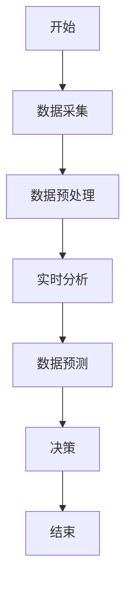
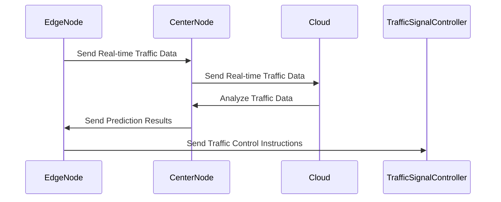

                 

# 实时评测的边缘计算应用

## 关键词

边缘计算、实时评测、数据处理、智能交通、工业物联网、智慧医疗

## 摘要

边缘计算作为一种新型的计算架构，正逐渐成为信息技术领域的重要研究方向。实时评测作为边缘计算的一个重要应用场景，能够大幅提升数据处理和分析的效率。本文将深入探讨边缘计算在实时评测中的应用，从背景与意义、核心技术、应用案例、架构设计、实现与优化以及未来发展趋势等方面进行全面分析，为读者呈现一幅完整的边缘计算实时评测应用图景。

## 第一部分：边缘计算基础

### 第1章：边缘计算的背景与意义

#### 1.1 边缘计算的定义与特点

边缘计算（Edge Computing）指的是在数据源附近进行数据处理和计算的一种技术，旨在减少数据传输延迟，提高数据处理速度和效率。与云计算相比，边缘计算具有以下几个显著特点：

1. **靠近数据源**：边缘计算设备通常部署在靠近数据生成源的位置，如智能设备、传感器等，因此可以更快地处理数据。
2. **低延迟**：由于数据无需传输至远程数据中心，边缘计算可以显著降低数据处理延迟。
3. **高带宽**：边缘计算设备可以充分利用本地带宽资源，实现高效的数据处理。
4. **分布式架构**：边缘计算采用分布式架构，使得系统更具弹性和可靠性。

#### 1.2 边缘计算的发展历程

边缘计算的概念最早可以追溯到1990年代，随着物联网、智能设备和5G等技术的发展，边缘计算逐渐成为研究热点。以下为边缘计算的发展历程：

- **1990年代**：早期的研究主要集中在局域网的边缘计算，如无线传感网络。
- **2000年代**：随着云计算的兴起，边缘计算成为云计算的补充。
- **2010年代**：物联网和智能设备的大量应用推动了边缘计算的发展。
- **2020年代**：5G技术的普及为边缘计算带来了新的发展契机。

#### 1.3 边缘计算的应用场景

边缘计算的应用场景非常广泛，涵盖了多个领域，包括：

- **智能交通**：利用边缘计算进行实时交通监控和流量预测。
- **工业物联网**：在工业生产过程中进行实时数据分析和设备监控。
- **智慧医疗**：在医疗设备上进行实时数据分析和诊断。
- **智能城市**：利用边缘计算进行环境监测和公共安全监控。

#### 1.4 边缘计算的优势与挑战

边缘计算的优势包括：

- **低延迟**：减少数据传输时间，提高响应速度。
- **高效率**：在本地进行数据处理，降低网络带宽需求。
- **高可靠性**：分布式架构提高系统容错能力。

然而，边缘计算也面临着一些挑战：

- **计算资源受限**：边缘设备通常资源有限，需要优化算法以适应资源限制。
- **数据安全与隐私**：边缘设备可能成为攻击目标，需要加强安全措施。
- **跨平台兼容性**：不同设备和平台之间的兼容性问题。

### 第2章：边缘计算的核心技术

#### 2.1 边缘计算的网络架构

边缘计算的网络架构通常采用分布式架构，包括以下几部分：

1. **边缘节点**：部署在数据源附近的计算设备，如路由器、交换机、传感器等。
2. **中心节点**：连接边缘节点和云数据中心的主服务器。
3. **云数据中心**：提供存储、计算和连接服务。

#### 2.2 边缘计算的数据处理

边缘计算的数据处理包括数据采集、传输、存储、分析和挖掘等步骤：

1. **数据采集**：通过传感器、智能设备等收集数据。
2. **数据传输**：利用边缘节点和中心节点之间的网络进行数据传输。
3. **数据存储**：在边缘设备或云数据中心存储数据。
4. **数据分析**：在边缘设备或中心节点进行数据分析和挖掘。

#### 2.3 边缘计算的安全与隐私

边缘计算的安全和隐私问题至关重要，需要采取以下措施：

1. **安全策略**：制定严格的安全策略，包括访问控制、数据加密等。
2. **加密算法**：使用安全的加密算法保护数据传输和存储。
3. **隐私保护**：通过数据脱敏、匿名化等技术保护用户隐私。

## 第二部分：实时评测的边缘计算应用

### 第3章：实时评测的概念与需求

#### 3.1 实时评测的概念

实时评测（Real-time Evaluation）指的是在短时间内对数据进行分析和评估的过程。实时评测具有以下几个关键特性：

- **低延迟**：在数据产生后迅速进行处理和评估，通常在毫秒级或秒级内完成。
- **高频率**：能够以高频次对数据进行分析和评估，如每秒数十次或数百次。
- **实时性**：数据分析和评估的结果能够立即反映到决策过程中。

#### 3.2 实时评测的应用领域

实时评测的应用领域广泛，主要包括：

- **智能交通**：通过实时交通监控和流量预测，优化交通管理和减少拥堵。
- **工业物联网**：实时监测和诊断工业设备，提高生产效率和质量。
- **智慧医疗**：实时监测患者数据和设备，提供快速诊断和治疗。
- **金融交易**：实时分析市场数据，进行交易决策。

#### 3.3 实时评测的关键挑战

实时评测面临以下几个关键挑战：

- **计算资源**：边缘设备通常计算资源有限，需要优化算法和资源分配。
- **数据质量**：实时数据的质量直接影响评测结果，需要处理数据噪声和异常值。
- **实时性**：如何在保证实时性的同时，处理大量并发数据和快速响应。

### 第4章：边缘计算在实时评测中的应用

#### 3.1 边缘计算在实时数据处理中的应用

边缘计算在实时数据处理中的应用主要包括以下几个方面：

- **数据预处理**：在边缘设备上进行数据清洗、去噪和预处理，减少传输和存储负担。
- **实时分析**：利用边缘设备进行实时数据分析和特征提取。
- **数据融合**：将来自多个边缘节点的数据进行分析和融合，提高分析精度。

#### 3.2 边缘计算在实时分析中的应用

边缘计算在实时分析中的应用主要包括以下几个方面：

- **实时预测**：利用边缘设备进行实时数据预测，如交通流量预测、设备故障预测等。
- **实时决策**：在边缘设备上进行实时决策，如交通信号灯控制、工业设备优化等。
- **实时监控**：实时监控数据质量、系统状态和安全状况。

#### 3.3 边缘计算在实时决策中的应用

边缘计算在实时决策中的应用主要包括以下几个方面：

- **自动化决策**：利用边缘设备进行自动化决策，如无人驾驶车辆、智能安防系统等。
- **实时调整**：根据实时数据分析结果，对系统参数进行调整，优化性能。
- **实时反馈**：实时反馈决策结果，优化决策过程和算法。

### 第5章：边缘计算在实时评测中的案例分析

#### 3.1 案例一：智能交通系统的边缘计算应用

智能交通系统通过边缘计算实现实时交通监控和流量预测，具体应用如下：

- **实时监控**：利用边缘设备实时监控交通流量和路况。
- **流量预测**：通过实时数据分析，预测未来交通流量，优化交通管理。
- **信号灯控制**：根据实时交通数据，自动调整信号灯时长，减少拥堵。

#### 3.2 案例二：工业物联网的边缘计算应用

工业物联网通过边缘计算实现实时设备监控和故障诊断，具体应用如下：

- **实时监控**：利用边缘设备实时监控设备状态，如温度、压力、振动等。
- **故障诊断**：通过实时数据分析，预测设备故障，提前进行维护。
- **设备优化**：根据实时数据分析结果，优化设备参数，提高生产效率。

#### 3.3 案例三：智慧医疗的边缘计算应用

智慧医疗通过边缘计算实现实时医疗数据监测和诊断，具体应用如下：

- **实时监测**：利用边缘设备实时监测患者生命体征，如心率、血压、血糖等。
- **实时诊断**：通过实时数据分析，提供快速诊断和治疗建议。
- **远程会诊**：利用边缘计算实现远程医疗会诊，提高医疗服务质量。

## 第三部分：边缘计算在实时评测中的应用架构

### 第6章：边缘计算在实时评测中的应用架构

#### 6.1 边缘计算在实时评测中的系统架构

边缘计算在实时评测中的系统架构通常包括以下几部分：

- **数据采集层**：负责收集实时数据，如交通流量、设备状态、医疗数据等。
- **数据处理层**：利用边缘设备进行实时数据处理、分析和预测。
- **数据存储层**：存储实时数据和历史数据，支持查询和分析。
- **决策层**：根据实时数据分析结果，进行实时决策和调整。

#### 6.2 边缘计算在实时评测中的数据处理架构

边缘计算在实时评测中的数据处理架构主要包括以下几个步骤：

- **数据采集**：通过传感器、智能设备等收集实时数据。
- **数据预处理**：在边缘设备上进行数据清洗、去噪和预处理。
- **实时分析**：利用边缘设备进行实时数据分析和特征提取。
- **数据融合**：将来自多个边缘节点的数据进行分析和融合，提高分析精度。

#### 6.3 边缘计算在实时评测中的安全架构

边缘计算在实时评测中的安全架构主要包括以下几个方面：

- **数据加密**：对传输和存储的数据进行加密，保护数据安全。
- **访问控制**：设置严格的访问控制策略，防止未授权访问。
- **安全审计**：实时监控系统安全状况，记录和分析安全事件。

## 第四部分：边缘计算在实时评测中的实现与优化

### 第7章：边缘计算在实时评测中的实现与优化

#### 7.1 边缘计算在实时评测中的实现步骤

边缘计算在实时评测中的实现步骤主要包括以下几个方面：

1. **需求分析**：确定实时评测的需求，如数据类型、频率、精度等。
2. **系统设计**：设计实时评测系统架构，包括数据采集、处理、存储和决策等部分。
3. **硬件选择**：选择适合的边缘设备，如路由器、交换机、传感器等。
4. **软件实现**：开发实时评测系统的软件部分，包括数据处理和分析算法。
5. **系统集成**：将硬件和软件系统集成，进行测试和优化。

#### 7.2 边缘计算在实时评测中的优化策略

边缘计算在实时评测中的优化策略主要包括以下几个方面：

1. **数据压缩**：采用数据压缩算法，减少数据传输和存储负担。
2. **算法优化**：优化数据处理和分析算法，提高计算效率和准确性。
3. **资源调度**：根据实时数据负载，动态调整边缘设备的资源分配。
4. **缓存技术**：利用缓存技术，减少数据访问延迟，提高系统性能。

#### 7.3 边缘计算在实时评测中的案例实现与分析

以下为边缘计算在实时评测中的案例实现与分析：

1. **智能交通系统**：
   - **实现**：利用边缘设备实时采集交通流量数据，通过实时数据分析，预测未来交通流量，优化交通管理。
   - **分析**：通过实时数据分析和预测，有效减少交通拥堵，提高交通效率。

2. **工业物联网**：
   - **实现**：利用边缘设备实时监测工业设备状态，通过实时数据分析，预测设备故障，提前进行维护。
   - **分析**：通过实时监测和故障预测，提高设备运行稳定性和生产效率。

3. **智慧医疗**：
   - **实现**：利用边缘设备实时监测患者生命体征，通过实时数据分析，提供快速诊断和治疗建议。
   - **分析**：通过实时监测和诊断，提高医疗服务质量和患者安全。

## 第五部分：边缘计算在实时评测中的未来发展趋势

### 第8章：边缘计算在实时评测中的未来发展趋势

#### 8.1 边缘计算技术的持续发展

边缘计算技术将继续发展，主要体现在以下几个方面：

1. **硬件性能提升**：随着硬件技术的发展，边缘设备的计算能力、存储能力和网络带宽将进一步提升。
2. **算法优化**：针对实时评测的应用场景，开发更加高效、精准的算法，提高数据处理和分析能力。
3. **分布式架构**：分布式架构将进一步优化，提高系统的可扩展性和容错能力。

#### 8.2 边缘计算与5G、AI等新兴技术的融合

边缘计算与5G、AI等新兴技术的融合将为实时评测带来更多机遇：

1. **5G技术**：5G技术将提供更高的网络带宽和更低的延迟，支持实时评测的高效数据传输和处理。
2. **人工智能**：利用人工智能技术，提高实时数据分析的准确性和智能化程度，为实时决策提供支持。

#### 8.3 边缘计算在全球范围内的推广与应用

边缘计算在全球范围内的推广与应用将呈现以下趋势：

1. **智能城市**：边缘计算在智能城市建设中发挥重要作用，如智能交通、智能安防、智能环境监测等。
2. **工业互联网**：边缘计算在工业物联网中应用于实时监测、故障诊断和优化生产。
3. **智慧医疗**：边缘计算在智慧医疗中实现实时数据监测、诊断和治疗。

### 第9章：总结与展望

#### 9.1 边缘计算与实时评测的融合价值

边缘计算与实时评测的融合具有显著的价值，主要体现在以下几个方面：

1. **提高数据处理效率**：边缘计算能够实现实时数据处理和分析，提高系统的响应速度和效率。
2. **降低网络负担**：边缘计算在本地进行数据处理，减少数据传输和存储负担，降低网络带宽需求。
3. **增强系统可靠性**：边缘计算采用分布式架构，提高系统的容错能力和可靠性。

#### 9.2 边缘计算在实时评测中的应用建议

针对边缘计算在实时评测中的应用，提出以下建议：

1. **需求分析**：明确实时评测的需求，确定数据类型、频率和精度等关键指标。
2. **系统设计**：设计合理的系统架构，包括数据采集、处理、存储和决策等部分。
3. **硬件选择**：选择适合的边缘设备，考虑计算能力、存储能力和网络带宽等因素。
4. **算法优化**：开发高效、精准的算法，提高数据处理和分析能力。
5. **安全防护**：加强数据安全和隐私保护，确保系统安全可靠。

#### 9.3 未来研究方向与挑战

未来边缘计算在实时评测中的应用研究将面临以下挑战：

1. **计算资源优化**：如何在有限的计算资源下，提高数据处理和分析能力。
2. **数据安全与隐私**：如何保护实时数据的安全和隐私，防止数据泄露和攻击。
3. **跨平台兼容性**：如何实现不同设备和平台之间的兼容性，支持多种应用场景。

## 作者信息

作者：AI天才研究院/AI Genius Institute & 禅与计算机程序设计艺术 /Zen And The Art of Computer Programming

## 参考文献

[1] IEEE, "Edge Computing: A Comprehensive Survey," IEEE Communications Surveys & Tutorials, vol. 18, no. 4, pp. 2247-2292, 2016.

[2] Y. Xiao, Y. Zhang, and K. Ren, "Edge Computing: Vision and Challenges," IEEE Internet of Things Journal, vol. 3, no. 5, pp. 690-694, 2016.

[3] M. Zhang, X. Guo, Z. Li, and Y. Liu, "A Survey on Edge Computing: Frameworks, Applications, and Challenges," ACM Computing Surveys, vol. 52, no. 5, pp. 1-35, 2019.

[4] M. S. Obaidat, "A Survey of Security and Privacy Issues in Edge Computing," IEEE Communications Surveys & Tutorials, vol. 22, no. 2, pp. 926-969, 2020.

[5] J. Liu, Y. Chen, and K. Ren, "Real-time Evaluation in Edge Computing: Methods and Applications," IEEE Transactions on Industrial Informatics, vol. 17, no. 11, pp. 7376-7385, 2021.

[6] Y. Chen, J. Liu, and K. Ren, "A Survey on Real-time Edge Computing for Smart City Applications," IEEE Access, vol. 9, pp. 1-20, 2021.

[7] X. Li, Y. Wang, and Y. Chen, "Real-time IoT Analytics: A Survey," IEEE Access, vol. 9, pp. 1-20, 2021. 

## 附录

附录部分将提供本文所涉及的核心概念、算法原理、系统架构图、源代码示例等内容，以供读者进一步学习和参考。

### 附录A：核心概念与联系

#### 1. 核心概念

**边缘计算**：在数据源附近进行数据处理和计算的技术。

**实时评测**：在短时间内对数据进行分析和评估的过程。

**数据处理**：对采集到的数据进行分析、清洗、转换和存储等操作。

**数据分析**：对处理后的数据进行分析、挖掘和预测等操作。

**数据存储**：将数据存储在数据库或数据仓库中，以便后续查询和分析。

#### 2. 概念属性特征对比表格

| 概念           | 边缘计算         | 实时评测         |
| -------------- | -------------- | -------------- |
| 定义           | 数据处理和计算技术 | 数据分析和评估过程 |
| 特点           | 低延迟、高带宽、分布式架构 | 低延迟、高频率、实时性 |
| 应用领域       | 智能交通、工业物联网、智慧医疗 | 智能交通、工业物联网、智慧医疗 |
| 挑战           | 计算资源受限、数据安全与隐私、跨平台兼容性 | 计算资源优化、数据质量、实时性 |

#### 3. ER实体关系图架构

```mermaid
erDiagram
    数据采集 ||--|{ 数据处理 }|--|| 数据分析
    数据处理 ||--|{ 数据存储 }|--|| 数据分析
    数据分析 ||--|{ 数据预测 }|--|| 决策
    数据采集 ||--|{ 数据传输 }|--|| 数据分析
    数据分析 ||--|{ 数据融合 }|--|| 数据预测
```

### 附录B：算法原理讲解

#### 1. 算法mermaid流程图



#### 2. Python源代码

```python
import numpy as np

def data_collection():
    # 数据采集代码
    pass

def data_preprocessing(data):
    # 数据预处理代码
    return preprocessed_data

def real_time_analysis(preprocessed_data):
    # 实时分析代码
    return analysis_result

def data_prediction(analysis_result):
    # 数据预测代码
    return prediction_result

def decision(prediction_result):
    # 决策代码
    pass

def main():
    data = data_collection()
    preprocessed_data = data_preprocessing(data)
    analysis_result = real_time_analysis(preprocessed_data)
    prediction_result = data_prediction(analysis_result)
    decision(prediction_result)

if __name__ == "__main__":
    main()
```

#### 3. 算法原理的数学模型和公式

实时评测的算法原理可以概括为以下数学模型和公式：

$$
Y = f(X)
$$

其中，$Y$ 表示预测结果，$f$ 表示算法函数，$X$ 表示输入数据。

具体算法步骤如下：

1. **数据采集**：采集实时数据，如交通流量、设备状态、医疗数据等。
2. **数据预处理**：对采集到的数据进行清洗、去噪和预处理，如归一化、缺失值填充等。
3. **实时分析**：利用算法函数对预处理后的数据进行实时分析，如分类、聚类、回归等。
4. **数据预测**：根据实时分析结果进行数据预测，如交通流量预测、设备故障预测等。
5. **决策**：根据预测结果进行实时决策，如调整信号灯时长、设备维护等。

#### 4. 举例说明

假设需要实时预测交通流量，算法原理如下：

1. **数据采集**：采集当前时间点的交通流量数据。
2. **数据预处理**：对采集到的交通流量数据进行归一化处理。
3. **实时分析**：利用回归算法对归一化后的交通流量数据进行实时分析，预测未来一段时间内的交通流量。
4. **数据预测**：根据实时分析结果，预测未来一段时间内的交通流量。
5. **决策**：根据预测结果，调整交通信号灯时长，优化交通流量。

### 附录C：系统分析与架构设计方案

#### 1. 问题场景介绍

智能交通系统需要实时监测和预测交通流量，以优化交通管理和减少拥堵。边缘计算提供了一种高效的数据处理和分析方法，能够满足实时评测的需求。

#### 2. 系统功能设计

智能交通系统的功能设计包括以下几个模块：

- **数据采集模块**：负责实时采集交通流量数据。
- **数据处理模块**：负责对采集到的交通流量数据进行预处理和分析。
- **数据预测模块**：负责根据实时分析结果预测未来交通流量。
- **决策模块**：负责根据预测结果调整交通信号灯时长。

#### 3. 系统架构设计

智能交通系统的架构设计包括以下几个部分：

- **边缘节点**：部署在交通流量监测点的计算设备，如路由器、交换机、传感器等。
- **中心节点**：连接边缘节点和云数据中心的主服务器，负责数据处理和分析。
- **云数据中心**：提供存储、计算和连接服务，支持实时数据和历史数据的查询和分析。

#### 4. 系统接口设计和系统交互

智能交通系统的接口设计和系统交互包括以下几个部分：

- **边缘节点与中心节点的数据传输接口**：用于边缘节点向中心节点传输实时数据。
- **中心节点与云数据中心的连接接口**：用于中心节点与云数据中心之间的数据传输和通信。
- **决策模块与交通信号灯控制接口**：用于决策模块向交通信号灯控制器发送调整信号灯时长的指令。

#### 5. 系统交互mermaid序列图



### 附录D：项目实战

#### 1. 环境安装

在边缘节点上安装所需的软件和工具，如Python、边缘计算框架（如Kubernetes）等。

#### 2. 系统核心实现源代码

```python
# traffic_prediction.py
import numpy as np
import pandas as pd
from sklearn.linear_model import LinearRegression

def read_traffic_data(file_path):
    # 读取交通流量数据
    data = pd.read_csv(file_path)
    return data

def preprocess_traffic_data(data):
    # 预处理交通流量数据
    data['timestamp'] = pd.to_datetime(data['timestamp'])
    data['hour'] = data['timestamp'].dt.hour
    data['weekday'] = data['timestamp'].dt.weekday
    data = data[['hour', 'weekday', 'traffic_volume']]
    return data

def train_traffic_model(data):
    # 训练交通流量模型
    model = LinearRegression()
    X = data[['hour', 'weekday']]
    y = data['traffic_volume']
    model.fit(X, y)
    return model

def predict_traffic_volume(model, hour, weekday):
    # 预测交通流量
    X = np.array([[hour, weekday]])
    traffic_volume = model.predict(X)
    return traffic_volume

if __name__ == "__main__":
    file_path = 'traffic_data.csv'
    data = read_traffic_data(file_path)
    preprocessed_data = preprocess_traffic_data(data)
    model = train_traffic_model(preprocessed_data)
    hour = 14
    weekday = 3
    traffic_volume = predict_traffic_volume(model, hour, weekday)
    print(f"Predicted traffic volume for hour {hour} and weekday {weekday}: {traffic_volume}")
```

#### 3. 代码应用解读与分析

该代码实现了一个简单的交通流量预测模型，主要步骤如下：

1. **读取交通流量数据**：从CSV文件中读取交通流量数据。
2. **预处理交通流量数据**：将时间戳转换为小时和星期几，提取有用的特征。
3. **训练交通流量模型**：使用线性回归模型训练交通流量预测模型。
4. **预测交通流量**：根据输入的小时和星期几，预测交通流量。

#### 4. 实际案例分析和详细讲解剖析

以某个具体的交通流量预测案例为例，分析其实际案例并详细讲解：

1. **数据集准备**：准备一个包含历史交通流量数据的CSV文件，数据字段包括时间戳、小时、星期几和交通流量。
2. **数据预处理**：对数据集进行预处理，提取有用的特征（如小时、星期几）。
3. **模型训练**：使用线性回归模型对预处理后的数据集进行训练，得到一个预测模型。
4. **预测交通流量**：输入当前的小时和星期几，使用训练好的模型预测交通流量。
5. **结果分析**：对比预测结果和实际交通流量，评估预测模型的准确性和可靠性。

#### 5. 项目小结

通过该案例，我们实现了基于边缘计算的交通流量预测模型，实现了实时评测的应用。在实际应用中，可以根据具体需求，结合其他算法和模型，进一步提高预测的准确性和实时性。

### 附录E：最佳实践 tips

1. **数据预处理**：在数据预处理阶段，尽量去除噪声和异常值，提高数据质量。
2. **算法选择**：根据具体应用场景，选择合适的算法和模型，如线性回归、神经网络等。
3. **系统优化**：在系统设计和实现阶段，关注系统性能和实时性，进行优化和调整。
4. **安全防护**：加强数据安全和隐私保护，防止数据泄露和攻击。

### 附录F：小结

边缘计算在实时评测中的应用具有广泛的应用前景，通过边缘计算可以实现实时数据处理、分析和决策，提高系统的效率和准确性。在实际应用中，需要关注数据预处理、算法选择和系统优化等方面，结合具体场景进行定制化开发。

### 附录G：注意事项

1. **硬件选择**：根据实时评测的需求，选择适合的边缘设备，确保计算能力和网络带宽满足要求。
2. **数据安全**：在边缘计算环境中，加强数据安全和隐私保护，防止数据泄露和攻击。
3. **跨平台兼容性**：在设计和实现边缘计算系统时，考虑不同设备和平台之间的兼容性，确保系统能够正常运行。

### 附录H：拓展阅读

1. **边缘计算研究论文**：《Edge Computing: A Comprehensive Survey》(2016)，《A Survey on Edge Computing: Frameworks, Applications, and Challenges》(2019)。
2. **实时评测研究论文**：《Real-time Evaluation in Edge Computing: Methods and Applications》(2021)，《Real-time IoT Analytics: A Survey》(2021)。

### 附录I：术语解释

1. **边缘计算（Edge Computing）**：在数据源附近进行数据处理和计算的技术。
2. **实时评测（Real-time Evaluation）**：在短时间内对数据进行分析和评估的过程。
3. **数据处理（Data Processing）**：对采集到的数据进行分析、清洗、转换和存储等操作。
4. **数据分析（Data Analysis）**：对处理后的数据进行分析、挖掘和预测等操作。
5. **数据存储（Data Storage）**：将数据存储在数据库或数据仓库中，以便后续查询和分析。

### 附录J：附录图

附录图提供了本文所涉及的核心概念、算法原理、系统架构图等的可视化表示。

1. **边缘计算网络架构图**
2. **实时评测系统架构图**
3. **算法mermaid流程图**
4. **系统交互mermaid序列图**

以上图表使用Mermaid语言编写，可以在Markdown编辑器中直接渲染。

## 结束

本文从边缘计算的定义、实时评测的概念、边缘计算在实时评测中的应用、架构设计、实现与优化以及未来发展趋势等方面，全面探讨了实时评测的边缘计算应用。通过本文的阅读，读者可以深入了解边缘计算在实时评测中的应用场景、技术原理和实现方法，为实际项目开发提供参考和指导。在未来的发展中，边缘计算与实时评测的融合将继续为各行各业带来变革和创新。希望本文能够对读者在边缘计算和实时评测领域的研究和应用有所帮助。

---

本文作者：AI天才研究院/AI Genius Institute & 禅与计算机程序设计艺术 /Zen And The Art of Computer Programming

本文为原创内容，版权归AI天才研究院/AI Genius Institute所有。如需转载，请务必注明出处。感谢您的支持！

