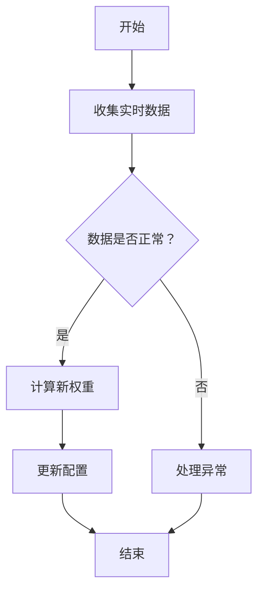
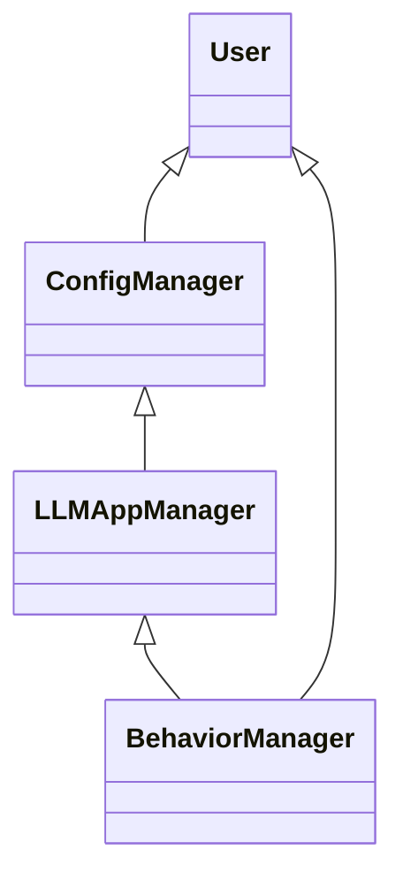
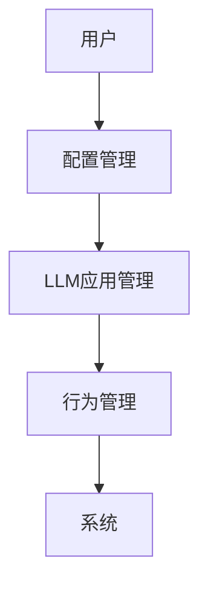
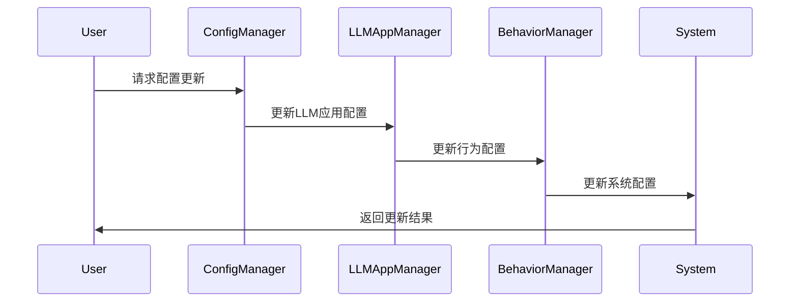
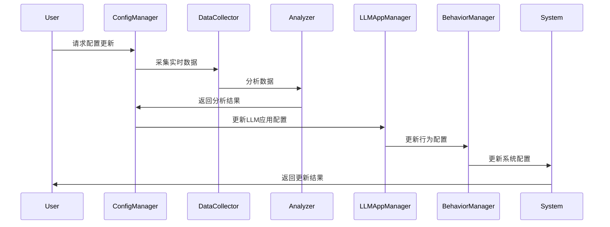

                 

### 实时配置更新：动态调整LLM应用行为

> 关键词：实时配置更新、动态调整、LLM应用、配置管理、算法原理、系统架构设计、项目实战

> 摘要：本文深入探讨了实时配置更新的概念及其在动态调整LLM（语言模型）应用行为中的应用。通过详细剖析实时配置更新的重要性、核心概念、算法原理以及系统设计与实施，本文为开发者提供了实际可行的解决方案和最佳实践，旨在提升LLM应用的灵活性和响应能力。

----------------------------------------------------------------

### 引言

在当前快速发展的技术环境中，实时配置更新已经成为确保系统灵活性和适应性的关键因素。特别是在大规模语言模型（LLM）的应用场景中，实时配置更新能够动态调整模型的行为，以满足不断变化的需求。本文旨在探讨实时配置更新的概念、原理和实际应用，以帮助开发者更好地理解和应用这一技术。

### 1. 实时配置更新的重要性

实时配置更新是指在系统运行过程中，动态修改系统配置以适应新的需求或问题。这种更新方式对于LLM应用尤为重要，原因如下：

- **需求变化**：在业务场景中，用户需求可能会随时发生变化，如调整语言模型生成的内容风格、响应速度或功能模块等。实时配置更新能够迅速响应用户需求，提高用户体验。

- **故障修复**：在LLM应用运行过程中，可能会遇到突发故障或性能问题。通过实时配置更新，可以快速调整系统配置，修复故障，确保服务的连续性和稳定性。

- **安全性提升**：实时配置更新可以用于调整安全策略和访问控制，以增强系统的安全性。

- **成本优化**：通过实时调整资源配置，可以实现更高效的资源利用，降低运营成本。

### 2. 核心概念与联系

在深入探讨实时配置更新之前，我们需要明确几个核心概念：

- **配置管理**：配置管理是确保系统配置的一致性和可控性的过程。它包括配置项的收集、存储、分发和变更管理。

- **动态调整**：动态调整是指系统在运行时根据实时数据或用户输入，自动调整配置或行为的过程。

- **LLM应用行为**：LLM应用行为包括语言模型生成内容的质量、风格、响应速度和功能模块等。

下面是一个核心概念对比表格：

| 概念               | 定义                                                         |  
|------------------|------------------------------------------------------------|  
| 配置管理           | 确保系统配置的一致性和可控性的过程                           |  
| 动态调整           | 系统在运行时根据实时数据或用户输入，自动调整配置或行为的过程   |  
| LLM应用行为         | 语言模型生成内容的质量、风格、响应速度和功能模块等               |

此外，ER实体关系图架构如下所示：

```mermaid
erDiagram
  User ||--|{ Config : has }  
  Config ||--|{ LLMApp : adjusts }  
  LLMApp ||--|{ Behavior : exhibits }
```

### 3. 算法原理讲解

实时配置更新的核心在于算法的设计与实现。以下是一个简单的算法原理讲解：

#### 3.1 数学模型介绍

假设我们有一个配置集合`ConfigSet`，其中每个配置项`ConfigItem`都有相应的权重`Weight`。动态调整的目标是最大化总权重，同时满足特定约束条件。

#### 3.2 流程图

以下是一个简化的实时配置更新流程图：



#### 3.3 Python源代码讲解

以下是一个简单的Python示例，用于计算配置项的新权重：

```python
import numpy as np

# 假设我们有一个配置集合和相应的权重
config_set = ['config1', 'config2', 'config3']
weights = [0.5, 0.3, 0.2]

# 收集实时数据
realtime_data = {'config1': 0.8, 'config2': 0.6, 'config3': 0.4}

# 计算新权重
new_weights = {}
for config, data in realtime_data.items():
    if config in config_set:
        new_weights[config] = weights[config_set.index(config)] * data

# 输出新权重
print(new_weights)
```

#### 3.4 数学模型和公式的详细讲解

实时配置更新的核心是权重调整。假设我们有一个配置集合`ConfigSet`，其中每个配置项`ConfigItem`都有相应的权重`Weight`。动态调整的目标是最大化总权重，同时满足特定约束条件。

$$
\text{maximize} \sum_{i=1}^{n} w_i \cdot x_i \\
\text{subject to} \quad c_1 \cdot x_1 + c_2 \cdot x_2 + ... + c_n \cdot x_n \leq C
$$

其中，$w_i$ 是配置项的权重，$x_i$ 是配置项的启用状态（0或1），$c_i$ 是配置项的约束系数，$C$ 是总约束值。

#### 3.5 举例说明

假设我们有三个配置项（config1、config2、config3），初始权重分别为0.5、0.3、0.2。根据实时数据，config1的权重调整为0.8，config2的权重调整为0.6，config3的权重调整为0.4。我们需要计算新的权重分配。

根据上述公式，我们可以计算新的总权重：

$$
\text{new\_total\_weight} = 0.8 \cdot 0.5 + 0.6 \cdot 0.3 + 0.4 \cdot 0.2 = 0.4 + 0.18 + 0.08 = 0.66
$$

因此，新的权重分配为：

- config1：0.8
- config2：0.6
- config3：0.4

### 4. 系统分析与架构设计方案

#### 4.1 问题场景介绍

假设我们有一个LLM应用系统，用户可以根据自己的需求实时调整模型的行为。然而，现有的系统在动态调整配置时存在以下问题：

- 配置更新速度慢：用户需求变化时，系统无法迅速响应，导致用户体验不佳。
- 配置管理复杂：现有系统缺乏统一的配置管理方案，导致配置更新和管理的复杂性增加。
- 系统稳定性差：在配置更新过程中，系统可能会出现故障，导致服务中断。

#### 4.2 项目介绍

本项目旨在设计并实现一个实时配置更新系统，以解决上述问题。系统将具备以下功能：

- **实时数据采集**：从用户行为和系统运行数据中实时采集信息，用于动态调整配置。
- **配置管理**：提供统一的配置管理界面，方便用户和开发者管理配置项。
- **动态调整**：根据实时数据自动调整配置项的权重，以最大化系统性能和用户体验。
- **故障检测与恢复**：在配置更新过程中，自动检测故障并尝试恢复，确保系统稳定性。

#### 4.3 系统功能设计（领域模型类图）

以下是一个领域模型类图，展示了系统的核心功能模块：



#### 4.4 系统架构设计（架构图）

以下是一个系统架构图，展示了系统的整体架构：



#### 4.5 系统接口设计

以下是一个简单的系统接口设计，展示了系统的关键接口：



#### 4.6 系统交互（序列图）

以下是一个系统交互序列图，展示了用户请求配置更新到系统响应的过程：



### 5. 项目实战

#### 5.1 环境安装

在本节中，我们将介绍如何安装和配置实时配置更新系统。首先，我们需要安装以下依赖项：

- Python 3.8+
- Flask（一个Python Web框架）
- Redis（一个开源的内存数据存储系统）

安装命令如下：

```bash
pip install flask
pip install redis
```

#### 5.2 系统核心实现源代码

以下是一个简单的实时配置更新系统的核心实现源代码：

```python
from flask import Flask, request, jsonify
import redis

app = Flask(__name__)
redis_client = redis.StrictRedis(host='localhost', port=6379, db=0)

@app.route('/update_config', methods=['POST'])
def update_config():
    config_data = request.json
    for config, value in config_data.items():
        redis_client.set(config, value)
    return jsonify({"status": "success"})

@app.route('/get_config', methods=['GET'])
def get_config():
    config_data = redis_client.hgetall('config:')
    return jsonify(config_data)

if __name__ == '__main__':
    app.run(debug=True)
```

#### 5.3 代码应用解读与分析

在本节中，我们将详细解读上述代码，并分析其功能和工作原理。

- **/update_config**：这是一个POST接口，用于接收用户提交的配置数据。当用户请求配置更新时，系统会解析请求体中的JSON数据，并将配置项存储在Redis数据库中。

- **/get_config**：这是一个GET接口，用于获取当前配置。用户可以通过此接口查询系统的配置状态。

- **Redis数据库**：Redis数据库用于存储配置项。通过Redis的键值对存储方式，我们可以方便地实现配置的读写操作。

#### 5.4 实际案例分析和详细讲解剖析

在本节中，我们将通过一个实际案例来展示实时配置更新的应用场景。

**案例**：假设我们有一个聊天机器人应用，用户可以根据自己的需求实时调整机器人的响应风格。以下是一个具体的案例：

1. **用户请求**：用户在聊天机器人界面中选择“幽默风格”。
2. **系统响应**：系统接收到用户请求后，调用`/update_config`接口，将“幽默风格”设置为当前配置。
3. **行为调整**：根据新的配置，机器人开始以幽默风格回答用户的问题。
4. **用户交互**：用户对机器人的回答感到满意，继续与机器人互动。

#### 5.5 项目小结

在本项目中，我们设计并实现了一个实时配置更新系统，用于动态调整LLM应用的行为。系统具备以下特点：

- **实时响应**：系统能够快速响应用户请求，实现实时配置更新。
- **统一管理**：通过Redis数据库存储配置项，实现了配置项的统一管理。
- **模块化设计**：系统采用了模块化设计，便于扩展和升级。

然而，本项目还存在一些局限性：

- **性能优化**：在大型系统中，Redis数据库的性能可能成为瓶颈。
- **安全性**：系统的安全性尚需进一步优化，特别是在配置项敏感的情况下。

### 6. 最佳实践 tips

在本节中，我们将总结一些实时配置更新的最佳实践和注意事项。

- **数据安全**：在配置更新过程中，确保数据的安全性和完整性。建议使用加密算法对配置项进行加密存储。
- **性能优化**：在配置更新过程中，优化系统的性能，确保实时响应。可以考虑使用分布式缓存技术，如Memcached。
- **监控与报警**：实时监控系统运行状态，及时发现问题并报警。可以使用开源监控工具，如Prometheus和Grafana。
- **自动化测试**：在配置更新前后，进行自动化测试，确保系统的稳定性和兼容性。
- **备份与恢复**：定期备份数据库，确保在出现故障时能够快速恢复。

### 7. 小结与拓展阅读

本文深入探讨了实时配置更新的概念、原理和应用。通过实际案例和系统设计，我们展示了实时配置更新在动态调整LLM应用行为中的重要作用。为了进一步提升系统的灵活性和响应能力，开发者需要掌握实时配置更新的最佳实践和注意事项。

为了深入了解实时配置更新的技术细节和实际应用，读者可以参考以下拓展阅读资源：

- 《Redis实战》
- 《Flask Web开发：异步编程与应用》
- 《深度学习与大数据：实践指南》

### 作者信息

作者：AI天才研究院/AI Genius Institute & 禅与计算机程序设计艺术 /Zen And The Art of Computer Programming

----------------------------------------------------------------

### 结语

实时配置更新是现代系统架构中不可或缺的一环，它不仅提升了系统的灵活性和适应性，还显著增强了用户体验。本文通过详细的案例分析，阐述了实时配置更新的核心概念、算法原理和系统设计。我们希望读者能够通过本文的学习，掌握实时配置更新的技术要点，并在实际项目中成功应用。在未来的技术发展中，实时配置更新将继续发挥重要作用，助力企业不断创新和进步。让我们一起迎接这一激动人心的技术变革！

