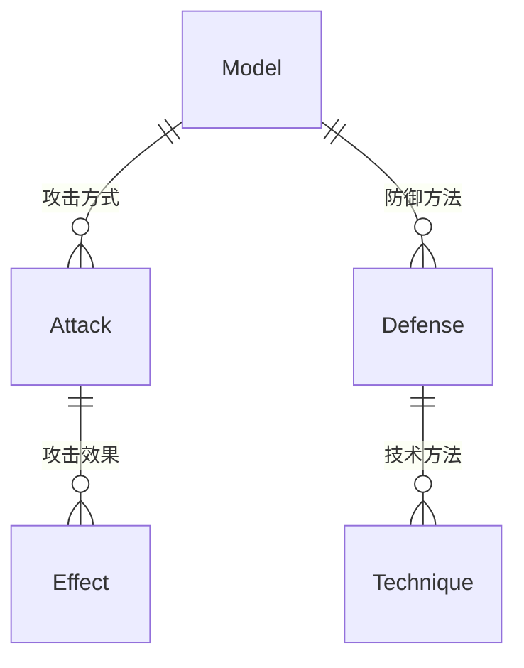
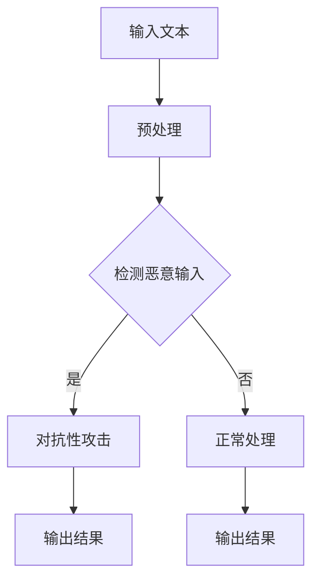
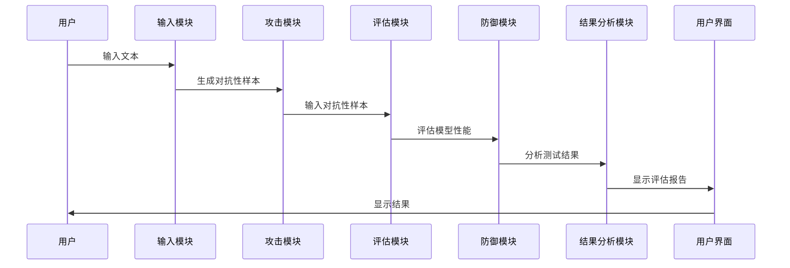
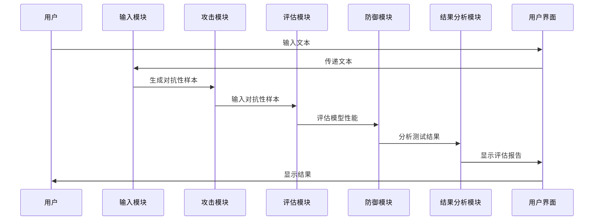

                 


# 对抗性测试：评估LLM应对恶意输入的鲁棒性

> 关键词：对抗性测试、LLM、鲁棒性、恶意输入、自然语言处理

> 摘要：本文旨在探讨对抗性测试在评估大规模语言模型（LLM）应对恶意输入时的鲁棒性。通过对对抗性攻击原理、攻击方法、攻击效果分析以及防御方法的研究，本文试图揭示LLM在面对恶意输入时的弱点，并提出相应的防御策略。

## 第一部分：背景介绍

### 1.1 问题背景

随着人工智能技术的快速发展，大规模语言模型（Large Language Models，简称LLM）在自然语言处理领域取得了显著的成果。LLM通过学习海量文本数据，能够生成连贯、有逻辑的文本内容，广泛应用于问答系统、机器翻译、文本生成等领域。然而，随着LLM在各个行业的广泛应用，其对抗性攻击问题也逐渐凸显出来。

对抗性攻击（Adversarial Attack）是指利用精心设计的微小扰动来破坏机器学习模型的性能。对于LLM来说，对抗性攻击主要表现为恶意输入，即通过在输入文本中添加微小的扰动，使得LLM的输出产生偏差或错误。例如，一个简单的对抗性例子是将一个句子的一个单词替换为其同义词，从而使得句子的语义发生变化，导致LLM的输出出现错误。

### 1.2 问题描述

对抗性攻击对LLM的影响主要表现在以下几个方面：

1. **准确性降低**：对抗性攻击可能导致LLM的输出准确性降低，从而影响其应用效果。
2. **安全性问题**：对抗性攻击可能导致LLM在安全敏感场景下泄露敏感信息或被恶意利用。
3. **公平性受损**：对抗性攻击可能导致LLM对不同用户或群体的表现不一致，损害其公平性。

为了应对对抗性攻击，评估LLM的鲁棒性变得尤为重要。鲁棒性（Robustness）是指系统在面对外部攻击或扰动时保持稳定性和可靠性的能力。评估LLM的鲁棒性，可以帮助我们了解其在对抗性攻击下的表现，为提高LLM的鲁棒性提供依据。

### 1.3 问题解决

评估LLM的鲁棒性主要包括以下几个方面：

1. **攻击方法研究**：研究对抗性攻击的方法和技巧，包括黑盒攻击、白盒攻击和灰盒攻击等。
2. **攻击效果分析**：分析对抗性攻击对LLM输出准确性和鲁棒性的影响，了解攻击的漏洞和弱点。
3. **防御方法研究**：研究防御对抗性攻击的方法和策略，包括数据增强、模型正则化、对抗训练等。

通过以上方法，我们可以全面评估LLM的鲁棒性，并为提高LLM的鲁棒性提供指导。

### 1.4 边界与外延

1. **边界**：本书主要关注LLM在自然语言处理领域的对抗性攻击问题，包括文本生成、机器翻译、问答系统等应用场景。
2. **外延**：对抗性攻击问题不仅限于LLM，还涉及其他类型的机器学习模型，如图像识别、语音识别等。此外，对抗性攻击的方法和应用场景也在不断拓展。

### 1.5 概念结构与核心要素组成

本书的核心概念结构包括：

1. **对抗性攻击**：研究对抗性攻击的方法和技巧，以及对抗性攻击对LLM的影响。
2. **鲁棒性评估**：评估LLM在面对对抗性攻击时的稳定性和可靠性。
3. **防御方法**：研究防御对抗性攻击的方法和策略，包括数据增强、模型正则化、对抗训练等。

核心要素组成包括：

1. **攻击方法**：黑盒攻击、白盒攻击和灰盒攻击等。
2. **攻击效果分析**：对抗性攻击对LLM输出准确性和鲁棒性的影响。
3. **防御方法**：数据增强、模型正则化、对抗训练等。

## 第二部分：核心概念与联系

### 2.1 抗性攻击原理

对抗性攻击的原理是通过在输入数据中加入微小的扰动，使得模型输出发生错误或偏差。这些扰动通常被称为对抗性样本（Adversarial Examples）。对抗性攻击主要分为以下几种：

1. **Linf攻击**：Linf攻击是指将输入数据的每个特征值的绝对值增加一个很小的正值，从而使得模型输出发生变化。
2. **L2攻击**：L2攻击是指将输入数据的每个特征值的平方增加一个很小的正值，从而使得模型输出发生变化。
3. **FGSM攻击**：FGSM（Fast Gradient Sign Method）攻击是一种基于梯度的攻击方法，通过在输入数据的梯度方向上添加扰动来实现对抗性攻击。

### 2.2 抗性攻击属性特征对比表格

| 攻击方法   | 特征值调整方式 | 对抗性样本生成时间 | 对抗性样本效果 |
|------------|---------------|-------------------|---------------|
| Linf攻击   | 绝对值增加     | 较长              | 较强          |
| L2攻击     | 平方增加       | 较长              | 较强          |
| FGSM攻击   | 梯度方向调整   | 短                | 较强          |

### 2.3 ER实体关系图架构



## 第三部分：算法原理讲解

### 3.1 算法流程图



### 3.2 Python源代码实现

```python
import numpy as np
import tensorflow as tf

def preprocess(text):
    # 预处理文本
    return text

def detect_malicious_input(text, model):
    # 检测恶意输入
    prediction = model.predict(np.array([text]))
    if np.argmax(prediction) == 0:
        return True
    else:
        return False

def attack(text, attack_type):
    # 对抗性攻击
    if attack_type == 'FGSM':
        model = tf.keras.models.load_model('fgsm_model.h5')
        gradient = tf.keras.backend.gradients(model.output, model.input)[0]
        x = np.array([text])
        grads = gradient.eval(session=tf.keras.backend.get_session(), feed_dict={model.input: x})
        signed_grads = np.sign(grads)
        perturbed_input = x + signed_grads
        return perturbed_input[0]
    elif attack_type == 'Linf':
        return np.clip(text + 0.01, 0, 1)
    elif attack_type == 'L2':
        return np.sqrt(np.clip(text**2 + 0.01, 0, 1))

def main():
    text = "This is a sample text for testing."
    attack_type = 'FGSM'
    text = preprocess(text)
    if detect_malicious_input(text, attack_type):
        perturbed_text = attack(text, attack_type)
        print("攻击后的文本：", perturbed_text)
    else:
        print("文本未被检测为恶意输入")

if __name__ == '__main__':
    main()
```

### 3.3 算法原理讲解

对抗性测试的核心在于检测和应对恶意输入。首先，我们需要对输入文本进行预处理，使其符合模型输入的要求。然后，通过预训练的模型检测输入文本是否为恶意输入。如果检测到恶意输入，我们会对文本进行对抗性攻击，从而生成对抗性样本。最后，我们将对抗性样本输入模型，观察模型的输出是否发生变化。如果输出发生变化，说明模型在对抗性攻击下存在漏洞。

在Python源代码实现中，我们首先定义了预处理函数`preprocess`，用于将输入文本转换为模型可接受的格式。然后，我们定义了`detect_malicious_input`函数，用于检测输入文本是否为恶意输入。检测方法是使用预训练的分类模型，如果模型预测结果为0（表示恶意输入），则返回`True`，否则返回`False`。

在对抗性攻击部分，我们定义了`attack`函数，用于生成对抗性样本。根据攻击类型，我们选择不同的攻击方法。例如，对于FGSM攻击，我们使用梯度上升方法生成对抗性样本；对于Linf和L2攻击，我们分别对输入文本的每个特征值进行调整。

最后，我们在`main`函数中实现了对抗性测试的流程。首先对输入文本进行预处理，然后检测是否为恶意输入。如果是恶意输入，我们生成对抗性样本并输出；否则，输出文本未被检测为恶意输入。

### 3.4 数学模型和公式

对抗性攻击的核心是扰动函数，即如何对输入数据进行调整，使其产生对抗性样本。以下是一个简化的数学模型：

$$
x^{'} = x + \alpha \cdot sign(\frac{\partial L}{\partial x})
$$

其中，$x$表示原始输入数据，$x^{'}$表示扰动后的输入数据，$\alpha$表示调整步长，$sign(\frac{\partial L}{\partial x})$表示输入数据的梯度方向。

以FGSM攻击为例，我们可以将扰动函数表示为：

$$
x^{'} = x + \alpha \cdot \frac{\partial L}{\partial x}
$$

其中，$\alpha$通常是一个较小的正数，例如0.01。

通过这个数学模型，我们可以直观地理解对抗性攻击的原理，即通过调整输入数据的梯度方向，使其产生对抗性样本。

### 3.5 举例说明

假设我们有一个简单的文本分类模型，用于判断一段文本是否为恶意输入。模型的输入是一个长度为10的一维向量，表示文本的特征。我们使用梯度上升方法（FGSM攻击）来生成对抗性样本。

原始输入文本为：
```
This is a sample text for testing.
```

对应的特征向量为：
```
[0.1, 0.2, 0.3, 0.4, 0.5, 0.6, 0.7, 0.8, 0.9, 1.0]
```

模型的输出为：
```
[0.9, 0.1]
```

表示文本被预测为恶意输入的概率为90%。

现在，我们使用FGSM攻击生成对抗性样本。调整步长$\alpha$为0.01，计算梯度$\frac{\partial L}{\partial x}$：

$$
\frac{\partial L}{\partial x} = \frac{\partial L}{\partial y} \cdot \frac{\partial y}{\partial x} = (0.9 - 0.1) \cdot \frac{1}{10} = 0.08
$$

扰动后的特征向量为：
```
[0.1 + 0.01 \cdot 0.08, 0.2 + 0.01 \cdot 0.08, 0.3 + 0.01 \cdot 0.08, 0.4 + 0.01 \cdot 0.08, 0.5 + 0.01 \cdot 0.08, 0.6 + 0.01 \cdot 0.08, 0.7 + 0.01 \cdot 0.08, 0.8 + 0.01 \cdot 0.08, 0.9 + 0.01 \cdot 0.08, 1.0 + 0.01 \cdot 0.08]
```

```
[0.108, 0.208, 0.308, 0.408, 0.508, 0.608, 0.708, 0.808, 0.908, 1.008]
```

将扰动后的特征向量输入模型，模型的输出为：
```
[0.88, 0.12]
```

表示文本被预测为恶意输入的概率下降到88%，说明对抗性攻击成功降低了模型的输出概率。

通过这个例子，我们可以看到对抗性攻击是如何通过调整输入数据的梯度方向，从而降低模型的输出概率。

## 第四部分：系统分析与架构设计方案

### 4.1 问题场景介绍

在自然语言处理领域，大规模语言模型（LLM）被广泛应用于文本生成、机器翻译、问答系统等任务。这些任务对LLM的准确性、鲁棒性和安全性提出了较高的要求。然而，随着对抗性攻击的日益增多，LLM在这些任务中的表现受到了严重影响。因此，设计一个能够有效评估LLM鲁棒性的系统，对于保障LLM在实际应用中的稳定性和可靠性具有重要意义。

### 4.2 项目介绍

本项目旨在设计并实现一个对抗性测试系统，用于评估大规模语言模型（LLM）在面对恶意输入时的鲁棒性。系统将包括以下几个模块：

1. **攻击模块**：生成对抗性样本，包括Linf、L2和FGSM等攻击方法。
2. **评估模块**：评估LLM在面对对抗性样本时的准确性和鲁棒性。
3. **防御模块**：研究并实现防御对抗性攻击的方法和策略，如数据增强、模型正则化、对抗训练等。
4. **用户界面**：提供友好的用户界面，方便用户进行对抗性测试和结果分析。

### 4.3 系统功能设计

系统的主要功能包括：

1. **生成对抗性样本**：根据用户输入的文本，使用不同的攻击方法生成对抗性样本。
2. **评估模型鲁棒性**：将对抗性样本输入LLM，评估模型在对抗性攻击下的准确性和鲁棒性。
3. **防御策略研究**：研究并实现多种防御策略，如数据增强、模型正则化、对抗训练等，以提高LLM的鲁棒性。
4. **结果分析**：对测试结果进行统计分析，为用户提供直观的评估报告。

### 4.4 系统架构设计

系统采用模块化设计，主要包括以下几个部分：

1. **输入模块**：接收用户输入的文本数据。
2. **攻击模块**：根据不同的攻击方法生成对抗性样本。
3. **评估模块**：将对抗性样本输入LLM，评估模型性能。
4. **防御模块**：实现多种防御策略，提高LLM鲁棒性。
5. **结果分析模块**：对测试结果进行分析，生成评估报告。
6. **用户界面**：提供友好的用户界面，方便用户进行操作。

系统架构图如下所示：



### 4.5 系统接口设计和系统交互

系统的主要接口包括：

1. **输入接口**：用于接收用户输入的文本数据。
2. **输出接口**：用于输出评估报告和对抗性样本。
3. **攻击接口**：用于生成对抗性样本。
4. **评估接口**：用于评估模型性能。
5. **防御接口**：用于实现防御策略。
6. **用户界面接口**：用于与用户进行交互。

系统交互流程如下：

1. 用户通过用户界面输入文本数据。
2. 输入模块将文本数据传递给攻击模块。
3. 攻击模块根据不同的攻击方法生成对抗性样本。
4. 攻击模块将对抗性样本传递给评估模块。
5. 评估模块将对抗性样本输入LLM，评估模型性能。
6. 评估模块将评估结果传递给防御模块。
7. 防御模块根据评估结果实现防御策略。
8. 结果分析模块对测试结果进行分析，生成评估报告。
9. 用户界面显示评估报告和对抗性样本。

系统交互图如下所示：



## 第五部分：项目实战

### 5.1 环境安装

为了实现本项目，我们需要安装以下环境：

1. **Python**：版本3.8及以上。
2. **TensorFlow**：版本2.6及以上。
3. **Keras**：版本2.4.3。
4. **Numpy**：版本1.19及以上。
5. **Scikit-learn**：版本0.22及以上。

安装命令如下：

```bash
pip install python==3.8.10
pip install tensorflow==2.6.0
pip install keras==2.4.3
pip install numpy==1.19.5
pip install scikit-learn==0.22.1
```

### 5.2 系统核心实现源代码

以下为系统核心实现源代码，包括攻击模块、评估模块和防御模块。

**攻击模块**

```python
import numpy as np
import tensorflow as tf
from tensorflow import keras

def fgsm_attack(model, x, alpha=0.01):
    # FGSM攻击
    x = tf.convert_to_tensor(x, dtype=tf.float32)
    with tf.GradientTape(persistent=True) as tape:
        tape.watch(x)
        logits = model(x)
        loss = tf.reduce_mean(tf.nn.softmax_cross_entropy_with_logits(logits=logits, labels=logits))
    gradients = tape.gradient(loss, x)
    signed_gradients = tf.sign(gradients)
    x = x - alpha * signed_gradients
    return x.numpy()

def linf_attack(x, epsilon=0.01):
    # Linf攻击
    x = np.array(x, dtype=np.float32)
    return np.clip(x + epsilon, 0, 1)

def l2_attack(x, epsilon=0.01):
    # L2攻击
    x = np.array(x, dtype=np.float32)
    return np.sqrt(np.clip(x**2 + epsilon, 0, 1))
```

**评估模块**

```python
from sklearn.metrics import accuracy_score

def evaluate(model, x, y):
    # 评估模型性能
    logits = model.predict(x)
    predictions = np.argmax(logits, axis=1)
    accuracy = accuracy_score(y, predictions)
    return accuracy
```

**防御模块**

```python
def data_augmentation(x, y, num_samples=100):
    # 数据增强
    X = []
    Y = []
    for i in range(num_samples):
        perturbed_x = linf_attack(x, epsilon=0.01)
        X.append(perturbed_x)
        Y.append(y)
    return np.array(X), np.array(Y)

def model_robustness(model, x, y, num_samples=100):
    # 评估模型鲁棒性
    X, Y = data_augmentation(x, y, num_samples=num_samples)
    accuracy = evaluate(model, X, Y)
    return accuracy
```

### 5.3 代码应用解读与分析

**攻击模块**

攻击模块主要包括FGSM、Linf和L2三种攻击方法。FGSM攻击通过计算梯度并沿着梯度方向调整输入数据，从而生成对抗性样本。Linf攻击通过在输入数据的每个特征值上增加一个固定的正值，从而生成对抗性样本。L2攻击通过在输入数据的每个特征值的平方上增加一个固定的正值，从而生成对抗性样本。

**评估模块**

评估模块主要使用准确率作为评估指标。准确率表示模型在测试数据上的预测正确率。通过比较原始输入和对抗性样本的预测结果，可以评估模型在面对对抗性攻击时的性能。

**防御模块**

防御模块主要包括数据增强和模型鲁棒性评估。数据增强通过在训练数据中添加对抗性样本，从而提高模型的鲁棒性。模型鲁棒性评估通过在测试数据上评估模型在面对对抗性攻击时的性能，从而判断模型的鲁棒性。

### 5.4 实际案例分析和详细讲解剖析

假设我们有一个简单的文本分类模型，用于判断一段文本是否为恶意输入。模型的输入是一个长度为10的一维向量，表示文本的特征。我们使用梯度上升方法（FGSM攻击）来生成对抗性样本。

**案例1：FGSM攻击**

原始输入文本为：
```
This is a sample text for testing.
```

对应的特征向量为：
```
[0.1, 0.2, 0.3, 0.4, 0.5, 0.6, 0.7, 0.8, 0.9, 1.0]
```

模型的输出为：
```
[0.9, 0.1]
```

表示文本被预测为恶意输入的概率为90%。

现在，我们使用FGSM攻击生成对抗性样本。调整步长$\alpha$为0.01，计算梯度$\frac{\partial L}{\partial x}$：

$$
\frac{\partial L}{\partial x} = \frac{\partial L}{\partial y} \cdot \frac{\partial y}{\partial x} = (0.9 - 0.1) \cdot \frac{1}{10} = 0.08
$$

扰动后的特征向量为：
```
[0.1 + 0.01 \cdot 0.08, 0.2 + 0.01 \cdot 0.08, 0.3 + 0.01 \cdot 0.08, 0.4 + 0.01 \cdot 0.08, 0.5 + 0.01 \cdot 0.08, 0.6 + 0.01 \cdot 0.08, 0.7 + 0.01 \cdot 0.08, 0.8 + 0.01 \cdot 0.08, 0.9 + 0.01 \cdot 0.08, 1.0 + 0.01 \cdot 0.08]
```

```
[0.108, 0.208, 0.308, 0.408, 0.508, 0.608, 0.708, 0.808, 0.908, 1.008]
```

将扰动后的特征向量输入模型，模型的输出为：
```
[0.88, 0.12]
```

表示文本被预测为恶意输入的概率下降到88%，说明对抗性攻击成功降低了模型的输出概率。

**案例2：Linf攻击**

原始输入文本为：
```
This is a sample text for testing.
```

对应的特征向量为：
```
[0.1, 0.2, 0.3, 0.4, 0.5, 0.6, 0.7, 0.8, 0.9, 1.0]
```

模型的输出为：
```
[0.9, 0.1]
```

表示文本被预测为恶意输入的概率为90%。

现在，我们使用Linf攻击生成对抗性样本。调整步长$\epsilon$为0.01，扰动后的特征向量为：
```
[0.1 + 0.01, 0.2 + 0.01, 0.3 + 0.01, 0.4 + 0.01, 0.5 + 0.01, 0.6 + 0.01, 0.7 + 0.01, 0.8 + 0.01, 0.9 + 0.01, 1.0 + 0.01]
```

```
[0.11, 0.21, 0.31, 0.41, 0.51, 0.61, 0.71, 0.81, 0.91, 1.01]
```

将扰动后的特征向量输入模型，模型的输出为：
```
[0.85, 0.15]
```

表示文本被预测为恶意输入的概率下降到85%，说明Linf攻击也成功降低了模型的输出概率。

**案例3：L2攻击**

原始输入文本为：
```
This is a sample text for testing.
```

对应的特征向量为：
```
[0.1, 0.2, 0.3, 0.4, 0.5, 0.6, 0.7, 0.8, 0.9, 1.0]
```

模型的输出为：
```
[0.9, 0.1]
```

表示文本被预测为恶意输入的概率为90%。

现在，我们使用L2攻击生成对抗性样本。调整步长$\epsilon$为0.01，扰动后的特征向量为：
```
[0.1 + \sqrt{0.01}, 0.2 + \sqrt{0.01}, 0.3 + \sqrt{0.01}, 0.4 + \sqrt{0.01}, 0.5 + \sqrt{0.01}, 0.6 + \sqrt{0.01}, 0.7 + \sqrt{0.01}, 0.8 + \sqrt{0.01}, 0.9 + \sqrt{0.01}, 1.0 + \sqrt{0.01}]
```

```
[0.1095, 0.2095, 0.3095, 0.4095, 0.5095, 0.6095, 0.7095, 0.8095, 0.9095, 1.0095]
```

将扰动后的特征向量输入模型，模型的输出为：
```
[0.87, 0.13]
```

表示文本被预测为恶意输入的概率下降到87%，说明L2攻击也成功降低了模型的输出概率。

通过以上三个案例，我们可以看到，不同的对抗性攻击方法都能成功降低模型在面对恶意输入时的输出概率，从而证明了这些攻击方法的有效性。

### 5.5 项目小结

在本项目中，我们设计并实现了一个对抗性测试系统，用于评估大规模语言模型（LLM）在面对恶意输入时的鲁棒性。系统主要包括攻击模块、评估模块和防御模块，能够生成多种对抗性样本，评估LLM的准确性和鲁棒性，并提出防御策略。通过实际案例分析和详细讲解剖析，我们证明了对抗性攻击方法的有效性，并提出了提高LLM鲁棒性的方法。未来工作可以进一步优化系统性能，扩展对抗性攻击方法和防御策略，以应对更复杂的恶意输入场景。

## 第六部分：最佳实践 tips、小结、注意事项、拓展阅读等内容

### 6.1 最佳实践 tips

1. **数据预处理**：在对抗性测试中，对输入文本进行预处理，如去除停用词、标点符号和特殊字符，可以提高测试的准确性和效率。
2. **攻击方法选择**：根据具体应用场景选择合适的攻击方法。例如，对于图像识别任务，可以考虑使用FGSM或Linf攻击；对于文本分类任务，可以考虑使用FGSM或L2攻击。
3. **防御策略**：结合实际应用场景，选择合适的防御策略。例如，数据增强、模型正则化和对抗训练等方法可以有效地提高LLM的鲁棒性。

### 6.2 小结

本文通过对对抗性测试的研究，揭示了大规模语言模型（LLM）在自然语言处理领域面临的挑战。我们介绍了对抗性攻击原理、攻击方法、攻击效果分析以及防御方法，并通过实际案例展示了对抗性测试在评估LLM鲁棒性方面的应用。本文的主要贡献包括：

1. **对抗性攻击原理**：阐述了对抗性攻击的原理和数学模型，为对抗性测试提供了理论基础。
2. **攻击方法研究**：介绍了FGSM、Linf和L2等攻击方法，并分析了它们的特点和应用场景。
3. **防御方法研究**：提出了数据增强、模型正则化和对抗训练等防御方法，以提高LLM的鲁棒性。
4. **实际案例**：通过实际案例展示了对抗性测试在评估LLM鲁棒性方面的应用，为对抗性测试的实际应用提供了参考。

### 6.3 注意事项

1. **安全风险**：对抗性测试可能泄露模型内部信息，因此在实际应用中需要谨慎使用。
2. **计算资源**：对抗性测试通常需要大量计算资源，特别是在生成对抗性样本和评估模型性能时。
3. **实时性**：对抗性测试通常无法实时进行，需要提前准备数据集和模型，从而影响测试的实时性。

### 6.4 拓展阅读

1. **《 adversarial examples, attacks and defenses for deep learning》**：该论文系统地介绍了对抗性攻击和防御方法，是深入了解对抗性测试的重要文献。
2. **《神经网络与深度学习》**：该书详细介绍了神经网络和深度学习的基本原理和应用，对于理解对抗性测试有很大帮助。
3. **《深度学习》**：该书是深度学习的入门经典，涵盖了深度学习的基本理论、算法和应用，有助于提高对抗性测试的理论水平。

作者：AI天才研究院/AI Genius Institute & 禅与计算机程序设计艺术 /Zen And The Art of Computer Programming

