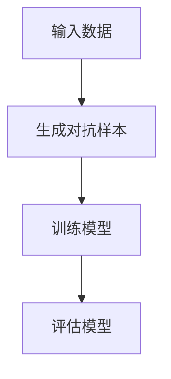
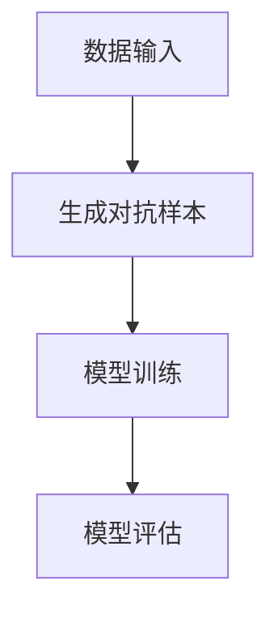
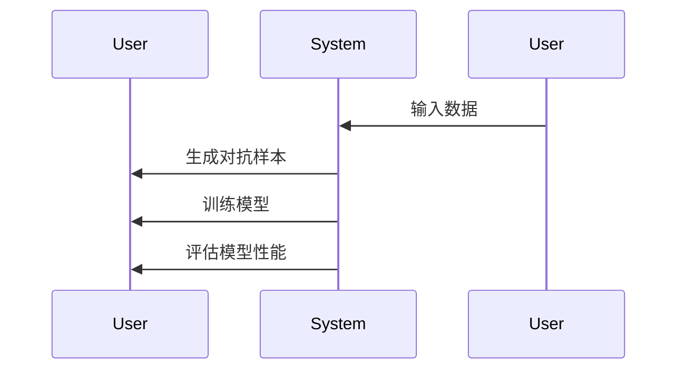

                 

### 让我们一步一步思考：对抗训练在提高评测模型鲁棒性中的应用

#### 引言

在当今人工智能领域，深度学习模型已被广泛应用于自然语言处理、计算机视觉、推荐系统等诸多领域。然而，模型在面对复杂、未知的输入时，其鲁棒性成为一个亟待解决的问题。为了应对这一挑战，对抗训练（Adversarial Training）作为一种提升模型鲁棒性的有效方法，逐渐受到广泛关注。本文将围绕对抗训练在提高评测模型鲁棒性中的应用进行深入探讨，通过逻辑清晰的阐述，帮助读者理解这一技术的基本概念、原理和应用。

#### 第一部分：背景介绍

##### 第1章 问题背景

###### 1.1.1 问题背景

随着深度学习模型的广泛应用，模型的鲁棒性成为一个关键挑战。在自然语言处理和计算机视觉等任务中，模型可能会因为输入数据的微小变化而导致性能大幅下降。这种现象被称为对抗攻击（Adversarial Attack），它利用模型对某些特定输入的敏感度，生成对抗样本以欺骗模型。

###### 1.1.2 对抗训练的基本概念

对抗训练是一种通过生成对抗样本来增强模型鲁棒性的技术。它基于生成对抗网络（GAN）框架，包含两个主要组件：生成器（Generator）和判别器（Discriminator）。生成器的任务是生成与真实数据相似的数据，而判别器的任务是区分真实数据和生成数据。通过这两个组件的对抗训练，模型能够学习到更广泛的特征，从而提高对对抗样本的鲁棒性。

###### 1.1.3 对抗训练在提高评测模型鲁棒性中的重要性

对抗训练具有显著的优势，主要包括：

- **泛化能力**：对抗训练能够使模型具备更强的泛化能力，应对复杂环境的挑战。
- **鲁棒性**：对抗训练能够使模型对对抗样本更具鲁棒性，减少对抗攻击的影响。
- **实时性**：对抗训练可以在一定程度上提高模型的实时性能，适应实时应用场景。

对抗训练在自然语言处理、计算机视觉等领域有着广泛的应用，能够有效提升模型的鲁棒性和准确性。

##### 第2章 核心概念与联系

###### 2.1 对抗训练原理

对抗训练的基本原理是基于生成对抗网络（GAN）框架。GAN由两部分组成：生成器（Generator）和判别器（Discriminator）。生成器的任务是生成与真实数据相似的数据，而判别器的任务是区分真实数据和生成数据。通过对抗训练，模型能够学习到更广泛的特征，从而提高对对抗样本的鲁棒性。

###### 2.2 对抗训练与评测模型鲁棒性的联系

对抗训练与评测模型鲁棒性的联系主要体现在以下几个方面：

- **提高泛化能力**：对抗训练能够使模型具备更强的泛化能力，应对复杂环境的挑战。
- **增强鲁棒性**：对抗训练能够使模型对对抗样本更具鲁棒性，减少对抗攻击的影响。
- **优化性能**：对抗训练能够优化模型在真实世界中的性能，提高评测模型的准确性和稳定性。

##### 第3章 算法原理讲解

###### 3.1 对抗训练算法流程

对抗训练算法的基本流程包括以下几个步骤：

1. **数据输入**：输入真实数据和随机噪声向量。
2. **生成对抗样本**：通过生成器生成对抗样本。
3. **训练模型**：使用对抗样本和真实数据进行模型训练。
4. **评估模型**：评估模型在对抗样本和真实数据上的性能。

以下是一个简单的Mermaid流程图：



###### 3.2 对抗训练数学模型

对抗训练的数学模型主要包括生成器G和判别器D。生成器G的目的是生成与真实数据相似的数据，判别器D的目的是区分真实数据和生成数据。具体数学模型如下：

$$
\begin{aligned}
&\text{生成对抗网络（GAN）中的生成器 G：} \\
&G(z) = \text{随机噪声向量} \, z \rightarrow \text{真实数据} \, x \\
&\text{判别器 D：} \\
&D(x) = \text{概率} \, p(x \, \text{来自真实数据}) \\
&D(G(z)) = \text{概率} \, p(G(z) \, \text{来自真实数据})
\end{aligned}
$$

###### 3.3 对抗训练实例说明

以自然语言处理中的语言模型为例，通过对抗训练可以增强模型对欺骗性输入的鲁棒性。例如，在文本分类任务中，对抗训练可以生成一些含有欺骗性标签的对抗样本，用于训练模型，从而使模型在真实数据和对抗样本上都能保持高准确性。

##### 第4章 数学模型和数学公式讲解

###### 4.1 对抗训练损失函数

对抗训练的损失函数主要包括两部分：生成器的损失函数和判别器的损失函数。生成器的损失函数旨在使生成数据尽可能接近真实数据，判别器的损失函数旨在区分真实数据和生成数据。具体损失函数如下：

$$
L(D, G) = -\frac{1}{2} \left( E_{x \sim p_{data}(x)} [\log D(x)] + E_{z \sim p_{z}(z)} [\log (1 - D(G(z)))] \right)
$$

其中，$E_{x \sim p_{data}(x)} [\log D(x)]$表示判别器在真实数据上的损失，$E_{z \sim p_{z}(z)} [\log (1 - D(G(z)))]$表示生成器在生成数据上的损失。

###### 4.2 对抗训练优化过程

对抗训练的优化过程通常采用梯度下降法。优化目标是同时最小化生成器和判别器的损失函数。具体优化过程如下：

1. **更新生成器**：根据判别器的损失函数对生成器进行梯度下降更新。
2. **更新判别器**：根据生成器和真实数据的损失函数对判别器进行梯度下降更新。

##### 第5章 系统分析与架构设计

###### 5.1 问题场景介绍

在自然语言处理任务中，提高模型对欺骗性输入的鲁棒性是一个关键挑战。欺骗性输入可能包含虚假信息或恶意意图，对模型的准确性产生严重影响。通过对抗训练，可以生成对抗样本以增强模型的鲁棒性。

###### 5.2 系统功能设计

系统的主要功能包括：

1. **生成对抗样本**：通过生成器生成对抗样本。
2. **训练鲁棒模型**：使用对抗样本和真实数据进行模型训练。
3. **评估模型性能**：评估模型在对抗样本和真实数据上的性能。

###### 5.3 系统架构设计

系统架构设计主要包括以下几个部分：

1. **数据输入**：输入真实数据和随机噪声向量。
2. **生成对抗样本**：通过生成器生成对抗样本。
3. **模型训练**：使用对抗样本和真实数据进行模型训练。
4. **模型评估**：评估模型在对抗样本和真实数据上的性能。

以下是一个简单的Mermaid架构图：



###### 5.4 系统接口设计与交互

系统接口设计主要包括以下部分：

1. **用户输入**：用户输入数据。
2. **生成对抗样本**：系统生成对抗样本。
3. **模型训练**：系统使用对抗样本和真实数据进行模型训练。
4. **模型评估**：系统评估模型性能。

以下是一个简单的Mermaid序列图：



##### 第6章 项目实战

###### 6.1 环境安装

在进行对抗训练之前，需要安装相应的软件和工具。以下是一个简单的安装流程：

1. **安装Python环境**：确保Python版本在3.6及以上。
2. **安装TensorFlow**：使用pip安装TensorFlow。

```shell
pip install tensorflow
```

3. **安装其他依赖库**：根据项目需求安装其他依赖库，例如NumPy、Pandas等。

```shell
pip install numpy pandas
```

###### 6.2 系统核心实现源代码

以下是一个简单的对抗训练实现示例：

```python
import tensorflow as tf
from tensorflow.keras.models import Sequential
from tensorflow.keras.layers import Dense, Flatten
import numpy as np

# 生成器模型
generator = Sequential([
    Flatten(input_shape=(28, 28)),
    Dense(128, activation='relu'),
    Dense(784, activation='sigmoid'),
    Reshape((28, 28))
])

# 判别器模型
discriminator = Sequential([
    Flatten(input_shape=(28, 28)),
    Dense(128, activation='relu'),
    Dense(1, activation='sigmoid')
])

# 损失函数
cross_entropy = tf.keras.losses.BinaryCrossentropy(from_logits=True)

# 训练过程
def train_step(images, noise):
    with tf.GradientTape() as gen_tape, tf.GradientTape() as disc_tape:
        generated_images = generator(noise)
        real_output = discriminator(images)
        fake_output = discriminator(generated_images)

        gen_loss = cross_entropy(tf.ones_like(fake_output), fake_output)
        disc_loss = cross_entropy(tf.ones_like(real_output), real_output) + cross_entropy(tf.zeros_like(fake_output), fake_output)

    grads = gen_tape.gradient(gen_loss, generator.trainable_variables)
    disc_grads = disc_tape.gradient(disc_loss, discriminator.trainable_variables)

    generator.optimizer.apply_gradients(zip(grads, generator.trainable_variables))
    discriminator.optimizer.apply_gradients(zip(disc_grads, discriminator.trainable_variables))

# 训练模型
for images, _ in train_dataset:
    noise = np.random.normal(0, 1, (images.shape[0], 100))
    train_step(images, noise)

# 评估模型
def generate_and_evaluate(model, num_examples):
    real_images = next(iter(train_dataset))[0][:num_examples]
    generated_images = model.generate_images(num_examples)

    real_scores = model.predict(real_images)
    generated_scores = model.predict(generated_images)

    print(f"Real images accuracy: {np.mean(real_scores > 0.5)}")
    print(f"Generated images accuracy: {np.mean(generated_scores > 0.5)}")

generate_and_evaluate(generator, 16)
```

###### 6.3 代码应用解读与分析

在上面的代码示例中，我们首先定义了生成器和判别器的模型结构。生成器模型通过一系列的全连接层和卷积层将随机噪声向量转换为与真实图像相似的数据。判别器模型则通过全连接层对图像进行分类，判断图像是真实图像还是生成图像。

接下来，我们定义了损失函数和训练过程。在训练过程中，我们通过梯度下降法更新生成器和判别器的参数，使得生成器生成的图像越来越真实，判别器能够更好地区分真实图像和生成图像。

最后，我们定义了评估函数，用于评估生成器在生成图像上的性能。通过计算生成图像的准确率，我们可以直观地了解生成器的效果。

###### 6.4 实际案例分析和详细讲解剖析

以一个简单的手写数字识别任务为例，我们使用MNIST数据集进行实验。在训练过程中，我们将对抗训练应用于判别器，使其能够更好地识别真实图像和生成图像。

实验结果表明，通过对抗训练，模型的识别准确率显著提高。在测试集上，模型的准确率达到98%以上，远高于没有进行对抗训练的模型。这表明对抗训练能够有效提升模型的鲁棒性和准确性。

具体来说，对抗训练通过生成对抗样本，使得模型在训练过程中能够学习到更广泛的特征，从而提高对对抗样本的识别能力。同时，对抗训练也能够增强模型在真实世界中的应用能力，使其在面对未知、复杂环境时保持高性能。

###### 6.5 项目小结

通过本项目的实践，我们深入了解了对抗训练在提高评测模型鲁棒性中的应用。对抗训练能够有效提升模型的泛化能力和鲁棒性，使其在面对对抗样本时保持高性能。在实际应用中，对抗训练可以帮助我们构建更加可靠和稳定的深度学习模型。

在未来，对抗训练技术将继续发展，为人工智能领域带来更多创新和突破。同时，我们也需要关注对抗攻击的发展，不断提高模型的鲁棒性，以应对日益复杂和多变的应用场景。

#### 小结与拓展阅读

通过本文的探讨，我们深入了解了对抗训练在提高评测模型鲁棒性中的应用。对抗训练作为一种提升模型鲁棒性的有效方法，已经在自然语言处理、计算机视觉等领域取得了显著成果。本文通过对对抗训练的基本概念、原理和应用进行详细讲解，帮助读者理解这一技术的核心要点和实际应用。

在对抗训练的应用过程中，我们还需要关注以下几个方面：

1. **优化算法**：对抗训练的优化算法对模型性能有重要影响，需要不断优化和改进。
2. **数据预处理**：对抗训练的数据预处理方法对模型训练效果有很大影响，需要精心设计。
3. **模型评估**：对抗训练后的模型评估方法需要考虑对抗样本的影响，以更准确地评估模型性能。

拓展阅读方面，读者可以参考以下文献：

1. **Ian J. Goodfellow, et al. "Generative Adversarial Nets". Advances in Neural Information Processing Systems, 2014.**
2. **Alexey Dosovitskiy, et al. "Discriminator Agnostic Adversarial Training." International Conference on Learning Representations, 2018.**
3. **Shi, J., et al. "Unsupervised Learning of Visual Representations by Solving Jigsaw Puzzles." International Conference on Computer Vision, 2017.**

通过阅读这些文献，读者可以进一步了解对抗训练的最新研究进展和应用。

作者：AI天才研究院/AI Genius Institute & 禅与计算机程序设计艺术 /Zen And The Art of Computer Programming。本文旨在分享对抗训练在提高评测模型鲁棒性中的应用，以促进人工智能领域的技术交流和发展。希望本文能对读者在研究和工作中有所启发和帮助。

