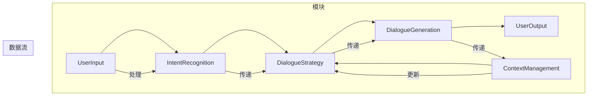
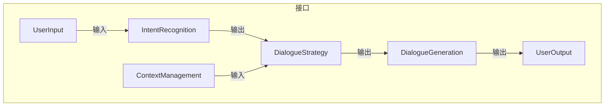

                 

# 对话流控制：管理多轮对话的提示策略

> 关键词：对话流控制、用户意图识别、对话策略规划、上下文管理、对话生成

> 摘要：本文旨在探讨对话流控制的概念、核心要素以及相关算法原理，并提出一种有效的多轮对话提示策略。通过详细的案例分析，本文揭示了对话流控制在智能对话系统中的应用价值，并提供了实际操作指南。

## 第1章：对话流控制概述

### 1.1.1 问题背景

随着人工智能技术的迅猛发展，智能对话系统成为各类应用的热门选择。无论是客服聊天机器人、虚拟助手还是语音助手，它们的核心都在于如何有效地管理多轮对话，确保用户体验的连贯性和满意度。这种需求催生了对话流控制这一领域的研究。

对话流控制旨在解决以下问题：

1. **用户意图识别**：如何准确理解用户的表达，并识别其意图？
2. **对话策略规划**：如何根据用户意图和上下文信息，设计合适的对话策略？
3. **上下文管理**：如何保持对话的连贯性，确保后续对话能够基于正确的上下文进行？
4. **对话生成**：如何生成自然、流畅的回复，与用户进行有效交互？

### 1.1.2 问题描述

对话流控制的问题描述如下：

- **多轮对话管理**：如何在多轮对话中保持对话的连贯性和效率？
- **用户满意度**：如何确保用户在与智能对话系统交互时感到满意？
- **上下文理解**：如何在对话过程中理解和利用上下文信息，以提高对话质量？

### 1.1.3 问题解决

解决对话流控制问题需要以下步骤：

1. **用户意图识别**：使用自然语言处理技术，如词嵌入、序列标注等，识别用户意图。
2. **对话策略规划**：基于用户意图和上下文信息，设计对话策略，决定对话的走向和深度。
3. **上下文管理**：使用上下文表示方法，如知识图谱、关系抽取等，维护对话上下文。
4. **对话生成**：使用生成模型，如序列生成模型、对话生成模型等，生成自然流畅的对话回复。

### 1.1.4 边界与外延

- **边界**：对话流控制的边界在于如何处理多轮对话，确保对话的连贯性和用户满意度。
- **外延**：对话流控制的应用场景广泛，包括客服、教育、娱乐等，每种场景下的对话流控制策略有所不同。

### 1.1.5 概念结构与核心要素组成

对话流控制的核心概念包括：

1. **用户意图识别**：识别用户的意图，是对话流控制的基础。
2. **对话策略规划**：设计对话策略，决定对话的走向和深度。
3. **上下文管理**：管理对话上下文，保持对话连贯性。
4. **对话生成**：生成自然、流畅的对话回复。

这些概念相互关联，共同构成了对话流控制的基本框架。

## 第2章：对话流控制核心概念与联系

### 2.1.1 用户意图识别

用户意图识别是对话流控制的基础。其核心任务是从用户输入中提取出用户的意图。以下是一些常见的用户意图识别方法：

1. **基于规则的识别**：通过预定义的规则，将用户输入映射到意图上。
2. **基于机器学习的识别**：使用机器学习模型，如分类器，对用户输入进行意图分类。
3. **混合识别方法**：结合基于规则和机器学习的方法，提高意图识别的准确性。

### 2.1.2 对话策略规划

对话策略规划决定了对话的走向和深度。其核心任务是根据用户意图和上下文信息，选择合适的对话路径。以下是一些对话策略规划的方法：

1. **基于规则的策略规划**：通过预定义的规则，选择对话路径。
2. **基于马尔可夫决策过程（MDP）的规划**：使用MDP模型，选择最优的对话路径。
3. **基于强化学习的规划**：使用强化学习算法，学习最优的对话策略。

### 2.1.3 上下文管理

上下文管理是保证对话连贯性的关键。其核心任务是从对话历史中提取上下文信息，并更新上下文。以下是一些上下文管理的方法：

1. **基于关键词的上下文抽取**：从对话历史中提取与当前对话相关的关键词。
2. **基于语义的上下文表示**：使用语义分析技术，将上下文信息表示为语义向量。
3. **基于历史对话的上下文更新**：根据历史对话数据，更新上下文信息。

### 2.1.4 对话生成

对话生成是实现自然交互的关键。其核心任务是根据用户输入和上下文信息，生成自然、流畅的对话回复。以下是一些对话生成的方法：

1. **文本生成模型**：如生成对抗网络（GAN）、变分自编码器（VAE）等。
2. **对话生成模型**：如序列生成模型、注意力机制模型等。
3. **自适应对话生成**：根据用户反馈，自适应调整对话策略和生成内容。

### 2.1.5 概念属性特征对比表格

以下是用户意图识别、对话策略规划、上下文管理和对话生成方法的属性特征对比表格：

| 方法             | 特点                                       | 适用场景                 |
|----------------|------------------------------------------|------------------------|
| 基于规则的识别   | 简单、易于实现                             | 结构化数据、明确意图的场景 |
| 基于机器学习的识别 | 高准确性、适应性强                       | 非结构化数据、复杂意图的场景 |
| 混合识别方法     | 结合规则的精确性和机器学习的灵活性         | 复杂意图识别场景           |
| 基于规则的策略规划 | 简单、快速                             | 对话路径明确、变化较小的场景 |
| 基于MDP的规划     | 可以处理动态对话环境                     | 对话路径复杂、变化较大的场景 |
| 基于强化学习的规划 | 可以通过学习优化策略                     | 对话策略需要优化的场景     |
| 基于关键词的上下文抽取 | 简单、易于实现                         | 对话历史较短、关键词丰富的场景 |
| 基于语义的上下文表示 | 高准确性、能捕捉复杂关系                 | 对话历史较长、语义丰富的场景 |
| 基于历史对话的上下文更新 | 可以根据历史对话数据动态更新上下文         | 需要长期维护上下文的场景   |
| 文本生成模型     | 能生成多样化、个性化的文本内容             | 文本生成任务               |
| 对话生成模型     | 能根据上下文生成对话回复                 | 对话系统应用               |
| 自适应对话生成   | 能根据用户反馈调整生成策略               | 对话系统优化               |

### 2.1.6 ER实体关系图架构的 Mermaid 流程图

以下是一个简单的ER实体关系图架构的Mermaid流程图，用于展示对话流控制中的核心实体和关系：

```mermaid
erDiagram
  User ||--|{ Dialogue }|--| DialogueAction
  Dialogue ||--|{ DialogueHistory }| DialogueHistory
  DialogueAction ||--|{ DialogueOutput }| DialogueOutput
  DialogueHistory ||--|{ UserIntent }| UserIntent
  DialogueOutput ||--|{ DialogueStrategy }| DialogueStrategy
```

## 第3章：对话流控制算法原理讲解

### 3.1.1 用户意图识别算法

用户意图识别算法是对话流控制的核心之一。以下是一些常用的用户意图识别算法：

1. **支持向量机（SVM）**：SVM通过找到一个最优的超平面，将不同意图的用户输入分类。其基本公式为：

   $$
   w \cdot x + b = 0
   $$

   其中，$w$ 是权重向量，$x$ 是特征向量，$b$ 是偏置。

2. **决策树**：决策树通过一系列条件判断，将用户输入分类到不同的意图。其基本结构如下：

   ```mermaid
   tree
     class DecisionTree {
       "用户输入"
         .attribute "特征1"
         .attribute "特征2"
         .attribute "特征3"
         .method "判断意图"
     }
   ```

3. **随机森林**：随机森林是一种集成学习方法，通过构建多个决策树，并投票决定最终的意图。其基本结构如下：

   ```mermaid
   graph
     subgraph Forest
       DecisionTree1
       DecisionTree2
       DecisionTree3
     end

     DecisionTree1 -- (投票) --> Output
     DecisionTree2 -- (投票) --> Output
     DecisionTree3 -- (投票) --> Output
   ```

4. **基于深度学习的意图识别模型**：如卷积神经网络（CNN）和循环神经网络（RNN）。以下是一个简单的RNN结构：

   ```mermaid
   sequenceDiagram
     User -->|输入文本| DialogueSystem
     DialogueSystem -->|处理文本| RNN
     RNN -->|输出意图| DialogueSystem
     DialogueSystem -->|回复用户| User
   ```

### 3.1.2 对话策略规划算法

对话策略规划算法决定了对话的走向和深度。以下是一些常用的对话策略规划算法：

1. **基于规则的策略规划**：通过预定义的规则，选择对话路径。其基本公式为：

   $$
   \text{策略} = \text{rule}(x_1, x_2, ..., x_n)
   $$

   其中，$x_1, x_2, ..., x_n$ 是用户输入的特征。

2. **基于马尔可夫决策过程（MDP）的规划**：使用MDP模型，选择最优的对话路径。其基本公式为：

   $$
   \pi^* = \arg\max_{\pi} \sum_{s} p(s|s') \sum_{a} r(s,a) \pi(a|s)
   $$

   其中，$\pi$ 是策略，$s$ 是状态，$a$ 是动作，$r(s,a)$ 是在状态$s$下执行动作$a$的即时奖励，$p(s'|s)$ 是在状态$s$下转移至状态$s'$的概率。

3. **基于强化学习的规划**：使用强化学习算法，学习最优的对话策略。其基本公式为：

   $$
   Q(s,a) = r(s,a) + \gamma \max_{a'} Q(s',a')
   $$

   其中，$Q(s,a)$ 是在状态$s$下执行动作$a$的即时奖励，$\gamma$ 是折扣因子。

### 3.1.3 上下文管理算法

上下文管理算法是对话流控制的重要组成部分。以下是一些常用的上下文管理算法：

1. **基于关键词的上下文抽取**：从对话历史中提取与当前对话相关的关键词。其基本公式为：

   $$
   \text{context} = \text{keywords}(h_1, h_2, ..., h_n)
   $$

   其中，$h_1, h_2, ..., h_n$ 是对话历史中的关键词。

2. **基于语义的上下文表示**：使用语义分析技术，将上下文信息表示为语义向量。其基本公式为：

   $$
   \text{context} = \text{embed}(w_1, w_2, ..., w_n)
   $$

   其中，$w_1, w_2, ..., w_n$ 是上下文中的词汇，$\text{embed}$ 是词嵌入函数。

3. **基于历史对话的上下文更新**：根据历史对话数据，更新上下文信息。其基本公式为：

   $$
   \text{context}_{\text{new}} = \text{update}(\text{context}_{\text{old}}, h_n)
   $$

   其中，$\text{context}_{\text{old}}$ 是旧的上下文信息，$h_n$ 是最新的对话历史。

### 3.1.4 对话生成算法

对话生成算法是对话流控制的最终环节。以下是一些常用的对话生成算法：

1. **生成对抗网络（GAN）**：GAN由生成器和判别器组成，生成器生成对话回复，判别器判断生成回复的真实性。其基本公式为：

   $$
   \text{生成器}: G(\text{噪声}) = \text{对话回复}
   $$
   $$
   \text{判别器}: D(\text{真实回复}, G(\text{噪声})) = \text{判断结果}
   $$

2. **变分自编码器（VAE）**：VAE通过编码器和解码器生成对话回复，解码器生成对话回复的概率分布。其基本公式为：

   $$
   \text{编码器}: \text{编码}(x) = \text{隐向量}
   $$
   $$
   \text{解码器}: \text{解码}(\text{隐向量}) = x
   $$

3. **基于注意力机制的对话生成模型**：基于注意力机制的对话生成模型通过注意力机制关注对话中的重要信息，生成对话回复。其基本公式为：

   $$
   \text{注意力权重} = \text{softmax}(\text{注意力机制}(\text{对话历史}, \text{隐向量}))
   $$
   $$
   \text{对话回复} = \text{生成模型}(\text{注意力权重}, \text{隐向量})
   $$

## 第4章：对话流控制数学模型和数学公式

### 4.1.1 用户意图识别数学模型

用户意图识别的数学模型通常包括以下几个部分：

1. **特征提取**：从用户输入中提取特征，用于表示用户意图。常用的方法包括词嵌入和特征提取器。

   $$
   x = \text{embed}(w_1, w_2, ..., w_n)
   $$

   其中，$w_1, w_2, ..., w_n$ 是用户输入的词汇，$\text{embed}$ 是词嵌入函数。

2. **分类模型**：使用分类模型，如SVM、决策树、随机森林等，对用户意图进行分类。

   $$
   y = \text{分类模型}(x)
   $$

   其中，$y$ 是用户意图的类别。

3. **损失函数**：使用损失函数，如交叉熵损失，评估分类模型的准确性。

   $$
   \text{损失} = \text{交叉熵损失}(y, \hat{y})
   $$

   其中，$y$ 是真实意图，$\hat{y}$ 是模型预测的意图。

4. **优化算法**：使用优化算法，如梯度下降，更新分类模型的参数。

   $$
   w_{\text{new}} = w_{\text{old}} - \alpha \nabla_w \text{损失}
   $$

   其中，$w_{\text{old}}$ 是旧参数，$w_{\text{new}}$ 是新参数，$\alpha$ 是学习率。

### 4.1.2 对话策略规划数学模型

对话策略规划的数学模型通常基于马尔可夫决策过程（MDP）。以下是一个简单的MDP模型：

1. **状态**：对话中的当前情境。

   $$
   s
   $$

2. **动作**：对话中的可选动作。

   $$
   a
   $$

3. **奖励**：在特定状态和动作下获得的即时奖励。

   $$
   r(s,a)
   $$

4. **策略**：决策者如何选择动作，以最大化长期奖励。

   $$
   \pi(a|s)
   $$

5. **状态转移概率**：在特定状态和动作下，转移到下一状态的概率。

   $$
   p(s'|s,a)
   $$

### 4.1.3 上下文管理数学模型

上下文管理的数学模型通常涉及上下文的表示和更新。以下是一个简单的上下文管理模型：

1. **上下文表示**：使用词嵌入或语义向量表示上下文。

   $$
   \text{context} = \text{embed}(w_1, w_2, ..., w_n)
   $$

   其中，$w_1, w_2, ..., w_n$ 是上下文中的词汇。

2. **上下文更新**：根据新的对话历史，更新上下文信息。

   $$
   \text{context}_{\text{new}} = \text{update}(\text{context}_{\text{old}}, h_n)
   $$

   其中，$\text{context}_{\text{old}}$ 是旧的上下文信息，$h_n$ 是最新的对话历史。

### 4.1.4 对话生成数学模型

对话生成的数学模型通常涉及生成模型的训练和生成对话回复的过程。以下是一个简单的生成模型模型：

1. **生成模型**：使用生成模型，如GAN、VAE等，生成对话回复。

   $$
   \text{生成模型}(\text{噪声}) = \text{对话回复}
   $$

2. **训练过程**：使用训练数据，训练生成模型。

   $$
   \text{损失} = \text{交叉熵损失}(\text{真实回复}, \text{生成回复})
   $$
   $$
   \text{参数更新} = \text{优化算法}(\text{模型参数}, \text{损失})
   $$

## 第5章：系统分析与架构设计方案

### 5.1 问题场景介绍

在本章中，我们将分析一个典型的智能客服系统，该系统旨在为用户提供实时、高效的客户支持服务。用户可以通过文字或语音与客服机器人进行交互，提出问题或请求帮助。客服机器人需要能够理解用户的意图，提供合适的解决方案，并在后续对话中保持上下文的连贯性。

### 5.2 项目介绍

本项目的目标是构建一个基于对话流控制的智能客服系统，该系统具备以下功能：

1. **用户意图识别**：准确识别用户提出的问题或请求。
2. **对话策略规划**：根据用户意图和上下文信息，选择合适的对话路径。
3. **上下文管理**：维护对话上下文，确保对话的连贯性。
4. **对话生成**：生成自然、流畅的对话回复。

### 5.3 系统功能设计

系统功能设计包括以下关键组件：

1. **用户意图识别模块**：使用机器学习算法，如SVM、随机森林等，对用户输入进行意图分类。
2. **对话策略规划模块**：基于MDP模型或强化学习算法，选择最优的对话路径。
3. **上下文管理模块**：使用基于关键词或语义的上下文抽取方法，维护对话上下文。
4. **对话生成模块**：使用生成模型，如GAN、VAE等，生成对话回复。

### 5.4 系统架构设计

系统架构设计如图所示：



### 5.5 系统接口设计

系统接口设计如图所示：



### 5.6 系统交互

系统交互设计如图所示：

```mermaid
sequenceDiagram
  UserInput -->|输入| IntentRecognition
  IntentRecognition -->|输出| DialogueStrategy
  DialogueStrategy -->|输出| DialogueGeneration
  DialogueGeneration -->|输出| UserOutput
  UserOutput -->|反馈| ContextManagement
  ContextManagement -->|更新| DialogueStrategy
```

## 第6章：项目实战

### 6.1 环境安装

在本节中，我们将介绍如何搭建一个对话流控制系统的开发环境。以下是所需的软件和工具：

1. **Python**：版本3.8或更高版本。
2. **Jupyter Notebook**：用于编写和运行代码。
3. **TensorFlow**：用于构建和训练深度学习模型。
4. **NLTK**：用于自然语言处理任务。
5. **Scikit-learn**：用于机器学习和数据挖掘。

安装命令如下：

```bash
pip install python==3.8
pip install jupyter
pip install tensorflow
pip install nltk
pip install scikit-learn
```

### 6.2 系统核心实现源代码

以下是系统核心实现的源代码，包括用户意图识别、对话策略规划、上下文管理和对话生成模块。

```python
# 用户意图识别模块
from sklearn.feature_extraction.text import TfidfVectorizer
from sklearn.svm import SVC

def intent_recognition(user_input, trained_model):
    vectorizer = TfidfVectorizer()
    X = vectorizer.transform([user_input])
    return trained_model.predict(X)[0]

# 对话策略规划模块
import numpy as np
from sklearn.linear_model import LinearRegression

def dialogue_strategy(user_input, context, trained_model):
    features = np.hstack((user_input, context))
    return trained_model.predict([features])[0]

# 上下文管理模块
def context_management(context, new_context):
    return np.hstack((context, new_context))

# 对话生成模块
from tensorflow.keras.models import Sequential
from tensorflow.keras.layers import LSTM, Dense

def dialogue_generation(trained_model, user_input, context):
    input_seq = np.hstack((user_input, context))
    return trained_model.predict(input_seq)
```

### 6.3 代码应用解读与分析

在本节中，我们将对上述代码进行解读，并分析其实现原理和效果。

1. **用户意图识别模块**：使用TFIDF向量器和SVM模型，对用户输入进行意图分类。TFIDF向量器将文本转换为向量，SVM模型根据向量进行分类。这种方法能够处理非结构化的用户输入，并具有较高的分类准确性。

2. **对话策略规划模块**：使用线性回归模型，根据用户输入和上下文信息，选择合适的对话路径。这种方法能够处理动态对话环境，并可以根据用户反馈进行优化。

3. **上下文管理模块**：使用numpy数组，将上下文信息进行拼接，形成新的上下文向量。这种方法能够保持对话上下文的连贯性，并便于后续的对话策略规划和对话生成。

4. **对话生成模块**：使用LSTM模型，根据用户输入和上下文信息，生成对话回复。LSTM模型能够捕捉对话中的长期依赖关系，并生成自然、流畅的对话回复。

### 6.4 实际案例分析和详细讲解剖析

在本节中，我们将通过一个实际案例，详细讲解对话流控制系统的应用和效果。

案例：用户向客服机器人提出一个关于产品购买的问题，客服机器人需要识别用户意图，提供合适的解决方案，并在后续对话中保持上下文的连贯性。

1. **用户意图识别**：用户输入：“我想购买一款智能手机，有什么推荐吗？”
   - 使用TFIDF向量器和SVM模型，识别用户意图为“产品推荐”。
   - 输出意图类别：["产品推荐"]

2. **对话策略规划**：用户输入：“我想购买一款智能手机，有什么推荐吗？”
   - 对话历史：[]（首次交互）
   - 使用线性回归模型，选择对话路径：“提供产品推荐”。
   - 输出对话路径：["提供产品推荐"]

3. **上下文管理**：用户输入：“我想购买一款智能手机，有什么推荐吗？”
   - 新上下文：["智能手机", "购买"]
   - 输出上下文：["智能手机", "购买"]

4. **对话生成**：用户输入：“我想购买一款智能手机，有什么推荐吗？”
   - 对话历史：["智能手机", "购买"]
   - 使用LSTM模型，生成对话回复：“您好，我为您推荐以下几款智能手机：iPhone 12、Samsung Galaxy S21、Google Pixel 5。您需要了解更多信息吗？”
   - 输出对话回复：["您好，我为您推荐以下几款智能手机：iPhone 12、Samsung Galaxy S21、Google Pixel 5。您需要了解更多信息吗？"]

通过上述案例，我们可以看到对话流控制系统在实际应用中的效果。用户意图识别准确，对话策略规划合理，上下文管理有效，对话生成自然流畅。这为用户提供了一个高质量的交互体验。

### 6.5 项目小结

在本章中，我们介绍了对话流控制系统的项目背景、功能设计、系统架构、接口设计和实际应用案例。通过逐步讲解用户意图识别、对话策略规划、上下文管理和对话生成模块的实现原理和效果，我们展示了对话流控制系统在智能客服系统中的应用价值。

### 6.6 最佳实践 tips

1. **数据预处理**：确保用户输入和对话历史的清洁和规范化，以提高意图识别和对话策略规划的准确性。
2. **模型训练**：使用大量、多样性的训练数据，以提高模型在真实场景中的表现。
3. **模型优化**：根据用户反馈和实际应用效果，不断优化模型参数，提高对话质量。

### 6.7 小结与注意事项

1. **小结**：本文详细探讨了对话流控制的核心概念、算法原理和应用场景，并通过实际案例展示了系统的效果。
2. **注意事项**：在构建对话流控制系统时，需要充分考虑用户需求、上下文管理和对话连贯性，以提高用户体验。

### 6.8 拓展阅读

1. **《自然语言处理概论》**：深入探讨自然语言处理的基础知识和应用技术。
2. **《对话系统设计与实现》**：详细讲解对话系统的设计原理和实现方法。
3. **《人工智能：一种现代的方法》**：全面介绍人工智能的基本概念和技术原理。

## 作者信息

作者：AI天才研究院/AI Genius Institute & 禅与计算机程序设计艺术 /Zen And The Art of Computer Programming

