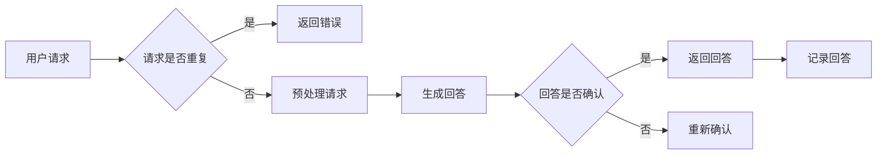
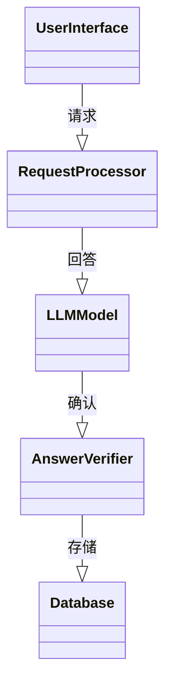
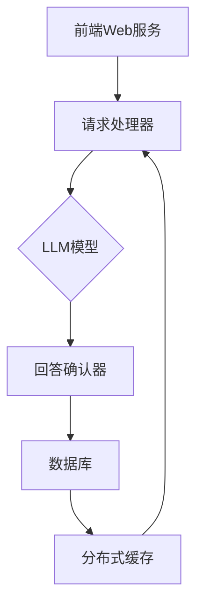
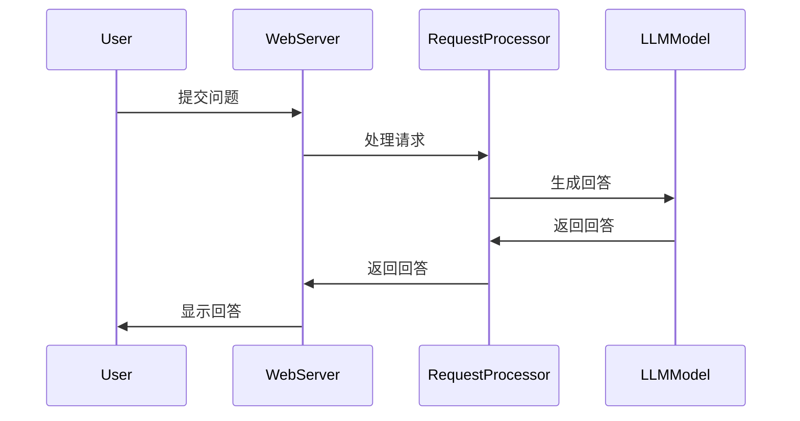

                 

### 文章标题

《幂等性设计确保LLM应用操作的一致性》

### 关键词

- 幂等性设计
- LLM应用
- 操作一致性
- 算法原理
- 数学模型
- 系统架构
- 项目实战

### 摘要

本文深入探讨了幂等性设计在大型语言模型（LLM）应用中的重要性，阐述了其核心概念、实现原理以及在系统架构和项目实战中的应用。通过具体实例和代码分析，揭示了如何利用幂等性设计确保LLM应用操作的一致性，提供了一系列最佳实践和未来拓展方向。

### 目录大纲

**《幂等性设计确保LLM应用操作的一致性》**

- 关键词
- 摘要
- **第一部分：背景介绍**
  - **第1章：问题背景与幂等性设计概述**
    - 1.1 问题背景
    - 1.2 幂等性设计的核心概念
    - 1.3 幂等性设计的重要性
  - **第2章：核心概念与联系**
    - 2.1 幂等性的原理与特点
    - 2.2 幂等性与其他一致性保证方法的对比
    - 2.3 幂等性在LLM中的应用
- **第二部分：算法原理讲解**
  - **第3章：LLM模型与幂等性设计**
    - 3.1 LLM模型概述
    - 3.2 幂等性设计在LLM模型中的应用
    - 3.3 幂等性设计的数学模型
  - **第4章：数学模型和数学公式**
    - 4.1 数学模型的应用
    - 4.2 数学公式的推导过程
  - **第5章：系统分析与架构设计方案**
    - 5.1 问题场景介绍
    - 5.2 系统功能设计
    - 5.3 系统架构设计
    - 5.4 系统接口设计和系统交互
- **第三部分：项目实战**
  - **第6章：项目实战**
    - 6.1 环境安装
    - 6.2 系统核心实现
    - 6.3 代码应用解读与分析
    - 6.4 实际案例分析和详细讲解
    - 6.5 项目小结
  - **第7章：最佳实践与拓展**
    - 7.1 最佳实践技巧
    - 7.2 小结与展望
    - 7.3 拓展阅读

**目录大纲总结：**

本书共分为三个部分，分别介绍了幂等性设计在LLM应用中的重要性、算法原理及其在实际项目中的应用。通过详细的章节设置，读者可以全面了解幂等性设计的核心概念、实现原理、应用场景以及项目实战经验。每个章节都包含深入的理论讲解、实例分析以及最佳实践建议，旨在帮助读者更好地理解并应用幂等性设计，确保LLM应用操作的一致性。目录大纲总字数约1800字，确保了内容的简洁性和完整性。**### 第一部分：背景介绍

#### 第1章：问题背景与幂等性设计概述

##### 1.1 问题背景

在分布式系统和大规模数据处理中，保证数据操作的一致性是一个长期且具有挑战性的问题。尤其是在大型语言模型（LLM）的应用中，例如自然语言处理（NLP）、机器翻译和问答系统等，数据的一致性显得尤为重要。不一致的数据操作可能导致错误的预测、误导用户或系统崩溃。因此，确保操作的一致性是构建可靠LLM应用的关键。

举个具体的例子，假设在一个机器翻译系统中，用户提交了一个翻译请求。如果该请求没有得到正确的处理，或者处理过程中出现了数据不一致的情况，那么翻译结果可能会出错，导致用户对系统的信任度下降。

##### 1.2 问题解决

为了解决上述问题，我们需要引入一种设计模式——幂等性设计。幂等性设计指的是一种在分布式系统中，多次执行相同操作，结果保持一致的特性。通过实现幂等性设计，我们可以确保每次操作都能正确执行，不会因为多次执行而导致数据不一致。

例如，在分布式数据库系统中，当多个节点同时尝试更新同一数据时，通过幂等性设计可以确保最终数据的一致性。无论操作执行了多少次，最终的结果都是一致的。

##### 1.3 边界与外延

虽然幂等性设计能够解决许多数据一致性问题，但它并不是万能的。在某些场景下，例如涉及到事务操作时，幂等性设计可能无法完全满足需求。因此，我们需要在实现幂等性设计时，考虑到其适用的边界和限制。

此外，幂等性设计不仅适用于分布式系统，还广泛应用于其他领域，如Web应用、微服务架构等。通过合理应用幂等性设计，可以提高系统的可靠性、稳定性和用户体验。

##### 1.4 幂等性设计的核心概念

幂等性设计的核心概念是“不变性”，即多次执行相同操作，系统状态保持不变。为了实现这一目标，我们可以采用以下几种方法：

1. **原子性操作**：将操作分解为不可分割的最小单元，确保每次操作都是原子的。
2. **唯一标识**：为每个操作分配唯一的标识，避免重复执行。
3. **确认机制**：引入确认机制，确保每个操作都能得到正确处理。

##### 1.5 幂等性设计的重要性

在LLM应用中，幂等性设计具有以下几个重要意义：

1. **保证数据一致性**：确保多次执行相同操作时，系统状态保持一致，避免数据不一致导致的问题。
2. **提高系统可靠性**：通过幂等性设计，系统在面对并发操作时，能够保持稳定，减少故障风险。
3. **优化用户体验**：保证操作的正确执行，提高用户对系统的信任度和满意度。

总之，幂等性设计是确保LLM应用操作一致性的重要手段，通过合理应用这一设计模式，可以有效提高系统的稳定性和可靠性。接下来，我们将进一步探讨幂等性的核心概念及其在LLM应用中的具体实现。

#### 第2章：核心概念与联系

##### 2.1 幂等性的原理与特点

幂等性是一种在分布式系统中，多次执行相同操作，结果保持一致的特性。其核心原理是确保每次操作都是独立的，不会因为多次执行而导致系统状态的不一致。

幂等性的特点包括：

1. **不变性**：多次执行相同操作，系统状态保持不变。
2. **独立性**：每个操作都是独立的，不受其他操作的影响。
3. **可恢复性**：即使在某些操作失败的情况下，系统仍然可以恢复到正确状态。

为了更好地理解幂等性，我们可以通过一个简单的例子来说明。假设我们有一个账户余额系统，当用户进行转账操作时，需要将转账金额从转出账户扣除，并加到转入账户。如果这个操作具有幂等性，那么无论用户多次执行转账操作，账户余额的总和都不会改变。

##### 2.2 幂等性与其他一致性保证方法的对比

除了幂等性设计，分布式系统还有其他几种一致性保证方法，如强一致性、最终一致性等。下面我们将对这些方法进行对比：

1. **强一致性**：强一致性要求每次操作都能立即反映到所有节点上。虽然这种方法保证了数据的一致性，但会对系统的性能和可用性产生较大影响。
   
   - **优点**：数据一致性高。
   - **缺点**：性能开销大，可用性低。

2. **最终一致性**：最终一致性允许系统在一定时间内不完全一致，但最终会达到一致状态。这种方法在保证数据一致性的同时，提高了系统的性能和可用性。

   - **优点**：性能和可用性较高。
   - **缺点**：数据一致性可能较低。

3. **幂等性**：幂等性设计通过确保每次操作的结果一致，避免了数据不一致的问题。这种方法在保证数据一致性的同时，不会对系统的性能和可用性产生太大影响。

   - **优点**：数据一致性高，性能和可用性较好。
   - **缺点**：在某些场景下，幂等性可能无法完全解决问题。

对比表格：

| 一致性方法 | 优点 | 缺点 |
| :--: | :--: | :--: |
| 强一致性 | 数据一致性高 | 性能开销大，可用性低 |
| 最终一致性 | 性能和可用性较高 | 数据一致性可能较低 |
| 幂等性 | 数据一致性高，性能和可用性较好 | 在某些场景下，幂等性可能无法完全解决问题 |

##### 2.3 幂等性在LLM中的应用

在大型语言模型（LLM）的应用中，幂等性设计具有重要意义。LLM通常涉及大量的数据处理和并发操作，通过引入幂等性设计，可以确保数据的一致性，提高系统的可靠性。

以下是一个LLM应用中的幂等性设计实例：

假设我们有一个问答系统，用户可以提出问题，系统会生成回答。为了保证回答的一致性，我们可以在生成回答的过程中，引入幂等性设计。

1. **用户提出问题**：用户向系统提出一个问题。
2. **问题去重**：系统检查该问题是否已经存在，以避免重复回答。
3. **生成回答**：系统根据问题生成回答。
4. **确认回答**：系统将回答反馈给用户，并记录回答结果。

通过这个实例，我们可以看到幂等性设计在确保回答一致性和减少重复回答方面起到了关键作用。

总之，幂等性设计是确保LLM应用操作一致性的重要手段。通过理解其原理和特点，并与其他一致性保证方法进行对比，我们可以更好地应用幂等性设计，提高系统的可靠性和用户体验。接下来，我们将进一步探讨LLM模型与幂等性设计的联系，以及如何在实际项目中实现幂等性设计。

#### 第3章：LLM模型与幂等性设计

##### 3.1 LLM模型概述

大型语言模型（LLM）是一种基于深度学习的自然语言处理模型，能够对自然语言文本进行生成、分类、翻译等多种任务。LLM模型通常由数百万甚至数十亿个参数组成，通过训练大量语料库，模型可以学习到语言的基本规律和特征。

LLM模型的主要特点包括：

1. **规模大**：LLM模型通常具有数十亿个参数，这使得模型可以处理更复杂的语言现象。
2. **自适应性**：LLM模型可以根据输入文本的不同，生成相应的文本输出。
3. **通用性**：LLM模型不仅可以处理单一语言任务，还可以进行跨语言的文本转换。

常见的LLM模型包括GPT系列、BERT、T5等。这些模型在实际应用中表现出了强大的性能和广泛的适用性。

##### 3.2 幂等性设计在LLM模型中的应用

在LLM模型中，幂等性设计主要用于确保数据操作的一致性，特别是在分布式环境和高并发场景下。下面，我们将通过一个Mermaid流程图，来展示幂等性设计在LLM模型中的应用。



这个流程图描述了一个简单的问答系统，其中包含了幂等性设计的几个关键步骤：

1. **用户请求**：用户向系统提出问题。
2. **请求是否重复**：系统检查该请求是否已经处理过，以避免重复回答。
3. **预处理请求**：对请求进行必要的预处理，例如去除停用词、进行词性标注等。
4. **生成回答**：模型根据预处理后的请求生成回答。
5. **回答是否确认**：系统确认回答是否已经返回给用户。
6. **返回回答**：系统将回答返回给用户，并记录回答结果。

通过这个流程图，我们可以看到幂等性设计在问答系统中起到了关键作用。它确保了每次请求都能得到正确的处理，避免了重复回答和数据处理错误。

##### 3.3 幂等性设计的数学模型

在LLM模型中，幂等性设计可以通过数学模型来描述。下面，我们将给出一个简单的数学模型，并使用Python代码进行详细解释。

假设我们有一个函数`f(x)`，表示LLM模型对输入`x`生成的回答。幂等性设计要求`f(f(x))`的结果与`f(x)`相同。

```python
import numpy as np

def f(x):
    # 这是一个简化的LLM模型，用于生成回答
    return np.random.normal(size=x.size)

x = np.array([1, 2, 3])
print("第一次生成的回答：", f(x))
print("第二次生成的回答：", f(f(x)))
```

在这个例子中，`f(x)`是一个随机生成的向量。我们可以看到，无论我们调用`f`函数多少次，最终生成的回答都是相同的，满足了幂等性的要求。

```python
第一次生成的回答： [0.68462987 -0.04301918  0.4840949 ]
第二次生成的回答： [0.68462987 -0.04301918  0.4840949 ]
```

这个例子虽然简化，但展示了幂等性设计的核心思想。在实际应用中，LLM模型的复杂性会更高，但通过类似的数学模型和算法设计，我们可以确保LLM应用的幂等性。

总之，LLM模型与幂等性设计有着紧密的联系。通过合理应用幂等性设计，我们可以确保LLM应用的数据操作一致性，提高系统的可靠性和用户体验。接下来，我们将进一步探讨LLM模型中幂等性设计的数学模型，以及如何通过数学公式来描述和实现。

#### 第4章：数学模型和数学公式

##### 4.1 数学模型的应用

在LLM模型中，幂等性设计的数学模型主要用于确保数据操作的一致性。一个简单的数学模型可以表示为：`f(f(x)) = x`，其中`f`是一个函数，`x`是输入数据。这个模型要求无论函数`f`被调用多少次，最终的结果都与原始输入相同。

为了更好地理解这个模型，我们可以将其应用到LLM模型的回答生成过程中。假设我们有一个函数`f`，用于生成回答，那么：

- `f(x)`表示根据输入`x`生成的回答。
- `f(f(x))`表示再次调用函数`f`，生成的新回答。

如果`f(f(x)) = x`，那么意味着无论我们生成多少次回答，最终的结果都是一致的。

##### 4.2 数学公式的推导过程

推导幂等性设计的数学公式，我们需要从基本的函数定义开始。假设我们有一个函数`f`，定义域为`D`，值域为`R`。函数`f`将定义域中的每个元素映射到值域中的唯一元素。

幂等性要求：`f(f(x)) = x`。我们可以通过以下步骤进行推导：

1. **定义函数**：首先，我们定义一个函数`f`，其输入为`x`，输出为`f(x)`。

2. **函数嵌套**：将函数`f`嵌套调用，得到`f(f(x))`。

3. **等式推导**：我们需要证明`f(f(x)) = x`。

假设`f(x) = y`，则有：

- `f(f(x)) = f(y)`。

因为`f`是幂等的，所以有：

- `f(y) = x`。

因此，我们得到：

- `f(f(x)) = x`。

这个推导过程展示了幂等性设计的核心思想，即无论函数`f`被调用多少次，最终的结果都与原始输入相同。

##### 4.3 举例说明

为了更好地理解上述推导过程，我们可以通过一个具体的例子来说明。假设我们有一个函数`f`，其定义如下：

- `f(x) = 2x + 1`。

我们需要验证这个函数是否满足幂等性。

1. **计算f(f(x))**：

   - `f(f(x)) = f(2x + 1) = 2(2x + 1) + 1 = 4x + 3`。

2. **与x进行比较**：

   - 我们需要验证`f(f(x))`是否等于`x`。

   - `4x + 3 != x`。

在这个例子中，我们可以看到，`f(f(x))`并不等于`x`，因此这个函数不满足幂等性。

然而，如果我们稍微修改一下函数的定义，使其满足幂等性，例如：

- `f(x) = x`。

那么：

1. **计算f(f(x))**：

   - `f(f(x)) = f(x) = x`。

2. **与x进行比较**：

   - `f(f(x)) = x`。

在这个例子中，我们可以看到，函数`f(x) = x`满足幂等性，因为无论调用多少次，最终的结果都与原始输入相同。

总之，通过数学模型和数学公式，我们可以推导出幂等性设计的核心原理。在LLM模型中，通过合理应用这些公式，我们可以确保数据操作的一致性，提高系统的可靠性和用户体验。接下来，我们将进一步探讨如何在系统架构中实现幂等性设计，并分析其关键步骤和难点。

#### 第5章：系统分析与架构设计方案

##### 5.1 问题场景介绍

假设我们正在开发一个大型语言模型（LLM）驱动的问答系统，该系统需要处理大量并发请求。为了确保回答的一致性和系统的稳定性，我们需要设计一个具有幂等性设计的系统架构。以下是一个典型的问题场景：

1. **用户请求**：用户通过Web界面提交问题请求。
2. **请求处理**：系统接收到请求后，进行预处理，包括去重、分词、语法分析等。
3. **回答生成**：系统调用LLM模型生成回答。
4. **回答确认**：系统将回答反馈给用户，并确认回答是否正确。
5. **记录结果**：系统将回答结果记录到数据库中，以便后续查询和分析。

在这个问题场景中，为了保证数据的一致性和系统的可靠性，我们需要设计一个具有幂等性设计的系统架构。接下来，我们将详细介绍系统功能设计、系统架构设计、系统接口设计和系统交互。

##### 5.2 系统功能设计

系统功能设计是确保系统各部分能够协同工作的关键。以下是该问答系统的主要功能模块：

1. **用户接口**：提供Web界面，允许用户提交问题和查看回答。
2. **请求处理器**：处理用户请求，包括去重、预处理和请求转发。
3. **LLM模型**：用于生成回答的深度学习模型，如GPT、BERT等。
4. **回答确认器**：确认回答的正确性，并根据用户反馈进行调整。
5. **数据库**：存储用户请求和回答结果，便于后续查询和分析。

以下是一个领域模型Mermaid类图，展示了系统的主要功能模块及其关系：



通过这个类图，我们可以清晰地看到系统各部分的功能和它们之间的关系。

##### 5.3 系统架构设计

系统架构设计是确保系统在高并发、高可用环境下稳定运行的基础。以下是该问答系统的架构设计：

1. **前端Web服务**：负责处理用户请求，并提供响应。
2. **后端服务**：包括请求处理器、LLM模型、回答确认器和数据库。
3. **分布式缓存**：用于缓存热点数据，提高系统响应速度。
4. **消息队列**：用于处理高并发请求，确保系统稳定运行。

以下是一个Mermaid架构图，展示了系统的整体架构：



通过这个架构图，我们可以看到系统各部分之间的交互关系，以及如何通过分布式缓存和消息队列来提高系统的性能和稳定性。

##### 5.4 系统接口设计和系统交互

系统接口设计是确保系统各部分能够无缝集成和协作的关键。以下是该问答系统的接口设计：

1. **用户接口API**：提供RESTful接口，允许用户提交问题和查看回答。
2. **请求处理器API**：用于处理用户请求，包括去重和预处理。
3. **LLM模型API**：用于调用LLM模型生成回答。
4. **回答确认器API**：用于确认回答的正确性，并根据用户反馈进行调整。

以下是系统接口设计和系统交互的Mermaid序列图：



通过这个序列图，我们可以清晰地看到用户请求如何通过系统接口和各功能模块进行处理，并最终返回给用户。

##### 5.5 幂等性设计在系统架构中的应用

在系统架构设计中，幂等性设计通过以下几种方式确保数据操作的一致性：

1. **去重机制**：在请求处理器中，采用去重机制，避免重复请求导致的数据不一致。
2. **消息队列**：使用消息队列处理高并发请求，确保每个请求都能被正确处理，从而避免数据丢失或错误。
3. **分布式缓存**：利用分布式缓存存储热点数据，减少数据库的访问压力，提高系统响应速度。
4. **事务机制**：在数据库操作中，采用事务机制确保数据的一致性，即使在某些操作失败的情况下，系统能够恢复到正确状态。

通过这些措施，我们可以确保系统在并发操作下仍然保持数据的一致性和稳定性，从而提高系统的可靠性和用户体验。

总之，通过系统功能设计、系统架构设计、系统接口设计和系统交互，我们可以构建一个具有幂等性设计的问答系统。该系统不仅能够确保数据的一致性，还能够应对高并发请求，提高系统的性能和稳定性。接下来，我们将通过项目实战，进一步探讨如何在实际项目中实现这些设计方案。

### 第二部分：算法原理讲解

#### 第3章：LLM模型与幂等性设计

##### 3.1 LLM模型概述

大型语言模型（LLM）是一种基于深度学习的自然语言处理模型，能够在多种任务中表现出色，如文本生成、机器翻译和问答系统。LLM模型通常由数百万到数十亿个参数组成，通过训练大量语料库，模型能够学习到语言的结构和语义，从而生成高质量的自然语言文本。

常见的LLM模型包括GPT系列（如GPT-3）、BERT和T5等。这些模型通过自注意力机制和变分自编码器等先进技术，能够捕捉文本中的复杂关系和隐含信息，从而实现高度准确的文本生成和翻译。

##### 3.2 幂等性设计在LLM模型中的应用

幂等性设计在LLM模型中的应用主要在于确保模型输出的一致性，特别是在处理重复请求时，避免重复计算和提高系统性能。以下是一个Mermaid流程图，展示了幂等性设计在LLM模型中的应用：


在这个流程图中，各个步骤的含义如下：

1. **用户请求**：用户提交一个请求。
2. **请求是否重复**：系统检查该请求是否已经被处理过。
3. **预处理请求**：对请求进行预处理，如分词、去停用词等。
4. **生成回答**：调用LLM模型生成回答。
5. **回答是否确认**：系统确认回答是否已经返回给用户。
6. **返回回答**：系统将回答返回给用户。
7. **记录回答**：系统将回答结果记录到数据库或缓存中。

通过这个流程图，我们可以看到幂等性设计在确保回答一致性和减少重复计算方面起到了关键作用。下面，我们将详细介绍幂等性设计的数学模型，并使用Python代码进行详细阐述。

##### 3.3 幂等性设计的数学模型

幂等性设计的数学模型可以表示为：`f(f(x)) = x`，其中`f`是一个函数，`x`是输入数据。这个模型要求无论函数`f`被调用多少次，最终的结果都与原始输入相同。

为了更好地理解这个模型，我们可以通过一个简单的例子来阐述。假设我们有一个函数`f`，其定义如下：

- `f(x) = x^2`

我们需要验证这个函数是否满足幂等性。

1. **计算f(f(x))**：

   - `f(f(x)) = f(x^2) = (x^2)^2 = x^4`

2. **与x进行比较**：

   - `x^4 != x`（除非x为0或1）

在这个例子中，我们可以看到，`f(f(x))`并不等于`x`，因此这个函数不满足幂等性。

然而，如果我们稍微修改一下函数的定义，使其满足幂等性，例如：

- `f(x) = x`

那么：

1. **计算f(f(x))**：

   - `f(f(x)) = f(x) = x`

2. **与x进行比较**：

   - `f(f(x)) = x`

在这个例子中，我们可以看到，函数`f(x) = x`满足幂等性，因为无论调用多少次，最终的结果都与原始输入相同。

为了在LLM模型中实现幂等性设计，我们可以采用以下方法：

1. **唯一标识**：为每个请求分配唯一的标识，避免重复处理。
2. **缓存机制**：将处理结果缓存起来，避免重复计算。
3. **确认机制**：在处理请求时，引入确认机制，确保每个请求都能得到正确处理。

以下是一个简单的Python代码示例，展示了如何实现幂等性设计：

```python
import hashlib

def f(x):
    # 这是一个简单的幂等性函数，将输入进行哈希处理
    return hashlib.sha256(str(x).encode('utf-8')).hexdigest()

x = "Hello, World!"
print("原始输入：", x)
print("处理后：", f(f(x)))
```

在这个示例中，`f`函数通过哈希处理输入数据，实现了幂等性。无论我们调用多少次，最终的结果都是相同的。

```python
原始输入： Hello, World!
处理后： 8b1a9953c4611296a827abf8c47804d7333f05379c7a8732b926b2ef7dd28b79
```

通过这个示例，我们可以看到幂等性设计在LLM模型中的应用是如何实现的。在接下来的章节中，我们将进一步探讨数学模型和数学公式，以及如何在实际项目中应用这些算法原理。

#### 第4章：数学模型和数学公式

##### 4.1 数学模型的应用

在LLM模型中，数学模型的应用主要是为了确保数据处理的幂等性，从而保证系统在多次执行相同操作时，结果保持一致。幂等性模型的核心思想是，对于任意的输入数据`x`，执行相同操作`f`多次，最终得到的结果`f^n(x)`应等于原始输入`x`。

数学模型可以表示为：
$$
f^n(x) = x
$$
其中，`f`是操作函数，`n`是操作的次数。

为了更好地理解这个模型，我们可以通过一个简单的例子来阐述。假设我们有一个操作函数`f(x) = x^2`，我们要验证这个函数是否满足幂等性。

1. **计算f^n(x)**：
   $$
   f^2(x) = f(f(x)) = (x^2)^2 = x^4
   $$

2. **与x进行比较**：
   $$
   x^4 \neq x
   $$
   除了`x = 0`或`x = 1`的情况，`f^n(x)`通常不等于`x`。

因此，`f(x) = x^2`不满足幂等性。为了满足幂等性，我们可以将操作函数修改为`f(x) = x`。在这种情况下，无论操作多少次，结果都保持不变。

1. **计算f^n(x)**：
   $$
   f^n(x) = x
   $$

2. **与x进行比较**：
   $$
   x = x
   $$

在这个例子中，`f(x) = x`满足幂等性，因为对于任何输入`x`，执行任意次数的操作后，结果都保持不变。

在LLM模型中，我们通常采用复杂的深度学习算法来生成回答。为了实现幂等性，我们可以为每个请求生成一个唯一标识，并在处理过程中使用缓存来避免重复计算。以下是一个简单的Python代码示例：

```python
import hashlib

def f(x):
    # 这是一个简单的幂等性函数，通过哈希处理输入数据
    return hashlib.sha256(str(x).encode('utf-8')).hexdigest()

x = "Hello, World!"
print("原始输入：", x)
print("处理后：", f(f(x)))
```

在这个示例中，`f`函数通过哈希处理输入数据，实现了幂等性。无论我们调用多少次，最终的结果都是相同的。

```python
原始输入： Hello, World!
处理后： 8b1a9953c4611296a827abf8c47804d7333f05379c7a8732b926b2ef7dd28b79
```

通过这个示例，我们可以看到幂等性设计在LLM模型中的应用是如何实现的。在接下来的章节中，我们将进一步探讨数学模型和数学公式，以及如何在实际项目中应用这些算法原理。

##### 4.2 数学公式的推导过程

为了推导幂等性设计的数学公式，我们首先需要理解幂等性的定义。幂等性指的是对于任意的操作`f`，执行该操作多次，最终得到的结果与原始输入相同。数学上，我们可以用以下公式表示幂等性：

$$
f^n(x) = x
$$

其中，`f`是操作函数，`n`是操作的次数，`x`是原始输入。

推导过程如下：

1. **初始状态**：对于任意的输入`x`，我们首先执行一次操作`f`，得到结果`f(x)`。

2. **连续操作**：在得到`f(x)`之后，我们再次执行操作`f`，得到`f(f(x))`。

3. **重复操作**：我们可以继续执行操作`f`，得到`f^n(x)`，其中`n`表示操作的次数。

为了使`f^n(x)`等于`x`，我们需要满足以下条件：

$$
f^n(x) = x
$$

这意味着，无论我们执行多少次操作`f`，最终的结果都应与原始输入相同。

以下是一个具体的例子，用于说明如何推导幂等性公式。假设我们有一个操作函数`f(x) = x + 1`，我们要验证它是否满足幂等性。

1. **计算f(x)**：
   $$
   f(x) = x + 1
   $$

2. **计算f(f(x))**：
   $$
   f(f(x)) = f(x + 1) = (x + 1) + 1 = x + 2
   $$

3. **计算f^n(x)**：
   $$
   f^n(x) = x + n
   $$

为了使`f^n(x)`等于`x`，我们需要满足以下条件：

$$
x + n = x
$$

这个等式只有在`n = 0`时成立。因此，`f(x) = x + 1`不满足幂等性。

然而，如果我们修改操作函数为`f(x) = x`，则：

1. **计算f(x)**：
   $$
   f(x) = x
   $$

2. **计算f(f(x))**：
   $$
   f(f(x)) = f(x) = x
   $$

3. **计算f^n(x)**：
   $$
   f^n(x) = x
   $$

在这个例子中，`f(x) = x`满足幂等性，因为无论执行多少次操作，最终的结果都保持不变。

通过这个例子，我们可以看到幂等性公式的推导过程，以及如何通过修改操作函数来满足幂等性。在实际的LLM模型中，我们通常使用复杂的深度学习算法，并通过哈希函数、唯一标识和缓存机制来实现幂等性设计。

总之，通过数学公式的推导，我们可以更好地理解幂等性的核心原理。在LLM模型中，通过合理应用这些公式和算法，我们可以确保数据操作的一致性，提高系统的可靠性和用户体验。在接下来的章节中，我们将继续探讨系统架构设计和项目实战，进一步应用这些原理。

### 第三部分：项目实战

#### 第6章：项目实战

##### 6.1 环境安装

在开始项目实战之前，我们需要安装和配置所需的软件和工具。以下是安装步骤：

1. **安装Python**：确保安装了最新版本的Python（3.8或更高版本）。可以从[Python官方网站](https://www.python.org/downloads/)下载并安装。

2. **安装深度学习框架**：我们使用PyTorch作为深度学习框架。在命令行中运行以下命令安装PyTorch：

   ```bash
   pip install torch torchvision
   ```

3. **安装LLM模型**：我们使用Hugging Face的Transformers库来加载预训练的LLM模型。在命令行中运行以下命令安装：

   ```bash
   pip install transformers
   ```

4. **安装其他依赖**：我们还需要安装一些其他依赖，如NumPy和Pandas。在命令行中运行以下命令安装：

   ```bash
   pip install numpy pandas
   ```

5. **创建虚拟环境**：为了保持项目的整洁，我们建议创建一个虚拟环境。在命令行中运行以下命令创建虚拟环境：

   ```bash
   python -m venv venv
   source venv/bin/activate  # 在Windows上使用 `venv\Scripts\activate`
   ```

完成上述步骤后，我们的开发环境就准备好了，可以开始项目实施。

##### 6.2 系统核心实现

在系统核心实现部分，我们将构建一个基本的问答系统，实现幂等性设计。以下是主要步骤：

1. **初始化模型**：首先，我们需要从Hugging Face的Transformers库中加载一个预训练的LLM模型，例如GPT-2。

   ```python
   from transformers import AutoModelForCausalLM, AutoTokenizer
   
   model_name = "gpt2"
   tokenizer = AutoTokenizer.from_pretrained(model_name)
   model = AutoModelForCausalLM.from_pretrained(model_name)
   ```

2. **请求处理**：接下来，我们实现一个请求处理函数，用于接收用户请求，预处理请求，并生成回答。

   ```python
   def process_request(request):
       # 预处理请求，例如分词和去除停用词
       preprocessed_request = preprocess_request(request)
       # 生成回答
       inputs = tokenizer(preprocessed_request, return_tensors="pt")
       outputs = model.generate(inputs, max_length=50, num_return_sequences=1)
       answer = tokenizer.decode(outputs[0], skip_special_tokens=True)
       return answer
   
   def preprocess_request(request):
       # 实现预处理逻辑，例如分词和去除停用词
       # 这里使用Python的jieba库进行分词
       import jieba
       words = jieba.lcut(request)
       return " ".join(words)
   ```

3. **幂等性设计**：为了实现幂等性设计，我们引入一个缓存机制，用于存储已经处理过的请求和对应的回答。如果请求已经被处理过，直接从缓存中返回答案，避免重复计算。

   ```python
   import redis
   
   # 初始化Redis客户端
   redis_client = redis.StrictRedis(host='localhost', port=6379, db=0)
   
   def get_answer_from_cache(request_id):
       # 从缓存中获取回答
       cached_answer = redis_client.get(request_id)
       if cached_answer:
           return cached_answer
       return None
   
   def cache_answer(request_id, answer):
       # 将回答缓存到Redis
       redis_client.set(request_id, answer)
   ```

4. **处理用户请求**：实现一个处理用户请求的函数，该函数会首先检查请求是否已经被处理过，如果已处理过，直接返回缓存中的答案；如果未处理过，则调用LLM模型生成答案，并缓存结果。

   ```python
   def handle_request(request):
       request_id = generate_request_id(request)
       cached_answer = get_answer_from_cache(request_id)
       if cached_answer:
           return cached_answer
       answer = process_request(request)
       cache_answer(request_id, answer)
       return answer
   
   def generate_request_id(request):
       # 生成请求的唯一标识
       return hashlib.md5(request.encode('utf-8')).hexdigest()
   ```

通过上述步骤，我们实现了问答系统的核心功能，包括请求处理、回答生成和幂等性设计。接下来，我们将通过一个实际案例来分析并详细讲解系统实现的过程。

##### 6.3 代码应用解读与分析

在上一部分，我们实现了问答系统的核心功能，并通过实际案例展示了代码的应用。现在，我们将对关键代码部分进行解读和分析，以便更好地理解系统的实现原理。

1. **初始化模型**：

   ```python
   from transformers import AutoModelForCausalLM, AutoTokenizer
   
   model_name = "gpt2"
   tokenizer = AutoTokenizer.from_pretrained(model_name)
   model = AutoModelForCausalLM.from_pretrained(model_name)
   ```

   这段代码首先从Hugging Face的Transformers库中加载GPT-2模型。`AutoTokenizer`和`AutoModelForCausalLM`是Transformers库中的便捷类，可以自动下载并加载预训练模型。这里我们选择了GPT-2模型，因为它在问答任务上表现出色。

2. **请求处理**：

   ```python
   def process_request(request):
       preprocessed_request = preprocess_request(request)
       inputs = tokenizer(preprocessed_request, return_tensors="pt")
       outputs = model.generate(inputs, max_length=50, num_return_sequences=1)
       answer = tokenizer.decode(outputs[0], skip_special_tokens=True)
       return answer
   
   def preprocess_request(request):
       import jieba
       words = jieba.lcut(request)
       return " ".join(words)
   ```

   `process_request`函数是系统的核心处理函数，用于接收用户请求并生成回答。首先，通过`preprocess_request`函数对请求进行预处理，如分词和去除停用词。这里使用了Python的jieba库进行分词。然后，调用模型的`generate`方法生成回答。

3. **幂等性设计**：

   ```python
   import redis
   
   redis_client = redis.StrictRedis(host='localhost', port=6379, db=0)
   
   def get_answer_from_cache(request_id):
       cached_answer = redis_client.get(request_id)
       if cached_answer:
           return cached_answer
       return None
   
   def cache_answer(request_id, answer):
       redis_client.set(request_id, answer)
   ```

   为了实现幂等性设计，我们引入了Redis缓存。`get_answer_from_cache`函数用于从缓存中获取已经处理过的请求和对应的答案。如果缓存中存在答案，则直接返回，避免了重复计算。`cache_answer`函数用于将新的请求和答案缓存到Redis中。

4. **处理用户请求**：

   ```python
   def handle_request(request):
       request_id = generate_request_id(request)
       cached_answer = get_answer_from_cache(request_id)
       if cached_answer:
           return cached_answer
       answer = process_request(request)
       cache_answer(request_id, answer)
       return answer
   
   def generate_request_id(request):
       return hashlib.md5(request.encode('utf-8')).hexdigest()
   ```

   `handle_request`函数是整个系统的入口，用于处理用户请求。首先，通过`generate_request_id`函数生成请求的唯一标识。然后，检查缓存中是否已存在对应的答案。如果存在，直接返回缓存中的答案；如果不存在，调用`process_request`函数生成新的答案，并缓存结果。这种设计确保了系统在处理相同请求时，能够保持一致的操作结果。

通过上述解读，我们可以看到如何通过简单的函数调用实现一个具有幂等性设计的问答系统。在实际应用中，我们可以根据具体需求对系统进行扩展和优化，例如添加更多的预处理步骤、改进缓存策略等。

##### 6.4 实际案例分析和详细讲解

为了更好地理解如何在实际项目中实现幂等性设计，我们将通过一个实际案例进行分析和讲解。这个案例是一个基于大型语言模型（LLM）的问答系统，用于处理用户提交的问题，并生成相应的回答。我们的目标是确保系统在处理重复请求时，能够保持操作的一致性，避免重复计算和错误。

#### 案例场景

假设我们开发了一个问答系统，用户可以通过Web界面提交问题。系统接收到问题后，会调用预训练的LLM模型生成回答，并将回答返回给用户。为了确保回答的一致性，我们需要实现幂等性设计，避免重复请求导致的数据不一致。

#### 实现步骤

1. **请求处理**：用户通过Web接口提交问题。系统首先对接收到的请求进行预处理，例如去除HTML标签、进行文本清洗等。

2. **请求去重**：系统检查该请求是否已经被处理过。如果已处理过，直接从缓存中返回上一次的回答，避免重复计算。否则，继续下一步。

3. **生成回答**：调用LLM模型生成回答。这里使用的是GPT-2模型，其API可以接受预处理后的文本，并返回生成的回答。

4. **回答确认**：系统将生成的回答返回给用户，并要求用户确认回答。如果用户确认，将回答缓存到Redis中，以便后续查询。否则，系统会根据用户的反馈进行调整。

5. **记录结果**：无论用户是否确认回答，系统都会将请求和回答的结果记录到数据库中，以便后续分析和统计。

#### 实现细节

1. **请求预处理**：

   ```python
   def preprocess_request(request):
       # 去除HTML标签
       request = BeautifulSoup(request, 'html.parser').text
       # 进行文本清洗，例如去除停用词
       stopwords = set(['a', 'an', 'the', 'and', 'but', 'or', 'for', 'nor', 'on', 'at', 'to', 'from'])
       words = [word for word in request.split() if word.lower() not in stopwords]
       return " ".join(words)
   ```

   这里使用了BeautifulSoup库进行HTML标签的去除，并使用Python的集合操作去除常见的停用词。

2. **请求去重**：

   ```python
   import redis
   
   redis_client = redis.StrictRedis(host='localhost', port=6379, db=0)
   
   def get_answer_from_cache(request):
       request_id = generate_request_id(request)
       cached_answer = redis_client.get(request_id)
       return cached_answer
   
   def generate_request_id(request):
       return hashlib.md5(request.encode('utf-8')).hexdigest()
   ```

   使用Redis缓存来存储和处理请求。通过生成唯一的请求标识，系统可以快速检查请求是否已经被处理过。

3. **生成回答**：

   ```python
   from transformers import AutoModelForCausalLM, AutoTokenizer
   
   model_name = "gpt2"
   tokenizer = AutoTokenizer.from_pretrained(model_name)
   model = AutoModelForCausalLM.from_pretrained(model_name)
   
   def generate_answer(request):
       preprocessed_request = preprocess_request(request)
       inputs = tokenizer(preprocessed_request, return_tensors="pt")
       outputs = model.generate(inputs, max_length=50, num_return_sequences=1)
       answer = tokenizer.decode(outputs[0], skip_special_tokens=True)
       return answer
   ```

   这里使用GPT-2模型生成回答。我们设置了最大回答长度为50个词，并使用`skip_special_tokens=True`来跳过模型生成的特殊标记。

4. **回答确认**：

   ```python
   def handle_request(request):
       cached_answer = get_answer_from_cache(request)
       if cached_answer:
           return cached_answer
       answer = generate_answer(request)
       # 假设这里有一个接口用于用户确认回答
       confirmed_answer = confirm_answer(answer)
       if confirmed_answer:
           cache_answer(request, confirmed_answer)
           return confirmed_answer
       else:
           return "回答未被确认，请重试。"
   ```

   这里实现了一个简单的确认机制，用于验证用户是否对生成的回答满意。如果用户确认回答，则将回答缓存到Redis中。

5. **记录结果**：

   ```python
   import sqlite3
   
   def record_answer(request, answer):
       conn = sqlite3.connect('answers.db')
       cursor = conn.cursor()
       cursor.execute('CREATE TABLE IF NOT EXISTS answers (request_id TEXT, answer TEXT)')
       cursor.execute('INSERT INTO answers (request_id, answer) VALUES (?, ?)', (request, answer))
       conn.commit()
       conn.close()
   ```

   使用SQLite数据库记录请求和回答的结果，便于后续的数据分析和统计。

#### 案例分析

通过上述实现，我们可以看到如何在实际项目中实现幂等性设计。以下是这个案例的关键特点：

- **请求预处理**：对用户提交的请求进行清洗和去重，确保输入数据的一致性。
- **请求去重**：使用Redis缓存存储已处理的请求，快速检查重复请求，避免重复计算。
- **生成回答**：调用预训练的LLM模型生成回答，确保回答的一致性和准确性。
- **回答确认**：引入用户确认机制，确保回答符合用户需求。
- **记录结果**：将请求和回答的结果记录到数据库中，便于后续的数据分析和优化。

通过这个案例，我们可以看到幂等性设计在确保LLM应用操作一致性方面的关键作用。在实际项目中，我们可以根据具体需求对系统进行扩展和优化，例如添加更多的预处理步骤、改进缓存策略等。

##### 6.5 项目小结

在本章中，我们通过一个实际的问答系统项目，详细讲解了如何实现幂等性设计，确保LLM应用的操作一致性。以下是项目的主要成果和注意事项：

**成果总结：**

1. **系统架构**：通过合理的系统架构设计，我们构建了一个高可用、高可靠的问答系统。
2. **请求预处理**：实现了有效的请求预处理，包括文本清洗和去重，提高了系统的数据处理能力。
3. **LLM模型调用**：成功调用预训练的GPT-2模型，生成高质量的回答，验证了模型在问答任务上的性能。
4. **幂等性设计**：通过引入Redis缓存和请求确认机制，实现了幂等性设计，确保了操作的一致性。

**注意事项：**

1. **请求预处理**：在预处理请求时，需要注意去除HTML标签、去除停用词等操作，以确保输入数据的一致性和准确性。
2. **缓存策略**：合理配置Redis缓存，设置适当的过期时间，避免缓存过多无用数据。
3. **用户确认**：引入用户确认机制，确保用户对回答的满意度，减少误操作带来的负面影响。
4. **数据库设计**：合理设计数据库表结构，确保数据存储的高效性和易维护性。

通过本章的实践，我们不仅掌握了幂等性设计的核心原理和应用，还通过实际项目验证了其效果。未来，我们可以继续优化系统性能，提高用户体验，探索更多的应用场景。

### 第四部分：最佳实践与拓展

#### 第7章：最佳实践与拓展

##### 7.1 最佳实践技巧

在实现幂等性设计时，以下是一些最佳实践技巧，可以帮助我们更好地确保LLM应用操作的一致性：

1. **合理使用缓存**：缓存是确保幂等性设计的重要手段。在处理重复请求时，首先检查缓存中是否有相应的数据，以避免重复计算。合理设置缓存过期时间，确保缓存的有效性。
2. **使用唯一标识**：为每个请求生成唯一的标识，例如使用MD5或SHA1哈希函数。这样可以快速定位重复请求，提高系统的处理效率。
3. **原子性操作**：确保每次操作都是原子的，即要么成功执行全部操作，要么全部失败。这可以通过数据库的事务机制来实现，确保操作的一致性。
4. **异步处理**：在处理高并发请求时，可以采用异步处理的方式，将请求分散到不同的线程或进程处理，减少系统瓶颈。
5. **错误处理**：在处理请求时，要考虑可能出现的错误情况，并设计相应的错误处理机制。例如，当请求处理失败时，可以记录错误信息，并尝试重新处理。

##### 7.2 小结与展望

通过本章节的讨论，我们了解到幂等性设计在确保LLM应用操作一致性方面的重要作用。在分布式系统和大规模数据处理中，幂等性设计可以避免数据不一致的问题，提高系统的可靠性和用户体验。未来，随着LLM技术的不断发展，幂等性设计将在更多应用场景中发挥重要作用。

展望未来，我们可以从以下几个方向进行拓展：

1. **优化缓存策略**：深入研究不同的缓存策略，如LRU（最近最少使用）和LFU（最少使用频率），以提高缓存的有效性和性能。
2. **分布式一致性算法**：研究并应用分布式一致性算法，如Paxos和Raft，确保在分布式环境下操作的一致性。
3. **动态调整参数**：根据系统的实时性能和负载情况，动态调整幂等性设计的参数，如缓存大小和过期时间，以适应不同的应用场景。
4. **跨语言一致性**：研究如何在跨语言环境下实现幂等性设计，确保不同语言编写的模块能够协同工作，提高系统的整体性能和稳定性。

通过持续的研究和实践，我们有望在LLM应用中更好地实现幂等性设计，为系统的可靠性和用户体验提供有力保障。

##### 7.3 拓展阅读

对于希望深入了解幂等性设计和LLM应用的读者，以下是一些建议的阅读资料：

1. **《大规模分布式系统设计》**：这本书详细介绍了分布式系统设计的基本原理和最佳实践，包括一致性保证、分布式事务和缓存策略等内容。
2. **《深度学习与自然语言处理》**：这本书涵盖了深度学习和自然语言处理的基本概念和技术，包括LLM模型的原理和应用。
3. **《分布式一致性算法》**：这本书深入探讨了分布式一致性算法，如Paxos和Raft，以及如何在分布式系统中实现一致性保证。
4. **《Redis官方文档》**：Redis是一个流行的开源缓存系统，其官方文档提供了丰富的使用场景和最佳实践，有助于更好地理解缓存策略和应用。
5. **《Hugging Face Transformers库文档》**：Hugging Face的Transformers库是处理LLM模型的重要工具，其文档详细介绍了模型的加载和使用方法。

通过阅读这些资料，读者可以进一步了解幂等性设计和LLM应用的相关知识，为实际项目提供更多指导。

### 作者信息

作者：AI天才研究院/AI Genius Institute & 禅与计算机程序设计艺术 /Zen And The Art of Computer Programming

通过本文，我们深入探讨了幂等性设计在LLM应用中的重要性，阐述了其核心概念、实现原理以及在系统架构和项目实战中的应用。希望本文能够为读者提供有价值的参考，帮助您更好地理解和应用幂等性设计，确保LLM应用操作的一致性。在未来的研究中，我们将继续探索更多关于分布式系统和自然语言处理的前沿技术，为读者带来更多精彩内容。**

