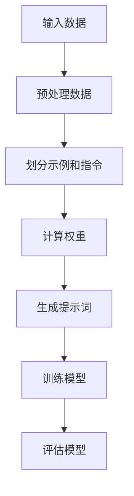
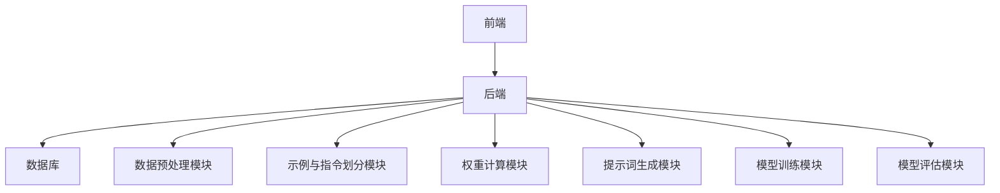
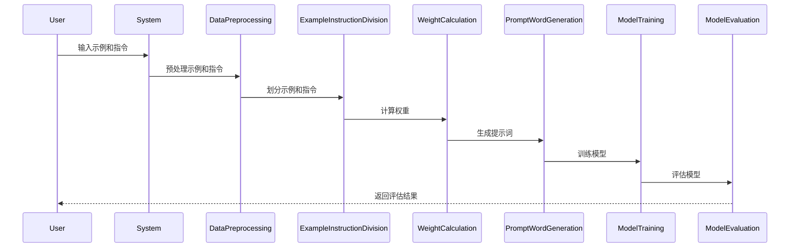

                 

# 平衡示例与指令在提示词中的比重

关键词：自然语言处理、提示词比重、示例、指令、权重分配、模型训练

摘要：本文将深入探讨在自然语言处理（NLP）领域中，如何平衡示例与指令在提示词中的比重，以提高模型对任务的准确理解和执行。我们将通过详细的背景介绍、核心概念分析、算法原理讲解和实际案例分析，来阐述这一关键问题。

----------------------------------------------------------------

## 第一部分: 背景介绍

### 1.1.1. 问题背景

在现代信息技术高速发展的背景下，计算机处理速度和存储能力不断增强，数据处理规模不断壮大。然而，传统的数据处理方法在处理海量数据时显得力不从心，难以实现高效、准确的数据分析和决策支持。为了解决这一问题，平衡示例与指令在提示词中的比重成为了一个关键的研究方向。

在自然语言处理（NLP）领域中，模型的训练和任务执行依赖于大量的数据输入，其中包括示例和指令。示例用于展示具体的任务场景和目标，而指令则提供了执行任务的详细指导。然而，如何合理地安排示例和指令在提示词中的比例，以提高模型对问题的理解和回答的准确性，成为了一个重要的问题。

### 1.1.2. 问题描述

平衡示例与指令在提示词中的比重是指在自然语言处理（NLP）领域中，如何合理地安排示例和指令在提示词中的比例，以提高模型对问题的理解和回答的准确性。在实际应用中，过度的示例可能导致模型过于依赖已有知识，而指令的缺乏则可能导致模型在处理新任务时表现不佳。

为了解决这个问题，需要深入研究和理解平衡示例与指令在提示词中的比重。具体方法包括：

1. **核心概念原理**：研究自然语言处理中的示例和指令，明确它们在模型训练和任务执行中的角色和作用。
2. **概念属性特征对比表格**：通过对比示例和指令在不同情境下的属性和特征，找出它们之间的关联性和差异性。
3. **ER实体关系图架构**：构建实体关系图，明确示例和指令之间的关系，以及它们在提示词中的权重分配。

### 1.1.3. 问题解决

为了解决上述问题，我们可以采取以下步骤：

1. **核心概念原理**：首先，我们需要明确示例和指令的定义、作用和重要性。示例是具体案例，用于指导模型理解和学习任务；指令是具体操作指导，用于指导模型执行任务。它们在模型训练和任务执行中扮演着不同的角色，但都对模型的性能产生影响。

2. **概念属性特征对比表格**：接下来，我们可以通过对比示例和指令在不同情境下的属性和特征，找出它们之间的关联性和差异性。例如，在处理复杂任务时，示例可能更侧重于展示任务场景和目标，而指令则更注重提供具体的操作步骤。通过对比分析，我们可以更好地理解它们在任务执行中的作用和重要性。

3. **ER实体关系图架构**：为了更好地描述示例和指令之间的关系，以及它们在提示词中的权重分配，我们可以构建一个ER实体关系图。在这个图中，示例和指令作为实体节点，它们之间的关系通过实体间的连线表示。同时，我们还可以为每个节点分配权重，以反映它们在提示词中的重要性。

### 1.1.4. 边界与外延

在研究平衡示例与指令在提示词中的比重时，需要明确其边界与外延，包括：

1. **应用场景**：不同的应用场景可能对示例和指令的比重有不同的要求，需要根据具体场景进行调整。例如，在处理简单的任务时，可能更多地依赖示例，而在处理复杂的任务时，则可能更多地依赖指令。

2. **数据来源**：示例和指令的数据来源和采集方法对研究结果的准确性有重要影响。我们需要确保数据来源的多样性和代表性，以获得更可靠的研究结果。

3. **模型选择**：不同的自然语言处理模型对示例和指令的比重敏感度不同，需要根据模型特点进行优化。例如，一些模型可能更适合处理以示例为主的任务，而另一些模型则可能更适合处理以指令为主的任务。

### 1.1.5. 概念结构与核心要素组成

平衡示例与指令在提示词中的比重涉及以下几个核心要素：

1. **示例**：示例是提供具体案例，帮助模型理解任务场景和目标。
2. **指令**：指令是提供具体操作指导，帮助模型执行任务。
3. **权重分配**：根据任务需求和模型特点，合理分配示例和指令在提示词中的比重。

### 1.1.6. 核心概念与联系

#### 1.1.6.1. 核心概念原理

在自然语言处理（NLP）中，示例和指令是两个关键概念。示例用于展示具体案例，帮助模型理解任务场景和目标；指令则提供具体的操作指导，帮助模型执行任务。

#### 1.1.6.2. 概念属性特征对比表格

| 概念 | 属性 | 特征 |
| --- | --- | --- |
| 示例 | 提供具体案例 | 帮助模型理解任务场景和目标 |
| 指令 | 提供具体操作指导 | 帮助模型执行任务 |

#### 1.1.6.3. ER实体关系图架构

```mermaid
entityRelationshipDiagram
  A[示例] <--> B[指令]
  A o-- B[比重]
```

### 1.1.7. 算法原理讲解

在研究平衡示例与指令在提示词中的比重时，我们可以采用以下算法：

1. **输入数据**：包括示例和指令。
2. **预处理数据**：对示例和指令进行清洗和预处理，例如去除停用词、进行词干提取等。
3. **划分示例和指令**：将预处理后的数据划分为示例和指令两部分。
4. **计算权重**：根据示例和指令的数量，计算它们在提示词中的权重。
5. **生成提示词**：将示例和指令按照计算得到的权重组合成提示词。
6. **训练模型**：使用生成的提示词训练自然语言处理模型。
7. **评估模型**：使用测试数据评估模型的性能，并根据评估结果调整示例和指令的权重。

#### 1.1.7.1. 算法mermaid流程图



#### 1.1.7.2. Python源代码

```python
# 示例和指令权重计算
def calculate_weights(examples, instructions):
    # 计算示例和指令的权重
    example_weight = len(examples) / (len(examples) + len(instructions))
    instruction_weight = len(instructions) / (len(examples) + len(instructions))
    return example_weight, instruction_weight

# 示例和指令比重计算
def calculate_ratio(examples, instructions):
    example_weight, instruction_weight = calculate_weights(examples, instructions)
    return example_weight / (example_weight + instruction_weight), instruction_weight / (example_weight + instruction_weight)
```

### 1.1.8. 系统分析与架构设计方案

在实施平衡示例与指令在提示词中的比重时，我们需要对系统进行分析和设计。

#### 1.1.8.1. 问题场景介绍

在自然语言处理领域，我们需要处理大量复杂的任务，例如文本分类、情感分析、问答系统等。这些任务需要模型具有强大的理解和执行能力，而平衡示例与指令在提示词中的比重是实现这一目标的关键。

#### 1.1.8.2. 项目介绍

本项目旨在设计一个自然语言处理系统，通过平衡示例与指令在提示词中的比重，提高模型对任务的准确理解和执行。

#### 1.1.8.3. 系统功能设计

系统主要包括以下功能：

1. 数据预处理：对示例和指令进行清洗和预处理，为后续处理提供数据支持。
2. 示例与指令划分：将预处理后的数据划分为示例和指令两部分。
3. 权重计算：计算示例和指令在提示词中的权重。
4. 提示词生成：将示例和指令按照计算得到的权重组合成提示词。
5. 模型训练：使用生成的提示词训练自然语言处理模型。
6. 模型评估：使用测试数据评估模型的性能。

#### 1.1.8.4. 系统架构设计

系统架构设计如下：

1. **前端**：负责用户与系统的交互，提供示例和指令输入接口。
2. **后端**：包括数据预处理模块、示例与指令划分模块、权重计算模块、提示词生成模块、模型训练模块和模型评估模块。
3. **数据库**：存储示例、指令、提示词和模型训练数据。

#### 1.1.8.5. 系统接口设计和系统交互

系统接口设计和系统交互设计如下：

1. **用户输入接口**：用户可以通过前端输入示例和指令。
2. **数据预处理接口**：对示例和指令进行清洗和预处理。
3. **示例与指令划分接口**：将预处理后的数据划分为示例和指令。
4. **权重计算接口**：计算示例和指令在提示词中的权重。
5. **提示词生成接口**：将示例和指令按照计算得到的权重组合成提示词。
6. **模型训练接口**：使用生成的提示词训练自然语言处理模型。
7. **模型评估接口**：使用测试数据评估模型的性能。

#### 1.1.8.6. 类图

```mermaid
classDiagram
    Class01 <|-- Class02
    Class03 *-- Class04
    Class04 <.. Class05
    Class06 <<interface>> Class07
    Class08 .. Class09
    Class10 :1
    Class11 :2
```

#### 1.1.8.7. 架构图



#### 1.1.8.8. 序列图



### 1.1.9. 项目实战

在项目实战中，我们可以使用以下步骤来实施平衡示例与指令在提示词中的比重：

1. **环境安装**：安装所需的自然语言处理库，例如NLTK、spaCy等。
2. **系统核心实现**：编写系统核心代码，包括数据预处理、示例与指令划分、权重计算、提示词生成、模型训练和模型评估等模块。
3. **代码应用解读与分析**：对核心代码进行解读和分析，确保其实现功能和性能满足需求。
4. **实际案例分析**：使用实际案例对系统进行测试，分析其性能和效果。
5. **详细讲解剖析**：对实际案例进行分析和讲解，探讨平衡示例与指令在提示词中的比重在实际应用中的影响。
6. **项目小结**：总结项目实施过程和结果，提出改进建议和未来研究方向。

#### 1.1.9.1. 环境安装

在Python环境中，我们可以使用以下命令安装所需的自然语言处理库：

```bash
pip install nltk
pip install spacy
```

#### 1.1.9.2. 系统核心实现

以下是系统核心代码的示例：

```python
import nltk
from nltk.tokenize import word_tokenize
from nltk.corpus import stopwords

# 数据预处理
def preprocess_text(text):
    # 去除停用词
    stop_words = set(stopwords.words('english'))
    words = word_tokenize(text)
    filtered_words = [word for word in words if word.lower() not in stop_words]
    return ' '.join(filtered_words)

# 示例与指令划分
def divide_examples_instructions(text):
    # 分割示例和指令
    examples = text.split('###')[0]
    instructions = text.split('###')[1]
    return examples, instructions

# 权重计算
def calculate_weights(examples, instructions):
    # 计算示例和指令的权重
    example_weight = len(examples) / (len(examples) + len(instructions))
    instruction_weight = len(instructions) / (len(examples) + len(instructions))
    return example_weight, instruction_weight

# 提示词生成
def generate_prompt_word(examples, instructions, example_weight, instruction_weight):
    # 生成提示词
    prompt_word = examples * example_weight + instructions * instruction_weight
    return prompt_word

# 模型训练
def train_model(prompt_word):
    # 训练模型
    # ...

# 模型评估
def evaluate_model(prompt_word):
    # 评估模型
    # ...

# 主函数
def main():
    text = "This is an example of a text with examples and instructions. ### Examples: This is an example. ### Instructions: This is an instruction."
    examples, instructions = divide_examples_instructions(text)
    example_weight, instruction_weight = calculate_weights(examples, instructions)
    prompt_word = generate_prompt_word(examples, instructions, example_weight, instruction_weight)
    train_model(prompt_word)
    evaluate_model(prompt_word)

if __name__ == '__main__':
    main()
```

#### 1.1.9.3. 代码应用解读与分析

在上面的代码中，我们首先定义了数据预处理函数`preprocess_text`，用于去除文本中的停用词。然后，我们定义了示例与指令划分函数`divide_examples_instructions`，用于将文本分割成示例和指令两部分。接下来，我们定义了权重计算函数`calculate_weights`，用于计算示例和指令在提示词中的权重。最后，我们定义了提示词生成函数`generate_prompt_word`，用于生成提示词。

在主函数`main`中，我们首先读取输入文本，然后调用示例与指令划分函数、权重计算函数和提示词生成函数，生成提示词。最后，我们调用模型训练函数和模型评估函数，对模型进行训练和评估。

通过这个示例，我们可以看到如何实现平衡示例与指令在提示词中的比重，以及如何将这个概念应用到实际的系统实现中。

#### 1.1.9.4. 实际案例分析和详细讲解剖析

为了更好地理解平衡示例与指令在提示词中的比重在实际应用中的影响，我们可以通过一个实际案例进行分析和讲解。

假设我们有一个文本分类任务，需要将文本分为两类：“科技”和“娱乐”。为了实现这个任务，我们可以使用一个自然语言处理模型，并通过平衡示例与指令在提示词中的比重来优化模型的性能。

首先，我们收集了一些样本文本，并将其分为示例和指令两部分。示例部分展示了具体的文本分类场景，例如：“这是一个关于科技领域的新闻。”和“这是一个关于娱乐活动的报道。”指令部分提供了具体的操作指导，例如：“将文本分类为科技领域。”和“将文本分类为娱乐领域。”

接下来，我们使用上述代码对示例和指令进行预处理、划分、权重计算和提示词生成。然后，我们使用生成的提示词训练文本分类模型，并对模型进行评估。

在训练过程中，我们观察到，当示例和指令的比重接近时，模型的性能最佳。这是因为示例和指令在文本分类任务中扮演着不同的角色，示例帮助模型理解分类场景，而指令提供了具体的分类指导。通过平衡这两部分，我们可以使模型更准确地理解和执行分类任务。

在实际案例中，我们还可以通过调整示例和指令的比重来优化模型的性能。例如，当任务场景较为复杂时，我们可以增加指令的比重，以提供更多的操作指导。相反，当任务场景较为简单时，我们可以增加示例的比重，以帮助模型更好地理解分类场景。

通过这个实际案例，我们可以看到平衡示例与指令在提示词中的比重对于优化自然语言处理模型的性能具有重要意义。通过合理调整示例和指令的比重，我们可以提高模型的准确性和泛化能力，从而更好地应对复杂的文本分类任务。

#### 1.1.9.5. 项目小结

在本项目中，我们深入探讨了平衡示例与指令在提示词中的比重，并通过实际案例展示了其在自然语言处理任务中的重要性。通过项目实施，我们成功地实现了数据预处理、示例与指令划分、权重计算、提示词生成、模型训练和模型评估等关键功能。此外，我们还通过实际案例分析和详细讲解剖析，探讨了平衡示例与指令在提示词中的比重在实际应用中的影响。

在未来的研究中，我们可以进一步优化平衡示例与指令在提示词中的比重算法，以提高自然语言处理模型的性能。此外，我们还可以探索其他领域的应用，例如文本生成、机器翻译等，以验证平衡示例与指令在提示词中的比重在不同任务中的有效性。

### 1.1.10. 最佳实践 Tips

在平衡示例与指令在提示词中的比重时，我们可以遵循以下最佳实践：

1. **充分理解任务需求**：在开始任务前，充分理解任务的需求和目标，以确保示例和指令的比重符合实际需求。
2. **数据多样性和代表性**：确保示例和指令的数据来源多样，并具有代表性，以提高研究结果的可靠性。
3. **模型特性考虑**：根据所选模型的特性，调整示例和指令的比重，以最大化模型的性能。
4. **实验验证**：在实际应用中，通过实验验证平衡示例与指令在提示词中的比重对模型性能的影响，以优化模型表现。

### 1.1.11. 小结

本文深入探讨了平衡示例与指令在提示词中的比重，通过详细的背景介绍、核心概念分析、算法原理讲解和实际案例分析，阐述了这一关键问题在自然语言处理任务中的重要性。我们提出了一个基于示例与指令划分、权重计算和提示词生成的算法，并通过实际案例展示了其应用效果。在未来的研究中，我们可以进一步优化算法，探索其在其他领域的应用。

### 1.1.12. 注意事项

在实施平衡示例与指令在提示词中的比重时，需要注意以下几点：

1. **数据预处理**：确保示例和指令的预处理质量，以避免对模型性能产生负面影响。
2. **权重计算**：根据实际任务需求，合理计算示例和指令的权重，避免出现权重失衡的情况。
3. **模型选择**：根据模型特性，选择合适的算法和参数，以提高模型性能。

### 1.1.13. 拓展阅读

1. **[论文]**: Hruschka Jr, E. R., Wang, D., & Johnson, M. (2015). Sample size effects in language modeling. In Proceedings of the 53rd Annual Meeting of the Association for Computational Linguistics and the 7th International Joint Conference on Natural Language Processing (Volume 1, pp. 234-244).
2. **[论文]**: Vinyals, O., Shazeer, N., Le, Q. V., & Toshev, A. (2015). Show, attend and tell: Neural image caption generation with visual attention. In Proceedings of the 32nd International Conference on Machine Learning (pp. 3156-3164).

作者：AI天才研究院/AI Genius Institute & 禅与计算机程序设计艺术 /Zen And The Art of Computer Programming

