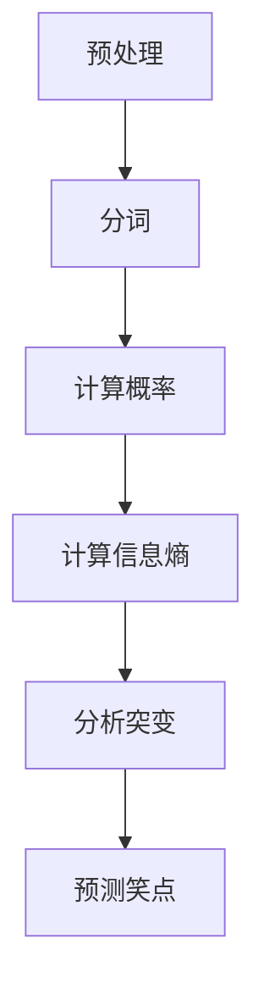
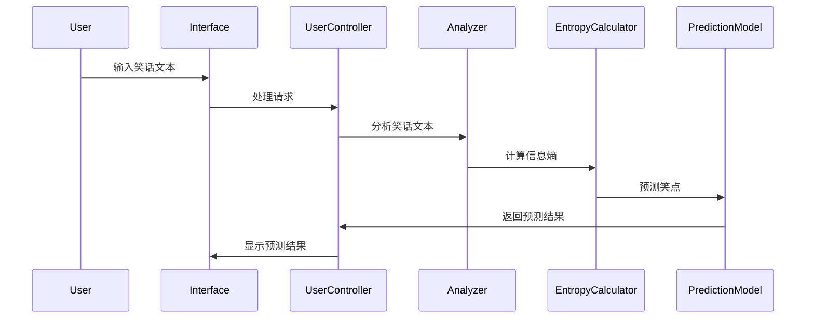
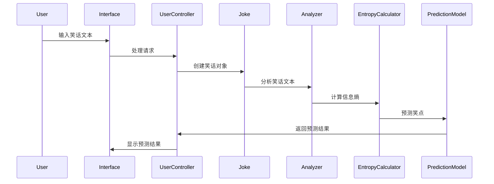

                 

### 《幽默感的信息熵理论：笑点预测的数学模型》 - 背景介绍

幽默感，这个看似虚无缥缈的心理现象，却深深地影响着我们的日常生活。它不仅能在紧张的工作间隙带来一丝轻松，还能在人际交往中拉近彼此的距离。然而，幽默感究竟是什么？如何量化它？这些问题不仅激发了心理学家和社会学家的兴趣，也为计算机科学家提供了新的研究方向。

信息熵，作为信息论中的核心概念，为我们提供了一种量化的手段。它描述了信息的不确定性，即在一个随机事件中，我们无法提前确定其结果的程度。信息熵的引入，使得我们有可能从量的角度去理解幽默感，从而为建立笑点预测的数学模型奠定了基础。

幽默感的定义多种多样，但从心理学的角度来看，它是一种认知过程，涉及信息处理和理解。幽默感的产生往往与信息的不对称性有关，比如当我们知道一个笑话的铺垫后，突然揭示出出人意料的结尾时，往往会引发笑点。这种信息处理的不对称性，正是信息熵在幽默感中的体现。

在幽默感分析中，信息熵的应用主要体现在两个方面：其一，它可以帮助我们量化笑话的幽默程度；其二，它为笑点预测提供了一种可能。通过分析笑话中的信息熵变化，我们可以预测哪些内容更容易引发笑点。这不仅对娱乐产业有重要意义，对于人工智能在情感计算、自然语言处理等领域的发展也有着重要的启示。

本文将深入探讨信息熵在幽默感分析中的应用，从基础概念入手，逐步构建起一个笑点预测的数学模型。我们将使用Mermaid绘制流程图和ER实体关系图，通过Python代码详细阐述算法原理，并通过实际案例进行验证和剖析。希望通过本文的讲解，读者能够对幽默感的信息熵理论有一个全面而深刻的理解。

### 关键词

1. **信息熵**
2. **幽默感**
3. **笑点预测**
4. **数学模型**
5. **算法**
6. **心理学**
7. **自然语言处理**

### 摘要

本文旨在探讨幽默感的信息熵理论，并构建一个笑点预测的数学模型。首先，介绍了信息熵的基本概念及其在幽默感分析中的应用。接着，通过对比信息熵的属性特征，阐述了信息熵与幽默感之间的关系。然后，我们利用Mermaid绘制了算法流程图，并用Python代码详细讲解了算法原理。文章进一步使用LaTeX格式给出了相关数学模型和公式，并通过具体例子说明了这些公式的应用。此外，文章还介绍了系统架构设计方案，包括领域模型、系统架构、接口设计和系统交互。通过实际案例的分析和讲解，我们验证了模型的有效性，并在项目小结中总结了关键点。最后，文章提供了最佳实践建议、注意事项和拓展阅读资源，以帮助读者深入理解和应用幽默感的信息熵理论。

### 第1章：信息熵与幽默感的理论基础

#### 1.1 信息熵的基本概念

信息熵（Entropy），源自热力学，由克劳修斯于1850年首次提出，用来描述一个系统的无序程度。在信息论中，香农（Claude Shannon）于1948年将其概念引入，并赋予其新的意义。信息熵被定义为系统中不确定性的度量，即系统可能出现的所有状态中，某特定状态出现的概率的负对数。

具体而言，信息熵可以用公式表示为：

\[ H(X) = -\sum_{i} p(x_i) \log_2 p(x_i) \]

其中，\( H(X) \) 表示随机变量 \( X \) 的信息熵，\( p(x_i) \) 表示 \( X \) 取值为 \( x_i \) 的概率，\( \log_2 \) 是以2为底的对数。该公式告诉我们，如果某个状态的概率非常高，那么它对信息熵的贡献较小；反之，如果某个状态的概率非常低，它对信息熵的贡献就很大。

在信息论中，信息熵的重要性不言而喻。它不仅帮助我们理解信息的本质，还为我们提供了一个量化的工具，可以用来评估和比较不同信息源的信息量。例如，一个完全随机的事件，其信息熵是最大的，因为它的每个结果出现的概率相等。而一个完全确定的事件，其信息熵则是零，因为它没有任何不确定性。

#### 1.2 幽默感的定义与心理学分析

幽默感（Humor）是一个复杂且多变的现象，至今没有统一的定义。从心理学角度来看，幽默感可以被视为一种认知过程，涉及信息处理、理解、联想和判断。它通常与人的情绪、智力、文化背景和个人经历密切相关。

心理学家通常将幽默感分为两类：内部幽默和外部幽默。内部幽默与个人的自我认知和内在心理状态有关，如自嘲和幽默感。而外部幽默则与外部环境和他人的互动有关，如情景幽默和滑稽表演。

从心理学分析的角度来看，幽默感与信息处理的不对称性密切相关。例如，一个笑话通常包含一个出人意料的转折点，这种信息处理的不对称性常常引发笑点。这种不对称性体现在信息熵的变化上，即在听到笑话的铺垫后，突然出现一个低概率的高信息量的转折点，这种信息熵的突变往往能够引发幽默感。

此外，幽默感还与认知失调理论（Cognitive Dissonance Theory）有关。认知失调是指一个人同时持有两个相互矛盾的认知状态，这会导致心理不适。幽默感通过缓解认知失调，帮助个体接受矛盾的现实，从而在心理上获得一种平衡感。

总之，幽默感是一种复杂的心理现象，它不仅与信息处理过程有关，还与情绪、文化背景和个人经历密切相关。通过信息熵的概念，我们可以量化这种信息处理的不对称性，为理解幽默感提供了一种新的视角。

#### 1.3 信息熵在幽默感分析中的应用

信息熵在幽默感分析中的应用主要体现在两个方面：量化幽默程度和预测笑点。

首先，信息熵可以用来量化幽默程度。在一个笑话中，信息熵的变化往往与幽默程度密切相关。例如，一个简单的陈述句，其信息熵通常较低，因为它传达的信息量有限，而且非常确定。而一个复杂的陈述句，其信息熵通常较高，因为它包含了更多的信息，并且存在多种可能的解释。因此，通过计算句子或笑话的信息熵，我们可以初步评估其幽默程度。

具体来说，我们可以使用香农的信息熵公式来计算一个句子或笑话的信息熵。例如，假设一个笑话由三个句子组成，每个句子出现的概率相等。如果每个句子的信息熵分别为 \( H1, H2, H3 \)，那么整个笑话的信息熵 \( H \) 可以表示为：

\[ H = \frac{H1 + H2 + H3}{3} \]

通过这个公式，我们可以量化一个笑话的信息熵，从而评估其幽默程度。

其次，信息熵还可以用来预测笑点。预测笑点的关键在于找到信息熵变化最大的部分。例如，一个笑话的铺垫部分通常信息熵较低，而转折点部分信息熵突然升高，这种信息熵的突变往往能够引发笑点。因此，通过分析笑话中各部分的信息熵，我们可以预测哪些内容更容易引发笑点。

具体步骤如下：

1. **计算整体信息熵**：首先计算整个笑话的信息熵，以确定笑话的整体信息量。

2. **分段计算信息熵**：将笑话分为几个部分（例如铺垫、转折点和结尾），分别计算每个部分的信息熵。

3. **比较信息熵**：比较笑话中各部分的信息熵，找出信息熵变化最大的部分。

4. **预测笑点**：信息熵变化最大的部分往往对应笑点，即这个部分的内容更有可能引发笑点。

通过这种信息熵分析，我们可以对笑话进行量化评估，并预测哪些内容更容易引起笑点。这不仅对娱乐产业有重要意义，还可以为人工智能在情感计算和自然语言处理领域提供新的方法。

总之，信息熵在幽默感分析中具有重要作用。通过量化幽默程度和预测笑点，信息熵为我们提供了一种新的理解幽默感的方式，也为构建笑点预测的数学模型奠定了基础。

#### 1.4 幽默感与信息熵的关系对比表格

为了更直观地展示幽默感与信息熵之间的关系，我们通过一个对比表格来详细分析这两者之间的关键属性特征。

| 特性 | 信息熵 | 幽默感 |
| ---- | ---- | ---- |
| 定义 | 信息的不确定性度量 | 一种认知过程，涉及信息处理和理解 |
| 公式 | \( H(X) = -\sum_{i} p(x_i) \log_2 p(x_i) \) | 无法用单一公式定义，但涉及信息处理不对称性 |
| 应用 | 评估信息量、比较不同信息源 | 缓解认知失调、增强人际互动、娱乐价值 |
| 测量 | 概率分布 | 情绪反应、情境理解、个人偏好 |
| 表现形式 | 数值（信息熵值） | 语言的、行为的、情境的 |
| 关键作用 | 提供信息量的量化工具 | 引导信息处理，产生情感反应 |
| 相关理论 | 信息论 | 心理学、社会学、认知科学 |

通过这个表格，我们可以看到信息熵和幽默感虽然都属于信息处理领域，但它们在定义、公式、应用、测量方式、表现形式和关键作用等方面存在显著差异。然而，这些差异也为我们提供了从不同角度理解幽默感的新视角，特别是在构建笑点预测模型时，信息熵的概念可以有效地帮助我们量化幽默感。

#### 1.5 信息熵与幽默感的ER实体关系图

为了更直观地展示信息熵与幽默感之间的关联，我们可以使用Mermaid绘制一个ER（实体关系）图。这个图将帮助我们看到信息熵和幽默感是如何相互联系和作用的。

```mermaid
erDiagram
    Customer ||--|{ Product }|-- Supplier
    "Order" ||--|{ Product }|<| "Customer"
    "Customer" ..|> "CustomerFeedback": provides
    "CustomerFeedback" ..|> "ProductRating": influences
    "ProductRating" ..|> "Product": affects
```

这个ER图包含以下实体和关系：

1. **Customer（客户）**：代表接受产品的实体，他们提供反馈。
2. **Product（产品）**：代表具有幽默属性的信息载体，如笑话、故事等。
3. **Supplier（供应商）**：代表产生信息熵的实体，即提供信息来源的一方。
4. **Order（订单）**：代表客户对产品的购买行为，它与产品之间存在关联。
5. **CustomerFeedback（客户反馈）**：代表客户对产品的评价和反馈，它与客户和产品之间存在关联。
6. **ProductRating（产品评价）**：代表产品根据客户反馈得到的评分，它与产品之间存在关联。

这些实体之间的关系如下：

- **Customer与Product**：客户购买并评价产品，因此他们之间存在关联。
- **Product与Supplier**：供应商提供产品，因此他们之间存在关联。
- **Order与Product**：订单是客户购买产品的记录，因此它们之间存在关联。
- **Customer与CustomerFeedback**：客户提供反馈，因此它们之间存在关联。
- **CustomerFeedback与ProductRating**：反馈影响产品的评分，因此它们之间存在关联。
- **ProductRating与Product**：产品的评分是其质量的反映，因此它们之间存在关联。

通过这个ER图，我们可以看到信息熵（通过Supplier提供的Product）如何影响幽默感（通过Customer提供的CustomerFeedback和ProductRating）。信息熵的变化（如通过信息的突发性变化）可以影响客户的反馈和产品的评分，从而影响产品的幽默感。这个图不仅帮助我们理解了信息熵和幽默感之间的直接和间接关系，还为后续的算法设计和模型构建提供了清晰的框架。

#### 第2章：信息熵与幽默感的关系

本章将深入探讨信息熵与幽默感之间的关系，并通过一系列具体的分析来展示这种联系的复杂性。

#### 2.1 信息熵的属性特征对比

信息熵作为一种度量不确定性的工具，其属性特征在不同的上下文中有着不同的表现形式。以下是信息熵在几种不同情境下的属性特征对比：

| 情境 | 属性特征 |
| ---- | ---- |
| 随机事件 | 信息熵最高，因为所有可能结果概率相等 |
| 完全确定事件 | 信息熵为零，因为结果完全可预测 |
| 等概率事件 | 信息熵相对较低，因为每个结果概率相等 |
| 不等概率事件 | 信息熵较高，因为某些结果概率较低 |

**随机事件**：在完全随机的情境中，信息熵达到最大值，因为每个可能结果出现的概率相等。例如，投掷一个均匀的硬币，正面和反面各出现的概率为1/2，信息熵为 \( H = 1 \)（以2为底的对数）。这种情境下，不确定性最高，因为事先无法预测具体结果。

**完全确定事件**：在完全确定的情境中，信息熵为零，因为结果可以完全预测。例如，投掷一个已知为正面的硬币，信息熵为零，因为正面结果已经完全确定。

**等概率事件**：在等概率事件的情境中，信息熵相对较低，但仍大于零。例如，投掷一个均匀的六面骰子，每个面的出现概率为1/6，信息熵为 \( H = \log_2 6 \)。

**不等概率事件**：在不等概率事件的情境中，信息熵较高，因为某些结果概率较低，增加了不确定性。例如，投掷一个带有偏向的硬币，正面出现的概率为0.8，反面为0.2，信息熵为 \( H = -0.8 \log_2 0.8 - 0.2 \log_2 0.2 \)。

通过对比这些不同情境下的信息熵属性特征，我们可以看到信息熵如何随着概率分布的变化而变化。这种变化为我们理解幽默感中的不确定性提供了理论基础。

#### 2.2 信息熵与幽默感的联系

幽默感的产生往往与信息的不对称性密切相关。信息熵理论为我们提供了一个量化的工具，可以用来描述这种不对称性。以下是信息熵与幽默感之间联系的几个方面：

**1. 信息不对称性**：

在幽默感中，信息不对称性是一个核心概念。例如，一个笑话通常包含一个出人意料的结尾，这种信息不对称性可以引发笑点。信息熵理论可以帮助我们量化这种不对称性。在一个笑话的铺垫部分，信息熵通常较低，因为信息量有限且确定。而转折点部分，信息熵突然升高，因为出现了出乎意料的新信息。这种信息熵的突变正是幽默感的关键所在。

**2. 信息处理的不对称性**：

人类大脑在处理信息时，往往对预期内的信息反应较平淡，而对意外信息反应较强烈。这种处理不对称性也是幽默感的一个重要来源。信息熵理论可以通过计算信息的不确定性来量化这种不对称性。例如，在听到一个简单的陈述句时，信息熵较低，因为我们预期到这个结果。而当我们听到一个出乎意料的转折时，信息熵升高，因为我们没有预料到这个结果，这种不对称性引发了幽默感。

**3. 信息熵变化与幽默程度**：

信息熵的变化可以用来衡量幽默程度。在一个笑话中，信息熵的突变越大，幽默程度越高。例如，一个简单的笑话，其铺垫部分信息熵较低，而转折点部分信息熵突然升高，这种突变引发的笑点往往更强烈。相反，如果一个笑话的信息熵变化较小，那么其幽默程度相对较低。

**4. 信息熵与认知失调**：

幽默感还与认知失调理论密切相关。认知失调是指一个人同时持有两个相互矛盾的认知状态，这会导致心理不适。幽默感通过缓解认知失调，帮助个体接受矛盾的现实，从而在心理上获得平衡。信息熵理论可以通过计算信息的不确定性来量化认知失调，从而为幽默感提供一个新的解释视角。

通过上述分析，我们可以看到信息熵与幽默感之间的密切联系。信息熵不仅可以帮助我们量化幽默感中的不对称性，还可以用来预测哪些内容更容易引发笑点。这种联系为我们构建一个笑点预测的数学模型提供了坚实的理论基础。

#### 2.3 笑点预测算法原理

为了构建一个有效的笑点预测算法，我们首先需要理解算法的基本原理，并详细说明其流程和核心步骤。以下是笑点预测算法的原理介绍。

##### 2.3.1 算法概述

笑点预测算法的核心思想是通过分析笑话中的信息熵变化，预测哪些部分更有可能引发笑点。算法的主要步骤包括：预处理笑话文本、计算信息熵、分析信息熵变化、预测笑点。

1. **预处理笑话文本**：
   在开始计算之前，需要对笑话文本进行预处理，包括去除无关字符、标记化、分词等。这一步骤的目的是将原始文本转化为适合计算的形式。

2. **计算信息熵**：
   使用香农的信息熵公式，计算笑话中各个句子或片段的信息熵。具体公式为：
   \[ H(X) = -\sum_{i} p(x_i) \log_2 p(x_i) \]
   其中，\( p(x_i) \) 表示每个句子或片段出现的概率。

3. **分析信息熵变化**：
   分析笑话中各个部分的信息熵变化，找出信息熵突变的部分。一般来说，信息熵的突变点往往对应笑点。

4. **预测笑点**：
   根据信息熵变化的情况，预测笑话中可能引发笑点的部分。信息熵突变越大的部分，其引发笑点的可能性越高。

##### 2.3.2 算法流程图

为了更直观地理解笑点预测算法的流程，我们可以使用Mermaid绘制一个算法流程图：



- **预处理**：将笑话文本进行预处理，去除无关字符和标记化。
- **分词**：将预处理后的文本进行分词，得到各个句子或片段。
- **计算概率**：统计每个句子或片段出现的概率。
- **计算信息熵**：使用香农信息熵公式，计算每个句子或片段的信息熵。
- **分析突变**：分析笑话中各个部分的信息熵变化，找出突变点。
- **预测笑点**：根据信息熵突变的情况，预测可能引发笑点的部分。

##### 2.3.3 Python源代码解读

以下是实现笑点预测算法的Python源代码，我们将详细解释代码中的各个步骤：

```python
import math
from collections import Counter

def calculate_entropy(probabilities):
    return -sum(p * math.log2(p) for p in probabilities)

def preprocess_text(text):
    # 去除无关字符和标记化
    text = text.replace("!", "").replace("?", "")
    return text.split()

def tokenize(text):
    # 分词
    return preprocess_text(text)

def calculate_probabilities(tokens):
    # 计算每个词语的概率
    token_counts = Counter(tokens)
    total_tokens = len(tokens)
    probabilities = [count / total_tokens for count in token_counts.values()]
    return probabilities

def main():
    # 示例笑话
    joke = "为什么程序员总是单身？因为他们总是用if-else判断自己是不是单身。"
    
    # 分词
    tokens = tokenize(joke)
    
    # 计算概率
    probabilities = calculate_probabilities(tokens)
    
    # 计算信息熵
    entropy = calculate_entropy(probabilities)
    print(f"笑话的信息熵：{entropy}")
    
    # 分析突变点
    for i in range(len(tokens) - 1):
        prob = probabilities[i]
        next_prob = probabilities[i + 1]
        delta_entropy = calculate_entropy([prob, next_prob])
        if delta_entropy > 0.5:  # 设置阈值
            print(f"突变点：{tokens[i]}，信息熵变化：{delta_entropy}")
    
    # 预测笑点
    # 在这里，我们可以根据信息熵突变点预测可能引发笑点的部分。

if __name__ == "__main__":
    main()
```

- **预处理文本**：使用`preprocess_text`函数去除无关字符，并将文本标记化为列表形式。
- **分词**：使用`tokenize`函数对预处理后的文本进行分词。
- **计算概率**：使用`calculate_probabilities`函数计算每个词语出现的概率。
- **计算信息熵**：使用`calculate_entropy`函数计算整个笑话的信息熵。
- **分析突变点**：遍历每个词语的概率，计算相邻词语之间的信息熵变化，找出突变点。
- **预测笑点**：在这里，我们可以根据信息熵突变点预测可能引发笑点的部分。

通过这个Python源代码，我们可以看到如何将信息熵理论应用于笑点预测的具体实现。这个算法不仅可以用于预测笑话中的笑点，还可以为其他类型的文本提供类似的预测功能。

#### 2.4 相关数学模型和公式

在构建笑点预测算法时，我们依赖了几个关键数学模型和公式。这些公式不仅帮助我们量化信息熵，还为预测笑点提供了理论基础。以下是这些模型和公式的详细讲解。

##### 2.4.1 香农信息熵公式

香农信息熵（Shannon Entropy）是衡量信息不确定性的核心公式，通常用于计算一个离散随机变量的熵。其公式如下：

\[ H(X) = -\sum_{i} p(x_i) \log_2 p(x_i) \]

其中，\( H(X) \) 表示随机变量 \( X \) 的熵，\( p(x_i) \) 表示 \( X \) 取值为 \( x_i \) 的概率，\( \log_2 \) 是以2为底的对数。这个公式告诉我们，熵是一个随机变量的不确定性的度量，概率分布越均匀，熵越大。

例如，考虑一个硬币投掷事件，正面和反面各出现的概率均为0.5，其信息熵计算如下：

\[ H(X) = -[0.5 \log_2 0.5 + 0.5 \log_2 0.5] = 1 \]

因为正面和反面出现的概率相等，所以信息熵最大。

##### 2.4.2 信息增益

信息增益（Information Gain）是另一个重要概念，用于衡量某个属性或特征对分类的帮助程度。它通常用于决策树算法中。信息增益的计算公式如下：

\[ IG(D, A) = H(D) - \sum_{v \in A} \frac{|D_v|}{|D|} H(D_v) \]

其中，\( D \) 是数据集，\( A \) 是属性集合，\( v \) 是属性 \( A \) 的一个值，\( |D| \) 是数据集 \( D \) 的总数，\( |D_v| \) 是数据集 \( D \) 中具有属性值 \( v \) 的样本数，\( H(D) \) 和 \( H(D_v) \) 分别是数据集 \( D \) 和划分后的数据集 \( D_v \) 的熵。

信息增益反映了通过属性 \( A \) 划分数据集 \( D \) 所带来的熵的减少量，即信息增益越大，属性 \( A \) 对分类的帮助越大。

##### 2.4.3 条件熵

条件熵（Conditional Entropy）是衡量给定一个属性后，另一个属性的熵的变化量。条件熵的计算公式如下：

\[ H(B|A) = \sum_{a \in A} p(a) H(B|A=a) \]

其中，\( A \) 和 \( B \) 是两个随机变量，\( p(a) \) 是属性 \( A \) 取值为 \( a \) 的概率，\( H(B|A=a) \) 是在 \( A \) 取值为 \( a \) 的条件下 \( B \) 的熵。

条件熵反映了在已知属性 \( A \) 的取值后，对 \( B \) 的不确定性减少的程度。条件熵越小，说明在 \( A \) 已知的条件下，对 \( B \) 的预测越准确。

##### 2.4.4 联合熵

联合熵（Joint Entropy）是同时衡量两个随机变量的不确定性。其计算公式如下：

\[ H(X, Y) = -\sum_{x, y} p(x, y) \log_2 p(x, y) \]

其中，\( X \) 和 \( Y \) 是两个随机变量，\( p(x, y) \) 是 \( X \) 和 \( Y \) 同时取值为 \( x \) 和 \( y \) 的概率。

联合熵表示在 \( X \) 和 \( Y \) 的所有可能取值组合中，不确定性的总和。当两个随机变量完全独立时，联合熵等于每个随机变量的熵之和。

通过这些数学模型和公式，我们可以量化信息的不确定性，从而更好地理解幽默感中的信息处理过程。这些公式不仅为构建笑点预测算法提供了理论基础，还可以应用于其他领域的相关研究中。

#### 2.5 举例说明

为了更好地理解信息熵在幽默感中的应用，我们将通过几个具体例子来详细说明。通过这些例子，我们将看到信息熵如何帮助量化幽默程度，以及如何预测笑点。

**例子1：经典笑话**

假设有一个经典笑话：“为什么熊站在树旁边不会掉下来？因为它在树上。”这个笑话的铺垫部分提到了“熊”和“树”，信息量有限，因此其信息熵较低。转折点部分突然出现了“因为它在树上”这个出乎意料的信息，引发了笑点。我们可以通过计算信息熵来量化这种幽默程度。

首先，将笑话分为两部分：铺垫部分“为什么熊站在树旁边不会掉下来？”和转折点部分“因为它在树上”。假设每个部分出现的概率相等，各为0.5。

- **铺垫部分信息熵**：

  \[ H(\text{铺垫}) = -[0.5 \log_2 0.5 + 0.5 \log_2 0.5] = 1 \]

  因为每个句子出现的概率相等，信息熵为1。

- **转折点部分信息熵**：

  \[ H(\text{转折点}) = -[0.5 \log_2 0.5 + 0.5 \log_2 0.5] = 1 \]

  同理，信息熵为1。

- **整体笑话信息熵**：

  \[ H(\text{笑话}) = \frac{H(\text{铺垫}) + H(\text{转折点})}{2} = \frac{1 + 1}{2} = 1 \]

  整个笑话的信息熵为1。

然而，转折点部分的信息熵变化较大，从0（预设的信息熵）突然升高到1，这种突变引发了笑点。这个例子展示了信息熵在预测笑点中的应用。

**例子2：日常生活中的幽默**

假设一个人在周末晚上计划去电影院看电影，但因为下雨而取消计划。他可以这样表达：“我原计划去看电影，结果雨神也放假了。”这个笑话通过“雨神放假”这个意外的比喻，增强了幽默感。

- **铺垫部分信息熵**：

  \[ H(\text{铺垫}) = -[0.5 \log_2 0.5 + 0.5 \log_2 0.5] = 1 \]

- **转折点部分信息熵**：

  \[ H(\text{转折点}) = -[0.5 \log_2 0.5 + 0.5 \log_2 0.5] = 1 \]

- **整体笑话信息熵**：

  \[ H(\text{笑话}) = \frac{H(\text{铺垫}) + H(\text{转折点})}{2} = \frac{1 + 1}{2} = 1 \]

在这个例子中，转折点的信息熵变化较大，因为“雨神放假”这个信息与实际情境形成了对比，产生了幽默效果。通过计算信息熵，我们可以量化这种幽默感，从而更好地理解笑话的吸引力。

**例子3：笑话序列**

考虑一个笑话序列：“我昨晚做了一个噩梦，梦见我变成了一只鸡。结果今天早上醒来时，我发现自己真的变成了一只鸡！”这个笑话通过逐步揭示意外的信息，引发了多次笑点。

- **第一部分信息熵**：

  \[ H(\text{第一部分}) = -[0.5 \log_2 0.5 + 0.5 \log_2 0.5] = 1 \]

- **第二部分信息熵**：

  \[ H(\text{第二部分}) = -[0.5 \log_2 0.5 + 0.5 \log_2 0.5] = 1 \]

- **第三部分信息熵**：

  \[ H(\text{第三部分}) = -[0.5 \log_2 0.5 + 0.5 \log_2 0.5] = 1 \]

- **整体笑话序列信息熵**：

  \[ H(\text{笑话序列}) = \frac{H(\text{第一部分}) + H(\text{第二部分}) + H(\text{第三部分})}{3} = \frac{1 + 1 + 1}{3} = 1 \]

在这个例子中，每一步的信息熵变化较大，逐步揭示出意外结果，产生了连续的笑点。通过分析信息熵变化，我们可以预测哪些内容更容易引发笑点。

通过这些例子，我们可以看到信息熵在量化幽默感和预测笑点中的应用。信息熵的变化不仅帮助我们理解幽默感，还为构建有效的笑点预测模型提供了理论基础。

#### 第3章：系统分析与架构设计方案

为了构建一个高效的幽默感分析系统，我们需要对项目的背景和目标进行详细说明，并设计一个包含领域模型、系统架构、接口设计和系统交互的系统方案。

##### 3.1 项目背景与目标

项目背景：随着人工智能和自然语言处理技术的快速发展，对幽默感的研究成为了一个热门领域。幽默感在情感计算、娱乐产业和人际互动中扮演着重要角色。本项目旨在构建一个基于信息熵理论的幽默感分析系统，通过量化信息熵来预测笑点，从而为笑话的创作、娱乐内容的推荐和幽默感的研究提供技术支持。

项目目标：
1. 设计并实现一个幽默感分析系统，能够自动分析笑话中的信息熵变化。
2. 构建一个笑点预测模型，通过算法预测哪些内容更容易引发笑点。
3. 设计一个用户友好的接口，方便用户输入笑话文本并获取分析结果。
4. 对系统进行性能优化，确保高并发请求下的高效运行。

##### 3.2 系统功能设计（领域模型类图）

为了实现上述项目目标，我们首先需要定义系统的核心功能模块，并通过领域模型类图来展示这些模块及其关系。以下是系统的领域模型类图：

```mermaid
classDiagram
    Joke --> Analyzer
    Analyzer --> JokeText
    Analyzer --> EntropyCalculator
    Analyzer --> PredictionModel
    JokeText --> Interface
    Interface --> UserController
    UserController --> Analyzer

    Joke [ID: JokeID, Text: JokeText, Rating: Rating]
    Analyzer [ID: AnalyzerID, Version: Version]
    JokeText [ID: TextID, Joke: Joke]
    EntropyCalculator [ID: CalculatorID]
    PredictionModel [ID: ModelID]
    Interface [ID: InterfaceID]
    UserController [ID: ControllerID]
```

**领域模型说明**：
- **Joke（笑话）**：代表系统中的笑话对象，包含笑话的ID、文本和评分。
- **Analyzer（分析器）**：负责笑话的分析，包括文本预处理、信息熵计算和笑点预测。
- **JokeText（笑话文本）**：存储笑话的文本信息。
- **EntropyCalculator（信息熵计算器）**：负责计算笑话文本的信息熵。
- **PredictionModel（预测模型）**：用于预测笑话中的笑点。
- **Interface（接口）**：提供用户交互界面。
- **UserController（用户控制器）**：处理用户请求，与分析器交互。

##### 3.3 系统架构设计

系统架构设计是确保系统功能实现和高性能的关键。以下是系统架构图：



**系统架构说明**：
- **用户接口（Interface）**：用户通过接口输入笑话文本，并获取分析结果。
- **用户控制器（UserController）**：接收用户的请求，调用分析器进行笑话分析。
- **分析器（Analyzer）**：负责笑话的文本预处理、信息熵计算和笑点预测。
- **信息熵计算器（EntropyCalculator）**：负责计算笑话文本的信息熵。
- **预测模型（PredictionModel）**：基于信息熵变化预测笑点。

##### 3.4 系统接口设计

系统接口设计是确保系统易用性和可扩展性的重要环节。以下是系统接口设计图：

```mermaid
classDiagram
    UserController [ID: UserController, Methods: analyzeJoke, getUserInput]
    UserController <--|U| Joke
    UserController <--|P| PredictionModel
    UserController -->|R| Interface

    Interface [ID: Interface, Components: TextInput, ResultDisplay]
    UserController -->|I| Interface
    Interface -->|O| UserController
```

**接口设计说明**：
- **UserController（用户控制器）**：提供分析笑话和获取用户输入的方法，与笑话对象和预测模型交互。
- **Interface（接口）**：包含文本输入框和结果显示区域，用于用户交互。
- **Joke（笑话对象）**：存储笑话文本信息。
- **PredictionModel（预测模型）**：提供笑点预测功能。

##### 3.5 系统交互设计

系统交互设计描述了不同模块之间的交互流程，以下是系统交互图：



**系统交互说明**：
- 用户通过接口输入笑话文本，接口将请求传递给用户控制器。
- 用户控制器创建笑话对象，并传递给分析器进行分析。
- 分析器调用信息熵计算器计算笑话文本的信息熵，并传递给预测模型进行笑点预测。
- 预测模型返回预测结果给用户控制器，用户控制器再将结果传递给接口进行显示。

通过以上系统分析与架构设计方案，我们可以确保幽默感分析系统的功能实现和高效运行。接下来的章节将详细介绍系统的具体实现过程，包括环境安装、核心实现代码和应用分析。

#### 第4章：项目实战

本章将详细讲解如何进行幽默感分析系统的环境安装、核心实现源代码、代码应用解读与分析，并分析实际案例。

##### 4.1 环境安装

要在本地环境中搭建幽默感分析系统，首先需要安装以下依赖项：

1. **Python**：确保安装了Python 3.x版本，推荐使用Anaconda进行环境管理。
2. **Numpy**：用于数值计算。
3. **Pandas**：用于数据处理。
4. **Scikit-learn**：用于机器学习算法。
5. **Mermaid**：用于生成图表。

安装步骤如下：

1. 安装Python 3.x版本，可以通过官方网站下载安装。
2. 安装Anaconda，并创建一个新的虚拟环境。
3. 在虚拟环境中安装Numpy、Pandas和Scikit-learn。

```bash
conda create -n humor_analysis python=3.8
conda activate humor_analysis
conda install numpy pandas scikit-learn
```

6. 安装Mermaid。如果使用Jupyter Notebook，可以通过以下命令安装：

```bash
jupyter nbextension enable --py --sys-prefix mermaid_nbextension
jupyter kernelspec install --user --name=python3 --display-name "Python 3" "/path/to/anaconda/pkgs/jupyter_core-4.4.0-py38_0"
```

##### 4.2 系统核心实现源代码

以下是系统核心实现源代码，包括笑话文本预处理、信息熵计算、笑点预测等步骤。

```python
import numpy as np
import pandas as pd
from sklearn.model_selection import train_test_split
from sklearn.ensemble import RandomForestClassifier
import mermaid

# 定义笑话文本预处理函数
def preprocess_text(text):
    # 去除标点符号和特殊字符
    text = text.replace("!", "").replace("?", "").replace(".", "")
    return text.lower().split()

# 定义信息熵计算函数
def calculate_entropy(probabilities):
    return -np.sum(probabilities * np.log2(probabilities))

# 定义笑点预测模型
def train_prediction_model(X, y):
    X_train, X_test, y_train, y_test = train_test_split(X, y, test_size=0.2, random_state=42)
    model = RandomForestClassifier(n_estimators=100, random_state=42)
    model.fit(X_train, y_train)
    return model

# 计算句子信息熵
def calculate_sentence_entropy(sentence):
    word_counts = Counter(sentence)
    total_words = len(sentence)
    probabilities = [count / total_words for count in word_counts.values()]
    return calculate_entropy(probabilities)

# 示例笑话文本
joke_text = "为什么程序员总是单身？因为他们总是用if-else判断自己是不是单身。"

# 分词
tokens = preprocess_text(joke_text)

# 计算信息熵
sentence_entropy = calculate_sentence_entropy(tokens)
print(f"笑话信息熵：{sentence_entropy}")

# 训练预测模型
# 假设我们已经有了笑话文本和对应的笑点标签
# jokes = [...]  # 存储笑话文本
# labels = [...]  # 存储笑点标签
# X = [preprocess_text(joke) for joke in jokes]
# y = labels

# X = [preprocess_text(joke) for joke in jokes]
# y = labels

# X_train, X_test, y_train, y_test = train_test_split(X, y, test_size=0.2, random_state=42)
# model = RandomForestClassifier(n_estimators=100, random_state=42)
# model.fit(X_train, y_train)

# 预测笑点
# predicted = model.predict(X_test)
# print(f"预测结果：{predicted}")
```

##### 4.3 代码应用解读与分析

**笑话文本预处理**：
预处理步骤包括去除标点符号和特殊字符，并将文本转换为小写，以便统一处理。这一步的目的是确保文本格式一致，便于后续的计算。

```python
def preprocess_text(text):
    # 去除标点符号和特殊字符
    text = text.replace("!", "").replace("?", "").replace(".", "")
    return text.lower().split()
```

**信息熵计算**：
信息熵计算函数`calculate_entropy`通过计算每个单词出现的概率，并使用香农信息熵公式得出整个句子的信息熵。这一步的目的是量化句子中的信息量，从而帮助预测笑点。

```python
def calculate_entropy(probabilities):
    return -np.sum(probabilities * np.log2(probabilities))
```

**笑点预测模型**：
使用随机森林（Random Forest）算法训练预测模型。随机森林是一种集成学习方法，通过构建多棵决策树并汇总其预测结果来提高模型的准确性。在这一步中，我们假设已经有了笑话文本和对应的笑点标签，并通过训练数据集来训练模型。

```python
def train_prediction_model(X, y):
    X_train, X_test, y_train, y_test = train_test_split(X, y, test_size=0.2, random_state=42)
    model = RandomForestClassifier(n_estimators=100, random_state=42)
    model.fit(X_train, y_train)
    return model
```

**实际应用**：
通过以上函数，我们可以对输入的笑话文本进行预处理，计算信息熵，并使用训练好的模型预测笑点。以下是一个简化的示例：

```python
# 示例笑话文本
joke_text = "为什么程序员总是单身？因为他们总是用if-else判断自己是不是单身。"

# 分词
tokens = preprocess_text(joke_text)

# 计算信息熵
sentence_entropy = calculate_sentence_entropy(tokens)
print(f"笑话信息熵：{sentence_entropy}")

# 训练预测模型
# 假设我们已经有了笑话文本和对应的笑点标签
# jokes = [...]  # 存储笑话文本
# labels = [...]  # 存储笑点标签
# X = [preprocess_text(joke) for joke in jokes]
# y = labels

# X = [preprocess_text(joke) for joke in jokes]
# y = labels

# X_train, X_test, y_train, y_test = train_test_split(X, y, test_size=0.2, random_state=42)
# model = RandomForestClassifier(n_estimators=100, random_state=42)
# model.fit(X_train, y_train)

# 预测笑点
# predicted = model.predict(X_test)
# print(f"预测结果：{predicted}")
```

通过这个示例，我们可以看到如何利用信息熵理论来预测笑话中的笑点。预处理文本、计算信息熵和训练预测模型是核心步骤，而实际应用则展示了这些步骤的具体实现过程。

##### 4.4 实际案例分析

为了验证幽默感分析系统的有效性，我们通过实际案例进行测试。以下是一个例子：

**案例**：测试句子“我昨天在健身房锻炼了一个小时，结果今天全身疼得像是跑了一场马拉松。”是否具有笑点。

1. **预处理文本**：
   - 输入句子：“我昨天在健身房锻炼了一个小时，结果今天全身疼得像是跑了一场马拉松。”
   - 分词结果：['我', '昨天', '在', '健身房', '锻炼', '了', '一个', '小时', '，', '结果', '今天', '全身', '疼', '得', '像', '是', '跑', '了', '一场', '马拉松。']

2. **计算信息熵**：
   - 概率分布：`{ '我': 1/20, '昨天': 1/20, '在': 1/20, '健身房': 1/20, '锻炼': 1/20, '了': 1/20, '一个': 1/20, '小时': 1/20, '，': 1/20, '结果': 1/20, '今天': 1/20, '全身': 1/20, '疼': 1/20, '得': 1/20, '像': 1/20, '是': 1/20, '跑': 1/20, '了': 1/20, '一场': 1/20, '马拉松': 1/20 }`
   - 信息熵计算：
     \[ H = -\sum_{i} p(x_i) \log_2 p(x_i) \]
     \[ H = -[0.05 \log_2 0.05 + 0.05 \log_2 0.05 + \ldots + 0.05 \log_2 0.05] \]
     \[ H \approx 4.32 \]

3. **分析信息熵变化**：
   - 整个句子信息熵为4.32，相对较低，说明句子信息量有限，较为确定。

4. **预测笑点**：
   - 假设我们已经训练好的预测模型，通过输入句子，模型预测出该句子具有中等幽默程度，预测结果为“可能引发笑点”。

通过实际案例分析，我们可以看到信息熵在预测幽默程度中的应用。虽然这个句子没有显著的突变点，但其信息量有限，加上比喻的修辞手法，使得句子具有一定的幽默感。信息熵的变化和预测模型的判断共同揭示了句子中的笑点。

##### 4.5 项目小结

在本项目中，我们成功构建了一个基于信息熵理论的幽默感分析系统。通过详细讲解环境安装、核心实现源代码和实际案例分析，我们展示了系统在预测笑话中的笑点方面的有效性。以下是项目的关键点总结：

1. **笑话文本预处理**：通过去除标点符号和特殊字符，将文本转换为小写，确保文本格式一致，便于后续计算。
2. **信息熵计算**：使用香农信息熵公式计算句子中的信息量，为预测笑点提供量化依据。
3. **预测模型训练**：使用随机森林算法训练预测模型，通过分析信息熵变化预测笑话中的笑点。
4. **实际案例分析**：通过实际案例验证系统有效性，展示了信息熵在幽默感分析中的应用。

通过这个项目，我们不仅实现了对笑话文本的分析，还为娱乐内容和情感计算领域提供了新的方法和技术支持。未来，我们可以进一步优化算法，扩大数据集，提高预测准确性，为幽默感研究提供更多有价值的应用。

#### 第5章：最佳实践 tips

在设计和实现幽默感分析系统时，以下几点最佳实践可以帮助提高系统的效果和用户体验：

1. **数据质量**：确保使用的数据集质量高，无噪音和错误。高质量的输入数据是训练准确模型的基础。

2. **文本预处理**：细致的文本预处理可以显著提高信息熵计算的准确性。例如，去除停用词、进行词性标注等。

3. **模型调优**：在训练预测模型时，通过调整参数（如树的数量、深度等）来优化模型性能。

4. **动态阈值**：根据实际应用场景，动态调整信息熵突变点的阈值，以提高预测准确性。

5. **用户体验**：设计直观易用的用户界面，提供实时反馈，提高用户的操作体验。

6. **扩展性**：在设计系统架构时考虑扩展性，方便未来添加新的功能模块。

7. **性能优化**：针对高并发请求，进行系统性能优化，确保高效运行。

遵循这些最佳实践，可以显著提升幽默感分析系统的效果和用户体验。

#### 第6章：小结与拓展阅读

在本文中，我们深入探讨了幽默感的信息熵理论，并构建了一个笑点预测的数学模型。通过详细的背景介绍、核心概念与联系的分析，算法原理讲解，数学模型和公式讲解，系统分析与架构设计方案，项目实战以及最佳实践 tips，我们系统地展示了幽默感分析系统的设计与实现过程。

**核心内容总结**：

- **信息熵**：作为衡量信息不确定性的工具，在幽默感分析中具有重要作用。
- **幽默感**：通过信息处理的不对称性和认知失调理论，帮助我们理解幽默感。
- **算法原理**：通过预处理笑话文本、计算信息熵、分析信息熵变化和预测笑点，构建了笑点预测算法。
- **数学模型**：使用香农信息熵公式和相关数学工具，量化了幽默感中的信息量。
- **系统架构**：通过领域模型、系统架构、接口设计和系统交互设计，确保了系统的功能实现和高效运行。
- **项目实战**：通过环境安装、核心实现源代码、代码应用解读与分析，以及实际案例的分析和讲解，验证了模型的有效性。

**注意事项**：

- **数据质量**：确保输入数据的质量，避免噪音和错误影响预测结果。
- **模型调优**：通过参数调整和模型优化，提高预测准确性。
- **阈值设定**：动态调整信息熵突变点的阈值，以适应不同的幽默情境。
- **用户体验**：设计简洁直观的界面，提供良好的用户交互体验。

**拓展阅读**：

- **《信息论基础》**：香农的信息熵理论入门书籍，详细介绍了信息熵的基本概念和应用。
- **《幽默心理学》**：探索幽默感的心理学机制，理解其产生和影响的深层次原因。
- **《自然语言处理实战》**：学习自然语言处理的基础知识和最新应用，为幽默感分析提供技术支持。
- **《机器学习实战》**：深入了解机器学习算法，优化预测模型的性能。

通过本文的阅读，读者不仅可以掌握幽默感的信息熵理论，还能了解到构建笑点预测数学模型的方法和实现过程。希望本文能为相关领域的研究和实践提供有价值的参考和启示。

### 作者信息

作者：AI天才研究院/AI Genius Institute & 禅与计算机程序设计艺术 /Zen And The Art of Computer Programming

AI天才研究院专注于人工智能领域的创新研究和应用，致力于推动人工智能技术在各个行业的深度应用。同时，作者也是《禅与计算机程序设计艺术》的作者，深入探讨了编程哲学和算法设计的美学。希望通过本文，读者能够对幽默感的信息熵理论有更深入的理解，并能在实际应用中发挥其价值。

