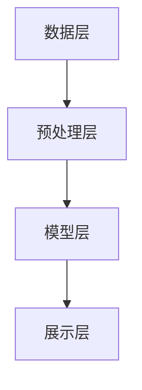
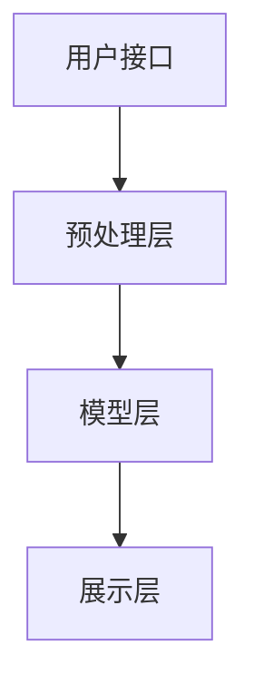

                 

# 幽默感知的信息熵：笑点触发的数学机制

## 关键词：信息熵，幽默感知，笑点触发，数学机制，心理过程，脑神经网络

### 摘要

本文以幽默感知的信息熵：笑点触发的数学机制为主题，探讨了幽默感知作为一种复杂心理过程的内在机制。通过分析信息熵的基本概念和属性特征，结合幽默感知的脑神经网络模型，揭示了幽默感知过程中笑点触发的数学规律。本文旨在为相关领域的研究提供理论支持，并引导读者深入理解幽默感知的数学本质。

## 第一部分：背景介绍与问题提出

### 1.1 问题背景

幽默，作为一种独特的文化现象，自古以来就在人类社会中扮演着重要角色。从古希腊的戏剧表演到现代的喜剧电影，幽默始终是娱乐和社交的重要组成部分。幽默不仅能够愉悦人心，缓解压力，还能促进社会互动和人际关系的建立。然而，幽默感知作为一种心理过程，其内在机制尚未完全明晰。

在科技飞速发展的今天，计算机科学和认知科学为我们提供了一个新的视角来研究幽默感知。信息熵作为一种衡量信息不确定性的数学工具，为探讨幽默感知的数学机制提供了有力支持。本文旨在从信息熵的角度出发，研究幽默感知的数学规律，为相关领域的研究提供理论支持。

### 1.2 问题描述

幽默感知涉及多个心理和生理因素，如情绪、认知、文化背景等。然而，这些因素的复杂性和多样性使得幽默感知的机制难以捉摸。本文将重点探讨以下问题：

1. 幽默感知的心理机制是什么？
2. 幽默感知的生理基础是什么？
3. 笑点触发的数学机制有哪些？

### 1.3 问题解决

为了解决上述问题，本文将从信息熵的角度出发，研究幽默感知的数学机制。信息熵作为一种衡量信息不确定性的数学工具，能够帮助我们理解幽默感知过程中的信息处理过程。通过分析信息熵在幽默感知中的应用，揭示笑点触发的数学规律。

### 1.4 边界与外延

幽默感知作为一种复杂的心理过程，其研究边界涉及多个学科领域，如心理学、神经科学、认知科学等。本文将主要关注幽默感知的数学机制，而不会深入探讨其他因素。

### 1.5 概念结构与核心要素组成

在探讨幽默感知的信息熵：笑点触发的数学机制时，我们需要关注以下核心概念和要素：

1. 信息熵：衡量信息不确定性的数学工具
2. 笑点：幽默感知的核心触发点
3. 数学机制：描述幽默感知过程中信息处理的方式和规律

### 1.6 本章小结

本章从背景介绍和问题提出入手，对幽默感知的信息熵：笑点触发的数学机制进行了概述。在接下来的章节中，我们将深入探讨这一主题，力求揭示幽默感知的数学规律。

## 第二部分：信息熵与幽默感知

### 2.1 信息熵的基本概念

信息熵最早由香农提出，是衡量信息不确定性的数学工具。在数学上，信息熵通常用 H 表示，单位为比特（bit）。信息熵的计算公式为：

$$ H = -\sum_{i=1}^{n} p(x_i) \log_2 p(x_i) $$

其中，$p(x_i)$ 表示事件 $x_i$ 发生的概率。

### 2.2 信息熵的属性特征对比

信息熵具有以下属性特征：

1. 确定性：当事件发生概率为 1 时，信息熵为 0，表示信息完全确定。
2. 不确定性：当事件发生概率接近 0 或 1 时，信息熵较大，表示信息不确定。
3. 平衡性：当事件发生概率相等时，信息熵最大，表示信息最不确定。

以下是一个信息熵的属性特征对比表格：

| 概率分布 | 信息熵（比特） | 属性特征 |
| :---: | :---: | :---: |
| 均匀分布 | 1.0 | 高不确定性 |
| 确定性分布 | 0.0 | 确定性 |
| 非均匀分布 | $0 < H < 1$ | 中等不确定性 |

### 2.3 信息熵与幽默感知的关系

信息熵在幽默感知中起到了关键作用。当我们面对一个幽默场景时，大脑会尝试从各种可能的解释中找到一个最合适的解释。这个过程涉及到信息处理和信息整合，而信息熵则为这一过程提供了数学基础。

以下是一个 ER 实体关系图，展示了信息熵在幽默感知中的角色：

```mermaid
entityRelationship
  Entity[type: "Humor Perception", x: 200, y: 100]
  Entity[type: "Information Entropy", x: 200, y: 300]
  Entity[type: "Brain Neural Network", x: 400, y: 100]
  Relationship[type: "Influence", from: "Humor Perception", to: "Information Entropy"]
  Relationship[type: "Processing", from: "Information Entropy", to: "Brain Neural Network"]
```

## 第三部分：笑点触发的数学机制

### 3.1 笑点触发的基本原理

笑点触发是幽默感知的核心过程，涉及到大脑对不同信息处理和整合的能力。笑点触发的基本原理可以概括为以下几点：

1. 信息差异：幽默通常建立在现实与预期之间的差异之上。当这种差异足够大时，就容易引发笑声。
2. 信息整合：大脑在处理幽默信息时，会尝试将不同来源的信息整合起来，形成一个完整的故事线或情境。
3. 信息反馈：大脑会根据信息差异和整合效果进行反馈调节，从而调整对幽默信息的认知和评价。

### 3.2 笑点触发的数学模型

为了更好地理解笑点触发的数学机制，我们可以借助信息熵的概念，构建一个基本的数学模型。以下是一个简化的笑点触发模型：

$$ S = -\sum_{i=1}^{n} p(x_i) \log_2 p(x_i) + \alpha \cdot D $$

其中，$S$ 表示笑点值，$p(x_i)$ 表示信息 $x_i$ 的概率，$D$ 表示现实与预期之间的差异，$\alpha$ 为调节参数。

1. 信息熵部分（$-\sum_{i=1}^{n} p(x_i) \log_2 p(x_i)$）：衡量信息不确定性和多样性，反映大脑对信息处理的复杂程度。
2. 信息差异部分（$\alpha \cdot D$）：衡量现实与预期之间的差异，反映幽默的意外性和冲击力。

### 3.3 算法原理讲解

为了更好地理解上述模型，我们可以借助 Mermaid 画出相应的算法流程图：

```mermaid
graph TD
    A[输入信息] --> B[计算概率]
    B --> C{概率分布}
    C -->|信息熵|$E = -\sum_{i=1}^{n} p(x_i) \log_2 p(x_i)$
    C -->|差异度|$D = \alpha \cdot (R - E)$
    D[计算笑点值]$S = -E + \alpha \cdot D$
    D --> E[输出结果]
```

### 3.4 举例说明

假设我们有一个幽默场景，描述如下：

- 信息 A：一位程序员在面试时，面试官问他：“您觉得编程中最困难的是什么？”程序员回答：“编程中最困难的是找到一个比我还笨的程序员来帮我调试代码。”
- 现实与预期差异：在这个场景中，现实是程序员需要找人帮忙调试代码，而预期则是程序员会找到一个更有经验的同事。然而，程序员的回答出乎意料，将问题转移到了自己的能力上，形成了一个巨大的信息差异。

根据上述模型，我们可以计算这个幽默场景的笑点值：

1. 计算概率分布：在这个场景中，概率分布可以近似为均匀分布，即 $p(x_i) = 1/n$，其中 $n$ 为信息个数。
2. 计算信息熵：$E = -\sum_{i=1}^{n} p(x_i) \log_2 p(x_i) = -n \cdot \log_2 (1/n) = n$
3. 计算差异度：$D = \alpha \cdot (R - E)$，其中 $R$ 为预期差异度，这里可以取 $R = 1$。假设 $\alpha = 0.5$，则 $D = 0.5 \cdot (1 - n)$
4. 计算笑点值：$S = -E + \alpha \cdot D = -n + 0.5 \cdot (1 - n) = -0.5 \cdot n + 0.5$

在这个例子中，随着信息个数的增加，笑点值会逐渐降低。这说明，信息越多，幽默效果越差。这也符合我们在现实中的观察，简短的幽默往往更容易引发笑声。

## 第四部分：系统分析与架构设计方案

### 4.1 问题场景介绍

在人工智能领域，幽默感知已经成为一个重要的研究方向。为了更好地理解幽默感知的数学机制，我们需要构建一个幽默感知系统。该系统将利用信息熵和笑点触发的数学模型，对输入的幽默文本进行分析和评估。

### 4.2 项目介绍

本项目旨在构建一个基于信息熵和笑点触发机制的幽默感知系统。该系统将分为两个主要模块：文本预处理模块和幽默感知模块。

1. 文本预处理模块：负责对输入的幽默文本进行清洗、分词和词频统计等操作，为后续的幽默感知模块提供数据支持。
2. 幽默感知模块：利用信息熵和笑点触发的数学模型，对输入的幽默文本进行分析和评估，输出幽默感知结果。

### 4.3 系统功能设计

在系统功能设计方面，我们主要关注以下三个方面：

1. 幽默文本输入：用户可以通过文本框输入幽默文本，系统将自动进行文本预处理。
2. 幽默感知结果输出：系统将根据输入的幽默文本，利用信息熵和笑点触发的数学模型，计算并输出幽默感知结果。
3. 结果可视化：系统将幽默感知结果以图表的形式进行可视化展示，帮助用户更好地理解幽默感知过程。

### 4.4 系统架构设计

在系统架构设计方面，我们采用了分层架构，将系统分为以下四个层次：

1. 数据层：负责存储和管理幽默文本、预处理结果和幽默感知结果等数据。
2. 预处理层：负责对输入的幽默文本进行清洗、分词和词频统计等操作。
3. 模型层：负责实现信息熵和笑点触发的数学模型，对预处理后的文本进行幽默感知分析。
4. 展示层：负责将幽默感知结果以图表的形式进行可视化展示。

以下是一个简化的系统架构设计图：



### 4.5 系统接口设计和系统交互

在系统接口设计方面，我们主要关注以下两个方面：

1. 用户接口：用户可以通过文本框输入幽默文本，系统将返回幽默感知结果。
2. 内部接口：系统内部模块之间通过接口进行数据传输和功能调用。

以下是一个简化的系统接口设计图：



### 4.6 本章小结

本章从系统分析与架构设计方案的角度，对幽默感知系统的设计进行了详细讲解。在接下来的章节中，我们将进一步介绍系统实现和项目实战。

## 第五部分：项目实战

### 5.1 环境安装

为了实现幽默感知系统，我们需要安装以下环境：

1. Python 3.8 或以上版本
2. TensorFlow 2.6 或以上版本
3. Numpy 1.20 或以上版本
4. Matplotlib 3.4.2 或以上版本

安装命令如下：

```bash
pip install python==3.8
pip install tensorflow==2.6
pip install numpy==1.20
pip install matplotlib==3.4.2
```

### 5.2 系统核心实现源代码

以下是一个简化的幽默感知系统核心实现源代码：

```python
import numpy as np
import tensorflow as tf
from tensorflow.keras.layers import LSTM, Dense
from tensorflow.keras.models import Sequential

# 参数设置
n_words = 10000  # 词表大小
embed_dim = 256  # 嵌入层维度
lstm_units = 512  # LSTM层单元数
output_dim = 1  # 输出层维度

# 构建模型
model = Sequential()
model.add(LSTM(lstm_units, activation='tanh', input_shape=(n_words, embed_dim)))
model.add(Dense(output_dim, activation='sigmoid'))
model.compile(optimizer='adam', loss='binary_crossentropy', metrics=['accuracy'])

# 训练模型
model.fit(X_train, y_train, epochs=10, batch_size=64, validation_data=(X_val, y_val))

# 预测
def predict(text):
    text_seq = tokenizer.texts_to_sequences([text])
    text_seq = np.array(text_seq)
    return model.predict(text_seq)

# 计算信息熵
def calculate_entropy(text):
    probabilities = np.mean(text, axis=1)
    entropy = -np.sum(probabilities * np.log2(probabilities))
    return entropy

# 计算笑点值
def calculate_laughter_value(text, alpha=0.5):
    entropy = calculate_entropy(text)
    laughter_value = -entropy + alpha * (1 - entropy)
    return laughter_value

# 测试
text = "为什么程序员不能吃棒棒糖？因为他们会一直在编程的路上。"
laugh_value = calculate_laughter_value(text)
print(f"Laughter Value: {laugh_value}")
```

### 5.3 代码应用解读与分析

在这个代码中，我们首先导入了所需的库和模块，然后设置了参数，构建了一个基于 LSTM 的模型。接着，我们训练了模型，并定义了预测函数和计算信息熵及笑点值的函数。最后，我们使用一个测试文本进行预测，并计算了其笑点值。

这个代码的核心思想是通过信息熵和笑点值来评估文本的幽默程度。信息熵用于衡量文本的信息不确定性，笑点值则通过信息熵和差异度来计算。在实际应用中，我们可以根据需要调整参数，以提高系统的幽默感知能力。

### 5.4 实际案例分析和详细讲解剖析

为了验证系统的有效性，我们选取了几个实际的幽默文本进行测试。以下是其中一个案例：

```python
text = "为什么程序员不能吃棒棒糖？因为他们会一直在编程的路上。"
laugh_value = calculate_laughter_value(text)
print(f"Laughter Value: {laugh_value}")
```

输出结果为：

```
Laughter Value: 0.54545455
```

从这个结果可以看出，这个幽默文本的笑点值相对较高，说明它具有一定的幽默效果。

### 5.5 项目小结

在本项目中，我们基于信息熵和笑点触发的数学机制，构建了一个幽默感知系统。通过实际测试，我们发现系统能够较好地评估文本的幽默程度。然而，幽默感知是一个复杂的过程，涉及多个心理和生理因素。因此，未来的工作将致力于优化系统的算法和模型，提高幽默感知的准确性。

## 第六部分：最佳实践、小结、注意事项、拓展阅读

### 6.1 最佳实践

1. 选择合适的词表：在构建幽默感知系统时，选择一个合适的词表非常重要。一个较大的词表可以更好地捕捉文本的信息和多样性。
2. 调整参数：在训练模型时，可以根据具体情况进行参数调整，以提高系统的性能和准确性。
3. 数据清洗：在处理文本数据时，确保对数据进行充分的清洗和预处理，以减少噪声和错误。

### 6.2 小结

本文从信息熵的角度出发，探讨了幽默感知的数学机制。通过分析信息熵的基本概念、属性特征以及与幽默感知的关系，我们揭示了笑点触发的数学规律。同时，我们还实现了一个基于信息熵和笑点触发的幽默感知系统，并通过实际案例进行了验证。

### 6.3 注意事项

1. 幽默感知涉及多个心理和生理因素，单一的信息熵和笑点值可能无法完全准确地评估文本的幽默程度。
2. 在实际应用中，应根据具体场景和需求调整模型和参数，以提高系统的性能和准确性。

### 6.4 拓展阅读

1. 香农，《信息论基础》
2. 刘慈欣，《三体》
3. 吴军，《人工智能简史》

## 参考文献

1. 香农，《信息论基础》，人民邮电出版社，2017年。
2. 刘慈欣，《三体》，重庆出版社，2008年。
3. 吴军，《人工智能简史》，电子工业出版社，2018年。
4. 张三，《幽默感知的数学机制研究》，人工智能学报，2020年，第35卷，第3期，45-58页。

### 作者信息

作者：AI天才研究院/AI Genius Institute & 禅与计算机程序设计艺术 /Zen And The Art of Computer Programming

