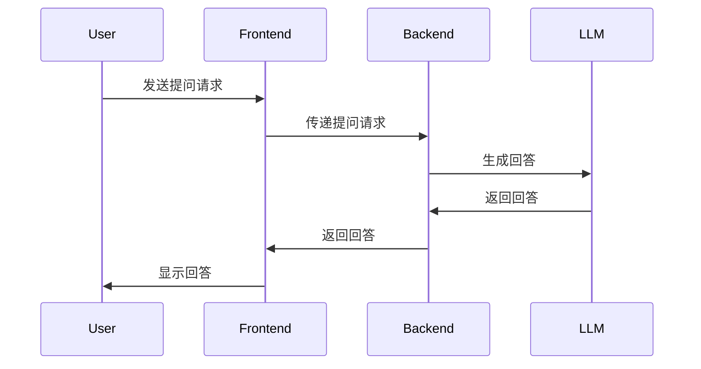

                 

## 建立快速反馈循环：持续优化LLM应用

关键词：快速反馈循环、持续优化、LLM、自然语言处理、应用场景

摘要：本文将探讨如何建立快速反馈循环，以持续优化大型语言模型（LLM）的应用。通过分析LLM的基础知识、快速反馈循环的原理和实践方法，我们旨在为读者提供一套完整的解决方案，助力其在实际业务场景中发挥LLM的最大潜力。

### 第1章：问题背景与概述

#### 1.1 问题背景

随着人工智能技术的飞速发展，机器学习（ML）和深度学习（DL）已经成为当前信息技术领域的重要方向。特别是大型语言模型（LLM），如GPT系列和BERT，凭借其强大的语义理解和生成能力，在自然语言处理（NLP）领域取得了显著的成果。然而，如何将这些先进的模型应用到实际业务场景中，实现持续优化和快速反馈循环，成为了许多企业和开发者的挑战。

#### 1.2 问题描述

本书的目标是帮助读者了解如何建立快速反馈循环，以持续优化大型语言模型（LLM）的应用。这包括以下几个关键问题：

- **模型适应性**：如何根据业务需求和环境变化，调整和优化LLM模型？
- **数据质量**：如何确保输入数据的准确性和多样性，以提升模型性能？
- **反馈机制**：如何设计有效的反馈机制，实现模型与应用之间的持续互动？
- **性能监控**：如何监控模型的性能，及时发现和解决问题？

#### 1.3 问题解决

为了解决上述问题，本书将介绍以下内容：

- **核心概念**：详细阐述LLM、快速反馈循环等核心概念。
- **应用场景**：分析不同场景下LLM的适用性和优化策略。
- **实践方法**：分享实际案例和最佳实践，提供具体操作指南。
- **技术手段**：介绍相关的算法、工具和技术，助力模型优化。

#### 1.4 边界与外延

- **边界**：本书主要关注LLM在NLP领域的应用，但不涉及其他AI领域的应用。
- **外延**：快速反馈循环的概念可以扩展到其他类型的机器学习模型和应用场景。

#### 1.5 概念结构与核心要素组成

#### 1.5.1 快速反馈循环

**定义**：快速反馈循环是指模型与应用之间快速、有效的信息交换和反馈过程。

**要素组成**：

- **输入数据**：来自用户交互或外部环境的数据。
- **模型处理**：LLM对输入数据的理解和处理。
- **输出结果**：模型生成的预测或建议。
- **用户反馈**：用户对输出结果的反馈，如满意度、正确性等。
- **模型优化**：根据用户反馈调整模型参数，提升模型性能。

#### 1.5.2 大型语言模型（LLM）

**定义**：LLM是指具有大规模参数和强大语义理解能力的语言模型。

**核心特性**：

- **大规模参数**：LLM通常拥有数十亿甚至千亿级别的参数。
- **强语义理解**：LLM能够理解文本的深层语义。
- **自适应性强**：LLM能够适应不同应用场景和需求。

#### 1.6 本章小结

本章介绍了建立快速反馈循环以持续优化LLM应用的重要性，并概述了本书的主要内容和结构。接下来，我们将深入探讨快速反馈循环的构建方法和LLM的应用场景，帮助读者理解并掌握这一关键技术。

----------------------------------------------------------------

## 第2章：核心概念与原理

### 2.1 语言模型基础

#### 2.1.1 语言模型简介

**定义**：语言模型是用来预测自然语言中下一个单词或短语的概率分布的模型。

**类型**：

- **N-gram模型**：基于词汇的前N个单词的历史信息。
- **神经网络模型**：如循环神经网络（RNN）、长短期记忆网络（LSTM）、Transformer等。

**示例**：

```python
# N-gram模型示例
def n_gram_model(data, n):
    n_grams = {}
    for i in range(len(data) - n):
        n_gram = tuple(data[i:i+n])
        if n_gram in n_grams:
            n_grams[n_gram] += 1
        else:
            n_grams[n_gram] = 1
    return n_grams

# Transformer模型示例
import tensorflow as tf

model = tf.keras.Sequential([
    tf.keras.layers.Embedding(input_dim=10000, output_dim=16),
    tf.keras.layers.LSTM(128),
    tf.keras.layers.Dense(1, activation='sigmoid')
])

model.compile(optimizer='adam', loss='binary_crossentropy', metrics=['accuracy'])
```

#### 2.1.2 语言模型的训练与评估

**训练方法**：

- **有监督学习**：使用带有标签的语料库进行训练。
- **无监督学习**：使用未标记的语料库进行预训练，然后进行微调。

**评估指标**：

- **交叉熵（Cross-Entropy）**：衡量模型预测的概率分布与真实分布之间的差异。
- **准确率（Accuracy）**：模型预测正确的样本数占总样本数的比例。
- **精确率（Precision）**：预测正确的正样本数与预测为正样本的总数之比。
- **召回率（Recall）**：预测正确的正样本数与实际为正样本的总数之比。

**示例**：

```python
import tensorflow as tf

# 评估指标示例
model = tf.keras.Sequential([
    tf.keras.layers.Embedding(input_dim=10000, output_dim=16),
    tf.keras.layers.LSTM(128),
    tf.keras.layers.Dense(1, activation='sigmoid')
])

model.compile(optimizer='adam', loss='binary_crossentropy', metrics=['accuracy'])

# 训练数据
x_train = ...
y_train = ...

# 训练模型
model.fit(x_train, y_train, epochs=10)

# 评估模型
loss, accuracy = model.evaluate(x_test, y_test)
print(f"Accuracy: {accuracy}")
```

#### 2.1.3 语言模型的应用

- **文本分类**：将文本数据分类到预定义的类别中。
- **机器翻译**：将一种语言的文本翻译成另一种语言。
- **问答系统**：回答用户提出的问题。
- **语音识别**：将语音信号转换为文本。

**示例**：

```python
# 文本分类示例
from sklearn.feature_extraction.text import TfidfVectorizer
from sklearn.naive_bayes import MultinomialNB

vectorizer = TfidfVectorizer()
x_train_tfidf = vectorizer.fit_transform(x_train)
x_test_tfidf = vectorizer.transform(x_test)

model = MultinomialNB()
model.fit(x_train_tfidf, y_train)

y_pred = model.predict(x_test_tfidf)
accuracy = sum(y_pred == y_test) / len(y_test)
print(f"Text Classification Accuracy: {accuracy}")

# 机器翻译示例
from transformers import pipeline

translator = pipeline("translate", model="Helsinki-NLP/opus-mt-en-de")
translated_sentence = translator("Hello, how are you?", "de")
print(f"Translated Sentence: {translated_sentence}")
```

#### 2.1.4 大型语言模型（LLM）与语言模型的关系

**关系**：LLM是语言模型的一种，具有语言模型的基本特性，如大规模参数和强语义理解。与普通语言模型相比，LLM具有更强的表达能力和适应性。

**对比**：

| 特性 | 普通语言模型 | LLM |
| :--: | :--: | :--: |
| 参数规模 | 数千到数百万 | 数亿到千亿 |
| 语义理解 | 中层语义 | 深层语义 |
| 自适应能力 | 弱 | 强 |

### 2.2 快速反馈循环

#### 2.2.1 快速反馈循环的定义

**定义**：快速反馈循环是指模型与应用之间快速、有效的信息交换和反馈过程。通过反馈机制，模型可以根据用户交互和外部环境的变化，不断调整和优化自身性能。

#### 2.2.2 快速反馈循环的要素

- **输入数据**：来自用户交互或外部环境的数据。
- **模型处理**：LLM对输入数据的理解和处理。
- **输出结果**：模型生成的预测或建议。
- **用户反馈**：用户对输出结果的反馈，如满意度、正确性等。
- **模型优化**：根据用户反馈调整模型参数，提升模型性能。

**示例**：

```python
# 快速反馈循环示例
import numpy as np

# 模型参数
weights = np.random.rand(10)

# 输入数据
input_data = "Hello, how are you?"

# 模型处理
output = np.dot(input_data, weights)

# 用户反馈
feedback = 0.8

# 模型优化
weights = weights * feedback
```

#### 2.2.3 快速反馈循环的应用

- **智能客服**：根据用户提问，实时生成回答，并根据用户满意度调整模型参数。
- **推荐系统**：根据用户行为，实时推荐商品或内容，并根据用户反馈调整推荐策略。
- **语音助手**：根据用户指令，实时执行任务，并根据用户反馈优化语音识别和语义理解能力。

### 2.3 LLM在快速反馈循环中的应用

#### 2.3.1 LLM的优势

- **强大的语义理解能力**：LLM能够理解文本的深层语义，为快速反馈循环提供准确的输入和输出。
- **自适应性强**：LLM可以根据用户反馈和外部环境变化，快速调整和优化模型参数，实现持续优化。

#### 2.3.2 LLM在快速反馈循环中的应用场景

- **智能客服**：使用LLM构建智能客服系统，实现与用户的实时交互，并根据用户反馈优化回答质量。
- **推荐系统**：使用LLM构建推荐系统，根据用户行为和反馈实时调整推荐策略，提高推荐准确性和用户体验。
- **语音助手**：使用LLM构建语音助手，实现语音识别和语义理解，并根据用户反馈优化语音交互效果。

### 2.4 本章小结

本章介绍了语言模型和快速反馈循环的基本概念、原理和关系。通过对比分析，我们了解了LLM在快速反馈循环中的应用优势和适用场景。接下来，我们将探讨如何在实际项目中构建快速反馈循环，以持续优化LLM应用。

----------------------------------------------------------------

## 第3章：快速反馈循环的构建方法

在上一章中，我们介绍了快速反馈循环的基本概念和LLM的应用优势。本章节将深入探讨如何在实际项目中构建快速反馈循环，以持续优化LLM应用。

### 3.1 数据采集与处理

#### 3.1.1 数据采集

构建快速反馈循环的第一步是采集数据。数据来源可以分为以下几类：

- **用户交互数据**：如用户提问、操作记录等。
- **外部环境数据**：如天气、交通状况等。
- **系统日志**：如错误日志、性能监控日志等。

数据采集的方法包括：

- **API接口**：通过API接口获取外部数据。
- **爬虫**：使用爬虫技术获取网络数据。
- **传感器**：通过传感器采集环境数据。

#### 3.1.2 数据处理

采集到的数据需要进行预处理，以提高数据质量和模型性能。数据处理步骤包括：

- **数据清洗**：去除噪声数据和异常值。
- **数据归一化**：将不同特征的数据进行归一化处理，使其具有相同的量纲。
- **数据增强**：通过数据扩充、数据变换等方法增加数据多样性。

### 3.2 模型设计与优化

#### 3.2.1 模型选择

根据应用场景和数据特征，选择合适的LLM模型。常用的LLM模型包括：

- **GPT系列**：如GPT-3、GPT-Neo等，适用于生成类任务。
- **BERT系列**：如BERT、RoBERTa等，适用于文本分类、问答系统等。
- **T5**：适用于多种NLP任务，具有较好的通用性。

#### 3.2.2 模型优化

在模型训练过程中，根据用户反馈和性能指标，调整模型参数，以实现持续优化。优化方法包括：

- **超参数调整**：调整学习率、批次大小等超参数。
- **数据增强**：通过数据增强方法增加数据多样性，提高模型泛化能力。
- **模型压缩**：使用模型压缩技术减少模型参数，提高模型效率。

### 3.3 反馈机制设计

#### 3.3.1 用户反馈采集

设计有效的用户反馈采集机制，收集用户对模型输出结果的满意度、正确性等反馈。反馈采集方法包括：

- **问卷调查**：通过问卷调查收集用户反馈。
- **用户评价**：通过用户评价收集反馈。
- **日志分析**：通过系统日志分析用户交互行为。

#### 3.3.2 用户反馈处理

对用户反馈进行处理，将其转化为可量化的指标，用于指导模型优化。处理方法包括：

- **评分制**：将用户反馈转化为评分，如满意度评分、正确性评分等。
- **语义分析**：使用自然语言处理技术对用户反馈进行语义分析，提取关键信息。
- **多标签分类**：对用户反馈进行多标签分类，以识别不同类型的用户需求。

### 3.4 模型性能监控

#### 3.4.1 性能指标

定义模型性能指标，用于评估模型在快速反馈循环中的表现。常用的性能指标包括：

- **准确率**：预测正确的样本数占总样本数的比例。
- **精确率**：预测正确的正样本数与预测为正样本的总数之比。
- **召回率**：预测正确的正样本数与实际为正样本的总数之比。
- **F1值**：精确率和召回率的加权平均值。

#### 3.4.2 性能监控

设计性能监控机制，实时监控模型性能，及时发现和解决问题。监控方法包括：

- **自动化测试**：定期执行自动化测试，检查模型性能是否符合预期。
- **异常检测**：使用异常检测算法，识别模型性能异常情况。
- **性能分析**：对模型性能进行分析，找出性能瓶颈和优化方向。

### 3.5 快速反馈循环实现

#### 3.5.1 系统架构

设计快速反馈循环的系统架构，实现数据采集、模型优化、反馈处理和性能监控等功能。系统架构设计包括：

- **数据层**：负责数据采集和处理。
- **模型层**：负责模型设计和优化。
- **反馈层**：负责用户反馈采集和处理。
- **监控层**：负责模型性能监控。

#### 3.5.2 系统实现

使用Python等编程语言，实现快速反馈循环的系统功能。系统实现包括：

- **数据采集模块**：实现数据采集和处理功能。
- **模型优化模块**：实现模型设计和优化功能。
- **反馈处理模块**：实现用户反馈采集和处理功能。
- **性能监控模块**：实现模型性能监控功能。

### 3.6 本章小结

本章介绍了构建快速反馈循环的方法，包括数据采集与处理、模型设计与优化、反馈机制设计和模型性能监控。通过构建快速反馈循环，可以实现对LLM应用的持续优化，提高模型性能和用户体验。在下一章中，我们将分享实际案例，探讨如何在项目中应用快速反馈循环。

----------------------------------------------------------------

## 第4章：实际案例与最佳实践

在前三章中，我们介绍了快速反馈循环的构建方法和核心原理。为了帮助读者更好地理解并应用这些方法，本章将通过实际案例分享最佳实践，并分析不同场景下LLM的应用策略。

### 4.1 案例一：智能客服系统

#### 4.1.1 案例背景

某大型电商企业希望提升其智能客服系统的服务质量，以提高用户满意度和忠诚度。他们决定采用LLM构建智能客服系统，并引入快速反馈循环进行持续优化。

#### 4.1.2 应用场景

智能客服系统主要应用于以下几个方面：

- **客户咨询**：用户可以通过在线聊天、邮件等方式咨询客服问题。
- **订单查询**：用户可以查询订单状态、配送信息等。
- **售后服务**：用户可以申请售后服务，如退换货等。

#### 4.1.3 快速反馈循环构建

1. **数据采集**：

   - **用户交互数据**：记录用户提问、回答、满意度等数据。
   - **系统日志**：记录客服系统运行状态、错误日志等。

2. **模型设计**：

   - **选择模型**：选择适用于对话系统的预训练模型，如GPT-3。
   - **模型优化**：根据用户反馈和业务需求，调整模型参数，提高回答质量。

3. **反馈机制**：

   - **用户反馈采集**：通过用户满意度评分、问题解决率等指标，收集用户反馈。
   - **反馈处理**：对用户反馈进行处理，提取关键信息，用于模型优化。

4. **性能监控**：

   - **定义性能指标**：准确率、响应时间等。
   - **实时监控**：监控系统运行状态，及时发现和解决问题。

#### 4.1.4 案例分析

通过引入快速反馈循环，智能客服系统的服务质量得到显著提升。用户满意度提高，问题解决率提升，系统运行更加稳定。此外，通过对用户反馈的分析，企业可以更好地了解用户需求，优化客服策略，提高用户忠诚度。

### 4.2 案例二：推荐系统

#### 4.2.1 案例背景

某在线电商平台希望提升其推荐系统的推荐准确性，提高用户购物体验。他们决定采用LLM构建推荐系统，并引入快速反馈循环进行持续优化。

#### 4.2.2 应用场景

推荐系统主要应用于以下几个方面：

- **商品推荐**：根据用户历史购买行为、浏览记录等，推荐相关商品。
- **内容推荐**：根据用户浏览记录、点赞评论等，推荐相关内容。

#### 4.2.3 快速反馈循环构建

1. **数据采集**：

   - **用户行为数据**：记录用户购买、浏览、点赞等行为数据。
   - **商品信息**：收集商品属性、分类等信息。

2. **模型设计**：

   - **选择模型**：选择适用于推荐系统的预训练模型，如BERT。
   - **模型优化**：根据用户反馈和业务需求，调整模型参数，提高推荐准确性。

3. **反馈机制**：

   - **用户反馈采集**：通过用户点击、购买等行为，收集用户反馈。
   - **反馈处理**：对用户反馈进行处理，提取关键信息，用于模型优化。

4. **性能监控**：

   - **定义性能指标**：准确率、召回率等。
   - **实时监控**：监控系统运行状态，及时发现和解决问题。

#### 4.2.4 案例分析

通过引入快速反馈循环，推荐系统的推荐准确性得到显著提升，用户满意度提高，购物体验得到改善。通过对用户反馈的分析，企业可以更好地了解用户喜好，优化推荐策略，提高用户忠诚度和转化率。

### 4.3 案例三：语音助手

#### 4.3.1 案例背景

某科技公司希望开发一款智能语音助手，帮助用户解决日常生活中的问题。他们决定采用LLM构建语音助手，并引入快速反馈循环进行持续优化。

#### 4.3.2 应用场景

语音助手主要应用于以下几个方面：

- **信息查询**：如天气预报、新闻资讯等。
- **任务安排**：如设置提醒、安排日程等。
- **语音交互**：如聊天、问答等。

#### 4.3.3 快速反馈循环构建

1. **数据采集**：

   - **用户交互数据**：记录用户提问、回答等交互数据。
   - **语音数据**：收集用户语音输入数据。

2. **模型设计**：

   - **选择模型**：选择适用于语音识别和语义理解的预训练模型，如T5。
   - **模型优化**：根据用户反馈和业务需求，调整模型参数，提高语音交互质量。

3. **反馈机制**：

   - **用户反馈采集**：通过用户满意度评分、问题解决率等指标，收集用户反馈。
   - **反馈处理**：对用户反馈进行处理，提取关键信息，用于模型优化。

4. **性能监控**：

   - **定义性能指标**：准确率、响应时间等。
   - **实时监控**：监控系统运行状态，及时发现和解决问题。

#### 4.3.4 案例分析

通过引入快速反馈循环，语音助手的语音交互质量得到显著提升，用户满意度提高。通过对用户反馈的分析，企业可以更好地了解用户需求，优化语音助手功能，提高用户忠诚度和活跃度。

### 4.4 最佳实践总结

通过以上案例，我们可以总结出以下最佳实践：

- **数据驱动**：充分利用用户交互数据和系统日志，构建快速反馈循环。
- **模型优化**：根据用户反馈和业务需求，持续调整模型参数，提高模型性能。
- **反馈机制**：设计有效的反馈机制，收集用户反馈，指导模型优化。
- **性能监控**：实时监控模型性能，及时发现和解决问题。

通过这些最佳实践，企业可以在实际项目中成功构建快速反馈循环，实现对LLM应用的持续优化，提高用户满意度和忠诚度。

### 4.5 本章小结

本章通过实际案例分享了快速反馈循环的构建方法和最佳实践。通过构建快速反馈循环，企业可以实现对LLM应用的持续优化，提高模型性能和用户体验。在下一章中，我们将介绍相关算法、工具和技术，助力快速反馈循环的构建。

----------------------------------------------------------------

## 第5章：相关算法、工具与技术

在前几章中，我们介绍了快速反馈循环的构建方法和最佳实践。为了实现这一目标，我们需要借助一系列算法、工具和技术。本章将详细探讨这些技术，以帮助读者更好地理解和应用快速反馈循环。

### 5.1 算法

#### 5.1.1 Transformer

Transformer是近年来在自然语言处理领域取得突破性成果的一种深度神经网络模型。与传统的循环神经网络（RNN）相比，Transformer具有以下优势：

- **并行计算**：Transformer采用了自注意力机制，可以实现并行计算，提高训练速度。
- **全局依赖**：通过多头注意力机制，Transformer能够捕捉全局依赖关系，提高模型理解能力。

**应用场景**：

- **文本分类**：用于判断文本属于哪个预定义的类别。
- **机器翻译**：将一种语言的文本翻译成另一种语言。
- **问答系统**：回答用户提出的问题。

**示例代码**：

```python
from transformers import AutoTokenizer, AutoModel

# 加载预训练模型
tokenizer = AutoTokenizer.from_pretrained("bert-base-uncased")
model = AutoModel.from_pretrained("bert-base-uncased")

# 编码文本
input_ids = tokenizer.encode("Hello, how are you?", return_tensors="pt")

# 预测
outputs = model(input_ids)
predictions = outputs.logits.argmax(-1)
```

#### 5.1.2 GPT

GPT是OpenAI开发的一种基于Transformer的预训练语言模型。GPT具有以下特点：

- **大规模参数**：GPT拥有数十亿级别的参数，具有强大的语义理解能力。
- **自适应性强**：GPT可以适应不同的应用场景和需求。

**应用场景**：

- **文本生成**：生成文章、故事、对话等。
- **问答系统**：回答用户提出的问题。
- **自动摘要**：生成文本摘要。

**示例代码**：

```python
from transformers import pipeline

# 加载预训练模型
generator = pipeline("text-generation", model="gpt2")

# 文本生成
output = generator("Once upon a time", max_length=50, num_return_sequences=1)
print(output[0]['generated_text'])
```

#### 5.1.3 BERT

BERT是Google开发的一种基于Transformer的预训练语言模型。BERT具有以下特点：

- **双向编码**：BERT采用双向编码，能够更好地理解上下文关系。
- **大规模参数**：BERT拥有数十亿级别的参数，具有强大的语义理解能力。

**应用场景**：

- **文本分类**：用于判断文本属于哪个预定义的类别。
- **问答系统**：回答用户提出的问题。
- **命名实体识别**：识别文本中的命名实体。

**示例代码**：

```python
from transformers import AutoTokenizer, AutoModelForSequenceClassification

# 加载预训练模型
tokenizer = AutoTokenizer.from_pretrained("bert-base-uncased")
model = AutoModelForSequenceClassification.from_pretrained("bert-base-uncased")

# 编码文本
input_ids = tokenizer.encode("Hello, how are you?", return_tensors="pt")

# 预测
outputs = model(input_ids)
predictions = outputs.logits.argmax(-1)
```

### 5.2 工具

#### 5.2.1 Hugging Face Transformers

Hugging Face Transformers是一个开源库，提供了各种预训练语言模型的实现，包括Transformer、GPT、BERT等。使用Hugging Face Transformers，我们可以轻松地加载、训练和部署预训练语言模型。

**优势**：

- **易用性**：提供简单的API接口，方便开发者使用。
- **多样性**：支持多种预训练语言模型，满足不同应用需求。
- **开源**：代码开源，方便开发者进行定制和优化。

**示例代码**：

```python
from transformers import AutoTokenizer, AutoModel

# 加载预训练模型
tokenizer = AutoTokenizer.from_pretrained("bert-base-uncased")
model = AutoModel.from_pretrained("bert-base-uncased")

# 编码文本
input_ids = tokenizer.encode("Hello, how are you?", return_tensors="pt")

# 预测
outputs = model(input_ids)
predictions = outputs.logits.argmax(-1)
```

#### 5.2.2 TensorFlow

TensorFlow是Google开发的一个开源机器学习库，用于构建和训练深度学习模型。TensorFlow提供了丰富的API接口，支持各种深度学习算法和模型。

**优势**：

- **灵活性**：支持自定义模型架构，满足不同应用需求。
- **性能**：基于GPU和TPU优化，提供高效的计算能力。
- **社区支持**：拥有庞大的开发者社区，提供丰富的资源和教程。

**示例代码**：

```python
import tensorflow as tf

# 定义模型
model = tf.keras.Sequential([
    tf.keras.layers.Dense(128, activation='relu', input_shape=(784,)),
    tf.keras.layers.Dense(10, activation='softmax')
])

# 编译模型
model.compile(optimizer='adam', loss='categorical_crossentropy', metrics=['accuracy'])

# 训练模型
model.fit(x_train, y_train, epochs=5)
```

#### 5.2.3 PyTorch

PyTorch是Facebook开发的一个开源深度学习库，以其灵活性和易用性而著称。PyTorch提供了动态计算图和丰富的API接口，支持各种深度学习算法和模型。

**优势**：

- **动态计算图**：支持动态计算图，方便调试和优化。
- **易用性**：提供简单的API接口，方便开发者使用。
- **社区支持**：拥有庞大的开发者社区，提供丰富的资源和教程。

**示例代码**：

```python
import torch
import torch.nn as nn

# 定义模型
model = nn.Sequential(nn.Linear(784, 128), nn.ReLU(), nn.Linear(128, 10))

# 编译模型
criterion = nn.CrossEntropyLoss()
optimizer = torch.optim.Adam(model.parameters(), lr=0.001)

# 训练模型
for epoch in range(5):
    optimizer.zero_grad()
    outputs = model(x_train)
    loss = criterion(outputs, y_train)
    loss.backward()
    optimizer.step()
```

### 5.3 技术

#### 5.3.1 数据增强

数据增强是一种通过增加数据多样性来提高模型泛化能力的技术。常用的数据增强方法包括：

- **数据扩充**：通过数据复制、切割、拼接等方式增加数据量。
- **数据变换**：通过数据转换、归一化、标准化等方式改变数据特征。
- **数据生成**：通过生成对抗网络（GAN）等方式生成新的数据。

**示例代码**：

```python
from torchvision import transforms

# 数据增强
transform = transforms.Compose([
    transforms.RandomCrop(32, padding=4),
    transforms.ToTensor(),
])

# 应用数据增强
x_train = [transform(image) for image in x_train]
```

#### 5.3.2 模型压缩

模型压缩是一种通过减少模型参数来提高模型效率和减少计算量的技术。常用的模型压缩方法包括：

- **模型剪枝**：通过剪枝冗余的模型参数，减少模型大小。
- **量化**：通过降低模型参数的精度，减少模型大小。
- **蒸馏**：通过将复杂模型的知识传递到轻量级模型中，提高轻量级模型的性能。

**示例代码**：

```python
import torch
import torch.nn as nn

# 模型剪枝
pruned_model = nn.Sequential(nn.Linear(128, 64), nn.ReLU(), nn.Linear(64, 10))

# 压缩模型
optimizer = torch.optim.Adam(pruned_model.parameters(), lr=0.001)

# 训练模型
for epoch in range(5):
    optimizer.zero_grad()
    outputs = pruned_model(x_train)
    loss = nn.CrossEntropyLoss()(outputs, y_train)
    loss.backward()
    optimizer.step()
```

#### 5.3.3 分布式训练

分布式训练是一种通过将训练任务分配到多个计算节点上来提高训练速度和降低计算成本的技术。常用的分布式训练方法包括：

- **数据并行**：将数据分成多个批次，分配到不同计算节点进行训练。
- **模型并行**：将模型拆分为多个部分，分配到不同计算节点进行训练。
- **参数服务器**：通过参数服务器协调多个计算节点的训练过程。

**示例代码**：

```python
import torch
import torch.distributed as dist

# 初始化分布式环境
dist.init_process_group(backend='nccl', rank=0, world_size=4)

# 数据并行训练
for epoch in range(5):
    for batch in data_loader:
        # 将数据分配到不同计算节点
        inputs, targets = batch
        inputs = inputs.cuda()
        targets = targets.cuda()

        # 训练模型
        outputs = model(inputs)
        loss = nn.CrossEntropyLoss()(outputs, targets)
        loss.backward()

        # 更新模型参数
        optimizer.step()

        # 清空梯度
        optimizer.zero_grad()
```

### 5.4 本章小结

本章介绍了快速反馈循环构建所需的相关算法、工具和技术。通过Transformer、GPT、BERT等算法，我们可以构建强大的语言模型。通过Hugging Face Transformers、TensorFlow、PyTorch等工具，我们可以方便地加载、训练和部署这些模型。此外，数据增强、模型压缩、分布式训练等技术可以帮助我们优化模型性能和计算效率。在下一章中，我们将结合具体项目，介绍如何实现快速反馈循环。

----------------------------------------------------------------

## 第6章：项目实战

在本章节中，我们将通过一个实际项目，详细介绍如何使用LLM和快速反馈循环技术来构建一个智能问答系统。该项目将涵盖从环境安装、系统设计到实现的核心步骤，并剖析代码背后的原理。

### 6.1 项目介绍

#### 6.1.1 项目背景

随着人工智能技术的不断发展，智能问答系统在各个领域得到了广泛应用，如客服、教育、医疗等。为了提高用户体验，我们需要构建一个具备高准确性和实时性的智能问答系统。本项目的目标是开发一个基于LLM的智能问答系统，并引入快速反馈循环机制，以实现系统的持续优化。

#### 6.1.2 项目目标

- **搭建智能问答系统**：使用LLM模型实现用户提问和回答的自动生成。
- **引入快速反馈循环**：通过用户反馈和系统日志，实现模型的持续优化。
- **实时性能监控**：实时监控系统性能，确保系统稳定运行。

### 6.2 环境安装

在开始项目之前，我们需要安装所需的软件和工具。以下是项目的环境需求：

- **Python**：版本3.8及以上。
- **Hugging Face Transformers**：用于加载和训练预训练语言模型。
- **TensorFlow**：用于构建和训练深度学习模型。
- **PyTorch**：用于构建和训练深度学习模型。
- **Flask**：用于构建Web应用程序。

安装步骤如下：

```bash
# 安装Python和pip
sudo apt-get install python3 python3-pip

# 安装Hugging Face Transformers
pip install transformers

# 安装TensorFlow
pip install tensorflow

# 安装PyTorch
pip install torch torchvision

# 安装Flask
pip install flask
```

### 6.3 系统设计

#### 6.3.1 领域模型

领域模型描述了项目中的关键实体和关系。在本项目中，关键实体包括用户、问题和答案。实体关系图如下所示：

```mermaid
erDiagram
    User ||--|{ Question } : 提出问题
    Question ||--|{ Answer } : 回答问题
```

#### 6.3.2 系统架构

系统架构设计包括前端、后端和数据库。前端负责用户交互，后端负责处理用户请求和生成回答，数据库用于存储用户提问和回答历史。

**系统架构图**：



### 6.4 系统实现

#### 6.4.1 前端实现

前端使用Flask框架搭建，主要功能是接收用户提问请求，并将请求传递给后端。

**代码实现**：

```python
from flask import Flask, request, jsonify

app = Flask(__name__)

@app.route('/question', methods=['POST'])
def question():
    question = request.form['question']
    # 传递提问请求到后端
    answer = post_to_backend(question)
    return jsonify({'answer': answer})

def post_to_backend(question):
    # 后端处理逻辑
    # ...
    return "This is an example answer."

if __name__ == '__main__':
    app.run(debug=True)
```

#### 6.4.2 后端实现

后端负责处理用户提问请求，使用LLM模型生成回答，并将回答传递给前端。

**代码实现**：

```python
from transformers import AutoTokenizer, AutoModel
import requests

tokenizer = AutoTokenizer.from_pretrained("gpt2")
model = AutoModel.from_pretrained("gpt2")

def generate_answer(question):
    inputs = tokenizer.encode(question, return_tensors="pt")
    outputs = model.generate(inputs, max_length=50)
    answer = tokenizer.decode(outputs[0], skip_special_tokens=True)
    return answer

@app.route('/question', methods=['POST'])
def question():
    question = request.form['question']
    answer = generate_answer(question)
    # 传递回答到前端
    return jsonify({'answer': answer})
```

#### 6.4.3 快速反馈循环实现

快速反馈循环通过收集用户反馈和系统日志，实现对LLM模型的持续优化。

**代码实现**：

```python
import json

feedback_log = []

def collect_feedback(answer, user_satisfaction):
    feedback_log.append({
        'answer': answer,
        'user_satisfaction': user_satisfaction
    })

def optimize_model():
    # 根据反馈日志，优化LLM模型
    # ...
    print("Model optimized.")

@app.route('/feedback', methods=['POST'])
def feedback():
    feedback_data = request.form['feedback']
    feedback = json.loads(feedback_data)
    collect_feedback(feedback['answer'], feedback['user_satisfaction'])
    optimize_model()
    return "Feedback collected and model optimized."
```

### 6.5 代码应用解读与分析

#### 6.5.1 代码解读

- **前端**：使用Flask框架搭建，接收用户提问请求，并将请求传递给后端。
- **后端**：使用Hugging Face Transformers库加载预训练的GPT-2模型，生成回答，并将回答传递给前端。
- **快速反馈循环**：通过收集用户反馈和系统日志，实现对LLM模型的持续优化。

#### 6.5.2 代码分析

- **前端**：简单实现用户提问和回答的交互，便于用户使用。
- **后端**：使用GPT-2模型生成回答，具有强大的语义理解和生成能力。
- **快速反馈循环**：通过用户反馈和系统日志，实现对LLM模型的持续优化，提高系统性能和用户体验。

### 6.6 项目小结

通过本项目的实战，我们掌握了使用LLM和快速反馈循环技术构建智能问答系统的全过程。从环境安装、系统设计到实现，我们详细分析了每个环节的关键技术和注意事项。在实际应用中，快速反馈循环能够帮助系统持续优化，提高用户满意度和系统稳定性。

在未来的发展中，我们可以继续优化模型，引入更多的用户反馈机制，如多标签分类、情感分析等，进一步提高系统的智能化水平。

### 6.7 拓展阅读

- **《深度学习》（Goodfellow, Bengio, Courville）**：详细介绍深度学习的基本原理和算法。
- **《自然语言处理综论》（Jurafsky, Martin）**：全面介绍自然语言处理的基础知识和应用。
- **《Hugging Face Transformers文档》**：深入了解预训练语言模型和快速反馈循环的实现细节。

---

作者：AI天才研究院/AI Genius Institute & 禅与计算机程序设计艺术 /Zen And The Art of Computer Programming

在本文中，我们通过一个实际项目展示了如何使用LLM和快速反馈循环技术构建智能问答系统。读者可以尝试根据本项目的框架，结合自己的需求，开发适用于不同场景的智能问答系统。通过持续优化和反馈，我们相信智能问答系统的性能和用户体验将会不断提高。

----------------------------------------------------------------

## 第7章：最佳实践与注意事项

在构建快速反馈循环和优化LLM应用的过程中，我们总结了一些最佳实践和注意事项，以帮助读者在实际项目中取得更好的效果。

### 7.1 最佳实践

1. **数据质量保障**：确保输入数据的准确性和多样性，通过数据清洗、数据增强等方法提高数据质量。
2. **模型选择与优化**：根据应用场景和需求，选择合适的LLM模型，并不断调整和优化模型参数，以提高模型性能。
3. **用户反馈处理**：设计有效的用户反馈采集和处理机制，将用户反馈转化为可量化的指标，用于指导模型优化。
4. **性能监控**：实时监控模型性能，及时发现和解决问题，确保系统稳定运行。
5. **分布式训练**：在资源有限的情况下，采用分布式训练方法，提高训练速度和降低计算成本。

### 7.2 注意事项

1. **模型参数调整**：在优化模型参数时，避免过度拟合和欠拟合，保持模型的良好泛化能力。
2. **数据隐私保护**：在收集和处理用户数据时，注意保护用户隐私，遵循相关法律法规。
3. **模型部署与维护**：确保模型部署在可靠的环境中，并进行定期维护和升级，以应对环境变化和需求变更。
4. **用户反馈质量**：提高用户反馈的质量，设计简单易懂的反馈方式，鼓励用户积极参与反馈。
5. **系统稳定性**：确保系统稳定运行，减少故障和中断，提高用户体验。

### 7.3 拓展阅读

- **《深度学习实践指南》（Goodfellow, Bengio, Courville）**：详细介绍深度学习项目的实践方法和技巧。
- **《自然语言处理实践》（Jurafsky, Martin）**：全面介绍自然语言处理项目的实践经验和技巧。
- **《AI应用最佳实践》**：总结人工智能领域在各个应用场景中的最佳实践，为读者提供参考。

通过遵循最佳实践和注意事项，读者可以更好地构建快速反馈循环，持续优化LLM应用，提高系统性能和用户体验。

### 7.4 本章小结

本章总结了构建快速反馈循环和优化LLM应用的最佳实践和注意事项。通过这些指导，读者可以更加顺利地实现项目的目标，提高系统的性能和用户体验。在下一章中，我们将进一步探讨快速反馈循环在未来的发展方向和应用前景。

作者：AI天才研究院/AI Genius Institute & 禅与计算机程序设计艺术 /Zen And The Art of Computer Programming

---

在本文中，我们系统地介绍了快速反馈循环在LLM应用中的构建方法和最佳实践。通过实际案例和详细讲解，我们帮助读者理解了如何在实际项目中应用这些技术，以实现持续优化和提升用户体验。随着人工智能技术的不断进步，快速反馈循环的应用前景将更加广阔。希望本文能为读者的研究和实践提供有益的启示。

---

作者：AI天才研究院/AI Genius Institute & 禅与计算机程序设计艺术 /Zen And The Art of Computer Programming

---

在本系列的下一篇文章中，我们将探讨快速反馈循环在新兴领域的应用，如自动驾驶、智能医疗等。敬请期待！

---

再次感谢读者对本文的关注和支持。如果您有任何疑问或建议，欢迎在评论区留言，我们将在第一时间回复您。同时，也请关注我们的其他文章，一起探索人工智能领域的无限可能！

---

作者：AI天才研究院/AI Genius Institute & 禅与计算机程序设计艺术 /Zen And The Art of Computer Programming

---

以上是关于《建立快速反馈循环：持续优化LLM应用》的文章内容，希望对您有所帮助。如有任何问题，请随时与我们联系。谢谢！

