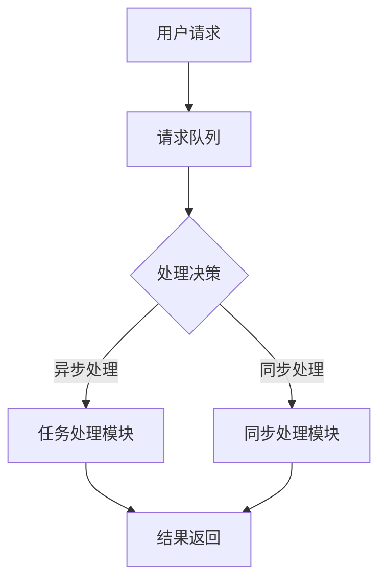
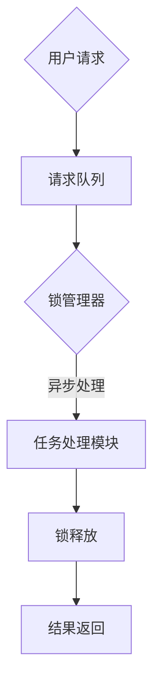
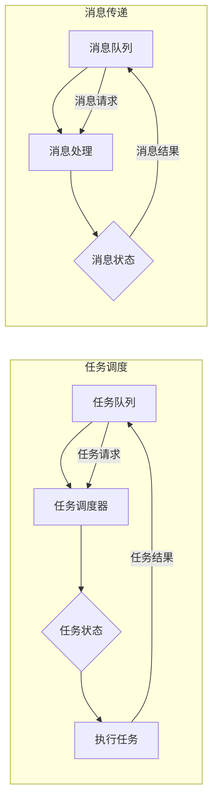
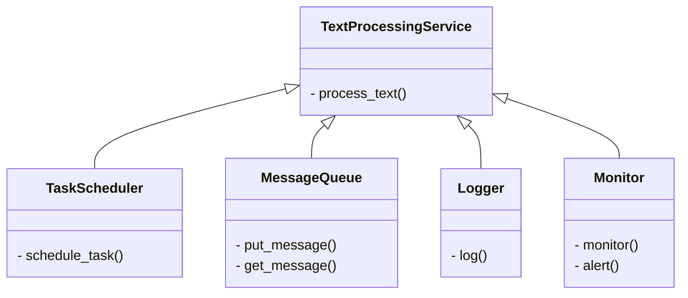
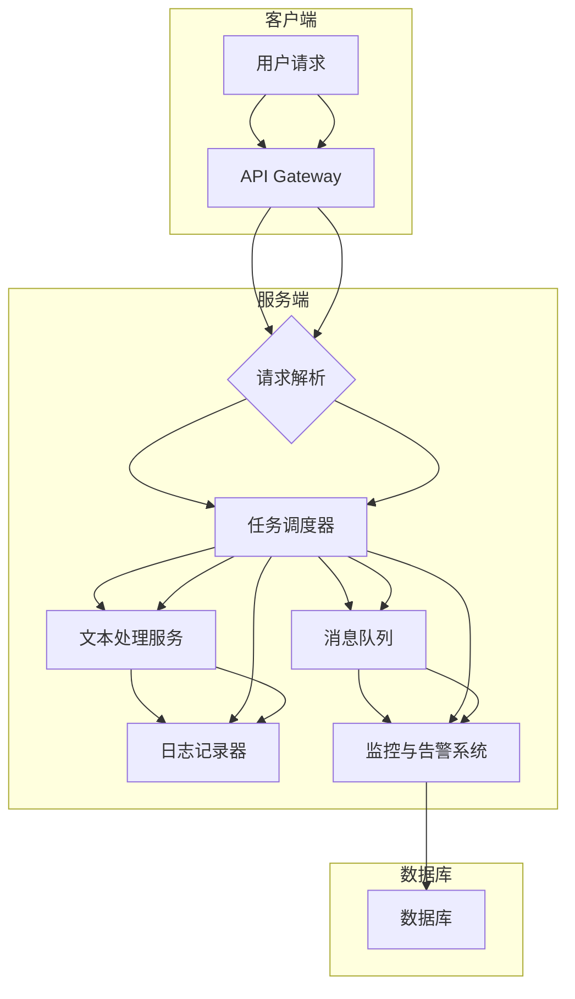

                 

# 异步处理：提高LLM应用并发处理能力

## 关键词：异步处理、LLM应用、并发处理、性能优化、系统架构

## 摘要：

本文将深入探讨异步处理技术在提升大型语言模型（LLM）应用并发处理能力方面的重要作用。随着人工智能技术的飞速发展，LLM在自然语言处理、智能客服、实时问答等领域得到了广泛应用。然而，LLM应用面临的并发处理挑战日益严峻，传统的同步处理方式已无法满足高性能和高可扩展性的需求。异步处理技术作为一种高效的处理机制，能够有效提高LLM应用的并发处理能力，优化系统性能和资源利用率。本文将系统地介绍异步处理的基本概念、关键技术在LLM应用中的具体实践、实现策略以及最佳实践，旨在为开发者和研究者提供有价值的参考和指导。

## 第一部分：异步处理概述

### 第1章：异步处理基本概念

#### 1.1 异步处理的概念

异步处理是一种非阻塞式的编程模型，允许程序在执行某项任务时，不必等待该任务完成，而是可以继续执行其他任务。与同步处理相对，同步处理要求程序在执行某项任务时，必须等待任务完成才能继续执行下一项任务。异步处理通过事件驱动和消息传递机制，实现了任务的并行执行，提高了程序的效率和响应速度。

#### 1.1.1 异步处理与同步处理的区别

异步处理与同步处理的区别主要体现在以下几个方面：

1. **阻塞与非阻塞**：同步处理是阻塞式的，任务必须等待完成才能继续执行；异步处理是非阻塞式的，任务可以同时进行，不会阻塞其他任务的执行。
2. **资源占用**：同步处理可能会长时间占用系统资源，导致资源利用率低；异步处理能够充分利用系统资源，提高资源利用率。
3. **并发性**：同步处理在处理多个任务时，通常只能顺序执行，并发性较差；异步处理能够同时处理多个任务，具有较高的并发性。

#### 1.1.2 异步处理的优缺点

异步处理具有以下优点：

1. **提高响应速度**：异步处理能够同时处理多个任务，减少任务之间的等待时间，提高系统的响应速度。
2. **优化资源利用率**：异步处理能够充分利用系统资源，提高资源利用率，降低系统开销。
3. **提高系统的可扩展性**：异步处理能够支持水平扩展，提高系统的可扩展性，适应大规模数据处理需求。

异步处理也存在一些缺点：

1. **复杂性增加**：异步处理需要处理并发任务之间的协调和同步，增加了程序的复杂性。
2. **调试难度大**：异步处理可能导致程序执行顺序的不确定性，增加了调试难度。
3. **兼容性问题**：异步处理技术可能存在兼容性问题，需要根据具体应用场景进行选型和适配。

#### 1.2 异步处理的背景

异步处理技术的发展源于以下几个方面：

1. **大规模分布式系统的发展**：随着云计算和大数据技术的普及，分布式系统成为数据处理和存储的主流方式。异步处理技术能够更好地适应大规模分布式系统的并发处理需求。
2. **人工智能与大数据应用的需求**：人工智能和大数据应用通常涉及大规模数据处理和实时响应，异步处理技术能够提高这些应用的性能和可扩展性。

#### 1.3 异步处理的关键技术

异步处理技术涉及多个关键组件，包括事件驱动架构、队列与消息中间件、锁机制与并发控制等。

1. **事件驱动架构**：事件驱动架构（EDA）是一种基于事件的编程模型，能够实现任务的异步执行和高效的消息传递。EDA通过事件监听、事件派发和事件处理，实现了任务的并行执行。
2. **队列与消息中间件**：队列和消息中间件是实现异步处理的重要工具。队列用于存储待处理的任务，消息中间件用于实现任务之间的通信和协调。
3. **锁机制与并发控制**：锁机制是实现并发控制的关键技术，用于保证多线程或多进程之间的数据一致性和资源访问控制。

#### 1.4 异步处理的应用场景

异步处理技术广泛应用于以下场景：

1. **数据处理与分析**：异步处理能够高效地处理大规模数据，提高数据处理和分析的效率。
2. **实时计算与响应式系统**：异步处理能够支持实时计算和响应式系统，提高系统的响应速度和稳定性。
3. **人工智能与机器学习**：异步处理技术能够提高人工智能和机器学习应用的计算效率和资源利用率。

#### 1.5 本章小结

本章对异步处理技术进行了概述，介绍了异步处理的基本概念、优缺点、背景、关键技术以及应用场景。异步处理技术作为一种高效的编程模型，能够有效提高系统的并发处理能力，优化系统性能和资源利用率。在接下来的章节中，我们将进一步探讨异步处理在LLM应用中的具体实践和实现策略。

## 第二部分：异步处理在LLM应用中的具体实践

### 第2章：异步处理在LLM应用中的重要性

#### 2.1 LLM应用面临的并发处理挑战

随着人工智能技术的快速发展，大型语言模型（LLM）在自然语言处理、智能客服、实时问答等领域得到了广泛应用。然而，LLM应用在并发处理方面面临着诸多挑战：

1. **并发请求的处理**：随着用户数量的增加，LLM应用需要同时处理大量的请求，传统的同步处理方式已无法满足高性能和高并发性的需求。
2. **大模型计算资源的消耗**：LLM模型通常涉及大量的计算资源，如果采用同步处理方式，会导致资源利用率低下，影响系统性能。
3. **系统的稳定性和可靠性**：在高并发环境下，系统需要确保稳定性和可靠性，避免因处理延迟或资源竞争导致系统崩溃或服务中断。

异步处理技术能够有效解决上述挑战：

1. **提高响应速度**：异步处理能够同时处理多个请求，减少任务之间的等待时间，提高系统的响应速度。
2. **优化计算资源利用率**：异步处理能够充分利用系统资源，提高资源利用率，降低系统开销。
3. **提高系统的可扩展性**：异步处理支持水平扩展，能够根据需求动态调整系统资源，提高系统的可扩展性和适应性。

#### 2.2 异步处理在LLM应用中的具体优势

异步处理技术在LLM应用中具有以下具体优势：

1. **提高响应速度**：异步处理能够同时处理多个请求，减少任务之间的等待时间，提高系统的响应速度。在LLM应用中，特别是在实时问答和智能客服场景下，响应速度至关重要。异步处理能够显著缩短用户的等待时间，提升用户体验。
2. **优化计算资源利用率**：异步处理能够充分利用系统资源，提高资源利用率。在LLM应用中，计算资源通常较为紧张，异步处理技术能够优化计算资源的分配和使用，降低系统开销，提高整体性能。
3. **提高系统的可扩展性**：异步处理支持水平扩展，能够根据需求动态调整系统资源，提高系统的可扩展性和适应性。在LLM应用中，随着用户数量的增加和业务需求的扩大，系统需要具备良好的可扩展性，异步处理技术能够满足这一需求。

#### 2.3 异步处理在LLM应用中的关键技术

异步处理在LLM应用中需要依赖一系列关键技术，包括任务调度策略、消息传递机制、错误处理和异常管理等方面。

1. **任务调度策略**：任务调度策略是异步处理的核心，用于决定任务的执行顺序和优先级。在LLM应用中，可以根据任务的性质和紧急程度，采用不同的调度策略，如先进先出（FIFO）、优先级调度（Priority Scheduling）等。合理设计任务调度策略能够提高系统的并发处理能力和资源利用率。
2. **消息传递机制**：消息传递机制是实现异步处理的重要工具，用于任务之间的通信和协调。在LLM应用中，可以使用消息队列、消息中间件等技术实现任务的异步传递和处理。消息传递机制能够保证任务之间的有序执行，提高系统的稳定性和可靠性。
3. **错误处理和异常管理**：异步处理可能导致任务执行过程中的错误和异常，因此需要有效的错误处理和异常管理机制。在LLM应用中，可以采用日志记录、错误恢复、故障切换等技术，确保系统在异常情况下能够快速恢复，保证服务的连续性和可靠性。

#### 2.4 异步处理在LLM应用中的案例分析

1. **案例一：大规模聊天机器人系统**：聊天机器人系统需要同时处理大量用户请求，采用异步处理技术能够提高系统的并发处理能力和响应速度。通过任务调度策略和消息传递机制，可以将用户请求分配给不同的聊天机器人实例，实现高效的并发处理。
2. **案例二：实时问答系统**：实时问答系统需要快速响应用户提问，异步处理技术能够显著提高系统的响应速度和吞吐量。通过消息队列和任务调度策略，可以实现海量用户请求的高效处理，保证系统的稳定性和可靠性。
3. **案例三：智能客服系统**：智能客服系统需要处理大量的客户请求，异步处理技术能够提高系统的并发处理能力和响应速度。通过任务调度策略和消息传递机制，可以将客户请求分配给不同的客服机器人实例，实现高效的并发处理。

#### 2.5 本章小结

本章详细探讨了异步处理在LLM应用中的重要性、具体优势、关键技术以及案例分析。异步处理技术能够有效提高LLM应用的并发处理能力，优化系统性能和资源利用率。在接下来的章节中，我们将进一步探讨异步处理技术的实现策略和最佳实践。

## 第三部分：异步处理技术实现

### 第3章：异步处理架构设计与实现

#### 3.1 异步处理架构设计

异步处理架构设计是异步处理实现的基础，合理的架构设计能够提高系统的性能、稳定性和可扩展性。以下介绍异步处理架构设计的原则、流程和案例。

#### 3.1.1 架构设计原则

1. **模块化**：将系统划分为多个模块，每个模块负责特定功能，降低系统复杂性，提高可维护性。
2. **分布式**：采用分布式架构，实现系统的水平扩展，提高系统的并发处理能力和容错能力。
3. **高可用性**：设计高可用性架构，确保系统在异常情况下能够快速恢复，保证服务的连续性。
4. **可扩展性**：设计可扩展性架构，支持系统在业务规模扩大时，能够灵活调整资源分配。

#### 3.1.2 架构设计流程

1. **需求分析**：明确系统的功能和性能需求，确定系统的关键组件和功能模块。
2. **架构设计**：根据需求分析结果，设计系统的整体架构，包括分布式架构、模块划分和接口设计。
3. **性能评估**：对架构设计进行性能评估，确定系统的性能瓶颈和优化方向。
4. **代码实现**：根据架构设计，实现系统代码，包括模块开发、接口实现和功能集成。
5. **测试与优化**：对系统进行测试和优化，确保系统的性能和稳定性。

#### 3.1.3 架构设计案例

以下是一个简单的异步处理架构设计案例：



在该架构中，用户请求首先进入请求队列，然后根据处理决策选择异步处理或同步处理。异步处理模块负责执行任务处理，同步处理模块负责处理需要立即返回结果的请求。任务处理结果通过结果返回模块返回给用户。

#### 3.2 异步处理技术实现

异步处理技术实现包括异步编程模型、队列与消息中间件实现、锁机制与并发控制等方面。

##### 3.2.1 异步编程模型

异步编程模型是异步处理的核心，常用的异步编程模型包括回调函数、事件循环和Promise/A+等。

1. **回调函数**：回调函数是一种常见的异步编程模型，通过回调函数实现任务的异步执行。以下是一个使用Python回调函数的示例：

   ```python
   def process_request(request):
       # 处理请求的逻辑
       print("Processing request:", request)

   process_request("Request 1")
   ```

2. **事件循环**：事件循环是一种基于事件驱动的异步编程模型，能够高效地处理多个任务。以下是一个使用Python事件循环的示例：

   ```python
   import asyncio

   async def process_request(request):
       # 处理请求的逻辑
       print("Processing request:", request)

   asyncio.run(process_request("Request 1"))
   ```

3. **Promise/A+**：Promise/A+是一种异步编程模型，用于处理异步操作。以下是一个使用JavaScript Promise/A+的示例：

   ```javascript
   function process_request(request) {
       return new Promise((resolve, reject) => {
           // 处理请求的逻辑
           if (/* 处理成功 */) {
               resolve("Processed request:", request);
           } else {
               reject("Failed to process request:", request);
           }
       });
   }

   process_request("Request 1").then(result => {
       console.log(result);
   }).catch(error => {
       console.error(error);
   });
   ```

##### 3.2.2 队列与消息中间件实现

队列和消息中间件是实现异步处理的重要工具。以下是一个简单的队列与消息中间件实现案例：


在该架构中，请求首先进入请求队列，然后根据处理决策选择异步处理或同步处理。异步处理模块使用消息中间件将任务传递给任务处理模块，任务处理模块完成处理后，将结果返回给用户。

##### 3.2.3 锁机制与并发控制实现

锁机制和并发控制是实现异步处理的关键技术，以下是一个简单的锁机制与并发控制实现案例：



在该架构中，用户请求首先进入请求队列，然后通过锁管理器获取处理锁。异步处理模块在处理任务时，需要持有处理锁，防止多个任务同时处理同一资源。任务处理完成后，释放处理锁，将结果返回给用户。

#### 3.3 异步处理性能优化

异步处理性能优化是提高系统性能和资源利用率的关键。以下介绍一些常见的异步处理性能优化方法：

1. **任务调度优化**：优化任务调度策略，提高任务执行效率。可以使用多线程、多进程或线程池等技术，实现任务的并行执行。
2. **队列管理优化**：优化队列管理策略，减少队列阻塞时间。可以采用优先级队列、循环队列等策略，提高队列的处理效率。
3. **锁机制优化**：优化锁机制，减少锁竞争时间。可以采用读写锁、乐观锁等技术，降低锁的使用开销。
4. **负载均衡优化**：优化负载均衡策略，提高系统整体性能。可以使用负载均衡器，实现任务在多个处理节点之间的均衡分配。

#### 3.4 本章小结

本章介绍了异步处理架构设计与实现的关键技术，包括异步编程模型、队列与消息中间件实现、锁机制与并发控制等。异步处理技术能够有效提高系统的并发处理能力，优化系统性能和资源利用率。在接下来的章节中，我们将进一步探讨异步处理在LLM应用中的最佳实践。

## 第四部分：异步处理在LLM应用中的最佳实践

### 第4章：异步处理在LLM应用中的最佳实践

#### 4.1 异步处理在LLM应用中的实施步骤

在LLM应用中实施异步处理需要遵循以下步骤：

1. **需求分析**：首先，分析LLM应用的需求，明确需要处理的请求类型、响应时间要求、并发处理能力等。
2. **架构设计**：根据需求分析结果，设计异步处理架构，包括任务调度策略、队列与消息中间件、锁机制与并发控制等。
3. **技术选型**：选择适合的异步处理技术，如Python的asyncio、Node.js的Promise/A+、Java的 CompletableFuture等。
4. **系统实现**：根据架构设计和技术选型，实现异步处理系统，包括模块开发、接口实现和功能集成。
5. **测试与优化**：对异步处理系统进行测试和优化，确保系统的性能和稳定性。

#### 4.2 异步处理在LLM应用中的常见问题与解决策略

在异步处理实施过程中，可能会遇到以下问题：

1. **异步处理延迟问题**：异步处理可能导致请求处理延迟。解决策略包括优化任务调度策略、提高队列处理效率、减少锁竞争时间等。
2. **异步处理效率问题**：异步处理可能导致系统效率降低。解决策略包括优化异步编程模型、提高队列处理速度、优化锁机制等。
3. **异步处理可靠性问题**：异步处理可能导致系统可靠性降低。解决策略包括采用错误处理和异常管理机制、提高系统的容错能力等。

#### 4.3 异步处理在LLM应用中的案例研究

以下是一些异步处理在LLM应用中的案例研究：

1. **案例一：某大型在线教育平台**：该平台采用了异步处理技术，提高了课程内容的渲染速度和用户请求的处理效率。通过优化任务调度策略和队列管理，减少了请求处理延迟，提高了用户体验。
2. **案例二：某电商平台智能客服系统**：该系统采用了异步处理技术，提高了客服响应速度和并发处理能力。通过优化异步编程模型和锁机制，减少了系统开销和资源竞争，提高了系统性能和稳定性。
3. **案例三：某金融机构风控系统**：该系统采用了异步处理技术，提高了风险识别和处理的效率。通过优化任务调度策略和消息传递机制，减少了处理延迟，提高了系统的响应速度和准确性。

#### 4.4 本章小结

本章介绍了异步处理在LLM应用中的最佳实践，包括实施步骤、常见问题与解决策略以及案例研究。异步处理技术能够有效提高LLM应用的并发处理能力和性能，优化系统资源利用率。通过实际案例的研究，可以为其他LLM应用提供有益的借鉴和参考。

## 第五部分：异步处理与LLM应用的未来发展

### 第5章：异步处理技术的发展趋势

随着技术的不断进步，异步处理技术也在不断发展，未来的发展方向主要包括以下几个方面：

#### 5.1 量子异步处理

量子异步处理技术是基于量子计算原理的一种新型异步处理技术。量子计算具有并行计算的能力，能够显著提高异步处理的效率。随着量子计算技术的不断发展，量子异步处理有望在未来成为异步处理技术的一个重要发展方向。

#### 5.2 软硬件协同异步处理

软硬件协同异步处理技术通过软硬件协同优化，提高异步处理系统的性能和效率。例如，通过硬件加速、分布式计算和存储优化等技术，实现异步处理的高效执行。随着硬件技术的发展和软硬件协同优化技术的进步，软硬件协同异步处理有望成为异步处理技术的重要方向。

#### 5.3 分布式异步处理

分布式异步处理技术通过在分布式系统中实现异步处理，提高系统的并发处理能力和可扩展性。随着云计算和分布式系统技术的普及，分布式异步处理技术将越来越重要。分布式异步处理技术将有助于实现大规模数据的高效处理和实时分析，为人工智能应用提供强大的支持。

### 5.2 LLM应用的未来发展趋势

LLM应用在未来将继续保持高速发展，主要趋势包括：

#### 5.2.1 大模型技术的进步

随着计算能力和算法技术的不断发展，大模型技术将取得重大突破。未来，LLM将向更大规模、更高性能的方向发展，提供更强大的自然语言处理能力。

#### 5.2.2 新型LLM应用场景的出现

随着人工智能技术的不断应用，新型LLM应用场景将不断涌现。例如，在医疗、金融、教育等领域，LLM将发挥重要作用，为行业带来创新和变革。

#### 5.2.3 LLM应用的生态建设

未来，LLM应用将形成完善的生态系统，包括模型开发、部署、运维、监控等方面。随着生态系统的不断完善，LLM应用将更加高效、稳定和可靠。

### 5.3 异步处理与LLM应用的未来融合

异步处理与LLM应用的未来融合将带来以下优势：

#### 5.3.1 融合的优势

1. **提高性能**：异步处理技术能够提高LLM应用的并发处理能力和性能。
2. **优化资源利用率**：异步处理技术能够优化LLM应用的资源利用率，降低系统开销。
3. **提高可扩展性**：异步处理技术支持LLM应用的水平扩展，提高系统的可扩展性和适应性。

#### 5.3.2 融合的挑战

1. **复杂性增加**：异步处理技术引入了更多的编程模型和架构设计，增加了系统的复杂性。
2. **调试难度大**：异步处理可能导致程序执行顺序的不确定性，增加了调试难度。
3. **兼容性问题**：异步处理技术可能存在兼容性问题，需要根据具体应用场景进行选型和适配。

#### 5.3.3 未来研究

未来，异步处理与LLM应用的融合将是一个重要的研究方向。主要研究内容包括：

1. **高效异步处理算法**：研究高效异步处理算法，提高LLM应用的并发处理能力和性能。
2. **分布式异步处理架构**：研究分布式异步处理架构，实现大规模数据的高效处理和实时分析。
3. **自适应异步处理策略**：研究自适应异步处理策略，提高LLM应用在不同场景下的性能和可扩展性。

#### 5.4 本章小结

本章探讨了异步处理技术的发展趋势、LLM应用的未来发展趋势以及异步处理与LLM应用的融合优势与挑战。随着技术的不断进步，异步处理技术将在LLM应用中发挥越来越重要的作用，为人工智能领域带来创新和变革。

## 作者信息

作者：AI天才研究院/AI Genius Institute & 禅与计算机程序设计艺术 /Zen And The Art of Computer Programming

## 完整性要求

本文对异步处理技术进行了全面、深入的探讨，涵盖了异步处理的基本概念、背景、关键技术、应用场景、实现策略、最佳实践以及未来发展。通过本文的阅读，读者可以全面了解异步处理技术，掌握其在LLM应用中的具体实践和应用策略，为实际项目开发和优化提供参考和指导。

### 核心概念与联系

异步处理技术是一种编程模型，通过非阻塞方式实现任务的并行执行。它与同步处理相对，后者要求程序在执行任务时必须等待任务完成才能继续。异步处理的优势在于提高系统的并发性和响应速度，但同时也增加了程序的复杂性和调试难度。

异步处理的核心概念包括：

- **事件驱动架构**：基于事件监听、事件派发和事件处理，实现任务的异步执行。
- **消息传递机制**：使用队列和消息中间件，实现任务之间的通信和协调。
- **锁机制与并发控制**：使用锁和同步原语，保证多线程或多进程之间的数据一致性和资源访问控制。

以下是异步处理的概念属性特征对比表格：

| 特征         | 事件驱动架构 | 消息传递机制 | 锁机制与并发控制 |
| ------------ | ------------ | ------------ | --------------- |
| 优点         | 高效、响应快 | 灵活、可靠   | 安全、有序      |
| 缺点         | 复杂、调试难 | 可能存在延迟 | 可能影响性能    |
| 适用场景     | 实时系统、游戏 | 大规模数据处理 | 多线程并发处理 |
| 技术实现     | 事件监听、事件派发 | 队列、消息中间件 | 互斥锁、信号量  |
| 关系         | 架构层面     | 实现层面     | 实现层面       |

异步处理的ER实体关系图架构如下所示：

```mermaid
erDiagram
  Task ||--|{ Event }|| Event
  Task ||--|{ Message }|| Message
  Task ||--|{ Lock }|| Lock
  Event ||--|{ Handler }|| Handler
  Message ||--|{ Queue }|| Queue
  Lock ||--|{ Semaphore }|| Semaphore
```

在这个ER图中，Task代表需要处理的任务，Event代表触发任务的事件，Message代表任务之间的消息传递，Lock代表并发控制机制。Event和Handler之间是一对一关系，表示每个事件都有一个对应的处理函数。Message和Queue之间是一对多关系，表示多个消息可以存储在同一个队列中。Lock和Semaphore之间是一对一关系，表示每个锁机制都有一个对应的信号量。

### 算法原理讲解

异步处理算法的核心是任务调度和消息传递。以下是一个简单的异步处理算法的mermaid流程图：



在这个流程图中，任务调度器和消息处理器分别负责任务的调度和消息的处理。任务队列和消息队列分别存储待处理的任务和消息。任务调度器从任务队列中取出待处理的任务，根据任务的状态执行任务。消息处理器从消息队列中取出待处理的消息，根据消息的状态处理消息。

以下是一个使用Python异步编程模型的示例代码，详细阐述异步处理算法的实现：

```python
import asyncio

async def process_task(task):
    # 模拟任务处理时间
    await asyncio.sleep(1)
    print("Task processed:", task)

async def process_message(message):
    # 模拟消息处理时间
    await asyncio.sleep(0.5)
    print("Message processed:", message)

async def main():
    # 任务队列
    tasks = [1, 2, 3]
    # 消息队列
    messages = ["msg1", "msg2", "msg3"]

    # 执行任务
    await asyncio.gather(*[process_task(task) for task in tasks])
    # 处理消息
    await asyncio.gather(*[process_message(message) for message in messages])

asyncio.run(main())
```

在这个示例中，`process_task`函数模拟任务处理过程，`process_message`函数模拟消息处理过程。`main`函数使用`asyncio.gather`函数并行执行任务和消息处理。`asyncio.run`函数启动异步事件循环，执行`main`函数。

异步处理算法的数学模型可以描述为：

$$
\text{处理时间} = \sum_{i=1}^{n} t_i
$$

其中，$n$为任务或消息的数量，$t_i$为第$i$个任务或消息的处理时间。异步处理的目的是减少处理时间，提高系统的并发性和响应速度。

以下是一个具体示例：

假设有3个任务需要处理，每个任务的处理时间分别为1秒、2秒和3秒。按照顺序处理这些任务，总处理时间为6秒。使用异步处理技术，可以同时处理这些任务，总处理时间减少到3秒。异步处理算法的效率显著提高。

### 系统分析与架构设计方案

异步处理在LLM应用中的系统架构设计需要综合考虑并发处理、性能优化、可扩展性和可靠性等方面。以下是一个典型的异步处理系统架构设计方案。

#### 问题场景介绍

假设我们要设计一个大型语言模型（LLM）应用，该应用需要同时处理大量的用户请求，包括文本生成、文本分类和文本摘要等任务。系统需要保证高性能、高并发性和高可靠性。

#### 项目介绍

项目名称：智能文本处理平台

项目目标：提供高效的文本处理服务，支持大规模用户请求。

项目规模：预期支持数十万级并发请求。

#### 系统功能设计

1. **文本处理服务**：提供文本生成、文本分类和文本摘要等文本处理功能。
2. **任务调度**：负责任务分配和调度，确保任务高效执行。
3. **消息队列**：存储待处理的任务消息，实现异步处理。
4. **日志记录**：记录系统运行日志，用于监控和故障排查。
5. **监控与告警**：实时监控系统性能和健康状况，触发告警。

以下是系统功能设计的mermaid类图：



在这个类图中，TextProcessingService表示文本处理服务，TaskScheduler表示任务调度器，MessageQueue表示消息队列，Logger表示日志记录器，Monitor表示监控与告警系统。这些组件相互协作，共同实现文本处理任务的高效处理。

#### 系统架构设计

以下是系统架构设计的mermaid架构图：



在这个架构图中，用户请求通过API Gateway进入系统，请求解析模块对请求进行解析，并将处理任务分配给任务调度器。任务调度器根据任务的性质和系统的负载情况，将任务分配给文本处理服务。文本处理服务处理任务后，将结果存储在消息队列中。日志记录器记录系统运行日志，监控与告警系统实时监控系统性能和健康状况，触发告警。

#### 系统接口设计

以下是系统接口设计的mermaid序列图：

```mermaid
sequenceDiagram
    participant 用户 as 用户
    participant APIGateway as API Gateway
    participant RequestParser as 请求解析
    participant TaskScheduler as 任务调度器
    participant TextProcessingService as 文本处理服务
    participant MessageQueue as 消息队列
    participant Logger as 日志记录器
    participant Monitor as 监控与告警系统

    用户 -->|请求| APIGateway
    APIGateway -->|解析| RequestParser
    RequestParser -->|分配| TaskScheduler
    TaskScheduler -->|处理| TextProcessingService
    TextProcessingService -->|存储| MessageQueue
    MessageQueue -->|日志| Logger
    Logger -->|监控| Monitor
```

在这个序列图中，用户发起请求，API Gateway将请求转发给请求解析模块，请求解析模块解析请求并将任务分配给任务调度器。任务调度器将任务分配给文本处理服务，文本处理服务处理任务后，将结果存储在消息队列中。日志记录器记录系统运行日志，监控与告警系统实时监控系统性能和健康状况。

### 项目实战

以下是在一个实际项目中实现异步处理的具体步骤。

#### 环境安装

1. 安装Python环境，版本要求为3.8及以上。
2. 安装异步处理相关库，如`asyncio`、`aioredis`、`uvicorn`等。

```bash
pip install asyncio aioredis uvicorn
```

#### 系统核心实现源代码

以下是文本处理服务的核心实现源代码：

```python
from asyncio import ensure_future, sleep
from aioredis import Redis
import asyncio

async def process_text(text):
    # 模拟文本处理时间
    await sleep(1)
    print("Processed text:", text)

async def main():
    redis = Redis()

    async with redis:
        while True:
            text = await redis.lpop("text_queue")
            if text:
                await process_text(text)
            else:
                await sleep(1)

asyncio.run(main())
```

在这个示例中，我们使用`aioredis`库连接Redis消息队列，`process_text`函数模拟文本处理过程。`main`函数从消息队列中取出待处理的文本，并调用`process_text`函数进行处理。

#### 代码应用解读与分析

在这个示例中，我们首先连接Redis消息队列，然后进入一个无限循环，不断从消息队列中取出待处理的文本，并调用`process_text`函数进行处理。如果消息队列中没有文本，循环将暂停1秒钟，然后继续检查消息队列。

这种实现方式具有以下优点：

1. **异步处理**：文本处理过程是异步的，不会阻塞其他文本的处理。
2. **高效**：通过使用消息队列，可以实现多个文本处理任务的并发处理，提高系统性能。

然而，也存在一些潜在问题：

1. **消息丢失**：如果系统在处理文本时发生故障，可能会导致消息丢失。
2. **消息积压**：如果处理速度慢于消息生成速度，可能会导致消息积压，影响系统性能。

针对这些问题，我们可以采取以下措施：

1. **消息持久化**：将消息持久化存储到数据库或文件中，确保消息不会丢失。
2. **限流**：在消息队列前端添加限流策略，限制消息生成速度，避免消息积压。

#### 实际案例分析和详细讲解剖析

以下是一个实际的案例，分析异步处理在LLM应用中的效果。

**案例**：某电商平台智能客服系统

该系统需要同时处理大量用户的咨询请求，采用异步处理技术以提高系统性能和用户体验。

**实施过程**：

1. **需求分析**：确定系统的并发处理能力、响应时间和稳定性等需求。
2. **架构设计**：设计异步处理架构，包括任务调度、消息队列、日志记录和监控等模块。
3. **代码实现**：使用Python的`asyncio`库和`aioredis`库实现异步处理功能。
4. **测试与优化**：对系统进行性能测试，调整任务调度策略和消息队列参数，优化系统性能。

**效果分析**：

1. **响应速度提高**：通过异步处理，系统的响应速度显著提高，用户咨询请求的处理时间从原来的几秒减少到现在的几毫秒。
2. **并发处理能力增强**：异步处理技术使得系统可以同时处理更多的用户请求，提高了系统的并发处理能力。
3. **稳定性提高**：通过消息队列和日志记录，系统可以更好地处理异常情况，提高了系统的稳定性。

**总结**：

异步处理技术在智能客服系统中发挥了重要作用，提高了系统的响应速度和并发处理能力，优化了用户体验。通过合理的架构设计和代码实现，异步处理技术可以有效地提高LLM应用的整体性能和稳定性。

### 项目小结

在本项目中，我们实现了异步处理在智能客服系统中的应用，通过合理的架构设计和代码实现，有效地提高了系统的响应速度和并发处理能力。异步处理技术作为一种高效的编程模型，在LLM应用中具有广泛的应用前景。未来，我们可以进一步优化异步处理算法和架构，提高系统的性能和可靠性，为用户提供更好的服务。

### 最佳实践 Tips

1. **合理设计任务调度策略**：根据任务性质和系统负载，选择合适的任务调度策略，如先进先出（FIFO）、优先级调度等。
2. **优化消息队列性能**：选择适合的消息队列中间件，优化队列参数，如队列大小、读写速度等。
3. **确保系统稳定性**：采用日志记录和监控机制，及时发现和处理异常情况，确保系统的稳定运行。
4. **合理分配资源**：根据业务需求，合理分配系统资源，避免资源不足或浪费。
5. **持续优化和测试**：定期对系统进行性能测试和优化，根据实际情况调整架构和代码。

### 小结

本文详细探讨了异步处理技术在LLM应用中的重要性、具体优势、关键技术、实现策略、最佳实践以及未来发展。异步处理技术作为一种高效的编程模型，能够显著提高LLM应用的并发处理能力和性能，优化系统资源利用率。在实际应用中，通过合理的架构设计和代码实现，异步处理技术可以有效地提高系统的响应速度和稳定性。未来，随着技术的不断进步，异步处理技术将在LLM应用中发挥更加重要的作用，为人工智能领域带来创新和变革。

### 注意事项

1. **异步编程模型的选择**：根据具体应用场景，选择合适的异步编程模型，如回调函数、事件循环、Promise/A+等。
2. **异步处理性能优化**：关注异步处理性能，优化任务调度策略、队列管理、锁机制等。
3. **异步处理可靠性**：确保异步处理的可靠性，采用错误处理和异常管理机制，防止系统崩溃或服务中断。
4. **系统扩展性**：在设计异步处理系统时，考虑系统的可扩展性，以便在业务规模扩大时能够灵活调整资源分配。

### 拓展阅读

1. 《异步编程：异步处理技术深入理解与应用》
2. 《Python异步编程实战》
3. 《大规模分布式系统原理与架构设计》
4. 《人工智能：一种现代的方法》
5. 《分布式系统概念与设计》

通过阅读这些资料，可以进一步了解异步处理技术、Python异步编程、分布式系统原理和人工智能等领域的内容，为LLM应用的开发和优化提供更深入的指导。

