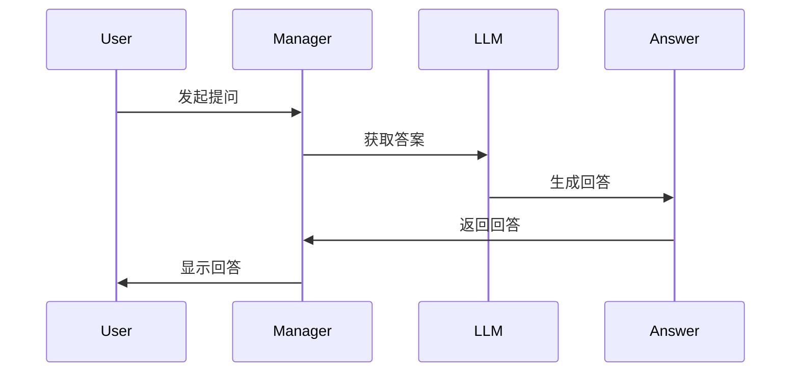
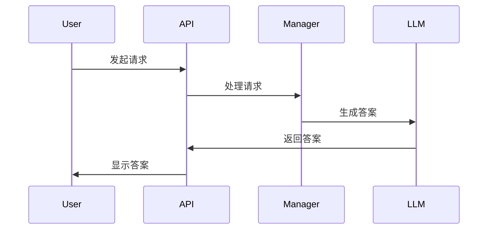

                 


# 弹性伸缩策略在LLM应用资源管理中的实现

## 关键词
- 弹性伸缩策略
- LLM应用资源管理
- 算法实现
- 系统架构设计
- 实际案例分析

## 摘要
本文将深入探讨弹性伸缩策略在LLM（大型语言模型）应用资源管理中的实现。随着AI技术的飞速发展，LLM在自然语言处理、智能客服等领域得到广泛应用。然而，如何高效地管理LLM应用中的资源，确保其性能和稳定性，成为了一个关键问题。本文将详细介绍弹性伸缩策略的概念、算法原理、系统架构设计以及实际应用案例，为开发者提供实用的指导。

## 1. 背景介绍

### 1.1 弹性伸缩策略的概念
弹性伸缩策略是指根据系统的负载情况，自动调整计算资源的能力。在云计算环境中，这一策略尤为重要，因为它能有效地优化资源利用率，降低成本，同时确保系统的性能和可靠性。

### 1.2 LLM应用资源管理的挑战
LLM应用通常具有如下特点：
- **计算密集性**：LLM的训练和推理过程需要大量的计算资源。
- **动态波动性**：用户请求的动态波动会导致计算资源需求的急剧变化。

### 1.3 问题背景与解决方案
随着LLM应用的普及，传统的静态资源分配方式已无法满足需求。因此，实现弹性伸缩策略，动态调整资源，成为解决这一问题的关键。

## 2. 核心概念与联系

### 2.1 弹性性的概念
弹性（Elasticity）是指系统在外部压力下，能够自适应调整自身性能的能力。在资源管理中，弹性表现为系统能够根据负载的变化自动扩展或收缩资源。

### 2.2 弹性性的属性
- **可扩展性**：系统可以水平或垂直扩展。
- **适应性**：系统可以根据不同的负载情况进行优化。
- **灵活性**：系统能够快速响应外部变化。

### 2.3 弹性性的实现
弹性性的实现通常依赖于以下组件：
- **监控与反馈机制**：实时监控系统的性能指标，如CPU使用率、内存占用、网络延迟等。
- **自动扩展与收缩机制**：根据性能指标调整资源。

### 2.4 ER实体关系图
以下是一个ER实体关系图，展示了与弹性伸缩策略相关的关键实体和它们之间的关系：

```mermaid
erDiagram
  Resource ||--o{ Load : 监控负载}
  Resource ||--o{ ScaleOut : 自动扩展}
  Resource ||--o{ ScaleIn : 自动收缩}
  Load ||--|{ Performance : 性能指标}
```

## 3. 算法原理讲解

### 3.1 算法概述
弹性伸缩算法的核心目标是确保系统在负载变化时，能够快速且高效地调整资源。以下是一个简化的算法框架：

1. 监控性能指标。
2. 根据性能指标，判断是否需要扩展或收缩资源。
3. 执行相应的扩展或收缩操作。
4. 循环执行上述步骤。

### 3.2 数学模型
弹性伸缩策略的数学模型可以表示为：

$$
\text{Resource Allocation} = f(\text{Current Load}, \text{Desired Performance})
$$

其中，$f$ 表示资源分配函数，它根据当前的负载和期望的性能来决定资源的分配。

### 3.3 Python代码示例
以下是一个使用Python编写的简单弹性伸缩算法示例：

```python
def scale_resource(current_load, desired_performance):
    if current_load > desired_performance * threshold:
        scale_out()
    elif current_load < desired_performance * threshold:
        scale_in()
    else:
        maintain()

def scale_out():
    # 扩展资源逻辑
    print("扩展资源...")

def scale_in():
    # 收缩资源逻辑
    print("收缩资源...")

def maintain():
    # 维持当前资源
    print("维持当前资源...")

# 设置阈值
threshold = 0.8

# 模拟负载变化
current_load = 0.9
desired_performance = 1.0
scale_resource(current_load, desired_performance)
```

## 4. 系统分析与设计

### 4.1 问题场景
假设我们正在开发一个提供实时问答服务的LLM应用，用户量急剧增加，导致系统负载剧增。为了确保服务质量，我们需要实现弹性伸缩策略。

### 4.2 系统功能设计

#### 4.2.1 领域模型（Mermaid类图）
以下是一个领域模型的Mermaid类图，展示了系统的主要类及其关系：

```mermaid
classDiagram
  User <<class>> 用户
  Question <<class>> 问题
  Answer <<class>> 答案
  LLM <<class>> 语言模型
  Resource <<class>> 资源
  Manager <<class>> 管理器
  User o--o Question : 提问
  Question o--o Answer : 回答
  LLM o--o Answer : 使用
  Resource o--o Manager : 管理
```

#### 4.2.2 系统架构设计（Mermaid架构图）
以下是一个系统架构设计的Mermaid架构图，展示了系统的组件及其交互关系：



#### 4.2.3 系统接口设计
系统的接口设计包括用户接口和API接口。用户接口用于提供问答服务的界面，API接口用于与其他系统进行集成。

#### 4.2.4 系统交互（Mermaid序列图）
以下是一个系统交互的Mermaid序列图，展示了用户请求和系统响应的过程：



## 5. 项目实战

### 5.1 环境安装
要在本地或云环境中安装LLM应用资源管理系统，需要以下步骤：
1. 安装必要的编程语言环境（如Python）。
2. 安装依赖的库和框架。
3. 配置云服务账号和权限。

### 5.2 核心实现
以下是一个简单的核心实现示例，展示了系统的核心组件和它们之间的交互：

```python
class ResourceManager:
    def __init__(self):
        self.current_load = 0
        self.desired_performance = 1.0

    def monitor_performance(self):
        # 监控性能的逻辑
        self.current_load = get_current_load()

    def scale_resource(self):
        self.monitor_performance()
        if self.current_load > self.desired_performance * 0.8:
            self.scale_out()
        elif self.current_load < self.desired_performance * 0.2:
            self.scale_in()
        else:
            self.maintain()

    def scale_out(self):
        # 扩展资源的逻辑
        print("扩展资源...")

    def scale_in(self):
        # 收缩资源的逻辑
        print("收缩资源...")

    def maintain(self):
        # 维持当前资源的逻辑
        print("维持当前资源...")

def main():
    resource_manager = ResourceManager()
    while True:
        resource_manager.scale_resource()
        time.sleep(10)  # 每隔10秒检查一次

if __name__ == "__main__":
    main()
```

### 5.3 代码应用解读与分析
代码中，`ResourceManager` 类负责监控性能、调整资源。`scale_resource` 方法根据当前负载和期望性能，决定是否需要扩展或收缩资源。`scale_out`、`scale_in` 和 `maintain` 方法分别实现相应的逻辑。

### 5.4 实际案例分析与详细讲解剖析
以下是一个实际案例的分析：

#### 案例描述
一个问答服务应用在用户量激增时，系统负载超过了预设阈值，导致响应时间延长。应用了弹性伸缩策略后，系统自动扩展了资源，提高了性能。

#### 分析与讲解
- **性能监控**：系统通过监控工具，实时获取CPU使用率、内存占用等性能指标。
- **自动扩展**：当负载超过阈值时，系统自动调用`scale_out`方法，增加计算节点。
- **自动收缩**：当负载下降到合理范围时，系统自动调用`scale_in`方法，减少计算节点。

#### 剖析
弹性伸缩策略通过自动化监控和资源调整，确保了系统的稳定性和高性能，为用户提供优质的问答体验。

### 5.5 项目小结
通过本文的实践，我们了解了弹性伸缩策略在LLM应用资源管理中的重要性。在实际项目中，合理地设计和管理资源，能够有效应对负载波动，提高系统的可靠性和用户体验。

## 6. 最佳实践 tips

- **性能监控**：选择适合的监控工具，实时获取系统性能指标。
- **资源调整策略**：根据业务需求和性能指标，制定合理的资源调整策略。
- **自动化脚本**：编写自动化脚本，实现资源的自动扩展和收缩。
- **测试与优化**：在部署前进行充分的测试，确保系统在各种负载下的稳定性。

## 7. 小结与注意事项

本文介绍了弹性伸缩策略在LLM应用资源管理中的实现。通过算法原理讲解、系统架构设计、项目实战等多个方面，我们深入探讨了如何有效管理LLM应用中的资源。

**注意事项**：
- **性能指标选择**：根据业务特点，选择合适的性能指标进行监控。
- **扩展与收缩阈值**：合理设置扩展与收缩的阈值，避免频繁调整。
- **资源成本**：在确保性能的同时，关注资源的成本效益。

## 8. 拓展阅读

- 《云计算架构设计与实践》
- 《基于容器技术的弹性伸缩架构设计与实现》
- 《深度学习与弹性计算》

## 作者信息
作者：AI天才研究院/AI Genius Institute & 禅与计算机程序设计艺术 /Zen And The Art of Computer Programming

---

本文以逻辑清晰、结构紧凑、简单易懂的专业的技术语言，结合Mermaid流程图和Python代码示例，详细阐述了弹性伸缩策略在LLM应用资源管理中的实现。希望通过本文，能够为读者提供有价值的参考和指导。

