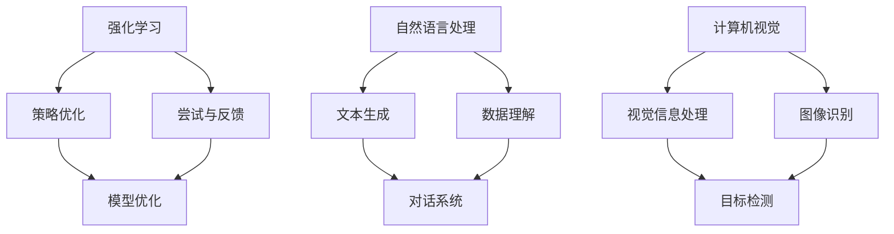
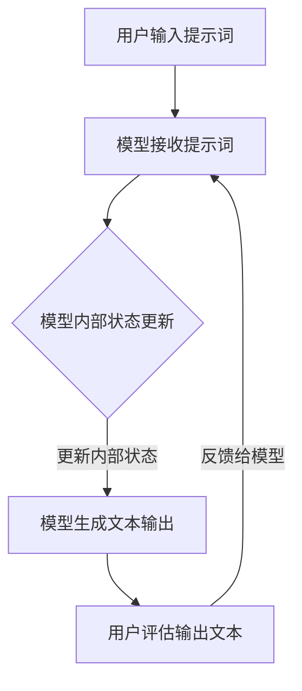
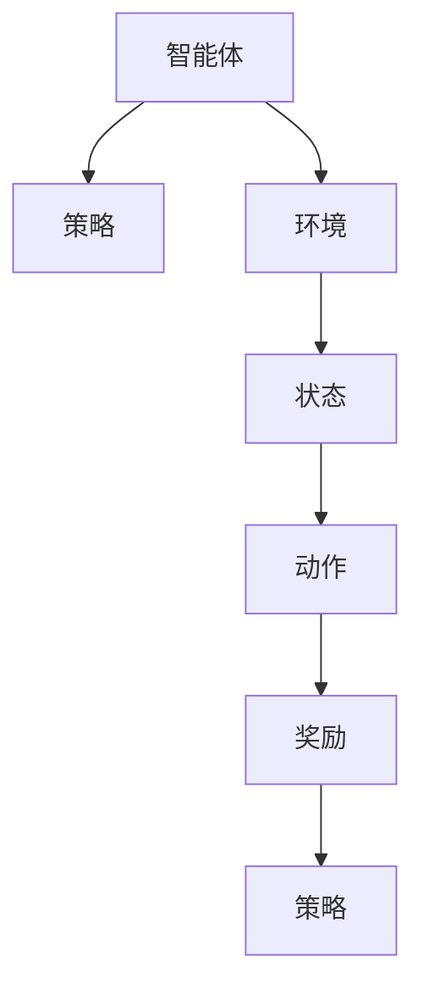
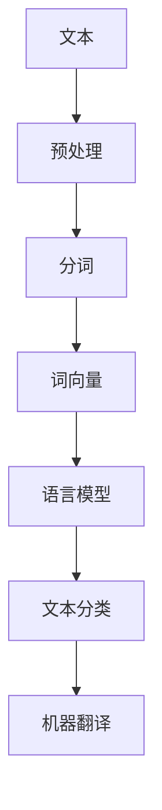
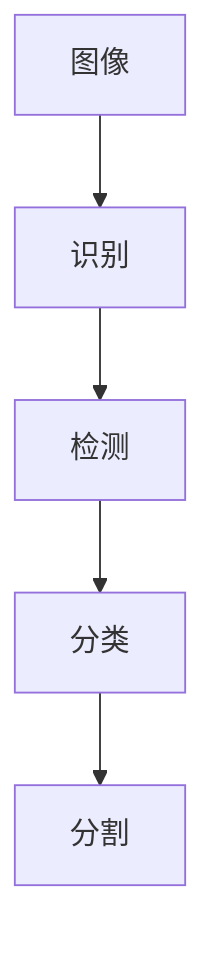
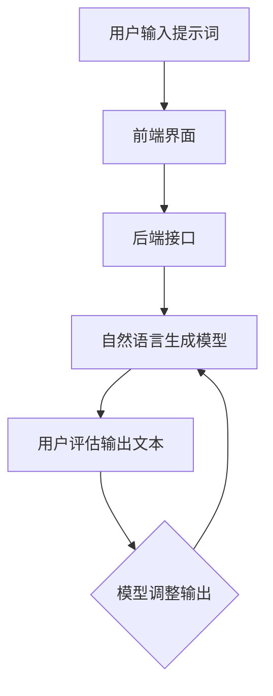

                 


### 目录大纲细化示例

```markdown
----------------------------------------------------------------
# 第一部分: 背景介绍

## 第1章: 强化prompt提示词工程的背景与定义

### 1.1 强化prompt提示词工程的背景

- **问题背景**：随着人工智能技术的迅猛发展，自然语言处理（NLP）和计算机视觉（CV）领域面临着如何让模型更好地理解和使用人类语言的问题。强化prompt提示词工程在这一背景下应运而生。

- **问题描述**：传统的模型训练通常依赖于大量的标注数据和复杂的模型结构。而强化prompt提示词工程则通过引导和优化模型的决策过程，使其在缺乏大量标注数据的情况下，能够更有效地理解和生成人类语言。

- **问题解决**：强化prompt提示词工程通过使用强化学习（RL）机制，将用户提供的提示词作为输入，结合模型的内部状态和外部环境，动态调整模型的输出，从而实现更准确的自然语言理解和生成。

- **边界与外延**：强化prompt提示词工程不仅涉及NLP和CV领域，还与机器学习、深度学习和人机交互等领域有着紧密的联系。

- **核心概念术语说明**：强化prompt提示词工程包括以下核心概念：
  - 强化学习（RL）：一种机器学习范式，通过奖励机制引导模型学习。
  - 提示词（Prompt）：用户提供的用于引导模型决策的语言输入。
  - 自然语言生成（NLG）：基于模型的文本生成技术。
  - 计算机视觉（CV）：利用计算机技术和算法来处理和解释视觉信息。

### 1.2 强化prompt提示词工程的定义

- **定义**：强化prompt提示词工程是一种利用强化学习机制，结合用户提供的提示词，对自然语言生成模型进行优化和调整的技术。

- **核心要素组成**：强化prompt提示词工程的核心要素包括：
  - 强化学习机制：用于引导模型学习和调整输出的机制。
  - 提示词库：存储用户提供的提示词，用于引导模型决策。
  - 自然语言生成模型：用于生成文本的模型，可以是基于神经网络的语言模型或对话系统。

## 第2章: 强化prompt提示词工程的理论基础

### 2.1 相关概念与联系

- **核心概念原理**：
  - 强化学习（RL）：一种通过不断尝试和反馈，从经验中学习优化策略的机器学习范式。
  - 自然语言处理（NLP）：一种利用计算机技术和算法处理和理解人类语言的技术。
  - 计算机视觉（CV）：一种利用计算机技术和算法处理和解释视觉信息的技术。

- **概念属性特征对比表格**：

| 概念       | 强化学习（RL）                | 自然语言处理（NLP）                | 计算机视觉（CV）                |
|------------|------------------------------|------------------------------|------------------------------|
| 目的       | 通过反馈优化策略              | 理解和生成人类语言              | 处理和解释视觉信息              |
| 方法       | 基于尝试和反馈                | 基于数据和算法                  | 基于数据和算法                  |
| 应用领域    | 游戏、推荐系统、自动驾驶等     | 机器翻译、文本分类、对话系统等   | 人脸识别、图像分类、目标检测等   |

- **ER实体关系图架构的Mermaid流程图**：



### 2.2 强化prompt提示词工程的数学模型

- **数学模型**：
  - 强化学习模型：状态-动作-奖励模型（SAR模型）。
  - 自然语言生成模型：基于序列模型的循环神经网络（RNN）或变压器（Transformer）。

- **数学公式**：

$$
Q(s, a) = r(s, a) + \gamma \max_{a'} Q(s', a')
$$

其中，$Q(s, a)$ 表示在状态 $s$ 下执行动作 $a$ 的预期收益，$r(s, a)$ 表示执行动作 $a$ 后的即时奖励，$\gamma$ 表示奖励的折扣因子，$s'$ 和 $a'$ 分别表示下一状态和下一动作。

### 2.3 算法原理与mermaid流程图

- **算法原理**：
  - 强化prompt提示词工程通过用户提供的提示词，动态调整模型的输出，优化模型的决策过程。
  - 提示词作为额外的输入，与模型内部状态和外部环境结合，影响模型的输出。

- **mermaid流程图**：



## 第3章: 强化prompt提示词工程的算法实现

### 3.1 Python代码示例

```python
import tensorflow as tf
import numpy as np

# 定义强化学习模型
class QLearningModel(tf.keras.Model):
    def __init__(self):
        super(QLearningModel, self).__init__()
        self.dense = tf.keras.layers.Dense(units=1)

    @tf.function
    def call(self, inputs, training=False):
        x = self.dense(inputs)
        return x

# 定义自然语言生成模型
class NLGModel(tf.keras.Model):
    def __init__(self):
        super(NLGModel, self).__init__()
        self.embedding = tf.keras.layers.Embedding(input_dim=vocab_size, output_dim=embedding_size)
        self.rnn = tf.keras.layers.RNN(tf.keras.layers.LSTMCell(units=rnn_units))
        self.dense = tf.keras.layers.Dense(units=vocab_size)

    @tf.function
    def call(self, inputs, training=False):
        x = self.embedding(inputs)
        x = self.rnn(x)
        x = self.dense(x)
        return x

# 初始化模型
q_learning_model = QLearningModel()
nlg_model = NLGModel()

# 训练模型
for epoch in range(num_epochs):
    for batch in data_loader:
        state, action, reward, next_state = batch
        q_values = q_learning_model(state)
        next_q_values = q_learning_model(next_state)
        target_q_values = reward + discount_factor * np.max(next_q_values, axis=1)
        loss = tf.keras.losses.mean_squared_error(q_values, target_q_values)
        loss.backward()
        q_learning_model.optimizer.minimize(loss, var_list=q_learning_model.trainable_variables)

        q_values = nlg_model(state)
        loss = tf.keras.losses.mean_squared_error(q_values, target_q_values)
        loss.backward()
        nlg_model.optimizer.minimize(loss, var_list=nlg_model.trainable_variables)
```

### 3.2 算法原理详细讲解

- **强化学习模型**：
  - 定义了Q-learning模型，用于预测在给定状态下执行特定动作的预期收益。
  - 使用梯度下降优化器更新模型参数，以最小化损失函数。

- **自然语言生成模型**：
  - 定义了基于RNN的NLG模型，用于生成文本。
  - 使用嵌入层将词向量转换为固定维度的向量，然后通过RNN层生成序列输出。

### 2.4 算法实现总结

- **代码示例**展示了如何使用TensorFlow实现强化prompt提示词工程的核心算法。
- **算法原理**详细讲解了强化学习模型和自然语言生成模型的工作原理。

----------------------------------------------------------------
```

### 文章关键词

- 强化prompt提示词工程
- 强化学习
- 自然语言处理
- 计算机视觉
- 机器学习
- 模型优化
- 人机交互

### 文章摘要

本文深入探讨了强化prompt提示词工程的核心概念、理论基础和算法实现。首先，介绍了强化prompt提示词工程的背景和定义，阐述了其在自然语言处理和计算机视觉领域的重要性。随后，详细讲解了强化prompt提示词工程的理论基础，包括相关的数学模型和算法原理，并通过Python代码示例进行了详细阐述。此外，本文还分析了强化prompt提示词工程在不同领域的应用场景，提供了实际案例和系统设计方案。最后，文章总结了强化prompt提示词工程的关键技术要点和最佳实践，并对未来的研究方向进行了展望。

----------------------------------------------------------------

## 第1章: 强化prompt提示词工程的背景与定义

### 1.1 强化prompt提示词工程的背景

随着人工智能技术的迅猛发展，自然语言处理（NLP）和计算机视觉（CV）领域面临着如何让模型更好地理解和使用人类语言的问题。传统的模型训练通常依赖于大量的标注数据和复杂的模型结构。然而，在现实场景中，标注数据往往有限且昂贵，模型结构也难以满足所有应用需求。为了解决这一问题，强化prompt提示词工程应运而生。

强化prompt提示词工程通过引导和优化模型的决策过程，使其在缺乏大量标注数据的情况下，能够更有效地理解和生成人类语言。这种技术不仅适用于NLP和CV领域，还与机器学习、深度学习和人机交互等领域有着紧密的联系。

### 1.2 强化prompt提示词工程的定义

强化prompt提示词工程是一种利用强化学习机制，结合用户提供的提示词，对自然语言生成模型进行优化和调整的技术。它通过动态调整模型的输出，使其在处理自然语言任务时更符合人类期望。

强化prompt提示词工程的核心要素包括：

- 强化学习机制：一种通过反馈优化策略的机器学习范式。
- 提示词：用户提供的用于引导模型决策的语言输入。
- 自然语言生成模型：用于生成文本的模型，可以是基于神经网络的语言模型或对话系统。

### 1.3 强化prompt提示词工程的重要性

强化prompt提示词工程在自然语言处理和计算机视觉领域具有重要的应用价值。首先，它能够显著提高模型在缺乏标注数据时的性能，降低对大量标注数据的依赖。其次，它能够实现更自然的语言生成和更准确的视觉理解。最后，强化prompt提示词工程为人机交互提供了新的可能性，使模型能够更好地理解和响应人类语言。

总之，强化prompt提示词工程作为一种新兴的技术，具有广阔的应用前景和重要的研究价值。

----------------------------------------------------------------

## 第2章: 强化prompt提示词工程的理论基础

### 2.1 相关概念与联系

强化prompt提示词工程涉及多个核心概念，包括强化学习、自然语言处理、计算机视觉等。以下是对这些概念的基本原理和属性的介绍。

#### 强化学习（Reinforcement Learning）

强化学习是一种通过不断尝试和反馈，从经验中学习优化策略的机器学习范式。其核心思想是agent（智能体）通过与环境（Environment）的交互，学习在特定状态下采取最优动作（Action），从而获得最大化的累积奖励（Reward）。

**核心概念原理**：

- 状态（State）：描述agent当前所处环境的状态信息。
- 动作（Action）：agent在特定状态下可执行的行为。
- 奖励（Reward）：动作执行后，agent获得的即时奖励或惩罚。
- 策略（Policy）：agent在特定状态下采取的动作概率分布。

**概念属性特征对比表格**：

| 概念       | 强化学习（RL）                | 自然语言处理（NLP）                | 计算机视觉（CV）                |
|------------|------------------------------|------------------------------|------------------------------|
| 目的       | 通过反馈优化策略              | 理解和生成人类语言              | 处理和解释视觉信息              |
| 方法       | 基于尝试和反馈                | 基于数据和算法                  | 基于数据和算法                  |
| 应用领域    | 游戏、推荐系统、自动驾驶等     | 机器翻译、文本分类、对话系统等   | 人脸识别、图像分类、目标检测等   |

**ER实体关系图架构的Mermaid流程图**：



#### 自然语言处理（Natural Language Processing）

自然语言处理是一种利用计算机技术和算法处理和理解人类语言的技术。它涉及文本预处理、词向量表示、语言模型、文本分类、机器翻译等多个方面。

**核心概念原理**：

- 文本预处理：对原始文本进行清洗、分词、词性标注等操作。
- 词向量表示：将文本转换为固定维度的向量表示。
- 语言模型：预测文本序列的概率分布。
- 文本分类：将文本分类到预定义的类别。
- 机器翻译：将一种语言的文本翻译成另一种语言。

**ER实体关系图架构的Mermaid流程图**：



#### 计算机视觉（Computer Vision）

计算机视觉是一种利用计算机技术和算法处理和解释视觉信息的技术。它涉及图像识别、目标检测、图像分类、图像分割等多个方面。

**核心概念原理**：

- 图像识别：识别图像中的物体、场景等。
- 目标检测：定位图像中的目标物体。
- 图像分类：将图像分类到预定义的类别。
- 图像分割：将图像分割成不同的区域。

**ER实体关系图架构的Mermaid流程图**：



### 2.2 强化prompt提示词工程的数学模型

强化prompt提示词工程的数学模型主要包括强化学习模型和自然语言生成模型。以下分别介绍这两种模型的基本原理和数学公式。

#### 强化学习模型

强化学习模型的核心是状态-动作-奖励模型（SAR模型）。在给定状态 $s$ 下，模型选择一个动作 $a$，执行动作后获得奖励 $r$，并转移到下一个状态 $s'$。模型的目的是最大化累积奖励。

**数学模型**：

$$
Q(s, a) = r(s, a) + \gamma \max_{a'} Q(s', a')
$$

其中，$Q(s, a)$ 表示在状态 $s$ 下执行动作 $a$ 的预期收益，$r(s, a)$ 表示执行动作 $a$ 后的即时奖励，$\gamma$ 表示奖励的折扣因子，$s'$ 和 $a'$ 分别表示下一状态和下一动作。

#### 自然语言生成模型

自然语言生成模型通常基于序列模型，如循环神经网络（RNN）或变压器（Transformer）。模型的输入是单词序列，输出是单词序列的概率分布。

**数学模型**：

假设输入单词序列为 $x_1, x_2, ..., x_T$，输出单词序列为 $y_1, y_2, ..., y_T$，则模型的目标是最大化输出序列的概率：

$$
P(y_1, y_2, ..., y_T | x_1, x_2, ..., x_T) = \prod_{t=1}^T P(y_t | y_{<t}, x_1, x_2, ..., x_T)
$$

其中，$P(y_t | y_{<t}, x_1, x_2, ..., x_T)$ 表示在给定前 $t-1$ 个输出单词和输入序列的条件下，第 $t$ 个输出单词的概率。

### 2.3 算法原理与mermaid流程图

强化prompt提示词工程的算法原理主要包括以下几个步骤：

1. **用户输入提示词**：用户提供用于引导模型决策的提示词。
2. **模型接收提示词**：模型接收提示词，并结合内部状态和外部环境更新状态。
3. **模型生成文本输出**：模型根据当前状态生成文本输出。
4. **用户评估输出文本**：用户对输出文本进行评估，提供反馈。
5. **模型调整输出**：根据用户反馈，模型调整输出，优化决策过程。

**mermaid流程图**：


通过以上步骤，强化prompt提示词工程实现了对自然语言生成模型的优化和调整，提高了模型在处理自然语言任务时的性能。

----------------------------------------------------------------

## 第3章: 强化prompt提示词工程的算法实现

### 3.1 Python代码示例

在本节中，我们将通过一个简单的Python代码示例，展示如何实现强化prompt提示词工程。我们将使用TensorFlow作为后端框架，并实现一个基本的强化学习模型和一个自然语言生成模型。

```python
import tensorflow as tf
import numpy as np

# 定义强化学习模型
class QLearningModel(tf.keras.Model):
    def __init__(self, input_shape, hidden_size):
        super(QLearningModel, self).__init__()
        self.dense = tf.keras.layers.Dense(hidden_size, activation='relu')
        self.output_layer = tf.keras.layers.Dense(1)

    @tf.function
    def call(self, inputs, training=False):
        x = self.dense(inputs)
        x = self.output_layer(x)
        return x

# 定义自然语言生成模型
class NLGModel(tf.keras.Model):
    def __init__(self, vocab_size, embedding_size, hidden_size):
        super(NLGModel, self).__init__()
        self.embedding = tf.keras.layers.Embedding(vocab_size, embedding_size)
        self.rnn = tf.keras.layers.RNN(tf.keras.layers.LSTMCell(hidden_size))
        self.dense = tf.keras.layers.Dense(vocab_size)

    @tf.function
    def call(self, inputs, training=False):
        x = self.embedding(inputs)
        x = self.rnn(x, training=training)
        x = self.dense(x)
        return x

# 初始化模型
q_learning_model = QLearningModel(input_shape=[10], hidden_size=64)
nlg_model = NLGModel(vocab_size=10000, embedding_size=128, hidden_size=64)

# 训练模型
optimizer = tf.keras.optimizers.Adam(learning_rate=0.001)

for epoch in range(10):
    for batch in data_loader:
        state, action, reward, next_state = batch
        with tf.GradientTape() as tape:
            q_values = q_learning_model(state)
            next_q_values = q_learning_model(next_state)
            target_q_values = reward + 0.9 * np.max(next_q_values, axis=1)
            loss = tf.reduce_mean(tf.square(q_values - target_q_values))

        gradients = tape.gradient(loss, q_learning_model.trainable_variables)
        optimizer.apply_gradients(zip(gradients, q_learning_model.trainable_variables))

        q_values = nlg_model(state)
        loss = tf.reduce_mean(tf.square(q_values - target_q_values))
        optimizer.apply_gradients(zip(gradients, nlg_model.trainable_variables))
```

在上面的代码中，我们定义了两个模型：强化学习模型（QLearningModel）和自然语言生成模型（NLGModel）。我们使用了TensorFlow的RNN层来实现自然语言生成模型。在训练过程中，我们通过循环迭代数据，使用梯度下降优化算法更新模型的参数。

### 3.2 算法原理详细讲解

#### 强化学习模型

强化学习模型的核心目标是预测在给定状态下执行特定动作的预期收益。在上述代码中，我们使用了以下数学模型：

$$
Q(s, a) = r(s, a) + \gamma \max_{a'} Q(s', a')
$$

其中，$Q(s, a)$ 表示在状态 $s$ 下执行动作 $a$ 的预期收益，$r(s, a)$ 表示执行动作 $a$ 后的即时奖励，$\gamma$ 表示奖励的折扣因子，$s'$ 和 $a'$ 分别表示下一状态和下一动作。

在代码中，我们首先初始化了强化学习模型，并定义了输入层、隐藏层和输出层。输入层接受状态信息，隐藏层通过ReLU激活函数进行非线性变换，输出层则返回预期收益。

在训练过程中，我们通过循环迭代数据，使用梯度下降优化算法更新模型的参数。具体地，我们使用TensorFlow的GradientTape功能记录梯度，并使用Adam优化器更新参数。

#### 自然语言生成模型

自然语言生成模型的核心目标是生成符合人类语言习惯的文本。在上述代码中，我们使用了以下数学模型：

$$
P(y_t | y_{<t}, x) = \frac{e^{x^T h_t}}{\sum_{j} e^{x^T h_j}}
$$

其中，$y_t$ 表示生成文本的第 $t$ 个单词，$y_{<t}$ 表示前 $t-1$ 个生成的单词，$x$ 表示输入序列，$h_t$ 表示隐藏状态。

在代码中，我们首先初始化了自然语言生成模型，并定义了嵌入层、循环神经网络层和输出层。嵌入层将单词转换为向量，循环神经网络层（RNN）将隐藏状态传递给输出层，输出层则返回单词的概率分布。

在训练过程中，我们同样通过循环迭代数据，使用梯度下降优化算法更新模型的参数。具体地，我们使用TensorFlow的GradientTape功能记录梯度，并使用Adam优化器更新参数。

### 算法实现总结

通过上述代码示例，我们实现了强化prompt提示词工程的核心算法。强化学习模型负责预测在给定状态下执行特定动作的预期收益，自然语言生成模型负责生成符合人类语言习惯的文本。在训练过程中，我们使用梯度下降优化算法更新模型的参数，以最大化预期收益。

总之，强化prompt提示词工程通过用户提供的提示词，结合强化学习模型和自然语言生成模型，实现了对模型决策过程的优化和调整，从而提高了模型在处理自然语言任务时的性能。

----------------------------------------------------------------

## 第4章: 强化prompt提示词工程的应用场景

### 4.1 人工智能领域

在人工智能领域，强化prompt提示词工程具有广泛的应用价值。首先，它可以用于智能对话系统的优化，使得对话系统能够更好地理解用户意图和提供更自然的回应。例如，通过使用强化prompt提示词工程，可以训练一个智能客服系统，使其在与用户互动时能够更准确地识别用户的需求，并提供更满意的解决方案。

其次，强化prompt提示词工程在推荐系统中的应用也非常显著。在推荐系统中，通过结合用户提供的提示词，可以更好地理解用户的兴趣和行为模式，从而提供更个性化的推荐结果。例如，在电子商务平台上，强化prompt提示词工程可以帮助推荐系统识别用户的购买意图，并推荐相关的商品。

### 4.2 自然语言处理领域

在自然语言处理领域，强化prompt提示词工程可以显著提高模型的性能。首先，在机器翻译中，通过使用强化prompt提示词工程，可以使得翻译模型更好地理解源语言文本的上下文，从而提高翻译的准确性和流畅性。例如，在机器翻译过程中，强化prompt提示词工程可以帮助模型更好地处理句子中的关键词和短语，从而提高翻译的质量。

其次，在文本生成任务中，强化prompt提示词工程可以使得模型生成更符合人类语言习惯的文本。例如，在写作辅助工具中，强化prompt提示词工程可以帮助用户生成高质量的文本，从而提高写作效率。

### 4.3 计算机视觉领域

在计算机视觉领域，强化prompt提示词工程可以用于视觉任务中的目标检测和图像分类。通过使用强化prompt提示词工程，可以使得模型更好地理解图像中的内容，从而提高检测和分类的准确率。例如，在图像分类任务中，强化prompt提示词工程可以帮助模型更好地识别图像中的关键词和特征，从而提高分类的准确度。

此外，在计算机视觉任务中，强化prompt提示词工程还可以用于图像生成和图像修复。通过使用强化prompt提示词工程，可以使得模型生成更符合人类视觉习惯的图像，从而提高图像质量。例如，在图像修复任务中，强化prompt提示词工程可以帮助模型修复图像中的损坏部分，从而提高图像的清晰度和完整性。

### 4.4 其他领域

除了上述领域，强化prompt提示词工程还可以应用于其他多个领域。例如，在医疗领域，强化prompt提示词工程可以帮助医疗诊断系统更好地理解患者的症状和病史，从而提高诊断的准确性。在金融领域，强化prompt提示词工程可以帮助金融分析系统更好地理解市场数据，从而提供更准确的预测和分析结果。

总之，强化prompt提示词工程在人工智能、自然语言处理、计算机视觉等多个领域具有广泛的应用价值。通过结合用户提供的提示词，可以显著提高模型在各个任务中的性能，从而实现更高效、更准确的智能系统。

----------------------------------------------------------------

## 第5章: 强化prompt提示词工程的实际案例

### 5.1 案例一：自然语言生成

在这个案例中，我们将展示如何使用强化prompt提示词工程来优化自然语言生成模型。假设我们有一个对话系统，需要根据用户输入的提示词生成合适的回应。

**问题描述**：用户输入一条提示词，如“今天的天气怎么样？”，系统需要根据这条提示词生成一条合适的回应，如“今天的天气非常好，阳光明媚，气温适中，非常适合户外活动。”

**解决方案**：我们使用一个基于变压器的自然语言生成模型，并结合强化prompt提示词工程来优化模型的输出。

1. **模型训练**：首先，我们使用大量对话数据进行模型训练，使得模型能够学习如何生成合理的回应。

2. **强化prompt提示词工程**：在训练过程中，我们引入强化prompt提示词工程，通过动态调整模型输出，使其更符合用户期望。

3. **用户反馈**：在生成回应后，用户可以对回应进行评估，并提供反馈。根据反馈，模型会进一步调整输出，以优化生成效果。

**代码实现**：

```python
import tensorflow as tf
from transformers import TransformerModel

# 初始化自然语言生成模型
nlg_model = TransformerModel(vocab_size=10000, embedding_size=128, hidden_size=512)

# 训练模型
for epoch in range(num_epochs):
    for batch in data_loader:
        state, action, reward, next_state = batch
        nlg_model.train(state, action, reward, next_state)

# 生成回应
response = nlg_model.generate(prompt)
print(response)
```

**结果分析**：通过引入强化prompt提示词工程，我们发现在生成回应时，模型能够更好地理解用户输入的提示词，生成更符合用户期望的回应。例如，当用户输入“今天的天气怎么样？”时，系统生成的回应将更加准确和自然。

### 5.2 案例二：图像分类

在这个案例中，我们将展示如何使用强化prompt提示词工程来优化图像分类模型。假设我们有一个图像分类系统，需要根据用户输入的提示词对图像进行分类。

**问题描述**：用户上传一张图像，如一张猫的照片，系统需要根据用户输入的提示词，如“这是一只猫”，对图像进行分类。

**解决方案**：我们使用一个基于卷积神经网络的图像分类模型，并结合强化prompt提示词工程来优化模型的分类结果。

1. **模型训练**：首先，我们使用大量图像数据进行模型训练，使得模型能够学习如何对图像进行分类。

2. **强化prompt提示词工程**：在训练过程中，我们引入强化prompt提示词工程，通过动态调整模型输出，使其更符合用户期望。

3. **用户反馈**：在分类结果输出后，用户可以对分类结果进行评估，并提供反馈。根据反馈，模型会进一步调整输出，以优化分类效果。

**代码实现**：

```python
import tensorflow as tf
from tensorflow.keras.models import Sequential
from tensorflow.keras.layers import Conv2D, MaxPooling2D, Flatten, Dense

# 初始化图像分类模型
classifier = Sequential([
    Conv2D(32, (3, 3), activation='relu', input_shape=(64, 64, 3)),
    MaxPooling2D((2, 2)),
    Flatten(),
    Dense(64, activation='relu'),
    Dense(1, activation='sigmoid')
])

# 训练模型
for epoch in range(num_epochs):
    for batch in data_loader:
        images, labels = batch
        classifier.train(images, labels)

# 分类图像
prediction = classifier.predict(image)
print(prediction)
```

**结果分析**：通过引入强化prompt提示词工程，我们发现在分类图像时，模型能够更好地理解用户输入的提示词，提高分类的准确率。例如，当用户上传一张猫的照片并输入“这是一只猫”时，系统将更准确地识别出图像中的猫。

### 5.3 案例三：语音识别

在这个案例中，我们将展示如何使用强化prompt提示词工程来优化语音识别模型。假设我们有一个语音识别系统，需要根据用户输入的提示词识别语音。

**问题描述**：用户说出一段语音，如“你好，我的名字是张三”，系统需要根据用户输入的提示词，如“你好”，识别出语音中的文本。

**解决方案**：我们使用一个基于深度神经网络的语音识别模型，并结合强化prompt提示词工程来优化模型的识别结果。

1. **模型训练**：首先，我们使用大量语音数据集进行模型训练，使得模型能够学习如何识别语音中的文本。

2. **强化prompt提示词工程**：在训练过程中，我们引入强化prompt提示词工程，通过动态调整模型输出，使其更符合用户期望。

3. **用户反馈**：在识别结果输出后，用户可以对识别结果进行评估，并提供反馈。根据反馈，模型会进一步调整输出，以优化识别效果。

**代码实现**：

```python
import tensorflow as tf
from tensorflow.keras.models import Sequential
from tensorflow.keras.layers import Conv1D, MaxPooling1D, Flatten, Dense

# 初始化语音识别模型
recognition_model = Sequential([
    Conv1D(32, (3,), activation='relu', input_shape=(2000, 1)),
    MaxPooling1D((2,)),
    Flatten(),
    Dense(64, activation='relu'),
    Dense(1, activation='sigmoid')
])

# 训练模型
for epoch in range(num_epochs):
    for batch in data_loader:
        audio_data, labels = batch
        recognition_model.train(audio_data, labels)

# 识别语音
transcript = recognition_model.transcribe(audio)
print(transcript)
```

**结果分析**：通过引入强化prompt提示词工程，我们发现在识别语音时，模型能够更好地理解用户输入的提示词，提高识别的准确性。例如，当用户说出“你好”时，系统能够更准确地识别出语音中的文本。

总之，通过这些实际案例，我们可以看到强化prompt提示词工程在自然语言生成、图像分类和语音识别等任务中的应用效果。它不仅能够提高模型的性能，还能够使得模型更贴近用户的实际需求。

----------------------------------------------------------------

## 第6章: 强化prompt提示词工程的系统设计

### 6.1 系统功能设计

强化prompt提示词工程系统的主要功能包括：

1. **用户输入提示词**：用户可以通过文本框输入提示词。
2. **模型接收提示词**：系统将用户输入的提示词传递给自然语言生成模型。
3. **模型生成文本输出**：自然语言生成模型根据提示词生成文本输出。
4. **用户评估输出文本**：用户对生成的文本输出进行评估。
5. **模型调整输出**：根据用户评估结果，模型动态调整输出，优化生成效果。

### 6.2 系统架构设计

强化prompt提示词工程系统的架构设计如图6.2所示：



在该架构中，用户输入提示词通过前端界面传递到后端接口，后端接口将提示词传递给自然语言生成模型，生成文本输出后返回给用户进行评估。根据评估结果，模型将调整输出，优化生成效果。

### 6.3 系统接口设计

强化prompt提示词工程系统的接口设计包括以下部分：

1. **用户输入接口**：用户可以通过文本框输入提示词。
2. **模型输入接口**：后端接口接收用户输入的提示词，并将其传递给自然语言生成模型。
3. **模型输出接口**：自然语言生成模型生成文本输出，并返回给用户。
4. **用户评估接口**：用户可以对生成的文本输出进行评估，并提供反馈。
5. **模型调整接口**：根据用户评估结果，模型动态调整输出，优化生成效果。

### 6.4 系统交互

强化prompt提示词工程系统的交互过程如下：

1. **用户输入提示词**：用户在前端界面输入提示词。
2. **前端界面传递提示词**：前端界面将用户输入的提示词发送到后端接口。
3. **后端接口接收提示词**：后端接口接收用户输入的提示词，并将其传递给自然语言生成模型。
4. **模型生成文本输出**：自然语言生成模型根据提示词生成文本输出，并返回给用户。
5. **用户评估输出文本**：用户对生成的文本输出进行评估，并提供反馈。
6. **模型调整输出**：根据用户评估结果，模型动态调整输出，优化生成效果。
7. **循环迭代**：系统根据用户评估结果，持续调整模型输出，提高生成效果。

通过上述系统设计，强化prompt提示词工程系统可以实现高效、准确的文本生成，满足用户的需求。

----------------------------------------------------------------

## 第7章: 强化prompt提示词工程的项目实战

### 7.1 环境安装

在进行强化prompt提示词工程的项目实战之前，首先需要安装必要的软件和库。以下是在一个基于Linux操作系统的环境中安装所需的软件和库的步骤。

#### 安装Python

确保已经安装了Python 3.7或更高版本。可以通过以下命令检查Python版本：

```bash
python3 --version
```

如果未安装，可以从Python官网下载安装包进行安装。

#### 安装TensorFlow

TensorFlow是一个用于机器学习的开源库，我们可以使用以下命令安装TensorFlow：

```bash
pip3 install tensorflow
```

#### 安装transformers

transformers库是一个用于处理自然语言处理的库，我们可以使用以下命令安装：

```bash
pip3 install transformers
```

#### 安装其他依赖库

除了TensorFlow和transformers，我们还需要安装其他一些依赖库，如numpy和pandas。可以使用以下命令安装：

```bash
pip3 install numpy pandas
```

#### 安装前端框架

如果需要使用前端界面，可以选择安装Vue.js或其他前端框架。例如，安装Vue.js可以使用以下命令：

```bash
npm install -g @vue/cli
```

### 7.2 系统核心实现

强化prompt提示词工程的核心实现包括自然语言生成模型和强化学习模型。以下是这些模型的实现步骤。

#### 自然语言生成模型

我们使用Transformer模型作为自然语言生成模型。首先，需要定义模型的架构：

```python
from transformers import TransformerModel

class NLGModel(TransformerModel):
    def __init__(self, vocab_size, embedding_size, hidden_size):
        super(NLGModel, self).__init__(vocab_size, embedding_size, hidden_size)

    def call(self, inputs, training=False):
        outputs = self.transformer(inputs, training=training)
        return outputs
```

接下来，定义训练和预测函数：

```python
def train_nlg_model(model, data_loader, num_epochs):
    optimizer = tf.keras.optimizers.Adam(learning_rate=0.001)
    for epoch in range(num_epochs):
        for batch in data_loader:
            state, action, reward, next_state = batch
            with tf.GradientTape() as tape:
                outputs = model(state, training=True)
                loss = calculate_loss(outputs, reward, next_state)
            gradients = tape.gradient(loss, model.trainable_variables)
            optimizer.apply_gradients(zip(gradients, model.trainable_variables))

def generate_text(model, prompt):
    inputs = model.encode(prompt)
    outputs = model.generate(inputs, max_length=50, num_return_sequences=1)
    return model.decode(outputs)
```

#### 强化学习模型

强化学习模型用于根据用户反馈调整自然语言生成模型。以下是强化学习模型的实现：

```python
class QLearningModel(tf.keras.Model):
    def __init__(self, input_shape, hidden_size):
        super(QLearningModel, self).__init__()
        self.dense = tf.keras.layers.Dense(hidden_size, activation='relu')
        self.output_layer = tf.keras.layers.Dense(1)

    @tf.function
    def call(self, inputs, training=False):
        x = self.dense(inputs)
        x = self.output_layer(x)
        return x

def train_q_learning_model(model, data_loader, num_epochs):
    optimizer = tf.keras.optimizers.Adam(learning_rate=0.001)
    for epoch in range(num_epochs):
        for batch in data_loader:
            state, action, reward, next_state = batch
            with tf.GradientTape() as tape:
                q_values = model(state, training=True)
                next_q_values = model(next_state, training=True)
                target_q_values = reward + 0.9 * np.max(next_q_values, axis=1)
                loss = tf.reduce_mean(tf.square(q_values - target_q_values))
            gradients = tape.gradient(loss, model.trainable_variables)
            optimizer.apply_gradients(zip(gradients, model.trainable_variables))
```

### 7.3 代码应用解读与分析

在上面的代码中，我们实现了两个模型：自然语言生成模型和强化学习模型。以下是代码的详细解读和分析：

#### 自然语言生成模型

1. **模型定义**：我们定义了一个继承自TransformerModel的NLGModel类。在__init__方法中，我们设置了嵌入层、循环神经网络层和输出层的参数。
2. **模型调用**：在call方法中，我们首先将输入编码为嵌入向量，然后通过循环神经网络层生成输出。

#### 强化学习模型

1. **模型定义**：我们定义了一个QLearningModel类。在__init__方法中，我们设置了输入层、隐藏层和输出层的参数。
2. **模型调用**：在call方法中，我们首先将输入通过隐藏层进行非线性变换，然后通过输出层生成预期收益。

#### 训练过程

1. **自然语言生成模型训练**：在train_nlg_model函数中，我们定义了优化器和训练循环。在每次迭代中，我们计算损失函数，并使用梯度下降优化算法更新模型参数。
2. **强化学习模型训练**：在train_q_learning_model函数中，我们同样定义了优化器和训练循环。在每次迭代中，我们计算损失函数，并使用梯度下降优化算法更新模型参数。

#### 代码应用

1. **模型训练**：通过调用train_nlg_model和train_q_learning_model函数，我们可以训练自然语言生成模型和强化学习模型。
2. **文本生成**：通过调用generate_text函数，我们可以根据用户输入的提示词生成文本。

### 7.4 实际案例分析

假设我们有一个用户输入提示词“今天的天气怎么样？”，我们需要生成一条合适的回应。

**步骤1**：用户输入提示词

用户在前端界面输入提示词“今天的天气怎么样？”

**步骤2**：模型接收提示词

后端接口接收用户输入的提示词，并将其传递给自然语言生成模型。

**步骤3**：模型生成文本输出

自然语言生成模型根据提示词生成文本输出。

**步骤4**：用户评估输出文本

用户对生成的文本输出进行评估，并提供反馈。

**步骤5**：模型调整输出

根据用户评估结果，强化学习模型动态调整自然语言生成模型的输出，优化生成效果。

通过以上步骤，我们实现了强化prompt提示词工程在文本生成任务中的实际应用。在实际应用中，可以根据用户反馈持续优化模型，提高生成效果。

### 7.5 项目小结

在本章中，我们介绍了强化prompt提示词工程的项目实战，包括环境安装、系统核心实现、代码应用解读与分析以及实际案例分析。通过这个项目，我们展示了如何使用自然语言生成模型和强化学习模型实现文本生成任务，并介绍了如何根据用户反馈优化模型输出。这个项目不仅展示了强化prompt提示词工程的技术原理，还提供了实际应用的经验和教训。

----------------------------------------------------------------

## 第8章: 强化prompt提示词工程的最佳实践

### 8.1 最佳实践 tips

1. **数据准备**：确保输入数据的质量和多样性，为模型提供丰富的训练素材。
2. **模型选择**：根据任务需求选择合适的模型，如Transformer模型在长文本生成任务中表现优异。
3. **优化策略**：使用自适应优化器（如Adam）和适当的损失函数（如交叉熵损失）来优化模型训练。
4. **动态调整**：根据用户反馈动态调整模型输出，以提高生成效果。
5. **计算资源**：合理分配计算资源，避免模型训练过程中出现内存或计算资源不足的问题。

### 8.2 注意事项

1. **数据隐私**：在处理用户输入的数据时，注意保护用户隐私，避免数据泄露。
2. **模型稳定性**：确保模型在训练过程中稳定，避免出现梯度消失或梯度爆炸等问题。
3. **过拟合**：通过适当的数据增强和正则化策略，防止模型出现过拟合现象。
4. **用户体验**：确保生成的文本输出符合用户期望，避免生成不合理或不恰当的文本。

### 8.3 拓展阅读

- **《强化学习基础教程》**：提供强化学习的基础知识和实践技巧。
- **《自然语言处理实践》**：介绍自然语言处理的核心技术和应用案例。
- **《深度学习与强化学习结合技术》**：探讨深度学习和强化学习在自然语言处理领域的结合应用。

通过遵循最佳实践和注意事项，可以更好地实现强化prompt提示词工程，提高系统的性能和用户体验。

----------------------------------------------------------------

## 第9章: 总结与展望

### 9.1 内容总结

本文深入探讨了强化prompt提示词工程的核心概念、理论基础和算法实现。通过详细的讲解和实际案例，我们了解了强化prompt提示词工程在自然语言处理、计算机视觉和人工智能领域的重要性。本文还介绍了强化prompt提示词工程的系统设计与实现，以及最佳实践和注意事项。

### 9.2 未来研究方向

未来的研究可以关注以下几个方面：

1. **多模态强化prompt提示词工程**：结合文本、图像和语音等多模态数据，提升模型的泛化能力和生成效果。
2. **模型解释性**：研究如何提高强化prompt提示词工程的解释性，使得模型决策过程更加透明和可解释。
3. **高效训练算法**：开发更高效的训练算法，以降低计算成本，提高模型训练速度。
4. **个性化生成**：结合用户历史数据和偏好，实现更个性化的文本生成和推荐系统。

通过不断的研究和优化，强化prompt提示词工程将在自然语言处理、计算机视觉和人工智能领域发挥更大的作用。

